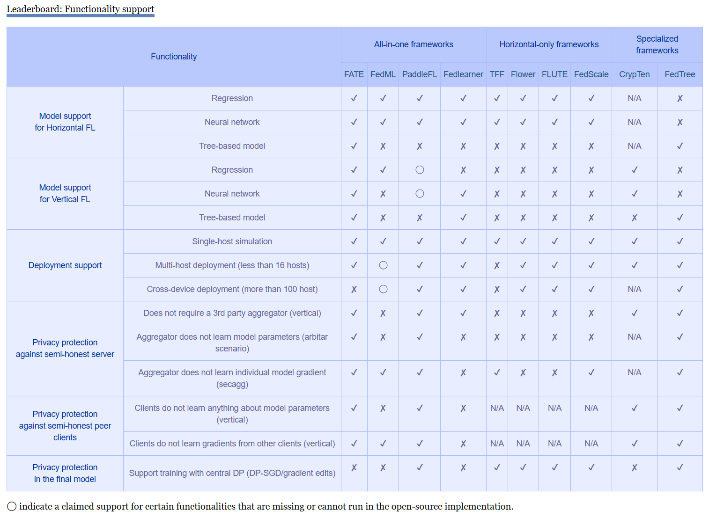

# Federated Learning Resources

[](https://github.com/youngfish42/Awesome-FL/stargazers) [](https://awesome.re) [](https://github.com/youngfish42/image-registration-resources/blob/master/LICENSE)  

---

**Table of Contents**

- [Papers](#papers)
  - [FL in top-tier journal](#fl-in-top-tier-journal)
  - FL in top-tier conference and journal by category
    - [AI](#fl-in-top-ai-conference-and-journal) [ML](#fl-in-top-ml-conference-and-journal) [DM](#fl-in-top-dm-conference-and-journal) [Secure](#fl-in-top-secure-conference-and-journal) [CV](#fl-in-top-cv-conference-and-journal) [NLP](#fl-in-top-nlp-conference-and-journal) [IR](#fl-in-top-ir-conference-and-journal) [DB](#fl-in-top-db-conference-and-journal) [Network](#fl-in-top-network-conference-and-journal) [System](#fl-in-top-system-conference-and-journal) [Others](#fl-in-top-conference-and-journal-other-fields)
  - [FL on Graph Data and Graph Neural Networks](#fl-on-graph-data-and-graph-neural-networks) [](https://dblp.uni-trier.de/search?q=Federated%20graph%7Csubgraph%7Cgnn) 
  - [FL on Tabular Data](#fl-on-tabular-data) [](https://dblp.org/search?q=federate%20tree%7Cboost%7Cbagging%7Cgbdt%7Ctabular%7Cforest%7CXGBoost)
- [Framework](#framework)
- [Datasets](#datasets)
- [Surveys](#surveys)
- [Tutorials and Courses](#tutorials-and-courses)
- Key Conferences/Workshops/Journals
  - [Workshops](#workshops) [Special Issues](#journal-special-issues) [Special Tracks](#conference-special-tracks)
- [Update log](#update-log)
- [Acknowledgments](#acknowledgments)
- [Citation](#citation)


We use another project to automatically track updates to FL papers, click on [FL-paper-update-tracker](https://github.com/youngfish42/FL-paper-update-tracker) if you need it.

**More items will be added to the repository**. Please feel free to suggest other key resources by opening an [issue](https://github.com/youngfish42/Awesome-FL/issues) report, submitting a pull request, or dropping me an email @ ([im.young@foxmail.com](mailto:im.young@foxmail.com)). Enjoy reading!


# papers

**categories**

- Artificial Intelligence (IJCAI, AAAI, AISTATS, ALT, AI)

- Machine Learning (NeurIPS, ICML, ICLR, COLT, UAI, Machine Learning, JMLR, TPAMI)

- Data Mining (KDD, WSDM)

- Secure (S&P, CCS, USENIX Security, NDSS)

- Computer Vision (ICCV, CVPR, ECCV, MM, IJCV)

- Natural Language Processing (ACL, EMNLP, NAACL, COLING)

- Information Retrieval (SIGIR)

- Database (SIGMOD, ICDE, VLDB)

- Network (SIGCOMM, INFOCOM, MOBICOM, NSDI, WWW)

- System (OSDI, SOSP, ISCA, MLSys, EuroSys, TPDS, DAC, TOCS, TOS, TCAD, TC) 

- Others (ICSE, FOCS, STOC)


<details open>
<summary> Events </summary>

| Venue                                                        | 2023-2020                                                    | before 2020                                                  |
| ------------------------------------------------------------ | ------------------------------------------------------------ | ------------------------------------------------------------ |
| [IJCAI](https://dblp.uni-trier.de/search?q=federate%20venue%3AIJCAI%3A) | [23](https://www.ijcai.org/proceedings/2023/), [22](https://www.ijcai.org/proceedings/2022/), [21](https://www.ijcai.org/proceedings/2021/), [20](https://www.ijcai.org/proceedings/2020/) | [19](https://www.ijcai.org/proceedings/2019/)                |
| [AAAI](https://dblp.uni-trier.de/search?q=federate%20venue%3AAAAI%3A) | [23](https://ojs.aaai.org/index.php/AAAI/issue/archive), [22](https://aaai.org/Conferences/AAAI-22/wp-content/uploads/2021/12/AAAI-22_Accepted_Paper_List_Main_Technical_Track.pdf), [21](https://aaai.org/Conferences/AAAI-21/wp-content/uploads/2020/12/AAAI-21_Accepted-Paper-List.Main_.Technical.Track_.pdf), [20](https://aaai.org/Conferences/AAAI-20/wp-content/uploads/2020/01/AAAI-20-Accepted-Paper-List.pdf) | -                                                            |
| [AISTATS](https://dblp.uni-trier.de/search?q=federate%20venue%3AAISTATS%3A) | [23](http://proceedings.mlr.press/v206/), [22](http://proceedings.mlr.press/v151/), [21](http://proceedings.mlr.press/v130/), [20](http://proceedings.mlr.press/v108/) | -                                                            |
| [ALT](https://dblp.uni-trier.de/search?q=federate%20streamid%3Aconf%2Falt%3A) | 22                                                           | -                                                            |
| [AI](https://dblp.uni-trier.de/search?q=federate%20streamid%3Ajournals%2Fai%3A) (J) | -                                                            | -                                                            |
| [NeurIPS](https://dblp.uni-trier.de/search?q=federate%20venue%3ANeurIPS%3A) | [22](https://papers.nips.cc/paper_files/paper/2022), [21](https://papers.nips.cc/paper/2021), [20](https://papers.nips.cc/paper/2020) | [18](https://papers.nips.cc/paper/2018), [17](https://papers.nips.cc/paper/17) |
| [ICML](https://dblp.uni-trier.de/search?q=federate%20venue%3AICML%3A) | [23](https://icml.cc/Conferences/2023/Schedule?type=Poster), [22](https://icml.cc/Conferences/2022/Schedule?type=Poster), [21](https://icml.cc/Conferences/2021/Schedule?type=Poster), [20](https://icml.cc/Conferences/2020/Schedule?type=Poster) | [19](https://icml.cc/Conferences/2019/Schedule?type=Poster)  |
| [ICLR](https://dblp.uni-trier.de/search?q=federate%20venue%3AICLR%3A) | [23](https://openreview.net/group?id=ICLR.cc/2023/Conference), [22](https://openreview.net/group?id=ICLR.cc/2022/Conference), [21](https://openreview.net/group?id=ICLR.cc/2021/Conference), [20](https://openreview.net/group?id=ICLR.cc/2020/Conference) | -                                                            |
| [COLT](https://dblp.org/search?q=federated%20venue%3ACOLT%3A) | [23](https://proceedings.mlr.press/v195/)                    | -                                                            |
| [UAI](https://dblp.org/search?q=federated%20venue%3AUAI%3A)  | [23](https://www.auai.org/uai2023/accepted_papers), [22](https://www.auai.org/uai2022/accepted_papers), [21](https://www.auai.org/uai2021/accepted_papers) | -                                                            |
| [Machine Learning](https://dblp.uni-trier.de/search?q=federate%20streamid%3Ajournals%2Fml%3A) (J) | 23, 22                                                       | -                                                            |
| [JMLR](https://dblp.uni-trier.de/search?q=federated%20streamid%3Ajournals%2Fjmlr%3A) (J) | 23, 22                                                       | -                                                            |
| [TPAMI](https://dblp.uni-trier.de/search?q=federated%20streamid%3Ajournals%2Fpami%3A) (J) | 23, 22                                                       | -                                                            |
| [KDD](https://dblp.uni-trier.de/search?q=federate%20venue%3AKDD%3A) | [23](https://dl.acm.org/doi/proceedings/10.1145/3580305), [22](https://kdd.org/kdd2022/paperRT.html), [21](https://kdd.org/kdd2021/accepted-papers/index), [20](https://www.kdd.org/kdd2020/accepted-papers) |                                                              |
| [WSDM](https://dblp.uni-trier.de/search?q=federate%20venue%3AWSDM%3A) | [23](https://www.wsdm-conference.org/2023/program/accepted-papers), [22](https://www.wsdm-conference.org/2022/accepted-papers/), [21](https://www.wsdm-conference.org/2021/accepted-papers.php) | [19](https://www.wsdm-conference.org/2019/accepted-papers.php) |
| [S&P](https://dblp.uni-trier.de/search?q=federated%20streamid%3Aconf%2Fsp%3A) | [23](https://sp2023.ieee-security.org/program-papers.html), [22](https://www.ieee-security.org/TC/SP2022/program-papers.html) | [19](https://www.ieee-security.org/TC/SP2019/program-papers.html) |
| [CCS](https://dblp.uni-trier.de/search?q=federate%20venue%3ACCS%3A) | [22](https://www.sigsac.org/ccs/CCS2022/program/accepted-papers.html), [21](https://sigsac.org/ccs/CCS2021/accepted-papers.html), [19](https://www.sigsac.org/ccs/CCS2019/index.php/program/accepted-papers/) | [17](https://acmccs.github.io/papers/)                       |
| [USENIX Security](https://dblp.uni-trier.de/search?q=federated%20streamid%3Aconf%2Fuss%3A) | [23](https://www.usenix.org/conference/usenixsecurity23/technical-sessions), [22](https://www.usenix.org/conference/usenixsecurity22/technical-sessions), [20](https://www.usenix.org/conference/usenixsecurity20/technical-sessions) | -                                                            |
| [NDSS](https://dblp.uni-trier.de/search?q=federate%20venue%3ANDSS%3A) | [23](https://www.ndss-symposium.org/ndss2023/accepted-papers/), [22](https://www.ndss-symposium.org/ndss2022/accepted-papers/), [21](https://www.ndss-symposium.org/ndss2021/accepted-papers/) | -                                                            |
| [CVPR](https://dblp.uni-trier.de/search?q=federate%20venue%3ACVPR%3A) | [23](https://openaccess.thecvf.com/CVPR2023?day=all), [22](https://openaccess.thecvf.com/CVPR2022), [21](https://openaccess.thecvf.com/CVPR2021?day=all) | -                                                            |
| [ICCV](https://dblp.uni-trier.de/search?q=federate%20venue%3AICCV%3A) | [23](https://openaccess.thecvf.com/ICCV2023?day=all),[21](https://openaccess.thecvf.com/ICCV2021?day=all) | -                                                            |
| [ECCV](https://dblp.uni-trier.de/search?q=federate%20venue%3AECCV%3A) | [22](https://www.ecva.net/papers.php), [20](https://www.ecva.net/papers.php) | -                                                            |
| [MM](https://dblp.uni-trier.de/search?q=federated%20streamid%3Aconf%2Fmm%3A) | [22](https://dblp.uni-trier.de/db/conf/mm/mm2022.html), [21](https://2021.acmmm.org/main-track-list), [20](https://2020.acmmm.org/main-track-list.html) | -                                                            |
| [IJCV](https://dblp.uni-trier.de/search?q=federate%20streamid%3Ajournals%2Fijcv%3A) (J) | -                                                            | -                                                            |
| [ACL](https://dblp.uni-trier.de/search?q=federate%20venue%3AACL%3A) | [23](https://aclanthology.org/events/acl-2023/), [22](https://aclanthology.org/events/acl-2022/), [21](https://aclanthology.org/events/acl-2021/) | [19](https://aclanthology.org/events/acl-2019/)              |
| [NAACL](https://dblp.uni-trier.de/search?q=federate%20venue%3ANAACL-HLT%3A) | [22](https://aclanthology.org/events/naacl-2022/), [21](https://aclanthology.org/events/naacl-2021/) | -                                                            |
| [EMNLP](https://dblp.uni-trier.de/search?q=federate%20venue%3AEMNLP%3A) | [22](https://aclanthology.org/events/emnlp-2022/), [21](https://aclanthology.org/events/emnlp-2021/), [20](https://aclanthology.org/events/emnlp-2020/) | -                                                            |
| [COLING](https://dblp.uni-trier.de/search?q=federate%20venue%3ACOLING%3A) | [20](https://aclanthology.org/events/coling-2020/)           | -                                                            |
| [SIGIR](https://dblp.uni-trier.de/search?q=federate%20venue%3ASIGIR%3A) | [23](https://dl.acm.org/doi/proceedings/10.1145/3539618), [22](https://dl.acm.org/doi/proceedings/10.1145/3477495), [21](https://dl.acm.org/doi/proceedings/10.1145/3404835), [20](https://dl.acm.org/doi/proceedings/10.1145/3397271) | -                                                            |
| [SIGMOD](https://dblp.uni-trier.de/search?q=federated%20streamid%3Aconf%2Fsigmod%3A) | [22](https://2022.sigmod.org/sigmod_research_list.shtml), [21](https://2021.sigmod.org/sigmod_research_list.shtml) | -                                                            |
| [ICDE](https://dblp.uni-trier.de/search?q=federate%20venue%3AICDE%3A) | [23](https://icde2023.ics.uci.edu/papers-research-track/), [22](https://icde2022.ieeecomputer.my/accepted-research-track/), [21](https://ieeexplore.ieee.org/xpl/conhome/9458599/proceeding) | -                                                            |
| [VLDB](https://dblp.org/search?q=federated%20streamid%3Ajournals%2Fpvldb%3A) | 23, [22](https://vldb.org/pvldb/vol16-volume-info/), [21](https://vldb.org/pvldb/vol15-volume-info/), [21](http://www.vldb.org/pvldb/vol14/), [20](http://vldb.org/pvldb/vol13-volume-info/) | -                                                            |
| [SIGCOMM](https://dblp.uni-trier.de/search?q=federate%20venue%3ASIGCOMM%3A) | -                                                            | -                                                            |
| [INFOCOM](https://dblp.uni-trier.de/search?q=federate%20venue%3AINFOCOM%3A) | [23](https://infocom2023.ieee-infocom.org/program/accepted-paper-list-main-conference), [22](https://infocom2022.ieee-infocom.org/program/accepted-paper-list-main-conference), [21](https://infocom2021.ieee-infocom.org/accepted-paper-list-main-conference.html), [20](https://infocom2020.ieee-infocom.org/accepted-paper-list-main-conference.html) | [19](https://infocom2019.ieee-infocom.org/accepted-paper-list-main-conference.html), 18 |
| [MobiCom](https://dblp.uni-trier.de/search?q=federate%20venue%3AMobiCom%3A) | [23](https://www.sigmobile.org/mobicom/2023/accepted.html), [22](https://www.sigmobile.org/mobicom/2022/accepted.html), [21](https://www.sigmobile.org/mobicom/2021/accepted.html), [20](https://www.sigmobile.org/mobicom/2020/accepted.php) |                                                              |
| [NSDI](https://dblp.uni-trier.de/search?q=federate%20venue%3ANSDI%3A) | 23([1](https://www.usenix.org/conference/nsdi23/spring-accepted-papers), [2](https://www.usenix.org/conference/nsdi23/fall-accepted-papers)) | -                                                            |
| [WWW](https://dblp.uni-trier.de/search?q=federate%20venue%3AWWW%3A) | [23](https://www2023.thewebconf.org/program/accepted-papers/), [22](https://www2022.thewebconf.org/accepted-papers/), [21](https://www2021.thewebconf.org/program/papers-program/links/index.html) |                                                              |
| [OSDI](https://dblp.org/search?q=federated%20venue%3AOSDI%3A) | 21                                                           | -                                                            |
| [SOSP](https://dblp.org/search?q=federated%20venue%3ASOSP%3A) | 21                                                           | -                                                            |
| [ISCA](https://dblp.org/search?q=federated%20venue%3AISCA%3A) | -                                                            | -                                                            |
| [MLSys](https://dblp.org/search?q=federated%20venue%3AMLSys%3A) | [23](https://proceedings.mlsys.org/paper_files/paper/2023), [22](https://proceedings.mlsys.org/paper_files/paper/2022), [20](https://proceedings.mlsys.org/paper_files/paper/2020) | [19](https://proceedings.mlsys.org/paper_files/paper/2019)   |
| [EuroSys](https://dblp.uni-trier.de/search?q=federated%20streamid%3Aconf%2Feurosys%3A) | [23](https://2023.eurosys.org/accepted-papers.html), 22, 21, 20 |                                                              |
| [TPDS](https://dblp.uni-trier.de/search?q=federated%20streamid%3Ajournals%2Ftpds%3A) (J) | 23, 22, 21, 20                                               | -                                                            |
| [DAC](https://dblp.uni-trier.de/search?q=federate%20venue%3ADAC%3A) | 22, 21                                                       | -                                                            |
| [TOCS](https://dblp.uni-trier.de/search?q=federate%20streamid%3Ajournals%2Ftocs%3A) | -                                                            | -                                                            |
| [TOS](https://dblp.uni-trier.de/search?q=federate%20streamid%3Ajournals%2Ftos%3A) | -                                                            | -                                                            |
| [TCAD](https://dblp.uni-trier.de/search?q=federate%20streamid%3Ajournals%2Ftcad%3A) | 23, 22, 21                                                   | -                                                            |
| [TC](https://dblp.uni-trier.de/search?q=federate%20streamid%3Ajournals%2Ftc%3A) | 23, 22, 21                                                   | -                                                            |
| [ICSE](https://dblp.uni-trier.de/search?q=federated%20streamid%3Aconf%2Ficse%3A) | [23](https://conf.researchr.org/track/icse-2023/icse-2023-technical-track?#event-overview), 21 | -                                                            |
| [FOCS](https://dblp.uni-trier.de/search?q=federate%20streamid%3Ajournals%2Ffocs%3A) | -                                                            | -                                                            |
| [STOC](https://dblp.uni-trier.de/search?q=federate%20streamid%3Aconf%2Fstoc%3A) | -                                                            | -                                                            |

</details>


**keywords**

Statistics: :fire: code is available & stars >= 100 | :star: citation >= 50 | :mortar_board: Top-tier venue 

**`kg.`**: Knowledge Graph |   **`data.`**: dataset  |   **`surv.`**: survey


## fl in top-tier journal

Papers of federated learning in Nature(and its sub-journals), Cell, Science(and Science Advances) and PANS refers to [WOS](https://www.webofscience.com/wos/woscc/summary/ed3f4552-5450-4de7-bf2c-55d01e20d5de-4301299e/relevance/1) search engine.

<details open>
<summary>fl in top-tier journal</summary>
<!-- START:fl-in-top-tier-journal -->

|Title                                                           |    Affiliation    |    Venue                    |    Year    |    Materials|
| ------------------------------------------------------------ | ----------- | --------------------- | ---- | ------------------------------------------------------------ |
| Advocating for neurodata privacy and neurotechnology regulation | Columbia University | Nat. Protoc. (Perspective) | 2023 | [[PUB](https://www.nature.com/articles/s41596-023-00873-0)] |
| Federated benchmarking of medical artificial intelligence with MedPerf | IHU Strasbourg; University of Strasbourg; Dana-Farber Cancer Institute; Weill Cornell Medicine; Harvard T.H. Chan School of Public Health; MIT; Intel | Nat. Mach. Intell. | 2023 | [[PUB](https://www.nature.com/articles/s42256-023-00652-2)] [[PDF](https://arxiv.org/abs/2110.01406)] [[CODE](https://github.com/mlcommons/MedPerf)] |
| Algorithmic fairness in artificial intelligence for medicine and healthcare | Harvard Medical School; Broad Institute of Harvard and Massachusetts Institute of Technology; Dana-Farber Cancer Institute | Nat. Biomed. Eng. (Perspective) | 2023 | [[PUB](https://www.nature.com/articles/s41551-023-01056-8)] [[PDF](https://arxiv.org/abs/2110.00603)] |
| Differentially private knowledge transfer for federated learning | THU | Nat. Commun. | 2023 | [[PUB](https://www.nature.com/articles/s41467-023-38794-x)] [[CODE](https://github.com/taoqi98/PrivateKT)] |
| Decentralized federated learning through proxy model sharing | Layer 6 AI; University of Waterloo; Vector Institute | Nat. Commun. | 2023 | [[PUB](https://www.nature.com/articles/s41467-023-38569-4)] [[PDF](https://arxiv.org/abs/2111.11343)] [[CODE](https://github.com/layer6ai-labs/ProxyFL)] |
| Federated machine learning in data-protection-compliant research | University of Hamburg | Nat. Mach. Intell.(Comment) | 2023 | [[PUB](https://www.nature.com/articles/s42256-022-00601-5)] |
| Federated learning for predicting histological response to neoadjuvant chemotherapy in triple-negative breast cancer | Owkin | Nat. Med. | 2023 | [[PUB](https://www.nature.com/articles/s41591-022-02155-w)] [[CODE](https://github.com/Substra/substra)] |
| Federated learning enables big data for rare cancer boundary detection | University of Pennsylvania | Nat. Commun. | 2022 | [[PUB](https://www.nature.com/articles/s41467-022-33407-5)] [[PDF](https://arxiv.org/abs/2204.10836)] [[CODE](https://github.com/FETS-AI/Front-End)] |
| Federated learning and Indigenous genomic data sovereignty | Hugging Face | Nat. Mach. Intell. (Comment) | 2022 | [[PUB](https://www.nature.com/articles/s42256-022-00551-y)] |
| Federated disentangled representation learning for unsupervised brain anomaly detection | TUM | Nat. Mach. Intell. | 2022 | [[PUB](https://www.nature.com/articles/s42256-022-00515-2)] [[PDF](https://doi.org/https://doi.org/10.21203/rs.3.rs-722389/v1)] [[CODE](https://doi.org/10.5281/zenodo.6604161)] |
| Shifting machine learning for healthcare from development to deployment and from models to data | Stanford University; Greenstone Biosciences | Nat. Biomed. Eng. (Review Article) | 2022 | [[PUB](https://www.nature.com/articles/s41551-022-00898-y)] |
| A federated graph neural network framework for privacy-preserving personalization | THU | Nat. Commun. | 2022 | [[PUB](https://www.nature.com/articles/s41467-022-30714-9)] [[CODE](https://github.com/wuch15/FedPerGNN)] [[解读](https://zhuanlan.zhihu.com/p/487383715)] |
| Communication-efficient federated learning via knowledge distillation | THU | Nat. Commun. | 2022 | [[PUB](https://www.nature.com/articles/s41467-022-29763-x)] [[PDF](https://arxiv.org/abs/2108.13323)] [[CODE](https://zenodo.org/record/6383473)] |
| Lead federated neuromorphic learning for wireless edge artificial intelligence | XMU; NTU | Nat. Commun. | 2022 | [[PUB](https://www.nature.com/articles/s41467-022-32020-w)] [[CODE](https://github.com/GOGODD/FL-EDGE-COMPUTING/releases/tag/federated_learning)] [[解读](https://zhuanlan.zhihu.com/p/549087420)] |
| Advancing COVID-19 diagnosis with privacy-preserving collaboration in artificial intelligence | HUST | Nat. Mach. Intell. | 2021 | [[PUB](https://www.nature.com/articles/s42256-021-00421-z)] [[PDF](https://arxiv.org/abs/2111.09461)] [[CODE](https://github.com/HUST-EIC-AI-LAB/UCADI)] |
| Federated learning for predicting clinical outcomes in patients with COVID-19 | MGH radiology and Harvard Medical School | Nat. Med. | 2021 | [[PUB](https://www.nature.com/articles/s41591-021-01506-3)] [[CODE](https://www.nature.com/articles/s41591-021-01506-3#code-availability)] |
| Adversarial interference and its mitigations in privacy-preserving collaborative machine learning | Imperial College London; TUM;  OpenMined | Nat. Mach. Intell.(Perspective) | 2021 | [[PUB](https://www.nature.com/articles/s42256-021-00390-3)] |
| Swarm Learning for decentralized and confidential clinical machine learning :star: | DZNE; University of Bonn; | Nature :mortar_board: | 2021 | [[PUB](https://www.nature.com/articles/s41586-021-03583-3)] [[CODE](https://github.com/HewlettPackard/swarm-learning)] [[SOFTWARE](https://myenterpriselicense.hpe.com)] [[解读](https://zhuanlan.zhihu.com/p/379434722)] |
| End-to-end privacy preserving deep learning on multi-institutional medical imaging | TUM; Imperial College London; OpenMined | Nat. Mach. Intell. | 2021 | [[PUB](https://www.nature.com/articles/s42256-021-00337-8)] [[CODE](https://doi.org/10.5281/zenodo.4545599)] [[解读](https://zhuanlan.zhihu.com/p/484801505)] |
| Communication-efficient federated learning | CUHK; Princeton University | PANS. | 2021 | [[PUB](https://www.pnas.org/doi/full/10.1073/pnas.2024789118)] [[CODE](https://code.ihub.org.cn/projects/4394/repository/revisions/master/show/PNAS)] |
| Breaking medical data sharing boundaries by using synthesized radiographs | RWTH Aachen University | Science. Advances. | 2020 | [[PUB](https://www.science.org/doi/10.1126/sciadv.abb7973)] [[CODE](https://github.com/peterhan91/Thorax_GAN)] |
| Secure, privacy-preserving and federated machine learning in medical imaging :star: | TUM; Imperial College London; OpenMined | Nat. Mach. Intell.(Perspective) | 2020 | [[PUB](https://www.nature.com/articles/s42256-020-0186-1)] |

<!-- END:fl-in-top-tier-journal -->

</details>


## fl in top ai conference and journal

Federated Learning papers accepted by top AI(Artificial Intelligence) conference and journal, Including [IJCAI](https://dblp.org/db/conf/ijcai/index.html)(International Joint Conference on Artificial Intelligence), [AAAI](https://dblp.uni-trier.de/db/conf/aaai/index.html)(AAAI Conference on Artificial Intelligence), [AISTATS](https://dblp.uni-trier.de/db/conf/aistats/index.html)(Artificial Intelligence and Statistics), [ALT](https://dblp.org/db/conf/alt/index.html)(International Conference on Algorithmic Learning Theory), [AI](https://dblp.uni-trier.de/db/journals/ai/index.html)(Artificial Intelligence).

- [IJCAI](https://dblp.uni-trier.de/search?q=federate%20venue%3AIJCAI%3A) [2023](https://www.ijcai.org/proceedings/2023/), [2022](https://www.ijcai.org/proceedings/2022/), [2021](https://www.ijcai.org/proceedings/2021/), [2020](https://www.ijcai.org/proceedings/2020/), [2019](https://www.ijcai.org/proceedings/2019/)
- [AAAI](https://dblp.uni-trier.de/search?q=federate%20venue%3AAAAI%3A) [2023](https://ojs.aaai.org/index.php/AAAI/issue/archive), [2022](https://aaai.org/Conferences/AAAI-22/wp-content/uploads/2021/12/AAAI-22_Accepted_Paper_List_Main_Technical_Track.pdf), [2021](https://aaai.org/Conferences/AAAI-21/wp-content/uploads/2020/12/AAAI-21_Accepted-Paper-List.Main_.Technical.Track_.pdf), [2020](https://aaai.org/Conferences/AAAI-20/wp-content/uploads/2020/01/AAAI-20-Accepted-Paper-List.pdf)
- [AISTATS](https://dblp.uni-trier.de/search?q=federate%20venue%3AAISTATS%3A) [2023](http://proceedings.mlr.press/v206/), [2022](http://proceedings.mlr.press/v151/), [2021](http://proceedings.mlr.press/v130/), [2020](http://proceedings.mlr.press/v108/)
- [ALT](https://dblp.uni-trier.de/search?q=federate%20streamid%3Aconf%2Falt%3A) 2022
- [AI](https://dblp.uni-trier.de/search?q=federate%20streamid%3Ajournals%2Fai%3A) NULL

<details open>
<summary>fl in top ai conference and journal</summary>
<!-- START:fl-in-top-ai-conference-and-journal -->

|Title                                                           |    Affiliation                                                     |    Venue      |    Year    |    Materials|
| ------------------------------------------------------------ | ------------------------------------------------------------ | ------- | ---- | ------------------------------------------------------------ |
| Privacy-preserving graph convolution network for federated item recommendation | SZU | AI | 2023 | [[PUB](https://www.sciencedirect.com/science/article/abs/pii/S000437022300142X)] |
| Win-Win: A Privacy-Preserving Federated Framework for Dual-Target Cross-Domain Recommendation | CAS; UCAS; JD Technology; JD Intelligent Cities Research | AAAI | 2023 | [[PUB](https://ojs.aaai.org/index.php/AAAI/article/view/25531)] |
| Untargeted Attack against Federated Recommendation Systems via Poisonous Item Embeddings and the Defense | USTC; State Key Laboratory of Cognitive Intelligence | AAAI | 2023 | [[PUB](https://ojs.aaai.org/index.php/AAAI/article/view/25611)] [[PDF](https://arxiv.org/abs/2212.05399)] [[CODE](https://github.com/yflyl613/fedrec)] |
| Incentive-Boosted Federated Crowdsourcing | SDU | AAAI | 2023 | [[PUB](https://ojs.aaai.org/index.php/AAAI/article/view/25744)] [[PDF](https://arxiv.org/abs/2211.14439)] |
| Tackling Data Heterogeneity in Federated Learning with Class Prototypes | Lehigh University | AAAI | 2023 | [[PUB](https://ojs.aaai.org/index.php/AAAI/article/view/25891)] [[PDF](https://arxiv.org/abs/2212.02758)] [[CODE](https://github.com/yutong-dai/fednh)] |
| FairFed: Enabling Group Fairness in Federated Learning | USC | AAAI | 2023 | [[PUB](https://ojs.aaai.org/index.php/AAAI/article/view/25911)] [[PDF](https://arxiv.org/abs/2110.00857)] [[解读](https://zhuanlan.zhihu.com/p/613201113)] |
| Federated Robustness Propagation: Sharing Adversarial Robustness in Heterogeneous Federated Learning | MSU | AAAI | 2023 | [[PUB](https://ojs.aaai.org/index.php/AAAI/article/view/25955)] |
| Complement Sparsification: Low-Overhead Model Pruning for Federated Learning | NJIT | AAAI | 2023 | [[PUB](https://ojs.aaai.org/index.php/AAAI/article/view/25977)] |
| Almost Cost-Free Communication in Federated Best Arm Identification | NUS | AAAI | 2023 | [[PUB](https://ojs.aaai.org/index.php/AAAI/article/view/26010)] [[PDF](https://arxiv.org/abs/2208.09215)] |
| Layer-Wise Adaptive Model Aggregation for Scalable Federated Learning | University of Southern California Inha University | AAAI | 2023 | [[PUB](https://ojs.aaai.org/index.php/AAAI/article/view/26023)] [[PDF](https://arxiv.org/abs/2110.10302)] |
| Poisoning with Cerberus: Stealthy and Colluded Backdoor Attack against Federated Learning | BJTU | AAAI | 2023 | [[PUB](https://ojs.aaai.org/index.php/AAAI/article/view/26083)] |
| FedMDFG: Federated Learning with Multi-Gradient Descent and Fair Guidance | CUHK; The Shenzhen Institute of Artificial Intelligence and Robotics for Society | AAAI | 2023 | [[PUB](https://ojs.aaai.org/index.php/AAAI/article/view/26122)] |
| Securing Secure Aggregation: Mitigating Multi-Round Privacy Leakage in Federated Learning | USC | AAAI | 2023 | [[PUB](https://ojs.aaai.org/index.php/AAAI/article/view/26177)] [[PDF](https://arxiv.org/abs/2106.03328)] [[VIDEO](https://slideslive.com/38960185/securing-secure-aggregation-mitigating-multiround-privacy-leakage-in-federated-learning)] [[CODE](https://openreview.net/attachment?id=nVV6S2sb_UL&name=supplementary_material)] |
| Federated Learning on Non-IID Graphs via Structural Knowledge Sharing | UTS | AAAI | 2023 | [[PUB](https://ojs.aaai.org/index.php/AAAI/article/view/26187)] [[PDF](https://arxiv.org/abs/2211.13009)] [[CODE](https://github.com/yuetan031/fedstar)] |
| Efficient  Distribution Similarity Identification in Clustered Federated Learning  via Principal Angles between Client Data Subspaces | UCSD | AAAI | 2023 | [[PUB](https://ojs.aaai.org/index.php/AAAI/article/view/26197)] [[PDF](https://arxiv.org/abs/2209.10526)] [[CODE](https://github.com/mmorafah/pacfl)] |
| FedABC: Targeting Fair Competition in Personalized Federated Learning | WHU; Hubei Luojia Laboratory; JD Explore Academy | AAAI | 2023 | [[PUB](https://ojs.aaai.org/index.php/AAAI/article/view/26203)] [[PDF](https://arxiv.org/abs/2302.07450)] |
| Beyond ADMM: A Unified Client-Variance-Reduced Adaptive Federated Learning Framework | SUTD | AAAI | 2023 | [[PUB](https://ojs.aaai.org/index.php/AAAI/article/view/26212)] [[PDF](https://arxiv.org/abs/2212.01519)] |
| FedGS: Federated Graph-Based Sampling with Arbitrary Client Availability | XMU | AAAI | 2023 | [[PUB](https://ojs.aaai.org/index.php/AAAI/article/view/26223)] [[PDF](https://arxiv.org/abs/2211.13975)] [[CODE](https://github.com/wwzzz/fedgs)] |
| Faster Adaptive Federated Learning | University of Pittsburgh | AAAI | 2023 | [[PUB](https://ojs.aaai.org/index.php/AAAI/article/view/26235)] [[PDF](https://arxiv.org/abs/2212.00974)] |
| FedNP: Towards Non-IID Federated Learning via Federated Neural Propagation | HKUST | AAAI | 2023 | [[PUB](https://ojs.aaai.org/index.php/AAAI/article/view/26237)] [[CODE](https://github.com/CodePothunter/fednp)] [[VIDEO](https://www.youtube.com/watch?v=3XM_NNvXCBo)] [[SUPP](https://github.com/CodePothunter/fednp/blob/main/appendix.pdf)] |
| Bayesian Federated Neural Matching That Completes Full Information | TJU | AAAI | 2023 | [[PUB](https://ojs.aaai.org/index.php/AAAI/article/view/26245)] [[PDF](https://arxiv.org/abs/2211.08010)] |
| CDMA: A Practical Cross-Device Federated Learning Algorithm for General Minimax Problems | ZJU | AAAI | 2023 | [[PUB](https://ojs.aaai.org/index.php/AAAI/article/view/26246)] [[PDF](https://arxiv.org/abs/2105.14216)] [[CODE](https://github.com/xjiajiahao/federated-minimax)] |
| Federated Generative Model on Multi-Source Heterogeneous Data in IoT | GSU | AAAI | 2023 | [[PUB](https://ojs.aaai.org/index.php/AAAI/article/view/26252)] |
| DeFL: Defending against Model Poisoning Attacks in Federated Learning via Critical Learning Periods Awareness | SUNY-Binghamton University | AAAI | 2023 | [[PUB](https://ojs.aaai.org/index.php/AAAI/article/view/26271)] |
| FedALA: Adaptive Local Aggregation for Personalized Federated Learning | SJTU | AAAI | 2023 | [[PUB](https://ojs.aaai.org/index.php/AAAI/article/view/26330)] [[PDF](https://arxiv.org/abs/2212.01197)] [[CODE](https://github.com/tsingz0/fedala)] |
| Delving into the Adversarial Robustness of Federated Learning | ZJU | AAAI | 2023 | [[PUB](https://ojs.aaai.org/index.php/AAAI/article/view/26331)] [[PDF](https://arxiv.org/abs/2302.09479)] |
| On the Vulnerability of Backdoor Defenses for Federated Learning | TJU | AAAI | 2023 | [[PUB](https://ojs.aaai.org/index.php/AAAI/article/view/26393)] [[PDF](https://arxiv.org/abs/2301.08170)] [[CODE](https://github.com/jinghuichen/focused-flip-federated-backdoor-attack)] |
| Echo of Neighbors: Privacy Amplification for Personalized Private Federated Learning with Shuffle Model | RUC; Engineering Research Center of Ministry of Education on Database and BI | AAAI | 2023 | [[PUB](https://ojs.aaai.org/index.php/AAAI/article/view/26400)] [[PDF](https://arxiv.org/abs/2304.05516)] |
| DPAUC: Differentially Private AUC Computation in Federated Learning | ByteDance Inc. | AAAI Special Tracks | 2023 | [[PUB](https://ojs.aaai.org/index.php/AAAI/article/view/26770)] [[PDF](https://arxiv.org/abs/2208.12294)] [[CODE](https://github.com/bytedance/fedlearner)] |
| Efficient Training of Large-Scale Industrial Fault Diagnostic Models through Federated Opportunistic Block Dropout | NTU | AAAI Special Programs | 2023 | [[PUB](https://ojs.aaai.org/index.php/AAAI/article/view/26836)] [[PDF](https://arxiv.org/abs/2302.11485)] |
| Industry-Scale Orchestrated Federated Learning for Drug Discovery | KU Leuven | AAAI Special Programs | 2023 | [[PUB](https://ojs.aaai.org/index.php/AAAI/article/view/26847)] [[PDF](https://arxiv.org/abs/2210.08871)] [[VIDEO](https://www.youtube.com/watch?v=J_RmZhKzBcA)] |
| A Federated Learning Monitoring Tool for Self-Driving Car Simulation (Student Abstract) | CNU | AAAI Special Programs | 2023 | [[PUB](https://ojs.aaai.org/index.php/AAAI/article/view/26984)] |
| MGIA: Mutual Gradient Inversion Attack in Multi-Modal Federated Learning (Student Abstract) | PolyU | AAAI Special Programs | 2023 | [[PUB](https://ojs.aaai.org/index.php/AAAI/article/view/26995)] |
| Clustered Federated Learning for Heterogeneous Data (Student Abstract) | RUC | AAAI Special Programs | 2023 | [[PUB](https://ojs.aaai.org/index.php/AAAI/article/view/27049)] |
| FedSampling: A Better Sampling Strategy for Federated Learning | THU | IJCAI | 2023 | [[PUB](https://www.ijcai.org/proceedings/2023/462)] [[PDF](https://arxiv.org/abs/2306.14245)] [[CODE](https://github.com/taoqi98/FedSampling)] |
| HyperFed: Hyperbolic Prototypes Exploration with Consistent Aggregation for Non-IID Data in Federated Learning | ZJU | IJCAI | 2023 | [[PUB](https://www.ijcai.org/proceedings/2023/440)] [[PDF](https://arxiv.org/abs/2307.14384)] |
| FedOBD: Opportunistic Block Dropout for Efficiently Training Large-scale Neural Networks through Federated Learning | NTU | IJCAI | 2023 | [[PUB](https://www.ijcai.org/proceedings/2023/394)] [[PDF](https://arxiv.org/abs/2208.05174)] [[CODE](https://github.com/cyyever/distributed_learning_simulator)] |
| Federated Probabilistic Preference Distribution Modelling with  Compactness Co-Clustering for Privacy-Preserving Multi-Domain  Recommendation | ZJU | IJCAI | 2023 | [[PUB](https://www.ijcai.org/proceedings/2023/245)] |
| Federated Graph Semantic and Structural Learning | WHU | IJCAI | 2023 | [[PUB](https://www.ijcai.org/proceedings/2023/426)] |
| BARA: Efficient Incentive Mechanism with Online Reward Budget Allocation in Cross-Silo Federated Learning | SYSU | IJCAI | 2023 | [[PUB](https://www.ijcai.org/proceedings/2023/498)] [[PDF](https://arxiv.org/abs/2305.05221)] |
| FedDWA: Personalized Federated Learning with Dynamic Weight Adjustment | SYSU | IJCAI | 2023 | [[PUB](https://www.ijcai.org/proceedings/2023/444)] [[PDF](https://arxiv.org/abs/2305.06124)] |
| FedPass: Privacy-Preserving Vertical Federated Deep Learning with Adaptive Obfuscation | Webank | IJCAI | 2023 | [[PUB](https://www.ijcai.org/proceedings/2023/418)] [[PDF](https://arxiv.org/abs/2301.12623)] |
| Globally Consistent Federated Graph Autoencoder for Non-IID Graphs | FZU | IJCAI | 2023 | [[PUB](https://www.ijcai.org/proceedings/2023/419)] [[CODE](https://github.com/gcfgae/GCFGAE)] |
| Competitive-Cooperative Multi-Agent Reinforcement Learning for Auction-based Federated Learning | NTU | IJCAI | 2023 | [[PUB](https://www.ijcai.org/proceedings/2023/474)] |
| Dual Personalization on Federated Recommendation | JLU; University of Technology Sydney | IJCAI | 2023 | [[PUB](https://www.ijcai.org/proceedings/2023/507)] [[PDF](https://arxiv.org/abs/2301.08143)] [[CODE](https://github.com/zhangcx19/ijcai-23-pfedrec)] |
| FedNoRo: Towards Noise-Robust Federated Learning by Addressing Class Imbalance and Label Noise Heterogeneity | HUST | IJCAI | 2023 | [[PUB](https://www.ijcai.org/proceedings/2023/492)] [[PDF](https://arxiv.org/abs/2305.05230)] [[CODE](https://github.com/wnn2000/fednoro)] |
| Denial-of-Service or Fine-Grained Control: Towards Flexible Model Poisoning Attacks on Federated Learning | Xiangtan University | IJCAI | 2023 | [[PUB](https://www.ijcai.org/proceedings/2023/508)] [[PDF](https://arxiv.org/abs/2304.10783)] [[CODE](https://github.com/zhanghangtao/poisoning-attack-on-fl)] |
| FedHGN: A Federated Framework for Heterogeneous Graph Neural Networks | CUHK | IJCAI | 2023 | [[PUB](https://www.ijcai.org/proceedings/2023/412)] [[PDF](https://arxiv.org/abs/2305.09729)] [[CODE](https://github.com/cynricfu/fedhgn)] |
| FedET: A Communication-Efficient Federated Class-Incremental Learning Framework Based on Enhanced Transformer | Ping An Technology; THU | IJCAI | 2023 | [[PUB](https://www.ijcai.org/proceedings/2023/443)] [[PDF](https://arxiv.org/abs/2306.15347)] |
| Prompt Federated Learning for Weather Forecasting: Toward Foundation Models on Meteorological Data | UTS | IJCAI | 2023 | [[PUB](https://www.ijcai.org/proceedings/2023/393)] [[PDF](https://arxiv.org/abs/2301.09152)] [[CODE](https://github.com/shengchaochen82/metepfl)] |
| FedBFPT: An Efficient Federated Learning Framework for Bert Further Pre-training | ZJU | IJCAI | 2023 | [[PUB](https://www.ijcai.org/proceedings/2023/483)] [[CODE](https://github.com/Hanzhouu/FedBFPT)] |
| Bayesian Federated Learning: A Survey |  | IJCAI Survey Track | 2023 | [[PDF](https://arxiv.org/abs/2304.13267)] |
| A Survey of Federated Evaluation in Federated Learning | Macquarie University | IJCAI Survey Track | 2023 | [[PUB](https://www.ijcai.org/proceedings/2023/758)] [[PDF](https://arxiv.org/abs/2305.08070)] |
| SAMBA: A Generic Framework for Secure Federated Multi-Armed Bandits (Extended Abstract) | INSA Centre Val de Loire | IJCAI Journal Track | 2023 | [[PUB](https://www.ijcai.org/proceedings/2023/772)] |
| The communication cost of security and privacy in federated frequency estimation | Stanford | AISTATS | 2023 | [[PUB](https://proceedings.mlr.press/v206/chen23e.html)] [[CODE](https://colab.research.google.com/drive/1A3sp42a4RKswxjCOBAXlfUxBzL5IF431?usp=share_link)] |
| Efficient and Light-Weight Federated Learning via Asynchronous Distributed Dropout | Rice University | AISTATS | 2023 | [[PUB](https://proceedings.mlr.press/v206/dun23a.html)] [[CODE](https://github.com/dunchen/AsyncDrop__Release)] |
| Federated Learning under Distributed Concept Drift | CMU | AISTATS | 2023 | [[PUB](https://proceedings.mlr.press/v206/jothimurugesan23a.html)] [[CODE](https://github.com/microsoft/FedDrift)] |
| Characterizing Internal Evasion Attacks in Federated Learning | CMU | AISTATS | 2023 | [[PUB](https://proceedings.mlr.press/v206/kim23a.html)] [[CODE](https://github.com/tj-kim/pFedDef_v1)] |
| Federated Asymptotics: a model to compare federated learning algorithms | Stanford | AISTATS | 2023 | [[PUB](https://proceedings.mlr.press/v206/cheng23b.html)] [[CODE](https://github.com/garyxcheng/personalized-federated-learning)] |
| Private Non-Convex Federated Learning Without a Trusted Server | USC | AISTATS | 2023 | [[PUB](https://proceedings.mlr.press/v206/lowy23a.html)] [[CODE](https://github.com/ghafeleb/Private-NonConvex-Federated-Learning-Without-a-Trusted-Server)] |
| Federated Learning for Data Streams | Universit ́ e Cˆ ote d’Azur | AISTATS | 2023 | [[PUB](https://proceedings.mlr.press/v206/marfoq23a.html)] [[CODE](https://github.com/omarfoq/streaming-fl)] |
| Nothing but Regrets — Privacy-Preserving Federated Causal Discovery | Helmholtz Centre for Information Security | AISTATS | 2023 | [[PUB](https://proceedings.mlr.press/v206/mian23a.html)] [[CODE](https://eda.rg.cispa.io/prj/peri/)] |
| Active Membership Inference Attack under Local Differential Privacy in Federated Learning | UFL | AISTATS | 2023 | [[PUB](https://proceedings.mlr.press/v206/nguyen23e.html)] [[CODE](https://github.com/trucndt/ami)] |
| Federated Averaging Langevin Dynamics: Toward a unified theory and new algorithms | CMAP | AISTATS | 2023 | [[PUB](https://proceedings.mlr.press/v206/plassier23a.html)] |
| Byzantine-Robust Federated Learning with Optimal Statistical Rates | UC Berkeley | AISTATS | 2023 | [[PUB](https://github.com/wanglun1996/secure-robust-federated-learning)] [[CODE](https://github.com/wanglun1996/secure-robust-federated-learning)] |
| Federated Learning on Non-IID Graphs via Structural Knowledge Sharing | UTS | AAAI | 2023 | [[PDF](https://arxiv.org/abs/2211.13009)] [[CODE](https://github.com/yuetan031/fedstar)] |
| FedGS: Federated Graph-based Sampling with Arbitrary Client Availability | XMU | AAAI | 2023 | [[PDF](https://arxiv.org/abs/2211.13975)] [[CODE](https://github.com/wwzzz/fedgs)] |
| Incentive-boosted Federated Crowdsourcing | SDU | AAAI | 2023 | [[PDF](https://arxiv.org/abs/2211.14439)] |
| Towards Understanding Biased Client Selection in Federated Learning. | CMU | AISTATS | 2022 | [[PUB](https://proceedings.mlr.press/v151/jee-cho22a.html)] [[CODE](https://proceedings.mlr.press/v151/jee-cho22a/jee-cho22a-supp.zip)] |
| FLIX: A Simple and Communication-Efficient Alternative to Local Methods in Federated Learning | KAUST | AISTATS | 2022 | [[PUB](https://proceedings.mlr.press/v151/gasanov22a.html)] [[PDF](https://arxiv.org/abs/2111.11556)] [[CODE](https://proceedings.mlr.press/v151/gasanov22a/gasanov22a-supp.zip)] |
| Sharp Bounds for Federated Averaging (Local SGD) and Continuous Perspective. | Stanford | AISTATS | 2022 | [[PUB](https://proceedings.mlr.press/v151/glasgow22a.html)] [[PDF](https://arxiv.org/abs/2111.03741)] [[CODE](https://github.com/hongliny/sharp-bounds-for-fedavg-and-continuous-perspective)] |
| Federated Reinforcement Learning with Environment Heterogeneity. | PKU | AISTATS | 2022 | [[PUB](https://proceedings.mlr.press/v151/jin22a.html)] [[PDF](https://arxiv.org/abs/2204.02634)] [[CODE](https://github.com/pengyang7881187/fedrl)] |
| Federated Myopic Community Detection with One-shot Communication | Purdue | AISTATS | 2022 | [[PUB](https://proceedings.mlr.press/v151/ke22a.html)] [[PDF](https://arxiv.org/abs/2106.07255)] |
| Asynchronous Upper Confidence Bound Algorithms for Federated Linear Bandits. | University of Virginia | AISTATS | 2022 | [[PUB](https://proceedings.mlr.press/v151/li22e.html)] [[PDF](https://arxiv.org/abs/2110.01463)] [[CODE](https://github.com/cyrilli/Async-LinUCB)] |
| Towards Federated Bayesian Network Structure Learning with Continuous Optimization. | CMU | AISTATS | 2022 | [[PUB](https://proceedings.mlr.press/v151/ng22a.html)] [[PDF](https://arxiv.org/abs/2110.09356)] [[CODE](https://github.com/ignavierng/notears-admm)] |
| Federated Learning with Buffered Asynchronous Aggregation | Meta AI | AISTATS | 2022 | [[PUB](https://proceedings.mlr.press/v151/nguyen22b.html)] [[PDF](https://arxiv.org/abs/2106.06639)] [[VIDEO](https://www.youtube.com/watch?v=Ui-OGUAieNY&ab_channel=FederatedLearningOneWorldSeminar)] |
| Differentially Private Federated Learning on Heterogeneous Data. | Stanford | AISTATS | 2022 | [[PUB](https://proceedings.mlr.press/v151/noble22a.html)] [[PDF](https://arxiv.org/abs/2111.09278)] [[CODE](https://github.com/maxencenoble/Differential-Privacy-for-Heterogeneous-Federated-Learning)] |
| SparseFed: Mitigating Model Poisoning Attacks in Federated Learning with Sparsification | Princeton | AISTATS | 2022 | [[PUB](https://proceedings.mlr.press/v151/panda22a.html)] [[PDF](https://arxiv.org/abs/2112.06274)] [[CODE](https://github.com/sparsefed/sparsefed)] [[VIDEO](https://www.youtube.com/watch?v=TXG7ZScheas&ab_channel=GoogleTechTalks)] |
| Basis Matters: Better Communication-Efficient Second Order Methods for Federated Learning | KAUST | AISTATS | 2022 | [[PUB](https://proceedings.mlr.press/v151/qian22a.html)] [[PDF](https://arxiv.org/abs/2111.01847)] |
| Federated Functional Gradient Boosting. | University of Pennsylvania | AISTATS | 2022 | [[PUB](https://proceedings.mlr.press/v151/shen22a.html)] [[PDF](https://arxiv.org/abs/2103.06972)] [[CODE](https://github.com/shenzebang/Federated-Learning-Pytorch)] |
| QLSD: Quantised Langevin Stochastic Dynamics for Bayesian Federated Learning. | Criteo AI Lab | AISTATS | 2022 | [[PUB](https://proceedings.mlr.press/v151/vono22a.html)] [[PDF](https://arxiv.org/abs/2106.00797)] [[CODE](https://proceedings.mlr.press/v151/vono22a/vono22a-supp.zip)] [[VIDEO](https://www.youtube.com/watch?v=fY8V184It1g&ab_channel=FederatedLearningOneWorldSeminar)] |
| Meta-Learning Based Knowledge Extrapolation for Knowledge Graphs in the Federated Setting **`kg.`** | ZJU | IJCAI | 2022 | [[PUB](https://www.ijcai.org/proceedings/2022/273)] [[PDF](https://doi.org/10.48550/arXiv.2205.04692)] [[CODE](https://github.com/zjukg/maker)] |
| Personalized Federated Learning With a Graph | UTS | IJCAI | 2022 | [[PUB](https://www.ijcai.org/proceedings/2022/357)] [[PDF](https://arxiv.org/abs/2203.00829)] [[CODE](https://github.com/dawenzi098/SFL-Structural-Federated-Learning)] |
| Vertically Federated Graph Neural Network for Privacy-Preserving Node Classification | ZJU | IJCAI | 2022 | [[PUB](https://www.ijcai.org/proceedings/2022/272)] [[PDF](https://arxiv.org/abs/2005.11903)] |
| Adapt to Adaptation: Learning Personalization for Cross-Silo Federated Learning |  | IJCAI | 2022 | [[PUB](https://www.ijcai.org/proceedings/2022/301)] [[PDF](https://arxiv.org/abs/2110.08394)] [[CODE](https://github.com/ljaiverson/pFL-APPLE)] |
| Heterogeneous Ensemble Knowledge Transfer for Training Large Models in Federated Learning |  | IJCAI | 2022 | [[PUB](https://www.ijcai.org/proceedings/2022/399)] [[PDF](https://arxiv.org/abs/2204.12703)] |
| Private Semi-Supervised Federated Learning. |  | IJCAI | 2022 | [[PUB](https://www.ijcai.org/proceedings/2022/279)] |
| Continual Federated Learning Based on Knowledge Distillation. |  | IJCAI | 2022 | [[PUB](https://doi.org/10.24963/ijcai.2022/306)] |
| Federated Learning on Heterogeneous and Long-Tailed Data via Classifier Re-Training with Federated Features |  | IJCAI | 2022 | [[PUB](https://www.ijcai.org/proceedings/2022/308)] [[PDF](https://arxiv.org/abs/2204.13399)] [[CODE](https://github.com/shangxinyi/CReFF-FL)] |
| Federated Multi-Task Attention for Cross-Individual Human Activity Recognition |  | IJCAI | 2022 | [[PUB](https://www.ijcai.org/proceedings/2022/475)] |
| Personalized Federated Learning with Contextualized Generalization. |  | IJCAI | 2022 | [[PUB](https://www.ijcai.org/proceedings/2022/311)] [[PDF](https://arxiv.org/abs/2106.13044)] |
| Shielding Federated Learning: Robust Aggregation with Adaptive Client Selection. |  | IJCAI | 2022 | [[PUB](https://www.ijcai.org/proceedings/2022/106)] [[PDF](https://arxiv.org/abs/2204.13256)] |
| FedCG: Leverage Conditional GAN for Protecting Privacy and Maintaining Competitive Performance in Federated Learning |  | IJCAI | 2022 | [[PUB](https://www.ijcai.org/proceedings/2022/324)] [[PDF](https://arxiv.org/abs/2111.08211)] [[CODE](https://github.com/FederatedAI/research/tree/main/publications/FedCG)] |
| FedDUAP: Federated Learning with Dynamic Update and Adaptive Pruning Using Shared Data on the Server. |  | IJCAI | 2022 | [[PUB](https://www.ijcai.org/proceedings/2022/385)] [[PDF](https://arxiv.org/abs/2204.11536)] |
| Towards Verifiable Federated Learning **`surv.`** |  | IJCAI | 2022 | [[PUB](https://www.ijcai.org/proceedings/2022/792)] [[PDF](https://arxiv.org/abs/2202.08310)] |
| HarmoFL: Harmonizing Local and Global Drifts in Federated Learning on Heterogeneous Medical Images | CUHK; BUAA | AAAI | 2022 | [[PUB](https://ojs.aaai.org/index.php/AAAI/article/view/19993)] [[PDF](https://arxiv.org/abs/2112.10775)] [[CODE](https://github.com/med-air/HarmoFL)] [[解读](https://zhuanlan.zhihu.com/p/472555067)] |
| Federated Learning for Face Recognition with Gradient Correction | BUPT | AAAI | 2022 | [[PUB](https://ojs.aaai.org/index.php/AAAI/article/view/20095)] [[PDF](https://arxiv.org/abs/2112.07246)] |
| SpreadGNN: Decentralized Multi-Task Federated Learning for Graph Neural Networks on Molecular Data | USC | AAAI | 2022 | [[PUB](https://ojs.aaai.org/index.php/AAAI/article/view/20643)] [[PDF](https://arxiv.org/abs/2106.02743)] [[CODE](https://github.com/FedML-AI/SpreadGNN)] [[解读](https://zhuanlan.zhihu.com/p/429720860)] |
| SmartIdx: Reducing Communication Cost in Federated Learning by Exploiting the CNNs Structures | HIT; PCL | AAAI | 2022 | [[PUB](https://ojs.aaai.org/index.php/AAAI/article/view/20345)] [[CODE](https://github.com/wudonglei99/smartidx)] |
| Bridging between Cognitive Processing Signals and Linguistic Features via a Unified Attentional Network | TJU | AAAI | 2022 | [[PUB](https://ojs.aaai.org/index.php/AAAI/article/view/19878)] [[PDF](https://arxiv.org/abs/2112.08831)] |
| Seizing Critical Learning Periods in Federated Learning | SUNY-Binghamton University | AAAI | 2022 | [[PUB](https://ojs.aaai.org/index.php/AAAI/article/view/20859)] [[PDF](https://arxiv.org/abs/2109.05613)] |
| Coordinating Momenta for Cross-silo Federated Learning | University of Pittsburgh | AAAI | 2022 | [[PUB](https://ojs.aaai.org/index.php/AAAI/article/view/20853)] [[PDF](https://arxiv.org/abs/2102.03970)] |
| FedProto: Federated Prototype Learning over Heterogeneous Devices | UTS | AAAI | 2022 | [[PUB](https://ojs.aaai.org/index.php/AAAI/article/view/20819)] [[PDF](https://arxiv.org/abs/2105.00243)] [[CODE](https://github.com/yuetan031/fedproto)] |
| FedSoft: Soft Clustered Federated Learning with Proximal Local Updating | CMU | AAAI | 2022 | [[PUB](https://ojs.aaai.org/index.php/AAAI/article/view/20785)] [[PDF](https://arxiv.org/abs/2112.06053)] [[CODE](https://github.com/ycruan/FedSoft)] |
| Federated Dynamic Sparse Training: Computing Less, Communicating Less, Yet Learning Better | The University of Texas at Austin | AAAI | 2022 | [[PUB](https://ojs.aaai.org/index.php/AAAI/article/view/20555)] [[PDF](https://arxiv.org/abs/2112.09824)] [[CODE](https://github.com/bibikar/feddst)] |
| FedFR: Joint Optimization Federated Framework for Generic and Personalized Face Recognition | National Taiwan University | AAAI | 2022 | [[PUB](https://ojs.aaai.org/index.php/AAAI/article/view/20057)] [[PDF](https://arxiv.org/abs/2112.12496)] [[CODE](https://github.com/jackie840129/fedfr)] |
| SplitFed: When Federated Learning Meets Split Learning | CSIRO | AAAI | 2022 | [[PUB](https://ojs.aaai.org/index.php/AAAI/article/view/20825)] [[PDF](https://arxiv.org/abs/2004.12088)] [[CODE](https://github.com/chandra2thapa/SplitFed-When-Federated-Learning-Meets-Split-Learning)] |
| Efficient Device Scheduling with Multi-Job Federated Learning | Soochow University | AAAI | 2022 | [[PUB](https://ojs.aaai.org/index.php/AAAI/article/view/21235)] [[PDF](https://arxiv.org/abs/2112.05928)] |
| Implicit Gradient Alignment in Distributed and Federated Learning | IIT Kanpur | AAAI | 2022 | [[PUB](https://ojs.aaai.org/index.php/AAAI/article/view/20597)] [[PDF](https://arxiv.org/abs/2106.13897)] |
| Federated Nearest Neighbor Classification with a Colony of Fruit-Flies | IBM Research | AAAI | 2022 | [[PUB](https://ojs.aaai.org/index.php/AAAI/article/view/20775)] [[PDF](https://arxiv.org/abs/2112.07157)] [[CODE](https://github.com/rithram/flynn)] |
| Iterated Vector Fields and Conservatism, with Applications to Federated Learning. | Google | ALT | 2022 | [[PUB](https://proceedings.mlr.press/v167/charles22a.html)] [[PDF](https://arxiv.org/abs/2109.03973)] |
| Federated Learning with Sparsification-Amplified Privacy and Adaptive Optimization |  | IJCAI | 2021 | [[PUB](https://www.ijcai.org/proceedings/2021/202)] [[PDF](https://arxiv.org/abs/2008.01558)] [[VIDEO](https://papertalk.org/papertalks/35198)] |
| Behavior Mimics Distribution: Combining Individual and Group Behaviors for Federated Learning |  | IJCAI | 2021 | [[PUB](https://www.ijcai.org/proceedings/2021/352)] [[PDF](https://arxiv.org/abs/2106.12300)] |
| FedSpeech: Federated Text-to-Speech with Continual Learning |  | IJCAI | 2021 | [[PUB](https://www.ijcai.org/proceedings/2021/527)] [[PDF](https://arxiv.org/abs/2110.07216)] |
| Practical One-Shot Federated Learning for Cross-Silo Setting |  | IJCAI | 2021 | [[PUB](https://www.ijcai.org/proceedings/2021/205)] [[PDF](https://arxiv.org/abs/2010.01017)] [[CODE](https://github.com/QinbinLi/FedKT)] |
| Federated Model Distillation with Noise-Free Differential Privacy |  | IJCAI | 2021 | [[PUB](https://www.ijcai.org/proceedings/2021/216)] [[PDF](https://arxiv.org/abs/2202.08310)] [[VIDEO](https://papertalk.org/papertalks/35184)] |
| LDP-FL: Practical Private Aggregation in Federated Learning with Local Differential Privacy |  | IJCAI | 2021 | [[PUB](https://www.ijcai.org/proceedings/2021/217)] [[PDF](https://arxiv.org/abs/2007.15789)] |
| Federated Learning with Fair Averaging. :fire: |  | IJCAI | 2021 | [[PUB](https://www.ijcai.org/proceedings/2021/223)] [[PDF](https://arxiv.org/abs/2104.14937)] [[CODE](https://github.com/WwZzz/easyFL)] |
| H-FL: A Hierarchical Communication-Efficient and Privacy-Protected Architecture for Federated Learning. |  | IJCAI | 2021 | [[PUB](https://www.ijcai.org/proceedings/2021/67)] [[PDF](https://arxiv.org/abs/2106.00275)] |
| Communication-efficient and Scalable Decentralized Federated Edge Learning. |  | IJCAI | 2021 | [[PUB](https://www.ijcai.org/proceedings/2021/720)] |
| Secure Bilevel Asynchronous Vertical Federated Learning with Backward Updating | Xidian University; JD Tech | AAAI | 2021 | [[PUB](https://ojs.aaai.org/index.php/AAAI/article/view/17301)] [[PDF](https://arxiv.org/abs/2103.00958)] [[VIDEO](https://slideslive.com/38947765/secure-bilevel-asynchronous-vertical-federated-learning-with-backward-updating)] |
| FedRec++: Lossless Federated Recommendation with Explicit Feedback | SZU | AAAI | 2021 | [[PUB](https://ojs.aaai.org/index.php/AAAI/article/view/16546)] [[VIDEO](https://slideslive.com/38947798/fedrec-lossless-federated-recommendation-with-explicit-feedback)] |
| Federated Multi-Armed Bandits | University of Virginia | AAAI | 2021 | [[PUB](https://ojs.aaai.org/index.php/AAAI/article/view/17156)] [[PDF](https://arxiv.org/abs/2101.12204)] [[CODE](https://github.com/ShenGroup/FMAB)] [[VIDEO](https://slideslive.com/38947985/federated-multiarmed-bandits)] |
| On the Convergence of Communication-Efficient Local SGD for Federated Learning | Temple University; University of Pittsburgh | AAAI | 2021 | [[PUB](https://ojs.aaai.org/index.php/AAAI/article/view/16920)] [[VIDEO](https://slideslive.com/38948341/on-the-convergence-of-communicationefficient-local-sgd-for-federated-learning)] |
| FLAME: Differentially Private Federated Learning in the Shuffle Model | Renmin University of China; Kyoto University | AAAI | 2021 | [[PUB](https://ojs.aaai.org/index.php/AAAI/article/view/17053)] [[PDF](https://arxiv.org/abs/2009.08063)] [[VIDEO](https://slideslive.com/38948496/flame-differentially-private-federated-learning-in-the-shuffle-model)] [[CODE](https://github.com/Rachelxuan11/FLAME)] |
| Toward Understanding the Influence of Individual Clients in Federated Learning | SJTU; The University of Texas at Dallas | AAAI | 2021 | [[PUB](https://ojs.aaai.org/index.php/AAAI/article/view/17263)] [[PDF](https://arxiv.org/abs/2012.10936)] [[VIDEO](https://slideslive.com/38948549/toward-understanding-the-influence-of-individual-clients-in-federated-learning)] |
| Provably Secure Federated Learning against Malicious Clients | Duke University | AAAI | 2021 | [[PUB](https://ojs.aaai.org/index.php/AAAI/article/view/16849)] [[PDF](https://arxiv.org/abs/2102.01854)] [[VIDEO](https://www.youtube.com/watch?v=LP4uqW18yA0&ab_channel=PurdueCERIAS)] [[SLIDE](https://people.duke.edu/~zg70/code/Secure_Federated_Learning.pdf)] |
| Personalized Cross-Silo Federated Learning on Non-IID Data | Simon Fraser University; McMaster University | AAAI | 2021 | [[PUB](https://ojs.aaai.org/index.php/AAAI/article/view/16960)] [[PDF](https://arxiv.org/abs/2007.03797)] [[VIDEO](https://slideslive.com/38948676/personalized-crosssilo-federated-learning-on-noniid-data)] [[UC.](https://github.com/TsingZ0/PFL-Non-IID)] |
| Model-Sharing Games: Analyzing Federated Learning under Voluntary Participation | Cornell University | AAAI | 2021 | [[PUB](https://ojs.aaai.org/index.php/AAAI/article/view/16669)] [[PDF](https://arxiv.org/abs/2010.00753)] [[CODE](https://github.com/kpdonahue/model_sharing_games)] [[VIDEO](https://slideslive.com/38948684/modelsharing-games-analyzing-federated-learning-under-voluntary-participation)] |
| Curse or Redemption? How Data Heterogeneity Affects the Robustness of Federated Learning | University of Nevada; IBM Research | AAAI | 2021 | [[PUB](https://ojs.aaai.org/index.php/AAAI/article/view/17291)] [[PDF](https://arxiv.org/abs/2102.00655)] [[VIDEO](https://slideslive.com/38949098/curse-or-redemption-how-data-heterogeneity-affects-the-robustness-of-federated-learning)] |
| Game of Gradients: Mitigating Irrelevant Clients in Federated Learning | IIT Bombay; IBM Research | AAAI | 2021 | [[PUB](https://ojs.aaai.org/index.php/AAAI/article/view/17093)] [[PDF](https://arxiv.org/abs/2110.12257)] [[CODE](https://github.com/nlokeshiisc/sfedavg-aaai21)] [[VIDEO](https://slideslive.com/38949109/game-of-gradients-mitigating-irrelevant-clients-in-federated-learning)] [[SUPP](https://github.com/nlokeshiisc/SFedAvg-AAAI21)] |
| Federated Block Coordinate Descent Scheme for Learning Global and Personalized Models | CUHK; Arizona State University | AAAI | 2021 | [[PUB](https://ojs.aaai.org/index.php/AAAI/article/view/17240)] [[PDF](https://arxiv.org/abs/2012.13900)] [[VIDEO](https://slideslive.com/38949195/federated-block-coordinate-descent-scheme-for-learning-global-and-personalized-models)] [[CODE](https://github.com/REIYANG/FedBCD)] |
| Addressing Class Imbalance in Federated Learning | Northwestern University | AAAI | 2021 | [[PUB](https://ojs.aaai.org/index.php/AAAI/article/view/17219)] [[PDF](https://arxiv.org/abs/2008.06217)] [[VIDEO](https://slideslive.com/38949283/adressing-class-imbalance-in-federated-learning)] [[CODE](https://github.com/balanced-fl/Addressing-Class-Imbalance-FL)] [[解读](https://zhuanlan.zhihu.com/p/443009189)] |
| Defending against Backdoors in Federated Learning with Robust Learning Rate | The University of Texas at Dallas | AAAI | 2021 | [[PUB](https://ojs.aaai.org/index.php/AAAI/article/view/17118)] [[PDF](https://arxiv.org/abs/2007.03767)] [[VIDEO](https://slideslive.com/38949344/defending-against-backdoors-in-federated-learning-with-robust-learning-rate)] [[CODE](https://github.com/TinfoilHat0/Defending-Against-Backdoors-with-Robust-Learning-Rate)] |
| Free-rider Attacks on Model Aggregation in Federated Learning | Accenture Labs | AISTATS | 2021 | [[PUB](http://proceedings.mlr.press/v130/fraboni21a.html)] [[PDF](https://arxiv.org/abs/2006.11901)] [[CODE](https://github.com/Accenture/Labs-Federated-Learning)] [[VIDEO](https://papertalk.org/papertalks/27640)] [[SUPP](http://proceedings.mlr.press/v130/fraboni21a/fraboni21a-supp.pdf)] |
| Federated f-differential privacy | University of Pennsylvania | AISTATS | 2021 | [[PUB](http://proceedings.mlr.press/v130/zheng21a.html)] [[CODE](https://github.com/enosair/federated-fdp)] [[VIDEO](https://papertalk.org/papertalks/27595)] [[SUPP](http://proceedings.mlr.press/v130/zheng21a/zheng21a-supp.pdf)] |
| Federated learning with compression: Unified analysis and sharp guarantees :fire: | The Pennsylvania State University; The University of Texas at Austin | AISTATS | 2021 | [[PUB](http://proceedings.mlr.press/v130/haddadpour21a.html)] [[PDF](https://arxiv.org/abs/2007.01154)] [[CODE](https://github.com/MLOPTPSU/FedTorch)] [[VIDEO](https://papertalk.org/papertalks/27584)] [[SUPP](http://proceedings.mlr.press/v130/haddadpour21a/haddadpour21a-supp.pdf)] |
| Shuffled Model of Differential Privacy in Federated Learning | UCLA; Google | AISTATS | 2021 | [[PUB](http://proceedings.mlr.press/v130/girgis21a.html)] [[VIDEO](https://papertalk.org/papertalks/27565)] [[SUPP](http://proceedings.mlr.press/v130/girgis21a/girgis21a-supp.pdf)] |
| Convergence and Accuracy Trade-Offs in Federated Learning and Meta-Learning | Google | AISTATS | 2021 | [[PUB](http://proceedings.mlr.press/v130/charles21a.html)] [[PDF](https://arxiv.org/abs/2103.05032)] [[VIDEO](https://papertalk.org/papertalks/27559)] [[SUPP](http://proceedings.mlr.press/v130/charles21a/charles21a-supp.pdf)] |
| Federated Multi-armed Bandits with Personalization | University of Virginia; The Pennsylvania State University | AISTATS | 2021 | [[PUB](http://proceedings.mlr.press/v130/shi21c.html)] [[PDF](https://arxiv.org/abs/2102.13101)] [[CODE](https://github.com/ShenGroup/PF_MAB)] [[VIDEO](https://papertalk.org/papertalks/27521)] [[SUPP](http://proceedings.mlr.press/v130/shi21c/shi21c-supp.pdf)] |
| Towards Flexible Device Participation in Federated Learning | CMU; SYSU | AISTATS | 2021 | [[PUB](http://proceedings.mlr.press/v130/ruan21a.html)] [[PDF](https://arxiv.org/abs/2006.06954)] [[VIDEO](https://papertalk.org/papertalks/27467)] [[SUPP](http://proceedings.mlr.press/v130/ruan21a/ruan21a-supp.pdf)] |
| Federated Meta-Learning for Fraudulent Credit Card Detection |  | IJCAI | 2020 | [[PUB](https://www.ijcai.org/proceedings/2020/642)] [[VIDEO](https://www.ijcai.org/proceedings/2020/video/23994)] |
| A Multi-player Game for Studying Federated Learning Incentive Schemes |  | IJCAI | 2020 | [[PUB](https://www.ijcai.org/proceedings/2020/769)] [[CODE](https://github.com/benggggggggg/fedgame)] [[解读](https://zhuanlan.zhihu.com/p/353868739)] |
| Practical Federated Gradient Boosting Decision Trees | NUS; UWA | AAAI | 2020 | [[PUB](https://ojs.aaai.org/index.php/AAAI/article/view/5895)] [[PDF](https://arxiv.org/abs/1911.04206)] [[CODE](https://github.com/Xtra-Computing/PrivML)] |
| Federated Learning for Vision-and-Language Grounding Problems | PKU; Tencent | AAAI | 2020 | [[PUB](https://ojs.aaai.org/index.php/AAAI/article/view/6824)] |
| Federated Latent Dirichlet Allocation: A Local Differential Privacy Based Framework | BUAA | AAAI | 2020 | [[PUB](https://ojs.aaai.org/index.php/AAAI/article/view/6096)] |
| Federated Patient Hashing | Cornell University | AAAI | 2020 | [[PUB](https://ojs.aaai.org/index.php/AAAI/article/view/6121)] |
| Robust Federated Learning via Collaborative Machine Teaching | Symantec Research Labs; KAUST | AAAI | 2020 | [[PUB](https://ojs.aaai.org/index.php/AAAI/article/view/5826)] [[PDF](https://arxiv.org/abs/1905.02941)] |
| FedVision: An Online Visual Object Detection Platform Powered by Federated Learning | WeBank | AAAI | 2020 | [[PUB](https://ojs.aaai.org/index.php/AAAI/article/view/7021)] [[PDF](https://arxiv.org/abs/2001.06202)] [[CODE](https://github.com/FederatedAI/FedVision)] |
| FedPAQ: A Communication-Efficient Federated Learning Method with Periodic Averaging and Quantization | UC Santa Barbara; UT Austin | AISTATS | 2020 | [[PUB](http://proceedings.mlr.press/v108/reisizadeh20a.html)] [[PDF](https://arxiv.org/abs/1909.13014)] [[VIDEO](https://papertalk.org/papertalks/7961)] [[SUPP](http://proceedings.mlr.press/v108/reisizadeh20a/reisizadeh20a-supp.pdf)] |
| How To Backdoor Federated Learning :fire: | Cornell Tech | AISTATS | 2020 | [[PUB](http://proceedings.mlr.press/v108/bagdasaryan20a.html)] [[PDF](https://arxiv.org/abs/1807.00459)] [[VIDEO](https://papertalk.org/papertalks/8046)] [[CODE](https://github.com/ebagdasa/backdoor_federated_learning)] [[SUPP](http://proceedings.mlr.press/v108/bagdasaryan20a/bagdasaryan20a-supp.pdf)] |
| Federated Heavy Hitters Discovery with Differential Privacy | RPI; Google | AISTATS | 2020 | [[PUB](http://proceedings.mlr.press/v108/zhu20a.html)] [[PDF](https://arxiv.org/abs/1902.08534)] [[VIDEO](https://papertalk.org/papertalks/8129)] [[SUPP](http://proceedings.mlr.press/v108/zhu20a/zhu20a-supp.pdf)] |
| Multi-Agent Visualization for Explaining Federated Learning | WeBank | IJCAI | 2019 | [[PUB](https://www.ijcai.org/proceedings/2019/960)] [[VIDEO](https://youtu.be/NPGf_OJrzOg)] |

<!-- END:fl-in-top-ai-conference-and-journal -->

</details>


## fl in top ml conference and journal

Federated Learning papers accepted by top ML(machine learning) conference and journal, Including [NeurIPS](https://dblp.uni-trier.de/db/conf/nips/index.html)(Annual Conference on Neural Information Processing Systems), [ICML](https://dblp.uni-trier.de/db/conf/icml/index.html)(International Conference on Machine Learning), [ICLR](https://dblp.uni-trier.de/db/conf/iclr/index.html)(International Conference on Learning Representations), [COLT](https://dblp.org/db/conf/colt/index.html)(Annual Conference Computational Learning Theory) , [UAI](https://dblp.org/db/conf/uai/index.html)(Conference on Uncertainty in Artificial Intelligence),[Machine Learning](https://dblp.org/db/journals/ml/index.html), [JMLR](https://dblp.uni-trier.de/db/journals/jmlr/index.html)(Journal of Machine Learning Research), [TPAMI](https://dblp.uni-trier.de/db/journals/pami/index.html)(IEEE Transactions on Pattern Analysis and Machine Intelligence).

- [NeurIPS](https://dblp.uni-trier.de/search?q=federate%20venue%3ANeurIPS%3A) [2022](https://papers.nips.cc/paper_files/paper/2022)([OpenReview](https://openreview.net/group?id=NeurIPS.cc/2022/Conference)), [2021](https://papers.nips.cc/paper/2021)([OpenReview](https://openreview.net/group?id=NeurIPS.cc/2021/Conference)), [2020](https://papers.nips.cc/paper/2020), [2018](https://papers.nips.cc/paper/2018), [2017](https://papers.nips.cc/paper/2017)
- [ICML](https://dblp.uni-trier.de/search?q=federate%20venue%3AICML%3A) [2023](https://icml.cc/Conferences/2023/Schedule?type=Poster), [2022](https://icml.cc/Conferences/2022/Schedule?type=Poster), [2021](https://icml.cc/Conferences/2021/Schedule?type=Poster), [2020](https://icml.cc/Conferences/2020/Schedule?type=Poster), [2019](https://icml.cc/Conferences/2019/Schedule?type=Poster)
- [ICLR](https://dblp.uni-trier.de/search?q=federate%20venue%3AICLR%3A) [2023](https://openreview.net/group?id=ICLR.cc/2023/Conference), [2022](https://openreview.net/group?id=ICLR.cc/2022/Conference), [2021](https://openreview.net/group?id=ICLR.cc/2021/Conference), [2020](https://openreview.net/group?id=ICLR.cc/2020/Conference)
- [COLT](https://dblp.org/search?q=federated%20venue%3ACOLT%3A) [2023](https://proceedings.mlr.press/v195/)
- [UAI](https://dblp.org/search?q=federated%20venue%3AUAI%3A) [2023](https://www.auai.org/uai2023/accepted_papers), [2022](https://www.auai.org/uai2022/accepted_papers), [2021](https://www.auai.org/uai2021/accepted_papers)
- [Machine Learning](https://dblp.uni-trier.de/search?q=federate%20streamid%3Ajournals%2Fml%3A) 2023, 2022
- [JMLR](https://dblp.uni-trier.de/search?q=federated%20streamid%3Ajournals%2Fjmlr%3A) 2023([v24](https://jmlr.org/papers/v24/)), 2021([v22](https://jmlr.org/papers/v22/))
- [TPAMI](https://dblp.uni-trier.de/search?q=federated%20streamid%3Ajournals%2Fpami%3A) 2023, 2022

<details open>
<summary>fl in top ml conference and journal</summary>

<!-- START:fl-in-top-ml-conference-and-journal -->

|Title                                                           |    Affiliation                                                     |    Venue             |    Year    |    Materials|
| ------------------------------------------------------------ | ------------------------------------------------------------ | -------------- | ---- | ------------------------------------------------------------ |
| The Aggregation–Heterogeneity Trade-off in Federated Learning | PKU | COLT | 2023 | [[PUB](https://proceedings.mlr.press/v195/zhao23b.html)] |
| FLASH: Automating federated learning using CASH | Rensselaer Polytechnic Institute | UAI | 2023 | [[PUB](https://openreview.net/forum?id=5L66DZpPSHk)] [[SUPP](https://proceedings.mlr.press/v216/alam23a/alam23a-supp.pdf)] [[MATERIAL](https://openreview.net/attachment?id=5L66DZpPSHk&name=other_supplementary_material)] |
| Personalized federated domain adaptation for item-to-item recommendation | AWS AI Labs | UAI | 2023 | [[PUB](https://openreview.net/forum?id=7ypu4_en3Zm)] [[PDF](https://arxiv.org/abs/2306.03191)] [[SUPP](https://proceedings.mlr.press/v216/fan23a/fan23a-supp.pdf)] [[MATERIAL](https://openreview.net/attachment?id=7ypu4_en3Zm&name=other_supplementary_material)] [[CODE](https://github.com/zfan20/PFGNNPlus)] |
| Fed-LAMB: Layer-wise and Dimension-wise Locally Adaptive Federated Learning | Baidu Research | UAI | 2023 | [[PUB](https://openreview.net/forum?id=Q06wKxnHRv)] [[PDF](https://arxiv.org/abs/2110.00532)] [[SUPP](https://proceedings.mlr.press/v216/karimi23a/karimi23a-supp.pdf)] [[MATERIAL](https://openreview.net/attachment?id=Q06wKxnHRv&name=other_supplementary_material)] |
| Federated learning of models pre-trained on different features with consensus graphs | IBM Research | UAI | 2023 | [[PUB](https://openreview.net/forum?id=gSMiXJmMEOf)] [[SUPP](https://proceedings.mlr.press/v216/ma23b/ma23b-supp.pdf)] [[MATERIAL](https://openreview.net/attachment?id=gSMiXJmMEOf&name=other_supplementary_material)] [[CODE](https://github.com/matenure/federated_feature_fusion)] |
| Fast Heterogeneous Federated Learning with Hybrid Client Selection | NWPU | UAI | 2023 | [[PUB](https://openreview.net/forum?id=JtSlA972EHP)] [[SUPP](https://proceedings.mlr.press/v216/song23b/song23b-supp.pdf)] [[MATERIAL](https://openreview.net/attachment?id=JtSlA972EHP&name=other_supplementary_material)] [[PDF](https://arxiv.org/abs/2208.05135)] |
| Learning To Invert: Simple Adaptive Attacks for Gradient Inversion in Federated Learning | Cornell University | UAI | 2023 | [[PUB](https://openreview.net/forum?id=Gt_GiNkBhu)] [[PDF](https://arxiv.org/abs/2210.10880)] [[SUPP](https://proceedings.mlr.press/v216/wu23a/wu23a-supp.pdf)] [[MATERIAL](https://openreview.net/attachment?id=Gt_GiNkBhu&name=other_supplementary_material)] [[CODE](https://github.com/wrh14/learning_to_invert)] |
| Dynamic Regularized Sharpness Aware Minimization in Federated Learning:  Approaching Global Consistency and Smooth Landscape | The University of Sydney | ICML | 2023 | [[PUB](https://openreview.net/forum?id=vD1R00hROK)] [[PDF](https://arxiv.org/abs/2305.11584)] [[SLIDES](https://icml.cc/media/icml-2023/Slides/24651.pdf)] |
| Analysis of Error Feedback in Federated  Non-Convex Optimization with Biased Compression: Fast Convergence and  Partial Participation | LinkedIn Ads | ICML | 2023 | [[PUB](https://openreview.net/forum?id=wbs1fKLfOe)] [[PDF](https://arxiv.org/abs/2211.14292)] |
| FedHPO-Bench: A Benchmark Suite for Federated Hyperparameter Optimization | Alibaba Group | ICML | 2023 | [[PUB](https://openreview.net/forum?id=891ytYlYgB)] [[PDF](https://arxiv.org/abs/2206.03966)] [[CODE](https://github.com/alibaba/FederatedScope/tree/master/benchmark/FedHPOBench)] |
| Federated Conformal Predictors for Distributed Uncertainty Quantification | MIT | ICML | 2023 | [[PUB](https://openreview.net/forum?id=YVTr9PzIrK)] [[PDF](https://arxiv.org/abs/2305.17564)] [[CODE](https://github.com/clu5/federated-conformal)] |
| Federated Adversarial Learning: A Framework with Convergence Analysis | UBC | ICML | 2023 | [[PUB](https://openreview.net/forum?id=kgvoV2KcTJ)] [[PDF](https://arxiv.org/abs/2208.03635)] |
| Federated Heavy Hitter Recovery under Linear Sketching | Google Research | ICML | 2023 | [[PUB](https://openreview.net/forum?id=zN4oRCrlnM)] [[PDF](https://arxiv.org/abs/2307.13347)] [[CODE](https://github.com/google-research/federated)] |
| Doubly Adversarial Federated Bandits | London School of Economics and Political Science | ICML | 2023 | [[PUB](https://openreview.net/forum?id=FjOB0g7iRf)] [[PDF](https://arxiv.org/abs/2301.09223)] [[CODE](https://github.com/jialinyi94/doubly-stochastic-federataed-bandit)] |
| Achieving Linear Speedup in Non-IID Federated Bilevel Learning | UC | ICML | 2023 | [[PUB](https://openreview.net/forum?id=XFpTtAWNpQ)] [[PDF](https://arxiv.org/abs/2302.05412)] |
| One-Shot Federated Conformal Prediction | Université Paris-Saclay | ICML | 2023 | [[PUB](https://openreview.net/forum?id=SZJGIWe1Ag)] [[PDF](https://arxiv.org/abs/2302.06322)] [[CODE](https://github.com/pierreHmbt/FedCP-QQ)] |
| Federated Online and Bandit Convex Optimization | TTIC | ICML | 2023 | [[PUB](https://openreview.net/forum?id=mi7pnouqLa)] |
| Federated Linear Contextual Bandits with User-level Differential Privacy | The Pennsylvania State University | ICML | 2023 | [[PUB](https://openreview.net/forum?id=b9opfVNw6O)] [[PDF](https://arxiv.org/abs/2306.05275)] |
| Vertical Federated Graph Neural Network for Recommender System | NUS | ICML | 2023 | [[PUB](https://openreview.net/forum?id=NRnS6CtbaN)] [[PDF](https://arxiv.org/abs/2303.05786)] [[CODE](https://github.com/maiph123/verticalgnn)] |
| Communication-Efficient Federated Hypergradient Computation via Aggregated Iterative Differentiation | University at Buffalo | ICML | 2023 | [[PUB](https://openreview.net/forum?id=IYyhNudD9V)] [[PDF](https://arxiv.org/abs/2302.04969)] |
| Towards Understanding Ensemble Distillation in Federated Learning | KAIST | ICML | 2023 | [[PUB](https://openreview.net/forum?id=Xx0TH4IKgQ)] |
| Personalized Subgraph Federated Learning | KAIST | ICML | 2023 | [[PUB](https://openreview.net/forum?id=GXHL8ZS1GX)] [[PDF](https://arxiv.org/abs/2206.10206)] [[CODE](https://github.com/JinheonBaek/FED-PUB)] |
| Conformal Prediction for Federated Uncertainty Quantification Under Label Shift | Lagrange Mathematics and Computing Research Center; CMAP | ICML | 2023 | [[PUB](https://openreview.net/forum?id=ytpEqHYSEy)] [[PDF](https://arxiv.org/abs/2306.05131)] |
| Secure Federated Correlation Test and Entropy Estimation | CMU | ICML | 2023 | [[PUB](https://openreview.net/forum?id=ICk7GJ1awE)] [[PDF](https://arxiv.org/abs/2105.14618)] |
| Out-of-Distribution Generalization of Federated Learning via Implicit Invariant Relationships | JLU | ICML | 2023 | [[PUB](https://openreview.net/forum?id=JC05k0E2EM)] [[CODE](https://github.com/YamingGuo98/FedIIR)] |
| Personalized Federated Learning under Mixture of Distributions | UCLA | ICML | 2023 | [[PUB](https://openreview.net/forum?id=nmVOTsQGR9)] [[PDF](https://arxiv.org/abs/2305.01068)] [[CODE](https://github.com/zshuai8/FedGMM_ICML2023)] |
| FedDisco: Federated Learning with Discrepancy-Aware Collaboration | SJTU | ICML | 2023 | [[PUB](https://openreview.net/forum?id=cHJ1VuZorx)] [[PDF](https://arxiv.org/abs/2305.19229)] [[CODE](https://github.com/MediaBrain-SJTU/FedDisco)] |
| Anchor Sampling for Federated Learning with Partial Client Participation | Purdue University | ICML | 2023 | [[PUB](https://openreview.net/forum?id=Ht9r3P6Lts)] [[PDF](https://arxiv.org/abs/2206.05891)] [[CODE](https://github.com/harliwu/fedamd)] |
| Private Federated Learning with Autotuned Compression | JHU; Google | ICML | 2023 | [[PUB](https://openreview.net/forum?id=y8qAZhWbNs)] [[PDF](https://arxiv.org/abs/2307.10999)] |
| Fast Federated Machine Unlearning with Nonlinear Functional Theory | Auburn University | ICML | 2023 | [[PUB](https://openreview.net/forum?id=6wQKmKiDHw)] |
| On the Convergence of Federated Averaging with Cyclic Client Participation | CMU | ICML | 2023 | [[PUB](https://openreview.net/forum?id=d8LTNXt97w)] [[PDF](https://arxiv.org/abs/2302.03109)] |
| Revisiting Weighted Aggregation in Federated Learning with Neural Networks | ZJU | ICML | 2023 | [[PUB](https://openreview.net/forum?id=FuDAjnWhrQ)] [[PDF](https://arxiv.org/abs/2302.10911)] [[CODE](https://github.com/zexilee/icml-2023-fedlaw)] |
| The Blessing of Heterogeneity in Federated Q-Learning: Linear Speedup and Beyond | CMU | ICML | 2023 | [[PUB](https://openreview.net/forum?id=WfI3I8OjHS)] [[PDF](https://arxiv.org/abs/2305.10697)] [[SLIDES](https://icml.cc/media/icml-2023/Slides/24679_ljO6pDE.pdf)] |
| GuardHFL: Privacy Guardian for Heterogeneous Federated Learning | UESTC; NTU | ICML | 2023 | [[PUB](https://openreview.net/forum?id=iASUTBGw07)] |
| Flash: Concept Drift Adaptation in Federated Learning | University of Massachusetts | ICML | 2023 | [[PUB](https://openreview.net/forum?id=q5RHsg6VRw)] |
| DoCoFL: Downlink Compression for Cross-Device Federated Learning | VMware Research; Technion | ICML | 2023 | [[PUB](https://openreview.net/forum?id=VxKr51JjWC)] [[PDF](https://arxiv.org/abs/2302.00543)] |
| FeDXL: Provable Federated Learning for Deep X-Risk Optimization | Texas A&M University | ICML | 2023 | [[PUB](https://openreview.net/forum?id=C7fNCYdptO)] [[PDF](https://arxiv.org/abs/2210.14396)] [[CODE](https://github.com/optimization-ai/icml2023_fedxl)] |
| No One Idles: Efficient Heterogeneous Federated Learning with Parallel Edge and Server Computation | HIT | ICML | 2023 | [[PUB](https://openreview.net/forum?id=AMuNQEUmGr)] [[CODE](https://github.com/Hypervoyager/PFL)] |
| Personalized Federated Learning with Inferred Collaboration Graphs | SJTU | ICML | 2023 | [[PUB](https://openreview.net/forum?id=33fj5Ph3ot)] [[CODE](https://github.com/MediaBrain-SJTU/pFedGraph)] |
| Optimizing the Collaboration Structure in Cross-Silo Federated Learning | UIUC | ICML | 2023 | [[PUB](https://openreview.net/forum?id=rnNBSMOWvA)] [[PDF](https://arxiv.org/abs/2306.06508)] [[CODE](https://github.com/baowenxuan/fedcollab)] [[SLIDES](https://icml.cc/media/icml-2023/Slides/23569.pdf)] |
| TabLeak: Tabular Data Leakage in Federated Learning | ETH Zurich | ICML | 2023 | [[PUB](https://openreview.net/forum?id=mRiDy4qGwB)] [[PDF](https://arxiv.org/abs/2210.01785)] [[CODE](https://github.com/eth-sri/tableak)] |
| FedCR:  Personalized Federated Learning Based on Across-Client Common  Representation with Conditional Mutual Information Regularization | SJTU | ICML | 2023 | [[PUB](https://openreview.net/forum?id=YDC5jTS3LR)] [[CODE](https://github.com/haozzh/FedCR)] |
| Fed-CBS: A Heterogeneity-Aware Client Sampling Mechanism for Federated Learning via Class-Imbalance Reduction | Duke University | ICML | 2023 | [[PUB](https://openreview.net/forum?id=NcbY2UOfko)] [[PDF](https://arxiv.org/abs/2209.15245)] |
| Privacy-Aware Compression for Federated Learning Through Numerical Mechanism Design | Meta AI | ICML | 2023 | [[PUB](https://openreview.net/forum?id=Otdp5SGQMr)] [[PDF](https://arxiv.org/abs/2211.03942)] [[CODE](https://github.com/facebookresearch/dp_compression)] |
| SRATTA: Sample Re-ATTribution Attack of Secure Aggregation in Federated Learning | Owkin Inc. | ICML | 2023 | [[PUB](https://openreview.net/forum?id=pRsJIVcjxD)] [[PDF](https://arxiv.org/abs/2306.07644)] [[CODE](https://github.com/owkin/sratta)] |
| Improving the Model Consistency of Decentralized Federated Learning | THU | ICML | 2023 | [[PUB](https://openreview.net/forum?id=fn2NFlYLBL)] [[PDF](https://arxiv.org/abs/2302.04083)] |
| Efficient Personalized Federated Learning via Sparse Model-Adaptation | Alibaba Group | ICML | 2023 | [[PUB](https://openreview.net/forum?id=ieSN7Xyo8g)] [[PDF](https://arxiv.org/abs/2305.02776)] [[CODE](https://github.com/yxdyc/pfedgate)] |
| From Noisy Fixed-Point Iterations to Private ADMM for Centralized and Federated Learning | Univ. Lille | ICML | 2023 | [[PUB](https://openreview.net/forum?id=CBLDv6SFMn)] [[PDF](https://arxiv.org/abs/2302.12559)] [[CODE](https://github.com/totilas/padadmm)] |
| LeadFL: Client Self-Defense against Model Poisoning in Federated Learning | TUD | ICML | 2023 | [[PUB](https://openreview.net/forum?id=2CiaH2Tq4G)] [[CODE](https://github.com/chaoyitud/LeadFL)] |
| Chameleon: Adapting to Peer Images for Planting Durable Backdoors in Federated Learning | HKUST | ICML | 2023 | [[PUB](https://openreview.net/forum?id=HtHFnHrZXu)] [[PDF](https://arxiv.org/abs/2304.12961)] [[CODE](https://github.com/ybdai7/chameleon-durable-backdoor)] |
| FedVS: Straggler-Resilient and Privacy-Preserving Vertical Federated Learning for Split Models | HKUST | ICML | 2023 | [[PUB](https://openreview.net/forum?id=7aqVcrXjxa)] [[PDF](https://arxiv.org/abs/2304.13407)] |
| FedBR: Improving Federated Learning on Heterogeneous Data via Local Learning Bias Reduction | CUHK; The Shenzhen Institute of Artificial Intelligence and Robotics for Society | ICML | 2023 | [[PUB](https://openreview.net/forum?id=nDKoVwNjMH)] [[PDF](https://arxiv.org/abs/2205.13462)] [[CODE](https://github.com/lins-lab/fedbr)] |
| Towards Unbiased Training in Federated Open-world Semi-supervised Learning | PolyU | ICML | 2023 | [[PUB](https://openreview.net/forum?id=gHfybro5Sj)] [[PDF](https://arxiv.org/abs/2305.00771)] [[SLIDES](https://icml.cc/media/icml-2023/Slides/25109.pdf)] |
| Cocktail Party Attack: Breaking Aggregation-Based Privacy in Federated Learning Using Independent Component Analysis | Georgia Tech; Meta AI | ICML | 2023 | [[PUB](https://openreview.net/forum?id=Ai1TyAjZt9)] [[PDF](https://arxiv.org/abs/2209.05578)] |
| Surrogate Model Extension (SME): A Fast and Accurate Weight Update Attack on Federated Learning | KU Leuven | ICML | 2023 | [[PUB](https://openreview.net/forum?id=Kz0IODB2kj)] [[PDF](https://arxiv.org/abs/2306.00127)] [[CODE](https://github.com/junyizhu-ai/surrogate_model_extension)] |
| Fair yet Asymptotically Equal Collaborative Learning | NUS | ICML | 2023 | [[PUB](https://openreview.net/forum?id=5VhltFPSO8)] [[PDF](https://arxiv.org/abs/2306.05764)] [[CODE](https://github.com/xqlin98/Fair-yet-Equal-CML)] |
| Sketching for First Order Method: Efficient Algorithm for Low-Bandwidth Channel and Vulnerability | Adobe Research | ICML | 2023 | [[PUB](https://openreview.net/forum?id=uIzkbJgyqc)] [[PDF](https://arxiv.org/abs/2210.08371)] |
| Adversarial Collaborative Learning on Non-IID Features | UC Berkeley; NUS | ICML | 2023 | [[PUB](https://openreview.net/forum?id=DVF7gEQQf7)] |
| XTab: Cross-table Pretraining for Tabular Transformers | EPFL; Cornell University; AWS | ICML | 2023 | [[PUB](https://openreview.net/forum?id=uGORNDmIdr)] [[PDF](https://arxiv.org/abs/2305.06090)] [[CODE](https://github.com/bingzhaozhu/xtab)] |
| Momentum Ensures Convergence of SIGNSGD under Weaker Assumptions | NUDT | ICML | 2023 | [[PUB](https://openreview.net/forum?id=a0kGwNUwil)] |
| Byzantine-Robust Learning on Heterogeneous Data via Gradient Splitting | Key Lab of Intelligent Computing Based Big Data of Zhejiang Province; ZJU; Sony Al | ICML | 2023 | [[PUB](https://openreview.net/forum?id=3DI6Kmw81p)] [[PDF](https://arxiv.org/abs/2302.06079)] [[CODE](https://github.com/YuchenLiu-a/byzantine-gas)] |
| LESS-VFL: Communication-Efficient Feature Selection for Vertical Federated Learning | Rensselaer Polytechnic Institute | ICML | 2023 | [[PUB](https://openreview.net/forum?id=L8iWCxzwl1)] [[PDF](https://arxiv.org/abs/2305.02219)] |
| FedAvg Converges to Zero Training Loss Linearly for Overparameterized Multi-Layer Neural Networks | University of Minnesota | ICML | 2023 | [[PUB](https://openreview.net/forum?id=eqTWOzheZT)] |
| Addressing Budget Allocation and Revenue Allocation in Data Market Environments Using an Adaptive Sampling Algorithm | University of Chicago | ICML | 2023 | [[PUB](https://openreview.net/forum?id=iAgQfF3atY)] [[PDF](https://arxiv.org/abs/2306.02543)] [[CODE](https://github.com/boxinz17/data-market-via-adaptive-sampling)] |
| Ensemble and continual federated learning for classification tasks. | Universidade de Santiago de Compostela | Mach Learn | 2023 | [[PUB](https://link.springer.com/article/10.1007/s10994-023-06330-z)] [[PDF](https://arxiv.org/abs/2006.07129)] |
| FAC-fed: Federated adaptation for fairness and concept drift aware stream classification | Leibniz University of Hannover | Mach Learn | 2023 | [[PUB](https://link.springer.com/article/10.1007/s10994-023-06360-7)] |
| Robust federated learning under statistical heterogeneity via hessian-weighted aggregation | Deakin University | Mach Learn | 2023 | [[PUB](https://link.springer.com/article/10.1007/s10994-022-06292-8)] |
| FedLab: A Flexible Federated Learning Framework :fire: | UESTC; Peng Cheng Lab | JMLR | 2023 | [[PUB](https://jmlr.org/papers/v24/22-0440.html)] [[PDF](https://arxiv.org/abs/2107.11621)] [[CODE](https://github.com/SMILELab-FL/FedLab)] |
| Memory-Based Optimization Methods for Model-Agnostic Meta-Learning and Personalized Federated Learning | TAMU | JMLR | 2023 | [[PUB](https://jmlr.org/papers/v24/21-1301.html)] [[PDF](https://arxiv.org/abs/2106.04911)] [[CODE](https://github.com/bokun-wang/moml)] |
| A First Look into the Carbon Footprint of Federated Learning | University of Cambridge | JMLR | 2023 | [[PUB](https://jmlr.org/papers/v24/21-0445.html)] [[PDF](https://arxiv.org/abs/2102.07627)] |
| Attacks against Federated Learning Defense Systems and their Mitigation | The University of Newcastle | JMLR | 2023 | [[PUB](https://jmlr.org/papers/v24/22-0014.html)] [[CODE](https://github.com/codymlewis/viceroy)] |
| A General Theory for Federated Optimization with Asynchronous and Heterogeneous Clients Updates | Universit ́e Cˆ ote d’Azur | JMLR | 2023 | [[PUB](https://jmlr.org/papers/v24/22-0689.html)] [[PDF](https://arxiv.org/abs/2206.10189)] [[CODE](https://github.com/Accenture/Labs-Federated-Learning/tree/asynchronous_FL)] |
| Federated Learning Via Inexact ADMM. | BJTU | TPAMI | 2023 | [[PUB](https://ieeexplore.ieee.org/document/10040221)] [[PDF](https://arxiv.org/abs/2204.10607)] [[CODE](https://github.com/ShenglongZhou/FedADMM)] |
| FedIPR: Ownership Verification for Federated Deep Neural Network Models | SJTU | TPAMI | 2023 | [[PUB](https://ieeexplore.ieee.org/document/9847383)] [[PDF](https://arxiv.org/abs/2109.13236)] [[CODE](https://github.com/purp1eHaze/FedIPR)] [[解读](https://zhuanlan.zhihu.com/p/562837170)] |
| Decentralized Federated Averaging | NUDT | TPAMI | 2023 | [[PUB](https://ieeexplore.ieee.org/document/9850408)] [[PDF](https://arxiv.org/abs/2104.11375)] |
| Personalized Federated Learning with Feature Alignment and Classifier Collaboration | THU | ICLR | 2023 | [[PUB](https://openreview.net/forum?id=SXZr8aDKia)] [[CODE](https://github.com/JianXu95/FedPAC)] |
| MocoSFL: enabling cross-client collaborative self-supervised learning | ASU | ICLR | 2023 | [[PUB](https://openreview.net/forum?id=2QGJXyMNoPz)] [[CODE](https://github.com/SonyAI/MocoSFL)] |
| Single-shot General Hyper-parameter Optimization for Federated Learning | IBM | ICLR | 2023 | [[PUB](https://openreview.net/forum?id=3RhuF8foyPW)] [[PDF](https://arxiv.org/abs/2202.08338)] [[CODE](https://openreview.net/attachment?id=3RhuF8foyPW&name=SUPP_material)] |
| Where to Begin? Exploring the Impact of Pre-Training and Initialization in Federated | Facebook | ICLR | 2023 | [[PUB](https://openreview.net/forum?id=Mpa3tRJFBb)] [[PDF](https://arxiv.org/abs/2206.15387)] [[CODE](https://github.com/facebookresearch/where_to_begin)] |
| FedExP: Speeding up Federated Averaging via Extrapolation | CMU | ICLR | 2023 | [[PUB](https://openreview.net/forum?id=IPrzNbddXV)] [[PDF](https://arxiv.org/abs/2301.09604)] [[CODE](https://github.com/divyansh03/fedexp)] |
| Turning the Curse of Heterogeneity in Federated Learning into a Blessing for Out-of-Distribution Detection | MSU | ICLR | 2023 | [[PUB](https://openreview.net/forum?id=mMNimwRb7Gr)] [[CODE](https://github.com/illidanlab/FOSTER)] |
| DASHA: Distributed Nonconvex Optimization with Communication Compression and Optimal Oracle Complexity | KAUST | ICLR | 2023 | [[PUB](https://openreview.net/forum?id=VA1YpcNr7ul)] [[PDF](https://arxiv.org/abs/2202.01268)] [[CODE](https://github.com/mysteryresearcher/dasha)] |
| Machine Unlearning of Federated Clusters | University of Illinois | ICLR | 2023 | [[PUB](https://openreview.net/forum?id=VzwfoFyYDga)] [[PDF](https://arxiv.org/abs/2210.16424)] [[CODE](https://openreview.net/attachment?id=VzwfoFyYDga&name=SUPP_material)] |
| Federated Neural Bandits | NUS | ICLR | 2023 | [[PUB](https://openreview.net/forum?id=38m4h8HcNRL)] [[PDF](https://arxiv.org/abs/2205.14309)] [[CODE](https://openreview.net/attachment?id=38m4h8HcNRL&name=SUPP_material)] |
| FedFA:  Federated Feature Augmentation | ETH Zurich | ICLR | 2023 | [[PUB](https://openreview.net/forum?id=U9yFP90jU0)] [[PDF](https://arxiv.org/abs/2301.12995)] [[CODE](https://github.com/tfzhou/fedfa)] |
| Federated Learning as Variational Inference: A Scalable Expectation Propagation Approach | CMU | ICLR | 2023 | [[PUB](https://openreview.net/forum?id=dZrQR7OR11)] [[PDF](https://arxiv.org/abs/2302.04228)] [[CODE](https://github.com/hanguo97/expectation-propagation)] |
| Better Generative Replay for Continual Federated Learning | University of Virginia | ICLR | 2023 | [[PUB](https://openreview.net/forum?id=cRxYWKiTan)] [[CODE](https://github.com/daiqing98/FedCIL)] |
| Federated Learning from Small Datasets | IKIM | ICLR | 2023 | [[PUB](https://openreview.net/forum?id=hDDV1lsRV8)] [[PDF](https://arxiv.org/abs/2110.03469)] |
| Federated Nearest Neighbor Machine Translation | USTC | ICLR | 2023 | [[PUB](https://openreview.net/forum?id=R1U5G2spbLd)] [[PDF](https://arxiv.org/abs/2302.12211)] |
| Meta Knowledge Condensation for Federated Learning | A*STAR | ICLR | 2023 | [[PUB](https://openreview.net/forum?id=TDf-XFAwc79)] [[PDF](https://arxiv.org/abs/2209.14851)] |
| Test-Time Robust Personalization for Federated Learning | EPFL | ICLR | 2023 | [[PUB](https://openreview.net/forum?id=3aBuJEza5sq)] [[PDF](https://arxiv.org/abs/2205.10920)] [[CODE](https://openreview.net/attachment?id=3aBuJEza5sq&name=SUPP_material)] |
| DepthFL : Depthwise Federated Learning for Heterogeneous Clients | SNU | ICLR | 2023 | [[PUB](https://openreview.net/forum?id=pf8RIZTMU58)] |
| Towards Addressing Label Skews in One-Shot Federated Learning | NUS | ICLR | 2023 | [[PUB](https://openreview.net/forum?id=rzrqh85f4Sc)] [[CODE](https://openreview.net/attachment?id=rzrqh85f4Sc&name=SUPP_material)] |
| Towards Understanding and Mitigating Dimensional Collapse in Heterogeneous Federated Learning | NUS | ICLR | 2023 | [[PUB](https://openreview.net/forum?id=EXnIyMVTL8s)] [[PDF](https://arxiv.org/abs/2210.00226)] [[CODE](https://github.com/Yujun-Shi/FedCLS)] |
| Panning for Gold in Federated Learning: Targeted Text Extraction under Arbitrarily Large-Scale Aggregation | UMD | ICLR | 2023 | [[PUB](https://openreview.net/forum?id=A9WQaxYsfx)] [[CODE](https://openreview.net/attachment?id=A9WQaxYsfx&name=SUPP_material)] |
| SWIFT: Rapid Decentralized Federated Learning via Wait-Free Model Communication | UMD | ICLR | 2023 | [[PUB](https://openreview.net/forum?id=jh1nCir1R3d)] [[PDF](https://arxiv.org/abs/2210.14026)] [[CODE](https://openreview.net/attachment?id=jh1nCir1R3d&name=SUPP_material)] |
| Private Federated Learning Without a Trusted Server: Optimal Algorithms for Convex Losses | USC | ICLR | 2023 | [[PUB](https://openreview.net/forum?id=TVY6GoURrw)] [[PDF](https://arxiv.org/abs/2106.09779)] [[CODE](https://github.com/lowya/private-federated-learning-without-a-trusted-server)] |
| Effective passive membership inference attacks in federated learning against overparameterized models | Purdue University | ICLR | 2023 | [[PUB](https://openreview.net/forum?id=QsCSLPP55Ku)] |
| FiT: Parameter Efficient Few-shot Transfer Learning for Personalized and Federated Image Classification | University of Cambridge | ICLR | 2023 | [[PUB](https://openreview.net/forum?id=9aokcgBVIj1)] [[PDF](https://arxiv.org/abs/2206.08671)] [[CODE](https://openreview.net/attachment?id=9aokcgBVIj1&name=SUPP_material)] |
| Multimodal Federated Learning via Contrastive Representation Ensemble | THU | ICLR | 2023 | [[PUB](https://openreview.net/forum?id=Hnk1WRMAYqg)] [[PDF](https://arxiv.org/abs/2302.08888)] [[CODE](https://github.com/flair-thu/creamfl)] |
| Faster federated optimization under second-order similarity | Princeton University | ICLR | 2023 | [[PUB](https://openreview.net/forum?id=ElC6LYO4MfD)] [[PDF](https://arxiv.org/abs/2209.02257)] [[CODE](https://openreview.net/attachment?id=ElC6LYO4MfD&name=SUPP_material)] |
| FedSpeed: Larger Local Interval, Less Communication Round, and Higher Generalization Accuracy | University of Sydney | ICLR | 2023 | [[PUB](https://openreview.net/forum?id=bZjxxYURKT)] [[CODE](https://openreview.net/attachment?id=bZjxxYURKT&name=SUPP_material)] |
| The Best of Both Worlds: Accurate  Global and Personalized Models through Federated Learning with Data-Free Hyper-Knowledge Distillation | utexas | ICLR | 2023 | [[PUB](https://openreview.net/forum?id=29V3AWjVAFi)] [[PDF](https://arxiv.org/abs/2301.08968)] [[CODE](https://openreview.net/attachment?id=29V3AWjVAFi&name=SUPP_material)] |
| PerFedMask: Personalized Federated Learning with Optimized Masking Vectors | UBC | ICLR | 2023 | [[PUB](https://openreview.net/forum?id=hxEIgUXLFF)] [[CODE](https://github.com/MehdiSet/PerFedMask)] |
| EPISODE: Episodic Gradient Clipping with Periodic Resampled Corrections for Federated Learning with Heterogeneous Data | GMU | ICLR | 2023 | [[PUB](https://openreview.net/forum?id=ytZIYmztET)] [[CODE](https://github.com/MingruiLiu-ML-Lab/episode)] |
| FedDAR: Federated Domain-Aware Representation Learning | Harvard | ICLR | 2023 | [[PUB](https://openreview.net/forum?id=6P9Y25Pljl6)] [[PDF](https://arxiv.org/abs/2209.04007)] [[CODE](https://github.com/zlz0414/FedDAR)] |
| Share Your Representation Only: Guaranteed Improvement of the Privacy-Utility Tradeoff in Federated Learning | upenn | ICLR | 2023 | [[PUB](https://openreview.net/forum?id=oJpVVGXu9i)] [[CODE](https://github.com/shenzebang/CENTAUR-Privacy-Federated-Representation-Learning)] |
| FLIP: A Provable Defense Framework for Backdoor Mitigation in Federated Learning | Purdue University | ICLR | 2023 | [[PUB](https://openreview.net/forum?id=Xo2E217_M4n)] [[PDF](https://arxiv.org/abs/2210.12873)] [[CODE](https://github.com/KaiyuanZh/FLIP)] |
| Generalization Bounds for Federated Learning: Fast Rates, Unparticipating Clients and Unbounded Losses | RUC | ICLR | 2023 | [[PUB](https://openreview.net/forum?id=-EHqoysUYLx)] |
| Efficient Federated Domain Translation | Purdue University | ICLR | 2023 | [[PUB](https://openreview.net/forum?id=uhLAcrAZ9cJ)] [[CODE](https://openreview.net/attachment?id=uhLAcrAZ9cJ&name=SUPP_material)] |
| On the Importance and Applicability of Pre-Training for Federated Learning | OSU | ICLR | 2023 | [[PUB](https://openreview.net/forum?id=fWWFv--P0xP)] [[PDF](https://arxiv.org/abs/2206.11488)] [[CODE](https://github.com/andytu28/fps_pre-training)] |
| Decepticons: Corrupted Transformers Breach Privacy in Federated Learning for Language Models | UMD | ICLR | 2023 | [[PUB](https://openreview.net/forum?id=r0BrY4BiEXO)] [[PDF](https://arxiv.org/abs/2201.12675)] [[CODE](https://github.com/JonasGeiping/breaching)] |
| A Statistical Framework for Personalized Federated Learning and Estimation: Theory, Algorithms, and Privacy | UCLA | ICLR | 2023 | [[PUB](https://openreview.net/forum?id=FUiDMCr_W4o)] [[PDF](https://arxiv.org/abs/2207.01771)] |
| Instance-wise Batch Label Restoration via Gradients in Federated Learning | BUAA | ICLR | 2023 | [[PUB](https://openreview.net/forum?id=FIrQfNSOoTr)] [[CODE](https://github.com/BUAA-CST/iLRG)] |
| Data-Free One-Shot Federated Learning Under Very High Statistical Heterogeneity | College of William and Mary | ICLR | 2023 | [[PUB](https://openreview.net/forum?id=_hb4vM3jspB)] |
| CANIFE: Crafting Canaries for Empirical Privacy Measurement in Federated Learning | University of Warwick | ICLR | 2023 | [[PUB](https://openreview.net/forum?id=Kf7Yyf4O0u)] [[PDF](https://arxiv.org/abs/2210.02912)] [[CODE](https://github.com/facebookresearch/canife)] |
| Sparse Random Networks for Communication-Efficient Federated Learning | Stanford | ICLR | 2023 | [[PUB](https://openreview.net/forum?id=k1FHgri5y3-)] [[PDF](https://arxiv.org/abs/2209.15328)] [[CODE](https://openreview.net/attachment?id=k1FHgri5y3-&name=SUPP_material)] |
| Combating Exacerbated Heterogeneity for Robust Decentralized Models | HKBU | ICLR | 2023 | [[PUB](https://openreview.net/forum?id=eKllxpLOOm)] [[CODE](https://github.com/ZFancy/SFAT)] |
| Hyperparameter Optimization through Neural Network Partitioning | University of Cambridge | ICLR | 2023 | [[PUB](https://openreview.net/forum?id=nAgdXgfmqj)] [[PDF](https://arxiv.org/abs/2304.14766)] |
| Does Decentralized Learning with Non-IID Unlabeled Data Benefit from Self Supervision? | MIT | ICLR | 2023 | [[PUB](https://openreview.net/forum?id=2L9gzS80tA4)] [[PDF](https://arxiv.org/abs/2210.10947)] [[CODE](https://openreview.net/attachment?id=2L9gzS80tA4&name=SUPP_material)] |
| Variance Reduction is an Antidote  to Byzantines: Better Rates, Weaker Assumptions and Communication  Compression as a Cherry on the Top | mbzuai | ICLR | 2023 | [[PUB](https://openreview.net/forum?id=pfuqQQCB34)] [[PDF](https://arxiv.org/abs/2206.00529)] [[CODE](https://github.com/SamuelHorvath/VR_Byzantine)] |
| Dual Diffusion Implicit Bridges for Image-to-Image Translation | Stanford | ICLR | 2023 | [[PUB](https://openreview.net/forum?id=5HLoTvVGDe)] [[PDF](https://arxiv.org/abs/2203.08382)] [[CODE](https://openreview.net/attachment?id=5HLoTvVGDe&name=SUPP_material)] |
| An accurate, scalable and verifiable protocol for federated differentially private averaging | INRIA Lille | Mach Learn | 2022 | [[PUB](https://link.springer.com/article/10.1007/s10994-022-06267-9)] [[PDF](https://arxiv.org/abs/2006.07218)] |
| Federated online clustering of bandits. | CUHK | UAI | 2022 | [[PUB](https://openreview.net/forum?id=rKUgiU8iqeq)] [[PDF](https://arxiv.org/abs/2208.14865)] [[CODE](https://github.com/zhaohaoru/federated-clustering-of-bandits)] |
| Privacy-aware compression for federated data analysis. | Meta AI | UAI | 2022 | [[PUB](https://openreview.net/forum?id=BqUdRP8i9e9)] [[PDF](https://arxiv.org/abs/2203.08134)] [[CODE](https://github.com/facebookresearch/dp_compression)] |
| Faster non-convex federated learning via global and local momentum. | UTEXAS | UAI | 2022 | [[PUB](https://openreview.net/forum?id=SSlLRUIs9e9)] [[PDF](https://arxiv.org/abs/2012.04061)] |
| Fedvarp: Tackling the variance due to partial client participation in federated learning. | CMU | UAI | 2022 | [[PUB](https://openreview.net/forum?id=HlWLLdUocx5)] [[PDF](https://arxiv.org/abs/2207.14130)] |
| SASH: Efficient secure aggregation based on SHPRG for federated learning | CAS; CASTEST | UAI | 2022 | [[PUB](https://openreview.net/forum?id=HSleBPIoql9)] [[PDF](https://arxiv.org/abs/2111.12321)] |
| Bayesian federated estimation of causal effects from observational data | NUS | UAI | 2022 | [[PUB](https://openreview.net/forum?id=BEl3vP8sqlc)] [[PDF](https://arxiv.org/abs/2106.00456)] |
| Communication-Efficient Randomized Algorithm for Multi-Kernel Online Federated Learning | Hanyang University | TPAMI | 2022 | [[PUB](https://ieeexplore.ieee.org/document/9625795)] |
| Lazily Aggregated Quantized Gradient Innovation for Communication-Efficient Federated Learning | ZJU | TPAMI | 2022 | [[PUB](https://ieeexplore.ieee.org/document/9238427)] [[CODE](https://github.com/sunjunaimer/TPAMI-LAQ)] |
| Communication Acceleration of Local Gradient Methods via an Accelerated Primal-Dual Algorithm with an Inexact Prox | Moscow Institute of Physics and Technology | NeurIPS | 2022 | [[PUB](https://openreview.net/forum?id=W72rB0wwLVu)] [[PDF](https://arxiv.org/abs/2207.03957)] |
| LAMP: Extracting Text from Gradients with Language Model Priors | ETHZ | NeurIPS | 2022 | [[PUB](https://openreview.net/forum?id=6iqd9JAVR1z)] [[CODE](https://openreview.net/attachment?id=6iqd9JAVR1z&name=SUPP_material)] |
| FedAvg with Fine Tuning: Local Updates Lead to Representation Learning | utexas | NeurIPS | 2022 | [[PUB](https://openreview.net/forum?id=G3fswMh9P8y)] [[PDF](https://arxiv.org/abs/2205.13692)] |
| On Convergence of FedProx: Local Dissimilarity Invariant Bounds, Non-smoothness and Beyond | NUIST | NeurIPS | 2022 | [[PUB](https://openreview.net/forum?id=_33ynl9VgCX)] [[PDF](https://arxiv.org/abs/2206.05187)] |
| Improved Differential Privacy for SGD via Optimal Private Linear Operators on Adaptive Streams | WISC | NeurIPS | 2022 | [[PUB](https://openreview.net/forum?id=i9XrHJoyLqJ)] [[CODE](https://openreview.net/attachment?id=i9XrHJoyLqJ&name=SUPP_material)] |
| Decentralized Gossip-Based Stochastic Bilevel Optimization over Communication Networks | Columbia University | NeurIPS | 2022 | [[PUB](https://openreview.net/forum?id=Vj-jYs47cx)] [[PDF](https://arxiv.org/abs/2206.10870)] |
| Asymptotic Behaviors of Projected Stochastic Approximation: A Jump Diffusion Perspective | PKU | NeurIPS | 2022 | [[PUB](https://openreview.net/forum?id=wo-a8Ji6s3A)] |
| Subspace Recovery from Heterogeneous Data with Non-isotropic Noise | Stanford | NeurIPS | 2022 | [[PUB](https://openreview.net/forum?id=mUeMOdJ2IJp)] [[PDF](https://arxiv.org/abs/2210.13497)] |
| EF-BV:  A Unified Theory of Error Feedback and Variance Reduction Mechanisms  for Biased and Unbiased Compression in Distributed Optimization | KAUST | NeurIPS | 2022 | [[PUB](https://openreview.net/forum?id=PeJO709WUup)] [[PDF](https://arxiv.org/abs/2205.04180)] |
| On-Demand Sampling: Learning Optimally from Multiple Distributions | UC Berkeley | NeurIPS | 2022 | [[PUB](https://openreview.net/forum?id=FR289LMkmxZ)] [[CODE](https://openreview.net/attachment?id=FR289LMkmxZ&name=SUPP_material)] |
| Improved Utility Analysis of Private CountSketch | ITU | NeurIPS | 2022 | [[PUB](https://openreview.net/forum?id=XFCirHGr4Cs)] [[PDF](https://arxiv.org/abs/2205.08397)] [[CODE](https://github.com/rasmus-pagh/private-countsketch)] |
| Rate-Distortion Theoretic Bounds on Generalization Error for Distributed Learning | HUAWEI | NeurIPS | 2022 | [[PUB](https://openreview.net/forum?id=APXedc0hgdT)] [[CODE](https://openreview.net/attachment?id=APXedc0hgdT&name=SUPP_material)] |
| Decentralized Local Stochastic Extra-Gradient for Variational Inequalities | phystech | NeurIPS | 2022 | [[PUB](https://openreview.net/forum?id=Y4vT7m4e3d)] [[PDF](https://arxiv.org/abs/2106.08315)] |
| BEER: Fast O(1/T) Rate for Decentralized Nonconvex Optimization with Communication Compression | Princeton | NeurIPS | 2022 | [[PUB](https://openreview.net/forum?id=I47eFCKa1f3)] [[PDF](https://arxiv.org/abs/2201.13320)] [[CODE](https://github.com/liboyue/beer)] |
| Escaping Saddle Points with Bias-Variance Reduced Local Perturbed SGD for Communication Efficient Nonconvex Distributed Learning | The University of Tokyo | NeurIPS | 2022 | [[PUB](https://openreview.net/forum?id=KOHC_CYEIuP)] [[PDF](https://arxiv.org/abs/2202.06083)] |
| Near-Optimal Collaborative Learning in Bandits | INRIA; Inserm | NeurIPS | 2022 | [[PUB](https://openreview.net/forum?id=2xfJ26BuFP)] [[PDF](https://arxiv.org/abs/2206.00121)] [[CODE](https://github.com/clreda/near-optimal-federated)] |
| Distributed Methods with Compressed Communication for Solving Variational Inequalities, with Theoretical Guarantees | phystech | NeurIPS | 2022 | [[PUB](https://openreview.net/forum?id=J0nhRuMkdGf)] [[PDF](https://arxiv.org/abs/2110.03313)] |
| Towards Optimal Communication Complexity in Distributed Non-Convex Optimization | TTIC | NeurIPS | 2022 | [[PUB](https://openreview.net/forum?id=SNElc7QmMDe)] [[CODE](https://openreview.net/attachment?id=SNElc7QmMDe&name=SUPP_material)] |
| FedPop: A Bayesian Approach for Personalised Federated Learning | Skoltech | NeurIPS | 2022 | [[PUB](https://openreview.net/forum?id=KETwimTQexH)] [[PDF](https://arxiv.org/abs/2206.03611)] |
| Fairness in Federated Learning via Core-Stability | UIUC | NeurIPS | 2022 | [[PUB](https://openreview.net/forum?id=lKULHf7oFDo)] [[CODE](https://openreview.net/attachment?id=lKULHf7oFDo&name=SUPP_material)] |
| SecureFedYJ: a safe feature Gaussianization protocol for Federated Learning | Sorbonne Université | NeurIPS | 2022 | [[PUB](https://openreview.net/forum?id=25XIE30VHZE)] [[PDF](https://arxiv.org/abs/2210.01639)] |
| FedRolex: Model-Heterogeneous Federated Learning with Rolling Submodel Extraction | MSU | NeurIPS | 2022 | [[PUB](https://openreview.net/forum?id=OtxyysUdBE)] [[CODE](https://github.com/MSU-MLSys-Lab/FedRolex)] |
| On Sample Optimality in Personalized Collaborative and Federated Learning | INRIA | NeurIPS | 2022 | [[PUB](https://openreview.net/forum?id=7EP90NMAoK)] |
| DReS-FL: Dropout-Resilient Secure Federated Learning for Non-IID Clients via Secret Data Sharing | HKUST | NeurIPS | 2022 | [[PUB](https://openreview.net/forum?id=hPkGV4BPsmv)] [[PDF](https://arxiv.org/abs/2210.02680)] |
| FairVFL: A Fair Vertical Federated Learning Framework with Contrastive Adversarial Learning | THU | NeurIPS | 2022 | [[PUB](https://openreview.net/forum?id=5vVSA_cdRqe)] |
| Variance Reduced ProxSkip: Algorithm, Theory and Application to Federated Learning | KAUST | NeurIPS | 2022 | [[PUB](https://openreview.net/forum?id=edkno3SvKo)] [[PDF](https://arxiv.org/abs/2207.04338)] |
| VF-PS: How to Select Important Participants in Vertical Federated Learning, Efficiently and Securely? | WHU | NeurIPS | 2022 | [[PUB](https://openreview.net/forum?id=vNrSXIFJ9wz)] [[CODE](https://openreview.net/attachment?id=edkno3SvKo&name=SUPP_material)] |
| DENSE: Data-Free One-Shot Federated Learning | ZJU | NeurIPS | 2022 | [[PUB](https://openreview.net/forum?id=QFQoxCFYEkA)] [[PDF](https://arxiv.org/abs/2112.12371)] |
| CalFAT: Calibrated Federated Adversarial Training with Label Skewness | ZJU | NeurIPS | 2022 | [[PUB](https://openreview.net/forum?id=8N1NDRGQSQ)] [[PDF](https://arxiv.org/abs/2205.14926)] |
| SAGDA: Achieving O(ϵ−2) Communication Complexity in Federated Min-Max Learning | OSU | NeurIPS | 2022 | [[PUB](https://openreview.net/forum?id=wTp4KgVIJ5)] [[PDF](https://arxiv.org/abs/2210.00611)] |
| Taming Fat-Tailed (“Heavier-Tailed” with Potentially Infinite Variance) Noise in Federated Learning | OSU | NeurIPS | 2022 | [[PUB](https://openreview.net/forum?id=8SilFGuXgmk)] [[PDF](https://arxiv.org/abs/2210.00690)] |
| Personalized Federated Learning towards Communication Efficiency, Robustness and Fairness | PKU | NeurIPS | 2022 | [[PUB](https://openreview.net/forum?id=wFymjzZEEkH)] |
| Federated Submodel Optimization for Hot and Cold Data Features | SJTU | NeurIPS | 2022 | [[PUB](https://openreview.net/forum?id=sj9l1JCrAk6)] |
| BooNTK: Convexifying Federated Learning using Bootstrapped Neural Tangent Kernels | UC Berkeley | NeurIPS | 2022 | [[PUB](https://openreview.net/forum?id=jzd2bE5MxW)] [[PDF](https://arxiv.org/abs/2207.06343)] |
| Byzantine-tolerant federated Gaussian process regression for streaming data | PSU | NeurIPS | 2022 | [[PUB](https://openreview.net/forum?id=Nx4gNemvNvx)] [[CODE](https://openreview.net/attachment?id=Nx4gNemvNvx&name=SUPP_material)] |
| SoteriaFL: A Unified Framework for Private Federated Learning with Communication Compression | CMU | NeurIPS | 2022 | [[PUB](https://openreview.net/forum?id=tz1PRT6lfLe)] [[PDF](https://arxiv.org/abs/2206.09888)] |
| Coresets for Vertical Federated Learning: Regularized Linear Regression and K-Means Clustering | Yale | NeurIPS | 2022 | [[PUB](https://openreview.net/forum?id=N0tKCpMhA2)] [[PDF](https://arxiv.org/abs/2210.14664)] [[CODE](https://github.com/haoyuzhao123/coreset-vfl-codes)] |
| Communication Efficient Federated Learning for Generalized Linear Bandits | University of Virginia | NeurIPS | 2022 | [[PUB](https://openreview.net/forum?id=Xwz9B6LDM5c)] [[CODE](https://openreview.net/attachment?id=Xwz9B6LDM5c&name=SUPP_material)] |
| Recovering Private Text in Federated Learning of Language Models | Princeton | NeurIPS | 2022 | [[PUB](https://openreview.net/forum?id=dqgzfhHd2-)] [[PDF](https://arxiv.org/abs/2205.08514)] [[CODE](https://github.com/Princeton-SysML/FILM)] |
| Federated Learning from Pre-Trained Models: A Contrastive Learning Approach | UTS | NeurIPS | 2022 | [[PUB](https://openreview.net/forum?id=mhQLcMjWw75)] [[PDF](https://arxiv.org/abs/2209.10083)] |
| Global Convergence of Federated Learning for Mixed Regression | Northeastern University | NeurIPS | 2022 | [[PUB](https://openreview.net/forum?id=DdxNka9tMRd)] [[PDF](https://arxiv.org/abs/2206.07279)] |
| Resource-Adaptive Federated Learning with All-In-One Neural Composition | JHU | NeurIPS | 2022 | [[PUB](https://openreview.net/forum?id=wfel7CjOYk)] |
| Self-Aware Personalized Federated Learning | Amazon | NeurIPS | 2022 | [[PUB](https://openreview.net/forum?id=EqJ5_hZSqgy)] [[PDF](https://arxiv.org/abs/2204.08069)] |
| A Communication-efficient Algorithm with Linear Convergence for Federated Minimax Learning | Northeastern University | NeurIPS | 2022 | [[PUB](https://openreview.net/forum?id=TATzsweWfof)] [[PDF](https://arxiv.org/abs/2206.01132)] |
| An Adaptive Kernel Approach to Federated Learning of Heterogeneous Causal Effects | NUS | NeurIPS | 2022 | [[PUB](https://openreview.net/forum?id=fJt2KFnRqZ)] |
| Sharper Convergence Guarantees for Asynchronous SGD for Distributed and Federated Learning | EPFL | NeurIPS | 2022 | [[PUB](https://openreview.net/forum?id=4_oCZgBIVI)] [[PDF](https://arxiv.org/abs/2206.08307)] |
| Personalized Online Federated Multi-Kernel Learning | UCI | NeurIPS | 2022 | [[PUB](https://openreview.net/forum?id=wUctlvhsNWg)] |
| SemiFL: Semi-Supervised Federated Learning for Unlabeled Clients with Alternate Training | Duke University | NeurIPS | 2022 | [[PUB](https://openreview.net/forum?id=1GAjC_FauE)] [[PDF](https://arxiv.org/abs/2106.01432)] [[CODE](https://openreview.net/attachment?id=1GAjC_FauE&name=SUPP_material)] |
| A Unified Analysis of Federated Learning with Arbitrary Client Participation | IBM | NeurIPS | 2022 | [[PUB](https://openreview.net/forum?id=qSs7C7c4G8D)] [[PDF](https://arxiv.org/abs/2205.13648)] |
| Preservation of the Global Knowledge by Not-True Distillation in Federated Learning | KAIST | NeurIPS | 2022 | [[PUB](https://openreview.net/forum?id=qw3MZb1Juo)] [[PDF](https://arxiv.org/abs/2106.03097)] [[CODE](https://openreview.net/attachment?id=qw3MZb1Juo&name=SUPP_material)] |
| FedSR: A Simple and Effective Domain Generalization Method for Federated Learning | University of Oxford | NeurIPS | 2022 | [[PUB](https://openreview.net/forum?id=mrt90D00aQX)] [[CODE](https://openreview.net/attachment?id=mrt90D00aQX&name=SUPP_material)] |
| Factorized-FL: Personalized Federated Learning with Parameter Factorization & Similarity Matching | KAIST | NeurIPS | 2022 | [[PUB](https://openreview.net/forum?id=Ql75oqz1npy)] [[PDF](https://arxiv.org/abs/2202.00270)] [[CODE](https://openreview.net/attachment?id=Ql75oqz1npy&name=SUPP_material)] |
| A Simple and Provably Efficient Algorithm for Asynchronous Federated Contextual Linear Bandits | UC | NeurIPS | 2022 | [[PUB](https://openreview.net/forum?id=Fx7oXUVEPW)] [[PDF](https://arxiv.org/abs/2207.03106)] |
| Learning to Attack Federated Learning: A Model-based Reinforcement Learning Attack Framework | Tulane University | NeurIPS | 2022 | [[PUB](https://openreview.net/forum?id=4OHRr7gmhd4)] |
| On Privacy and Personalization in Cross-Silo Federated Learning | CMU | NeurIPS | 2022 | [[PUB](https://openreview.net/forum?id=Oq2bdIQQOIZ)] [[PDF](https://arxiv.org/abs/2206.07902)] |
| A Coupled Design of Exploiting Record Similarity for Practical Vertical Federated Learning | NUS | NeurIPS | 2022 | [[PUB](https://openreview.net/forum?id=fiBnhdazkyx)] [[PDF](https://arxiv.org/abs/2106.06312)] [[CODE](https://github.com/Xtra-Computing/FedSim)] |
| FLamby: Datasets and Benchmarks for Cross-Silo Federated Learning in Realistic Healthcare Settings | Owkin | NeurIPS Datasets and Benchmarks | 2022 | [[PUB](https://openreview.net/forum?id=GgM5DiAb6A2)] [[CODE](https://github.com/owkin/FLamby)] |
| A Tree-based Model Averaging Approach for Personalized Treatment Effect Estimation from Heterogeneous Data Sources | University of Pittsburgh | ICML | 2022 | [[PUB](https://proceedings.mlr.press/v162/tan22a.html)] [[PDF](https://arxiv.org/abs/2103.06261)] [[CODE](https://github.com/ellenxtan/ifedtree)] |
| Fast Composite Optimization and Statistical Recovery in Federated Learning | SJTU | ICML | 2022 | [[PUB](https://proceedings.mlr.press/v162/bao22b.html)] [[PDF](https://arxiv.org/abs/2207.08204)] [[CODE](https://github.com/MingruiLiu-ML-Lab/Federated-Sparse-Learning)] |
| Personalization Improves Privacy-Accuracy Tradeoffs in Federated Learning | NYU | ICML | 2022 | [[PUB](https://proceedings.mlr.press/v162/bietti22a.html)] [[PDF](https://arxiv.org/abs/2202.05318)] [[CODE](https://github.com/albietz/ppsgd)] |
| The Fundamental Price of Secure Aggregation in Differentially Private Federated Learning :fire: | Stanford; Google Research | ICML | 2022 | [[PUB](https://proceedings.mlr.press/v162/chen22c.html)] [[PDF](https://arxiv.org/abs/2203.03761)] [[CODE](https://github.com/google-research/federated/tree/master/private_linear_compression)] [[SLIDE](https://icml.cc/media/icml-2022/Slides/17529.pdf)] |
| The Poisson Binomial Mechanism for Unbiased Federated Learning with Secure Aggregation | Stanford; Google Research | ICML | 2022 | [[PUB](https://proceedings.mlr.press/v162/chen22s.html)] [[PDF](https://arxiv.org/abs/2207.09916)] [[CODE](https://github.com/WeiNingChen/pbm)] |
| DisPFL: Towards Communication-Efficient Personalized Federated Learning via Decentralized Sparse Training | USTC | ICML | 2022 | [[PUB](https://proceedings.mlr.press/v162/dai22b.html)] [[PDF](https://arxiv.org/abs/2206.00187)] [[CODE](https://github.com/rong-dai/DisPFL)] |
| FedNew: A Communication-Efficient and Privacy-Preserving Newton-Type Method for Federated Learning | University of Oulu | ICML | 2022 | [[PUB](https://proceedings.mlr.press/v162/elgabli22a.html)] [[PDF](https://arxiv.org/abs/2206.08829)] [[CODE](https://github.com/aelgabli/FedNew)] |
| DAdaQuant: Doubly-adaptive quantization for communication-efficient Federated Learning | University of Cambridge | ICML | 2022 | [[PUB](https://proceedings.mlr.press/v162/honig22a.html)] [[PDF](https://arxiv.org/abs/2111.00465)] [[SLIDE](https://icml.cc/media/icml-2022/Slides/16009.pdf)] [[CODE](https://media.icml.cc/Conferences/ICML2022/SUPP/honig22a-supp.zip)] |
| Accelerated Federated Learning with Decoupled Adaptive Optimization | Auburn University | ICML | 2022 | [[PUB](https://proceedings.mlr.press/v162/jin22e.html)] [[PDF](https://arxiv.org/abs/2207.07223)] |
| Federated Reinforcement Learning: Linear Speedup Under Markovian Sampling | Georgia Tech | ICML | 2022 | [[PUB](https://proceedings.mlr.press/v162/khodadadian22a.html)] [[PDF](https://arxiv.org/abs/2206.10185)] |
| Multi-Level Branched Regularization for Federated Learning | Seoul National University | ICML | 2022 | [[PUB](https://proceedings.mlr.press/v162/kim22a.html)] [[PDF](https://arxiv.org/abs/2207.06936)] [[CODE](https://github.com/jinkyu032/FedMLB)] [[PAGE](http://cvlab.snu.ac.kr/research/FedMLB/)] |
| FedScale: Benchmarking Model and System Performance of Federated Learning at Scale :fire: | University of Michigan | ICML | 2022 | [[PUB](https://proceedings.mlr.press/v162/lai22a.html)] [[PDF](https://arxiv.org/abs/2105.11367)] [[CODE](https://github.com/SymbioticLab/FedScale)] |
| Federated Learning with Positive and Unlabeled Data | XJTU | ICML | 2022 | [[PUB](https://proceedings.mlr.press/v162/lin22b.html)] [[PDF](https://arxiv.org/abs/2106.10904)] [[CODE](https://github.com/littlesunlxy/fedpu-torch)] |
| Deep Neural Network Fusion via Graph Matching with Applications to Model Ensemble and Federated Learning | SJTU | ICML | 2022 | [[PUB](https://proceedings.mlr.press/v162/liu22k.html)] [[CODE](https://github.com/Thinklab-SJTU/GAMF)] |
| Orchestra: Unsupervised Federated Learning via Globally Consistent Clustering | University of Michigan | ICML | 2022 | [[PUB](https://proceedings.mlr.press/v162/lubana22a.html)] [[PDF](https://arxiv.org/abs/2205.11506)] [[CODE](https://github.com/akhilmathurs/orchestra)] |
| Disentangled Federated Learning for Tackling Attributes Skew via Invariant Aggregation and Diversity Transferring | USTC | ICML | 2022 | [[PUB](https://proceedings.mlr.press/v162/luo22b.html)] [[PDF](https://arxiv.org/abs/2206.06818)] [[CODE](https://github.com/luozhengquan/DFL)] [[SLIDE](https://icml.cc/media/icml-2022/Slides/16881.pdf)] [[解读](https://www.bilibili.com/read/cv17092678)] |
| Architecture Agnostic Federated Learning for Neural Networks | The University of Texas at Austin | ICML | 2022 | [[PUB](https://proceedings.mlr.press/v162/makhija22a.html)] [[PDF](https://proceedings.mlr.press/v162/zhang22p.html)] [[SLIDE](https://icml.cc/media/icml-2022/Slides/16926.pdf)] |
| Personalized Federated Learning through Local Memorization | Inria | ICML | 2022 | [[PUB](https://proceedings.mlr.press/v162/marfoq22a.html)] [[PDF](https://arxiv.org/abs/2111.09360)] [[CODE](https://github.com/omarfoq/knn-per)] |
| Proximal and Federated Random Reshuffling | KAUST | ICML | 2022 | [[PUB](https://proceedings.mlr.press/v162/mishchenko22a.html)] [[PDF](https://arxiv.org/abs/2102.06704)] [[CODE](https://github.com/konstmish/rr_prox_fed)] |
| Federated Learning with Partial Model Personalization | University of Washington | ICML | 2022 | [[PUB](https://proceedings.mlr.press/v162/pillutla22a.html)] [[PDF](https://arxiv.org/abs/2204.03809)] [[CODE](https://github.com/krishnap25/FL_partial_personalization)] |
| Generalized Federated Learning via Sharpness Aware Minimization | University of South Florida | ICML | 2022 | [[PUB](https://proceedings.mlr.press/v162/qu22a.html)] [[PDF](https://arxiv.org/abs/2206.02618)] |
| FedNL: Making Newton-Type Methods Applicable to Federated Learning | KAUST | ICML | 2022 | [[PUB](https://proceedings.mlr.press/v162/safaryan22a.html)] [[PDF](https://arxiv.org/abs/2106.02969)] [[VIDEO](https://www.youtube.com/watch?v=_VYCEWT17R0&ab_channel=FederatedLearningOneWorldSeminar)] [[SLIDE](https://icml.cc/media/icml-2022/Slides/17084.pdf)] |
| Federated Minimax Optimization: Improved Convergence Analyses and Algorithms | CMU | ICML | 2022 | [[PUB](https://proceedings.mlr.press/v162/sharma22c.html)] [[PDF](https://arxiv.org/abs/2203.04850)] [[SLIDE](https://icml.cc/media/icml-2022/Slides/17435.pdf)] |
| Virtual Homogeneity Learning: Defending against Data Heterogeneity in Federated Learning | Hong Kong Baptist University | ICML | 2022 | [[PUB](https://proceedings.mlr.press/v162/tang22d.html)] [[PDF](https://arxiv.org/abs/2206.02465)] [[CODE](https://github.com/wizard1203/VHL)] [[解读](https://zhuanlan.zhihu.com/p/548508633)] |
| FedNest: Federated Bilevel, Minimax, and Compositional Optimization | University of Michigan | ICML | 2022 | [[PUB](https://proceedings.mlr.press/v162/tarzanagh22a.html)] [[PDF](https://arxiv.org/abs/2205.02215)] [[CODE](https://github.com/mc-nya/FedNest)] |
| EDEN: Communication-Efficient and Robust Distributed Mean Estimation for Federated Learning | VMware Research | ICML | 2022 | [[PUB](https://proceedings.mlr.press/v162/vargaftik22a.html)] [[PDF](https://arxiv.org/abs/2108.08842)] [[CODE](https://github.com/amitport/EDEN-Distributed-Mean-Estimation)] |
| Communication-Efficient Adaptive Federated Learning | Pennsylvania State University | ICML | 2022 | [[PUB](https://proceedings.mlr.press/v162/wang22o.html)] [[PDF](https://arxiv.org/abs/2205.02719)] |
| ProgFed: Effective, Communication, and Computation Efficient Federated Learning by Progressive Training | CISPA Helmholz Center for Information Security | ICML | 2022 | [[PUB](https://proceedings.mlr.press/v162/wang22y.html)] [[PDF](https://arxiv.org/abs/2110.05323)] [[SLIDE](https://icml.cc/media/icml-2022/Slides/16194_hmjFNsN.pdf)] [[CODE](https://github.com/a514514772/ProgFed)] |
| Fishing for User Data in Large-Batch Federated Learning via Gradient Magnification :fire: | University of Maryland | ICML | 2022 | [[PUB](https://proceedings.mlr.press/v162/wen22a.html)] [[PDF](https://arxiv.org/abs/2202.00580)] [[CODE](https://github.com/JonasGeiping/breaching)] |
| Anarchic Federated Learning | The Ohio State University | ICML | 2022 | [[PUB](https://proceedings.mlr.press/v162/yang22r.html)] [[PDF](https://arxiv.org/abs/2108.09875)] |
| QSFL: A Two-Level Uplink Communication Optimization Framework for Federated Learning | Nankai University | ICML | 2022 | [[PUB](https://proceedings.mlr.press/v162/yi22a.html)] [[CODE](https://github.com/LipingYi/QSFL)] |
| Bitwidth Heterogeneous Federated Learning with Progressive Weight Dequantization | KAIST | ICML | 2022 | [[PUB](https://proceedings.mlr.press/v162/yoon22a.html)] [[PDF](https://arxiv.org/abs/2202.11453)] |
| Neural Tangent Kernel Empowered Federated Learning | NC State University | ICML | 2022 | [[PUB](https://proceedings.mlr.press/v162/yue22a.html)] [[PDF](https://arxiv.org/abs/2110.03681)] [[CODE](https://github.com/KAI-YUE/ntk-fed)] |
| Understanding Clipping for Federated Learning: Convergence and Client-Level Differential Privacy | UMN | ICML | 2022 | [[PUB](https://proceedings.mlr.press/v162/zhang22b.html)] [[PDF](https://arxiv.org/abs/2106.13673)] |
| Personalized Federated Learning via Variational Bayesian Inference | CAS | ICML | 2022 | [[PUB](https://proceedings.mlr.press/v162/zhang22o.html)] [[PDF](https://arxiv.org/abs/2206.07977)] [[SLIDE](https://icml.cc/media/icml-2022/Slides/17302.pdf)] [[UC.](https://github.com/AllenBeau/pFedBayes)] |
| Federated Learning with Label Distribution Skew via Logits Calibration | ZJU | ICML | 2022 | [[PUB](https://proceedings.mlr.press/v162/zhang22p.html)] |
| Neurotoxin: Durable Backdoors in Federated Learning | Southeast University;Princeton | ICML | 2022 | [[PUB](https://proceedings.mlr.press/v162/zhang22w.html)] [[PDF](https://arxiv.org/abs/2206.10341)] [[CODE](https://github.com/jhcknzzm/Federated-Learning-Backdoor/)] |
| Resilient and Communication Efficient Learning for Heterogeneous Federated Systems | Michigan State University | ICML | 2022 | [[PUB](https://proceedings.mlr.press/v162/zhu22e.html)] |
| Minibatch vs Local SGD with Shuffling: Tight Convergence Bounds and Beyond | KAIST | ICLR (oral) | 2022 | [[PUB](https://openreview.net/forum?id=LdlwbBP2mlq)] [[CODE](https://openreview.net/attachment?id=LdlwbBP2mlq&name=SUPP_material)] |
| Bayesian Framework for Gradient Leakage | ETH Zurich | ICLR | 2022 | [[PUB](https://openreview.net/forum?id=f2lrIbGx3x7)] [[PDF](https://arxiv.org/abs/2111.04706)] [[CODE](https://github.com/eth-sri/bayes-framework-leakage)] |
| Federated Learning from only unlabeled data with class-conditional-sharing clients | The University of Tokyo; CUHK | ICLR | 2022 | [[PUB](https://openreview.net/forum?id=WHA8009laxu)] [[CODE](https://github.com/lunanbit/FedUL)] |
| FedChain: Chained Algorithms for Near-Optimal Communication Cost in Federated Learning | CMU; University of Illinois at Urbana-Champaign; University of Washington | ICLR | 2022 | [[PUB](https://openreview.net/forum?id=ZaVVVlcdaN)] [[PDF](https://arxiv.org/abs/2108.06869.)] |
| Acceleration of Federated Learning with Alleviated Forgetting in Local Training | THU | ICLR | 2022 | [[PUB](https://openreview.net/forum?id=541PxiEKN3F)] [[PDF](https://arxiv.org/abs/2203.02645)] [[CODE](https://github.com/Zoesgithub/FedReg)] |
| FedPara: Low-rank Hadamard Product for Communicatkion-Efficient Federated Learning | POSTECH | ICLR | 2022 | [[PUB](https://openreview.net/forum?id=d71n4ftoCBy)] [[PDF](https://arxiv.org/abs/2108.06098)] [[CODE](https://github.com/South-hw/FedPara_ICLR22)] |
| An Agnostic Approach to Federated Learning with Class Imbalance | University of Pennsylvania | ICLR | 2022 | [[PUB](https://openreview.net/forum?id=Xo0lbDt975)] [[CODE](https://github.com/shenzebang/Federated-Learning-Pytorch)] |
| Efficient Split-Mix Federated Learning for On-Demand and In-Situ Customization | Michigan State University; The University of Texas at Austin | ICLR | 2022 | [[PUB](https://openreview.net/forum?id=_QLmakITKg)] [[PDF](https://arxiv.org/abs/2203.09747)] [[CODE](https://github.com/illidanlab/SplitMix)] |
| Robbing the Fed: Directly Obtaining Private Data in Federated Learning with Modified Models :fire: | University of Maryland; NYU | ICLR | 2022 | [[PUB](https://openreview.net/forum?id=fwzUgo0FM9v)] [[PDF](https://arxiv.org/abs/2110.13057)] [[CODE](https://github.com/JonasGeiping/breaching)] |
| ZeroFL: Efficient On-Device Training for Federated Learning with Local Sparsity | University of Cambridge; University of Oxford | ICLR | 2022 | [[PUB](https://openreview.net/forum?id=2sDQwC_hmnM)] [[PDF](https://arxiv.org/abs/2208.02507)] |
| Diverse Client Selection for Federated Learning via Submodular Maximization | Intel; CMU | ICLR | 2022 | [[PUB](https://openreview.net/forum?id=nwKXyFvaUm)] [[CODE](https://github.com/melodi-lab/divfl)] |
| Recycling Model Updates in Federated Learning: Are Gradient Subspaces Low-Rank? | Purdue | ICLR | 2022 | [[PUB](https://openreview.net/forum?id=B7ZbqNLDn-_)] [[PDF](https://arxiv.org/abs/2202.00280)] [[CODE](https://github.com/shams-sam/FedOptim)] |
| Diurnal or Nocturnal? Federated Learning of Multi-branch Networks from Periodically Shifting Distributions :fire: | University of Maryland; Google | ICLR | 2022 | [[PUB](https://openreview.net/forum?id=E4EE_ohFGz)] [[CODE](https://github.com/google-research/federated/tree/7525c36324cb022bc05c3fce88ef01147cae9740/periodic_distribution_shift)] |
| Towards Model Agnostic Federated Learning Using Knowledge Distillation | EPFL | ICLR | 2022 | [[PUB](https://openreview.net/forum?id=lQI_mZjvBxj)] [[PDF](https://arxiv.org/abs/2110.15210)] [[CODE](https://github.com/AfoninAndrei/ICLR2022)] |
| Divergence-aware Federated Self-Supervised Learning | NTU; SenseTime | ICLR | 2022 | [[PUB](https://openreview.net/forum?id=oVE1z8NlNe)] [[PDF](https://arxiv.org/abs/2204.04385)] [[CODE](https://github.com/EasyFL-AI/EasyFL)] |
| What Do We Mean by Generalization in Federated Learning? :fire: | Stanford; Google | ICLR | 2022 | [[PUB](https://openreview.net/forum?id=VimqQq-i_Q)] [[PDF](https://arxiv.org/abs/2110.14216)] [[CODE](https://github.com/google-research/federated/tree/master/generalization)] |
| FedBABU: Toward Enhanced Representation for Federated Image Classification | KAIST | ICLR | 2022 | [[PUB](https://openreview.net/forum?id=HuaYQfggn5u)] [[PDF](https://arxiv.org/abs/2106.06042)] [[CODE](https://github.com/jhoon-oh/FedBABU)] |
| Byzantine-Robust Learning on Heterogeneous Datasets via Bucketing | EPFL | ICLR | 2022 | [[PUB](https://openreview.net/forum?id=jXKKDEi5vJt)] [[PDF](https://arxiv.org/abs/2006.09365)] [[CODE](https://github.com/liehe/byzantine-robust-noniid-optimizer)] |
| Improving Federated Learning Face Recognition via Privacy-Agnostic Clusters | Aibee | ICLR Spotlight | 2022 | [[PUB](https://openreview.net/forum?id=7l1IjZVddDW)] [[PDF](https://arxiv.org/abs/2201.12467)] [[PAGE](https://irvingmeng.github.io/projects/privacyface/)] [[解读](https://zhuanlan.zhihu.com/p/484920301)] |
| Hybrid Local SGD for Federated Learning with Heterogeneous Communications | University of Texas; Pennsylvania State University | ICLR | 2022 | [[PUB](https://openreview.net/forum?id=H0oaWl6THa)] |
| On Bridging Generic and Personalized Federated Learning for Image Classification | The Ohio State University | ICLR | 2022 | [[PUB](https://openreview.net/forum?id=I1hQbx10Kxn)] [[PDF](https://arxiv.org/abs/2107.00778)] [[CODE](https://github.com/hongyouc/Fed-RoD)] |
| Minibatch vs Local SGD with Shuffling: Tight Convergence Bounds and Beyond | KAIST; MIT | ICLR | 2022 | [[PUB](https://openreview.net/forum?id=LdlwbBP2mlq)] [[PDF](https://arxiv.org/abs/2110.10342)] |
| One-Shot Federated Learning: Theoretical Limits and Algorithms to Achieve Them. |  | JMLR | 2021 | [[PUB](http://jmlr.org/papers/v22/19-1048.html)] [[CODE](https://github.com/sabersalehk/MRE_C)] |
| Constrained differentially private federated learning for low-bandwidth devices |  | UAI | 2021 | [[PUB](https://proceedings.mlr.press/v161/kerkouche21a.html)] [[PDF](https://arxiv.org/abs/2103.00342)] |
| Federated stochastic gradient Langevin dynamics |  | UAI | 2021 | [[PUB](https://proceedings.mlr.press/v161/mekkaoui21a.html)] [[PDF](https://arxiv.org/abs/2004.11231)] |
| Federated Learning Based on Dynamic Regularization | BU; ARM | ICLR | 2021 | [[PUB](https://openreview.net/forum?id=B7v4QMR6Z9w)] [[PDF](https://arxiv.org/abs/2111.04263)] [[CODE](https://github.com/AntixK/FedDyn)] |
| Achieving Linear Speedup with Partial Worker Participation in Non-IID Federated Learning | The Ohio State University | ICLR | 2021 | [[PUB](https://openreview.net/forum?id=jDdzh5ul-d)] [[PDF](https://arxiv.org/abs/2101.11203)] |
| HeteroFL: Computation and Communication Efficient Federated Learning for Heterogeneous Clients | Duke University | ICLR | 2021 | [[PUB](https://openreview.net/forum?id=TNkPBBYFkXg)] [[PDF](https://arxiv.org/abs/2010.01264)] [[CODE](https://github.com/dem123456789/HeteroFL-Computation-and-Communication-Efficient-Federated-Learning-for-Heterogeneous-Clients)] |
| FedMix: Approximation of Mixup under Mean Augmented Federated Learning | KAIST | ICLR | 2021 | [[PUB](https://openreview.net/forum?id=Ogga20D2HO-)] [[PDF](https://arxiv.org/abs/2107.00233)] |
| Federated Learning via Posterior Averaging: A New Perspective and Practical Algorithms :fire: | CMU; Google | ICLR | 2021 | [[PUB](https://openreview.net/forum?id=GFsU8a0sGB)] [[PDF](https://arxiv.org/abs/2010.05273)] [[CODE](https://github.com/alshedivat/fedpa)] |
| Adaptive Federated Optimization :fire: | Google | ICLR | 2021 | [[PUB](https://openreview.net/forum?id=LkFG3lB13U5)] [[PDF](https://arxiv.org/abs/2003.00295)] [[CODE](https://github.com/google-research/federated/tree/master/optimization)] |
| Personalized Federated Learning with First Order Model Optimization | Stanford; NVIDIA | ICLR | 2021 | [[PUB](https://openreview.net/forum?id=ehJqJQk9cw)] [[PDF](https://arxiv.org/abs/2012.08565)] [[CODE](https://github.com/NVlabs/FedFomo)] [[UC.](https://github.com/TsingZ0/PFL-Non-IID)] |
| FedBN: Federated Learning on Non-IID Features via Local Batch Normalization :fire: | Princeton | ICLR | 2021 | [[PUB](https://openreview.net/forum?id=6YEQUn0QICG)] [[PDF](https://arxiv.org/abs/2102.07623)] [[CODE](https://github.com/med-air/FedBN)] |
| FedBE: Making Bayesian Model Ensemble Applicable to Federated Learning | The Ohio State University | ICLR | 2021 | [[PUB](https://openreview.net/forum?id=dgtpE6gKjHn)] [[PDF](https://arxiv.org/abs/2009.01974)] [[CODE](https://github.com/hongyouc/fedbe)] |
| Federated Semi-Supervised Learning with Inter-Client Consistency & Disjoint Learning | KAIST | ICLR | 2021 | [[PUB](https://openreview.net/forum?id=ce6CFXBh30h)] [[PDF](https://arxiv.org/abs/2006.12097)] [[CODE](https://github.com/wyjeong/FedMatch)] |
| KD3A: Unsupervised Multi-Source Decentralized Domain Adaptation via Knowledge Distillation | ZJU | ICML | 2021 | [[PUB](http://proceedings.mlr.press/v139/feng21f.html)] [[PDF](https://arxiv.org/abs/2011.09757)] [[CODE](https://github.com/FengHZ/KD3A)] [[解读](https://mp.weixin.qq.com/s/gItgiZmKUxg0ltaeOVdnRw)] |
| Gradient Disaggregation: Breaking Privacy in Federated Learning by Reconstructing the User Participant Matrix | Harvard University | ICML | 2021 | [[PUB](http://proceedings.mlr.press/v139/lam21b.html)] [[PDF](https://arxiv.org/abs/2106.06089)] [[VIDEO](https://slideslive.com/38958558/gradient-disaggregation-breaking-privacy-in-federated-learning-by-reconstructing-the-user-participant-matrix)] [[CODE](https://github.com/gdisag/gradient_disaggregation)] |
| FL-NTK: A Neural Tangent Kernel-based Framework for Federated Learning Analysis | PKU; Princeton | ICML | 2021 | [[PUB](http://proceedings.mlr.press/v139/huang21c.html)] [[PDF](https://arxiv.org/abs/2105.05001)] [[VIDEO](https://slideslive.com/38959650/flntk-a-neural-tangent-kernelbased-framework-for-federated-learning-analysis)] |
| Personalized Federated Learning using Hypernetworks :fire: | Bar-Ilan University; NVIDIA | ICML | 2021 | [[PUB](http://proceedings.mlr.press/v139/shamsian21a.html)] [[PDF](https://arxiv.org/abs/2103.04628)] [[CODE](https://github.com/AvivSham/pFedHN)] [[PAGE](https://avivsham.github.io/pfedhn/)] [[VIDEO](https://slideslive.com/38959583/personalized-federated-learning-using-hypernetworks)] [[解读](https://zhuanlan.zhihu.com/p/431130945)] |
| Federated Composite Optimization | Stanford; Google | ICML | 2021 | [[PUB](http://proceedings.mlr.press/v139/yuan21d.html)] [[PDF](https://arxiv.org/abs/2011.08474)] [[CODE](https://github.com/hongliny/FCO-ICML21)] [[VIDEO](https://www.youtube.com/watch?v=tKDbc60XJks&ab_channel=FederatedLearningOneWorldSeminar)] [[SLIDE](https://hongliny.github.io/files/FCO_ICML21/FCO_ICML21_slides.pdf)] |
| Exploiting Shared Representations for Personalized Federated Learning | University of Texas at Austin; University of Pennsylvania | ICML | 2021 | [[PUB](http://proceedings.mlr.press/v139/collins21a.html)] [[PDF](https://arxiv.org/abs/2102.07078)] [[CODE](https://github.com/lgcollins/FedRep)] [[VIDEO](https://slideslive.com/38959519/exploiting-shared-representations-for-personalized-federated-learning)] |
| Data-Free Knowledge Distillation for Heterogeneous Federated Learning :fire: | Michigan State University | ICML | 2021 | [[PUB](http://proceedings.mlr.press/v139/zhu21b.html)] [[PDF](https://arxiv.org/abs/2105.10056)] [[CODE](https://github.com/zhuangdizhu/FedGen)] [[VIDEO](https://slideslive.com/38959429/datafree-knowledge-distillation-for-heterogeneous-federated-learning)] |
| Federated Continual Learning with Weighted Inter-client Transfer | KAIST | ICML | 2021 | [[PUB](http://proceedings.mlr.press/v139/yoon21b.html)] [[PDF](https://arxiv.org/abs/2003.03196)] [[CODE](https://github.com/wyjeong/FedWeIT)] [[VIDEO](https://slideslive.com/38959323/federated-continual-learning-with-weighted-interclient-transfer)] |
| Federated Deep AUC Maximization for Hetergeneous Data with a Constant Communication Complexity | The University of Iowa | ICML | 2021 | [[PUB](http://proceedings.mlr.press/v139/yuan21a.html)] [[PDF](https://arxiv.org/abs/2102.04635)] [[CODE](https://libauc.org/)] [[VIDEO](https://slideslive.com/38959235/federated-deep-auc-maximization-for-hetergeneous-data-with-a-constant-communication-complexity)] |
| Bias-Variance Reduced Local SGD for Less Heterogeneous Federated Learning | The University of Tokyo | ICML | 2021 | [[PUB](http://proceedings.mlr.press/v139/murata21a.html)] [[PDF](https://arxiv.org/abs/2102.03198)] [[VIDEO](https://slideslive.com/38959169/biasvariance-reduced-local-sgd-for-less-heterogeneous-federated-learning)] |
| Federated Learning of User Verification Models Without Sharing Embeddings | Qualcomm | ICML | 2021 | [[PUB](http://proceedings.mlr.press/v139/hosseini21a.html)] [[PDF](https://arxiv.org/abs/2104.08776)] [[VIDEO](https://slideslive.com/38958858/federated-learning-of-user-verification-models-without-sharing-embeddings)] |
| Clustered Sampling: Low-Variance and Improved Representativity for Clients Selection in Federated Learning | Accenture | ICML | 2021 | [[PUB](http://proceedings.mlr.press/v139/fraboni21a.html)] [[PDF](https://arxiv.org/abs/2105.05883)] [[CODE](https://github.com/Accenture//Labs-Federated-Learning/tree/clustered_sampling)] [[VIDEO](https://slideslive.com/38959618/clustered-sampling-lowvariance-and-improved-representativity-for-clients-selection-in-federated-learning)] |
| Ditto: Fair and Robust Federated Learning Through Personalization | CMU; Facebook AI | ICML | 2021 | [[PUB](http://proceedings.mlr.press/v139/li21h.html)] [[PDF](https://arxiv.org/abs/2012.04221)] [[CODE](https://github.com/litian96/ditto)] [[VIDEO](https://slideslive.com/38955195/ditto-fair-and-robust-federated-learning-through-personalization)] |
| Heterogeneity for the Win: One-Shot Federated Clustering | CMU | ICML | 2021 | [[PUB](http://proceedings.mlr.press/v139/dennis21a.html)] [[PDF](https://arxiv.org/abs/2103.00697)] [[VIDEO](https://slideslive.com/38959380/heterogeneity-for-the-win-oneshot-federated-clustering)] |
| The Distributed Discrete Gaussian Mechanism for Federated Learning with Secure Aggregation :fire: | Google | ICML | 2021 | [[PUB](http://proceedings.mlr.press/v139/kairouz21a.html)] [[PDF](https://arxiv.org/abs/2102.06387)] [[CODE](https://github.com/google-research/federated/tree/master/distributed_dp)] [[VIDEO](https://slideslive.com/38959306/the-distributed-discrete-gaussian-mechanism-for-federated-learning-with-secure-aggregation)] |
| Debiasing Model Updates for Improving Personalized Federated Training | BU; Arm | ICML | 2021 | [[PUB](http://proceedings.mlr.press/v139/acar21a.html)] [[CODE](https://github.com/venkatesh-saligrama/Personalized-Federated-Learning)] [[VIDEO](https://slideslive.com/38959212/debiasing-model-updates-for-improving-personalized-federated-training)] |
| One for One, or All for All: Equilibria and Optimality of Collaboration in Federated Learning | Toyota; Berkeley; Cornell University | ICML | 2021 | [[PUB](http://proceedings.mlr.press/v139/blum21a.html)] [[PDF](https://arxiv.org/abs/2103.03228)] [[CODE](https://github.com/rlphilli/Collaborative-Incentives)] [[VIDEO](https://slideslive.com/38959135/one-for-one-or-all-for-all-equilibria-and-optimality-of-collaboration-in-federated-learning)] |
| CRFL: Certifiably Robust Federated Learning against Backdoor Attacks | UIUC; IBM | ICML | 2021 | [[PUB](http://proceedings.mlr.press/v139/xie21a.html)] [[PDF](https://arxiv.org/abs/2106.08283)] [[CODE](https://github.com/AI-secure/CRFL)] [[VIDEO](https://slideslive.com/38959047/crfl-certifiably-robust-federated-learning-against-backdoor-attacks)] |
| Federated Learning under Arbitrary Communication Patterns | Indiana University; Amazon | ICML | 2021 | [[PUB](http://proceedings.mlr.press/v139/avdiukhin21a.html)] [[VIDEO](https://slideslive.com/38959048/federated-learning-under-arbitrary-communication-patterns)] |
| CANITA: Faster Rates for Distributed Convex Optimization with Communication Compression | CMU | NeurIPS | 2021 | [[PUB](https://openreview.net/forum?id=eNB4WXnNczJ)] [[PDF](https://arxiv.org/abs/2107.09461)] |
| Boosting with Multiple Sources | Google | NeurIPS | 2021 | [[PUB](https://openreview.net/forum?id=1oP1duoZxx)] |
| DRIVE: One-bit Distributed Mean Estimation | VMware | NeurIPS | 2021 | [[PUB](https://openreview.net/forum?id=KXRTmcv3dQ8)] [[CODE](https://github.com/amitport/DRIVE-One-bit-Distributed-Mean-Estimation)] |
| Gradient Driven Rewards to Guarantee Fairness in Collaborative Machine Learning | NUS | NeurIPS | 2021 | [[PUB](https://openreview.net/forum?id=yRfsADObu18)] [[CODE](https://github.com/XinyiYS/Gradient-Driven-Rewards-to-Guarantee-Fairness-in-Collaborative-Machine-Learning)] |
| Gradient Inversion with Generative Image Prior | POSTECH | NeurIPS | 2021 | [[PUB](https://papers.nips.cc/paper/2021/hash/fa84632d742f2729dc32ce8cb5d49733-Abstract.html)] [[PDF](https://arxiv.org/abs/2110.14962)] [[CODE](https://github.com/ml-postech/gradient-inversion-generative-image-prior)] |
| Distributed Machine Learning with Sparse Heterogeneous Data | University of Oxford | NeurIPS | 2021 | [[PUB](https://openreview.net/forum?id=F9HNBbytcqT)] [[PDF](https://arxiv.org/abs/1912.01417)] |
| Renyi Differential Privacy of The Subsampled Shuffle Model In Distributed Learning | UCLA | NeurIPS | 2021 | [[PUB](https://openreview.net/forum?id=SPrVNsXnGd)] [[PDF](https://arxiv.org/abs/2107.08763)] |
| Sageflow: Robust Federated Learning against Both Stragglers and Adversaries | KAIST | NeurIPS | 2021 | [[PUB](https://proceedings.neurips.cc/paper/2021/hash/076a8133735eb5d7552dc195b125a454-Abstract.html)] |
| CAFE: Catastrophic Data Leakage in Vertical Federated Learning | Rensselaer Polytechnic Institute; IBM Research | NeurIPS | 2021 | [[PUB](https://papers.nips.cc/paper/2021/hash/08040837089cdf46631a10aca5258e16-Abstract.html)] [[CODE](https://github.com/DeRafael/CAFE)] |
| Fault-Tolerant Federated Reinforcement Learning with Theoretical Guarantee | NUS | NeurIPS | 2021 | [[PUB](https://papers.nips.cc/paper/2021/hash/080acdcce72c06873a773c4311c2e464-Abstract.html)] [[PDF](https://arxiv.org/abs/2110.14074)] [[CODE](https://github.com/flint-xf-fan/Byzantine-Federeated-RL)] |
| Optimality and Stability in Federated Learning: A Game-theoretic Approach | Cornell University | NeurIPS | 2021 | [[PUB](https://papers.nips.cc/paper/2021/hash/09a5e2a11bea20817477e0b1dfe2cc21-Abstract.html)] [[PDF](https://arxiv.org/abs/2106.09580)] [[CODE](https://github.com/kpdonahue/model_sharing_games)] |
| QuPeD: Quantized Personalization via Distillation with Applications to Federated Learning | UCLA | NeurIPS | 2021 | [[PUB](https://papers.nips.cc/paper/2021/hash/1dba3025b159cd9354da65e2d0436a31-Abstract.html)] [[PDF](https://arxiv.org/abs/2107.13892)] [[CODE](https://github.com/zkhku/fedsage)] [[解读](https://zhuanlan.zhihu.com/p/430789355)] |
| The Skellam Mechanism for Differentially Private Federated Learning :fire: | Google Research; CMU | NeurIPS | 2021 | [[PUB](https://papers.neurips.cc/paper/2021/hash/285baacbdf8fda1de94b19282acd23e2-Abstract.html)] [[PDF](https://arxiv.org/abs/2110.04995)] [[CODE](https://github.com/google-research/federated/tree/master/distributed_dp)] |
| No Fear of Heterogeneity: Classifier Calibration for Federated Learning with Non-IID Data | NUS; Huawei | NeurIPS | 2021 | [[PUB](https://papers.neurips.cc/paper/2021/hash/2f2b265625d76a6704b08093c652fd79-Abstract.html)] [[PDF](https://arxiv.org/abs/2106.05001)] |
| STEM: A Stochastic Two-Sided Momentum Algorithm Achieving Near-Optimal Sample and Communication Complexities for Federated Learning | UMN | NeurIPS | 2021 | [[PUB](https://papers.neurips.cc/paper/2021/hash/3016a447172f3045b65f5fc83e04b554-Abstract.html)] [[PDF](https://arxiv.org/abs/2106.10435)] |
| Subgraph Federated Learning with Missing Neighbor Generation | Emory;  UBC; Lehigh University | NeurIPS | 2021 | [[PUB](https://papers.neurips.cc/paper/2021/hash/34adeb8e3242824038aa65460a47c29e-Abstract.html)] [[PDF](https://arxiv.org/abs/2106.13430)] [[CODE](https://github.com/zkhku/fedsage)] [[解读](https://zhuanlan.zhihu.com/p/423555171)] |
| Evaluating Gradient Inversion Attacks and Defenses in Federated Learning :fire: | Princeton | NeurIPS | 2021 | [[PUB](https://papers.neurips.cc/paper/2021/hash/3b3fff6463464959dcd1b68d0320f781-Abstract.html)] [[PDF](https://arxiv.org/abs/2112.00059)] [[CODE](https://github.com/Princeton-SysML/GradAttack)] |
| Personalized Federated Learning With Gaussian Processes | Bar-Ilan University | NeurIPS | 2021 | [[PUB](https://proceedings.neurips.cc/paper/2021/hash/46d0671dd4117ea366031f87f3aa0093-Abstract.html)] [[PDF](https://arxiv.org/abs/2106.15482)] [[CODE](https://github.com/IdanAchituve/pFedGP)] |
| Differentially Private Federated Bayesian Optimization with Distributed Exploration | MIT; NUS | NeurIPS | 2021 | [[PUB](https://papers.nips.cc/paper/2021/hash/4c27cea8526af8cfee3be5e183ac9605-Abstract.html)] [[PDF](https://arxiv.org/abs/2110.14153)] [[CODE](https://github.com/daizhongxiang/Differentially-Private-Federated-Bayesian-Optimization)] |
| Parameterized Knowledge Transfer for Personalized Federated Learning | PolyU | NeurIPS | 2021 | [[PUB](https://papers.nips.cc/paper/2021/hash/5383c7318a3158b9bc261d0b6996f7c2-Abstract.html)] [[PDF](https://arxiv.org/abs/2111.02862)] [[CODE](https://github.com/cugzj/KT-pFL)] |
| Federated Reconstruction: Partially Local Federated Learning :fire: | Google Research | NeurIPS | 2021 | [[PUB](https://papers.nips.cc/paper/2021/hash/5d44a2b0d85aa1a4dd3f218be6422c66-Abstract.html)] [[PDF](https://arxiv.org/abs/2102.03448)] [[CODE](https://github.com/google-research/federated/tree/master/reconstruction)] [[UC.](https://github.com/KarhouTam/FedRecon)] |
| Fast Federated Learning in the Presence of Arbitrary Device Unavailability | THU; Princeton; MIT | NeurIPS | 2021 | [[PUB](https://papers.nips.cc/paper/2021/hash/64be20f6dd1dd46adf110cf871e3ed35-Abstract.html)] [[PDF](https://arxiv.org/abs/2106.04159)] [[CODE](https://github.com/hmgxr128/MIFA_code/)] |
| FL-WBC: Enhancing Robustness against Model Poisoning Attacks in Federated Learning from a Client Perspective | Duke University; Accenture Labs | NeurIPS | 2021 | [[PUB](https://papers.nips.cc/paper/2021/hash/692baebec3bb4b53d7ebc3b9fabac31b-Abstract.html)] [[PDF](https://arxiv.org/abs/2110.13864)] [[CODE](https://github.com/jeremy313/FL-WBC)] |
| FjORD: Fair and Accurate Federated Learning under heterogeneous targets with Ordered Dropout | KAUST; Samsung AI Center | NeurIPS | 2021 | [[PUB](https://papers.nips.cc/paper/2021/hash/6aed000af86a084f9cb0264161e29dd3-Abstract.html)] [[PDF](https://arxiv.org/abs/2102.13451)] |
| Linear Convergence in Federated Learning: Tackling Client Heterogeneity and Sparse Gradients | University of Pennsylvania | NeurIPS | 2021 | [[PUB](https://papers.nips.cc/paper/2021/hash/7a6bda9ad6ffdac035c752743b7e9d0e-Abstract.html)] [[PDF](https://arxiv.org/abs/2102.07053)] [[VIDEO](https://papertalk.org/papertalks/35898)] |
| Federated Multi-Task Learning under a Mixture of Distributions | INRIA; Accenture Labs | NeurIPS | 2021 | [[PUB](https://papers.nips.cc/paper/2021/hash/82599a4ec94aca066873c99b4c741ed8-Abstract.html)] [[PDF](https://arxiv.org/abs/2108.10252)] [[CODE](https://github.com/omarfoq/FedEM)] |
| Federated Graph Classification over Non-IID Graphs | Emory | NeurIPS | 2021 | [[PUB](https://papers.nips.cc/paper/2021/hash/9c6947bd95ae487c81d4e19d3ed8cd6f-Abstract.html)] [[PDF](https://arxiv.org/abs/2106.13423)] [[CODE](https://github.com/Oxfordblue7/GCFL)] [[解读](https://zhuanlan.zhihu.com/p/430718887)] |
| Federated Hyperparameter Tuning: Challenges, Baselines, and Connections to Weight-Sharing | CMU; Hewlett Packard Enterprise | NeurIPS | 2021 | [[PUB](https://papers.nips.cc/paper/2021/hash/a0205b87490c847182672e8d371e9948-Abstract.html)] [[PDF](https://arxiv.org/abs/2106.04502)] [[CODE](https://github.com/mkhodak/fedex)] |
| On Large-Cohort Training for Federated Learning :fire: | Google; CMU | NeurIPS | 2021 | [[PUB](https://papers.nips.cc/paper/2021/hash/ab9ebd57177b5106ad7879f0896685d4-Abstract.html)] [[PDF](https://arxiv.org/abs/2106.07820)] [[CODE](https://github.com/google-research/federated/tree/f4e26c1b9b47ac320e520a8b9943ea2c5324b8c2/large_cohort)] |
| DeepReduce: A Sparse-tensor Communication Framework for Federated Deep Learning | KAUST; Columbia University; University of Central Florida | NeurIPS | 2021 | [[PUB](https://papers.nips.cc/paper/2021/hash/b0ab42fcb7133122b38521d13da7120b-Abstract.html)] [[PDF](https://arxiv.org/abs/2102.03112)] [[CODE](https://github.com/hangxu0304/DeepReduce)] |
| PartialFed: Cross-Domain Personalized Federated Learning via Partial Initialization | Huawei | NeurIPS | 2021 | [[PUB](https://papers.nips.cc/paper/2021/hash/c429429bf1f2af051f2021dc92a8ebea-Abstract.html)] [[VIDEO](https://papertalk.org/papertalks/37327)] |
| Federated Split Task-Agnostic Vision Transformer for COVID-19 CXR Diagnosis | KAIST | NeurIPS | 2021 | [[PUB](https://papers.nips.cc/paper/2021/hash/ceb0595112db2513b9325a85761b7310-Abstract.html)] [[PDF](https://arxiv.org/abs/2111.01338)] |
| Addressing Algorithmic Disparity and Performance Inconsistency in Federated Learning | THU; Alibaba; Weill Cornell Medicine | NeurIPS | 2021 | [[PUB](https://papers.nips.cc/paper/2021/hash/db8e1af0cb3aca1ae2d0018624204529-Abstract.html)] [[PDF](https://arxiv.org/abs/2108.08435)] [[CODE](https://github.com/cuis15/FCFL)] |
| Federated Linear Contextual Bandits | The Pennsylvania State University; Facebook; University of Virginia | NeurIPS | 2021 | [[PUB](https://papers.nips.cc/paper/2021/hash/e347c51419ffb23ca3fd5050202f9c3d-Abstract.html)] [[PDF](https://arxiv.org/abs/2110.14177)] [[CODE](https://github.com/Ruiquan5514/Federated-Linear-Contextual-Bandits)] |
| Few-Round Learning for Federated Learning | KAIST | NeurIPS | 2021 | [[PUB](https://papers.nips.cc/paper/2021/hash/f065d878ccfb4cc4f4265a4ff8bafa9a-Abstract.html)] |
| Breaking the centralized barrier for cross-device federated learning | EPFL; Google Research | NeurIPS | 2021 | [[PUB](https://papers.nips.cc/paper/2021/hash/f0e6be4ce76ccfa73c5a540d992d0756-Abstract.html)] [[CODE](https://fedjax.readthedocs.io/en/latest/fedjax.algorithms.html#module-fedjax.algorithms.mime)] [[VIDEO](https://papertalk.org/papertalks/37564)] |
| Federated-EM with heterogeneity mitigation and variance reduction | Ecole Polytechnique; Google Research | NeurIPS | 2021 | [[PUB](https://papers.nips.cc/paper/2021/hash/f740c8d9c193f16d8a07d3a8a751d13f-Abstract.html)] [[PDF](https://arxiv.org/abs/2111.02083)] |
| Delayed Gradient Averaging: Tolerate the Communication Latency for Federated Learning | MIT; Amazon; Google | NeurIPS | 2021 | [[PUB](https://proceedings.neurips.cc/paper/2021/hash/fc03d48253286a798f5116ec00e99b2b-Abstract.html)] [[PAGE](https://dga.hanlab.ai/)] [[SLIDE](https://dga.hanlab.ai/assets/dga_slides.pdf)] |
| FedDR – Randomized Douglas-Rachford Splitting Algorithms for Nonconvex Federated Composite Optimization | University of North Carolina at Chapel Hill; IBM Research | NeurIPS | 2021 | [[PUB](https://papers.nips.cc/paper/2021/hash/fe7ee8fc1959cc7214fa21c4840dff0a-Abstract.html)] [[PDF](https://arxiv.org/abs/2103.03452)] [[CODE](https://github.com/unc-optimization/FedDR)] |
| Federated Adversarial Domain Adaptation | BU; Columbia University; Rutgers University | ICLR | 2020 | [[PUB](https://openreview.net/forum?id=HJezF3VYPB)] [[PDF](https://arxiv.org/abs/1911.02054)] [[CODE](https://drive.google.com/file/d/1OekTpqB6qLfjlE2XUjQPm3F110KDMFc0/view?usp=sharing)] |
| DBA: Distributed Backdoor Attacks against Federated Learning | ZJU; IBM Research | ICLR | 2020 | [[PUB](https://openreview.net/forum?id=rkgyS0VFvr)] [[CODE](https://github.com/AI-secure/DBA)] |
| Fair Resource Allocation in Federated Learning :fire: | CMU; Facebook AI | ICLR | 2020 | [[PUB](https://openreview.net/forum?id=ByexElSYDr)] [[PDF](https://arxiv.org/abs/1905.10497)] [[CODE](https://github.com/litian96/fair_flearn)] |
| Federated Learning with Matched Averaging :fire: | University of Wisconsin-Madison; IBM Research | ICLR | 2020 | [[PUB](https://openreview.net/forum?id=BkluqlSFDS)] [[PDF](https://arxiv.org/abs/2002.06440)] [[CODE](https://github.com/IBM/FedMA)] |
| Differentially Private Meta-Learning | CMU | ICLR | 2020 | [[PUB](https://openreview.net/forum?id=rJgqMRVYvr)] [[PDF](https://proceedings.mlr.press/v162/zhang22p.html)] |
| Generative Models for Effective ML on Private, Decentralized Datasets :fire: | Google | ICLR | 2020 | [[PUB](https://openreview.net/forum?id=SJgaRA4FPH)] [[PDF](https://arxiv.org/abs/1911.06679)] [[CODE](https://github.com/google-research/federated/tree/master/gans)] |
| On the Convergence of FedAvg on Non-IID Data :fire: | PKU | ICLR | 2020 | [[PUB](https://openreview.net/forum?id=HJxNAnVtDS)] [[PDF](https://arxiv.org/abs/1907.02189)] [[CODE](https://github.com/lx10077/fedavgpy)] [[解读](https://zhuanlan.zhihu.com/p/500005337)] |
| FedBoost: A Communication-Efficient Algorithm for Federated Learning | Google | ICML | 2020 | [[PUB](http://proceedings.mlr.press/v119/hamer20a.html)] [[VIDEO](https://slideslive.com/38928463/fedboost-a-communicationefficient-algorithm-for-federated-learning?ref=speaker-16993-latest)] |
| FetchSGD: Communication-Efficient Federated Learning with Sketching | UC Berkeley; Johns Hopkins University; Amazon | ICML | 2020 | [[PUB](http://proceedings.mlr.press/v119/rothchild20a.html)] [[PDF](https://arxiv.org/abs/2007.07682)] [[VIDEO](https://slideslive.com/38928454/fetchsgd-communicationefficient-federated-learning-with-sketching)] [[CODE](https://github.com/kiddyboots216/CommEfficient)] |
| SCAFFOLD: Stochastic Controlled Averaging for Federated Learning | EPFL; Google | ICML | 2020 | [[PUB](http://proceedings.mlr.press/v119/karimireddy20a.html)] [[PDF](https://arxiv.org/abs/1910.06378)] [[VIDEO](https://slideslive.com/38927610/scaffold-stochastic-controlled-averaging-for-federated-learning)] [[UC.](https://github.com/ramshi236/Accelerated-Federated-Learning-Over-MAC-in-Heterogeneous-Networks)] [[解读](https://zhuanlan.zhihu.com/p/538941775)] |
| Federated Learning with Only Positive Labels | Google | ICML | 2020 | [[PUB](http://proceedings.mlr.press/v119/yu20f.html)] [[PDF](https://arxiv.org/abs/2004.10342)] [[VIDEO](https://slideslive.com/38928322/federated-learning-with-only-positive-labels)] |
| From Local SGD to Local Fixed-Point Methods for Federated Learning | Moscow Institute of Physics and Technology; KAUST | ICML | 2020 | [[PUB](http://proceedings.mlr.press/v119/malinovskiy20a.html)] [[PDF](https://arxiv.org/abs/2004.01442)] [[SLIDE](https://icml.cc/media/Slides/icml/2020/virtual)] [[VIDEO](https://slideslive.com/38928320/from-local-sgd-to-local-fixed-point-methods-for-federated-learning)] |
| Acceleration for Compressed Gradient Descent in Distributed and Federated Optimization | KAUST | ICML | 2020 | [[PUB](http://proceedings.mlr.press/v119/li20g.html)] [[PDF](https://arxiv.org/abs/2002.11364)] [[SLIDE](https://icml.cc/media/Slides/icml/2020/virtual)] [[VIDEO](https://slideslive.com/38927921/acceleration-for-compressed-gradient-descent-in-distributed-optimization)] |
| Differentially-Private Federated Linear Bandits | MIT | NeurIPS | 2020 | [[PUB](https://papers.nips.cc/paper/2020/hash/4311359ed4969e8401880e3c1836fbe1-Abstract.html)] [[PDF](https://arxiv.org/abs/2010.11425)] [[CODE](https://github.com/abhimanyudubey/private_federated_linear_bandits)] |
| Federated Principal Component Analysis | University of Cambridge; Quine Technologies | NeurIPS | 2020 | [[PUB](https://proceedings.neurips.cc/paper/2020/hash/47a658229eb2368a99f1d032c8848542-Abstract.html)] [[PDF](https://arxiv.org/abs/1907.08059)] [[CODE](https://github.com/andylamp/federated_pca)] |
| FedSplit: an algorithmic framework for fast federated optimization | UC Berkeley | NeurIPS | 2020 | [[PUB](https://proceedings.neurips.cc/paper/2020/hash/4ebd440d99504722d80de606ea8507da-Abstract.html)] [[PDF](https://arxiv.org/abs/2005.05238)] |
| Federated Bayesian Optimization via Thompson Sampling | NUS; MIT | NeurIPS | 2020 | [[PUB](https://proceedings.neurips.cc/paper/2020/hash/6dfe08eda761bd321f8a9b239f6f4ec3-Abstract.html)] [[PDF](https://arxiv.org/abs/2010.10154)] [[CODE](https://github.com/daizhongxiang/Federated_Bayesian_Optimization)] |
| Lower Bounds and Optimal Algorithms for Personalized Federated Learning | KAUST | NeurIPS | 2020 | [[PUB](https://proceedings.neurips.cc/paper/2020/hash/187acf7982f3c169b3075132380986e4-Abstract.html)] [[PDF](https://arxiv.org/abs/2010.02372)] |
| Robust Federated Learning: The Case of Affine Distribution Shifts | UC Santa Barbara; MIT | NeurIPS | 2020 | [[PUB](https://proceedings.neurips.cc/paper/2020/hash/f5e536083a438cec5b64a4954abc17f1-Abstract.html)] [[PDF](https://arxiv.org/abs/2006.08907)] [[CODE](https://github.com/farzanfarnia/RobustFL)] |
| An Efficient Framework for Clustered Federated Learning | UC Berkeley; DeepMind | NeurIPS | 2020 | [[PUB](https://proceedings.neurips.cc/paper/2020/hash/e32cc80bf07915058ce90722ee17bb71-Abstract.html)] [[PDF](https://arxiv.org/abs/2006.04088)] [[CODE](https://github.com/jichan3751/ifca)] |
| Distributionally Robust Federated Averaging :fire: | Pennsylvania State University | NeurIPS | 2020 | [[PUB](https://proceedings.neurips.cc/paper/2020/hash/ac450d10e166657ec8f93a1b65ca1b14-Abstract.html)] [[PDF](https://arxiv.org/abs/2102.12660)] [[CODE](https://github.com/MLOPTPSU/FedTorch)] |
| Personalized Federated Learning with Moreau Envelopes :fire: | The University of Sydney | NeurIPS | 2020 | [[PUB](https://proceedings.neurips.cc/paper/2020/hash/f4f1f13c8289ac1b1ee0ff176b56fc60-Abstract.html)] [[PDF](https://arxiv.org/abs/2006.08848)] [[CODE](https://github.com/CharlieDinh/pFedMe)] |
| Personalized Federated Learning with Theoretical Guarantees: A Model-Agnostic Meta-Learning Approach | MIT; UT Austin | NeurIPS | 2020 | [[PUB](https://proceedings.neurips.cc/paper/2020/hash/24389bfe4fe2eba8bf9aa9203a44cdad-Abstract.html)] [[PDF](https://arxiv.org/abs/2002.07948)] [[UC.](https://github.com/KarhouTam/Per-FedAvg)] |
| Group Knowledge Transfer: Federated Learning of Large CNNs at the Edge | USC | NeurIPS | 2020 | [[PUB](https://proceedings.neurips.cc/paper/2020/hash/a1d4c20b182ad7137ab3606f0e3fc8a4-Abstract.html)] [[PDF](https://arxiv.org/abs/2007.14513)] [[CODE](https://github.com/FedML-AI/FedML/tree/master/fedml_experiments/distributed/fedgkt)] [[解读](https://zhuanlan.zhihu.com/p/536901871)] |
| Tackling the Objective Inconsistency Problem in Heterogeneous Federated Optimization :fire: | CMU; Princeton | NeurIPS | 2020 | [[PUB](https://proceedings.neurips.cc/paper/2020/hash/564127c03caab942e503ee6f810f54fd-Abstract.html)] [[PDF](https://arxiv.org/abs/2007.07481)] [[CODE](https://github.com/JYWa/FedNova)] [[UC.](https://github.com/carbonati/fl-zoo)] |
| Attack of the Tails: Yes, You Really Can Backdoor Federated Learning | University of Wisconsin-Madison | NeurIPS | 2020 | [[PUB](https://proceedings.neurips.cc/paper/2020/hash/b8ffa41d4e492f0fad2f13e29e1762eb-Abstract.html)] [[PDF](https://arxiv.org/abs/2007.05084)] |
| Federated Accelerated Stochastic Gradient Descent | Stanford | NeurIPS | 2020 | [[PUB](https://proceedings.neurips.cc/paper/2020/hash/39d0a8908fbe6c18039ea8227f827023-Abstract.html)] [[PDF](https://arxiv.org/abs/2006.08950)] [[CODE](https://github.com/hongliny/FedAc-NeurIPS20)] [[VIDEO](https://youtu.be/K28zpAgg3HM)] |
| Inverting Gradients - How easy is it to break privacy in federated learning? :fire: | University of Siegen | NeurIPS | 2020 | [[PUB](https://proceedings.neurips.cc/paper/2020/hash/c4ede56bbd98819ae6112b20ac6bf145-Abstract.html)] [[PDF](https://arxiv.org/abs/2003.14053)] [[CODE](https://github.com/JonasGeiping/invertinggradients)] |
| Ensemble Distillation for Robust Model Fusion in Federated Learning | EPFL | NeurIPS | 2020 | [[PUB](https://proceedings.neurips.cc/paper/2020/hash/18df51b97ccd68128e994804f3eccc87-Abstract.html)] [[PDF](https://arxiv.org/abs/2006.07242)] [[CODE](https://github.com/epfml/federated-learning-public-code/tree/master/codes/FedDF-code)] |
| Throughput-Optimal Topology Design for Cross-Silo Federated Learning | INRIA | NeurIPS | 2020 | [[PUB](https://proceedings.neurips.cc/paper/2020/hash/e29b722e35040b88678e25a1ec032a21-Abstract.html)] [[PDF](https://arxiv.org/abs/2010.12229)] [[CODE](https://github.com/omarfoq/communication-in-cross-silo-fl)] |
| Bayesian Nonparametric Federated Learning of Neural Networks :fire: | IBM | ICML | 2019 | [[PUB](http://proceedings.mlr.press/v97/yurochkin19a.html)] [[PDF](https://arxiv.org/abs/1905.12022)] [[CODE](https://github.com/IBM/probabilistic-federated-neural-matching)] |
| Analyzing Federated Learning through an Adversarial Lens :fire: | Princeton; IBM | ICML | 2019 | [[PUB](http://proceedings.mlr.press/v97/bhagoji19a.html)] [[PDF](https://arxiv.org/abs/1811.12470)] [[CODE](https://github.com/inspire-group/ModelPoisoning)] |
| Agnostic Federated Learning | Google | ICML | 2019 | [[PUB](http://proceedings.mlr.press/v97/mohri19a.html)] [[PDF](https://arxiv.org/abs/1902.00146)] |
| cpSGD: Communication-efficient and differentially-private distributed SGD | Princeton; Google | NeurIPS | 2018 | [[PUB](https://papers.nips.cc/paper/2018/hash/21ce689121e39821d07d04faab328370-Abstract.html)] [[PDF](https://arxiv.org/abs/1805.10559)] |
| Federated Multi-Task Learning :fire: | Stanford; USC; CMU | NeurIPS | 2017 | [[PUB](https://papers.nips.cc/paper/2017/hash/6211080fa89981f66b1a0c9d55c61d0f-Abstract.html)] [[PDF](https://arxiv.org/abs/1705.10467)] [[CODE](https://github.com/gingsmith/fmtl)] |

<!-- END:fl-in-top-ml-conference-and-journal -->

</details>


## fl in top dm conference and journal

Federated Learning papers accepted by top DM(Data Mining) conference and journal, Including [KDD](https://dblp.uni-trier.de/db/conf/kdd/index.html)(ACM SIGKDD Conference on Knowledge Discovery and Data Mining) and [WSDM](https://dblp.uni-trier.de/db/conf/wsdm/index.html)(Web Search and Data Mining).

- [KDD](https://dblp.uni-trier.de/search?q=federate%20venue%3AKDD%3A) [2023](https://dl.acm.org/doi/proceedings/10.1145/3580305)([Research Track](https://kdd.org/kdd2023/research-track-papers/), [Applied Data Science track](https://kdd.org/kdd2023/ads-track-papers/), [Workshop](https://fl4data-mining.github.io/papers/)), 2022([Research Track](https://kdd.org/kdd2022/paperRT.html), [Applied Data Science track](https://kdd.org/kdd2022/paperADS.html)), [2021](https://kdd.org/kdd2021/accepted-papers/index), [2020](https://www.kdd.org/kdd2020/accepted-papers)
- [WSDM](https://dblp.uni-trier.de/search?q=federate%20venue%3AWSDM%3A) [2023](https://www.wsdm-conference.org/2023/program/accepted-papers), [2022](https://www.wsdm-conference.org/2022/accepted-papers/), [2021](https://www.wsdm-conference.org/2021/accepted-papers.php), [2019](https://www.wsdm-conference.org/2019/accepted-papers.php)

<details open>
<summary>fl in top dm conference and journal</summary>
<!-- START:fl-in-top-dm-conference-and-journal -->

|Title                                                           |    Affiliation                                                   |    Venue                     |    Year    |    Materials|
| ------------------------------------------------------------ | ---------------------------------------------------------- | ---------------------- | ---- | ------------------------------------------------------------ |
| Privacy Matters: Vertical Federated Linear Contextual Bandits for Privacy Protected Recommendation | University of Cambridge | KDD | 2023 | [[PUB](https://dl.acm.org/doi/10.1145/3580305.3599475)] [[PDF](https://arxiv.org/abs/2210.11050)] |
| FedDefender: Client-Side Attack-Tolerant Federated Learning | KAIST | KDD | 2023 | [[PUB](https://dl.acm.org/doi/10.1145/3580305.3599346)] [[PDF](https://arxiv.org/abs/2307.09048)] [[CODE](https://github.com/deu30303/feddefender)] |
| FedAPEN: Personalized Cross-silo Federated Learning with Adaptability to Statistical Heterogeneity | ZJU | KDD | 2023 | [[PUB](https://dl.acm.org/doi/10.1145/3580305.3599344)] [[CODE](https://github.com/zhenqincn/FedAPEN)] |
| FedPseudo: Privacy-Preserving Pseudo Value-Based Deep Learning Models for Federated Survival Analysis | UMBC | KDD | 2023 | [[PUB](https://dl.acm.org/doi/10.1145/3580305.3599348)] [[PDF](https://arxiv.org/abs/2207.05247)] |
| ShapleyFL: Robust Federated Learning Based on Shapley Value | ZJU | KDD | 2023 | [[PUB](https://dl.acm.org/doi/10.1145/3580305.3599500)] [[CODE](https://github.com/ZJU-DIVER/ShapleyFL-Robust-Federated-Learning-Based-on-Shapley-Value)] |
| Federated Few-shot Learning | University of Virginia | KDD | 2023 | [[PUB](https://dl.acm.org/doi/10.1145/3580305.3599347)] [[PDF](https://arxiv.org/abs/2306.10234)] [[CODE](https://github.com/songw-sw/f2l)] |
| Theoretical Convergence Guaranteed Resource-Adaptive Federated Learning with Mixed Heterogeneity | SDU | KDD | 2023 | [[PUB](https://dl.acm.org/doi/10.1145/3580305.3599521)] |
| Personalized Federated Learning with Parameter Propagation | UIUC | KDD | 2023 | [[PUB](https://dl.acm.org/doi/10.1145/3580305.3599464)] |
| Serverless Federated AUPRC Optimization for Multi-Party Collaborative Imbalanced Data Mining | University of Pittsburgh | KDD | 2023 | [[PUB](https://dl.acm.org/doi/10.1145/3580305.3599499)] [[PDF](https://arxiv.org/abs/2308.03035)] [[CODE](https://github.com/xidongwu/D-AUPRC)] |
| CriticalFL: A Critical Learning Periods Augmented Client Selection Framework for Efficient Federated Learning | SUNY-Binghamton University | KDD | 2023 | [[PUB](https://dl.acm.org/doi/10.1145/3580305.3599293)] [[PDF](https://arxiv.org/abs/2109.05613)] |
| FLAMES2Graph: An Interpretable Federated Multivariate Time Series Classification Framework | L3S Research Center | KDD | 2023 | [[PUB](https://dl.acm.org/doi/10.1145/3580305.3599354)] [[PDF](https://arxiv.org/abs/2306.03834)] |
| FedCP: Separating Feature Information for Personalized Federated Learning via Conditional Policy | SJTU | KDD | 2023 | [[PUB](https://dl.acm.org/doi/10.1145/3580305.3599345)] [[PDF](https://arxiv.org/abs/2307.01217)] [[CODE](https://github.com/tsingz0/fedcp)] |
| Navigating Alignment for Non-identical Client Class Sets: A Label Name-Anchored Federated Learning Framework | UCSD | KDD | 2023 | [[PUB](https://dl.acm.org/doi/10.1145/3580305.3599443)] [[PDF](https://arxiv.org/abs/2301.00489)] [[CODE](https://github.com/jiayunz/fedalign)] |
| DM-PFL: Hitchhiking Generic Federated Learning for Efficient Shift-Robust Personalization | BUAA | KDD | 2023 | [[PUB](https://dl.acm.org/doi/10.1145/3580305.3599311)] [[CODE](https://github.com/garyzhang99/DM-PFL)] |
| FS-REAL: Towards Real-World Cross-Device Federated Learning | Alibaba Group | KDD | 2023 | [[PUB](https://dl.acm.org/doi/10.1145/3580305.3599829)] [[PDF](https://arxiv.org/abs/2303.13363)] |
| FedMultimodal: A Benchmark for Multimodal Federated Learning | USC | KDD | 2023 | [[PUB](https://dl.acm.org/doi/10.1145/3580305.3599825)] [[PDF](https://arxiv.org/abs/2306.09486)] [[CODE](https://github.com/usc-sail/fed-multimodal)] |
| PrivateRec: Differentially Private Model Training and Online Serving for Federated News Recommendation | RUC | KDD | 2023 | [[PUB](https://dl.acm.org/doi/10.1145/3580305.3599889)] [[PDF](https://arxiv.org/abs/2204.08146)] [[NEWS](http://info.ruc.edu.cn/xwgg/xyxw/e4c838332c3a46cd8b959be49c021bb1.htm)] |
| Revisiting Personalized Federated Learning: Robustness Against Backdoor Attacks | HKUST; Alibaba Group | KDD | 2023 | [[PUB](https://dl.acm.org/doi/10.1145/3580305.3599898)] [[PDF](https://arxiv.org/abs/2302.01677)] [[CODE](https://github.com/alibaba/FederatedScope/tree/backdoor-bench)] |
| UA-FedRec: Untargeted Attack on Federated News Recommendation | USTC | KDD | 2023 | [[PUB](https://dl.acm.org/doi/10.1145/3580305.3599923)] [[PDF](https://arxiv.org/abs/2202.06701)] [[CODE](https://github.com/yjw1029/ua-fedrec)] |
| International Workshop on Federated Learning for Distributed Data Mining | MSU | KDD Workshop Summaries | 2023 | [[PUB](https://dl.acm.org/doi/10.1145/3580305.3599198)] [[PAGE](https://fl4data-mining.github.io/)] |
| Is Normalization Indispensable for Multi-domain Federated Learning? |  | KDD workshop | 2023 | [[PUB](https://openreview.net/forum?id=ZiaOEg8XiGN)] |
| Distributed Personalized Empirical Risk Minimization. |  | KDD workshop | 2023 | [[PUB](https://openreview.net/forum?id=k2eYX1p-Yb)] |
| Once-for-All Federated Learning: Learning From and Deploying to Heterogeneous Clients. |  | KDD workshop | 2023 | [[PUB](https://openreview.net/forum?id=aJhe-VC0Ue)] |
| SparseVFL: Communication-Efficient Vertical Federated Learning Based on Sparsification of Embeddings and Gradients. |  | KDD workshop | 2023 | [[PUB](https://openreview.net/forum?id=BVH3-XCRoN3)] |
| Optimization of User Resources in Federated Learning for Urban Sensing Applications |  | KDD workshop | 2023 | [[PUB](https://openreview.net/forum?id=D6ZQJ-szypI)] |
| FedLEGO: Enabling Heterogenous Model Cooperation via Brick Reassembly in Federated Learning. |  | KDD workshop | 2023 | [[PUB](https://openreview.net/forum?id=nXjyCmLOYj)] |
| Federated Graph Analytics with Differential Privacy. |  | KDD workshop | 2023 | [[PUB](https://openreview.net/forum?id=yBMbtNM3GR4)] |
| Scaling Distributed Multi-task Reinforcement Learning with Experience Sharing. |  | KDD workshop | 2023 | [[PUB](https://openreview.net/forum?id=rAHB4qkWYz)] |
| Uncertainty Quantification in Federated Learning for Heterogeneous Health Data |  | KDD workshop | 2023 | [[PUB](https://openreview.net/forum?id=QSQOTUVQR46)] |
| A Systematic Evaluation of Federated Learning on Biomedical Natural Language Processing. |  | KDD workshop | 2023 | [[PUB](https://openreview.net/forum?id=pLEQFXACNA)] |
| Taming Heterogeneity to Deal with Test-Time Shift in Federated Learning. |  | KDD workshop | 2023 | [[PUB](https://openreview.net/forum?id=_Nsxwk3WWew)] |
| Federated Blood Supply Chain Demand Forecasting: A Case Study. |  | KDD workshop | 2023 | [[PUB](https://openreview.net/forum?id=2c0hdQDvf5g)] |
| Stochastic Clustered Federated Learning. |  | KDD workshop | 2023 | [[PUB](https://openreview.net/forum?id=pFvTwedsUh)] |
| A Privacy-Preserving Hybrid Federated Learning Framework for Financial Crime Detection. |  | KDD workshop | 2023 | [[PUB](https://openreview.net/forum?id=jg3XzuNbS-0)] |
| Exploring the Efficacy of Data-Decoupled Federated Learning for Image Classification and Medical Imaging Analysis. |  | KDD workshop | 2023 | [[PUB](https://openreview.net/forum?id=W7LqmnU4TYZ)] |
| FedNoisy: A Federated Noisy Label Learning Benchmark |  | KDD workshop | 2023 | [[PUB](https://openreview.net/forum?id=cXMenagKy-7)] |
| Asynchronous Decentralized Federated Lifelong Learning for Landmark Localization in Medical Imaging |  | KDD workshop | 2023 | [[PUB](https://openreview.net/forum?id=DZvNrRNas6z)] |
| Federated learning for competing risk analysis in healthcare. |  | KDD workshop | 2023 | [[PUB](https://openreview.net/forum?id=-HYSYe7uXRT)] |
| Federated Threat Detection for Smart Home IoT rules. |  | KDD workshop | 2023 | [[PUB](https://openreview.net/forum?id=SK_KfAh8MtF)] |
| Federated Unlearning for On-Device Recommendation | UQ | WSDM | 2023 | [[PUB](https://dl.acm.org/doi/10.1145/3539597.3570463)] [[PDF](https://arxiv.org/abs/2210.10958)] |
| Collaboration Equilibrium in Federated Learning | THU | KDD | 2022 | [[PUB](https://dl.acm.org/doi/10.1145/3534678.3539237)] [[PDF](https://arxiv.org/abs/2108.07926)] [[CODE](https://github.com/cuis15/learning-to-collaborate)] |
| Connected Low-Loss Subspace Learning for a Personalization in Federated Learning | Ulsan National Institute of Science and Technology | KDD | 2022 | [[PUB](https://dl.acm.org/doi/10.1145/3534678.3539254)] [[PDF](https://arxiv.org/abs/2109.07628)] [[CODE](https://github.com/vaseline555/superfed)] |
| FedMSplit: Correlation-Adaptive Federated Multi-Task Learning across Multimodal Split Networks | University of Virginia | KDD | 2022 | [[PUB](https://dl.acm.org/doi/10.1145/3534678.3539384)] |
| Communication-Efficient Robust Federated Learning with Noisy Labels | University of Pittsburgh | KDD | 2022 | [[PUB](https://dl.acm.org/doi/10.1145/3534678.3539328)] [[PDF](https://arxiv.org/abs/2206.05558)] |
| FLDetector: Detecting Malicious Clients in Federated Learning via Checking Model-Updates Consistency | USTC | KDD | 2022 | [[PUB](https://dl.acm.org/doi/10.1145/3534678.3539231)] [[PDF](https://arxiv.org/abs/2207.09209)] [[CODE](https://github.com/zaixizhang/FLDetector)] |
| Practical Lossless Federated Singular Vector Decomposition Over Billion-Scale Data | HKUST | KDD | 2022 | [[PUB](https://dl.acm.org/doi/10.1145/3534678.3539402)] [[PDF](https://arxiv.org/abs/2105.08925)] [[CODE](https://github.com/Di-Chai/FedEval)] |
| FedWalk: Communication Efficient Federated Unsupervised Node Embedding with Differential Privacy | SJTU | KDD | 2022 | [[PUB](https://dl.acm.org/doi/10.1145/3534678.3539308)] [[PDF](https://arxiv.org/abs/2205.15896)] |
| FederatedScope-GNN: Towards a Unified, Comprehensive and Efficient Platform for Federated Graph Learning :fire: | Alibaba | KDD (Best Paper Award) | 2022 | [[PUB](https://dl.acm.org/doi/10.1145/3534678.3539112)] [[PDF](https://arxiv.org/abs/2204.05562)] [[CODE](https://github.com/alibaba/FederatedScope)] |
| Fed-LTD: Towards Cross-Platform Ride Hailing via Federated Learning to Dispatch | BUAA | KDD | 2022 | [[PUB](https://dl.acm.org/doi/10.1145/3534678.3539047)] [[PDF](https://hufudb.com/static/paper/2022/SIGKDD2022_Fed-LTD%20Towards%20Cross-Platform%20Ride%20Hailing%20via.pdf)] [[解读](https://zhuanlan.zhihu.com/p/544183874)] |
| Felicitas: Federated Learning in Distributed Cross Device Collaborative Frameworks | USTC | KDD | 2022 | [[PUB](https://dl.acm.org/doi/10.1145/3534678.3539039)] [[PDF](https://arxiv.org/abs/2202.08036)] |
| No One Left Behind: Inclusive Federated Learning over Heterogeneous Devices | Renmin University of China | KDD | 2022 | [[PUB](https://dl.acm.org/doi/10.1145/3534678.3539086)] [[PDF](https://arxiv.org/abs/2202.08036)] |
| FedAttack: Effective and Covert Poisoning Attack on Federated Recommendation via Hard Sampling | THU | KDD | 2022 | [[PUB](https://dl.acm.org/doi/10.1145/3534678.3539119)] [[PDF](https://arxiv.org/abs/2202.04975)] [[CODE](https://github.com/wuch15/FedAttack)] |
| PipAttack: Poisoning Federated Recommender Systems for Manipulating Item Promotion | The University of Queensland | WSDM | 2022 | [[PUB](https://dl.acm.org/doi/10.1145/3488560.3498386)] [[PDF](https://arxiv.org/abs/2110.10926)] |
| Fed2: Feature-Aligned Federated Learning | George Mason University; Microsoft; University of Maryland | KDD | 2021 | [[PUB](https://dl.acm.org/doi/10.1145/3447548.3467309)] [[PDF](https://arxiv.org/abs/2111.14248)] |
| FedRS: Federated Learning with Restricted Softmax for Label Distribution Non-IID Data | Nanjing University | KDD | 2021 | [[PUB](https://dl.acm.org/doi/10.1145/3447548.3467254)] [[CODE](https://github.com/lxcnju/FedRepo)] |
| Federated Adversarial Debiasing for Fair and Trasnferable Representations | Michigan State University | KDD | 2021 | [[PUB](https://dl.acm.org/doi/10.1145/3447548.3467281)] [[PAGE](https://jyhong.gitlab.io/publication/fade2021kdd/)] [[CODE](https://github.com/illidanlab/FADE)] [[SLIDE](https://jyhong.gitlab.io/publication/fade2021kdd/slides.pdf)] |
| Cross-Node Federated Graph Neural Network for Spatio-Temporal Data Modeling | USC | KDD | 2021 | [[PUB](https://dl.acm.org/doi/pdf/10.1145/3447548.3467371)] [[CODE](https://github.com/mengcz13/KDD2021_CNFGNN)] [[解读](https://zhuanlan.zhihu.com/p/434839878)] |
| AsySQN: Faster Vertical Federated Learning Algorithms with Better Computation Resource Utilization | Xidian University;JD Tech | KDD | 2021 | [[PUB](https://dl.acm.org/doi/10.1145/3447548.3467169)] [[PDF](https://arxiv.org/abs/2109.12519)] |
| FLOP: Federated Learning on Medical Datasets using Partial Networks | Duke University | KDD | 2021 | [[PUB](https://dl.acm.org/doi/10.1145/3447548.3467185)] [[PDF](https://arxiv.org/abs/2102.05218.pdf)] [[CODE](https://github.com/jianyizhang123/FLOP)] |
| A Practical Federated Learning Framework for Small Number of Stakeholders | ETH Zürich | WSDM | 2021 | [[PUB](https://dl.acm.org/doi/10.1145/3437963.3441702)] [[CODE](https://github.com/MTC-ETH/Federated-Learning-source)] |
| Federated Deep Knowledge Tracing | USTC | WSDM | 2021 | [[PUB](https://dl.acm.org/doi/10.1145/3437963.3441747)] [[CODE](https://github.com/hxwujinze/federated-deep-knowledge-tracing)] |
| FedFast: Going Beyond Average for Faster Training of Federated Recommender Systems | University College Dublin | KDD | 2020 | [[PUB](https://dl.acm.org/doi/10.1145/3394486.3403176)] [[VIDEO](https://papertalk.org/papertalks/23422)] |
| Federated Doubly Stochastic Kernel Learning for Vertically Partitioned Data | JD Tech | KDD | 2020 | [[PUB](https://dl.acm.org/doi/10.1145/3394486.3403298)] [[PDF](https://arxiv.org/abs/2008.06197)] [[VIDEO](https://papertalk.org/papertalks/23301)] |
| Federated Online Learning to Rank with Evolution Strategies | Facebook AI Research | WSDM | 2019 | [[PUB](https://dl.acm.org/doi/10.1145/3289600.3290968)] [[CODE](http://github.com/facebookresearch/foltr-es)] |

<!-- END:fl-in-top-dm-conference-and-journal -->

</details>

## fl in top secure conference and journal

Federated Learning papers accepted by top Secure conference and journal, Including [S&P](https://dblp.uni-trier.de/db/conf/sp/index.html)(IEEE Symposium on Security and Privacy), [CCS](https://dblp.uni-trier.de/db/conf/ccs/index.html)(Conference on Computer and Communications Security), [USENIX Security](https://dblp.uni-trier.de/db/conf/uss/index.html)(Usenix Security Symposium) and [NDSS](https://dblp.uni-trier.de/db/conf/ndss/index.html)(Network and Distributed System Security Symposium).

- [S&P](https://dblp.uni-trier.de/search?q=federated%20streamid%3Aconf%2Fsp%3A) [2023](https://sp2023.ieee-security.org/program-papers.html), [2022](https://www.ieee-security.org/TC/SP2022/program-papers.html), [2019](https://www.ieee-security.org/TC/SP2019/program-papers.html)
- [CCS](https://dblp.uni-trier.de/search?q=federate%20venue%3ACCS%3A) [2022](https://www.sigsac.org/ccs/CCS2022/program/accepted-papers.html), [2021](https://sigsac.org/ccs/CCS2021/accepted-papers.html), [2019](https://www.sigsac.org/ccs/CCS2019/index.php/program/accepted-papers/), [2017](https://acmccs.github.io/papers/)
- [USENIX Security](https://dblp.uni-trier.de/search?q=federated%20streamid%3Aconf%2Fuss%3A) [2023](https://www.usenix.org/conference/usenixsecurity23/technical-sessions), [2022](https://www.usenix.org/conference/usenixsecurity22/technical-sessions), [2020](https://www.usenix.org/conference/usenixsecurity20/technical-sessions)
- [NDSS](https://dblp.uni-trier.de/search?q=federate%20venue%3ANDSS%3A) [2023](https://www.ndss-symposium.org/ndss2023/accepted-papers/), [2022](https://www.ndss-symposium.org/ndss2022/accepted-papers/), [2021](https://www.ndss-symposium.org/ndss2021/accepted-papers/)

<details open>
<summary>fl in top secure conference and journal</summary>
<!-- START:fl-in-top-secure-conference-and-journal -->

|Title                                                           |    Affiliation                                                     |    Venue    |    Year    |    Materials|
| ------------------------------------------------------------ | ------------------------------------------------------------ | ----- | ---- | ------------------------------------------------------------ |
| Every Vote Counts: Ranking-Based Training of Federated Learning to Resist Poisoning Attacks | University of Massachusetts Amherst | USENIX Security | 2023 | [[PUB](https://www.usenix.org/conference/usenixsecurity23/presentation/mozaffari)] [[PDF](https://arxiv.org/abs/2110.04350)] |
| PrivateFL: Accurate, Differentially Private Federated Learning via Personalized Data Transformation | JHU | USENIX Security | 2023 | [[PUB](https://www.usenix.org/conference/usenixsecurity23/presentation/yang-yuchen)] [[CODE](https://github.com/BHui97/PrivateFL)] |
| Gradient Obfuscation Gives a False Sense of Security in Federated Learning | NCSU | USENIX Security | 2023 | [[PUB](https://www.usenix.org/conference/usenixsecurity23/presentation/yue)] [[PDF](https://arxiv.org/abs/2206.04055)] [[CODE](https://github.com/KAI-YUE/rog)] |
| FedVal: Different good or different bad in federated learning | AI Sweden | USENIX Security | 2023 | [[PUB](https://www.usenix.org/conference/usenixsecurity23/presentation/valadi)] [[PDF](https://arxiv.org/abs/2306.04040)] [[CODE](https://github.com/viktorvaladi/fedval)] |
| Securing Federated Sensitive Topic Classification against Poisoning Attacks | IMDEA Networks Institute | NDSS | 2023 | [[PUB](https://www.ndss-symposium.org/ndss-paper/securing-federated-sensitive-topic-classification-against-poisoning-attacks/)] [[PDF](https://arxiv.org/abs/2201.13086)] [[CODE](https://github.com/FRM-Sec/FRM)] |
| PPA: Preference Profiling Attack Against Federated Learning | NJUST | NDSS | 2023 | [[PUB](https://www.ndss-symposium.org/ndss-paper/ppa-preference-profiling-attack-against-federated-learning/)] [[PDF](https://arxiv.org/abs/2202.04856)] |
| CERBERUS: Exploring Federated Prediction of Security Events | UCL London | CCS | 2022 | [[PUB](https://dl.acm.org/doi/10.1145/3548606.3560580)] [[PDF](https://arxiv.org/abs/2209.03050)] |
| EIFFeL: Ensuring Integrity for Federated Learning | UW-Madison | CCS | 2022 | [[PUB](https://dl.acm.org/doi/10.1145/3548606.3560611)] [[PDF](https://arxiv.org/abs/2112.12727)] |
| Eluding Secure Aggregation in Federated Learning via Model Inconsistency | SPRING Lab; EPFL | CCS | 2022 | [[PUB](https://dl.acm.org/doi/10.1145/3548606.3560557)] [[PDF](https://arxiv.org/abs/2111.07380)] [[CODE](https://github.com/pasquini-dario/eludingsecureaggregation)] |
| Federated Boosted Decision Trees with Differential Privacy | University of Warwick | CCS | 2022 | [[PUB](https://dl.acm.org/doi/10.1145/3548606.3560687)] [[PDF](https://arxiv.org/abs/2210.02910)] [[CODE](https://github.com/Samuel-Maddock/federated-boosted-dp-trees)] |
| FedRecover: Recovering from Poisoning Attacks in Federated Learning using Historical Information | Duke University | S&P | 2023 | [[PUB](https://www.computer.org/csdl/proceedings-article/sp/2023/933600a326/1He7Y3q8FMY)] [[PDF](https://arxiv.org/abs/2210.10936)] |
| Scalable and Privacy-Preserving Federated Principal Component Analysis | EPFL; Tune Insight SA | S&P | 2023 | [[PUB](https://ieeexplore.ieee.org/document/10179350)] [[PDF](https://arxiv.org/abs/2304.00129)] |
| SafeFL: MPC-friendly Framework for Private and Robust Federated Learning | TU Darmstadt | S&P Workshop | 2023 | [[PUB](https://ieeexplore.ieee.org/document/10188630)] |
| On the Pitfalls of Security Evaluation of Robust Federated Learning. | umass | S&P Workshop | 2023 | [[PUB](https://ieeexplore.ieee.org/document/10188636)] |
| BayBFed: Bayesian Backdoor Defense for Federated Learning | TU Darmstadt; UTSA | S&P | 2023 | [[PUB](https://ieeexplore.ieee.org/document/10179362)] [[PDF](https://arxiv.org/abs/2301.09508)] |
| 3DFed: Adaptive and Extensible Framework for Covert Backdoor Attack in Federated Learning | PolyU | S&P | 2023 | [[PUB](https://ieeexplore.ieee.org/document/10179401)] [[CODE](https://github.com/haoyangliASTAPLE/3DFed)] |
| RoFL: Robustness of Secure Federated Learning. | ETH Zurich | S&P | 2023 | [[PUB](https://ieeexplore.ieee.org/document/10179400)] [[PDF](https://arxiv.org/abs/2107.03311)] [[CODE](https://github.com/pps-lab/rofl-project-code)] |
| Flamingo: Multi-Round Single-Server Secure Aggregation with Applications to Private Federated Learning. | upenn | S&P | 2023 | [[PUB](https://ieeexplore.ieee.org/document/10179434)] [[CODE](https://github.com/eniac/flamingo)] |
| ELSA: Secure Aggregation for Federated Learning with Malicious Actors. |  | S&P | 2023 |  |
| Private, Efficient, and Accurate: Protecting Models Trained by Multi-party Learning with Differential Privacy | Fudan University | S&P | 2023 | [[PUB](https://www.computer.org/csdl/proceedings-article/sp/2023/933600a076/1He7XMLcnsc)] [[PDF](https://arxiv.org/abs/2208.08662)] |
| Back to the Drawing Board: A Critical Evaluation of Poisoning Attacks on Production Federated Learning | University of Massachusetts | S&P | 2022 | [[PUB](https://ieeexplore.ieee.org/document/9833647/)] [[VIDEO](https://www.youtube.com/watch?v=tQv3CpxIyvs)] |
| SIMC: ML Inference Secure Against Malicious Clients at Semi-Honest Cost | Microsoft Research | USENIX Security | 2022 | [[PUB](https://www.usenix.org/conference/usenixsecurity22/presentation/chandran)] [[PDF](https://eprint.iacr.org/2021/1538)] [[CODE](https://github.com/shahakash28/simc)] [[VIDEO](https://www.youtube.com/watch?v=0Oaqi0JHUac)] [[SUPP](https://www.usenix.org/system/files/usenixsecurity22-chandran.pdf)] |
| Efficient Differentially Private Secure Aggregation for Federated Learning via Hardness of Learning with Errors | University of Vermont | USENIX Security | 2022 | [[PUB](https://www.usenix.org/conference/usenixsecurity22/presentation/stevens)] [[SLIDE](https://www.usenix.org/system/files/sec22_slides-stevens.pdf)] [[VIDEO](https://www.youtube.com/watch?v=9kYHQkr6DuE)] |
| Label Inference Attacks Against Vertical Federated Learning | ZJU | USENIX Security | 2022 | [[PUB](https://www.usenix.org/conference/usenixsecurity22/presentation/fu-chong)] [[SLIDE](https://www.usenix.org/system/files/sec22_slides-fu-chong.pdf)] [[CODE](https://github.com/FuChong-cyber/label-inference-attacks)] [[VIDEO](https://www.youtube.com/watch?v=JEmRbDtosVw)] |
| FLAME: Taming Backdoors in Federated Learning | Technical University of Darmstadt | USENIX Security | 2022 | [[PUB](https://www.usenix.org/conference/usenixsecurity22/presentation/nguyen)] [[SLIDE](https://www.usenix.org/system/files/sec22_slides-nguyen.pdf)] [[PDF](https://arxiv.org/abs/2101.02281)] [[VIDEO](https://www.youtube.com/watch?v=nMrte2S9U68)] |
| Local and Central Differential Privacy for Robustness and Privacy in Federated Learning | University at Buffalo, SUNY | NDSS | 2022 | [[PUB](https://www.ndss-symposium.org/ndss-paper/auto-draft-204/)] [[PDF](https://arxiv.org/abs/2009.03561)] [[VIDEO](https://www.youtube.com/watch?v=_aH2j5A3608&list=PLfUWWM-POgQulyX2vzKzUtZEkVn1M9G2a&index=3)] [[UC.](https://github.com/wenzhu23333/Differential-Privacy-Based-Federated-Learning)] |
| Interpretable Federated Transformer Log Learning for Cloud Threat Forensics | University of the Incarnate Word | NDSS | 2022 | [[PUB](https://www.ndss-symposium.org/ndss-paper/auto-draft-236/)] [[VIDEO](https://www.youtube.com/watch?v=3HoysA6hsC8&list=PLfUWWM-POgQsS08uHJUJI6sawDO_3sNh0&index=3)] [[UC.](https://github.com/cyberthreat-datasets/ctdd-2021-os-syslogs)] |
| FedCRI: Federated Mobile Cyber-Risk Intelligence | Technical University of Darmstadt | NDSS | 2022 | [[PUB](https://www.ndss-symposium.org/ndss-paper/auto-draft-229/)] [[VIDEO](https://www.youtube.com/watch?v=2zmdPqCCFxg&list=PLfUWWM-POgQs8ZZMMCX1RoNnmSQ70QXxd&index=3)] |
| DeepSight: Mitigating Backdoor Attacks in Federated Learning Through Deep Model Inspection | Technical University of Darmstadt | NDSS | 2022 | [[PUB](https://www.ndss-symposium.org/ndss-paper/auto-draft-205/)] [[PDF](https://arxiv.org/abs/2201.00763)] [[VIDEO](https://www.youtube.com/watch?v=MJF_7vnoGh4&list=PLfUWWM-POgQulyX2vzKzUtZEkVn1M9G2a&index=4)] |
| Private Hierarchical Clustering in Federated Networks | NUS | CCS | 2021 | [[PUB](https://dl.acm.org/doi/10.1145/3460120.3484822)] [[PDF](https://arxiv.org/abs/2105.09057)] |
| FLTrust: Byzantine-robust Federated Learning via Trust Bootstrapping | Duke University | NDSS | 2021 | [[PUB](https://www.ndss-symposium.org/ndss-paper/fltrust-byzantine-robust-federated-learning-via-trust-bootstrapping/)] [[PDF](https://arxiv.org/abs/2012.13995)] [[CODE](https://people.duke.edu/~zg70/code/fltrust.zip)] [[VIDEO](https://www.youtube.com/watch?v=zhhdPgKPCN0&list=PLfUWWM-POgQvaqlGPwlOa0JR3bryB1KCS&index=2)] [[SLIDE](https://people.duke.edu/~zg70/code/Secure_Federated_Learning.pdf)] |
| POSEIDON: Privacy-Preserving Federated Neural Network Learning | EPFL | NDSS | 2021 | [[PUB](https://www.ndss-symposium.org/ndss-paper/poseidon-privacy-preserving-federated-neural-network-learning/)] [[VIDEO](https://www.youtube.com/watch?v=kX6-PMzxZ3c&list=PLfUWWM-POgQvaqlGPwlOa0JR3bryB1KCS&index=1)] |
| Manipulating the Byzantine: Optimizing Model Poisoning Attacks and Defenses for Federated Learning | University of Massachusetts Amherst | NDSS | 2021 | [[PUB](https://www.ndss-symposium.org/ndss-paper/manipulating-the-byzantine-optimizing-model-poisoning-attacks-and-defenses-for-federated-learning/)] [[CODE](https://github.com/vrt1shjwlkr/NDSS21-Model-Poisoning)] [[VIDEO](https://www.youtube.com/watch?v=G2VYRnLqAXE&list=PLfUWWM-POgQvaqlGPwlOa0JR3bryB1KCS&index=3)] |
| SAFELearn: Secure Aggregation for private FEderated Learning | TU Darmstadt | S&P Workshop | 2021 | [[PUB](https://ieeexplore.ieee.org/document/9474309)] |
| Local Model Poisoning Attacks to Byzantine-Robust Federated Learning | The Ohio State University | USENIX Security | 2020 | [[PUB](https://www.usenix.org/conference/usenixsecurity20/presentation/fang)] [[PDF](https://arxiv.org/abs/1911.11815)] [[CODE](https://people.duke.edu/~zg70/code/fltrust.zip)] [[VIDEO](https://www.youtube.com/watch?v=SQ12UpYrUVU&feature=emb_imp_woyt)] [[SLIDE](https://www.usenix.org/system/files/sec20_slides_fang.pdf)] |
| A Reliable and Accountable Privacy-Preserving Federated Learning Framework using the Blockchain | University of Kansas | CCS (Poster) | 2019 | [[PUB](https://dl.acm.org/doi/10.1145/3319535.3363256)] |
| IOTFLA : A Secured and Privacy-Preserving Smart Home Architecture Implementing Federated Learning | Université du Québéc á Montréal | S&P Workshop | 2019 | [[PUB](https://ieeexplore.ieee.org/document/8844592)] |
| Comprehensive Privacy Analysis of Deep Learning: Passive and Active White-box Inference Attacks against Centralized and Federated Learning :fire: | University of Massachusetts Amherst | S&P | 2019 | [[PUB](https://www.computer.org/csdl/proceedings-article/sp/2019/666000a739/1dlwhtj4r7O)] [[VIDEO](https://youtu.be/lzJY4BjCxTc)] [[SLIDE](https://www.ieee-security.org/TC/SP2019/SP19-Slides-pdfs/Milad_Nasr_-_08-Milad_Nasr-Comprehensive_Privacy_Analysis_of_Deep_Learning_)] [[CODE](https://github.com/privacytrustlab/ml_privacy_meter)] |
| Practical Secure Aggregation for Privacy Preserving Machine Learning | Google | CCS | 2017 | [[PUB](https://dl.acm.org/doi/10.1145/3133956.3133982)] [[PDF](https://eprint.iacr.org/2017/281)] [[解读](https://zhuanlan.zhihu.com/p/445656765)] [[UC.](https://github.com/Chen-Junbao/SecureAggregation)] [[UC](https://github.com/corentingiraud/federated-learning-secure-aggregation)] |

<!-- END:fl-in-top-secure-conference-and-journal -->

</details>


## fl in top cv conference and journal

Federated Learning papers accepted by top CV(computer vision) conference and journal, Including [CVPR](https://dblp.uni-trier.de/db/conf/cvpr/index.html)(Computer Vision and Pattern Recognition), [ICCV](https://dblp.uni-trier.de/db/conf/iccv/index.html)(IEEE International Conference on Computer Vision), [ECCV](https://dblp.uni-trier.de/db/conf/eccv/index.html)(European Conference on Computer Vision), [MM](https://dblp.org/db/conf/mm/index.html)(ACM International Conference on Multimedia), [IJCV](https://dblp.uni-trier.de/db/journals/ijcv/index.html)(International Journal of Computer Vision).

- [CVPR](https://dblp.uni-trier.de/search?q=federate%20venue%3ACVPR%3A) [2023](https://openaccess.thecvf.com/CVPR2023?day=all), [2022](https://openaccess.thecvf.com/CVPR2022), [2021](https://openaccess.thecvf.com/CVPR2021?day=all)
- [ICCV](https://dblp.uni-trier.de/search?q=federate%20venue%3AICCV%3A) [2023](https://openaccess.thecvf.com/ICCV2023?day=all), [2021](https://openaccess.thecvf.com/ICCV2021?day=all)
- [ECCV](https://dblp.uni-trier.de/search?q=federate%20venue%3AECCV%3A) [2022](https://www.ecva.net/papers.php), [2020](https://www.ecva.net/papers.php)
- [MM](https://dblp.uni-trier.de/search?q=federated%20streamid%3Aconf%2Fmm%3A) [2022](https://dblp.uni-trier.de/db/conf/mm/mm2022.html), [2021](https://2021.acmmm.org/main-track-list), [2020](https://2020.acmmm.org/main-track-list.html)
- [IJCV](https://dblp.uni-trier.de/search?q=federate%20streamid%3Ajournals%2Fijcv%3A) NULL

<details open>
<summary>fl in top cv conference and journal</summary>

<!-- START:fl-in-top-cv-conference-and-journal -->

|Title                                                           |    Affiliation                                                     |    Venue    |    Year    |    Materials|
| ------------------------------------------------------------ | ------------------------------------------------------------ | ----- | ---- | ------------------------------------------------------------ |
| Towards Attack-tolerant Federated Learning via Critical Parameter Analysis | KAIST | ICCV | 2023 | [[PUB](https://openaccess.thecvf.com/content/ICCV2023/html/Han_Towards_Attack-tolerant_Federated_Learning_via_Critical_Parameter_Analysis_ICCV_2023_paper.html)] [[PDF](http://arxiv.org/abs/2308.09318)] [[CODE](https://github.com/Sungwon-Han/FEDCPA)] [[SUPP](https://openaccess.thecvf.com/content/ICCV2023/supplemental/Han_Towards_Attack-tolerant_Federated_ICCV_2023_supplemental.pdf)] |
| Efficient Model Personalization in Federated Learning via Client-Specific Prompt Generation | NTU; NVIDIA | ICCV | 2023 | [[PUB](https://openaccess.thecvf.com/content/ICCV2023/html/Yang_Efficient_Model_Personalization_in_Federated_Learning_via_Client-Specific_Prompt_Generation_ICCV_2023_paper.html)] [[PDF](https://arxiv.org/abs/2308.15367)] [[SUPP](https://openaccess.thecvf.com/content/ICCV2023/supplemental/Yang_Efficient_Model_Personalization_ICCV_2023_supplemental.pdf)] |
| Generative Gradient Inversion via Over-Parameterized Networks in Federated Learning | A*STAR | ICCV | 2023 | [[PUB](https://openaccess.thecvf.com/content/ICCV2023/html/Zhang_Generative_Gradient_Inversion_via_Over-Parameterized_Networks_in_Federated_Learning_ICCV_2023_paper.html)] [[CODE](https://github.com/czhang024/CI-Net)] [[SUPP](https://openaccess.thecvf.com/content/ICCV2023/supplemental/Zhang_Generative_Gradient_Inversion_ICCV_2023_supplemental.pdf)] |
| GPFL: Simultaneously Learning Global and Personalized Feature Information for Personalized Federated Learning | SJTU | ICCV | 2023 | [[PUB](https://openaccess.thecvf.com/content/ICCV2023/html/Zhang_GPFL_Simultaneously_Learning_Global_and_Personalized_Feature_Information_for_Personalized_ICCV_2023_paper.html)] [[PDF](http://arxiv.org/abs/2308.10279)] [[CODE](https://github.com/TsingZ0/GPFL)] [[SUPP](https://openaccess.thecvf.com/content/ICCV2023/supplemental/Zhang_GPFL_Simultaneously_Learning_ICCV_2023_supplemental.zip)] |
| Workie-Talkie: Accelerating Federated Learning by Overlapping Computing and Communications via Contrastive Regularization | University of Houston | ICCV | 2023 | [[PUB](https://openaccess.thecvf.com/content/ICCV2023/html/Chen_Workie-Talkie_Accelerating_Federated_Learning_by_Overlapping_Computing_and_Communications_via_ICCV_2023_paper.html)] [[SUPP](https://openaccess.thecvf.com/content/ICCV2023/supplemental/Chen_Workie-Talkie_Accelerating_Federated_ICCV_2023_supplemental.pdf)] |
| PGFed: Personalize Each Client's Global Objective for Federated Learning | University of Pittsburgh | ICCV | 2023 | [[PUB](https://openaccess.thecvf.com/content/ICCV2023/html/Luo_PGFed_Personalize_Each_Clients_Global_Objective_for_Federated_Learning_ICCV_2023_paper.html)] [[PDF](https://arxiv.org/abs/2212.01448)] [[CODE](https://github.com/ljaiverson/pgfed)] [[SUPP](https://openaccess.thecvf.com/content/ICCV2023/supplemental/Luo_PGFed_Personalize_Each_ICCV_2023_supplemental.pdf)] |
| FedPerfix: Towards Partial Model Personalization of Vision Transformers in Federated Learning | UCF | ICCV | 2023 | [[PUB](https://openaccess.thecvf.com/content/ICCV2023/html/Sun_FedPerfix_Towards_Partial_Model_Personalization_of_Vision_Transformers_in_Federated_ICCV_2023_paper.html)] [[PDF](https://arxiv.org/abs/2308.09160)] [[CODE](https://github.com/imguangyu/fedperfix)] [[SUPP](https://openaccess.thecvf.com/content/ICCV2023/supplemental/Sun_FedPerfix_Towards_Partial_ICCV_2023_supplemental.pdf)] |
| L-DAWA: Layer-wise Divergence Aware Weight Aggregation in Federated Self-Supervised Visual Representation Learning | TCL AI Lab | ICCV | 2023 | [[PUB](https://openaccess.thecvf.com/content/ICCV2023/html/Rehman_L-DAWA_Layer-wise_Divergence_Aware_Weight_Aggregation_in_Federated_Self-Supervised_Visual_ICCV_2023_paper.html)] [[PDF](https://arxiv.org/abs/2307.07393)] [[SUPP](https://openaccess.thecvf.com/content/ICCV2023/supplemental/Rehman_L-DAWA_Layer-wise_Divergence_ICCV_2023_supplemental.pdf)] |
| FedPD: Federated Open Set Recognition with Parameter Disentanglement | City University of Hong Kong | ICCV | 2023 | [[PUB](https://openaccess.thecvf.com/content/ICCV2023/html/Yang_FedPD_Federated_Open_Set_Recognition_with_Parameter_Disentanglement_ICCV_2023_paper.html)] [[CODE](https://github.com/CityU-AIM-Group/FedPD)] |
| TARGET: Federated Class-Continual Learning via Exemplar-Free Distillation | ETH Zurich; Sony AI | ICCV | 2023 | [[PUB](https://openaccess.thecvf.com/content/ICCV2023/html/Zhang_TARGET_Federated_Class-Continual_Learning_via_Exemplar-Free_Distillation_ICCV_2023_paper.html)] [[PDF](http://arxiv.org/abs/2303.06937)] [[CODE](https://github.com/zj-jayzhang/Federated-Class-Continual-Learning)] |
| Towards Instance-adaptive Inference for Federated Learning | A*STAR | ICCV | 2023 | [[PUB](https://openaccess.thecvf.com/content/ICCV2023/html/Feng_Towards_Instance-adaptive_Inference_for_Federated_Learning_ICCV_2023_paper.html)] [[PDF](http://arxiv.org/abs/2308.06051)] [[CODE](https://github.com/chunmeifeng/fedins)] |
| Communication-efficient Federated Learning with Single-Step Synthetic Features Compressor for Faster Convergence | SCU; Engineering Research Center of Machine Learning and Industry Intelligence | ICCV | 2023 | [[PUB](https://openaccess.thecvf.com/content/ICCV2023/html/Zhou_Communication-efficient_Federated_Learning_with_Single-Step_Synthetic_Features_Compressor_for_Faster_ICCV_2023_paper.html)] [[PDF](http://arxiv.org/abs/2302.13562)] [[CODE](https://github.com/Soptq/iccv23-3sfc)] |
| zPROBE: Zero Peek Robustness Checks for Federated Learning | Purdue University | ICCV | 2023 | [[PUB](https://openaccess.thecvf.com/content/ICCV2023/html/Ghodsi_zPROBE_Zero_Peek_Robustness_Checks_for_Federated_Learning_ICCV_2023_paper.html)] [[PDF](http://arxiv.org/abs/2206.12100)] [[SUPP](https://openaccess.thecvf.com/content/ICCV2023/supplemental/Ghodsi_zPROBE_Zero_Peek_ICCV_2023_supplemental.pdf)] |
| ProtoFL: Unsupervised Federated Learning via Prototypical Distillation | KakaoBank Corp. | ICCV | 2023 | [[PUB](https://openaccess.thecvf.com/content/ICCV2023/html/Kim_ProtoFL_Unsupervised_Federated_Learning_via_Prototypical_Distillation_ICCV_2023_paper.html)] [[PDF](http://arxiv.org/abs/2307.12450)] |
| MAS: Towards Resource-Efficient Federated Multiple-Task Learning | Sony AI | ICCV | 2023 | [[PUB](https://openaccess.thecvf.com/content/ICCV2023/html/Zhuang_MAS_Towards_Resource-Efficient_Federated_Multiple-Task_Learning_ICCV_2023_paper.html)] [[PDF](http://arxiv.org/abs/2307.11285)] [[CODE](https://github.com/EasyFL-AI/EasyFL/tree/master/applications/mas)] [[SUPP](https://openaccess.thecvf.com/content/ICCV2023/supplemental/Zhuang_MAS_Towards_Resource-Efficient_ICCV_2023_supplemental.pdf)] |
| FSAR: Federated Skeleton-based Action Recognition with Adaptive Topology Structure and Knowledge Distillation | PKU | ICCV | 2023 | [[PUB](https://openaccess.thecvf.com/content/ICCV2023/html/Guo_FSAR_Federated_Skeleton-based_Action_Recognition_with_Adaptive_Topology_Structure_and_ICCV_2023_paper.html)] [[PDF](http://arxiv.org/abs/2306.11046)] [[SUPP](https://openaccess.thecvf.com/content/ICCV2023/supplemental/Guo_FSAR_Federated_Skeleton-based_ICCV_2023_supplemental.pdf)] |
| When Do Curricula Work in Federated Learning? | UCSD | ICCV | 2023 | [[PUB](https://openaccess.thecvf.com/content/ICCV2023/html/Vahidian_When_Do_Curricula_Work_in_Federated_Learning_ICCV_2023_paper.html)] [[PDF](http://arxiv.org/abs/2212.12712)] [[SUPP](https://openaccess.thecvf.com/content/ICCV2023/supplemental/Vahidian_When_Do_Curricula_ICCV_2023_supplemental.pdf)] |
| Communication-Efficient Vertical Federated Learning with Limited Overlapping Samples | Duke University | ICCV | 2023 | [[PUB](https://openaccess.thecvf.com/content/ICCV2023/html/Sun_Communication-Efficient_Vertical_Federated_Learning_with_Limited_Overlapping_Samples_ICCV_2023_paper.html)] [[PDF](http://arxiv.org/abs/2303.16270)] [[CODE](https://github.com/NVIDIA/NVFlare/tree/main/research/one-shot-vfl)] |
| Multi-Metrics Adaptively Identifies Backdoors in Federated Learning | SCUT | ICCV | 2023 | [[PUB](https://openaccess.thecvf.com/content/ICCV2023/html/Huang_Multi-Metrics_Adaptively_Identifies_Backdoors_in_Federated_Learning_ICCV_2023_paper.html)] [[PDF](http://arxiv.org/abs/2303.06601)] [[CODE](https://github.com/siquanhuang/Multi-metrics_against_backdoors_in_FL)] [[SUPP](https://openaccess.thecvf.com/content/ICCV2023/supplemental/Huang_Multi-Metrics_Adaptively_Identifies_ICCV_2023_supplemental.pdf)] |
| No Fear of Classifier Biases: Neural Collapse Inspired Federated Learning with Synthetic and Fixed Classifier | ZJU | ICCV | 2023 | [[PUB](https://openaccess.thecvf.com/content/ICCV2023/html/Li_No_Fear_of_Classifier_Biases_Neural_Collapse_Inspired_Federated_Learning_ICCV_2023_paper.html)] [[PDF](http://arxiv.org/abs/2303.10058)] [[CODE](https://github.com/zexilee/iccv-2023-fedetf)] [[SUPP](https://openaccess.thecvf.com/content/ICCV2023/supplemental/Li_No_Fear_of_ICCV_2023_supplemental.pdf)] |
| FRAug: Tackling Federated Learning with Non-IID Features via Representation Augmentation | Ludwig Maximilian University of Munich; Siemens Technology | ICCV | 2023 | [[PUB](https://openaccess.thecvf.com/content/ICCV2023/html/Chen_FRAug_Tackling_Federated_Learning_with_Non-IID_Features_via_Representation_Augmentation_ICCV_2023_paper.html)] [[PDF](http://arxiv.org/abs/2205.14900)] [[SUPP](https://openaccess.thecvf.com/content/ICCV2023/supplemental/Chen_FRAug_Tackling_Federated_ICCV_2023_supplemental.pdf)] |
| Bold but Cautious: Unlocking the Potential of Personalized Federated Learning through Cautiously Aggressive Collaboration | BUAA | ICCV | 2023 | [[PUB](https://openaccess.thecvf.com/content/ICCV2023/html/Wu_Bold_but_Cautious_Unlocking_the_Potential_of_Personalized_Federated_Learning_ICCV_2023_paper.html)] [[PDF](http://arxiv.org/abs/2309.11103)] [[CODE](https://github.com/kxzxvbk/Fling)] [[SUPP](https://openaccess.thecvf.com/content/ICCV2023/supplemental/Wu_Bold_but_Cautious_ICCV_2023_supplemental.pdf)] |
| Global Balanced Experts for Federated Long-Tailed Learning | CUHK-Shenzhen | ICCV | 2023 | [[PUB](https://openaccess.thecvf.com/content/ICCV2023/html/Zeng_Global_Balanced_Experts_for_Federated_Long-Tailed_Learning_ICCV_2023_paper.html)] [[CODE](https://github.com/Spinozaaa/Federated-Long-tailed-Learning)] [[SUPP](https://openaccess.thecvf.com/content/ICCV2023/supplemental/Zeng_Global_Balanced_Experts_ICCV_2023_supplemental.pdf)] |
| Knowledge-Aware Federated Active Learning with Non-IID Data | The University of Sydney | ICCV | 2023 | [[PUB](https://openaccess.thecvf.com/content/ICCV2023/html/Cao_Knowledge-Aware_Federated_Active_Learning_with_Non-IID_Data_ICCV_2023_paper.html)] [[PDF](http://arxiv.org/abs/2211.13579)] [[CODE](https://github.com/ycao5602/KAFAL)] [[SUPP](https://openaccess.thecvf.com/content/ICCV2023/supplemental/Cao_Knowledge-Aware_Federated_Active_ICCV_2023_supplemental.pdf)] |
| Enhancing Privacy Preservation in Federated Learning via Learning Rate Perturbation | BUPT | ICCV | 2023 | [[PUB](https://openaccess.thecvf.com/content/ICCV2023/html/Wan_Enhancing_Privacy_Preservation_in_Federated_Learning_via_Learning_Rate_Perturbation_ICCV_2023_paper.html)] [[SUPP](https://openaccess.thecvf.com/content/ICCV2023/supplemental/Wan_Enhancing_Privacy_Preservation_ICCV_2023_supplemental.pdf)] |
| Local or Global: Selective Knowledge Assimilation for Federated Learning with Limited Labels | CMU | ICCV | 2023 | [[PUB](https://openaccess.thecvf.com/content/ICCV2023/html/Cho_Local_or_Global_Selective_Knowledge_Assimilation_for_Federated_Learning_with_ICCV_2023_paper.html)] [[PDF](http://arxiv.org/abs/2307.08809)] [[SUPP](https://openaccess.thecvf.com/content/ICCV2023/supplemental/Cho_Local_or_Global_ICCV_2023_supplemental.pdf)] |
| Federated Learning Over Images: Vertical Decompositions and Pre-Trained Backbones Are Difficult to Beat | Rice University | ICCV | 2023 | [[PUB](https://openaccess.thecvf.com/content/ICCV2023/html/Hu_Federated_Learning_Over_Images_Vertical_Decompositions_and_Pre-Trained_Backbones_Are_ICCV_2023_paper.html)] [[PDF](http://arxiv.org/abs/2309.03237)] [[CODE](https://github.com/huerdong/FedVert-Experiments)] [[SUPP](https://openaccess.thecvf.com/content/ICCV2023/supplemental/Hu_Federated_Learning_Over_ICCV_2023_supplemental.pdf)] |
| Robust Heterogeneous Federated Learning under Data Corruption | WHU | ICCV | 2023 | [[PUB](https://openaccess.thecvf.com/content/ICCV2023/html/Fang_Robust_Heterogeneous_Federated_Learning_under_Data_Corruption_ICCV_2023_paper.html)] [[CODE](https://github.com/FangXiuwen/AugHFL)] [[SUPP](https://openaccess.thecvf.com/content/ICCV2023/supplemental/Fang_Robust_Heterogeneous_Federated_ICCV_2023_supplemental.pdf)] |
| Personalized Semantics Excitation for Federated Image Classification | Tulane University | ICCV | 2023 | [[PUB](https://openaccess.thecvf.com/content/ICCV2023/html/Xia_Personalized_Semantics_Excitation_for_Federated_Image_Classification_ICCV_2023_paper.html)] [[CODE](https://github.com/HaifengXia/PSE)] |
| Reducing Training Time in Cross-Silo Federated Learning Using Multigraph Topology | AIOZ | ICCV | 2023 | [[PUB](https://openaccess.thecvf.com/content/ICCV2023/html/Do_Reducing_Training_Time_in_Cross-Silo_Federated_Learning_Using_Multigraph_Topology_ICCV_2023_paper.html)] [[PDF](http://arxiv.org/abs/2207.09657)] [[CODE](https://github.com/aioz-ai/MultigraphFL)] [[SUPP](https://openaccess.thecvf.com/content/ICCV2023/supplemental/Do_Reducing_Training_Time_in_Cross-Silo_Federated_Learning_Using_Multigraph_Topology_ICCV_2023_supplemental.pdf)] |
| Rethinking Federated Learning With Domain Shift: A Prototype View | WHU | CVPR | 2023 | [[PUB](https://openaccess.thecvf.com/content/CVPR2023/html/Huang_Rethinking_Federated_Learning_With_Domain_Shift_A_Prototype_View_CVPR_2023_paper.html)] [[CODE](https://github.com/WenkeHuang/RethinkFL)] |
| Class Balanced Adaptive Pseudo Labeling for Federated Semi-Supervised Learning | ECNU | CVPR | 2023 | [[PUB](https://openaccess.thecvf.com/content/CVPR2023/html/Li_Class_Balanced_Adaptive_Pseudo_Labeling_for_Federated_Semi-Supervised_Learning_CVPR_2023_paper.html)] [[CODE](https://github.com/minglllli/CBAFed)] |
| DaFKD: Domain-Aware Federated Knowledge Distillation | HUST | CVPR | 2023 | [[PUB](https://openaccess.thecvf.com/content/CVPR2023/html/Wang_DaFKD_Domain-Aware_Federated_Knowledge_Distillation_CVPR_2023_paper.html)] [[CODE](https://github.com/haozhaowang/DaFKD2023)] |
| The Resource Problem of Using Linear Layer Leakage Attack in Federated Learning | Purdue University | CVPR | 2023 | [[PUB](https://openaccess.thecvf.com/content/CVPR2023/html/Zhao_The_Resource_Problem_of_Using_Linear_Layer_Leakage_Attack_in_CVPR_2023_paper.html)] [[PDF](http://arxiv.org/abs/2303.14868)] |
| FedSeg: Class-Heterogeneous Federated Learning for Semantic Segmentation | ZJU | CVPR | 2023 | [[PUB](https://openaccess.thecvf.com/content/CVPR2023/html/Miao_FedSeg_Class-Heterogeneous_Federated_Learning_for_Semantic_Segmentation_CVPR_2023_paper.html)] |
| On the Effectiveness of Partial Variance Reduction in Federated Learning With Heterogeneous Data | DTU | CVPR | 2023 | [[PUB](https://openaccess.thecvf.com/content/CVPR2023/html/Li_On_the_Effectiveness_of_Partial_Variance_Reduction_in_Federated_Learning_CVPR_2023_paper.html)] [[PDF](https://arxiv.org/abs/2212.02191)] |
| Elastic Aggregation for Federated Optimization | Meituan | CVPR | 2023 | [[PUB](https://openaccess.thecvf.com/content/CVPR2023/html/Chen_Elastic_Aggregation_for_Federated_Optimization_CVPR_2023_paper.html)] |
| FedDM: Iterative Distribution Matching for Communication-Efficient Federated Learning | UCLA | CVPR | 2023 | [[PUB](https://openaccess.thecvf.com/content/CVPR2023/html/Xiong_FedDM_Iterative_Distribution_Matching_for_Communication-Efficient_Federated_Learning_CVPR_2023_paper.html)] [[PDF](https://arxiv.org/abs/2207.09653)] |
| Adaptive Channel Sparsity for Federated Learning Under System Heterogeneity | UM | CVPR | 2023 | [[PUB](https://openaccess.thecvf.com/content/CVPR2023/html/Liao_Adaptive_Channel_Sparsity_for_Federated_Learning_Under_System_Heterogeneity_CVPR_2023_paper.html)] |
| ScaleFL: Resource-Adaptive Federated Learning With Heterogeneous Clients | GaTech | CVPR | 2023 | [[PUB](https://openaccess.thecvf.com/content/CVPR2023/html/Ilhan_ScaleFL_Resource-Adaptive_Federated_Learning_With_Heterogeneous_Clients_CVPR_2023_paper.html)] [[CODE](https://github.com/git-disl/scale-fl)] |
| Reliable and Interpretable Personalized Federated Learning | TJU | CVPR | 2023 | [[PUB](https://openaccess.thecvf.com/content/CVPR2023/html/Qin_Reliable_and_Interpretable_Personalized_Federated_Learning_CVPR_2023_paper.html)] |
| Federated Domain Generalization With Generalization Adjustment | SJTU | CVPR | 2023 | [[PUB](https://openaccess.thecvf.com/content/CVPR2023/html/Zhang_Federated_Domain_Generalization_With_Generalization_Adjustment_CVPR_2023_paper.html)] [[CODE](https://github.com/MediaBrain-SJTU/FedDG-GA)] |
| Make Landscape Flatter in Differentially Private Federated Learning | THU | CVPR | 2023 | [[PUB](https://openaccess.thecvf.com/content/CVPR2023/html/Shi_Make_Landscape_Flatter_in_Differentially_Private_Federated_Learning_CVPR_2023_paper.html)] [[PDF](http://arxiv.org/abs/2303.11242)] [[CODE](https://github.com/YMJS-Irfan/DP-FedSAM)] |
| Confidence-Aware Personalized Federated Learning via Variational Expectation Maximization | KU Leuven | CVPR | 2023 | [[PUB](https://openaccess.thecvf.com/content/CVPR2023/html/Zhu_Confidence-Aware_Personalized_Federated_Learning_via_Variational_Expectation_Maximization_CVPR_2023_paper.html)] [[PDF](https://arxiv.org/abs/2305.12557)] [[CODE](https://github.com/junyizhu-ai/confidence_aware_pfl)] |
| STDLens: Model Hijacking-Resilient Federated Learning for Object Detection | GaTech | CVPR | 2023 | [[PUB](https://openaccess.thecvf.com/content/CVPR2023/html/Chow_STDLens_Model_Hijacking-Resilient_Federated_Learning_for_Object_Detection_CVPR_2023_paper.html)] [[PDF](http://arxiv.org/abs/2303.11511)] [[CODE](https://github.com/git-disl/STDLens)] |
| Re-Thinking Federated Active Learning Based on Inter-Class Diversity | KAIST | CVPR | 2023 | [[PUB](https://openaccess.thecvf.com/content/CVPR2023/html/Kim_Re-Thinking_Federated_Active_Learning_Based_on_Inter-Class_Diversity_CVPR_2023_paper.html)] [[PDF](http://arxiv.org/abs/2303.12317)] [[CODE](https://github.com/raymin0223/LoGo)] |
| Learning Federated Visual Prompt in Null Space for MRI Reconstruction | A*STAR | CVPR | 2023 | [[PUB](https://openaccess.thecvf.com/content/CVPR2023/html/Feng_Learning_Federated_Visual_Prompt_in_Null_Space_for_MRI_Reconstruction_CVPR_2023_paper.html)] [[PDF](http://arxiv.org/abs/2303.16181)] [[CODE](https://github.com/chunmeifeng/FedPR)] |
| Fair Federated Medical Image Segmentation via Client Contribution Estimation | CUHK | CVPR | 2023 | [[PUB](https://openaccess.thecvf.com/content/CVPR2023/html/Jiang_Fair_Federated_Medical_Image_Segmentation_via_Client_Contribution_Estimation_CVPR_2023_paper.html)] [[PDF](http://arxiv.org/abs/2303.16520)] [[CODE](https://github.com/NVIDIA/NVFlare/tree/dev/research/fed-ce)] |
| Federated Learning With Data-Agnostic Distribution Fusion | NJU | CVPR | 2023 | [[PUB](https://openaccess.thecvf.com/content/CVPR2023/html/Duan_Federated_Learning_With_Data-Agnostic_Distribution_Fusion_CVPR_2023_paper.html)] [[CODE](https://github.com/LiruichenSpace/FedFusion)] |
| How To Prevent the Poor Performance Clients for Personalized Federated Learning? | CSU | CVPR | 2023 | [[PUB](https://openaccess.thecvf.com/content/CVPR2023/html/Qu_How_To_Prevent_the_Poor_Performance_Clients_for_Personalized_Federated_CVPR_2023_paper.html)] |
| GradMA: A Gradient-Memory-Based Accelerated Federated Learning With Alleviated Catastrophic Forgetting | ECNU | CVPR | 2023 | [[PUB](https://openaccess.thecvf.com/content/CVPR2023/html/Luo_GradMA_A_Gradient-Memory-Based_Accelerated_Federated_Learning_With_Alleviated_Catastrophic_Forgetting_CVPR_2023_paper.html)] [[PDF](http://arxiv.org/abs/2302.14307)] [[CODE](https://github.com/lkyddd/gradma)] |
| Bias-Eliminating Augmentation Learning for Debiased Federated Learning | NTU | CVPR | 2023 | [[PUB](https://openaccess.thecvf.com/content/CVPR2023/html/Xu_Bias-Eliminating_Augmentation_Learning_for_Debiased_Federated_Learning_CVPR_2023_paper.html)] |
| Federated Incremental Semantic Segmentation | CAS; UCAS | CVPR | 2023 | [[PUB](https://openaccess.thecvf.com/content/CVPR2023/html/Dong_Federated_Incremental_Semantic_Segmentation_CVPR_2023_paper.html)] [[PDF](https://arxiv.org/abs/2304.04620)] [[CODE](https://github.com/JiahuaDong/FISS)] |
| Asynchronous Federated Continual Learning | University of Padova | CVPR workshop | 2023 | [[PUB](https://openaccess.thecvf.com/content/CVPR2023W/FedVision/html/Shenaj_Asynchronous_Federated_Continual_Learning_CVPRW_2023_paper.html)] [[PDF](http://arxiv.org/abs/2304.03626)] [[SILDES](https://github.com/LTTM/FedSpace/blob/main/media/slides.pdf)] [[CODE](https://github.com/LTTM/FedSpace)] |
| Mixed Quantization Enabled Federated Learning To Tackle Gradient Inversion Attacks | UMBC | CVPR workshop | 2023 | [[PUB](https://openaccess.thecvf.com/content/CVPR2023W/FedVision/html/Ovi_Mixed_Quantization_Enabled_Federated_Learning_To_Tackle_Gradient_Inversion_Attacks_CVPRW_2023_paper.html)] [[CODE](https://github.com/PretomRoy/Defense-against-grad-inversion-attacks)] |
| OpenFed: A Comprehensive and Versatile Open-Source Federated Learning Framework | Meituan | CVPR workshop | 2023 | [[PUB](https://openaccess.thecvf.com/content/CVPR2023W/FedVision/html/Chen_OpenFed_A_Comprehensive_and_Versatile_Open-Source_Federated_Learning_Framework_CVPRW_2023_paper.html)] [[PDF](https://arxiv.org/abs/2109.07852)] [[CODE](https://github.com/FederalLab/OpenFed)] |
| Federated Learning in Non-IID Settings Aided by Differentially Private Synthetic Data | utexas | CVPR workshop | 2023 | [[PUB](https://openaccess.thecvf.com/content/CVPR2023W/FedVision/html/Chen_Federated_Learning_in_Non-IID_Settings_Aided_by_Differentially_Private_Synthetic_CVPRW_2023_paper.html)] [[SUPP](https://openaccess.thecvf.com/content/CVPR2023W/FedVision/supplemental/Chen_Federated_Learning_in_CVPRW_2023_supplemental.pdf)] [[PDF](https://arxiv.org/abs/2206.00686)] [[CODE](https://github.com/citychan/federated-dpms)] |
| TimelyFL: Heterogeneity-Aware Asynchronous Federated Learning With Adaptive Partial Training | USC | CVPR workshop | 2023 | [[PUB](https://openaccess.thecvf.com/content/CVPR2023W/FedVision/html/Zhang_TimelyFL_Heterogeneity-Aware_Asynchronous_Federated_Learning_With_Adaptive_Partial_Training_CVPRW_2023_paper.html)] [[PDF](http://arxiv.org/abs/2304.06947)] |
| Many-Task Federated Learning: A New Problem Setting and a Simple Baseline | utexas | CVPR workshop | 2023 | [[PUB](https://openaccess.thecvf.com/content/CVPR2023W/FedVision/html/Cai_Many-Task_Federated_Learning_A_New_Problem_Setting_and_a_Simple_CVPRW_2023_paper.html)] [[CODE](https://github.com/VITA-Group/MaT-FL)] |
| Confederated Learning: Going Beyond Centralization | CAS;  UCAS | MM | 2022 | [[PUB](https://dl.acm.org/doi/10.1145/3503161.3548157)] |
| Few-Shot Model Agnostic Federated Learning | WHU | MM | 2022 | [[PUB](https://dl.acm.org/doi/10.1145/3503161.3548764)] [[CODE](https://github.com/WenkeHuang/FSMAFL)] |
| Feeling Without Sharing: A Federated Video Emotion Recognition Framework Via Privacy-Agnostic Hybrid Aggregation | TJUT | MM | 2022 | [[PUB](https://dl.acm.org/doi/10.1145/3503161.3548278)] |
| FedLTN: Federated Learning for Sparse and Personalized Lottery Ticket Networks |  | ECCV | 2022 | [[PUB](https://www.ecva.net/papers/eccv_2022/papers_ECCV/html/6634_ECCV_2022_paper.php)] [[SUPP](https://www.ecva.net/papers/eccv_2022/papers_ECCV/papers/136720069-supp.pdf)] |
| Auto-FedRL: Federated Hyperparameter Optimization for Multi-Institutional Medical Image Segmentation |  | ECCV | 2022 | [[PUB](https://www.ecva.net/papers/eccv_2022/papers_ECCV/html/1129_ECCV_2022_paper.php)] [[SUPP](https://www.ecva.net/papers/eccv_2022/papers_ECCV/papers/136810431-supp.pdf)] [[PDF](https://arxiv.org/abs/2203.06338)] [[CODE](https://github.com/guopengf/Auto-FedRL)] |
| Improving Generalization in Federated Learning by Seeking Flat Minima | Politecnico di Torino | ECCV | 2022 | [[PUB](https://www.ecva.net/papers/eccv_2022/papers_ECCV/html/7093_ECCV_2022_paper.php)] [[SUPP](https://www.ecva.net/papers/eccv_2022/papers_ECCV/papers/136830636-supp.pdf)] [[PDF](https://arxiv.org/abs/2203.11834)] [[CODE](https://github.com/debcaldarola/fedsam)] |
| AdaBest: Minimizing Client Drift in Federated Learning via Adaptive Bias Estimation |  | ECCV | 2022 | [[PUB](https://www.ecva.net/papers/eccv_2022/papers_ECCV/html/8092_ECCV_2022_paper.php)] [[SUPP](https://www.ecva.net/papers/eccv_2022/papers_ECCV/papers/136830690-supp.pdf)] [[PDF](https://arxiv.org/abs/2204.13170)] [[CODE](https://github.com/varnio/fedsim)] [[PAGE](https://fedsim.varnio.com/en/latest/)] |
| SphereFed: Hyperspherical Federated Learning |  | ECCV | 2022 | [[PUB](https://www.ecva.net/papers/eccv_2022/papers_ECCV/html/2255_ECCV_2022_paper.php)] [[SUPP](https://www.ecva.net/papers/eccv_2022/papers_ECCV/papers/136860161-supp.pdf)] [[PDF](https://arxiv.org/abs/2207.09413)] |
| Federated Self-Supervised Learning for Video Understanding |  | ECCV | 2022 | [[PUB](https://www.ecva.net/papers/eccv_2022/papers_ECCV/html/7693_ECCV_2022_paper.php)] [[PDF](https://arxiv.org/abs/2207.01975)] [[CODE](https://github.com/yasar-rehman/fedvssl)] |
| FedVLN: Privacy-Preserving Federated Vision-and-Language Navigation |  | ECCV | 2022 | [[PUB](https://www.ecva.net/papers/eccv_2022/papers_ECCV/html/6298_ECCV_2022_paper.php)] [[SUPP](https://www.ecva.net/papers/eccv_2022/papers_ECCV/papers/136960673-supp.pdf)] [[PDF](https://arxiv.org/abs/2203.14936)] [[CODE](https://github.com/eric-ai-lab/FedVLN)] |
| Addressing Heterogeneity in Federated Learning via Distributional Transformation |  | ECCV | 2022 | [[PUB](https://www.ecva.net/papers/eccv_2022/papers_ECCV/html/6551_ECCV_2022_paper.php)] [[CODE](https://github.com/hyhmia/DisTrans)] |
| FedX: Unsupervised Federated Learning with Cross Knowledge Distillation | KAIST | ECCV | 2022 | [[PUB](https://www.ecva.net/papers/eccv_2022/papers_ECCV/html/3932_ECCV_2022_paper.php)] [[SUPP](https://www.ecva.net/papers/eccv_2022/papers_ECCV/papers/136900682-supp.pdf)] [[PDF](https://arxiv.org/abs/2207.09158)] [[CODE](https://github.com/sungwon-han/fedx)] |
| Personalizing Federated Medical Image Segmentation via Local Calibration | Xiamen University | ECCV | 2022 | [[PUB](https://www.ecva.net/papers/eccv_2022/papers_ECCV/html/1626_ECCV_2022_paper.php)] [[SUPP](https://www.ecva.net/papers/eccv_2022/papers_ECCV/papers/136810449-supp.pdf)] [[PDF](https://arxiv.org/abs/2207.04655)] [[CODE](https://github.com/jcwang123/fedlc)] |
| ATPFL: Automatic Trajectory Prediction Model Design Under Federated Learning Framework | HIT | CVPR | 2022 | [[PUB](https://openaccess.thecvf.com/content/CVPR2022/html/Wang_ATPFL_Automatic_Trajectory_Prediction_Model_Design_Under_Federated_Learning_Framework_CVPR_2022_paper.html)] |
| Rethinking Architecture Design for Tackling Data Heterogeneity in Federated Learning | Stanford | CVPR | 2022 | [[PUB](https://openaccess.thecvf.com/content/CVPR2022/html/Qu_Rethinking_Architecture_Design_for_Tackling_Data_Heterogeneity_in_Federated_Learning_CVPR_2022_paper.html)] [[SUPP](https://openaccess.thecvf.com/content/CVPR2022/supplemental/Qu_Rethinking_Architecture_Design_CVPR_2022_supplemental.pdf)] [[PDF](http://arxiv.org/abs/2106.06047)] [[CODE](https://github.com/Liangqiong/ViT-FL-main)] [[VIDEO](https://www.youtube.com/watch?v=Ae1CDi0_Nok&ab_channel=StanfordMedAI)] |
| FedCorr: Multi-Stage Federated Learning for Label Noise Correction | Singapore University of Technology and Design | CVPR | 2022 | [[PUB](https://openaccess.thecvf.com/content/CVPR2022/html/Xu_FedCorr_Multi-Stage_Federated_Learning_for_Label_Noise_Correction_CVPR_2022_paper.html)] [[SUPP](https://openaccess.thecvf.com/content/CVPR2022/supplemental/Xu_FedCorr_Multi-Stage_Federated_CVPR_2022_supplemental.pdf)] [[PDF](http://arxiv.org/abs/2204.04677)] [[CODE](https://github.com/xu-jingyi/fedcorr)] [[VIDEO](https://www.youtube.com/watch?v=GA22ct1LgRA&ab_channel=ZihanChen)] |
| FedCor: Correlation-Based Active Client Selection Strategy for Heterogeneous Federated Learning | Duke University | CVPR | 2022 | [[PUB](https://openaccess.thecvf.com/content/CVPR2022/html/Tang_FedCor_Correlation-Based_Active_Client_Selection_Strategy_for_Heterogeneous_Federated_Learning_CVPR_2022_paper.html)] [[SUPP](https://openaccess.thecvf.com/content/CVPR2022/supplemental/Tang_FedCor_Correlation-Based_Active_CVPR_2022_supplemental.zip)] [[PDF](http://arxiv.org/abs/2103.13822)] |
| Layer-Wised Model Aggregation for Personalized Federated Learning | PolyU | CVPR | 2022 | [[PUB](https://openaccess.thecvf.com/content/CVPR2022/html/Ma_Layer-Wised_Model_Aggregation_for_Personalized_Federated_Learning_CVPR_2022_paper.html)] [[SUPP](https://openaccess.thecvf.com/content/CVPR2022/supplemental/Ma_Layer-Wised_Model_Aggregation_CVPR_2022_supplemental.pdf)] [[PDF](http://arxiv.org/abs/2205.03993)] |
| Local Learning Matters: Rethinking Data Heterogeneity in Federated Learning | University of Central Florida | CVPR | 2022 | [[PUB](https://openaccess.thecvf.com/content/CVPR2022/html/Mendieta_Local_Learning_Matters_Rethinking_Data_Heterogeneity_in_Federated_Learning_CVPR_2022_paper.html)] [[SUPP](https://openaccess.thecvf.com/content/CVPR2022/supplemental/Mendieta_Local_Learning_Matters_CVPR_2022_supplemental.pdf)] [[PDF](http://arxiv.org/abs/2111.14213)] [[CODE](https://github.com/mmendiet/FedAlign)] |
| Federated Learning With Position-Aware Neurons | Nanjing University | CVPR | 2022 | [[PUB](https://openaccess.thecvf.com/content/CVPR2022/html/Li_Federated_Learning_With_Position-Aware_Neurons_CVPR_2022_paper.html)] [[SUPP](https://openaccess.thecvf.com/content/CVPR2022/supplemental/Li_Federated_Learning_With_CVPR_2022_supplemental.pdf)] [[PDF](http://arxiv.org/abs/2203.14666)] |
| RSCFed: Random Sampling Consensus Federated Semi-Supervised Learning | HKUST | CVPR | 2022 | [[PUB](https://openaccess.thecvf.com/content/CVPR2022/html/Liang_RSCFed_Random_Sampling_Consensus_Federated_Semi-Supervised_Learning_CVPR_2022_paper.html)] [[SUPP](https://openaccess.thecvf.com/content/CVPR2022/supplemental/Liang_RSCFed_Random_Sampling_CVPR_2022_supplemental.pdf)] [[PDF](http://arxiv.org/abs/2203.13993)] [[CODE](https://github.com/xmed-lab/rscfed)] |
| Learn From Others and Be Yourself in Heterogeneous Federated Learning | Wuhan University | CVPR | 2022 | [[PUB](https://openaccess.thecvf.com/content/CVPR2022/html/Huang_Learn_From_Others_and_Be_Yourself_in_Heterogeneous_Federated_Learning_CVPR_2022_paper.html)] [[CODE](https://github.com/wenkehuang/fccl)] [[VIDEO](https://www.youtube.com/watch?v=zZoASA71qwQ&ab_channel=HuangWenke)] |
| Robust Federated Learning With Noisy and Heterogeneous Clients | Wuhan University | CVPR | 2022 | [[PUB](https://openaccess.thecvf.com/content/CVPR2022/html/Fang_Robust_Federated_Learning_With_Noisy_and_Heterogeneous_Clients_CVPR_2022_paper.html)] [[SUPP](https://openaccess.thecvf.com/content/CVPR2022/supplemental/Fang_Robust_Federated_Learning_CVPR_2022_supplemental.pdf)] [[CODE](https://github.com/FangXiuwen/Robust_FL)] |
| ResSFL: A Resistance Transfer Framework for Defending Model Inversion Attack in Split Federated Learning | Arizona State University | CVPR | 2022 | [[PUB](https://openaccess.thecvf.com/content/CVPR2022/html/Li_ResSFL_A_Resistance_Transfer_Framework_for_Defending_Model_Inversion_Attack_CVPR_2022_paper.html)] [[SUPP](https://openaccess.thecvf.com/content/CVPR2022/supplemental/Li_ResSFL_A_Resistance_CVPR_2022_supplemental.pdf)] [[PDF](http://arxiv.org/abs/2205.04007)] [[CODE](https://github.com/zlijingtao/ResSFL)] |
| FedDC: Federated Learning With Non-IID Data via Local Drift Decoupling and Correction | National University of Defense Technology | CVPR | 2022 | [[PUB](https://openaccess.thecvf.com/content/CVPR2022/html/Gao_FedDC_Federated_Learning_With_Non-IID_Data_via_Local_Drift_Decoupling_CVPR_2022_paper.html)] [[PDF](http://arxiv.org/abs/2203.11751)] [[CODE](https://github.com/gaoliang13/FedDC)] [[解读](https://zhuanlan.zhihu.com/p/505889549)] |
| Federated Class-Incremental Learning | CAS; Northwestern University; UTS | CVPR | 2022 | [[PUB](https://openaccess.thecvf.com/content/CVPR2022/html/Dong_Federated_Class-Incremental_Learning_CVPR_2022_paper.html)] [[PDF](http://arxiv.org/abs/2203.11473)] [[CODE](https://github.com/conditionWang/FCIL)] |
| Fine-Tuning Global Model via Data-Free Knowledge Distillation for Non-IID Federated Learning | PKU;  JD Explore Academy;  The University of Sydney | CVPR | 2022 | [[PUB](https://openaccess.thecvf.com/content/CVPR2022/html/Zhang_Fine-Tuning_Global_Model_via_Data-Free_Knowledge_Distillation_for_Non-IID_Federated_CVPR_2022_paper.html)] [[PDF](http://arxiv.org/abs/2203.09249)] |
| Differentially Private Federated Learning With Local Regularization and Sparsification | CAS | CVPR | 2022 | [[PUB](https://openaccess.thecvf.com/content/CVPR2022/html/Cheng_Differentially_Private_Federated_Learning_With_Local_Regularization_and_Sparsification_CVPR_2022_paper.html)] [[PDF](http://arxiv.org/abs/2203.03106)] |
| Auditing Privacy Defenses in Federated Learning via Generative Gradient Leakage | University of Tennessee; Oak Ridge National Laboratory; Google Research | CVPR | 2022 | [[PUB](https://openaccess.thecvf.com/content/CVPR2022/html/Li_Auditing_Privacy_Defenses_in_Federated_Learning_via_Generative_Gradient_Leakage_CVPR_2022_paper.html)] [[PDF](http://arxiv.org/abs/2203.15696)] [[CODE](https://github.com/zhuohangli/GGL)] [[VIDEO](https://www.youtube.com/watch?v=rphFSGDlGPY&ab_channel=MoSISLab)] |
| CD2-pFed: Cyclic Distillation-Guided Channel Decoupling for Model Personalization in Federated Learning | SJTU | CVPR | 2022 | [[PUB](https://openaccess.thecvf.com/content/CVPR2022/html/Shen_CD2-pFed_Cyclic_Distillation-Guided_Channel_Decoupling_for_Model_Personalization_in_Federated_CVPR_2022_paper.html)] [[PDF](https://arxiv.org/abs/2204.03880)] |
| Closing the Generalization Gap of Cross-Silo Federated Medical Image Segmentation | Univ. of Pittsburgh; NVIDIA | CVPR | 2022 | [[PUB](https://openaccess.thecvf.com/content/CVPR2022/html/Xu_Closing_the_Generalization_Gap_of_Cross-Silo_Federated_Medical_Image_Segmentation_CVPR_2022_paper.html)] [[PDF](http://arxiv.org/abs/2203.10144)] |
| Adaptive Differential Filters for Fast and Communication-Efficient Federated Learning | HHI | CVPR workshop | 2022 | [[PUB](https://openaccess.thecvf.com/content/CVPR2022W/FedVision/html/Becking_Adaptive_Differential_Filters_for_Fast_and_Communication-Efficient_Federated_Learning_CVPRW_2022_paper.html)] [[PDF](https://arxiv.org/abs/2204.04424)] [[SILDES](https://www.crcv.ucf.edu/chenchen/FedVision-Workshop-CVPR2022/Becking_FSFL_FedVision_CVPR22.pdf)] [[VIDEO](https://youtu.be/A9nEWqGriZ4)] |
| MPAF: Model Poisoning Attacks to Federated Learning Based on Fake Clients | Duke University | CVPR workshop | 2022 | [[PUB](https://openaccess.thecvf.com/content/CVPR2022W/FedVision/html/Cao_MPAF_Model_Poisoning_Attacks_to_Federated_Learning_Based_on_Fake_CVPRW_2022_paper.html)] [[PDF](https://arxiv.org/abs/2203.08669)] [[SILDES](https://www.crcv.ucf.edu/chenchen/FedVision-Workshop-CVPR2022/mpaf.pdf)] [[VIDEO](https://youtu.be/H3fetWD_ZHw)] |
| Communication-Efficient Federated Data Augmentation on Non-IID Data | UESTC | CVPR workshop | 2022 | [[PUB](https://openaccess.thecvf.com/content/CVPR2022W/FedVision/html/Wen_Communication-Efficient_Federated_Data_Augmentation_on_Non-IID_Data_CVPRW_2022_paper.html)] |
| Does Federated Dropout Actually Work? | Stanford | CVPR workshop | 2022 | [[PUB](https://openaccess.thecvf.com/content/CVPR2022W/FedVision/html/Cheng_Does_Federated_Dropout_Actually_Work_CVPRW_2022_paper.html)] [[VIDEO](https://youtu.be/iJ3Q_gNhXGE)] |
| FedIris: Towards More Accurate and Privacy-preserving Iris Recognition via Federated Template Communication | USTC; CRIPAC; CASIA | CVPR workshop | 2022 | [[PUB](https://openaccess.thecvf.com/content/CVPR2022W/FedVision/html/Luo_FedIris_Towards_More_Accurate_and_Privacy-Preserving_Iris_Recognition_via_Federated_CVPRW_2022_paper.html)] [[SLIDES](https://www.crcv.ucf.edu/chenchen/FedVision-Workshop-CVPR2022/presentation-%20Zhengquan%20Luo.pdf)] [[VIDEO](https://youtu.be/bRMeXncAjWY)] |
| Multi-Institutional Collaborations for Improving Deep Learning-Based Magnetic Resonance Image Reconstruction Using Federated Learning | Johns Hopkins University | CVPR | 2021 | [[PUB](https://ieeexplore.ieee.org/document/9578476)] [[PDF](https://arxiv.org/abs/2103.02148)] [[CODE](https://github.com/guopengf/FL-MRCM)] |
| Model-Contrastive Federated Learning :fire: | NUS; UC Berkeley | CVPR | 2021 | [[PUB](https://ieeexplore.ieee.org/document/9578660)] [[PDF](https://arxiv.org/abs/2103.16257)] [[CODE](https://github.com/QinbinLi/MOON)] [[解读](https://weisenhui.top/posts/17666.html)] |
| FedDG: Federated Domain Generalization on Medical Image Segmentation via Episodic Learning in Continuous Frequency Space :fire: | CUHK | CVPR | 2021 | [[PUB](https://ieeexplore.ieee.org/document/9577482)] [[PDF](https://arxiv.org/abs/2103.06030)] [[CODE](https://github.com/liuquande/FedDG-ELCFS)] |
| Soteria: Provable Defense Against Privacy Leakage in Federated Learning From Representation Perspective | Duke University | CVPR | 2021 | [[PUB](https://ieeexplore.ieee.org/document/9578192)] [[PDF](https://arxiv.org/abs/2012.06043)] [[CODE](https://github.com/jeremy313/Soteria)] |
| Federated Learning for Non-IID Data via Unified Feature Learning and Optimization Objective Alignment | PKU | ICCV | 2021 | [[PUB](https://ieeexplore.ieee.org/document/9710573)] |
| Ensemble Attention Distillation for Privacy-Preserving Federated Learning | University at Buffalo | ICCV | 2021 | [[PUB](https://ieeexplore.ieee.org/document/9710586)] [[PDF](https://openaccess.thecvf.com/content/ICCV2021/papers/Gong_Ensemble_Attention_Distillation_for_Privacy-Preserving_Federated_Learning_ICCV_2021_paper.pdf)] |
| Collaborative Unsupervised Visual Representation Learning from Decentralized Data | NTU; SenseTime | ICCV | 2021 | [[PUB](https://ieeexplore.ieee.org/document/9710366)] [[PDF](https://arxiv.org/abs/2108.06492)] |
| Joint Optimization in Edge-Cloud Continuum for Federated Unsupervised Person Re-identification | NTU | MM | 2021 | [[PUB](https://dl.acm.org/doi/10.1145/3474085.3475182)] [[PDF](https://arxiv.org/abs/2108.06493)] |
| Federated Visual Classification with Real-World Data Distribution | MIT; Google | ECCV | 2020 | [[PUB](https://link.springer.com/chapter/10.1007/978-3-030-58607-2_5)] [[PDF](https://arxiv.org/abs/2003.08082)] [[VIDEO](https://www.youtube.com/watch?v=Rc67rZzPDDY&ab_channel=TzuMingHsu)] |
| InvisibleFL: Federated Learning over Non-Informative Intermediate Updates against Multimedia Privacy Leakages |  | MM | 2020 | [[PUB](https://dl.acm.org/doi/10.1145/3394171.3413923)] |
| Performance Optimization of Federated Person Re-identification via Benchmark Analysis **`data.`** | NTU | MM | 2020 | [[PUB](https://dl.acm.org/doi/10.1145/3394171.3413814)] [[PDF](https://arxiv.org/abs/2008.11560)] [[CODE](https://github.com/cap-ntu/FedReID)] [[解读](https://zhuanlan.zhihu.com/p/265987079)] |

<!-- END:fl-in-top-cv-conference-and-journal -->

</details>


## fl in top nlp conference and journal

Federated Learning papers accepted by top AI and NLP conference and journal, including [ACL](https://dblp.uni-trier.de/db/conf/acl/index.html)(Annual Meeting of the Association for Computational Linguistics), [NAACL](https://dblp.uni-trier.de/db/conf/naacl/index.html)(North American Chapter of the Association for Computational Linguistics), [EMNLP](https://dblp.uni-trier.de/db/conf/emnlp/index.html)(Conference on Empirical Methods in Natural Language Processing) and [COLING](https://dblp.uni-trier.de/db/conf/coling/index.html)(International Conference on Computational Linguistics).

- [ACL](https://dblp.uni-trier.de/search?q=federate%20venue%3AACL%3A) [2023](https://aclanthology.org/events/acl-2023/), [2022](https://aclanthology.org/events/acl-2022/), [2021](https://aclanthology.org/events/acl-2021/), [2019](https://aclanthology.org/events/acl-2019/)
- [NAACL](https://dblp.uni-trier.de/search?q=federate%20venue%3ANAACL-HLT%3A) [2022](https://aclanthology.org/events/naacl-2022/), [2021](https://aclanthology.org/events/naacl-2021/)
- [EMNLP](https://dblp.uni-trier.de/search?q=federate%20venue%3AEMNLP%3A) [2022](https://aclanthology.org/events/emnlp-2022/), [2021](https://aclanthology.org/events/emnlp-2021/), [2020](https://aclanthology.org/events/emnlp-2020/)
- [COLING](https://dblp.uni-trier.de/search?q=federate%20venue%3ACOLING%3A) [2020](https://aclanthology.org/events/coling-2020/)

<details open>
<summary>fl in top nlp conference and journal</summary>
<!-- START:fl-in-top-nlp-conference-and-journal -->

|Title                                                           |    Affiliation                                          |    Venue             |    Year    |    Materials|
| ------------------------------------------------------------ | ------------------------------------------------- | -------------- | ---- | ------------------------------------------------------------ |
| Federated Learning for Semantic Parsing: Task Formulation, Evaluation Setup, New Algorithms | OSU | ACL | 2023 | [[PUB](https://aclanthology.org/2023.acl-long.678/)] [[PDF](https://arxiv.org/abs/2305.17221)] [[CODE](https://github.com/osu-nlp-group/fl4semanticparsing)] |
| FEDLEGAL: The First Real-World Federated Learning Benchmark for Legal NLP | HIT; Peng Cheng Lab | ACL | 2023 | [[PUB](https://aclanthology.org/2023.acl-long.193/)] [[CODE](https://github.com/SMILELab-FL/FedLegal)] |
| Client-Customized Adaptation for Parameter-Efficient Federated Learning |  | ACL Findings | 2023 | [[PUB](https://aclanthology.org/2023.findings-acl.75/)] |
| Communication Efficient Federated Learning for Multilingual Neural Machine Translation with Adapter |  | ACL Findings | 2023 | [[PUB](https://aclanthology.org/2023.findings-acl.327/)] [[PDF](https://arxiv.org/abs/2305.12449)] [[CODE](https://github.com/lancopku/fedmnmt)] |
| Federated Domain Adaptation for Named Entity Recognition via Distilling with Heterogeneous Tag Sets |  | ACL Findings | 2023 | [[PUB](https://aclanthology.org/2023.findings-acl.470/)] |
| FedPETuning: When Federated Learning Meets the Parameter-Efficient Tuning Methods of Pre-trained Language Models |  | ACL Findings | 2023 | [[PUB](https://aclanthology.org/2023.findings-acl.632/)] |
| Federated Learning of Gboard Language Models with Differential Privacy |  | ACL Industry Track | 2023 | [[PUB](https://aclanthology.org/2023.acl-industry.60/)] [[PDF](https://arxiv.org/abs/2305.18465)] |
| Dim-Krum: Backdoor-Resistant Federated Learning for NLP with Dimension-wise Krum-Based Aggregation | PKU | EMNLP | 2022 | [[PUB](https://aclanthology.org/2022.findings-emnlp.25/)] [[PDF](https://arxiv.org/abs/2210.06894)] |
| Efficient Federated Learning on Knowledge Graphs via Privacy-preserving Relation Embedding Aggregation **`kg.`** | Lehigh University | EMNLP | 2022 | [[PUB](https://aclanthology.org/2022.findings-emnlp.43/)] [[PDF](https://arxiv.org/abs/2203.09553)] [[CODE](https://github.com/taokz/FedR)] |
| Federated Continual Learning for Text Classification via Selective Inter-client Transfer | DRIMCo GmbH; LMU | EMNLP | 2022 | [[PUB](https://aclanthology.org/2022.findings-emnlp.353)] [[PDF](https://arxiv.org/abs/2210.06101)] [[CODE](https://github.com/raipranav/fcl-fedseit)] |
| Backdoor Attacks in Federated Learning by Rare Embeddings and Gradient Ensembling | SNU | EMNLP | 2022 | [[PUB](https://aclanthology.org/2022.emnlp-main.6/)] [[PDF](https://arxiv.org/abs/2204.14017)] |
| A Federated Approach to Predicting Emojis in Hindi Tweets | University of Alberta | EMNLP | 2022 | [[PUB](https://aclanthology.org/2022.emnlp-main.819)] [[PDF](https://arxiv.org/abs/2211.06401)] [[CODE](https://github.com/deep1401/fedmoji)] |
| Federated Model Decomposition with Private Vocabulary for Text Classification | HIT; Peng Cheng Lab | EMNLP | 2022 | [[PUB](https://aclanthology.org/2022.emnlp-main.430)] [[CODE](https://github.com/SMILELab-FL/FedVocab)] |
| Federated Meta-Learning for Emotion and Sentiment Aware Multi-modal Complaint Identification |  | EMNLP | 2022 | [[PUB](https://openreview.net/forum?id=rVgVJ9eWxM9)] |
| Fair NLP Models with Differentially Private Text Encoders |  | EMNLP | 2022 | [[PUB](https://openreview.net/forum?id=BVgNSki6q1c)] [[PDF](https://arxiv.org/abs/2205.06135)] [[CODE](https://github.com/saist1993/dpnlp)] |
| Scaling Language Model Size in Cross-Device Federated Learning | Google | ACL workshop | 2022 | [[PUB](https://aclanthology.org/2022.fl4nlp-1.2/)] [[PDF](https://arxiv.org/abs/2204.09715)] |
| Intrinsic Gradient Compression for Scalable and Efficient Federated Learning | Oxford | ACL workshop | 2022 | [[PUB](https://aclanthology.org/2022.fl4nlp-1.4/)] [[PDF](https://arxiv.org/abs/2112.02656)] |
| ActPerFL: Active Personalized Federated Learning | Amazon | ACL workshop | 2022 | [[PUB](https://aclanthology.org/2022.fl4nlp-1.1)] [[PAGE](https://www.amazon.science/publications/actperfl-active-personalized-federated-learning)] |
| FedNLP: Benchmarking Federated Learning Methods for Natural Language Processing Tasks :fire: | USC | NAACL | 2022 | [[PUB](https://aclanthology.org/2022.findings-naacl.13/)] [[PDF](https://arxiv.org/abs/2104.08815)] [[CODE](https://github.com/FedML-AI/FedNLP)] |
| Federated Learning with Noisy User Feedback | USC; Amazon | NAACL | 2022 | [[PUB](https://aclanthology.org/2022.naacl-main.196/)] [[PDF](https://arxiv.org/abs/2205.03092)] |
| Training Mixed-Domain Translation Models via Federated Learning | Amazon | NAACL | 2022 | [[PUB](https://aclanthology.org/2022.naacl-main.186)] [[PAGE](https://www.amazon.science/publications/training-mixed-domain-translation-models-via-federated-learning)] [[PDF](https://arxiv.org/abs/2205.01557)] |
| Pretrained Models for Multilingual Federated Learning | Johns Hopkins University | NAACL | 2022 | [[PUB](https://aclanthology.org/2022.naacl-main.101)] [[PDF](https://arxiv.org/abs/2206.02291)] [[CODE](https://github.com/orionw/multilingual-federated-learning)] |
| Training Mixed-Domain Translation Models via Federated Learning | Amazon | NAACL | 2022 | [[PUB](https://aclanthology.org/2022.naacl-main.186/)] [[PAGE](https://www.amazon.science/publications/training-mixed-domain-translation-models-via-federated-learning)] [[PDF](https://arxiv.org/abs/2205.01557)] |
| Federated Chinese Word Segmentation with Global Character Associations | University of Washington | ACL workshop | 2021 | [[PUB](https://aclanthology.org/2021.findings-acl.376)] [[CODE](https://github.com/cuhksz-nlp/GCASeg)] |
| Efficient-FedRec: Efficient Federated Learning Framework for Privacy-Preserving News Recommendation | USTC | EMNLP | 2021 | [[PUB](https://aclanthology.org/2021.emnlp-main.223)] [[PDF](https://arxiv.org/abs/2109.05446)] [[CODE](https://github.com/yjw1029/Efficient-FedRec)] [[VIDEO](https://aclanthology.org/2021.emnlp-main.223.mp4)] |
| Improving Federated Learning for Aspect-based Sentiment Analysis via Topic Memories | CUHK (Shenzhen) | EMNLP | 2021 | [[PUB](https://aclanthology.org/2021.emnlp-main.321/)] [[CODE](https://github.com/cuhksz-nlp/ASA-TM)] [[VIDEO](https://aclanthology.org/2021.emnlp-main.321.mp4)] |
| A Secure and Efficient Federated Learning Framework for NLP | University of Connecticut | EMNLP | 2021 | [[PUB](https://aclanthology.org/2021.emnlp-main.606)] [[PDF](https://arxiv.org/abs/2201.11934)] [[VIDEO](https://aclanthology.org/2021.emnlp-main.606.mp4)] |
| Distantly Supervised Relation Extraction in Federated Settings | UCAS | EMNLP workshop | 2021 | [[PUB](https://aclanthology.org/2021.findings-emnlp.52)] [[PDF](https://arxiv.org/abs/2008.05049)] [[CODE](https://github.com/DianboWork/FedDS)] |
| Federated Learning with Noisy User Feedback | USC; Amazon | NAACL workshop | 2021 | [[PUB](https://aclanthology.org/2022.naacl-main.196)] [[PDF](https://arxiv.org/abs/2205.03092)] |
| An Investigation towards Differentially Private Sequence Tagging in a Federated Framework | Universität Hamburg | NAACL workshop | 2021 | [[PUB](https://aclanthology.org/2021.privatenlp-1.4)] |
| Understanding Unintended Memorization in Language Models Under Federated Learning | Google | NAACL workshop | 2021 | [[PUB](https://aclanthology.org/2021.privatenlp-1.1)] [[PDF](https://arxiv.org/abs/2006.07490)] |
| FedED: Federated Learning via Ensemble Distillation for Medical Relation Extraction | CAS | EMNLP | 2020 | [[PUB](https://aclanthology.org/2020.emnlp-main.165)] [[VIDEO](https://slideslive.com/38939230)] [[解读](https://zhuanlan.zhihu.com/p/539347225)] |
| Empirical Studies of Institutional Federated Learning For Natural Language Processing | Ping An Technology | EMNLP workshop | 2020 | [[PUB](https://aclanthology.org/2020.findings-emnlp.55)] |
| Federated Learning for Spoken Language Understanding | PKU | COLING | 2020 | [[PUB](https://aclanthology.org/2020.coling-main.310/)] |
| Two-stage Federated Phenotyping and Patient Representation Learning | Boston Children’s Hospital Harvard Medical School | ACL workshop | 2019 | [[PUB](https://aclanthology.org/W19-5030)] [[PDF](https://arxiv.org/abs/1908.05596)] [[CODE](https://github.com/kaiyuanmifen/FederatedNLP)] [[UC.](https://github.com/MarcioPorto/federated-phenotyping)] |

<!-- END:fl-in-top-nlp-conference-and-journal -->

</details>

## fl in top ir conference and journal

Federated Learning papers accepted by top Information Retrieval conference and journal, including [SIGIR](https://dblp.org/db/conf/sigir/index.html)(Annual International ACM SIGIR Conference on Research and Development in Information Retrieval).

- [SIGIR](https://dblp.uni-trier.de/search?q=federate%20venue%3ASIGIR%3A) [2023](https://dl.acm.org/doi/proceedings/10.1145/3539618), [2022](https://dl.acm.org/doi/proceedings/10.1145/3477495), [2021](https://dl.acm.org/doi/proceedings/10.1145/3404835), [2020](https://dl.acm.org/doi/proceedings/10.1145/3397271)

<details open>
<summary>fl in top ir conference and journal</summary>

<!-- START:fl-in-top-ir-conference-and-journal -->

|Title                                                           |    Affiliation                        |    Venue    |    Year    |    Materials|
| ------------------------------------------------------------ | ------------------------------- | ----- | ---- | ------------------------------------------------------------ |
| Personalized Federated Relation Classification over Heterogeneous Texts | NUDT | SIGIR | 2023 | [[PUB](https://dl.acm.org/doi/10.1145/3539618.3591748)] |
| Fine-Grained Preference-Aware Personalized Federated POI Recommendation with Data Sparsity | SDU | SIGIR | 2023 | [[PUB](https://dl.acm.org/doi/10.1145/3539618.3591688)] |
| Manipulating Federated Recommender Systems: Poisoning with Synthetic Users and Its Countermeasures | UQ | SIGIR | 2023 | [[PUB](https://dl.acm.org/doi/10.1145/3539618.3591722)] [[PDF](https://arxiv.org/abs/2304.03054)] |
| FedAds: A Benchmark for Privacy-Preserving CVR Estimation with Vertical Federated Learning | Alibaba Group | SIGIR | 2023 | [[PUB](https://dl.acm.org/doi/10.1145/3539618.3591909)] [[PDF](https://arxiv.org/abs/2305.08328)] [[CODE](https://github.com/alibaba/Elastic-Federated-Learning-Solution/tree/FedAds)] |
| Edge-cloud Collaborative Learning with Federated and Centralized Features (short-paper) | ZJU | SIGIR | 2023 | [[PUB](https://dl.acm.org/doi/10.1145/3539618.3591976)] [[PDF](https://arxiv.org/abs/2304.05871)] |
| FLIRT: Federated Learning for Information Retrieval (extended-abstract) | IMT Lucca | SIGIR | 2023 | [[PUB](https://dl.acm.org/doi/10.1145/3539618.3591926)] |
| Is Non-IID Data a Threat in Federated Online Learning to Rank? | The University of Queensland | SIGIR | 2022 | [[PUB](https://dl.acm.org/doi/10.1145/3477495.3531709)] [[CODE](https://github.com/ielab/2022-SIGIR-noniid-foltr)] |
| FedCT: Federated Collaborative Transfer for Recommendation | Rutgers University | SIGIR | 2021 | [[PUB](https://dl.acm.org/doi/10.1145/3404835.3462825)] [[PDF](http://yongfeng.me/attach/liu-sigir2021.pdf)] [[CODE](https://github.com/CharlieMat/EdgeCDR)] |
| On the Privacy of Federated Pipelines | Technical University of Munich | SIGIR | 2021 | [[PUB](https://dl.acm.org/doi/10.1145/3404835.3462996)] |
| FedCMR: Federated Cross-Modal Retrieval. | Dalian University of Technology | SIGIR | 2021 | [[PUB](https://dl.acm.org/doi/10.1145/3404835.3462989)] [[CODE](https://github.com/hasakiXie123/FedCMR)] |
| Meta Matrix Factorization for Federated Rating Predictions. | SDU | SIGIR | 2020 | [[PUB](https://dl.acm.org/doi/10.1145/3397271.3401081)] [[PDF](https://arxiv.org/abs/1910.10086)] |

<!-- END:fl-in-top-ir-conference-and-journal -->

</details>

## fl in top db conference and journal

Federated Learning papers accepted by top Database conference and journal, including [SIGMOD](https://dblp.uni-trier.de/db/conf/sigmod/index.html)(ACM SIGMOD Conference) , [ICDE](https://dblp.uni-trier.de/db/conf/icde/index.html)(IEEE International Conference on Data Engineering) and [VLDB](https://dblp.uni-trier.de/db/conf/vldb/index.html)(Very Large Data Bases Conference).

- [SIGMOD](https://dblp.uni-trier.de/search?q=federated%20streamid%3Aconf%2Fsigmod%3A) [2022](https://2022.sigmod.org/sigmod_research_list.shtml), [2021](https://2021.sigmod.org/sigmod_research_list.shtml)
- [ICDE](https://dblp.uni-trier.de/search?q=federate%20venue%3AICDE%3A) [2023](https://icde2023.ics.uci.edu/papers-research-track/), [2022](https://icde2022.ieeecomputer.my/accepted-research-track/), [2021](https://ieeexplore.ieee.org/xpl/conhome/9458599/proceeding)
- [VLDB](https://dblp.org/search?q=federated%20streamid%3Ajournals%2Fpvldb%3A) 2023, [2022](https://vldb.org/pvldb/vol16-volume-info/), [2021](https://vldb.org/pvldb/vol15-volume-info/), [2021](http://www.vldb.org/pvldb/vol14/), [2020](http://vldb.org/pvldb/vol13-volume-info/)

<details open>
<summary>fl in top db conference and journal</summary>

<!-- START:fl-in-top-db-conference-and-journal -->

|Title                                                        | Affiliation                     | Venue           | Year | Materials|
| ------------------------------------------------------------ | ------------------------------- | --------------- | ---- | ------------------------------------------------------------ |
| Enhancing Decentralized Federated Learning for Non-IID Data on Heterogeneous Devices | USTC | ICDE | 2023 | [[PUB](https://ieeexplore.ieee.org/document/10184749)] |
| Dynamic Activation of Clients and Parameters for Federated Learning over Heterogeneous Graphs | Columbia University | ICDE | 2023 | [[PUB](https://ieeexplore.ieee.org/document/10184557)] [[CODE](https://github.com/dongzizhu/FedDA)] |
| FedKNOW: Federated Continual Learning with Signature Task Knowledge Integration at Edge | BIT | ICDE | 2023 | [[PUB](https://ieeexplore.ieee.org/document/10184531)] [[PDF](https://arxiv.org/abs/2212.01738)] |
| Lumos: Heterogeneity-aware Federated Graph Learning over Decentralized Devices | SJTU | ICDE | 2023 | [[PUB](https://ieeexplore.ieee.org/document/10184796)] [[PDF](https://arxiv.org/abs/2303.00492)] |
| Federated IoT Interaction Vulnerability Analysis | MSU | ICDE | 2023 | [[PUB](https://ieeexplore.ieee.org/document/10184681)] |
| Distribution-Regularized Federated Learning on Non-IID Data | BUAA | ICDE | 2023 | [[PUB](https://ieeexplore.ieee.org/document/10184650)] |
| Fed-SC: One-Shot Federated Subspace Clustering over High-Dimensional Data | ShanghaiTech University | ICDE | 2023 | [[PUB](https://ieeexplore.ieee.org/document/10184550)] [[CODE](https://github.com/SongjieXie/Fed-SC)] |
| FLBooster: A Unified and Efficient Platform for Federated Learning Acceleration | ZJU | ICDE | 2023 | [[PUB](https://ieeexplore.ieee.org/document/10184883)] |
| Differentially Private Vertical Federated Clustering. | Purdue University | VLDB | 2023 | [[PUB](https://www.vldb.org/pvldb/vol16/p1277-li.pdf)] [[PDF](https://arxiv.org/abs/2208.01700)] [[CODE](https://anonymous.4open.science/r/public_vflclustering-63CD/README.md)] |
| FederatedScope: A Flexible Federated Learning Platform for Heterogeneity. :fire: | Alibaba | VLDB | 2023 | [[PUB](https://www.vldb.org/pvldb/vol16/p1059-li.pdf)] [[PDF](https://arxiv.org/abs/2204.05011)] [[CODE](https://github.com/alibaba/FederatedScope)] |
| Secure Shapley Value for Cross-Silo Federated Learning. | Kyoto University | VLDB | 2023 | [[PUB](https://www.vldb.org/pvldb/vol16/p1657-zheng.pdf)] [[PDF](https://arxiv.org/abs/2209.04856)] [[CODE](https://github.com/teijyogen/secsv)] |
| OpBoost: A Vertical Federated Tree Boosting Framework Based on Order-Preserving Desensitization | ZJU | VLDB | 2022 | [[PUB](https://www.vldb.org/pvldb/vol16/p202-li.pdf)] [[PDF](https://arxiv.org/abs/2210.01318)] [[CODE](https://github.com/alibaba-edu/mpc4j/tree/main/mpc4j-sml-opboost)] |
| Skellam Mixture Mechanism: a Novel Approach to Federated Learning with Differential Privacy. | NUS | VLDB | 2022 | [[PUB](https://www.vldb.org/pvldb/vol15/p2348-bao.pdf)] [[CODE](https://github.com/SkellamMixtureMechanism/SMM)] |
| Towards Communication-efficient Vertical Federated Learning Training via Cache-enabled Local Update | PKU | VLDB | 2022 | [[PUB](https://dl.acm.org/doi/10.14778/3547305.3547316)] [[PDF](https://arxiv.org/abs/2207.14628)] [[CODE](https://github.com/ccchengff/FDL/tree/main/playground/celu_vfl)] |
| FedTSC: A Secure Federated Learning System for Interpretable Time Series Classification. | HIT | VLDB | 2022 | [[PUB](https://www.vldb.org/pvldb/vol15/p3686-wang.pdf)] [[CODE](https://github.com/hit-mdc/FedTSC-FedST)] |
| Improving Fairness for Data Valuation in Horizontal Federated Learning | The UBC | ICDE | 2022 | [[PUB](https://ieeexplore.ieee.org/document/9835382)] [[PDF](https://arxiv.org/abs/2109.09046)] |
| FedADMM: A Robust Federated Deep Learning Framework with Adaptivity to System Heterogeneity | USTC | ICDE | 2022 | [[PUB](https://ieeexplore.ieee.org/document/9835545)] [[PDF](https://arxiv.org/abs/2204.03529)] [[CODE](https://github.com/YonghaiGong/FedADMM)] |
| FedMP: Federated Learning through Adaptive Model Pruning in Heterogeneous Edge Computing. | USTC | ICDE | 2022 | [[PUB](https://ieeexplore.ieee.org/document/9835327)] |
| Federated Learning on Non-IID Data Silos: An Experimental Study. :fire: | NUS | ICDE | 2022 | [[PUB](https://ieeexplore.ieee.org/document/9835537)] [[PDF](https://arxiv.org/abs/2102.02079)] [[CODE](https://github.com/Xtra-Computing/NIID-Bench)] |
| Enhancing Federated Learning with Intelligent Model Migration in Heterogeneous Edge Computing | USTC | ICDE | 2022 | [[PUB](https://ieeexplore.ieee.org/document/9835657)] |
| Samba: A System for Secure Federated Multi-Armed Bandits | Univ. Clermont Auvergne | ICDE | 2022 | [[PUB](https://ieeexplore.ieee.org/document/9835585)] [[CODE](https://github.com/gamarcad/samba-demo)] |
| FedRecAttack: Model Poisoning Attack to Federated Recommendation | ZJU | ICDE | 2022 | [[PUB](https://ieeexplore.ieee.org/document/9835228)] [[PDF](https://arxiv.org/abs/2204.01499)] [[CODE](https://github.com/rdz98/fedrecattack)] |
| Enhancing Federated Learning with In-Cloud Unlabeled Data | USTC | ICDE | 2022 | [[PUB](https://ieeexplore.ieee.org/document/9835163)] |
| Efficient Participant Contribution Evaluation for Horizontal and Vertical Federated Learning | USTC | ICDE | 2022 | [[PUB](https://ieeexplore.ieee.org/document/9835159)] |
| An Introduction to Federated Computation | University of Warwick; Facebook | SIGMOD Tutorial | 2022 | [[PUB](https://dl.acm.org/doi/10.1145/3514221.3522561)] |
| BlindFL: Vertical Federated Machine Learning without Peeking into Your Data | PKU; Tencent | SIGMOD | 2022 | [[PUB](https://dl.acm.org/doi/10.1145/3514221.3526127)] [[PDF](https://arxiv.org/abs/2206.07975)] |
| An Efficient Approach for Cross-Silo Federated Learning to Rank | BUAA | ICDE | 2021 | [[PUB](https://ieeexplore.ieee.org/document/9458704)] [[RELATED PAPER(ZH)](https://kns.cnki.net/kcms/detail/detail.aspx?doi=10.13328/j.cnki.jos.006174)] |
| Feature Inference Attack on Model Predictions in Vertical Federated Learning | NUS | ICDE | 2021 | [[PUB](https://ieeexplore.ieee.org/document/9458672/)] [[PDF](https://arxiv.org/abs/2010.10152)] [[CODE](https://github.com/xj231/featureinference-vfl)] |
| Efficient Federated-Learning Model Debugging | USTC | ICDE | 2021 | [[PUB](https://ieeexplore.ieee.org/document/9458829)] |
| Federated Matrix Factorization with Privacy Guarantee | Purdue | VLDB | 2021 | [[PUB](https://www.vldb.org/pvldb/vol15/p900-li.pdf)] |
| Projected Federated Averaging with Heterogeneous Differential Privacy. | Renmin University of China | VLDB | 2021 | [[PUB](https://dl.acm.org/doi/10.14778/3503585.3503592)] [[CODE](https://github.com/Emory-AIMS/PFA)] |
| Enabling SQL-based Training Data Debugging for Federated Learning | Simon Fraser University | VLDB | 2021 | [[PUB](http://www.vldb.org/pvldb/vol15/p388-wu.pdf)] [[PDF](https://arxiv.org/abs/2108.11884)] [[CODE](https://github.com/sfu-db/FedRain-and-Frog)] |
| Refiner: A Reliable Incentive-Driven Federated Learning System Powered by Blockchain | ZJU | VLDB | 2021 | [[PUB](http://vldb.org/pvldb/vol14/p2659-jiang.pdf)] |
| Tanium Reveal: A Federated Search Engine for Querying Unstructured File Data on Large Enterprise Networks | Tanium Inc. | VLDB | 2021 | [[PUB](http://www.vldb.org/pvldb/vol14/p3096-stoddard.pdf)] [[VIDEO](https://www.bilibili.com/video/BV1Wg411j7aA)] |
| VF2Boost: Very Fast Vertical Federated Gradient Boosting for Cross-Enterprise Learning | PKU | SIGMOD | 2021 | [[PUB](https://dl.acm.org/doi/10.1145/3448016.3457241)] |
| ExDRa: Exploratory Data Science on Federated Raw Data | SIEMENS | SIGMOD | 2021 | [[PUB](https://dl.acm.org/doi/10.1145/3448016.3457549)] |
| Joint blockchain and federated learning-based offloading in harsh edge computing environments | TJU | SIGMOD workshop | 2021 | [[PUB](https://dl.acm.org/doi/10.1145/3460866.3461765)] |
| Privacy Preserving Vertical Federated Learning for Tree-based Models | NUS | VLDB | 2020 | [[PUB](http://vldb.org/pvldb/vol13/p2090-wu.pdf)] [[PDF](https://arxiv.org/abs/2008.06170)] [[VIDEO](https://www.youtube.com/watch?v=sjii8oVCqiY)] [[CODE](https://github.com/nusdbsystem/pivot)] |

<!-- END:fl-in-top-db-conference-and-journal -->

</details>

## fl in top network conference and journal


Federated Learning papers accepted by top Database conference and journal, including [SIGCOMM](https://dblp.org/db/conf/sigcomm/index.html)(Conference on Applications, Technologies, Architectures, and Protocols for Computer Communication), [INFOCOM](https://dblp.org/db/conf/infocom/index.html)(IEEE Conference on Computer Communications), [MobiCom](https://dblp.org/db/conf/mobicom/index.html)(ACM/IEEE International Conference on Mobile Computing and Networking), [NSDI](https://dblp.org/db/conf/nsdi/index.html)(Symposium on Networked Systems Design and Implementation) and [WWW](https://dblp.org/db/conf/www/index.html)(The Web Conference).

- [SIGCOMM](https://dblp.uni-trier.de/search?q=federate%20venue%3ASIGCOMM%3A) NULL
- [INFOCOM](https://dblp.uni-trier.de/search?q=federate%20venue%3AINFOCOM%3A) [2023](https://infocom2023.ieee-infocom.org/program/accepted-paper-list-main-conference), [2022](https://infocom2022.ieee-infocom.org/program/accepted-paper-list-main-conference)([Page](https://infocom.info/day/3/track/Track%20B#B-7)), [2021](https://infocom2021.ieee-infocom.org/accepted-paper-list-main-conference.html)([Page](https://duetone.org/infocom21)), [2020](https://infocom2020.ieee-infocom.org/accepted-paper-list-main-conference.html)([Page](https://duetone.org/infocom20)), [2019](https://infocom2019.ieee-infocom.org/accepted-paper-list-main-conference.html), 2018
- [MobiCom](https://dblp.uni-trier.de/search?q=federate%20venue%3AMobiCom%3A) [2023](https://www.sigmobile.org/mobicom/2023/accepted.html), [2022](https://www.sigmobile.org/mobicom/2022/accepted.html), [2021](https://www.sigmobile.org/mobicom/2021/accepted.html), [2020](https://www.sigmobile.org/mobicom/2020/accepted.php)
- [NSDI](https://dblp.uni-trier.de/search?q=federate%20venue%3ANSDI%3A) 2023([Spring](https://www.usenix.org/conference/nsdi23/spring-accepted-papers), [Fall](https://www.usenix.org/conference/nsdi23/fall-accepted-papers))
- [WWW](https://dblp.uni-trier.de/search?q=federate%20venue%3AWWW%3A) [2023](https://www2023.thewebconf.org/program/accepted-papers/), [2022](https://www2022.thewebconf.org/accepted-papers/), [2021](https://www2021.thewebconf.org/program/papers-program/links/index.html)

<details open>
<summary>fl in top network conference and journal</summary>

<!-- START:fl-in-top-network-conference-and-journal -->

|Title                                                           |    Affiliation                                                     |    Venue         |    Year    |    Materials|
| ------------------------------------------------------------ | ------------------------------------------------------------ | ---------- | ---- | ------------------------------------------------------------ |
| AutoFed: Heterogeneity-Aware Federated Multimodal Learning for Robust Autonomous Driving | NTU | MobiCom | 2023 | [[PUB](https://dl.acm.org/doi/10.1145/3570361.3592517)] [[PDF](https://arxiv.org/abs/2302.08646)] |
| Efficient Federated Learning for Modern NLP | Beiyou                                        Shenzhen Institute | MobiCom | 2023 | [[PDF](https://arxiv.org/abs/2205.10162)] [[解读](https://zhuanlan.zhihu.com/p/638270746)] |
| FLASH: Towards a High-performance Hardware Acceleration Architecture for Cross-silo Federated Learning | HKUST; Clustar | NSDI | 2023 | [[PUB](https://www.usenix.org/conference/nsdi23/presentation/zhang-junxue)] [[SLIDE](https://www.usenix.org/system/files/nsdi23_slides_zhang.pdf)] [[VIDEO](https://www.youtube.com/watch?v=I5V3r-8sY-Y)] |
| To Store or Not? Online Data Selection for Federated Learning with Limited Storage. | SJTU | WWW | 2023 | [[PUB](https://dl.acm.org/doi/10.1145/3543507.3583426)] [[PDF](https://arxiv.org/abs/2209.00195)] |
| pFedPrompt: Learning Personalized Prompt for Vision-Language Models in Federated Learning. | PolyU | WWW | 2023 | [[PUB](https://dl.acm.org/doi/10.1145/3543507.3583518)] |
| Quantifying and Defending against Privacy Threats on Federated Knowledge Graph Embedding. | ZJU; HIC-ZJU | WWW | 2023 | [[PUB](https://dl.acm.org/doi/10.1145/3543507.3583450)] [[PDF](https://arxiv.org/abs/2304.02932)] |
| Vertical Federated Knowledge Transfer via Representation Distillation for Healthcare Collaboration Networks | PKU | WWW | 2023 | [[PUB](https://dl.acm.org/doi/10.1145/3543507.3583874)] [[PDF](https://arxiv.org/abs/2302.05675)] [[CODE](https://github.com/Chung-ju/VFedTrans)] |
| Semi-decentralized Federated Ego Graph Learning for Recommendation | SUST | WWW | 2023 | [[PUB](https://dl.acm.org/doi/10.1145/3543507.3583337)] [[PDF](https://arxiv.org/abs/2302.10900)] |
| FlexiFed: Personalized Federated Learning for Edge Clients with Heterogeneous Model Architectures. | Swinburne | WWW | 2023 | [[PUB](https://dl.acm.org/doi/10.1145/3543507.3583347)] [[CODE](https://github.com/fio1982/FlexiFed)] |
| FedEdge: Accelerating Edge-Assisted Federated Learning. | Swinburne | WWW | 2023 | [[PUB](https://dl.acm.org/doi/10.1145/3543507.3583264)] |
| Federated Node Classification over Graphs with Latent Link-type Heterogeneity. | Emory University | WWW | 2023 | [[PUB](https://dl.acm.org/doi/10.1145/3543507.3583471)] [[CODE](https://github.com/Oxfordblue7/FedLIT)] |
| FedACK: Federated Adversarial Contrastive Knowledge Distillation for Cross-Lingual and Cross-Model Social Bot Detection. | USTC | WWW | 2023 | [[PUB](https://dl.acm.org/doi/10.1145/3543507.3583500)] [[PDF](https://arxiv.org/abs/2303.07113)] [[CODE](https://github.com/846468230/FedACK)] |
| Interaction-level Membership Inference Attack Against Federated Recommender Systems. | UQ | WWW | 2023 | [[PUB](https://dl.acm.org/doi/10.1145/3543507.3583359)] [[PDF](https://arxiv.org/abs/2301.10964)] |
| AgrEvader: Poisoning Membership Inference against Byzantine-robust Federated Learning. | Deakin University | WWW | 2023 | [[PUB](https://dl.acm.org/doi/10.1145/3543507.3583542)] |
| Heterogeneous Federated Knowledge Graph Embedding Learning and Unlearning. | NJU | WWW | 2023 | [[PUB](https://dl.acm.org/doi/10.1145/3543507.3583305)] [[PDF](https://arxiv.org/abs/2302.02069)] [[CODE](https://github.com/nju-websoft/FedLU)] |
| Federated Learning for Metaverse: A Survey. | JNU | WWW (Companion Volume) | 2023 | [[PUB](https://dl.acm.org/doi/10.1145/3543873.3587584)] [[PDF](https://arxiv.org/abs/2303.17987)] |
| Understanding the Impact of Label Skewness and Optimization on Federated Learning for Text Classification | KU Leuven | WWW (Companion Volume) | 2023 | [[PUB](https://dl.acm.org/doi/10.1145/3543873.3587599)] |
| Privacy-Preserving Online Content Moderation: A Federated Learning Use Case. | CUT | WWW (Companion Volume) | 2023 | [[PUB](https://dl.acm.org/doi/10.1145/3543873.3587604)] [[PDF](https://arxiv.org/abs/2209.11843)] |
| Privacy-Preserving Online Content Moderation with Federated Learning. | CUT | WWW (Companion Volume) | 2023 | [[PUB](https://dl.acm.org/doi/10.1145/3543873.3587366)] |
| A Federated Learning Benchmark for Drug-Target Interaction. | University of Turin | WWW (Companion Volume) | 2023 | [[PUB](https://dl.acm.org/doi/10.1145/3543873.3587687)] [[PDF](https://arxiv.org/abs/2302.07684)] [[CODE](https://github.com/giemp95/feddti)] |
| Towards a Decentralized Data Hub and Query System for Federated Dynamic Data Spaces. | TU Berlin | WWW (Companion Volume) | 2023 | [[PUB](https://dl.acm.org/doi/10.1145/3543873.3587646)] |
| 1st Workshop on Federated Learning Technologies1st Workshop on Federated Learning Technologies | University of Turin | WWW (Companion Volume) | 2023 | [[PUB](https://dl.acm.org/doi/10.1145/3543873.3589741)] |
| A Survey of Trustworthy Federated Learning with Perspectives on Security, Robustness and Privacy | CUHK | WWW (Companion Volume) | 2023 | [[PUB](https://dl.acm.org/doi/10.1145/3543873.3587681)] [[PDF](https://arxiv.org/abs/2302.10637)] |
| A Hierarchical Knowledge Transfer Framework for Heterogeneous Federated Learning | THU | INFOCOM | 2023 | [[PUB](https://ieeexplore.ieee.org/document/10228954)] |
| A Reinforcement Learning Approach for Minimizing Job Completion Time in Clustered Federated Learning | Southeast University | INFOCOM | 2023 | [[PUB](https://ieeexplore.ieee.org/document/10228925)] |
| Adaptive Configuration for Heterogeneous Participants in Decentralized Federated Learning | USTC | INFOCOM | 2023 | [[PUB](https://ieeexplore.ieee.org/document/10228945)] [[PDF](https://arxiv.org/abs/2212.02136)] |
| AnycostFL: Efficient On-Demand Federated Learning over Heterogeneous Edge Devices | Guangdong University of Technology | INFOCOM | 2023 | [[PUB](https://ieeexplore.ieee.org/document/10229017)] [[PDF](https://arxiv.org/abs/2301.03062)] |
| AOCC-FL: Federated Learning with Aligned Overlapping via Calibrated Compensation | HUST | INFOCOM | 2023 | [[PUB](https://ieeexplore.ieee.org/document/10229011)] |
| Asynchronous Federated Unlearning | University of Toronto | INFOCOM | 2023 | [[PUB](https://ieeexplore.ieee.org/document/10229075)] [[PDF](https://iqua.ece.toronto.edu/papers/ningxinsu-infocom23.pdf)] [[CODE](https://github.com/TL-System/plato/tree/main/examples/knot)] |
| Communication-Efficient Federated Learning for Heterogeneous Edge Devices Based on Adaptive Gradient Quantization | PSU | INFOCOM | 2023 | [[PUB](https://ieeexplore.ieee.org/document/10228970)] [[PDF](https://arxiv.org/abs/2212.08272)] |
| Enabling Communication-Efficient Federated Learning via Distributed Compressed Sensing | Beihang University | INFOCOM | 2023 | [[PUB](https://ieeexplore.ieee.org/document/10229032)] |
| Federated Learning under Heterogeneous and Correlated Client Availability | Inria | INFOCOM | 2023 | [[PUB](https://ieeexplore.ieee.org/document/10228876)] [[PDF](https://arxiv.org/abs/2301.04632)] [[CODE](https://github.com/arodio/ca-fed)] |
| Federated Learning with Flexible Control | IBM | INFOCOM | 2023 | [[PUB](https://ieeexplore.ieee.org/document/10229070)] [[PDF](https://arxiv.org/abs/2212.08496)] [[CODE](https://github.com/IBM/flexfl)] |
| Federated PCA on Grassmann Manifold for Anomaly Detection in IoT Networks | The University of Sydney | INFOCOM | 2023 | [[PUB](https://ieeexplore.ieee.org/document/10229026)] [[PDF](https://arxiv.org/abs/2212.12121)] |
| FedMoS: Taming Client Drift in Federated Learning with Double Momentum and Adaptive Selection | HUST | INFOCOM | 2023 | [[PUB](https://ieeexplore.ieee.org/document/10228957)] [[PDF](https://wangxionghome.github.io/MainFL-TR.pdf)] [[CODE](https://github.com/Distributed-Learning-Networking-Group/FedMoS/)] |
| FedSDG-FS: Efficient and Secure Feature Selection for Vertical Federated Learning | NTU | INFOCOM | 2023 | [[PUB](https://ieeexplore.ieee.org/document/10228895)] [[PDF](https://arxiv.org/abs/2302.10417)] |
| Heterogeneity-Aware Federated Learning with Adaptive Client Selection and Gradient Compression | USTC | INFOCOM | 2023 |  |
| Joint Edge Aggregation and Association for Cost-Efficient Multi-Cell Federated Learning | NUDT | INFOCOM | 2023 | [[PUB](https://ieeexplore.ieee.org/document/10229060)] |
| Joint Participation Incentive and Network Pricing Design for Federated Learning | Northwestern University | INFOCOM | 2023 | [[PUB](https://ieeexplore.ieee.org/document/10229084)] |
| More than Enough is Too Much: Adaptive Defenses against Gradient Leakage in Production Federated Learning | University of Toronto | INFOCOM | 2023 | [[PUB](https://ieeexplore.ieee.org/document/10228919)] [[PDF](https://iqua.ece.toronto.edu/papers/feiwang-infocom23.pdf)] [[WEIBO](https://weibo.com/2174209470/MBt1Mofxv)] |
| Network Adaptive Federated Learning: Congestion and Lossy Compression | UTAustin | INFOCOM | 2023 | [[PUB](https://ieeexplore.ieee.org/document/10228885)] [[PDF](https://arxiv.org/abs/2301.04430)] |
| OBLIVION: Poisoning Federated Learning by Inducing Catastrophic Forgetting | The Hang Seng University of Hong Kong | INFOCOM | 2023 | [[PUB](https://ieeexplore.ieee.org/document/10228981)] [[CODE](https://github.com/TL-System/plato/)] |
| Privacy as a Resource in Differentially Private Federated Learning | BUPT | INFOCOM | 2023 | [[PUB](https://ieeexplore.ieee.org/document/10228953)] |
| SplitGP: Achieving Both Generalization and Personalization in Federated Learning | KAIST | INFOCOM | 2023 | [[PUB](https://ieeexplore.ieee.org/document/10229027)] [[PDF](https://arxiv.org/abs/2212.08343)] |
| SVDFed: Enabling Communication-Efficient Federated Learning via Singular-Value-Decomposition | Beihang University | INFOCOM | 2023 | [[PUB](https://ieeexplore.ieee.org/document/10229042)] |
| Tackling System Induced Bias in Federated Learning: Stratification and Convergence Analysis | Southern University of Science and Technology | INFOCOM | 2023 | [[PUB](https://ieeexplore.ieee.org/document/10228873)] [[PDF](https://arxiv.org/abs/2112.11256)] |
| Toward Sustainable AI: Federated Learning Demand Response in Cloud-Edge Systems via Auctions | BUPT | INFOCOM | 2023 | [[PUB](https://ieeexplore.ieee.org/document/10229014)] [[PDF](http://ix.cs.uoregon.edu/~jiao/publications/infocom23-fl.pdf)] |
| Truthful Incentive Mechanism for Federated Learning with Crowdsourced Data Labeling | Auburn University | INFOCOM | 2023 | [[PUB](https://ieeexplore.ieee.org/document/10228923)] [[PDF](https://arxiv.org/abs/2302.00106)] |
| TVFL: Tunable Vertical Federated Learning towards Communication-Efficient Model Serving | USTC | INFOCOM | 2023 | [[PUB](https://ieeexplore.ieee.org/document/10229061)] |
| PyramidFL: Fine-grained Data and System Heterogeneity-aware Client Selection for Efficient Federated Learning | MSU | MobiCom | 2022 | [[PUB](https://dl.acm.org/doi/10.1145/3495243.3517017)] [[PDF](https://www.egr.msu.edu/~mizhang/papers/2022_MobiCom_PyramidFL.pdf)] [[CODE](https://github.com/liecn/PyramidFL)] |
| NestFL: efficient federated learning through progressive model pruning in heterogeneous edge computing | pmlabs | MobiCom(Poster) | 2022 | [[PUB](https://dl.acm.org/doi/10.1145/3495243.3558248)] |
| Federated learning-based air quality prediction for smart cities using BGRU model | IITM | MobiCom(Poster) | 2022 | [[PUB](https://dl.acm.org/doi/10.1145/3495243.3558267)] |
| FedHD: federated learning with hyperdimensional computing | UCSD | MobiCom(Demo) | 2022 | [[PUB](https://dl.acm.org/doi/10.1145/3495243.3558757)] [[CODE](https://github.com/QuanlingZhao/FedHD)] |
| Joint Superposition Coding and Training for Federated Learning over Multi-Width Neural Networks | Korea University | INFOCOM | 2022 | [[PUB](https://ieeexplore.ieee.org/document/9796733)] |
| Towards Optimal Multi-Modal Federated Learning on Non-IID Data with Hierarchical Gradient Blending | University of Toronto | INFOCOM | 2022 | [[PUB](https://ieeexplore.ieee.org/document/9796724)] |
| Optimal Rate Adaption in Federated Learning with Compressed Communications | SZU | INFOCOM | 2022 | [[PUB](https://ieeexplore.ieee.org/document/9796982)] [[PDF](https://arxiv.org/abs/2112.06694)] |
| The Right to be Forgotten in Federated Learning: An Efficient Realization with Rapid Retraining. | CityU | INFOCOM | 2022 | [[PUB](https://ieeexplore.ieee.org/document/9796721)] [[PDF](https://arxiv.org/abs/2203.07320)] |
| Tackling System and Statistical Heterogeneity for Federated Learning with Adaptive Client Sampling. | CUHK; AIRS ;Yale University | INFOCOM | 2022 | [[PUB](https://ieeexplore.ieee.org/document/9796935)] [[PDF](https://arxiv.org/abs/2112.11256)] |
| Communication-Efficient Device Scheduling for Federated Learning Using Stochastic Optimization | Army Research Laboratory, Adelphi | INFOCOM | 2022 | [[PUB](https://ieeexplore.ieee.org/document/9796818)] [[PDF](https://arxiv.org/abs/2201.07912)] |
| FLASH: Federated Learning for Automated Selection of High-band mmWave Sectors | NEU | INFOCOM | 2022 | [[PUB](https://ieeexplore.ieee.org/document/9796865)] [[CODE](https://github.com/Batool-Salehi/FL-based-Sector-Selection)] |
| A Profit-Maximizing Model Marketplace with Differentially Private Federated Learning | CUHK; AIRS | INFOCOM | 2022 | [[PUB](https://ieeexplore.ieee.org/document/9796833)] |
| Protect Privacy from Gradient Leakage Attack in Federated Learning | PolyU | INFOCOM | 2022 | [[PUB](https://ieeexplore.ieee.org/document/9796841/)] [[SLIDE](https://jxiao.wang/slides/INFOCOM22.pdf)] |
| FedFPM: A Unified Federated Analytics Framework for Collaborative Frequent Pattern Mining. | SJTU | INFOCOM | 2022 | [[PUB](https://ieeexplore.ieee.org/document/9796719)] [[CODE](https://github.com/HuskyW/FFPA)] |
| An Accuracy-Lossless Perturbation Method for Defending Privacy Attacks in Federated Learning | SWJTU;THU | WWW | 2022 | [[PUB](https://dl.acm.org/doi/10.1145/3485447.3512233)] [[PDF](https://arxiv.org/abs/2002.09843)] [[CODE](https://github.com/Kira0096/PBPFL)] |
| LocFedMix-SL: Localize, Federate, and Mix for Improved Scalability, Convergence, and Latency in Split Learning | Yonsei University | WWW | 2022 | [[PUB](https://dl.acm.org/doi/10.1145/3485447.3512153)] |
| Federated Unlearning via Class-Discriminative Pruning | PolyU | WWW | 2022 | [[PUB](https://dl.acm.org/doi/10.1145/3485447.3512222)] [[PDF](https://arxiv.org/abs/2110.11794)] [[CODE](https://github.com/MoonkeyBoy/Federated-Unlearning-via-Class-Discriminative-Pruning)] |
| FedKC: Federated Knowledge Composition for Multilingual Natural Language Understanding | Purdue | WWW | 2022 | [[PUB](https://dl.acm.org/doi/10.1145/3485447.3511988)] |
| Powering Multi-Task Federated Learning with Competitive GPU Resource Sharing. |  | WWW (Companion Volume) | 2022 |  |
| Federated Bandit: A Gossiping Approach | University of California | SIGMETRICS | 2021 | [[PUB](https://dl.acm.org/doi/10.1145/3447380)] [[PDF](https://arxiv.org/abs/2010.12763)] |
| Hermes: an efficient federated learning framework for heterogeneous mobile clients | Duke University | MobiCom | 2021 | [[PUB](https://dl.acm.org/doi/10.1145/3447993.3483278)] |
| Federated mobile sensing for activity recognition | Samsung AI Center | MobiCom | 2021 | [[PUB](https://dl.acm.org/doi/10.1145/3447993.3488031)] [[PAGE](https://federatedsensing.gitlab.io/)] [[TALKS](https://federatedsensing.gitlab.io/talks/)] [[VIDEO](https://federatedsensing.gitlab.io/program/)] |
| Learning for Learning: Predictive Online Control of Federated Learning with Edge Provisioning. | Nanjing University | INFOCOM | 2021 | [[PUB](https://ieeexplore.ieee.org/document/9488733/)] |
| Device Sampling for Heterogeneous Federated Learning: Theory, Algorithms, and Implementation. | Purdue | INFOCOM | 2021 | [[PUB](https://ieeexplore.ieee.org/document/9488906)] [[PDF](https://arxiv.org/abs/2101.00787)] |
| FAIR: Quality-Aware Federated Learning with Precise User Incentive and Model Aggregation | THU | INFOCOM | 2021 | [[PUB](https://ieeexplore.ieee.org/document/9488743)] |
| Sample-level Data Selection for Federated Learning | USTC | INFOCOM | 2021 | [[PUB](https://ieeexplore.ieee.org/document/9488723)] |
| To Talk or to Work: Flexible Communication Compression for Energy Efficient Federated Learning over Heterogeneous Mobile Edge Devices | Xidian University; CAS | INFOCOM | 2021 | [[PUB](https://ieeexplore.ieee.org/document/9488839)] [[PDF](https://arxiv.org/abs/2012.11804)] |
| Cost-Effective Federated Learning Design | CUHK; AIRS; Yale University | INFOCOM | 2021 | [[PUB](https://ieeexplore.ieee.org/document/9488679)] [[PDF](https://arxiv.org/abs/2012.08336)] |
| An Incentive Mechanism for Cross-Silo Federated Learning: A Public Goods Perspective | The UBC | INFOCOM | 2021 | [[PUB](https://ieeexplore.ieee.org/document/9488705)] |
| Resource-Efficient Federated Learning with Hierarchical Aggregation in Edge Computing | USTC | INFOCOM | 2021 | [[PUB](https://ieeexplore.ieee.org/document/9488756/)] |
| FedServing: A Federated Prediction Serving Framework Based on Incentive Mechanism. | Jinan University; CityU | INFOCOM | 2021 | [[PUB](https://ieeexplore.ieee.org/document/9488807)] [[PDF](https://arxiv.org/abs/2012.10566)] |
| Federated Learning over Wireless Networks: A Band-limited Coordinated Descent Approach | Arizona State University | INFOCOM | 2021 | [[PUB](https://ieeexplore.ieee.org/document/9488818)] [[PDF](https://arxiv.org/abs/2102.07972)] |
| Dual Attention-Based Federated Learning for Wireless Traffic Prediction | King Abdullah University of Science and Technology | INFOCOM | 2021 | [[PUB](https://ieeexplore.ieee.org/document/9488883)] [[PDF](https://arxiv.org/abs/2110.05183)] [[CODE](https://github.com/chuanting/fedda)] |
| FedSens: A Federated Learning Approach for Smart Health Sensing with Class Imbalance in Resource Constrained Edge Computing | University of Notre Dame | INFOCOM | 2021 | [[PUB](https://ieeexplore.ieee.org/document/9488776/)] |
| P-FedAvg: Parallelizing Federated Learning with Theoretical Guarantees | SYSU; Guangdong Key Laboratory of Big Data Analysis and Processing | INFOCOM | 2021 | [[PUB](https://ieeexplore.ieee.org/document/9488877)] |
| Meta-HAR: Federated Representation Learning for Human Activity Recognition. | University of Alberta | WWW | 2021 | [[PUB](https://dl.acm.org/doi/10.1145/3442381.3450006)] [[PDF](https://arxiv.org/abs/2106.00615)] [[CODE](https://github.com/Chain123/Meta-HAR)] |
| PFA: Privacy-preserving Federated Adaptation for Effective Model Personalization | PKU | WWW | 2021 | [[PUB](https://dl.acm.org/doi/10.1145/3442381.3449847)] [[PDF](https://arxiv.org/abs/2103.01548)] [[CODE](https://github.com/lebyni/PFA)] |
| Communication Efficient Federated Generalized Tensor Factorization for Collaborative Health Data Analytics | Emory | WWW | 2021 | [[PUB](https://dl.acm.org/doi/10.1145/3442381.3449832)] [[CODE](https://github.com/jma78/FedGTF-EF)] |
| Hierarchical Personalized Federated Learning for User Modeling | USTC | WWW | 2021 | [[PUB](https://dl.acm.org/doi/10.1145/3442381.3449926)] |
| Characterizing Impacts of Heterogeneity in Federated Learning upon Large-Scale Smartphone Data | PKU | WWW | 2021 | [[PUB](https://dl.acm.org/doi/10.1145/3442381.3449851)] [[PDF](https://arxiv.org/abs/2006.06983)] [[SLIDE](https://qipengwang.github.io/files/www21.slides.pdf)] [[CODE](https://github.com/PKU-Chengxu/FLASH)] |
| Incentive Mechanism for Horizontal Federated Learning Based on Reputation and Reverse Auction | SYSU | WWW | 2021 | [[PUB](https://dl.acm.org/doi/10.1145/3442381.3449888)] |
| Physical-Layer Arithmetic for Federated Learning in Uplink MU-MIMO Enabled Wireless Networks. | Nanjing University | INFOCOM | 2020 | [[PUB](https://ieeexplore.ieee.org/document/9155479)] |
| Optimizing Federated Learning on Non-IID Data with Reinforcement Learning :fire: | University of Toronto | INFOCOM | 2020 | [[PUB](https://ieeexplore.ieee.org/document/9155494)] [[SLIDE](https://workshoputrgv.github.io/slides/hao_wang.pdf)] [[CODE](https://github.com/iQua/flsim)] [[解读](https://zhuanlan.zhihu.com/p/458716656)] |
| Enabling Execution Assurance of Federated Learning at Untrusted Participants | THU | INFOCOM | 2020 | [[PUB](https://ieeexplore.ieee.org/document/9155414)] [[CODE](https://github.com/zeyu-zh/TrustFL)] |
| Billion-scale federated learning on mobile clients: a submodel design with tunable privacy | SJTU | MobiCom | 2020 | [[PUB](https://dl.acm.org/doi/10.1145/3372224.3419188)] |
| Federated Learning over Wireless Networks: Optimization Model Design and Analysis | The University of Sydney | INFOCOM | 2019 | [[PUB](https://ieeexplore.ieee.org/document/8737464)] [[CODE](https://github.com/nhatminh/FEDL-INFOCOM)] |
| Beyond Inferring Class Representatives: User-Level Privacy Leakage From Federated Learning | Wuhan University | INFOCOM | 2019 | [[PUB](https://ieeexplore.ieee.org/document/8737416)] [[PDF](https://arxiv.org/abs/1812.00535)] [[UC.](https://github.com/JonasGeiping/breaching)] |
| InPrivate Digging: Enabling Tree-based Distributed Data Mining with Differential Privacy | Collaborative Innovation Center of Geospatial Technology | INFOCOM | 2018 | [[PUB](https://ieeexplore.ieee.org/document/8486352)] |

<!-- END:fl-in-top-network-conference-and-journal -->

</details>


## fl in top system conference and journal

Federated Learning papers accepted by top Database conference and journal, including [OSDI](https://dblp.org/db/conf/osdi/index.html)(USENIX Symposium on Operating Systems Design and Implementation), [SOSP](https://dblp.org/db/conf/sosp/index.html)(Symposium on Operating Systems Principles), [ISCA](https://dblp.org/db/conf/isca/index.html)(International Symposium on Computer Architecture), [MLSys](https://dblp.org/db/conf/mlsys/index.html)(Conference on Machine Learning and Systems), [EuroSys](https://dblp.org/db/conf/eurosys/index.html)(European Conference on Computer Systems), [TPDS](https://dblp.uni-trier.de/db/journals/tpds/index.html)(IEEE Transactions on Parallel and Distributed Systems), [DAC](https://dblp.uni-trier.de/db/conf/dac/index.html)(Design Automation Conference), [TOCS](https://dblp.uni-trier.de/db/journals/tocs/index.html)(ACM Transactions on Computer Systems), [TOS](https://dblp.uni-trier.de/db/journals/tos/index.html)(ACM Transactions on Storage), [TCAD](https://dblp.uni-trier.de/db/journals/tcad/index.html)(IEEE Transactions on Computer-Aided Design of Integrated Circuits and Systems), [TC](https://dblp.uni-trier.de/db/journals/tc/index.html)(IEEE Transactions on Computers).

- [OSDI](https://dblp.org/search?q=federated%20venue%3AOSDI%3A) 2021
- [SOSP](https://dblp.org/search?q=federated%20venue%3ASOSP%3A) 2021
- [ISCA](https://dblp.org/search?q=federated%20venue%3AISCA%3A) NULL
- [MLSys](https://dblp.org/search?q=federated%20venue%3AMLSys%3A) [2023](https://proceedings.mlsys.org/paper_files/paper/2023), [2022](https://proceedings.mlsys.org/paper_files/paper/2022), [2020](https://proceedings.mlsys.org/paper_files/paper/2020), [2019](https://proceedings.mlsys.org/paper_files/paper/2019)
- [EuroSys](https://dblp.uni-trier.de/search?q=federated%20streamid%3Aconf%2Feurosys%3A) [2023](https://2023.eurosys.org/accepted-papers.html), 2022, 2021, 2020
- [TPDS](https://dblp.uni-trier.de/search?q=federated%20streamid%3Ajournals%2Ftpds%3A) 2023, 2022, 2021, 2020
- [DAC](https://dblp.uni-trier.de/search?q=federate%20venue%3ADAC%3A) 2022, 2021
- [TOCS](https://dblp.uni-trier.de/search?q=federate%20streamid%3Ajournals%2Ftocs%3A) NULL
- [TOS](https://dblp.uni-trier.de/search?q=federate%20streamid%3Ajournals%2Ftos%3A) NULL
- [TCAD](https://dblp.uni-trier.de/search?q=federate%20streamid%3Ajournals%2Ftcad%3A) 2023, 2022, 2021
- [TC](https://dblp.uni-trier.de/search?q=federate%20streamid%3Ajournals%2Ftc%3A) 2023, 2022, 2021

<details open>
<summary>fl in top system conference and journal</summary>
<!-- START:fl-in-top-system-conference-and-journal -->

|Title                                                           |    Affiliation                  |    Venue                        |    Year    |    Materials|
| ------------------------------------------------------------ | ------------------------- | ------------------------- | ---- | ------------------------------------------------------------ |
| REFL: Resource-Efficient Federated Learning | QMUL | EuroSys | 2023 | [[PUB](https://dl.acm.org/doi/10.1145/3552326.3567485)] [[PDF](https://arxiv.org/abs/2111.01108)] [[CODE](https://github.com/ahmedcs/refl)] |
| A First Look at the Impact of Distillation Hyper-Parameters in Federated Knowledge Distillation |  | EuroSys workshop | 2023 | [[PUB](https://dl.acm.org/doi/10.1145/3578356.3592590)] |
| Towards Practical Few-shot Federated NLP |  | EuroSys workshop | 2023 | [[PUB](https://dl.acm.org/doi/10.1145/3578356.3592575)] |
| Can Fair Federated Learning Reduce the need for Personalisation? |  | EuroSys workshop | 2023 | [[PUB](https://dl.acm.org/doi/10.1145/3578356.3592592)] |
| Gradient-less Federated Gradient Boosting Tree with Learnable Learning Rates |  | EuroSys workshop | 2023 | [[PUB](https://dl.acm.org/doi/10.1145/3578356.3592579)] |
| Towards Robust and Bias-free Federated Learning |  | EuroSys workshop | 2023 | [[PUB](https://dl.acm.org/doi/10.1145/3578356.3592576)] |
| FedTree: A Federated Learning System For Trees | UC Berkeley | MLSys | 2023 | [[PUB](https://proceedings.mlsys.org/paper_files/paper/2023/hash/3430e7055936cb8e26451ed49fce84a6-Abstract-mlsys2023.html)] [[CODE](https://github.com/Xtra-Computing/FedTree)] |
| FLINT: A Platform for Federated Learning Integration | LinkedIn | MLSys | 2023 | [[PUB](https://proceedings.mlsys.org/paper_files/paper/2023/hash/d3313de3f431fd64513431c4326d237c-Abstract-mlsys2023.html)] [[PDF](https://arxiv.org/abs/2302.12862)] |
| On Noisy Evaluation in Federated Hyperparameter Tuning | CMU | MLSys | 2023 | [[PUB](https://proceedings.mlsys.org/paper_files/paper/2023/hash/294f82c43d69f66c04440cbb2740e52d-Abstract-mlsys2023.html)] [[PDF](https://arxiv.org/abs/2212.08930)] [[CODE](https://github.com/imkevinkuo/noisy-eval-in-fl)] |
| GlueFL: Reconciling Client Sampling and Model Masking for Bandwidth Efficient Federated Learning | UBC | MLSys | 2023 | [[PUB](https://proceedings.mlsys.org/paper_files/paper/2023/hash/3ed923f9f88108cb066c6568d3df2666-Abstract-mlsys2023.html)] [[PDF](https://arxiv.org/abs/2212.01523)] [[CODE](https://github.com/TCtower/GlueFL)] |
| Optimizing Training Efficiency and Cost of Hierarchical Federated Learning in Heterogeneous Mobile-Edge Cloud Computing | ECNU | TCAD | 2023 | [[PUB](https://ieeexplore.ieee.org/document/9882092)] |
| Towards Data-Independent Knowledge Transfer in Model-Heterogeneous Federated Learning | PolyU | TC | 2023 | [[PUB](https://ieeexplore.ieee.org/document/10115052)] |
| A New Federated Scheduling Algorithm for Arbitrary-Deadline DAG Tasks | NEFU | TC | 2023 | [[PUB](https://ieeexplore.ieee.org/document/10043684)] |
| Privacy-Enhanced Decentralized Federated Learning at Dynamic Edge | SDU | TC | 2023 | [[PUB](https://ieeexplore.ieee.org/document/10025677)] |
| Byzantine-Resilient Federated Learning at Edge | SDU | TC | 2023 | [[PUB](https://ieeexplore.ieee.org/document/10070815)] [[PDF](https://arxiv.org/abs/2303.10434)] |
| PrivAim: A Dual-Privacy Preserving and Quality-Aware Incentive Mechanism for Federated Learning | CSU | TC | 2023 | [[PUB](https://ieeexplore.ieee.org/document/9994045)] |
| Accelerating Federated Learning With a Global Biased Optimiser | University of Exeter | TC | 2023 | [[PUB](https://ieeexplore.ieee.org/document/9913718)] [[PDF](https://arxiv.org/abs/2108.09134)] [[CODE](https://github.com/jedmills/fedgbo)] |
| Type-Aware Federated Scheduling for Typed DAG Tasks on Heterogeneous Multicore Platforms | TU Dortmund University | TC | 2023 | [[PUB](https://ieeexplore.ieee.org/document/9869701)] [[CODE](https://github.com/Strange369/TypedDAG_on_HeteroMP)] |
| Sandbox Computing: A Data Privacy Trusted Sharing Paradigm Via Blockchain and Federated Learning. | BUPT | TC | 2023 | [[PUB](https://ieeexplore.ieee.org/document/9791849/)] |
| Hierarchical Federated Learning With Momentum Acceleration in Multi-Tier Networks | University of Sydney | TPDS | 2023 | [[PUB](https://ieeexplore.ieee.org/document/10180030)] [[PDF](https://arxiv.org/abs/2210.14560)] |
| Dap-FL: Federated Learning Flourishes by Adaptive Tuning and Secure Aggregation | Xidian University | TPDS | 2023 | [[PUB](https://ieeexplore.ieee.org/document/10103633)] [[PDF](https://arxiv.org/abs/2206.03623)] [[CODE](https://github.com/XDUJiaweiChen/Dap-FL)] |
| Collaborative Intrusion Detection System for SDVN: A Fairness Federated Deep Learning Approach | Anhui University | TPDS | 2023 | [[PUB](https://ieeexplore.ieee.org/document/10177377)] |
| Energy-Aware, Device-to-Device Assisted Federated Learning in Edge Computing | ANU | TPDS | 2023 | [[PUB](https://ieeexplore.ieee.org/document/10129058)] |
| Faster Federated Learning With Decaying Number of Local SGD Steps | University of Exeter | TPDS | 2023 | [[PUB](https://ieeexplore.ieee.org/document/10128796)] [[PDF](https://arxiv.org/abs/2305.09628)] [[CODE](https://github.com/JedMills/Faster-FL)] |
| DRFL: Federated Learning in Diabetic Retinopathy Grading Using Fundus Images | National Institute of Technology Silchar | TPDS | 2023 | [[PUB](https://ieeexplore.ieee.org/document/10093080)] |
| FedProf: Selective Federated Learning Based on Distributional Representation Profiling | Peng Cheng Laboratory | TPDS | 2023 | [[PUB](https://ieeexplore.ieee.org/document/10097520)] [[PDF](https://arxiv.org/abs/2102.01733)] [[UC](https://github.com/Koukyosyumei/NAIST-FedML-Experiments)] |
| Federated Ensemble Model-Based Reinforcement Learning in Edge Computing | University of Exeter | TPDS | 2023 | [[PUB](https://ieeexplore.ieee.org/document/10093139)] [[PDF](https://arxiv.org/abs/2109.05549)] |
| Incentive Mechanism Design for Joint Resource Allocation in Blockchain-Based Federated Learning. | IUPUI | TPDS | 2023 | [[PUB](https://ieeexplore.ieee.org/document/10061576)] [[PDF](https://arxiv.org/abs/2202.10938)] |
| HiFlash: Communication-Efficient Hierarchical Federated Learning With Adaptive Staleness Control and Heterogeneity-Aware Client-Edge Association. | SYSU | TPDS | 2023 | [[PUB](https://ieeexplore.ieee.org/document/10021868)] [[PDF](https://arxiv.org/abs/2301.06447)] |
| From Deterioration to Acceleration: A Calibration Approach to Rehabilitating Step Asynchronism in Federated Optimization. | PolyU | TPDS | 2023 | [[PUB](https://ieeexplore.ieee.org/document/10070571)] [[PDF](https://arxiv.org/abs/2112.09355)] [[CODE](https://github.com/harliwu/fedagrac)] |
| Federated Learning Over Coupled Graphs | XJTU | TPDS | 2023 | [[PUB](https://ieeexplore.ieee.org/document/10029878)] [[PDF](https://arxiv.org/abs/2301.11099)] |
| Privacy vs. Efficiency: Achieving Both Through Adaptive Hierarchical Federated Learning | NUDT | TPDS | 2023 | [[PUB](https://ieeexplore.ieee.org/document/10043027)] |
| On Model Transmission Strategies in Federated Learning With Lossy Communications | SZU | TPDS | 2023 | [[PUB](https://ieeexplore.ieee.org/document/10032555)] |
| Scheduling Algorithms for Federated Learning With Minimal Energy Consumption | University of Bordeaux | TPDS | 2023 | [[PUB](https://ieeexplore.ieee.org/document/10032558)] [[PDF](https://arxiv.org/abs/2209.06210)] [[CODE](https://github.com/llpilla/energy-optimal-federated-learning)] |
| Auction-Based Cluster Federated Learning in Mobile Edge Computing Systems | HIT | TPDS | 2023 | [[PUB](https://ieeexplore.ieee.org/document/10032710)] [[PDF](https://arxiv.org/abs/2103.07150)] |
| Personalized Edge Intelligence via Federated Self-Knowledge Distillation. | HUST | TPDS | 2023 | [[PUB](https://ieeexplore.ieee.org/document/9964434/)] [[CODE](https://github.com/CGCL-codes/pFedSD)] |
| Design of a Quantization-Based DNN Delta Compression Framework for Model Snapshots and Federated Learning. | HIT | TPDS | 2023 | [[PUB](https://ieeexplore.ieee.org/document/10018182)] |
| Multi-Job Intelligent Scheduling With Cross-Device Federated Learning. | Baidu | TPDS | 2023 | [[PUB](https://ieeexplore.ieee.org/document/9964248)] [[PDF](https://arxiv.org/abs/2211.13430)] |
| Data-Centric Client Selection for Federated Learning Over Distributed Edge Networks. | IIT | TPDS | 2023 | [[PUB](https://ieeexplore.ieee.org/document/9930629)] |
| GossipFL: A Decentralized Federated Learning Framework With Sparsified and Adaptive Communication. | HKBU | TPDS | 2023 | [[PUB](https://ieeexplore.ieee.org/document/9996127)] |
| FedMDS: An Efficient Model Discrepancy-Aware Semi-Asynchronous Clustered Federated Learning Framework. | CQU | TPDS | 2023 | [[PUB](https://ieeexplore.ieee.org/document/10018536)] |
| HierFedML: Aggregator Placement and UE Assignment for Hierarchical Federated Learning in Mobile Edge Computing. | DUT | TPDS | 2023 | [[PUB](https://ieeexplore.ieee.org/document/9935309)] |
| Data selection for efficient model update in federated learning |  | EuroSys workshop | 2022 | [[PUB](https://dl.acm.org/doi/10.1145/3517207.3526980)] |
| Empirical analysis of federated learning in heterogeneous environments |  | EuroSys workshop | 2022 | [[PUB](https://dl.acm.org/doi/10.1145/3517207.3526969)] |
| BAFL: A Blockchain-Based Asynchronous Federated Learning Framework |  | TC | 2022 | [[PUB](https://ieeexplore.ieee.org/document/9399813/)] [[CODE](https://github.com/xuchenhao001/AFL)] |
| L4L: Experience-Driven Computational Resource Control in Federated Learning |  | TC | 2022 | [[PUB](https://ieeexplore.ieee.org/document/9384231)] |
| Adaptive Federated Learning on Non-IID Data With Resource Constraint |  | TC | 2022 | [[PUB](https://ieeexplore.ieee.org/document/9496155)] |
| Locking Protocols for Parallel Real-Time Tasks With Semaphores Under Federated Scheduling. |  | TCAD | 2022 | [[PUB](https://ieeexplore.ieee.org/document/9542981)] |
| Client Scheduling and Resource Management for Efficient Training in Heterogeneous IoT-Edge Federated Learning | ECNU | TCAD | 2022 | [[PUB](https://ieeexplore.ieee.org/document/9530450)] |
| PervasiveFL: Pervasive Federated Learning for Heterogeneous IoT Systems. | ECNU | TCAD | 2022 | [[PUB](https://ieeexplore.ieee.org/document/9925684)] |
| FHDnn: communication efficient and robust federated learning for AIoT networks | UC San Diego | DAC | 2022 | [[PUB](https://dl.acm.org/doi/10.1145/3489517.3530394)] |
| A Decentralized Federated Learning Framework via Committee Mechanism With Convergence Guarantee | SYSU | TPDS | 2022 | [[PUB](https://ieeexplore.ieee.org/document/9870745)] [[PDF](https://arxiv.org/abs/2108.00365)] |
| Improving Federated Learning With Quality-Aware User Incentive and Auto-Weighted Model Aggregation | THU | TPDS | 2022 | [[PUB](https://ieeexplore.ieee.org/document/9847055)] |
| $f$funcX: Federated Function as a Service for Science. | SUST | TPDS | 2022 | [[PUB](https://ieeexplore.ieee.org/document/9899739)] [[PDF](https://arxiv.org/abs/2209.11631)] |
| Blockchain Assisted Decentralized Federated Learning (BLADE-FL): Performance Analysis and Resource Allocation | NUST | TPDS | 2022 | [[PUB](https://ieeexplore.ieee.org/document/9664296)] [[PDF](https://arxiv.org/abs/2101.06905)] [[CODE](https://github.com/ElvisShaoYumeng/BLADE-FL)] |
| Adaptive Federated Deep Reinforcement Learning for Proactive Content Caching in Edge Computing. | CQU | TPDS | 2022 | [[PUB](https://ieeexplore.ieee.org/document/9868114)] |
| TDFL: Truth Discovery Based Byzantine Robust Federated Learning | BIT | TPDS | 2022 | [[PUB](https://ieeexplore.ieee.org/document/9887909)] |
| Federated Learning With Nesterov Accelerated Gradient | The University of Sydney | TPDS | 2022 | [[PUB](https://ieeexplore.ieee.org/document/9891808)] [[PDF](https://arxiv.org/abs/2009.08716)] |
| FedGraph: Federated Graph Learning with Intelligent Sampling | UoA | TPDS | 2022 | [[PUB](https://ieeexplore.ieee.org/abstract/document/9606516/)] [[CODE](https://github.com/cfh19980612/FedGraph)] [[解读](https://zhuanlan.zhihu.com/p/442233479)] |
| AUCTION: Automated and Quality-Aware Client Selection Framework for Efficient Federated Learning. | THU | TPDS | 2022 | [[PUB](https://ieeexplore.ieee.org/document/9647925)] |
| DONE: Distributed Approximate Newton-type Method for Federated Edge Learning. | University of Sydney | TPDS | 2022 | [[PUB](https://ieeexplore.ieee.org/document/9695269)] [[PDF](https://arxiv.org/abs/2012.05625)] [[CODE](https://github.com/dual-grp/DONE)] |
| Flexible Clustered Federated Learning for Client-Level Data Distribution Shift. | CQU | TPDS | 2022 | [[PUB](https://ieeexplore.ieee.org/document/9647969)] [[PDF](https://arxiv.org/abs/2108.09749)] [[CODE](https://github.com/morningd/flexcfl)] |
| Min-Max Cost Optimization for Efficient Hierarchical Federated Learning in Wireless Edge Networks. | Xidian University | TPDS | 2022 | [[PUB](https://ieeexplore.ieee.org/document/9629331)] |
| LightFed: An Efficient and Secure Federated Edge Learning System on Model Splitting. | CSU | TPDS | 2022 | [[PUB](https://ieeexplore.ieee.org/document/9613755)] |
| On the Benefits of Multiple Gossip Steps in Communication-Constrained Decentralized Federated Learning. | Purdue | TPDS | 2022 | [[PUB](https://ieeexplore.ieee.org/document/9664349)] [[PDF](https://arxiv.org/abs/2011.10643)] [[CODE](https://github.com/anishacharya/DeLiCoCo)] |
| Incentive-Aware Autonomous Client Participation in Federated Learning. | Sun Yat-sen University | TPDS | 2022 | [[PUB](https://ieeexplore.ieee.org/document/9705080)] |
| Communicational and Computational Efficient Federated Domain Adaptation. | HKUST | TPDS | 2022 | [[PUB](https://ieeexplore.ieee.org/document/9757821)] |
| Decentralized Edge Intelligence: A Dynamic Resource Allocation Framework for Hierarchical Federated Learning. | NTU | TPDS | 2022 | [[PUB](https://ieeexplore.ieee.org/document/9479786)] |
| Differentially Private Byzantine-Robust Federated Learning. | Qufu Normal University | TPDS | 2022 | [[PUB](https://ieeexplore.ieee.org/document/9757841)] |
| Multi-Task Federated Learning for Personalised Deep Neural Networks in Edge Computing. | University of Exeter | TPDS | 2022 | [[PUB](https://ieeexplore.ieee.org/document/9492755)] [[PDF](https://arxiv.org/abs/2007.09236)] [[CODE](https://github.com/JedMills/MTFL-For-Personalised-DNNs)] |
| Reputation-Aware Hedonic Coalition Formation for Efficient Serverless Hierarchical Federated Learning. | BUAA | TPDS | 2022 | [[PUB](https://ieeexplore.ieee.org/document/9665214)] |
| Differentially Private Federated Temporal Difference Learning. | Stony Brook University | TPDS | 2022 | [[PUB](https://ieeexplore.ieee.org/document/9645233)] |
| Towards Efficient and Stable K-Asynchronous Federated Learning With Unbounded Stale Gradients on Non-IID Data. | XJTU | TPDS | 2022 | [[PUB](https://ieeexplore.ieee.org/document/9712243)] [[PDF](https://arxiv.org/abs/2203.01214)] |
| Communication-Efficient Federated Learning With Compensated Overlap-FedAvg. | SCU | TPDS | 2022 | [[PUB](https://ieeexplore.ieee.org/document/9459540)] [[PDF](https://arxiv.org/abs/2012.06706)] [[CODE](https://github.com/Soptq/Overlap-FedAvg)] |
| PAPAYA: Practical, Private, and Scalable Federated Learning. | Meta AI | MLSys | 2022 | [[PUB](https://proceedings.mlsys.org/paper_files/paper/2022/hash/a8bc4cb14a20f20d1f96188bd61eec87-Abstract.html)] [[PDF](https://arxiv.org/abs/2111.04877)] |
| LightSecAgg: a Lightweight and Versatile Design for Secure Aggregation in Federated Learning | USC | MLSys | 2022 | [[PUB](https://proceedings.mlsys.org/paper_files/paper/2022/hash/6c44dc73014d66ba49b28d483a8f8b0d-Abstract.html)] [[PDF](https://arxiv.org/abs/2109.14236)] [[CODE](https://github.com/LightSecAgg/MLSys2022_anonymous)] |
| Accelerated Training via Device Similarity in Federated Learning |  | EuroSys workshop | 2021 | [[PUB](https://dl.acm.org/doi/10.1145/3434770.3459734)] |
| Towards Federated Learning with Attention Transfer to Mitigate System and Data Heterogeneity of Clients |  | EuroSys workshop | 2021 | [[PUB](https://dl.acm.org/doi/10.1145/3434770.3459739)] |
| Towards Mitigating Device Heterogeneity in Federated Learning via Adaptive Model Quantization |  | EuroSys workshop | 2021 | [[PUB](https://dl.acm.org/doi/10.1145/3437984.3458839)] |
| SAFA: A Semi-Asynchronous Protocol for Fast Federated Learning With Low Overhead | University of Warwick | TC | 2021 | [[PDF](https://arxiv.org/abs/1910.01355)] [[PUB](https://ieeexplore.ieee.org/document/9093123)] [[CODE](https://github.com/wingter562/SAFA)] |
| Efficient Federated Learning for Cloud-Based AIoT Applications | ECNU | TCAD | 2021 | [[PUB](https://ieeexplore.ieee.org/document/9302596)] |
| HADFL: Heterogeneity-aware Decentralized Federated Learning Framework | USTC | DAC | 2021 | [[PDF](https://arxiv.org/abs/2111.08274)] [[PUB](https://ieeexplore.ieee.org/document/9586101)] |
| Helios: Heterogeneity-Aware Federated Learning with Dynamically Balanced Collaboration. | GMU | DAC | 2021 | [[PDF](https://arxiv.org/abs/1912.01684)] [[PUB](https://ieeexplore.ieee.org/document/9586241)] |
| FedLight: Federated Reinforcement Learning for Autonomous Multi-Intersection Traffic Signal Control. | ECNU | DAC | 2021 | [[PUB](https://ieeexplore.ieee.org/document/9586175)] |
| Oort: Efficient Federated Learning via Guided Participant Selection | University of Michigan | OSDI | 2021 | [[PUB](https://www.usenix.org/conference/osdi21/presentation/lai)] [[PDF](https://arxiv.org/abs/2010.06081)] [[CODE](https://github.com/SymbioticLab/Oort)] [[SLIDES](https://www.usenix.org/system/files/osdi21_slides_lai.pdf)] [[VIDEO](https://www.youtube.com/watch?v=5npOel4T4Mw)] |
| Towards Efficient Scheduling of Federated Mobile Devices Under Computational and Statistical Heterogeneity. | Old Dominion University | TPDS | 2021 | [[PUB](https://ieeexplore.ieee.org/document/9195793)] [[PDF](https://arxiv.org/abs/2005.12326)] |
| Self-Balancing Federated Learning With Global Imbalanced Data in Mobile Systems. | CQU | TPDS | 2021 | [[PUB](https://ieeexplore.ieee.org/document/9141436)] [[CODE](https://github.com/mtang724/Self-Balancing-Federated-Learning)] |
| An Efficiency-Boosting Client Selection Scheme for Federated Learning With Fairness Guarantee | SCUT | TPDS | 2021 | [[PUB](https://ieeexplore.ieee.org/document/9272649/)] [[PDF](https://arxiv.org/abs/2011.01783)] [[解读](https://zhuanlan.zhihu.com/p/456101770)] |
| Proof of Federated Learning: A Novel Energy-Recycling Consensus Algorithm. | Beijing Normal University | TPDS | 2021 | [[PUB](https://ieeexplore.ieee.org/document/9347812)] [[PDF](https://arxiv.org/abs/1912.11745)] |
| Biscotti: A Blockchain System for Private and Secure Federated Learning. | UBC | TPDS | 2021 | [[PUB](https://ieeexplore.ieee.org/document/9292450)] |
| Mutual Information Driven Federated Learning. | Deakin University | TPDS | 2021 | [[PUB](https://ieeexplore.ieee.org/document/9272656)] |
| Accelerating Federated Learning Over Reliability-Agnostic Clients in Mobile Edge Computing Systems. | University of Warwick | TPDS | 2021 | [[PUB](https://ieeexplore.ieee.org/document/9272671)] [[PDF](https://arxiv.org/abs/2007.14374)] |
| FedSCR: Structure-Based Communication Reduction for Federated Learning. | HKU | TPDS | 2021 | [[PUB](https://ieeexplore.ieee.org/document/9303442)] |
| FedScale: Benchmarking Model and System Performance of Federated Learning :fire: | University of Michigan | SOSP workshop / ICML 2022 | 2021 | [[PUB](https://proceedings.mlr.press/v162/lai22a.html)] [[PDF](https://arxiv.org/abs/2105.11367)] [[CODE](https://github.com/SymbioticLab/FedScale)] [[解读](https://zhuanlan.zhihu.com/p/520020117)] |
| Redundancy in cost functions for Byzantine fault-tolerant federated learning |  | SOSP workshop | 2021 | [[PUB](https://dl.acm.org/doi/10.1145/3477114.3488761)] |
| Towards an Efficient System for Differentially-private, Cross-device Federated Learning |  | SOSP workshop | 2021 | [[PUB](https://dl.acm.org/doi/10.1145/3477114.3488762)] |
| GradSec: a TEE-based Scheme Against Federated Learning Inference Attacks |  | SOSP workshop | 2021 | [[PUB](https://dl.acm.org/doi/10.1145/3477114.3488763)] |
| Community-Structured Decentralized Learning for Resilient EI. |  | SOSP workshop | 2021 | [[PUB](https://dl.acm.org/doi/10.1145/3477114.3488764)] |
| Separation of Powers in Federated Learning (Poster Paper) | IBM Research | SOSP workshop | 2021 | [[PUB](https://dl.acm.org/doi/10.1145/3477114.3488765)] [[PDF](https://arxiv.org/abs/2105.09400)] |
| Towards federated unsupervised representation learning |  | EuroSys workshop | 2020 | [[PUB](https://dl.acm.org/doi/10.1145/3378679.3394530)] |
| CoLearn: enabling federated learning in MUD-compliant IoT edge networks |  | EuroSys workshop | 2020 | [[PUB](https://dl.acm.org/doi/10.1145/3378679.3394528)] |
| LDP-Fed: federated learning with local differential privacy. |  | EuroSys workshop | 2020 | [[PUB](https://dl.acm.org/doi/10.1145/3378679.3394533)] |
| Accelerating Federated Learning via Momentum Gradient Descent. | USTC | TPDS | 2020 | [[PUB](https://ieeexplore.ieee.org/document/9003425)] [[PDF](https://arxiv.org/abs/1910.03197)] |
| Towards Fair and Privacy-Preserving Federated Deep Models. | NUS | TPDS | 2020 | [[PUB](https://ieeexplore.ieee.org/document/9098045)] [[PDF](https://arxiv.org/abs/1906.01167)] [[CODE](https://github.com/lingjuanlv/FPPDL)] |
| Federated Optimization in Heterogeneous Networks :fire: | CMU | MLSys | 2020 | [[PUB](https://proceedings.mlsys.org/paper_files/paper/2020/hash/1f5fe83998a09396ebe6477d9475ba0c-Abstract.html)] [[PDF](https://arxiv.org/abs/1812.06127)] [[CODE](https://github.com/litian96/FedProx)] |
| Towards Federated Learning at Scale: System Design | Google | MLSys | 2019 | [[PUB](https://proceedings.mlsys.org/paper_files/paper/2019/hash/7b770da633baf74895be22a8807f1a8f-Abstract.html)] [[PDF](https://arxiv.org/abs/1902.01046)] [[解读](https://zhuanlan.zhihu.com/p/450993635)] |

<!-- END:fl-in-top-system-conference-and-journal -->

</details>

## fl in top conference and journal other fields

Federated Learning papers accepted by top conference and journal in the other fields, including [ICSE](https://dblp.org/db/conf/icse/index.html)(International Conference on Software Engineering), [FOCS](https://dblp.org/db/conf/focs/index.html)(IEEE Annual Symposium on Foundations of Computer Science), [STOC](https://dblp.org/db/conf/stoc/index.html)(Symposium on the Theory of Computing).

- [ICSE](https://dblp.uni-trier.de/search?q=federated%20streamid%3Aconf%2Ficse%3A) [2023](https://conf.researchr.org/track/icse-2023/icse-2023-technical-track?#event-overview), 2021
- [FOCS](https://dblp.uni-trier.de/search?q=federate%20streamid%3Ajournals%2Ffocs%3A) Null
- [STOC](https://dblp.uni-trier.de/search?q=federate%20streamid%3Aconf%2Fstoc%3A) Null

<details open>
<summary>fl in top conference and journal other fields</summary>
<!-- START:fl-in-top-conference-and-journal-other-fields -->

| Title                                                        | Affiliation   | Venue               | Year | TL;DR | Materials                                                    |
| ------------------------------------------------------------ | ------------- | ------------------- | ---- | ----- | ------------------------------------------------------------ |
| FedDebug: Systematic Debugging for Federated Learning Applications. | Virginia Tech | ICSE                | 2023 |       | [pub](https://ieeexplore.ieee.org/document/10172839) [pdf](https://arxiv.org/abs/2301.03553) [code](https://github.com/SEED-VT/FedDebug) |
| FedSlice: Protecting Federated Learning Models from Malicious Participants with Model Slicing. | PKU           | ICSE                | 2023 |       | [pub](https://ieeexplore.ieee.org/document/10172662) [code](https://zenodo.org/record/7536416) |
| Towards a Self-Adaptive Architecture for Federated Learning of Industrial Automation Systems |               | SEAMS@ICSE workshop | 2021 |       | [pub](https://ieeexplore.ieee.org/document/9462039)          |
| Federated Machine Learning as a Self-Adaptive Problem        |               | SEAMS@ICSE workshop | 2021 |       | [pub](https://ieeexplore.ieee.org/document/9462023)          |

<!-- END:fl-in-top-conference-and-journal-other-fields -->
</details>


## fl on graph data and graph neural networks 

[](https://dblp.uni-trier.de/search?q=Federated%20graph%7Csubgraph%7Cgnn) 

This section partially refers to [DBLP](https://dblp.uni-trier.de/search?q=Federated%20graph%7Csubgraph%7Cgnn) search engine and repositories [Awesome-Federated-Learning-on-Graph-and-GNN-papers](https://github.com/huweibo/Awesome-Federated-Learning-on-Graph-and-GNN-papers) and [Awesome-Federated-Machine-Learning](https://github.com/innovation-cat/Awesome-Federated-Machine-Learning#16-graph-neural-networks).

<details open>
<summary>fl on graph data and graph neural networks</summary>


<!-- START:fl-on-graph-data-and-graph-neural-network -->

|Title                                                        | Affiliation                                   | Venue                                                 | Year | Materials|
| ------------------------------------------------------------ | --------------------------------------------- | ----------------------------------------------------- | ---- | ------------------------------------------------------------ |
| Federated Visualization: A Privacy-Preserving Strategy for Aggregated Visual Query. | ZJU | IEEE Trans. Vis. Comput. Graph. :mortar_board: | 2023 | [[PUB](https://ieeexplore.ieee.org/document/10083324)] [[PDF](https://arxiv.org/abs/2007.15227)] |
| Personalized Subgraph Federated Learning | KAIST | ICML :mortar_board: | 2023 | [[PDF](https://arxiv.org/abs/2206.10206)] |
| Semi-decentralized Federated Ego Graph Learning for Recommendation | SUST | WWW:mortar_board: | 2023 | [[PUB](https://dl.acm.org/doi/10.1145/3543507.3583337)] [[PDF](https://arxiv.org/abs/2302.10900)] |
| Federated Graph Neural Network for Fast Anomaly Detection in Controller Area Networks | ECUST | IEEE Trans. Inf. Forensics Secur. :mortar_board: | 2023 | [[PUB](https://ieeexplore.ieee.org/document/10026810)] |
| Federated Learning Over Coupled Graphs | XJTU | IEEE Trans. Parallel Distributed Syst. :mortar_board: | 2023 | [[PUB](https://ieeexplore.ieee.org/document/10029878)] [[PDF](https://arxiv.org/abs/2301.11099)] |
| HetVis: A Visual Analysis Approach for Identifying Data Heterogeneity in Horizontal Federated Learning | Nankai University | IEEE Trans. Vis. Comput. Graph. :mortar_board: | 2023 | [[PUB](https://ieeexplore.ieee.org/document/9912364)] [[PDF](https://arxiv.org/abs/2208.07491)] |
| Federated Learning on Non-IID Graphs via Structural Knowledge Sharing | UTS | AAAI :mortar_board: | 2023 | [[PDF](https://arxiv.org/abs/2211.13009)] [[CODE](https://github.com/yuetan031/fedstar)] |
| FedGS: Federated Graph-based Sampling with Arbitrary Client Availability | XMU | AAAI :mortar_board: | 2023 | [[PDF](https://arxiv.org/abs/2211.13975)] [[CODE](https://github.com/wwzzz/fedgs)] |
| An Information Theoretic Perspective for Heterogeneous Subgraph Federated Learning. | PKU | DASFAA | 2023 | [[PUB](https://link.springer.com/chapter/10.1007/978-3-031-30637-2_50)] |
| GraphCS: Graph-based client selection for heterogeneity in federated learning | NUDT | J. Parallel Distributed Comput. | 2023 | [[PUB](https://www.sciencedirect.com/science/article/abs/pii/S0743731523000394?via%3Dihub)] |
| Towards On-Device Federated Learning: A Direct Acyclic Graph-based Blockchain Approach | BUPT | IEEE Trans. Neural Networks Learn. Syst. | 2023 | [[PUB](https://ieeexplore.ieee.org/document/9524833)] [[PDF](https://arxiv.org/abs/2104.13092)] |
| Short-Term Traffic Flow Prediction Based on Graph Convolutional Networks and Federated Learning | ZUEL | IEEE Trans. Intell. Transp. Syst. | 2023 | [[PUB](https://ieeexplore.ieee.org/document/9794333)] |
| Hyper-Graph Attention Based Federated Learning Methods for Use in Mental Health Detection. | HVL | IEEE J. Biomed. Health Informatics | 2023 | [[PUB](https://ieeexplore.ieee.org/document/9767700)] |
| Federated Learning-Based Cross-Enterprise Recommendation With Graph Neural |  | IEEE Trans. Ind. Informatics | 2023 | [[PUB](https://ieeexplore.ieee.org/document/9873989)] |
| Graph-Fraudster: Adversarial Attacks on Graph Neural Network Based Vertical Federated Learning | ZJUT | IEEE Trans. Comput. Soc. Syst. | 2023 | [[PUB](https://ieeexplore.ieee.org/document/9745270)] [[PDF](https://arxiv.org/abs/2110.06468)] [[CODE](https://github.com/hgh0545/graph-fraudster)] |
| ESA-FedGNN: Efficient secure aggregation for federated graph neural networks. |  | Peer Peer Netw. Appl. | 2023 | [[PUB](https://link.springer.com/article/10.1007/s12083-023-01472-2)] |
| FedCKE: Cross-Domain Knowledge Graph Embedding in Federated Learning | SWJTU | IEEE Trans. Big Data | 2023 | [[PUB](https://ieeexplore.ieee.org/document/9887815)] |
| Asynchronous federated learning with directed acyclic graph-based blockchain in edge computing: Overview, design, and challenges. |  | Expert Syst. Appl. | 2023 | [[PUB](https://www.sciencedirect.com/science/article/abs/pii/S0957417423003974?via%3Dihub)] |
| FedGR: Federated Graph Neural Network for Recommendation System | CUPT | Axioms | 2023 | [[PUB](https://www.mdpi.com/2075-1680/12/2/170)] |
| S-Glint: Secure Federated Graph Learning With Traffic Throttling and Flow Scheduling. |  | IEEE Trans. Green Commun. Netw. | 2023 | [[PUB](https://ieeexplore.ieee.org/document/9810521)] |
| FedAGCN: A traffic flow prediction framework based on federated learning and Asynchronous Graph Convolutional Network |  | Appl. Soft Comput. | 2023 | [[PUB](https://www.sciencedirect.com/science/article/abs/pii/S156849462300193X?via%3Dihub)] |
| GDFed: Dynamic Federated Learning for Heterogenous Device Using Graph Neural Network | KHU | ICOIN | 2023 | [[PUB](https://ieeexplore.ieee.org/document/10048926)] [[CODE](https://github.com/IntelligentNetworkingLAB/Graph-Neural-Network-based-Federated-Learning-for-Heterogenous-Device-Network)] |
| Coordinated Scheduling and Decentralized Federated Learning Using Conflict Clustering Graphs in Fog-Assisted IoD Networks | UBC | IEEE Trans. Veh. Technol. | 2023 | [[PUB](https://ieeexplore.ieee.org/document/9932020)] |
| FedRule: Federated Rule Recommendation System with Graph Neural Networks | CMU | IoTDI | 2023 | [[PUB](https://dl.acm.org/doi/10.1145/3576842.3582328)] [[PDF](https://arxiv.org/abs/2211.06812)] |
| FedWalk: Communication Efficient Federated Unsupervised Node Embedding with Differential Privacy | SJTU | KDD :mortar_board: | 2022 | [[PUB](https://dl.acm.org/doi/10.1145/3534678.3539308)] [[PDF](https://arxiv.org/abs/2205.15896)] |
| FederatedScope-GNN: Towards a Unified, Comprehensive and Efficient Platform for Federated Graph Learning :fire: | Alibaba | KDD (Best Paper Award) :mortar_board: | 2022 | [[PDF](https://arxiv.org/abs/2204.05562)] [[CODE](https://github.com/alibaba/FederatedScope)] [[PUB](https://dl.acm.org/doi/10.1145/3534678.3539112)] |
| Deep Neural Network Fusion via Graph Matching with Applications to Model Ensemble and Federated Learning | SJTU | ICML :mortar_board: | 2022 | [[PUB](https://proceedings.mlr.press/v162/liu22k/liu22k.pdf)] [[CODE](https://github.com/Thinklab-SJTU/GAMF)] |
| Meta-Learning Based Knowledge Extrapolation for Knowledge Graphs in the Federated Setting **`kg.`** | ZJU | IJCAI :mortar_board: | 2022 | [[PUB](https://www.ijcai.org/proceedings/2022/273)] [[PDF](https://doi.org/10.48550/arXiv.2205.04692)] [[CODE](https://github.com/zjukg/maker)] |
| Personalized Federated Learning With a Graph | UTS | IJCAI :mortar_board: | 2022 | [[PUB](https://www.ijcai.org/proceedings/2022/357)] [[PDF](https://arxiv.org/abs/2203.00829)] [[CODE](https://github.com/dawenzi098/SFL-Structural-Federated-Learning)] |
| Vertically Federated Graph Neural Network for Privacy-Preserving Node Classification | ZJU | IJCAI :mortar_board: | 2022 | [[PUB](https://www.ijcai.org/proceedings/2022/272)] [[PDF](https://arxiv.org/abs/2005.11903)] |
| SpreadGNN: Decentralized Multi-Task Federated Learning for Graph Neural Networks on Molecular Data | USC | AAAI:mortar_board: | 2022 | [[PUB](https://ojs.aaai.org/index.php/AAAI/article/view/20643)] [[PDF](https://arxiv.org/abs/2106.02743)] [[CODE](https://github.com/FedML-AI/SpreadGNN)] [[解读](https://zhuanlan.zhihu.com/p/429720860)] |
| FedGraph: Federated Graph Learning with Intelligent Sampling | UoA | TPDS :mortar_board: | 2022 | [[PUB](https://ieeexplore.ieee.org/abstract/document/9606516/)] [[CODE](https://github.com/cfh19980612/FedGraph)] [[解读](https://zhuanlan.zhihu.com/p/442233479)] |
| Federated Graph Machine Learning: A Survey of Concepts, Techniques, and Applications **`surv.`** | University of Virginia | SIGKDD Explor. | 2022 | [[PUB](https://dl.acm.org/doi/10.1145/3575637.3575644)] [[PDF](https://arxiv.org/abs/2207.11812)] |
| Semantic Vectorization: Text- and Graph-Based Models. | IBM Research | Federated Learning | 2022 | [[PUB](https://link.springer.com/chapter/10.1007/978-3-030-96896-0_3)] |
| GraphFL: A Federated Learning Framework for Semi-Supervised Node Classification on Graphs | IIT | ICDM | 2022 | [[PUB](https://ieeexplore.ieee.org/document/10027604)] [[PDF](https://arxiv.org/abs/2012.04187)] [[解读](https://zhuanlan.zhihu.com/p/431479904)] |
| More is Better (Mostly): On the Backdoor Attacks in Federated Graph Neural Networks | TU Delft | ACSAC | 2022 | [[PUB](https://dl.acm.org/doi/10.1145/3564625.3567999)] [[PDF](https://arxiv.org/abs/2202.03195)] |
| FedNI: Federated Graph Learning with Network Inpainting for Population-Based Disease Prediction | UESTC | TMI | 2022 | [[PUB](https://ieeexplore.ieee.org/document/9815303)] [[PDF](https://arxiv.org/abs/2112.10166)] |
| SemiGraphFL: Semi-supervised Graph Federated Learning for Graph Classification. | PKU | PPSN | 2022 | [[PUB](https://link.springer.com/chapter/10.1007/978-3-031-14714-2_33)] |
| Federated Spatio-Temporal Traffic Flow Prediction Based on Graph Convolutional Network | TJU | WCSP | 2022 | [[PUB](https://ieeexplore.ieee.org/document/10039323)] |
| A federated graph neural network framework for privacy-preserving personalization | THU | Nature Communications | 2022 | [[PUB](https://www.nature.com/articles/s41467-022-30714-9)] [[CODE](https://github.com/wuch15/FedPerGNN)] [[解读](https://zhuanlan.zhihu.com/p/487383715)] |
| Malicious Transaction Identification in Digital Currency via Federated Graph Deep Learning | BIT | INFOCOM Workshops | 2022 | [[PUB](https://ieeexplore.ieee.org/document/9797992/)] |
| Efficient Federated Learning on Knowledge Graphs via Privacy-preserving Relation Embedding Aggregation **`kg.`** | Lehigh University | EMNLP | 2022 | [[PUB](https://aclanthology.org/2022.findings-emnlp.43/)] [[PDF](https://arxiv.org/abs/2203.09553)] [[CODE](https://github.com/taokz/FedR)] |
| Power Allocation for Wireless Federated Learning using Graph Neural Networks | Rice University | ICASSP | 2022 | [[PUB](https://ieeexplore.ieee.org/document/9747764)] [[PDF](https://arxiv.org/abs/2111.07480)] [[CODE](https://github.com/bl166/wirelessfl-pdgnet)] |
| Privacy-Preserving Federated Multi-Task Linear Regression: A One-Shot Linear Mixing Approach Inspired By Graph Regularization | UC | ICASSP | 2022 | [[PUB](https://ieeexplore.ieee.org/document/9746007)] [[PDF](https://www.math.ucla.edu/~harlin/papers/mtl.pdf)] [[CODE](https://github.com/HarlinLee/multitask-fusion)] |
| Graph-regularized federated learning with shareable side information | NWPU | Knowl. Based Syst. | 2022 | [[PUB](https://www.sciencedirect.com/science/article/pii/S095070512201053X)] |
| Federated knowledge graph completion via embedding-contrastive learning **`kg.`** | ZJU | Knowl. Based Syst. | 2022 | [[PUB](https://www.sciencedirect.com/science/article/abs/pii/S0950705122007316?via%3Dihub)] |
| Federated Graph Learning with Periodic Neighbour Sampling | HKU | IWQoS | 2022 | [[PUB](https://ieeexplore.ieee.org/document/9812908)] |
| FedGSL: Federated Graph Structure Learning for Local Subgraph Augmentation. |  | Big Data | 2022 | [[PUB](https://ieeexplore.ieee.org/document/10020771/)] |
| Domain-Aware Federated Social Bot Detection with Multi-Relational Graph Neural Networks. | UCAS; CAS | IJCNN | 2022 | [[PUB](https://ieeexplore.ieee.org/document/9892366)] |
| A Federated Multi-Server Knowledge Graph Embedding Framework For Link Prediction. |  | ICTAI | 2022 | [[PUB](https://ieeexplore.ieee.org/document/10097981)] |
| A Privacy-Preserving Subgraph-Level Federated Graph Neural Network via Differential Privacy | Ping An Technology | KSEM | 2022 | [[PUB](https://link.springer.com/chapter/10.1007/978-3-031-10989-8_14)] [[PDF](https://arxiv.org/abs/2206.03492)] |
| Clustered Graph Federated Personalized Learning. | NTNU | IEEECONF | 2022 | [[PUB](https://ieeexplore.ieee.org/document/10051979)] |
| FedGCN: Convergence and Communication Tradeoffs in Federated Training of Graph Convolutional Networks | CMU | CIKM Workshop (Oral) | 2022 | [[PDF](https://arxiv.org/abs/2201.12433)] [[CODE](https://github.com/yh-yao/FedGCN)] |
| Investigating the Predictive Reproducibility of Federated Graph Neural Networks using Medical Datasets. |  | MICCAI Workshop | 2022 | [[PDF](https://arxiv.org/abs/2209.06032)] [[CODE](https://github.com/basiralab/reproducibleFedGNN)] |
| Peer-to-Peer Variational Federated Learning Over Arbitrary Graphs | UCSD | Int. J. Bio Inspired Comput. | 2022 | [[PUB](https://ieeexplore.ieee.org/document/9825726/)] |
| Federated Multi-task Graph Learning | ZJU | ACM Trans. Intell. Syst. Technol. | 2022 | [[PUB](https://dl.acm.org/doi/10.1145/3527622)] |
| Graph-Based Traffic Forecasting via Communication-Efficient Federated Learning | SUSTech | WCNC | 2022 | [[PUB](https://ieeexplore.ieee.org/document/9771883)] |
| Federated meta-learning for spatial-temporal prediction | NEU | Neural Comput. Appl. | 2022 | [[PUB](https://link.springer.com/article/10.1007/s00521-021-06861-3)] [[CODE](https://github.com/lwz001/FML-ST)] |
| BiG-Fed: Bilevel Optimization Enhanced Graph-Aided Federated Learning | NTU | IEEE Transactions on Big Data | 2022 | [[PUB](https://ieeexplore.ieee.org/abstract/document/9832778)] [[PDF](https://fl-icml.github.io/2021/papers/FL-ICML21_paper_74.pdf)] |
| Leveraging Spanning Tree to Detect Colluding Attackers in Federated Learning | Missouri S&T | INFCOM Workshops | 2022 | [[PUB](https://ieeexplore.ieee.org/document/9798077)] |
| Federated learning of molecular properties with graph neural networks in a heterogeneous setting | University of Rochester | Patterns | 2022 | [[PUB](https://linkinghub.elsevier.com/retrieve/pii/S2666389922001180)] [[PDF](https://arxiv.org/abs/2109.07258)] [[CODE](https://doi.org/10.5281/zenodo.6485682)] |
| Graph Federated Learning for CIoT Devices in Smart Home Applications | University of Toronto | IEEE Internet Things J. | 2022 | [[PUB](https://ieeexplore.ieee.org/document/9983539)] [[PDF](https://arxiv.org/abs/2212.14395)] [[CODE](https://github.com/FL-HAR/Graph-Federated-Learning-for-CIoT-Devices.git)] |
| Multi-Level Federated Graph Learning and Self-Attention Based Personalized Wi-Fi Indoor Fingerprint Localization | SYSU | IEEE Commun. Lett. | 2022 | [[PUB](https://ieeexplore.ieee.org/document/9734052)] |
| Graph-Assisted Communication-Efficient Ensemble Federated Learning | UC | EUSIPCO | 2022 | [[PUB](https://ieeexplore.ieee.org/document/9909826)] [[PDF](https://arxiv.org/abs/2202.13447)] |
| Decentralized Graph Federated Multitask Learning for Streaming Data | NTNU | CISS | 2022 | [[PUB](https://doi.org/10.1109/CISS53076.2022.9751160)] |
| Neural graph collaborative filtering for privacy preservation based on federated transfer learning |  | Electron. Libr. | 2022 | [[PUB](https://www.emerald.com/insight/content/doi/10.1108/EL-06-2022-0141/full/html)] |
| Dynamic Neural Graphs Based Federated Reptile for Semi-Supervised Multi-Tasking in Healthcare Applications | Oxford | JBHI | 2022 | [[PUB](https://ieeexplore.ieee.org/document/9648036)] |
| FedGCN: Federated Learning-Based Graph Convolutional Networks for Non-Euclidean Spatial Data | NUIST | Mathematics | 2022 | [[PUB](https://www.mdpi.com/2227-7390/10/6/1000)] |
| Federated Dynamic Graph Neural Networks with Secure Aggregation for Video-based Distributed Surveillance | ND | ACM Trans. Intell. Syst. Technol. | 2022 | [[PUB](https://dl.acm.org/doi/10.1145/3501808)] [[PDF](https://arxiv.org/abs/2009.07351)] [[解读](https://zhuanlan.zhihu.com/p/441686576)] |
| Device Sampling for Heterogeneous Federated Learning: Theory, Algorithms, and Implementation. | Purdue | INFOCOM :mortar_board: | 2021 | [[PUB](https://ieeexplore.ieee.org/document/9488906)] [[PDF](https://arxiv.org/abs/2101.00787)] |
| Federated Graph Classification over Non-IID Graphs | Emory | NeurIPS :mortar_board: | 2021 | [[PUB](https://papers.nips.cc/paper/2021/hash/9c6947bd95ae487c81d4e19d3ed8cd6f-Abstract.html)] [[PDF](https://arxiv.org/abs/2106.13423)] [[CODE](https://github.com/Oxfordblue7/GCFL)] [[解读](https://zhuanlan.zhihu.com/p/430623053)] |
| Subgraph Federated Learning with Missing Neighbor Generation | Emory; UBC; Lehigh University | NeurIPS :mortar_board: | 2021 | [[PUB](https://papers.neurips.cc/paper/2021/hash/34adeb8e3242824038aa65460a47c29e-Abstract.html)] [[PDF](https://arxiv.org/abs/2106.13430)] |
| Cross-Node Federated Graph Neural Network for Spatio-Temporal Data Modeling | USC | KDD :mortar_board: | 2021 | [[PUB](https://dl.acm.org/doi/10.1145/3447548.3467371)] [[PDF](https://arxiv.org/abs/2106.05223)] [[CODE](https://github.com/mengcz13/KDD2021_CNFGNN)] [[解读](https://zhuanlan.zhihu.com/p/434839878)] |
| Differentially Private Federated Knowledge Graphs Embedding **`kg.`** | BUAA | CIKM | 2021 | [[PUB](https://dl.acm.org/doi/10.1145/3459637.3482252)] [[PDF](https://arxiv.org/abs/2105.07615)] [[CODE](https://github.com/HKUST-KnowComp/FKGE)] [[解读](https://zhuanlan.zhihu.com/p/437895959)] |
| Decentralized Federated Graph Neural Networks | Blue Elephant Tech | IJCAI Workshop | 2021 | [[PDF](https://federated-learning.org/fl-ijcai-2021/FTL-IJCAI21_paper_20.pdf)] |
| FedSGC: Federated Simple Graph Convolution for Node Classification | HKUST | IJCAI Workshop | 2021 | [[PDF](https://federated-learning.org/fl-ijcai-2021/FTL-IJCAI21_paper_5.pdf)] |
| FL-DISCO: Federated Generative Adversarial Network for Graph-based Molecule Drug Discovery: Special Session Paper | UNM | ICCAD | 2021 | [[PUB](https://doi.org/10.1109/ICCAD51958.2021.9643440)] |
| FASTGNN: A Topological Information Protected Federated Learning Approach for Traffic Speed Forecasting | UTS | IEEE Trans. Ind. Informatics | 2021 | [[PUB](https://ieeexplore.ieee.org/document/9340313)] |
| DAG-FL: Direct Acyclic Graph-based Blockchain Empowers On-Device Federated Learning | BUPT; UESTC | ICC | 2021 | [[PUB](https://doi.org/10.1109/ICC42927.2021.9500737)] [[PDF](https://arxiv.org/abs/2104.13092)] |
| FedE: Embedding Knowledge Graphs in Federated Setting **`kg.`** | ZJU | IJCKG | 2021 | [[PUB](https://doi.org/10.1145/3502223.3502233)] [[PDF](https://arxiv.org/abs/2010.12882)] [[CODE](https://github.com/AnselCmy/FedE)] |
| Federated Knowledge Graph Embeddings with Heterogeneous Data **`kg.`** | TJU | CCKS | 2021 | [[PUB](https://doi.org/10.1007/978-981-16-6471-7_2)] |
| A Graph Federated Architecture with Privacy Preserving Learning | EPFL | SPAWC | 2021 | [[PUB](https://doi.org/10.1109/SPAWC51858.2021.9593148)] [[PDF](https://arxiv.org/abs/2104.13215)] [[解读](https://zhuanlan.zhihu.com/p/440809332)] |
| Federated Social Recommendation with Graph Neural Network | UIC | ACM TIST | 2021 | [[PUB](https://dl.acm.org/doi/abs/10.1145/3501815)] [[PDF](https://arxiv.org/abs/2111.10778)] [[CODE](https://github.com/YangLiangwei/FeSoG)] |
| FedGraphNN: A Federated Learning System and Benchmark for Graph Neural Networks :fire: **`surv.`** | USC | ICLR Workshop / MLSys Workshop | 2021 | [[PDF](https://arxiv.org/abs/2104.07145)] [[CODE](https://github.com/FedML-AI/FedGraphNN)] [[解读](https://zhuanlan.zhihu.com/p/429220636)] |
| A Federated Multigraph Integration Approach for Connectional Brain Template Learning | Istanbul Technical University | MICCAI Workshop | 2021 | [[PUB](https://link.springer.com/chapter/10.1007/978-3-030-89847-2_4)] [[CODE](https://github.com/basiralab/Fed-CBT)] |
| Cluster-driven Graph Federated Learning over Multiple Domains | Politecnico di Torino | CVPR Workshop | 2021 | [[PDF](https://arxiv.org/abs/2104.14628)] [[解读](https://zhuanlan.zhihu.com/p/440527314)] |
| FedGNN: Federated Graph Neural Network for Privacy-Preserving Recommendation | THU | ICML workshop | 2021 | [[PDF](https://arxiv.org/abs/2102.04925)] [[解读](https://zhuanlan.zhihu.com/p/428783383)] |
| Decentralized federated learning of deep neural networks on non-iid data | RISE; Chalmers University of Technology | ICML workshop | 2021 | [[PDF](https://arxiv.org/abs/2107.08517)] [[CODE](https://github.com/guskarls/dfl-pens)] |
| Glint: Decentralized Federated Graph Learning with Traffic Throttling and Flow Scheduling | The University of Aizu | IWQoS | 2021 | [[PUB](https://doi.org/10.1109/IWQOS52092.2021.9521331)] |
| Federated Graph Neural Network for Cross-graph Node Classification | BUPT | CCIS | 2021 | [[PUB](https://doi.org/10.1109/CCIS53392.2021.9754598)] |
| GraFeHTy: Graph Neural Network using Federated Learning for Human Activity Recognition | Lead Data Scientist Ericsson Digital Services | ICMLA | 2021 | [[PUB](https://doi.org/10.1109/ICMLA52953.2021.00184)] |
| Distributed Training of Graph Convolutional Networks | Sapienza University of Rome | TSIPN | 2021 | [[PUB](https://ieeexplore.ieee.org/document/9303371)] [[PDF](https://arxiv.org/abs/2007.06281)] [[解读](https://zhuanlan.zhihu.com/p/433329525)] |
| Decentralized federated learning for electronic health records | UMN | NeurIPS Workshop / CISS | 2020 | [[PUB](https://ieeexplore.ieee.org/abstract/document/9086196)] [[PDF](https://arxiv.org/abs/1912.01792)] [[解读](https://zhuanlan.zhihu.com/p/448738120)] |
| ASFGNN: Automated Separated-Federated Graph Neural Network | Ant Group | PPNA | 2020 | [[PUB](https://doi.org/10.1007/s12083-021-01074-w)] [[PDF](https://arxiv.org/abs/2011.03248)] [[解读](https://zhuanlan.zhihu.com/p/431283541)] |
| Decentralized federated learning via sgd over wireless d2d networks | SZU | SPAWC | 2020 | [[PUB](https://ieeexplore.ieee.org/document/9154332)] [[PDF](https://arxiv.org/abs/2002.12507)] |
| SGNN: A Graph Neural Network Based Federated Learning Approach by Hiding Structure | SDU | BigData | 2019 | [[PUB](https://ieeexplore.ieee.org/document/9005983)] [[PDF](https://www.researchgate.net/profile/Shijun_Liu3/publication/339482514_SGNN_A_Graph_Neural_Network_Based_Federated_Learning_Approach_by_Hiding_Structure/links/5f48365d458515a88b790595/SGNN-A-Graph-Neural-Network-Based-Federated-Learning-Approach-by-Hiding-Structure.pdf)] |
| Towards Federated Graph Learning for Collaborative Financial Crimes Detection | IBM | NeurIPS Workshop | 2019 | [[PDF](https://arxiv.org/abs/1909.12946)] |
| Federated learning of predictive models from federated Electronic Health Records :star: | BU | Int. J. Medical Informatics | 2018 | [[PUB](https://www.sciencedirect.com/science/article/abs/pii/S138650561830008X?via%3Dihub)] |
| FedHGN: A Federated Framework for Heterogeneous Graph Neural Networks. |  | preprint | 2023 | [[PDF](https://arxiv.org/abs/2305.09729)] [[CODE](https://github.com/cynricfu/FedHGN)] |
| Graph-guided Personalization for Federated Recommendation. |  | preprint | 2023 | [[PDF](https://arxiv.org/abs/2305.07866)] |
| GraphGANFed: A Federated Generative Framework for Graph-Structured Molecules Towards Efficient Drug Discovery. |  | preprint | 2023 | [[PDF](https://arxiv.org/abs/2304.05498)] |
| GLASU: A Communication-Efficient Algorithm for Federated Learning with Vertically Distributed Graph Data |  | preprint | 2023 | [[PDF](https://arxiv.org/abs/2303.09531)] |
| Vertical Federated Graph Neural Network for Recommender System |  | preprint | 2023 | [[PDF](https://arxiv.org/abs/2303.05786)] [[CODE](https://github.com/maiph123/verticalgnn)] |
| Lumos: Heterogeneity-aware Federated Graph Learning over Decentralized Devices |  | preprint | 2023 | [[PDF](https://arxiv.org/abs/2303.00492)] |
| Securing IoT Communication using Physical Sensor Data - Graph Layer Security  with Federated Multi-Agent Deep Reinforcement Learning. |  | preprint | 2023 | [[PDF](https://arxiv.org/abs/2302.12592)] |
| Heterogeneous Federated Knowledge Graph Embedding Learning and Unlearning. |  | preprint | 2023 | [[PDF](https://arxiv.org/abs/2302.02069)] |
| Uplink Scheduling in Federated Learning: an Importance-Aware Approach via Graph Representation Learning |  | preprint | 2023 | [[PDF](https://arxiv.org/abs/2301.11903)] |
| Graph Federated Learning with Hidden Representation Sharing | UCLA | preprint | 2022 | [[PDF](https://arxiv.org/abs/2212.12158)] |
| M3FGM:a node masking and multi-granularity message passing-based federated graph model for spatial-temporal data prediction | Xidian University | preprint | 2022 | [[PDF](https://arxiv.org/abs/2210.16193)] |
| Federated Graph-based Networks with Shared Embedding | BUCEA | preprint | 2022 | [[PDF](https://arxiv.org/abs/2210.01803)] |
| Privacy-preserving Decentralized Federated Learning over Time-varying Communication Graph | Lancaster University | preprint | 2022 | [[PDF](https://arxiv.org/abs/2210.00325)] |
| Heterogeneous Federated Learning on a Graph. |  | preprint | 2022 | [[PDF](https://arxiv.org/abs/2209.08737)] |
| FedEgo: Privacy-preserving Personalized Federated Graph Learning with Ego-graphs | SYSU | preprint | 2022 | [[PDF](https://arxiv.org/abs/2208.13685)] [[CODE](https://github.com/fedego/fedego)] |
| Federated Graph Contrastive Learning | UTS | preprint | 2022 | [[PDF](https://arxiv.org/abs/2207.11836)] |
| FD-GATDR: A Federated-Decentralized-Learning Graph Attention Network for Doctor Recommendation Using EHR |  | preprint | 2022 | [[PDF](https://arxiv.org/abs/2207.05750)] |
| Privacy-preserving Graph Analytics: Secure Generation and Federated Learning |  | preprint | 2022 | [[PDF](https://arxiv.org/abs/2207.00048)] |
| Federated Graph Attention Network for Rumor Detection |  | preprint | 2022 | [[PDF](https://arxiv.org/abs/2206.05713)] [[CODE](https://github.com/baichuanzheng1/fedgat)] |
| FedRel: An Adaptive Federated Relevance Framework for Spatial Temporal Graph Learning |  | preprint | 2022 | [[PDF](https://arxiv.org/abs/2206.03420)] |
| Privatized Graph Federated Learning |  | preprint | 2022 | [[PDF](https://arxiv.org/abs/2203.07105)] |
| Federated Graph Neural Networks: Overview, Techniques and Challenges **`surv.`** |  | preprint | 2022 | [[PDF](https://arxiv.org/abs/2202.07256)] |
| Decentralized event-triggered federated learning with heterogeneous communication thresholds. |  | preprint | 2022 | [[PDF](https://github.com/ShahryarBQ/EF_HC)] |
| Federated Learning with Heterogeneous Architectures using Graph HyperNetworks |  | preprint | 2022 | [[PDF](https://arxiv.org/abs/2201.08459)] |
| STFL: A Temporal-Spatial Federated Learning Framework for Graph Neural Networks |  | preprint | 2021 | [[PDF](https://arxiv.org/abs/2111.06750)] [[CODE](https://github.com/jw9msjwjnpdrlfw/tsfl)] |
| PPSGCN: A Privacy-Preserving Subgraph Sampling Based Distributed GCN Training Method |  | preprint | 2021 | [[PDF](https://arxiv.org/abs/2110.12906)] |
| Leveraging a Federation of Knowledge Graphs to Improve Faceted Search in Digital Libraries **`kg.`** |  | preprint | 2021 | [[PDF](https://arxiv.org/abs/2107.05447)] |
| Federated Myopic Community Detection with One-shot Communication |  | preprint | 2021 | [[PDF](https://arxiv.org/abs/2106.07255)] |
| Federated Graph Learning -- A Position Paper **`surv.`** |  | preprint | 2021 | [[PDF](https://arxiv.org/abs/2105.11099)] |
| A Vertical Federated Learning Framework for Graph Convolutional Network |  | preprint | 2021 | [[PDF](https://arxiv.org/abs/2106.11593)] |
| FedGL: Federated Graph Learning Framework with Global Self-Supervision |  | preprint | 2021 | [[PDF](https://arxiv.org/abs/2105.03170)] |
| FL-AGCNS: Federated Learning Framework for Automatic Graph Convolutional Network Search |  | preprint | 2021 | [[PDF](https://arxiv.org/abs/2104.04141)] |
| A New Look and Convergence Rate of Federated Multi-Task Learning with Laplacian Regularization |  | preprint | 2021 | [[PDF](https://arxiv.org/abs/2102.07148)] [[CODE](https://github.com/dual-grp/fedu_fmtl)] |
| Improving Federated Relational Data Modeling via Basis Alignment and Weight Penalty **`kg.`** |  | preprint | 2020 | [[PDF](https://arxiv.org/abs/2011.11369)] |
| GraphFederator: Federated Visual Analysis for Multi-party Graphs |  | preprint | 2020 | [[PDF](https://arxiv.org/abs/2008.11989)] |
| Privacy-Preserving Graph Neural Network for Node Classification |  | preprint | 2020 | [[PDF](https://arxiv.org/abs/2005.11903)] |
| Peer-to-peer federated learning on graphs | UC | preprint | 2019 | [[PDF](https://arxiv.org/abs/1901.11173)] [[解读](https://zhuanlan.zhihu.com/p/441944011)] |

<!-- END:fl-on-graph-data-and-graph-neural-network -->

</details>


### Private Graph Neural Networks (todo)

- [Arxiv 2021] Privacy-Preserving Graph Convolutional Networks for Text Classification. [[PDF]](https://arxiv.org/abs/2102.09604)
- [Arxiv 2021] GraphMI: Extracting Private Graph Data from Graph Neural Networks. [[PDF]](https://arxiv.org/abs/2106.02820)
- [Arxiv 2021] Towards Representation Identical Privacy-Preserving Graph Neural Network via Split Learning. [[PDF]](https://arxiv.org/abs/2107.05917)
- [Arxiv 2020] Locally Private Graph Neural Networks. [[PDF]](https://arxiv.org/abs/2006.05535)


<details open>
<summary>Private Graph Neural Networks (todo)</summary>
<!-- START:private-graph-neural-networks -->


<!-- END:private-graph-neural-networks -->

</details>

## fl on tabular data

[](https://dblp.org/search?q=federate%20tree%7Cboost%7Cbagging%7Cgbdt%7Ctabular%7Cforest%7CXGBoost)

This section refers to [DBLP](https://dblp.org/search?q=federate%20tree%7Cboost%7Cbagging%7Cgbdt%7Ctabular%7Cforest) search engine.

<details open>
<summary>fl on tabular data</summary>


<!-- START:fl-on-tabular-data -->

|Title                                                        | Affiliation                        | Venue                                                | Year | Materials|
| ------------------------------------------------------------ | ---------------------------------- | ---------------------------------------------------- | ---- | ------------------------------------------------------------ |
| SGBoost: An Efficient and Privacy-Preserving Vertical Federated Tree Boosting Framework | Xidian University | IEEE Trans. Inf. Forensics Secur. :mortar_board: | 2023 | [[PUB](https://ieeexplore.ieee.org/document/10002374)] [[CODE](https://github.com/nds2022/SGBoost)] |
| Incentive-boosted Federated Crowdsourcing | SDU | AAAI :mortar_board: | 2023 | [[PDF](https://arxiv.org/abs/2211.14439)] |
| Explaining predictions and attacks in federated learning via random forests | Universitat Rovira i Virgili | Appl. Intell. | 2023 | [[PUB](https://link.springer.com/article/10.1007/s10489-022-03435-1)] [[CODE](https://github.com/RamiHaf/Explainable-Federated-Learning-via-Random-Forests)] |
| Boosting Accuracy of Differentially Private Federated Learning in Industrial IoT With Sparse Responses |  | IEEE Trans. Ind. Informatics | 2023 | [[PUB](https://ieeexplore.ieee.org/document/9743613)] |
| Driver Drowsiness EEG Detection Based on Tree Federated Learning and Interpretable Network. |  | Int. J. Neural Syst. | 2023 | [[PUB](https://www.worldscientific.com/doi/10.1142/S0129065723500090)] |
| FDPBoost: Federated differential privacy gradient boosting decision trees. |  | J. Inf. Secur. Appl. | 2023 | [[PUB](https://www.sciencedirect.com/science/article/abs/pii/S2214212623000522?via%3Dihub)] |
| Gradient-less Federated Gradient Boosting Trees with Learnable Learning Rates. |  | EuroMLSys | 2023 | [[PUB](https://dl.acm.org/doi/10.1145/3578356.3592579)] [[PDF](https://arxiv.org/abs/2304.07537)] |
| HT-Fed-GAN: Federated Generative Model for Decentralized Tabular Data Synthesis | HIT | Entropy | 2023 | [[PUB](https://www.mdpi.com/1099-4300/25/1/88)] |
| Blockchain-Based Swarm Learning for the Mitigation of Gradient Leakage in Federated Learning | University of Udine | IEEE Access | 2023 | [[PUB](https://ieeexplore.ieee.org/document/10047894)] |
| OpBoost: A Vertical Federated Tree Boosting Framework Based on Order-Preserving Desensitization | ZJU | Proc. VLDB Endow. :mortar_board: | 2022 | [[PUB](https://www.vldb.org/pvldb/volumes/16/paper/OpBoost%3A%20A%20Vertical%20Federated%20Tree%20Boosting%20Framework%20Based%20on%20Order-Preserving%20Desensitization)] [[PDF](https://arxiv.org/abs/2210.01318)] [[CODE](https://github.com/alibaba-edu/mpc4j/tree/main/mpc4j-sml-opboost)] |
| RevFRF: Enabling Cross-Domain Random Forest Training With Revocable Federated Learning | XIDIAN UNIVERSITY | IEEE Trans. Dependable Secur. Comput. :mortar_board: | 2022 | [[PUB](https://ieeexplore.ieee.org/document/9514457)] [[PDF](https://arxiv.org/abs/1911.03242)] |
| A Tree-based Model Averaging Approach for Personalized Treatment Effect Estimation from Heterogeneous Data Sources | University of Pittsburgh | ICML :mortar_board: | 2022 | [[PUB](https://proceedings.mlr.press/v162/tan22a.html)] [[PDF](https://arxiv.org/abs/2103.06261)] [[CODE](https://github.com/ellenxtan/ifedtree)] |
| Federated Boosted Decision Trees with Differential Privacy | University of Warwick | CCS :mortar_board: | 2022 | [[PUB](https://dl.acm.org/doi/10.1145/3548606.3560687)] [[PDF](https://arxiv.org/abs/2210.02910)] [[CODE](https://github.com/Samuel-Maddock/federated-boosted-dp-trees)] |
| Federated Functional Gradient Boosting | University of Pennsylvania | AISTATS :mortar_board: | 2022 | [[PUB](https://proceedings.mlr.press/v151/shen22a.html)] [[PDF](https://arxiv.org/abs/2103.06972)] [[CODE](https://github.com/shenzebang/Federated-Learning-Pytorch)] |
| Tree-Based Models for Federated Learning Systems. | IBM Research | Federated Learning | 2022 | [[PUB](https://link.springer.com/chapter/10.1007/978-3-030-96896-0_2)] |
| Federated Learning for Tabular Data using TabNet: A Vehicular Use-Case |  | ICCP | 2022 | [[PUB](https://ieeexplore.ieee.org/document/10053975)] |
| Federated Learning for Tabular Data: Exploring Potential Risk to Privacy | Newcastle University | ISSRE | 2022 | [[PDF](https://arxiv.org/abs/2210.06856)] |
| Federated Random Forests can improve local performance of predictive models for various healthcare applications | University of Marburg | Bioinform. | 2022 | [[PUB](https://academic.oup.com/bioinformatics/article-abstract/38/8/2278/6525214)] [[CODE](https://featurecloud.ai/)] |
| FLForest: Byzantine-robust Federated Learning through Isolated Forest | NUAA | ICPADS | 2022 | [[PUB](https://ieeexplore.ieee.org/document/10077947)] |
| Boosting the Federation: Cross-Silo Federated Learning without Gradient Descent. | unito | IJCNN | 2022 | [[PUB](https://ieeexplore.ieee.org/document/9892284)] [[CODE](https://github.com/ml-unito/federation_boosting)] |
| Federated Forest | JD | TBD | 2022 | [[PUB](https://ieeexplore.ieee.org/document/9088965)] [[PDF](https://arxiv.org/abs/1905.10053)] |
| Sliding Focal Loss for Class Imbalance Classification in Federated XGBoost. | Swinburne University of Technology | ISPA/BDCloud/SocialCom/SustainCom | 2022 | [[PUB](https://ieeexplore.ieee.org/document/10070688)] |
| Neural gradient boosting in federated learning for hemodynamic instability  prediction: towards a distributed and scalable deep learning-based  solution. |  | AMIA | 2022 | [[PUB](https://knowledge.amia.org/76677-amia-1.4637602/f006-1.4642154/f006-1.4642155/917-1.4642324/604-1.4642321?qr=1)] |
| Fed-GBM: a cost-effective federated gradient boosting tree for non-intrusive load monitoring | The University of Sydney | e-Energy | 2022 | [[PUB](https://dl.acm.org/doi/10.1145/3538637.3538840)] |
| Verifiable Privacy-Preserving Scheme Based on Vertical Federated Random Forest | NUST | IEEE Internet Things J. | 2022 | [[PUB](https://ieeexplore.ieee.org/document/9461157)] |
| Statistical Detection of Adversarial examples in Blockchain-based Federated Forest In-vehicle Network Intrusion Detection Systems | CNU | IEEE Access | 2022 | [[PUB](https://ieeexplore.ieee.org/document/9912427)] [[PDF](https://arxiv.org/abs/2207.04843)] |
| BOFRF: A Novel Boosting-Based Federated Random Forest Algorithm on Horizontally Partitioned Data | METU | IEEE Access | 2022 | [[PUB](https://ieeexplore.ieee.org/document/9867984/)] |
| eFL-Boost: Efficient Federated Learning for Gradient Boosting Decision Trees | kobe-u | IEEE Access | 2022 | [[PUB](https://ieeexplore.ieee.org/document/9761890)] |
| An Efficient Learning Framework for Federated XGBoost Using Secret Sharing and Distributed Optimization | TJU | ACM Trans. Intell. Syst. Technol. | 2022 | [[PUB](https://dl.acm.org/doi/10.1145/3523061)] [[PDF](https://arxiv.org/abs/2105.05717)] [[CODE](https://github.com/HikariX/MP-FedXGB)] |
| An optional splitting extraction based gain-AUPRC balanced strategy in  federated XGBoost for mitigating imbalanced credit card fraud detection | Swinburne University of Technology | Int. J. Bio Inspired Comput. | 2022 | [[PUB](https://www.inderscience.com/offer.php?id=126793)] |
| Random Forest Based on Federated Learning for Intrusion Detection | Malardalen University | AIAI | 2022 | [[PUB](https://link.springer.com/chapter/10.1007/978-3-031-08333-4_11)] |
| Cross-silo federated learning based decision trees | ETH Zürich | SAC | 2022 | [[PUB](https://dl.acm.org/doi/10.1145/3477314.3507149)] |
| Leveraging Spanning Tree to Detect Colluding Attackers in Federated Learning | Missouri S&T | INFCOM Workshops | 2022 | [[PUB](https://ieeexplore.ieee.org/document/9798077)] |
| VF2Boost: Very Fast Vertical Federated Gradient Boosting for Cross-Enterprise Learning | PKU | SIGMOD :mortar_board: | 2021 | [[PUB](https://dl.acm.org/doi/10.1145/3448016.3457241)] |
| Boosting with Multiple Sources | Google | NeurIPS:mortar_board: | 2021 | [[PUB](https://openreview.net/forum?id=1oP1duoZxx)] |
| SecureBoost: A Lossless Federated Learning Framework :fire: | UC | IEEE Intell. Syst. | 2021 | [[PUB](https://ieeexplore.ieee.org/document/9440789/)] [[PDF](https://arxiv.org/abs/1901.08755)] [[SLIDE](https://fate.readthedocs.io/en/latest/resources/SecureBoost-ijcai2019-workshop.pdf)] [[CODE](https://github.com/FederatedAI/FATE/tree/master/python/federatedml/ensemble/secureboost)] [[解读](https://zhuanlan.zhihu.com/p/545739311)] [[UC](https://github.com/Koukyosyumei/AIJack)] |
| A Blockchain-Based Federated Forest for SDN-Enabled In-Vehicle Network Intrusion Detection System | CNU | IEEE Access | 2021 | [[PUB](https://ieeexplore.ieee.org/document/9471858)] |
| Research on privacy protection of multi source data based on improved gbdt federated ensemble method with different metrics | NCUT | Phys. Commun. | 2021 | [[PUB](https://www.sciencedirect.com/science/article/pii/S1874490721000847)] |
| Fed-EINI: An Efficient and Interpretable Inference Framework for Decision Tree Ensembles in Vertical Federated Learning | UCAS; CAS | IEEE BigData | 2021 | [[PUB](https://ieeexplore.ieee.org/document/9671749)] [[PDF](https://arxiv.org/abs/2105.09540)] |
| Gradient Boosting Forest: a Two-Stage Ensemble Method Enabling Federated Learning of GBDTs | THU | ICONIP | 2021 | [[PUB](https://link.springer.com/chapter/10.1007/978-3-030-92270-2_7)] |
| A k-Anonymised Federated Learning Framework with Decision Trees | Umeå University | DPM/CBT @ESORICS | 2021 | [[PUB](https://link.springer.com/chapter/10.1007/978-3-030-93944-1_7)] |
| AF-DNDF: Asynchronous Federated Learning of Deep Neural Decision Forests | Chalmers | SEAA | 2021 | [[PUB](https://ieeexplore.ieee.org/document/9582575)] |
| Compression Boosts Differentially Private Federated Learning | Univ. Grenoble Alpes | EuroS&P | 2021 | [[PUB](https://ieeexplore.ieee.org/document/9581200)] [[PDF](https://arxiv.org/abs/2011.05578)] |
| Practical Federated Gradient Boosting Decision Trees | NUS; UWA | AAAI :mortar_board: | 2020 | [[PUB](https://ojs.aaai.org/index.php/AAAI/article/view/5895)] [[PDF](https://arxiv.org/abs/1911.04206)] [[CODE](https://github.com/Xtra-Computing/SimFL)] |
| Privacy Preserving Vertical Federated Learning for Tree-based Models | NUS | VLDB :mortar_board: | 2020 | [[PUB](http://vldb.org/pvldb/vol13/p2090-wu.pdf)] [[PDF](https://arxiv.org/abs/2008.06170)] [[VIDEO](https://www.youtube.com/watch?v=sjii8oVCqiY)] [[CODE](https://github.com/nusdbsystem/pivot)] |
| Boosting Privately: Federated Extreme Gradient Boosting for Mobile Crowdsensing | Xidian University | ICDCS | 2020 | [[PUB](https://ieeexplore.ieee.org/document/9355600)] [[PDF](https://arxiv.org/abs/1907.10218)] |
| FedCluster: Boosting the Convergence of Federated Learning via Cluster-Cycling | University of Utah | IEEE BigData | 2020 | [[PUB](https://ieeexplore.ieee.org/document/9377960)] [[PDF](https://arxiv.org/abs/2009.10748)] |
| New Approaches to Federated XGBoost Learning for Privacy-Preserving Data Analysis | kobe-u | ICONIP | 2020 | [[PUB](https://link.springer.com/chapter/10.1007/978-3-030-63833-7_47)] |
| Bandwidth Slicing to Boost Federated Learning Over Passive Optical Networks | Chalmers University of Technology | IEEE Communications Letters | 2020 | [[PUB](https://ieeexplore.ieee.org/document/9044640)] |
| DFedForest: Decentralized Federated Forest | UFRJ | Blockchain | 2020 | [[PUB](https://ieeexplore.ieee.org/document/9284805/)] |
| Straggler Remission for Federated Learning via Decentralized Redundant Cayley Tree | Stevens Institute of Technology | LATINCOM | 2020 | [[PUB](https://ieeexplore.ieee.org/document/9282334)] |
| Federated Soft Gradient Boosting Machine for Streaming Data | Sinovation Ventures AI Institute | Federated Learning | 2020 | [[PUB](https://link.springer.com/chapter/10.1007/978-3-030-63076-8_7)] [[解读](https://www.leiphone.com/category/academic/4tVdYDuYTA293NCy.html)] |
| Federated Learning of Deep Neural Decision Forests | Fraunhofer-Chalmers Centre | LOD | 2019 | [[PUB](https://link.springer.com/chapter/10.1007/978-3-030-37599-7_58)] |
| Privet: A Privacy-Preserving Vertical Federated Learning Service for Gradient Boosted Decision Tables. |  | preprint | 2023 | [[PDF](https://arxiv.org/abs/2305.12652)] |
| V2X-Boosted Federated Learning for Cooperative Intelligent Transportation Systems with Contextual Client Selection. |  | preprint | 2023 | [[PDF](https://arxiv.org/abs/2305.11654)] |
| GTV: Generating Tabular Data via Vertical Federated Learning |  | preprint | 2023 | [[PDF](https://arxiv.org/abs/2302.01706)] |
| Federated Survival Forests |  | preprint | 2023 | [[PDF](https://arxiv.org/abs/2302.02807)] |
| Fed-TDA: Federated Tabular Data Augmentation on Non-IID Data | HIT | preprint | 2022 | [[PDF](https://arxiv.org/abs/2211.13116)] |
| Data Leakage in Tabular Federated Learning | ETH Zurich | preprint | 2022 | [[PDF](https://arxiv.org/abs/2210.01785)] |
| Boost Decentralized Federated Learning in Vehicular Networks by Diversifying Data Sources |  | preprint | 2022 | [[PDF](https://arxiv.org/abs/2209.01750)] |
| Federated XGBoost on Sample-Wise Non-IID Data |  | preprint | 2022 | [[PDF](https://arxiv.org/abs/2209.01340)] |
| Hercules: Boosting the Performance of Privacy-preserving Federated Learning |  | preprint | 2022 | [[PDF](https://arxiv.org/abs/2207.04620)] |
| FedGBF: An efficient vertical federated learning framework via gradient boosting and bagging |  | preprint | 2022 | [[PDF](https://arxiv.org/abs/2204.00976)] |
| A Fair and Efficient Hybrid Federated Learning Framework based on XGBoost for Distributed Power Prediction. | THU | preprint | 2022 | [[PDF](https://arxiv.org/abs/2201.02783)] |
| An Efficient and Robust System for Vertically Federated Random Forest |  | preprint | 2022 | [[PDF](https://arxiv.org/abs/2201.10761)] |
| Efficient Batch Homomorphic Encryption for Vertically Federated XGBoost. | BUAA | preprint | 2021 | [[PDF](https://arxiv.org/abs/2112.04261)] |
| Guess what? You can boost Federated Learning for free |  | preprint | 2021 | [[PDF](https://arxiv.org/abs/2110.11486)] |
| SecureBoost+ : A High Performance Gradient Boosting Tree Framework for Large Scale Vertical Federated Learning :fire: |  | preprint | 2021 | [[PDF](https://arxiv.org/abs/2110.10927)] [[CODE](https://github.com/FederatedAI/FATE)] |
| Fed-TGAN: Federated Learning Framework for Synthesizing Tabular Data |  | preprint | 2021 | [[PDF](https://arxiv.org/abs/2108.07927)] |
| FedXGBoost: Privacy-Preserving XGBoost for Federated Learning | TUM | preprint | 2021 | [[PDF](https://arxiv.org/abs/2106.10662)] |
| Adaptive Histogram-Based Gradient Boosted Trees for Federated Learning |  | preprint | 2020 | [[PDF](https://arxiv.org/abs/2012.06670)] |
| FederBoost: Private Federated Learning for GBDT | ZJU | preprint | 2020 | [[PDF](https://arxiv.org/abs/2011.02796)] |
| Privacy Preserving Text Recognition with Gradient-Boosting for Federated Learning |  | preprint | 2020 | [[PDF](https://arxiv.org/abs/2007.07296)] [[CODE](https://github.com/rand2ai/fedboost)] |
| Cloud-based Federated Boosting for Mobile Crowdsensing |  | preprint | 2020 | [[ARXIV](https://arxiv.org/abs/2005.05304)] |
| Federated Extra-Trees with Privacy Preserving |  | preprint | 2020 | [[PDF](https://arxiv.org/abs/2002.07323.pdf)] |
| Bandwidth Slicing to Boost Federated Learning in Edge Computing |  | preprint | 2019 | [[PDF](https://arxiv.org/abs/1911.07615)] |
| Revocable Federated Learning: A Benchmark of Federated Forest |  | preprint | 2019 | [[PDF](https://arxiv.org/abs/1911.03242)] |
| The Tradeoff Between Privacy and Accuracy in Anomaly Detection Using Federated XGBoost | CUHK | preprint | 2019 | [[PDF](https://arxiv.org/abs/1907.07157)] [[CODE](https://github.com/Raymw/Federated-XGBoost)] |

<!-- END:fl-on-tabular-data -->

</details>

# framework

## federated learning framework

### table

*Note: **SG** means Support for Graph data and algorithms, **ST** means Support for Tabular data and algorithms.*

<details open>
<summary>federated learning framework</summary>

<!-- START:federated-learning-framework -->

|Platform                                                        |    Papers                                                          |    Affiliations                                                    |                     SG                     |                     ST                     |    Materials|
| ------------------------------------------------------------ | ------------------------------------------------------------ | ------------------------------------------------------------ | ------------------------------------ | ------------------------------------ | ------------------------------------------------------------ |
| [PySyft](https://github.com/OpenMined/PySyft)<br />[](https://github.com/OpenMined/PySyft/stargazers)<br /> | [A generic framework for privacy preserving deep learning](https://arxiv.org/abs/1811.04017) | [OpenMined](https://www.openmined.org/) |  |  | [[DOC](https://pysyft.readthedocs.io/en/latest/installing.html)] |
| [FATE](https://github.com/FederatedAI/FATE)<br />[](https://github.com/FederatedAI/FATE/stargazers)<br /> | [FATE: An Industrial Grade Platform for Collaborative Learning With Data Protection](https://www.jmlr.org/papers/volume22/20-815/20-815.pdf) | [WeBank](https://fedai.org/) |  | :white_check_mark::white_check_mark: | [[DOC](https://fate.readthedocs.io/en/latest/)] [[DOC(ZH)](https://fate.readthedocs.io/en/latest/zh/)] |
| [MindSpore Federated](https://github.com/mindspore-ai/mindspore/tree/master/docs/api/api_python/federated)<br />[](https://github.com/mindspore-ai/mindspore/stargazers)<br /> |  | HUAWEI |  |  | [[DOC](https://mindspore.cn/federated/docs/zh-CN/r1.6/index.html)] [[PAGE](https://mindspore.cn/federated)] |
| [FedML](https://github.com/FedML-AI/FedML)<br />[](https://github.com/FedML-AI/FedML/stargazers)<br /> | [FedML: A Research Library and Benchmark for Federated Machine Learning](https://arxiv.org/abs/2007.13518) | [FedML](https://fedml.ai/) | :white_check_mark::white_check_mark: | :white_check_mark: | [[DOC](https://doc.fedml.ai/)] |
| [Flower](https://github.com/adap/flower)<br />[](https://github.com/adap/flower/stargazers)<br /> | [Flower: A Friendly Federated Learning Research Framework](https://arxiv.org/abs/2104.03042.pdf) | [flower.dev](https://flower.dev/) [adap](https://adap.com/en) |  |  | [[DOC](https://flower.dev/docs/)] |
| [TFF(Tensorflow-Federated)](https://github.com/tensorflow/federated) <br />[](https://github.com/tensorflow/federated/stargazers)<br /> | [Towards Federated Learning at Scale: System Design](https://arxiv.org/abs/1902.01046) | Google |  |  | [[DOC](https://www.tensorflow.org/federated)] [[PAGE](https://www.tensorflow.org/federated)] |
| [SecretFlow](https://github.com/secretflow/secretflow) <br />[](https://github.com/secretflow/secretflow/stargazers)<br /> |  | [Ant group](https://www.antgroup.com/) |  | :white_check_mark: | [[DOC](https://secretflow.readthedocs.io/en/latest/getting_started/index.html)] |
| [FederatedScope](https://github.com/alibaba/FederatedScope)<br />[](https://github.com/alibaba/FederatedScope/stargazers)<br /> | [FederatedScope: A Flexible Federated Learning Platform for Heterogeneity](https://arxiv.org/abs/2204.05011) | [Alibaba DAMO Academy](https://damo.alibaba.com/labs/data-analytics-and-intelligence) | :white_check_mark::white_check_mark: |  | [[DOC](https://federatedscope.io/refs/index)] [[PAGE](https://federatedscope.io/)] |
| [Fedlearner](https://github.com/bytedance/fedlearner)<br />[](https://github.com/bytedance/fedlearner/stargazers)<br /> |  | [Bytedance](https://github.com/bytedance) |  |  |  |
| [LEAF](https://github.com/TalwalkarLab/leaf)<br />[](https://github.com/TalwalkarLab/leaf/stargazers)<br /> | [LEAF: A Benchmark for Federated Settings](https://arxiv.org/abs/1812.01097.pdf) | [CMU](https://leaf.cmu.edu/) |  |  |  |
| [PFL-Non-IID](https://github.com/TsingZ0/PFL-Non-IID)<br />[](https://github.com/TsingZ0/PFL-Non-IID/stargazers)<br /> | [FedALA: Adaptive Local Aggregation for Personalized Federated Learning](https://ojs.aaai.org/index.php/AAAI/article/view/26330) | SJTU |  |  |  |
| [Primihub](https://github.com/primihub/primihub)<br />[](https://github.com/primihub/primihub/stargazers)<br /> |  | [primihub](https://github.com/primihub) |  |  | [[DOC]()] |
| [OpenFL](https://github.com/intel/openfl)<br />[](https://github.com/intel/openfl/stargazers)<br /> | [OpenFL: An open-source framework for Federated Learning](https://arxiv.org/abs/2105.06413) | [Intel](https://github.com/intel) |  |  | [[DOC](https://openfl.readthedocs.io/en/latest/install.html)] |
| [Rosetta](https://github.com/LatticeX-Foundation/Rosetta)<br />[](https://github.com/LatticeX-Foundation/Rosetta/stargazers)<br /> |  | [matrixelements](https://www.matrixelements.com/product/rosetta) |  |  | [[DOC](https://github.com/LatticeX-Foundation/Rosetta/blob/master/doc/DEPLOYMENT.md)] [[PAGE](https://github.com/LatticeX-Foundation/Rosetta)] |
| [Fedlab](https://github.com/SMILELab-FL/FedLab)<br />[](https://github.com/SMILELab-FL/FedLab/stargazers)<br /> | [FedLab: A Flexible Federated Learning Framework](https://jmlr.org/papers/v24/22-0440.html) | [SMILELab](https://github.com/SMILELab-FL/) |  |  | [[DOC](https://fedlab.readthedocs.io/en/master/)] [[DOC(ZH)](https://fedlab.readthedocs.io/zh_CN/latest/)] [[PAGE](https://github.com/SMILELab-FL/FedLab-benchmarks)] |
| [PaddleFL](https://github.com/PaddlePaddle/PaddleFL)<br />[](https://github.com/PaddlePaddle/PaddleFL/stargazers)<br /> |  | Baidu |  |  | [[DOC](https://paddlefl.readthedocs.io/en/latest/index.html)] |
| [Privacy Meter](https://github.com/privacytrustlab/ml_privacy_meter)<br />[](https://github.com/PaddlePaddle/privacytrustlab/ml_privacy_meter)<br /> | [Comprehensive Privacy Analysis of Deep Learning: Passive and Active White-box Inference Attacks against Centralized and Federated Learning](https://ieeexplore.ieee.org/document/8835245) | University of Massachusetts Amherst |  |  |  |
| [IBM Federated Learning](https://github.com/IBM/federated-learning-lib)<br />[](https://github.com/IBM/federated-learning-lib/stargazers)<br /> | [IBM Federated Learning: an Enterprise Framework White Paper](https://arxiv.org/abs/2007.10987.pdf) | [IBM](https://github.com/IBM) |  | :white_check_mark: | [[PAPERS](https://github.com/IBM/federated-learning-lib/blob/main/docs/papers.md)] |
| [NIID-Bench](https://github.com/Xtra-Computing/NIID-Bench)<br />[](https://github.com/Xtra-Computing/NIID-Bench/stargazers)<br /> | [Federated Learning on Non-IID Data Silos: An Experimental Study](https://arxiv.org/abs/2102.02079.pdf) | [Xtra Computing Group](https://github.com/Xtra-Computing) |  |  |  |
| [NVFlare](https://github.com/NVIDIA/NVFlare)<br />[](https://github.com/NVIDIA/NVFlare/stargazers)<br /> |  | [NVIDIA](https://github.com/NVIDIA) |  |  | [[DOC](https://nvflare.readthedocs.io/en/2.1.1/)] |
| [KubeFATE](https://github.com/FederatedAI/KubeFATE)<br />[](https://github.com/FederatedAI/KubeFATE/stargazers)<br /> |  | [WeBank](https://fedai.org/) |  |  | [[WIKI](https://github.com/FederatedAI/KubeFATE/wiki/#faqs)] |
| [Differentially Private Federated Learning: A Client-level Perspective](https://github.com/SAP-samples/machine-learning-diff-private-federated-learning) <br />[](https://github.comSAP-samples/machine-learning-diff-private-federated-learning/stargazers)<br /> | [Differentially Private Federated Learning: A Client Level Perspective](https://arxiv.org/abs/1712.07557) | [SAP-samples](https://github.com/SAP-samples) |  |  |  |
| [FedScale](https://github.com/SymbioticLab/FedScale)<br />[](https://github.com/SymbioticLab/FedScale/stargazers)<br /> | [FedScale: Benchmarking Model and System Performance of Federated Learning at Scale](https://arxiv.org/abs/2105.11367.pdf) | [SymbioticLab(U-M)](https://symbioticlab.org/) |  |  |  |
| [easyFL](https://github.com/WwZzz/easyFL)<br />[](https://github.com/WwZzz/easyFL/stargazers)<br /> | [Federated Learning with Fair Averaging](https://www.ijcai.org/proceedings/2021/223) | XMU |  |  |  |
| [Backdoors 101](https://github.com/ebagdasa/backdoors101)<br />[](https://github.com/ebagdasa/backdoors101/stargazers)<br /> | [Blind Backdoors in Deep Learning Models](https://arxiv.org/abs/2005.03823) | Cornell Tech |  |  |  |
| [SWARM LEARNING](https://github.com/HewlettPackard/swarm-learning) <br />[](https://github.com/HewlettPackard/swarm-learning/stargazers)<br /> | [Swarm Learning for decentralized and confidential clinical machine learning](https://www.nature.com/articles/s41586-021-03583-3) |  |  |  | [[VIDEO](https://github.com/HewlettPackard/swarm-learning/blob/master/docs/videos.md)] |
| [substra](https://github.com/Substra/substra) <br />[](https://github.com/Substra/substra/stargazers)<br /> |  | [Substra](https://github.com/Substra) |  |  | [[DOC](https://doc.substra.ai/index.html)] |
| [FedJAX](https://github.com/google/fedjax)<br />[](https://github.com/google/fedjax/stargazers)<br /> | [FEDJAX: Federated learning simulation with JAX](https://arxiv.org/abs/2108.02117.pdf) | [Google](https://ai.googleblog.com/2021/10/fedjax-federated-learning-simulation.html) |  |  |  |
| [plato](https://github.com/TL-System/plato)<br />[](https://github.com/TL-System/plato/stargazers)<br /> |  | UofT |  |  |  |
| [FedNLP](https://github.com/FedML-AI/FedNLP)<br />[](https://github.com/FedML-AI/FedNLP/stargazers)<br /> | [FedNLP: Benchmarking Federated Learning Methods for Natural Language Processing Tasks](https://arxiv.org/abs/2104.08815) | [FedML](https://fedml.ai/) |  |  |  |
| [Galaxy Federated Learning](https://github.com/GalaxyLearning/GFL)<br />[](https://github.com/GalaxyLearning/GFL/stargazers)<br /> | [GFL: A Decentralized Federated Learning Framework Based On Blockchain](https://arxiv.org/abs/2010.10996.pdf) | ZJU |  |  | [[DOC](http://galaxylearning.github.io/)] |
| [EasyFL](https://github.com/EasyFL-AI/EasyFL)<br />[](https://github.com/EasyFL-AI/EasyFL/stargazers)<br /> | [EasyFL: A Low-code Federated Learning Platform For Dummies](https://ieeexplore.ieee.org/abstract/document/9684558) | NTU |  |  |  |
| [Xaynet](https://github.com/xaynetwork/xaynet)<br />[](https://github.com/xaynetwork/xaynet/stargazers)<br /> |  | [XayNet](https://www.xayn.com/) |  |  | [[PAGE](https://www.xaynet.dev/)] [[DOC](https://docs.rs/xaynet)] [[WHITEPAPER](https://uploads-ssl.webflow.com/5f0c5c0bb18a279f0a62919e/5f157004da6585f299fa542b_XayNet%20Whitepaper%202.1.pdf)] [[LEGAL REVIEW](https://uploads-ssl.webflow.com/5f0c5c0bb18a279f0a62919e/5fcfa8e3389ecc84a9309513_XAIN%20Legal%20Review%202020%20v1.pdf)] |
| [FLSim](https://github.com/facebookresearch/FLSim)<br />[](https://github.com/facebookresearch/FLSim/stargazers)<br /> |  | [facebook research ](https://github.com/facebookresearch) |  |  |  |
| [SyferText](https://github.com/OpenMined/SyferText)<br />[](https://github.com/OpenMined/SyferText/stargazers)<br /> |  | [OpenMined](https://www.openmined.org/) |  |  |  |
| [Breaching](https://github.com/JonasGeiping/breaching)<br />[](https://github.com/JonasGeiping/breaching/stargazers)<br /> | A Framework for Attacks against Privacy in Federated Learning ([papers](https://github.com/JonasGeiping/breaching)) |  |  |  |  |
| [PyVertical ](https://github.com/OpenMined/PyVertical)<br />[](https://github.com/OpenMined/PyVertical/stargazers)<br /> | [PyVertical: A Vertical Federated Learning Framework for Multi-headed SplitNN](https://arxiv.org/abs/2104.00489.pdf) | [OpenMined](https://www.openmined.org/) |  |  |  |
| [FedGraphNN](https://github.com/FedML-AI/FedGraphNN)<br />[](https://github.com/FedML-AI/FedGraphNN/stargazers)<br /> | [FedGraphNN: A Federated Learning System and Benchmark for Graph Neural Networks](https://arxiv.org/abs/2104.07145) | [FedML](https://fedml.ai/) | :white_check_mark::white_check_mark: |  |  |
| [FLUTE](https://github.com/microsoft/msrflute)<br />[](https://github.com/microsoft/msrflute/stargazers)<br /> | [FLUTE: A Scalable, Extensible Framework for High-Performance Federated Learning Simulations](https://arxiv.org/abs/2203.13789) | microsoft |  |  | [[DOC](https://microsoft.github.io/msrflute/)] |
| [FedTorch](https://github.com/MLOPTPSU/FedTorch) <br />[](https://github.com/MLOPTPSU/FedTorch/stargazers)<br /> | [Distributionally Robust Federated Averaging](https://papers.nips.cc/paper/2020/file/ac450d10e166657ec8f93a1b65ca1b14-Paper.pdf) | Penn State |  |  |  |
| [FLSim](https://github.com/iQua/flsim) <br />[](https://github.com/iQua/flsim/stargazers)<br /> | [Optimizing Federated Learning on Non-IID Data with Reinforcement Learning](https://ieeexplore.ieee.org/document/9155494/) | University of Toronto |  |  |  |
| [PhotoLabeller](https://github.com/mccorby/PhotoLabeller)<br />[](https://github.com/mccorby/PhotoLabeller/stargazers)<br /> |  |  |  |  | [[BLOG](https://proandroiddev.com/federated-learning-e79e054c33ef)] |
| [FATE-Serving](https://github.com/FederatedAI/FATE-Serving) <br />[](https://github.com/FederatedAI/FATE-Serving/stargazers)<br /> |  | [WeBank](https://fedai.org/) |  |  | [[DOC](https://fate-serving.readthedocs.io/en/develop/)] |
| [PriMIA](https://github.com/gkaissis/PriMIA)<br />[](https://github.com/gkaissis/PriMIA/stargazers)<br /> | [End-to-end privacy preserving deep learning on multi-institutional medical imaging](https://www.nature.com/articles/s42256-021-00337-8) | [TUM](https://www.tum.de/en/); Imperial College London; [OpenMined](https://www.openmined.org) |  |  | [[DOC](https://g-k.ai/PriMIA/)] |
| [FedTree](https://github.com/Xtra-Computing/FedTree)<br />[](https://github.com/Xtra-Computing/FedTree/stargazers)<br /> | [FedTree: A Federated Learning System For Trees](https://proceedings.mlsys.org/paper_files/paper/2023/hash/3430e7055936cb8e26451ed49fce84a6-Abstract-mlsys2023.html) | [Xtra Computing Group](https://github.com/Xtra-Computing) |  | :white_check_mark::white_check_mark: | [[DOC](https://fedtree.readthedocs.io/en/latest/index.html)] |
| [9nfl](https://github.com/jd-9n/9nfl)<br />[](https://github.com/jd-9n/9nfl/stargazers)<br /> |  | JD |  |  |  |
| [FEDn](https://github.com/scaleoutsystems/fedn)<br />[](https://github.com/scaleoutsystems/fedn/stargazers)<br /> | [Scalable federated machine learning with FEDn](https://arxiv.org/abs/2103.00148) | [scaleoutsystems](http://www.scaleoutsystems.com) |  |  | [[DOC](https://scaleoutsystems.github.io/fedn/)] |
| [FedLearn](https://github.com/fedlearnAI/fedlearn-algo)<br />[](https://github.com/fedlearnAI/fedlearn-algo/stargazers)<br /> | [Fedlearn-Algo: A flexible open-source privacy-preserving machine learning platform](https://arxiv.org/abs/2107.04129) | JD |  |  |  |
| [FedCV](https://github.com/FedML-AI/FedCV)<br />[](https://github.com/FedML-AI/FedCV/stargazers)<br /> | [FedCV: A Federated Learning Framework for Diverse Computer Vision Tasks](https://arxiv.org/abs/2111.11066) | FedML |  |  |  |
| [FeTS](https://github.com/FETS-AI/Front-End)<br />[](https://github.com/FETS-AI/Front-End/stargazers)<br /> | [The federated tumor segmentation (FeTS) tool: an open-source solution to further solid tumor research](http://iopscience.iop.org/article/10.1088/1361-6560/ac9449) | [Federated Tumor Segmentation (FeTS) initiative](https://www.med.upenn.edu/cbica/fets/) |  |  | [[DOC](https://fets-ai.github.io/Front-End/)] |
| [MPLC](https://github.com/LabeliaLabs/distributed-learning-contributivity)<br />[](https://github.com/LabeliaLabs/distributed-learning-contributivity/stargazers)<br /> |  | [LabeliaLabs](https://github.com/LabeliaLabs) |  |  | [[PAGE](https://www.labelia.org)] |
| [APPFL](https://github.com/APPFL/APPFL)<br />[](https://github.com/APPFL/APPFL/stargazers)<br /> |  |  |  |  | [[DOC](https://appfl.readthedocs.io/en/stable/)] |
| [UCADI](https://github.com/HUST-EIC-AI-LAB/UCADI) <br />[](https://github.com/HUST-EIC-AI-LAB/UCADI/stargazers)<br /> | [Advancing COVID-19 diagnosis with privacy-preserving collaboration in artificial intelligence](https://www.nature.com/articles/s42256-021-00421-z) | Huazhong University of Science and Technology |  |  |  |
| [FlexCFL](https://github.com/morningD/FlexCFL)<br />[](https://github.com/morningD/FlexCFL/stargazers)<br /> | [Flexible Clustered Federated Learning for Client-Level Data Distribution Shift](https://arxiv.org/abs/2108.09749) | Chongqing University |  |  |  |
| [Flame](https://github.com/cisco-open/flame)<br />[](https://github.com/cisco-open/flame/stargazers)<br /> |  | Cisco |  |  | [[DOC](https://fedsim.varnio.com/en/latest/)] |
| [FedGroup](https://github.com/morningD/GrouProx)<br />[](https://github.com/morningD/GrouProx/stargazers)<br /> | [FedGroup: Efficient Clustered Federated Learning via Decomposed Data-Driven Measure](https://arxiv.org/abs/2010.06870) | Chongqing University |  |  |  |
| [FedEval](https://github.com/Di-Chai/FedEval)<br />[](https://github.com/Di-Chai/FedEval/stargazers)<br /> | [FedEval: A Benchmark System with a Comprehensive Evaluation Model for Federated Learning](https://arxiv.org/abs/2011.09655) | HKU |  |  | [[DOC](https://di-chai.github.io/FedEval/)] |
| [OpenFed](https://github.com/FederalLab/OpenFed/)<br />[](https://github.com/FederalLab/OpenFed/stargazers)<br /> | [OpenFed: A Comprehensive and Versatile Open-Source Federated Learning Framework](https://arxiv.org/abs/2109.07852) |  |  |  | [[DOC](https://openfed.readthedocs.io/README.html)] |
| [FedSim](https://github.com/varnio/fedsim)<br />[](https://github.com/varnio/fedsim/stargazers)<br /> |  |  |  |  |  |
| [Federated-Learning-source](https://github.com/MTC-ETH/Federated-Learning-source) <br />[](https://github.com/MTC-ETH/Federated-Learning-source/stargazers)<br /> | [A Practical Federated Learning Framework for Small Number of Stakeholders](https://dl.acm.org/doi/10.1145/3437963.3441702) | ETH Zürich |  |  | [[DOC](https://github.com/MTC-ETH/Federated-Learning-source/blob/master/dashboard/README.md)] |
| [Clara](https://developer.nvidia.com/clara) |  | NVIDIA |  |  |  |
| [OpenHealth](https://github.com/QibingLee/OpenHealth) <br />[](https://github.com/QibingLee/OpenHealth/stargazers)<br /> |  | ZJU |  |  |  |

<!-- END:federated-learning-framework -->

</details>

### benchmark

- UniFed leaderboard

Here's a really great Benchmark for the federated learning open source framework :+1: [UniFed leaderboard](https://unifedbenchmark.github.io/leaderboard/index.html), which present both qualitative and quantitative evaluation results of existing popular open-sourced FL frameworks, from the perspectives of **functionality, usability, and system performance**. 




For more results, please refer to [Framework Functionality Support](https://unifedbenchmark.github.io/leaderboard/index.html)


# datasets

## graph datasets


## tabular datasets


## fl datasets

- [LEAF](https://leaf.cmu.edu/)

- [Federated AI Dataset](https://dataset.fedai.org/#/) 

  

# surveys

This section partially refers to repository [Federated-Learning](https://github.com/lokinko/Federated-Learning) and [FederatedAI research](https://github.com/FederatedAI/research#survey) , the order of the surveys is arranged in reverse order according to the time of first submission (the latest being placed at the top)


- [SIGKDD Explor. 2022] Federated Graph Machine Learning: A Survey of Concepts, Techniques, and Applications [PUB](https://dl.acm.org/doi/10.1145/3575637.3575644) [PDF](https://arxiv.org/abs/2207.11812)
- [ACM Trans. Interact. Intell. Syst.] Toward Responsible AI: An Overview of Federated Learning for User-centered Privacy-preserving Computing [PUB](https://dl.acm.org/doi/abs/10.1145/3485875)
- [ICML Workshop 2020] SECure: A Social and Environmental Certificate for AI Systems [PDF](https://arxiv.org/abs/2006.06217)
- [IEEE Commun. Mag. 2020] From Federated Learning to Fog Learning: Towards Large-Scale Distributed Machine Learning in Heterogeneous Wireless Networks [PDF](https://arxiv.org/abs/2006.03594) [[PUB](https://ieeexplore.ieee.org/document/9311906)]
- [China Communications 2020] Federated Learning for 6G Communications: Challenges, Methods, and Future Directions [PDF](https://arxiv.org/abs/2006.02931) [PUB](https://ieeexplore.ieee.org/document/9205981)
- [Federated Learning Systems] A Review of Privacy Preserving Federated Learning for Private IoT Analytics [PDF](https://arxiv.org/abs/2004.11794) [[PUB](https://link.springer.com/chapter/10.1007/978-3-030-70604-3_2)]
- [WorldS4 2020] Survey of Personalization Techniques for Federated Learning [PDF](https://arxiv.org/abs/2003.08673) [PUB](https://ieeexplore.ieee.org/document/9210355)
- Towards Utilizing Unlabeled Data in Federated Learning: A Survey and Prospective [PDF](https://arxiv.org/abs/2002.11545)
- [IEEE Internet Things J. 2022] A Survey on Federated Learning for Resource-Constrained IoT Devices [PDF](https://arxiv.org/abs/2002.10610) [PUB](https://ieeexplore.ieee.org/document/9475501/) 
- [IEEE Communications Surveys & Tutorials 2020] Communication-Efficient Edge AI: Algorithms and Systems [PDF](http://arxiv.org/abs/2002.09668) [PUB](https://ieeexplore.ieee.org/document/9134426)
- [IEEE Communications Surveys & Tutorials 2020] Federated Learning in Mobile Edge Networks: A Comprehensive Survey [PDF](https://arxiv.org/abs/1909.11875) [PUB](https://ieeexplore.ieee.org/document/9060868)
- [IEEE Signal Process. Mag. 2020] Federated Learning: Challenges, Methods, and Future Directions [PDF](https://arxiv.org/abs/1908.07873) [[PUB](https://ieeexplore.ieee.org/document/9084352)]
- [IEEE Commun. Mag. 2020] Federated Learning for Wireless Communications: Motivation, Opportunities and Challenges [PDF](https://arxiv.org/abs/1908.06847) [PUB](https://ieeexplore.ieee.org/document/9141214)
- [IEEE TKDE 2021] A Survey on Federated Learning Systems: Vision, Hype and Reality for Data Privacy and Protection [PDF](https://arxiv.org/abs/1907.09693) [PUB](https://ieeexplore.ieee.org/document/9599369)
- [IJCAI Workshop 2020] Threats to Federated Learning: A Survey [PDF](https://arxiv.org/abs/2003.02133)
- [Foundations and Trends in Machine Learning 2021] Advances and Open Problems in Federated Learning [PDF](https://arxiv.org/abs/1912.04977) [PUB](https://www.nowpublishers.com/article/Details/MAL-083)
- Privacy-Preserving Blockchain Based Federated Learning with Differential Data Sharing [PDF](https://arxiv.org/abs/1912.04859)
- An Introduction to Communication Efficient Edge Machine Learning [PDF](https://arxiv.org/abs/1912.01554)
- [IEEE Communications Surveys & Tutorials 2020] Convergence of Edge Computing and Deep Learning: A Comprehensive Survey [PDF](https://arxiv.org/abs/1907.08349) [PUB](https://ieeexplore.ieee.org/document/8976180)
- [IEEE TIST 2019] Federated Machine Learning: Concept and Applications [PDF](https://arxiv.org/abs/1902.04885) [[PUB](https://dl.acm.org/doi/10.1145/3298981)]
- [J. Heal. Informatics Res. 2021] Federated Learning for Healthcare Informatics [PDF](https://arxiv.org/abs/1911.06270) [PUB](https://link.springer.com/article/10.1007/s41666-020-00082-4)
- Federated Learning for Coalition Operations [PDF](https://arxiv.org/abs/1910.06799)
- No Peek: A Survey of private distributed deep learning [PDF](https://arxiv.org/abs/1812.03288)


# tutorials and courses

## tutorials

- [联邦学习入门教程参考](https://docs.qq.com/doc/DVUxDVkd4b0FXdUpK)
- [NeurIPS 2020] Federated Learning Tutorial [[Web\]](https://sites.google.com/view/fl-tutorial/) [[Slides\]](https://drive.google.com/file/d/1QGY2Zytp9XRSu95fX2lCld8DwfEdcHCG/view) [[Video\]](https://slideslive.com/38935813/federated-learning-tutorial)
- [Federated Learning on MNIST using a CNN](https://colab.research.google.com/drive/1dRG3yNAlDar3tll4VOkmoU-aLslhUS8d), AI6101, 2020 ([Demo Video](https://www.youtube.com/watch?v=XKQi-CUqCsM))
- [AAAI 2019] [Federated Learning: User Privacy, Data Security and Confidentiality in Machine Learning](https://aaai.org/Conferences/AAAI-19/aaai19tutorials/)


- [Applied Cryptography](https://www.udacity.com/course/applied-cryptography--cs387)
- [A Brief Introduction to Differential Privacy](https://medium.com/georgian-impact-blog/a-brief-introduction-to-differential-privacy-eacf8722283b)
- [Deep Learning with Differential Privacy.](http://doi.acm.org/10.1145/2976749.2978318)
- [Building Safe A.I.](http://iamtrask.github.io/2017/03/17/safe-ai/)
  * A Tutorial for Encrypted Deep Learning
  * Use Homomorphic Encryption (HE)

- [Private Image Analysis with MPC](https://mortendahl.github.io/2017/09/19/private-image-analysis-with-mpc/)
  * Training CNNs on Sensitive Data
  * Use SPDZ as MPC protocol

- [Private Deep Learning with MPC](https://mortendahl.github.io/2017/04/17/private-deep-learning-with-mpc/)
  * A Simple Tutorial from Scratch
  * Use Multiparty Compuation (MPC)

## course

### secret sharing

* [Simple Introduction to Sharmir's Secret Sharing and Lagrange Interpolation](https://www.youtube.com/watch?v=kkMps3X_tEE)
* Secret Sharing
  * [ Part 1](https://mortendahl.github.io/2017/06/04/secret-sharing-part1/): Shamir's Secret Sharing & Packed Variant
  * [Part 2](https://mortendahl.github.io/2017/06/24/secret-sharing-part2/): Improve efficiency
  * [Part 3](https://mortendahl.github.io/2017/08/13/secret-sharing-part3/): Robust Reconstruction


# key conferences/workshops/journals

This section partially refers to [The Federated Learning Portal](https://federated-learning.org/).

## workshops

- [[FL@FM-NeurIPS'23](https://federated-learning.org/fl@fm-neurips-2023/)],International Workshop on Federated Learning in the Age of Foundation Models in Conjunction with NeurIPS 2023(FL@FM-NeurIPS’23), New Orleans, LA, USA
- [[FL-CVPR'23](https://fedvision.github.io/fedvision-workshop/)], 2nd Workshop on Federated Learning for Computer Vision
- [[FL-IJCAI'23](https://federated-learning.org/fl-ijcai-2023/)], International Workshop on Trustworthy Federated Learning  in Conjunction with IJCAI 2023 (FL-IJCAI'23), Macau 
- [[FL-KDD'23](https://fl4data-mining.github.io/)], International Workshop on Federated Learning for Distributed Data Mining
  Co-located with the 29th ACM SIGKDD Conference (KDD 2023), Long Beach, CA, USA 
- [[FL-ICML'23](https://fl-icml2023.github.io/)],Federated Learning and Analytics in Practice: Algorithms, Systems, Applications, and Opportunities Workshop at ICML 2023, Honolulu, HI, USA 
- [[FLIRT-SIGIR'23](https://sites.google.com/view/flirt-sigir23/)],1st Workshop on Federated Learning for Information ReTrieval, Taipei, Taiwan 
- [[FLSys'23](https://flsys.github.io/)], the Federated Learning Systems (FLSys) Workshop @ MLSys 2023, Miami, FL, USA 
- [[FLW@TheWebConf'23](https://flw.di.unito.it/)], 1st Workshop on Federated Learning Technologies, Austin, TX, USA
- [[CIKM'22](https://sites.google.com/view/fedgraph2022/home)] The 1st International Workshop on Federated Learning with Graph Data (FedGraph), Atlanta, GA, USA
- [[AI Technology School 2022](https://aitechnologyschool.github.io/)] Trustable, Verifiable and Auditable Artificial Intelligence, Singapore
- [[FL-CVPR'22](https://sites.google.com/view/fedvision)] First International Workshop on Federated Learning for Computer Vision (FedVision) 
- [[FL-NeurIPS'22](http://federated-learning.org/fl-neurips-2022/)] International Workshop on Federated Learning: Recent Advances and New Challenges  in Conjunction with NeurIPS 2022 , New Orleans, LA, USA
- [[FL-IJCAI'22](http://federated-learning.org/fl-ijcai-2022/)] International Workshop on Trustworthy Federated Learning  in Conjunction with IJCAI 2022, Vienna, Austria
- [[FL-AAAI-22](http://federated-learning.org/fl-aaai-2022/)] International Workshop on Trustable, Verifiable and Auditable Federated Learning in Conjunction with AAAI 2022, Vancouver, BC, Canada (Virtual)
- [[FL-MobiCom'22](https://fededge2022.github.io/)]  FedEdge 2022, 1st ACM Workshop on Data Privacy and Federated Learning Technologies for Mobile Edge Network -Research Track, Sydney, Australia
- [[FL-NeurIPS'21](https://neurips2021workshopfl.github.io/NFFL-2021/)] New Frontiers in Federated Learning:  Privacy, Fairness, Robustness, Personalization and Data Ownership, (Virtual)
- [[The Federated Learning Workshop, 2021](https://sites.google.com/view/federatedlearning-workshop/home)] , Paris, France (Hybrid)
- [[PDFL-EMNLP'21](https://pdfl.iais.fraunhofer.de/)] Workshop on Parallel, Distributed, and Federated Learning, Bilbao, Spain (Virtual)
- [[FTL-IJCAI'21](https://federated-learning.org/fl-ijcai-2021/)] International Workshop on Federated and Transfer Learning for Data Sparsity and Confidentiality in Conjunction with IJCAI 2021, Montreal, QB, Canada (Virtual)
- [[DeepIPR-IJCAI'21](http://federated-learning.org/DeepIPR-IJCAI-2021/)] Toward Intellectual Property Protection on Deep Learning as a Services, Montreal, QB, Canada (Virtual)
- [[FL-ICML'21](http://federated-learning.org/fl-icml-2021/)]  International Workshop on Federated Learning for User Privacy and Data Confidentiality, (Virtual)
- [[RSEML-AAAI-21](http://federated-learning.org/rseml2021)]  Towards Robust, Secure and Efficient Machine Learning, (Virtual)
- [[NeurIPS-SpicyFL'20](http://icfl.cc/SpicyFL/2020)] Workshop on Scalability, Privacy, and Security in Federated Learning, Vancouver, BC, Canada (Virtual)
- [[FL-IJCAI'20](http://fl-ijcai20.federated-learning.org/)] International Workshop on Federated Learning for User Privacy and Data Confidentiality, Yokohama, Japan (Virtual)
- [[FL-ICML'20](http://federated-learning.org/fl-icml-2020/)] International Workshop on Federated Learning for User Privacy and Data Confidentiality, Vienna, Austria (Virtual)
- [[FL-IBM'20](https://federated-learning.bitbucket.io/ibm2020/)] Workshop on Federated Learning and Analytics, New York, NY, USA
- [[FL-NeurIPS'19](http://federated-learning.org/fl-neurips-2019/)] Workshop on Federated Learning for Data Privacy and Confidentiality (in Conjunction with NeurIPS 2019), Vancouver, BC, Canada
- [[FL-IJCAI'19](http://federated-learning.org/fl-ijcai-2019/)] International Workshop on Federated Learning for User Privacy and Data Confidentiality 
  in Conjunction with IJCAI 2019, Macau
- [[FL-Google'19](https://sites.google.com/view/federated-learning-2019/home)] Workshop on Federated Learning and Analytics, Seattle, WA, USA


## journal special issues

- [Special Issue on Trustable, Verifiable, and Auditable Federated Learning](https://www.computer.org/digital-library/journals/bd/call-for-papers-special-issue-on-trustable-verifiable-and-auditable-federated-learning), *IEEE Transactions on Big Data (TBD)*, 2022.
- [Special Issue on Federated Learning: Algorithms, Systems, and Applications](https://dl.acm.org/pb-assets/static_journal_pages/tist/cfps/tist-si-cfp-12-2020-federated-learning-extended2-1617161513293.pdf), *ACM Transactions on Intelligent Systems and Technology (TIST)*, 2021.
- [Special Issue on Federated Machine Learning](https://www.computer.org/digital-library/magazines/ex/call-for-papers-federated-machine-learning), *IEEE Intelligent Systems (IS)*, 2019.


## conference special tracks

- "Federated Learning" included as a new keyword in [IJCAI'20](https://ijcai20.org/), Yokohama, Japan 
- [Special Track on Federated Machine Learning](http://federated-learning.org/fl-ieeebigdata-2019/), *IEEE BigData'19*, Los Angeles, CA, USA


## update log

 

- *2023/10/07 - add ICCV 2023 papers*
- *2023/09/18 - add INFOCOM, S&P 2023 papers*
- *2023/08/18 - add COLT 2023 paper*
- *2023/08/16 - refresh KDD, IJCAI 2023 papers*
- *2023/08/02 - refresh ICML 2023 information*
- *2023/07/31 - add MobiCom, ICDE, EuroSys, USENIX Security 2023 papers*
- *2023/07/24 - add SIGIR, UAI, ICSE 2023 papers and information on CVPR workshops*
- *2023/07/03 - add Events for different conferences and journals like [ACL](https://aclanthology.org/)*
- *2023/07/01 - add AAAI, ICML, IJCAI, SIGIR, KDD, ACL 2023 papers*
- *2023/06/28 - add AISTATS, MLsys, JMLR, Machine Learning, ALT, FOCS, STOC papers*
- *2023/06/06 - remove 'tldr information' and change this repo from "Awesome-Federated-Learning-on-Graph-and-Tabular-Data" into "Awesome-FL".* :chart_with_upwards_trend:
- *2023/05/23 - add CVPR 2023 papers*
- *2023/05/07 - add workshops and WWW 2023 papers*
- *2023/04/02 - add NDSS 2023 papers and fix some typos*
- *2023/02/19 -  add INFOCOM 2023 papers*
- *2023/02/14 -  add EMNLP 2022 papers*
- *2023/02/13 -  add ICLR 2023 papers*
- *2023/01/14 -  add UAI 2022 papers, refresh system (TCAD +1, TPDS+8), ML (TPAMI +1,UAI +6), network(MobiCom +3) fields papers*
- *2022/11/24 -  refresh NeurIPS 2022,2021 and ICLR 2022 papers*
- *2022/11/06-  add S&P 2023 papers*
- *2022/10/29 -  add WSDM 2023 paper*
- *2022/10/20 -  add CCS, MM, ECCV 2022 papers*
- *2022/10/16 -  add AI, JMLR, TPAMI, IJCV, TOCS, TOS, TCAD, TC papers*
- *2022/10/13 -  add DAC papers*
- *2022/10/09 -  add MobiCom 2022 paper*
- *2022/09/19 -  add NeurIPS 2022 papers*
- *2022/09/16 -  repository is online with [Github Pages](https://youngfish42.github.io/Awesome-FL/)*
- *2022/09/06 -  add information about FL on Tabular and Graph data*
- *2022/09/05 -  add some information about top journals and add TPDS papers*
- *2022/08/31 - all papers (including 400+ papers from top conferences and top journals and 100+ papers with graph and tabular data) have been comprehensively sorted out, and information such as publication addresses, links to preprints and source codes of these papers have been compiled. The source code of 280+ papers has been obtained. We hope it can help those who use this project.*  :smiley:
- *2022/07/31 -  add VLDB papers*
- *2022/07/30 -  add top-tier system conferences papers and add COLT,UAI,OSDI, SOSP, ISCA, MLSys, AISTATS,WSDM papers*
- *2022/07/28 -  add a list of top-tier conferences papers and add IJCAI,SIGIR,SIGMOD,ICDE,WWW,SIGCOMM.INFOCOM,WWW papers*
- *2022/07/27 -  add some ECCV 2022 papers*
- *2022/07/22 -  add CVPR 2022 and MM 2020,2021 papers*
- *2022/07/21 - give TL;DR and interpret information(解读) of papers. And add KDD 2022 papers*
- *2022/07/15 - give a list of papers in the field of federated learning in top NLP/Secure conferences. And add ICML 2022 papers*
- *2022/07/14 - give a list of papers in the field of federated learning in top ML/CV/AI/DM conferences from  [innovation-cat](https://github.com/innovation-cat)‘s [Awesome-Federated-Machine-Learning](https://github.com/innovation-cat/Awesome-Federated-Machine-Learning) and find :fire:  papers(code is available & stars >= 100)*
- *2022/07/12 - added information about the last commit time of the federated learning open source framework (can be used to determine the maintenance of the code base)*
- *2022/07/12 - give a list of papers in the field of federated learning in top journals*
- *2022/05/25 - complete the paper and code lists of FL on tabular data and Tree algorithms*
- *2022/05/25 - add the paper list of FL on tabular data and Tree algorithms*
- *2022/05/24 - complete the paper and code lists of FL on graph data and Graph Neural Networks*
- *2022/05/23 - add the paper list of FL on graph data and Graph Neural Networks*
- *2022/05/21 - update all of Federated Learning Framework*


## acknowledgments

Many thanks :heart: to the other awesome list:

- Federated Learning

  - [Awesome-Federated-Learning-on-Graph-and-GNN-papers](https://github.com/huweibo/Awesome-Federated-Learning-on-Graph-and-GNN-papers) 
  - [Awesome-GNN-Research](https://github.com/XunKaiLi/Awesome-GNN-Research)
  - [Awesome-Federated-Machine-Learning](https://github.com/innovation-cat/Awesome-Federated-Machine-Learning)
  - [Awesome-Federated-Learning](https://github.com/chaoyanghe/Awesome-Federated-Learning)
  - [awesome-federated-learning](https://github.com/weimingwill/awesome-federated-learning)
  - [Federated-Learning](https://github.com/lokinko/Federated-Learning)
  -  [FederatedAI research](https://github.com/FederatedAI/research)
  - [FLsystem-paper](https://github.com/AmberLJC/FLsystem-paper)
  - [Federated Learning Framework Benchmark (UniFed)](https://github.com/AI-secure/FLBenchmark-toolkit)
  - [awesome-privacy-chinese](https://github.com/international-explore/awesome-privacy-chinese)
- Other fields

  - [anomaly-detection-resources](https://github.com/yzhao062/anomaly-detection-resources)
  - [awesome-image-registration](https://github.com/Awesome-Image-Registration-Organization/awesome-image-registration)


## citation

```text
@misc{Awesome-FL,
    title = {Awesome-FL},
    author = {Yuwen Yang, Bingjie Yan, Xuefeng Jiang, Hongcheng Li, Jian Wang, Jiao Chen, Xiangmou Qu, Chang Liu and others},
    year = {2022},
    howpublished = {\\url{https://github.com/youngfish42/Awesome-FL}
}
```


 [](https://www.revolvermaps.com/livestats/5zw06d5f905/)


<!-- START:reference-section -->


<!-- END:reference-section -->
