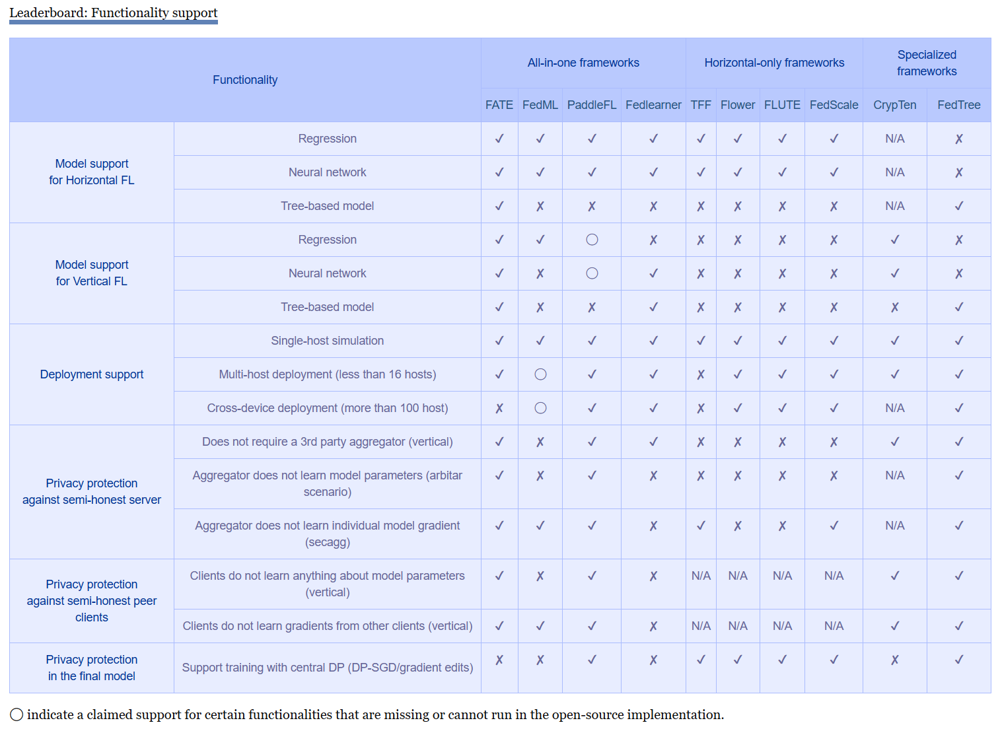

# Federated Learning Resources

[](https://github.com/youngfish42/Awesome-FL/stargazers) [](https://awesome.re) [](https://github.com/youngfish42/image-registration-resources/blob/master/LICENSE)  

---

**Table of Contents**

- [Papers](#papers)
  - [FL in top-tier journal](#fl-in-top-tier-journal)
  - FL in top-tier conference and journal by category
    - [AI](#fl-in-top-ai-conference-and-journal) [ML](#fl-in-top-ml-conference-and-journal) [DM](#fl-in-top-dm-conference-and-journal) [Secure](#fl-in-top-secure-conference-and-journal) [CV](#fl-in-top-cv-conference-and-journal) [NLP](#fl-in-top-nlp-conference-and-journal) [IR](#fl-in-top-ir-conference-and-journal) [DB](#fl-in-top-db-conference-and-journal) [Network](#fl-in-top-network-conference-and-journal) [System](#fl-in-top-system-conference-and-journal) [Others](#fl-in-top-conference-and-journal-other-fields)
  - [FL on Graph Data and Graph Neural Networks](#fl-on-graph-data-and-graph-neural-networks) [[dblp]](https://dblp.uni-trier.de/search?q=Federated%20graph%7Csubgraph%7Cgnn) 
  - [FL on Tabular Data](#fl-on-tabular-data) [[dblp]](https://dblp.org/search?q=federate%20tree%7Cboost%7Cbagging%7Cgbdt%7Ctabular%7Cforest%7CXGBoost)
- [Framework](#framework)
- [Datasets](#datasets)
- [Surveys](#surveys)
- [Tutorials and Courses](#tutorials-and-courses)
- Key Conferences/Workshops/Journals
  - [Workshops](#workshops) [Special Issues](#journal-special-issues) [Special Tracks](#conference-special-tracks)
- [Update log](#update-log)
- [Acknowledgments](#acknowledgments)
- [Citation](#citation)


We use another project to automatically track updates to FL papers, click on [FL-paper-update-tracker](https://github.com/youngfish42/FL-paper-update-tracker) if you need it.

Please note that if this page does not display the full content, **please visit [the official homepage](https://youngfish42.github.io/Awesome-FL) for full information.**

**More items will be added to the repository**. Please feel free to suggest other key resources by opening an [issue](https://github.com/youngfish42/Awesome-FL/issues) report, submitting a pull request, or dropping me an email @ ([im.young@foxmail.com](mailto:im.young@foxmail.com)). If you want to communicate with more friends in the field of federated learning, please join the QQ group [联邦学习交流群], the group number is 833638275. Enjoy reading!


**Repository Update Notice** 

> 2024/09/30
>
> 
>
> Dear Users, We would like to inform you of a few changes that will affect this open source repository. The owner and principal contributor [@youngfish42](https://github.com/youngfish42) has successfully completed his doctoral studies 🎓 as of September 30, 2024, and has since shifted his research focus. This change in circumstances will impact the frequency and extent of updates to the repository's paper list. 
>
> Instead of the previous regular updates, we anticipate that the paper list will now be updated on a monthly or quarterly basis. Furthermore, the depth of these updates will be reduced. For instance, updates related to the author's institution and open source code will no longer be actively maintained. 
>
> We understand that this might affect the value you derive from this repository. Therefore, we humbly invite more contributors to participate in updating the content. This collaborative effort will ensure that the repository remains a valuable resource for everyone. 
>
> We appreciate your understanding and look forward to your continued support and contributions. 
>
> 
>
> Best Regards, 
>
> 白小鱼 (youngfish)
>


# papers

**categories**

- Artificial Intelligence (IJCAI, AAAI, AISTATS, ALT, AI)

- Machine Learning (NeurIPS, ICML, ICLR, COLT, UAI, Machine Learning, JMLR, TPAMI)

- Data Mining (KDD, WSDM)

- Secure (S&P, CCS, USENIX Security, NDSS)

- Computer Vision (ICCV, CVPR, ECCV, MM, IJCV)

- Natural Language Processing (ACL, EMNLP, NAACL, COLING)

- Information Retrieval (SIGIR)

- Database (SIGMOD, ICDE, VLDB)

- Network (SIGCOMM, INFOCOM, MOBICOM, NSDI, WWW)

- System (OSDI, SOSP, ISCA, MLSys, EuroSys, TPDS, DAC, TOCS, TOS, TCAD, TC) 

- Others (ICSE, FOCS, STOC)


<details open>
<summary> Events </summary>

| Venue                                                        | 2024-2020                                                    | before 2020                                                  |
| ------------------------------------------------------------ | ------------------------------------------------------------ | ------------------------------------------------------------ |
| [IJCAI](https://dblp.uni-trier.de/search?q=federate%20venue%3AIJCAI%3A) | [25](https://www.ijcai.org/proceedings/2025/), [24](https://www.ijcai.org/proceedings/2024/), [23](https://www.ijcai.org/proceedings/2023/), [22](https://www.ijcai.org/proceedings/2022/), [21](https://www.ijcai.org/proceedings/2021/), [20](https://www.ijcai.org/proceedings/2020/) | [19](https://www.ijcai.org/proceedings/2019/)                |
| [AAAI](https://dblp.uni-trier.de/search?q=federate%20venue%3AAAAI%3A) | [26](https://dblp.org/db/conf/aaai/aaai2026.html), [25](https://dblp.org/db/conf/aaai/aaai2025.html), [24](https://dblp.org/db/conf/aaai/aaai2024.html), [23](https://dblp.org/db/conf/aaai/aaai2023), [22](https://aaai.org/Conferences/AAAI-22/wp-content/uploads/2021/12/AAAI-22_Accepted_Paper_List_Main_Technical_Track.pdf), [21](https://aaai.org/Conferences/AAAI-21/wp-content/uploads/2020/12/AAAI-21_Accepted-Paper-List.Main_.Technical.Track_.pdf), [20](https://aaai.org/Conferences/AAAI-20/wp-content/uploads/2020/01/AAAI-20-Accepted-Paper-List.pdf) | -                                                            |
| [AISTATS](https://dblp.uni-trier.de/search?q=federate%20venue%3AAISTATS%3A) | [25](https://proceedings.mlr.press/v258/), [24](http://proceedings.mlr.press/v238/), [23](http://proceedings.mlr.press/v206/), [22](http://proceedings.mlr.press/v151/), [21](http://proceedings.mlr.press/v130/), [20](http://proceedings.mlr.press/v108/) | -                                                            |
| [ALT](https://dblp.uni-trier.de/search?q=federate%20streamid%3Aconf%2Falt%3A) | 22                                                           | -                                                            |
| [AI](https://dblp.uni-trier.de/search?q=federate%20streamid%3Ajournals%2Fai%3A) (J) | 26, 25, 23                                                   | -                                                            |
| [NeurIPS](https://dblp.uni-trier.de/search?q=federate%20venue%3ANeurIPS%3A) | [24](https://openreview.net/group?id=NeurIPS.cc/2024/Conference#tab-accept-oral), [23](https://openreview.net/group?id=NeurIPS.cc/2023/Conference#tab-accept-oral), [22](https://papers.nips.cc/paper_files/paper/2022), [21](https://papers.nips.cc/paper/2021), [20](https://papers.nips.cc/paper/2020) | [18](https://papers.nips.cc/paper/2018), [17](https://papers.nips.cc/paper/17) |
| [ICML](https://dblp.uni-trier.de/search?q=federate%20venue%3AICML%3A) | [25](https://icml.cc/Conferences/2025/Schedule?type=Poster), [24](https://icml.cc/Conferences/2024/Schedule?type=Poster), [23](https://icml.cc/Conferences/2023/Schedule?type=Poster), [22](https://icml.cc/Conferences/2022/Schedule?type=Poster), [21](https://icml.cc/Conferences/2021/Schedule?type=Poster), [20](https://icml.cc/Conferences/2020/Schedule?type=Poster) | [19](https://icml.cc/Conferences/2019/Schedule?type=Poster)  |
| [ICLR](https://dblp.uni-trier.de/search?q=federate%20venue%3AICLR%3A) | [25](https://openreview.net/group?id=ICLR.cc/2025), [24](https://openreview.net/group?id=ICLR.cc/2024/Conference), [23](https://openreview.net/group?id=ICLR.cc/2023/Conference), [22](https://openreview.net/group?id=ICLR.cc/2022/Conference), [21](https://openreview.net/group?id=ICLR.cc/2021/Conference), [20](https://openreview.net/group?id=ICLR.cc/2020/Conference) | -                                                            |
| [COLT](https://dblp.org/search?q=federated%20venue%3ACOLT%3A) | [23](https://proceedings.mlr.press/v195/)                    | -                                                            |
| [UAI](https://dblp.org/search?q=federated%20venue%3AUAI%3A)  | [25](https://www.auai.org/uai2025/accepted_papers), [24](https://www.auai.org/uai2024/accepted_papers), [23](https://www.auai.org/uai2023/accepted_papers), [22](https://www.auai.org/uai2022/accepted_papers), [21](https://www.auai.org/uai2021/accepted_papers) | -                                                            |
| [Machine Learning](https://dblp.uni-trier.de/search?q=federate%20streamid%3Ajournals%2Fml%3A) (J) | 26, 25, 24, 23, 22                                           | -                                                            |
| [JMLR](https://dblp.uni-trier.de/search?q=federated%20streamid%3Ajournals%2Fjmlr%3A) (J) | 25, 24, 23, 22                                               | -                                                            |
| [TPAMI](https://dblp.uni-trier.de/search?q=federated%20streamid%3Ajournals%2Fpami%3A) (J) | 26, 25, 24, 23, 22                                           | -                                                            |
| [KDD](https://dblp.uni-trier.de/search?q=federate%20venue%3AKDD%3A) | [26](https://dl.acm.org/doi/proceedings/10.1145/3770854), [25](https://dl.acm.org/doi/proceedings/10.1145/3690624), [24](https://dl.acm.org/doi/proceedings/10.1145/3637528), [23](https://dl.acm.org/doi/proceedings/10.1145/3580305), [22](https://kdd.org/kdd2022/paperRT.html), [21](https://kdd.org/kdd2021/accepted-papers/index), [20](https://www.kdd.org/kdd2020/accepted-papers) |                                                              |
| [WSDM](https://dblp.uni-trier.de/search?q=federate%20venue%3AWSDM%3A) | [26](https://dl.acm.org/doi/proceedings/10.1145/3773966),[25](https://www.wsdm-conference.org/2025/accepted-papers/), [24](https://www.wsdm-conference.org/2024/accepted-papers/), [23](https://www.wsdm-conference.org/2023/program/accepted-papers), [22](https://www.wsdm-conference.org/2022/accepted-papers/), [21](https://www.wsdm-conference.org/2021/accepted-papers.php) | [19](https://www.wsdm-conference.org/2019/accepted-papers.php) |
| [S&P](https://dblp.uni-trier.de/search?q=federated%20streamid%3Aconf%2Fsp%3A) | [25](https://sp2025.ieee-security.org/program-papers.html), [24](https://sp2024.ieee-security.org/program-papers.html), [23](https://sp2023.ieee-security.org/program-papers.html), [22](https://www.ieee-security.org/TC/SP2022/program-papers.html) | [19](https://www.ieee-security.org/TC/SP2019/program-papers.html) |
| [CCS](https://dblp.uni-trier.de/search?q=federate%20venue%3ACCS%3A) | [25](https://dl.acm.org/doi/proceedings/10.1145/3719027), [24](https://dl.acm.org/doi/proceedings/10.1145/3658644), [23](https://dl.acm.org/doi/proceedings/10.1145/3576915), [22](https://www.sigsac.org/ccs/CCS2022/program/accepted-papers.html), [21](https://sigsac.org/ccs/CCS2021/accepted-papers.html), [19](https://www.sigsac.org/ccs/CCS2019/index.php/program/accepted-papers/) | [17](https://acmccs.github.io/papers/)                       |
| [USENIX Security](https://dblp.uni-trier.de/search?q=federated%20streamid%3Aconf%2Fuss%3A) | [25](https://www.usenix.org/conference/usenixsecurity25/technical-sessions), [24](https://www.usenix.org/conference/usenixsecurity24/technical-sessions), [23](https://www.usenix.org/conference/usenixsecurity23/technical-sessions), [22](https://www.usenix.org/conference/usenixsecurity22/technical-sessions), [20](https://www.usenix.org/conference/usenixsecurity20/technical-sessions) | -                                                            |
| [NDSS](https://dblp.uni-trier.de/search?q=federate%20venue%3ANDSS%3A) | [26](https://www.ndss-symposium.org/ndss2026/accepted-papers/), [25](https://www.ndss-symposium.org/ndss2025/accepted-papers/), [24](https://www.ndss-symposium.org/ndss2024/accepted-papers/), [23](https://www.ndss-symposium.org/ndss2023/accepted-papers/), [22](https://www.ndss-symposium.org/ndss2022/accepted-papers/), [21](https://www.ndss-symposium.org/ndss2021/accepted-papers/) | -                                                            |
| [CVPR](https://dblp.uni-trier.de/search?q=federate%20venue%3ACVPR%3A) | [25](https://openaccess.thecvf.com/CVPR2025?day=all), [24](https://openaccess.thecvf.com/CVPR2024?day=all), [23](https://openaccess.thecvf.com/CVPR2023?day=all), [22](https://openaccess.thecvf.com/CVPR2022), [21](https://openaccess.thecvf.com/CVPR2021?day=all) | -                                                            |
| [ICCV](https://dblp.uni-trier.de/search?q=federate%20venue%3AICCV%3A) | [23](https://openaccess.thecvf.com/ICCV2023?day=all),[21](https://openaccess.thecvf.com/ICCV2021?day=all) | -                                                            |
| [ECCV](https://dblp.uni-trier.de/search?q=federate%20venue%3AECCV%3A) | [24](https://www.ecva.net/papers.php), [22](https://www.ecva.net/papers.php), [20](https://www.ecva.net/papers.php) | -                                                            |
| [MM](https://dblp.uni-trier.de/search?q=federated%20streamid%3Aconf%2Fmm%3A) | [25](https://dl.acm.org/doi/proceedings/10.1145/3746027), [24](https://dl.acm.org/doi/proceedings/10.1145/3664647), [23](https://dl.acm.org/doi/proceedings/10.1145/3581783), [22](https://dblp.uni-trier.de/db/conf/mm/mm2022.html), [21](https://2021.acmmm.org/main-track-list), [20](https://2020.acmmm.org/main-track-list.html) | -                                                            |
| [IJCV](https://dblp.uni-trier.de/search?q=federate%20streamid%3Ajournals%2Fijcv%3A) (J) | 25, 24                                                       | -                                                            |
| [ACL](https://dblp.uni-trier.de/search?q=federate%20venue%3AACL%3A) | [25](https://aclanthology.org/events/acl-2025/), [24](https://aclanthology.org/events/acl-2024/), [23](https://aclanthology.org/events/acl-2023/), [22](https://aclanthology.org/events/acl-2022/), [21](https://aclanthology.org/events/acl-2021/) | [19](https://aclanthology.org/events/acl-2019/)              |
| [NAACL](https://dblp.uni-trier.de/search?q=federate%20venue%3ANAACL-HLT%3A) | [24](https://aclanthology.org/events/naacl-2024/), [22](https://aclanthology.org/events/naacl-2022/), [21](https://aclanthology.org/events/naacl-2021/) | -                                                            |
| [EMNLP](https://dblp.uni-trier.de/search?q=federate%20venue%3AEMNLP%3A) | [25](https://aclanthology.org/events/emnlp-2025/), [24](https://aclanthology.org/events/emnlp-2024/), [23](https://aclanthology.org/events/emnlp-2023/), [22](https://aclanthology.org/events/emnlp-2022/), [21](https://aclanthology.org/events/emnlp-2021/), [20](https://aclanthology.org/events/emnlp-2020/) | -                                                            |
| [COLING](https://dblp.uni-trier.de/search?q=federate%20venue%3ACOLING%3A) | [25](https://aclanthology.org/volumes/2025.coling-main/), [20](https://aclanthology.org/events/coling-2020/) | -                                                            |
| [SIGIR](https://dblp.uni-trier.de/search?q=federate%20venue%3ASIGIR%3A) | [25](https://dl.acm.org/doi/proceedings/10.1145/3726302), [24](https://dl.acm.org/doi/proceedings/10.1145/3626772), [23](https://dl.acm.org/doi/proceedings/10.1145/3539618), [22](https://dl.acm.org/doi/proceedings/10.1145/3477495), [21](https://dl.acm.org/doi/proceedings/10.1145/3404835), [20](https://dl.acm.org/doi/proceedings/10.1145/3397271) | -                                                            |
| [SIGMOD](https://dblp.uni-trier.de/search?q=federated%20streamid%3Aconf%2Fsigmod%3A) | [25](https://2025.sigmod.org/sigmod_papers.shtml), [24](https://2024.sigmod.org/), [23](https://2023.sigmod.org/sigmod_research_list.shtml), [22](https://2022.sigmod.org/sigmod_research_list.shtml), [21](https://2021.sigmod.org/sigmod_research_list.shtml) | -                                                            |
| [ICDE](https://dblp.uni-trier.de/search?q=federate%20venue%3AICDE%3A) | [25](https://ieee-icde.org/2025/research-papers/), [24](https://icde2024.github.io/), [23](https://icde2023.ics.uci.edu/papers-research-track/), [22](https://icde2022.ieeecomputer.my/accepted-research-track/), [21](https://ieeexplore.ieee.org/xpl/conhome/9458599/proceeding) | -                                                            |
| [VLDB](https://dblp.org/search?q=federated%20streamid%3Ajournals%2Fpvldb%3A) | [25](https://vldb.org/pvldb/volumes/18), [24](https://vldb.org/pvldb/volumes/17), [23](https://vldb.org/pvldb/volumes/17), [22](https://vldb.org/pvldb/vol16-volume-info/), [21](https://vldb.org/pvldb/vol15-volume-info/), [21](http://www.vldb.org/pvldb/vol14/), [20](http://vldb.org/pvldb/vol13-volume-info/) | -                                                            |
| [SIGCOMM](https://dblp.uni-trier.de/search?q=federate%20venue%3ASIGCOMM%3A) | 25                                                           | -                                                            |
| [INFOCOM](https://dblp.uni-trier.de/search?q=federate%20venue%3AINFOCOM%3A) | [25](https://infocom2025.ieee-infocom.org/program/accepted-paper-list-main-conference), [24](https://infocom2024.ieee-infocom.org/program/accepted-paper-list-main-conference), [23](https://infocom2023.ieee-infocom.org/program/accepted-paper-list-main-conference), [22](https://infocom2022.ieee-infocom.org/program/accepted-paper-list-main-conference), [21](https://infocom2021.ieee-infocom.org/accepted-paper-list-main-conference.html), [20](https://infocom2020.ieee-infocom.org/accepted-paper-list-main-conference.html) | [19](https://infocom2019.ieee-infocom.org/accepted-paper-list-main-conference.html), 18 |
| [MobiCom](https://dblp.uni-trier.de/search?q=federate%20venue%3AMobiCom%3A) | [25](https://www.sigmobile.org/mobicom/2025/accepted.html), [24](https://www.sigmobile.org/mobicom/2024/accepted.html), [23](https://www.sigmobile.org/mobicom/2023/accepted.html), [22](https://www.sigmobile.org/mobicom/2022/accepted.html), [21](https://www.sigmobile.org/mobicom/2021/accepted.html), [20](https://www.sigmobile.org/mobicom/2020/accepted.php) |                                                              |
| [NSDI](https://dblp.uni-trier.de/search?q=federate%20venue%3ANSDI%3A) | [25](https://www.usenix.org/conference/nsdi25/technical-sessions), 23([1](https://www.usenix.org/conference/nsdi23/spring-accepted-papers), [2](https://www.usenix.org/conference/nsdi23/fall-accepted-papers)) | -                                                            |
| [WWW](https://dblp.uni-trier.de/search?q=federate%20venue%3AWWW%3A) | [26](https://dl.acm.org/doi/proceedings/10.1145/3774904), [25](https://dl.acm.org/doi/proceedings/10.1145/3696410), [24](https://www2024.thewebconf.org/accepted/research-tracks/), [23](https://www2023.thewebconf.org/program/accepted-papers/), [22](https://www2022.thewebconf.org/accepted-papers/), [21](https://www2021.thewebconf.org/program/papers-program/links/index.html) |                                                              |
| [OSDI](https://dblp.org/search?q=federated%20venue%3AOSDI%3A) | 21                                                           | -                                                            |
| [SOSP](https://dblp.org/search?q=federated%20venue%3ASOSP%3A) | 21                                                           | -                                                            |
| [ISCA](https://dblp.org/search?q=federated%20venue%3AISCA%3A) | [24](https://www.iscaconf.org/isca2024/program/)             | -                                                            |
| [MLSys](https://dblp.org/search?q=federated%20venue%3AMLSys%3A) | [25](https://proceedings.mlsys.org/paper_files/paper/2025), [24](https://proceedings.mlsys.org/paper_files/paper/2024), [23](https://proceedings.mlsys.org/paper_files/paper/2023), [22](https://proceedings.mlsys.org/paper_files/paper/2022), [20](https://proceedings.mlsys.org/paper_files/paper/2020) | [19](https://proceedings.mlsys.org/paper_files/paper/2019)   |
| [EuroSys](https://dblp.uni-trier.de/search?q=federated%20streamid%3Aconf%2Feurosys%3A) | [26](https://2026.eurosys.org/papers.html#papers), [25](https://2025.eurosys.org/accepted-papers.html), [24](https://2024.eurosys.org/accepted-papers.html), [23](https://2023.eurosys.org/accepted-papers.html), 22, 21, 20 |                                                              |
| [TPDS](https://dblp.uni-trier.de/search?q=federated%20streamid%3Ajournals%2Ftpds%3A) (J) | 26, 25, 24, 23, 22, 21, 20                                   | -                                                            |
| [DAC](https://dblp.uni-trier.de/search?q=federate%20venue%3ADAC%3A) | 25, 24, 22, 21                                               | -                                                            |
| [TOCS](https://dblp.uni-trier.de/search?q=federate%20streamid%3Ajournals%2Ftocs%3A) | -                                                            | -                                                            |
| [TOS](https://dblp.uni-trier.de/search?q=federate%20streamid%3Ajournals%2Ftos%3A) | -                                                            | -                                                            |
| [TCAD](https://dblp.uni-trier.de/search?q=federate%20streamid%3Ajournals%2Ftcad%3A) | 26, 25, 24, 23, 22, 21                                       | -                                                            |
| [TC](https://dblp.uni-trier.de/search?q=federate%20streamid%3Ajournals%2Ftc%3A) | 26, 25, 24, 23, 22, 21                                       | -                                                            |
| [ICSE](https://dblp.uni-trier.de/search?q=federated%20streamid%3Aconf%2Ficse%3A) | [25](https://conf.researchr.org/track/icse-2025/icse-2025-research-track), [23](https://conf.researchr.org/track/icse-2023/icse-2023-technical-track?#event-overview), 21 | -                                                            |
| [FOCS](https://dblp.uni-trier.de/search?q=federate%20streamid%3Ajournals%2Ffocs%3A) | -                                                            | -                                                            |
| [STOC](https://dblp.uni-trier.de/search?q=federate%20streamid%3Aconf%2Fstoc%3A) | -                                                            | -                                                            |

</details>


**keywords**

Statistics: :fire: code is available & stars >= 100 | :star: citation >= 50 | :mortar_board: Top-tier venue 

**`kg.`**: Knowledge Graph |   **`data.`**: dataset  |   **`surv.`**: survey


## fl in top-tier journal

Papers of federated learning in Nature(and its sub-journals), Cell, Science(and Science Advances) and PANS refers to [WOS](https://www.webofscience.com/wos/woscc/summary/ed3f4552-5450-4de7-bf2c-55d01e20d5de-4301299e/relevance/1) search engine.

<details open>
<summary>fl in top-tier journal</summary>

|Title                                                           |    Venue                    |    Year    |    Materials|
| ------------------------------------------------------------ | --------------------- | ---- | ------------------------------------------------------------ |
| Towards compute-efficient Byzantine-robust federated learning with fully homomorphic encryption | Nat. Mach. Intell. | 2025 | [[PUB](https://www.nature.com/articles/s42256-025-01107-6)] [[PDF](https://arxiv.org/abs/2408.06197)] [[CODE](https://github.com/siyang-jiang/Lancelot)] |
| Incentivizing inclusive contributions in model sharing markets | Nat. Commun. | 2025 | [[PUB](https://www.nature.com/articles/s41467-025-62959-5)] [[CODE](https://github.com/19dx/iPFL)] |
| FedECA: federated external control arms for causal inference with time-to-event data in distributed settings | Nat. Commun. | 2025 | [[PUB](https://www.nature.com/articles/s41467-025-62525-z)] [[CODE](https://github.com/owkin/fedeca)] |
| Privacy-preserving multicenter differential protein abundance analysis with FedProt | Nat. Comput. Sci. | 2025 | [[PUB](https://www.nature.com/articles/s43588-025-00832-7)] [[CODE](https://github.com/Freddsle/FedProt)] |
| Towards fair decentralized benchmarking of healthcare AI algorithms with the Federated Tumor Segmentation (FeTS) challenge | Nat. Commun. | 2025 | [[PUB](https://www.nature.com/articles/s41467-025-60466-1)] [[CODE](https://github.com/mlcommons/medperf/tree/fets-challenge)] |
| A fully open AI foundation model applied to chest radiography | Nature | 2025 | [[PUB](https://www.nature.com/articles/s41586-025-09079-8)] [[CODE](https://github.com/jlianglab/Ark)] |
| Federated learning using a memristor compute-in-memory chip with in situ physical unclonable function and true random number generator | Nat. Electron. | 2025 | [[PUB](https://www.nature.com/articles/s41928-025-01390-6)] |
| A framework reforming personalized Internet of Things by federated meta-learning | Nat. Commun. | 2025 | [[PUB](https://www.nature.com/articles/s41467-025-59217-z)] [[CODE](https://github.com/IntelligentSystemsLab/generic_and_open_learning_federator/)] |
| Achieving flexible fairness metrics in federated medical imaging | Nat. Commun. | 2025 | [[PUB](https://www.nature.com/articles/s41467-025-58549-0)] [[CODE](https://zenodo.org/records/15203267)] |
| Towards fairness-aware and privacy-preserving enhanced collaborative learning for healthcare | Nat. Commun. | 2025 | [[PUB](https://www.nature.com/articles/s41467-025-58055-3)] [[CODE](https://github.com/paridis-11/DynamicFL)] |
| Data-driven federated learning in drug discovery with knowledge distillation | Nat. Mach. Intell. | 2025 | [[PUB](https://www.nature.com/articles/s42256-025-00991-2)] [[CODE](https://github.com/LhasaLimited/FLuID_POC)] |
| Distributed cross-learning for equitable federated models - privacy-preserving prediction on data from five California hospitals | Nat. Commun. | 2025 | [[PUB](https://www.nature.com/articles/s41467-025-56510-9)] |
| Physical unclonable in-memory computing for simultaneous protecting private data and deep learning models | Nat. Commun. | 2025 | [[PUB](https://www.nature.com/articles/s41467-025-56412-w)] [[新闻](https://ic.pku.edu.cn/kxyj/kycg1/d2c084006150492c93ae3e6b0cb1d7df.htm)] |
| MatSwarm: trusted swarm transfer learning driven materials computation for secure big data sharing | Nat. Commun. | 2024 | [[PUB](https://www.nature.com/articles/s41467-024-53431-x)] [[CODE](https://github.com/SICC-Group/MatSwarm)] |
| Introducing edge intelligence to smart meters via federated split learning | Nat. Commun. | 2024 | [[PUB](https://www.nature.com/articles/s41467-024-53352-9)] [[新闻](https://www.ces.org.cn/html/report/24110829-1.htm)] |
| An international study presenting a federated learning AI platform for pediatric brain tumors | Nat. Commun. | 2024 | [[PUB](https://www.nature.com/articles/s41467-024-51172-5)] [[CODE](https://github.com/edhlee/FLPedBrain)] |
| PPML-Omics: A privacy-preserving federated machine learning method protects patients’ privacy in omic data | Science Advances | 2024 | [[PUB](https://www.science.org/doi/10.1126/sciadv.adh8601)] [[CODE](https://github.com/JoshuaChou2018/PPML-Omics)] |
| Federated learning is not a cure-all for data ethics | Nat. Mach. Intell.(Comment) | 2024 | [[PUB](https://www.nature.com/articles/s42256-024-00813-x)] |
| Robustly federated learning model for identifying high-risk patients with postoperative gastric cancer recurrence | Nat. Commun. | 2024 | [[PUB](https://www.nature.com/articles/s41467-024-44946-4)] [[CODE](https://github.com/baofengguat/RFLM-project/)] |
| Selective knowledge sharing for privacy-preserving federated distillation without a good teacher | Nat. Commun. | 2024 | [[PUB](https://www.nature.com/articles/s41467-023-44383-9)] [[PDF](https://arxiv.org/abs/2304.01731)] [[CODE](https://github.com/shaojiawei07/Selective-FD)] |
| A federated learning system for precision oncology in Europe: DigiONE | Nat. Med. (Comment) | 2024 | [[PUB](https://www.nature.com/articles/s41591-023-02715-8)] |
| Multi-client distributed blind quantum computation with the Qline architecture | Nat. Commun. | 2023 | [[PUB](https://www.nature.com/articles/s41467-023-43617-0)] [[PDF](https://arxiv.org/abs/2306.05195)] |
| Device-independent quantum randomness–enhanced zero-knowledge proof | PNAS | 2023 | [[PUB](https://www.pnas.org/doi/10.1073/pnas.2205463120)] [[PDF](https://arxiv.org/abs/2111.06717)] [[新闻](https://www.nsfc.gov.cn/publish/portal0/tab448/info90817.htm)] |
| Collaborative and privacy-preserving retired battery sorting for profitable direct recycling via federated machine learning | Nat. Commun. | 2023 | [[PUB](https://www.nature.com/articles/s41467-023-43883-y)] |
| Advocating for neurodata privacy and neurotechnology regulation | Nat. Protoc. (Perspective) | 2023 | [[PUB](https://www.nature.com/articles/s41596-023-00873-0)] |
| Federated benchmarking of medical artificial intelligence with MedPerf | Nat. Mach. Intell. | 2023 | [[PUB](https://www.nature.com/articles/s42256-023-00652-2)] [[PDF](https://arxiv.org/abs/2110.01406)] [[CODE](https://github.com/mlcommons/MedPerf)] |
| Algorithmic fairness in artificial intelligence for medicine and healthcare | Nat. Biomed. Eng. (Perspective) | 2023 | [[PUB](https://www.nature.com/articles/s41551-023-01056-8)] [[PDF](https://arxiv.org/abs/2110.00603)] |
| Differentially private knowledge transfer for federated learning | Nat. Commun. | 2023 | [[PUB](https://www.nature.com/articles/s41467-023-38794-x)] [[CODE](https://github.com/taoqi98/PrivateKT)] |
| Decentralized federated learning through proxy model sharing | Nat. Commun. | 2023 | [[PUB](https://www.nature.com/articles/s41467-023-38569-4)] [[PDF](https://arxiv.org/abs/2111.11343)] [[CODE](https://github.com/layer6ai-labs/ProxyFL)] |
| Federated machine learning in data-protection-compliant research | Nat. Mach. Intell.(Comment) | 2023 | [[PUB](https://www.nature.com/articles/s42256-022-00601-5)] |
| Federated learning for predicting histological response to neoadjuvant chemotherapy in triple-negative breast cancer | Nat. Med. | 2023 | [[PUB](https://www.nature.com/articles/s41591-022-02155-w)] [[CODE](https://github.com/Substra/substra)] |
| Federated learning enables big data for rare cancer boundary detection | Nat. Commun. | 2022 | [[PUB](https://www.nature.com/articles/s41467-022-33407-5)] [[PDF](https://arxiv.org/abs/2204.10836)] [[CODE](https://github.com/FETS-AI/Front-End)] |
| Federated learning and Indigenous genomic data sovereignty | Nat. Mach. Intell. (Comment) | 2022 | [[PUB](https://www.nature.com/articles/s42256-022-00551-y)] |
| Federated disentangled representation learning for unsupervised brain anomaly detection | Nat. Mach. Intell. | 2022 | [[PUB](https://www.nature.com/articles/s42256-022-00515-2)] [[PDF](https://doi.org/https://doi.org/10.21203/rs.3.rs-722389/v1)] [[CODE](https://doi.org/10.5281/zenodo.6604161)] |
| Shifting machine learning for healthcare from development to deployment and from models to data | Nat. Biomed. Eng. (Review Article) | 2022 | [[PUB](https://www.nature.com/articles/s41551-022-00898-y)] |
| A federated graph neural network framework for privacy-preserving personalization | Nat. Commun. | 2022 | [[PUB](https://www.nature.com/articles/s41467-022-30714-9)] [[CODE](https://github.com/wuch15/FedPerGNN)] [[解读](https://zhuanlan.zhihu.com/p/487383715)] |
| Communication-efficient federated learning via knowledge distillation | Nat. Commun. | 2022 | [[PUB](https://www.nature.com/articles/s41467-022-29763-x)] [[PDF](https://arxiv.org/abs/2108.13323)] [[CODE](https://zenodo.org/record/6383473)] |
| Lead federated neuromorphic learning for wireless edge artificial intelligence | Nat. Commun. | 2022 | [[PUB](https://www.nature.com/articles/s41467-022-32020-w)] [[CODE](https://github.com/GOGODD/FL-EDGE-COMPUTING/releases/tag/federated_learning)] [[解读](https://zhuanlan.zhihu.com/p/549087420)] |
| A novel decentralized federated learning approach to train on globally  distributed, poor quality, and protected private medical data | Sci. Rep. | 2022 | [[PUB](https://www.nature.com/articles/s41598-022-12833-x)] |
| Advancing COVID-19 diagnosis with privacy-preserving collaboration in artificial intelligence | Nat. Mach. Intell. | 2021 | [[PUB](https://www.nature.com/articles/s42256-021-00421-z)] [[PDF](https://arxiv.org/abs/2111.09461)] [[CODE](https://github.com/HUST-EIC-AI-LAB/UCADI)] |
| Federated learning for predicting clinical outcomes in patients with COVID-19 | Nat. Med. | 2021 | [[PUB](https://www.nature.com/articles/s41591-021-01506-3)] [[CODE](https://www.nature.com/articles/s41591-021-01506-3#code-availability)] |
| Adversarial interference and its mitigations in privacy-preserving collaborative machine learning | Nat. Mach. Intell.(Perspective) | 2021 | [[PUB](https://www.nature.com/articles/s42256-021-00390-3)] |
| Swarm Learning for decentralized and confidential clinical machine learning :star: | Nature :mortar_board: | 2021 | [[PUB](https://www.nature.com/articles/s41586-021-03583-3)] [[CODE](https://github.com/HewlettPackard/swarm-learning)] [[SOFTWARE](https://myenterpriselicense.hpe.com)] [[解读](https://zhuanlan.zhihu.com/p/379434722)] |
| End-to-end privacy preserving deep learning on multi-institutional medical imaging | Nat. Mach. Intell. | 2021 | [[PUB](https://www.nature.com/articles/s42256-021-00337-8)] [[CODE](https://doi.org/10.5281/zenodo.4545599)] [[解读](https://zhuanlan.zhihu.com/p/484801505)] |
| Communication-efficient federated learning | PANS. | 2021 | [[PUB](https://www.pnas.org/doi/full/10.1073/pnas.2024789118)] [[CODE](https://code.ihub.org.cn/projects/4394/repository/revisions/master/show/PNAS)] |
| Breaking medical data sharing boundaries by using synthesized radiographs | Science. Advances. | 2020 | [[PUB](https://www.science.org/doi/10.1126/sciadv.abb7973)] [[CODE](https://github.com/peterhan91/Thorax_GAN)] |
| Secure, privacy-preserving and federated machine learning in medical imaging :star: | Nat. Mach. Intell.(Perspective) | 2020 | [[PUB](https://www.nature.com/articles/s42256-020-0186-1)] |

<!-- END:fl-in-top-tier-journal -->

</details>


## fl in top ai conference and journal

Federated Learning papers accepted by top AI(Artificial Intelligence) conference and journal, Including [IJCAI](https://dblp.org/db/conf/ijcai/index.html)(International Joint Conference on Artificial Intelligence), [AAAI](https://dblp.uni-trier.de/db/conf/aaai/index.html)(AAAI Conference on Artificial Intelligence), [AISTATS](https://dblp.uni-trier.de/db/conf/aistats/index.html)(Artificial Intelligence and Statistics), [ALT](https://dblp.org/db/conf/alt/index.html)(International Conference on Algorithmic Learning Theory), [AI](https://dblp.uni-trier.de/db/journals/ai/index.html)(Artificial Intelligence).

- [IJCAI](https://dblp.uni-trier.de/search?q=federate%20venue%3AIJCAI%3A) [2025](https://www.ijcai.org/proceedings/2025/), [2024](https://www.ijcai.org/proceedings/2024/), [2023](https://www.ijcai.org/proceedings/2023/), [2022](https://www.ijcai.org/proceedings/2022/), [2021](https://www.ijcai.org/proceedings/2021/), [2020](https://www.ijcai.org/proceedings/2020/), [2019](https://www.ijcai.org/proceedings/2019/)
- [AAAI](https://dblp.uni-trier.de/search?q=federate%20venue%3AAAAI%3A) [2026](https://dblp.org/db/conf/aaai/aaai2026.html), [2025](https://dblp.org/db/conf/aaai/aaai2025.html), [2024](https://dblp.org/db/conf/aaai/aaai2024.html), [2023](https://dblp.org/db/conf/aaai/aaai2023), [2022](https://aaai.org/Conferences/AAAI-22/wp-content/uploads/2021/12/AAAI-22_Accepted_Paper_List_Main_Technical_Track.pdf), [2021](https://aaai.org/Conferences/AAAI-21/wp-content/uploads/2020/12/AAAI-21_Accepted-Paper-List.Main_.Technical.Track_.pdf), [2020](https://aaai.org/Conferences/AAAI-20/wp-content/uploads/2020/01/AAAI-20-Accepted-Paper-List.pdf)
- [AISTATS](https://dblp.uni-trier.de/search?q=federate%20venue%3AAISTATS%3A) [2025](https://proceedings.mlr.press/v258/), [2024](http://proceedings.mlr.press/v238/), [2023](http://proceedings.mlr.press/v206/), [2022](http://proceedings.mlr.press/v151/), [2021](http://proceedings.mlr.press/v130/), [2020](http://proceedings.mlr.press/v108/)
- [ALT](https://dblp.uni-trier.de/search?q=federate%20streamid%3Aconf%2Falt%3A) 2022
- [AI](https://dblp.uni-trier.de/search?q=federate%20streamid%3Ajournals%2Fai%3A) 2026, 2025, 2023

<details open>
<summary>fl in top ai conference and journal</summary>
<!-- START:fl-in-top-ai-conference-and-journal -->


<!-- END:fl-in-top-ai-conference-and-journal -->

### 2026

#### AAAI

- A Unified Self-Regulating Training Framework for Federated Deep Reinforcement Learning. [[PUB](https://doi.org/10.1609/aaai.v40i32.39946)]
- Bi-level Personalization for Federated Foundation Models: A Task-vector Aggregation Approach. [[PUB](https://doi.org/10.1609/aaai.v40i33.39991)]
- BIQ: Bisection Interval Quantization for Communication-efficient Federated Learning. [[PUB](https://doi.org/10.1609/aaai.v40i25.39259)]
- Breaking Cross-View Associations: Byzantine Model Poisoning Attack against Vertical Federated Learning. [[PUB](https://doi.org/10.1609/aaai.v40i48.42327)]
- Breaking the Aggregation Bottleneck in Federated Recommendation: A Personalized Model Merging Approach. [[PUB](https://doi.org/10.1609/aaai.v40i17.38472)]
- Causality-inspired Federated Learning for Dynamic Spatio-Temporal Graphs. [[PUB](https://doi.org/10.1609/aaai.v40i28.39569)]
- Causally-Aware Attribute Completion for Incomplete Federated Graph Clustering. [[PUB](https://doi.org/10.1609/aaai.v40i28.39547)]
- Class-Aware Active Annotation in Federated Semi-Supervised Learning for Medical Image Classification. [[PUB](https://doi.org/10.1609/aaai.v40i32.39964)]
- Communication-Efficient Heterogeneous Federated Learning with Sparse Prototypes in Resource-Constrained Environments. [[PUB](https://doi.org/10.1609/aaai.v40i27.39441)]
- CoRe-Fed: Bridging Collaborative and Representation Fairness via Federated Embedding Distillation. [[PUB](https://doi.org/10.1609/aaai.v40i29.39628)]
- DA-DFGAS: Differentiable Federated Graph Neural Architecture Search with Distribution-Aware Attentive Aggregation. [[PUB](https://doi.org/10.1609/aaai.v40i28.39573)]
- Data Heterogeneity and Forgotten Labels in Split Federated Learning. [[PUB](https://doi.org/10.1609/aaai.v40i31.39794)]
- Decoupling Shared and Personalized Knowledge: A Dual-Branch Federated Learning Framework for Multi-Domain with Non-IID Data. [[PUB](https://doi.org/10.1609/aaai.v40i29.39660)]
- Divide, Conquer and Unite: Hierarchical Style-Recalibrated Prototype Alignment for Federated Medical Segmentation. [[PUB](https://doi.org/10.1609/aaai.v40i34.40109)]
- DoBlock: Blocking Malicious Association Propagation for Backdoor-Robust Federated Learning Under Domain Skew. [[PUB](https://doi.org/10.1609/aaai.v40i30.39778)]
- Domain-Aware Suppression and Aggregation for Federated DG ReID. [[PUB](https://doi.org/10.1609/aaai.v40i14.38214)]
- DSFedMed: Dual-Scale Federated Medical Image Segmentation via Mutual Distillation Between Foundation and Lightweight Models. [[PUB](https://doi.org/10.1609/aaai.v40i15.38239)]
- Enhanced Federated Deep Multi-View Clustering Under Uncertainty Scenario. [[PUB](https://doi.org/10.1609/aaai.v40i32.39891)]
- Equilibrium-Driven Vertical Federated Learning with Selective Privacy Protection. [[PUB](https://doi.org/10.1609/aaai.v40i35.40206)]
- EvoFMVC: Trusted Federated Multi-View Clustering with Evolutionary Fusion. [[PUB](https://doi.org/10.1609/aaai.v40i33.40057)]
- Feature-Aware One-Shot Federated Learning via Hierarchical Token Sequences. [[PUB](https://doi.org/10.1609/aaai.v40i28.39557)]
- FedAdamW: A Communication-Efficient Optimizer with Convergence and Generalization Guarantees for Federated Large Models. [[PUB](https://doi.org/10.1609/aaai.v40i28.39549)]
- FedALT: Federated Fine-Tuning Through Adaptive Local Training with Rest-of-World LoRA. [[PUB](https://doi.org/10.1609/aaai.v40i24.39054)]
- FedARKS: Federated Aggregation via Robust and Discriminative Knowledge Selection and Integration for Person Re-identification. [[PUB](https://doi.org/10.1609/aaai.v40i14.38124)]
- FedAU2: Attribute Unlearning for User-Level Federated Recommender Systems with Adaptive and Robust Adversarial Training. [[PUB](https://doi.org/10.1609/aaai.v40i28.39500)]
- FedBRICK: Structural Bias Aware Heterogeneous Foundation Model Federated Tuning. [[PUB](https://doi.org/10.1609/aaai.v40i34.40083)]
- FedCD: Towards Consolidated Distillation for Heterogeneous Federated Learning. [[PUB](https://doi.org/10.1609/aaai.v40i28.39494)]
- FedCure: Mitigating Participation Bias in Semi-Asynchronous Federated Learning with Non-IID Data. [[PUB](https://doi.org/10.1609/aaai.v40i25.39176)]
- FedDNA: DNA Sequence Reconstruction via Deep Evidential Learning and Personalized Federated Aggregation. [[PUB](https://doi.org/10.1609/aaai.v40i28.39524)]
- Federated CLIP for Resource-Efficient Heterogeneous Medical Image Classification. [[PUB](https://doi.org/10.1609/aaai.v40i32.39912)]
- Federated Context-Aware Personalized Recommendation. [[PUB](https://doi.org/10.1609/aaai.v40i31.39888)]
- Federated Graph-level Clustering Network with Attribute Inference. [[PUB](https://doi.org/10.1609/aaai.v40i26.39307)]
- Federated Incomplete Multi-View Clustering with Tensorized Low-Rank Constraint. [[PUB](https://doi.org/10.1609/aaai.v40i25.39251)]
- Federated Learning Playground. [[PUB](https://doi.org/10.1609/aaai.v40i48.42349)]
- Federated Linear Dueling Bandits. [[PUB](https://doi.org/10.1609/aaai.v40i26.39361)]
- Federated Vision-Language-Recommendation with Personalized Fusion. [[PUB](https://doi.org/10.1609/aaai.v40i28.39503)]
- FedLAGC: Towards High Performance System-Heterogeneous Federated Learning via Layer-Adaptive Submodel Extraction and Gradient Correction. [[PUB](https://doi.org/10.1609/aaai.v40i26.39338)]
- FedMerge: Federated Model Merging for Personalization. [[PUB](https://doi.org/10.1609/aaai.v40i24.39113)]
- FedPKDA: Personalized Federated Learning with Privacy-Preserving Knowledge Dynamic Alignment. [[PUB](https://doi.org/10.1609/aaai.v40i33.40037)]
- FedPM: Federated Learning Using Second-order Optimization with Preconditioned Mixing of Local Parameters. [[PUB](https://doi.org/10.1609/aaai.v40i26.39368)]
- FedP²EFT: Federated Learning to Personalize PEFT for Multilingual LLMs. [[PUB](https://doi.org/10.1609/aaai.v40i27.39443)]
- FedRNC: Addressing Spatio-Temporal Label Misalignment in Federated Noisy Class-Incremental Learning. [[PUB](https://doi.org/10.1609/aaai.v40i26.39359)]
- FedSDA: Federated Stain Distribution Alignment for Non-IID Histopathological Image Classification. [[PUB](https://doi.org/10.1609/aaai.v40i12.37918)]
- FedSDWC: Federated Synergistic Dual-Representation Weak Causal Learning for OOD. [[PUB](https://doi.org/10.1609/aaai.v40i26.39364)]
- FedSEA-LLaMA: A Secure, Efficient and Adaptive Federated Splitting Framework for Large Language Models. [[PUB](https://doi.org/10.1609/aaai.v40i34.40100)]
- FedShard: Federated Unlearning with Efficiency Fairness and Performance Fairness. [[PUB](https://doi.org/10.1609/aaai.v40i32.39895)]
- FedSkeleton: Secure Multi-Party Graph Skeleton Construction for Privacy-Preserving Federated Time-Series Forecasting. [[PUB](https://doi.org/10.1609/aaai.v40i25.39210)]
- FedTopo: Topology-Informed Representation Alignment in Federated Learning Under Non-I.I.D. Conditions. [[PUB](https://doi.org/10.1609/aaai.v40i26.39337)]
- FILTER: A Framework for Defending Against Backdoor Attacks in Vertical Federated Learning. [[PUB](https://doi.org/10.1609/aaai.v40i42.40859)]
- Generalizable Heterogeneity-aware Federated Feature and Basic-matrix Consistency Learning. [[PUB](https://doi.org/10.1609/aaai.v40i27.39436)]
- Generic Adversarial Attack Framework Against Graph-based Vertical Federated Learning. [[PUB](https://doi.org/10.1609/aaai.v40i42.40878)]
- Good Gradients Poison Your Model: Evading Defenses in Federated Learning via Boundary-adaptive Perturbation. [[PUB](https://doi.org/10.1609/aaai.v40i16.38328)]
- HealSplit: Towards Self-Healing Through Adversarial Distillation in Split Federated Learning. [[PUB](https://doi.org/10.1609/aaai.v40i42.40908)]
- Horizontal and Vertical Federated Causal Structure Learning via Higher-order Cumulants. [[PUB](https://doi.org/10.1609/aaai.v40i24.39116)]
- Incomplete Multi-View Unsupervised Federated Feature Selection via Cooperative Particle Swarm Optimization and Tensor-Aligned Learning. [[PUB](https://doi.org/10.1609/aaai.v40i33.40005)]
- Inter-Client Dependency Recovery with Hidden Global Components for Federated Traffic Prediction. [[PUB](https://doi.org/10.1609/aaai.v40i34.40130)]
- Intra-Class Unbiased Prototype Aggregation and Classifier Collaboration for Personalized Federated Learning. [[PUB](https://doi.org/10.1609/aaai.v40i34.40113)]
- Investigating Social Bias Propagation in Federated Fine-tuning of Large Language Models. [[PUB](https://doi.org/10.1609/aaai.v40i46.41316)]
- LSHFed: Robust and Communication-Efficient Federated Learning with Locally-Sensitive Hashing Gradient Mapping. [[PUB](https://doi.org/10.1609/aaai.v40i25.39184)]
- MSCFL: Model Structure-Aware Clustered Federated Learning for System Heterogeneity and Data Drift. [[PUB](https://doi.org/10.1609/aaai.v40i32.39952)]
- Multi-Modal Style Transfer-based Prompt Tuning for Efficient Federated Domain Generalization. [[PUB](https://doi.org/10.1609/aaai.v40i25.39177)]
- MultiKD: Backdoor Defense in Federated Graph Learning via Attention-Guided Multi-Teacher Distillation. [[PUB](https://doi.org/10.1609/aaai.v40i33.40051)]
- Neuro-Symbolic Federated Learning over Heterogeneous Data-Views: A Structured Approach to Distributive EHR Modelling. [[PUB](https://doi.org/10.1609/aaai.v40i29.39624)]
- Oblivionis: A Lightweight Learning and Unlearning Framework for Federated Large Language Models. [[PUB](https://doi.org/10.1609/aaai.v40i33.40045)]
- Optimal Look-back Horizon for Time Series Forecasting in Federated Learning. [[PUB](https://doi.org/10.1609/aaai.v40i30.39781)]
- OPTION: An Online Pricing Strategy for Asynchronous Federated Learning Against Free-Riding Attacks. [[PUB](https://doi.org/10.1609/aaai.v40i29.39653)]
- OursFed: Provable Group Fairness-Aware Federated Learning Against Distrust and Fragility. [[PUB](https://doi.org/10.1609/aaai.v40i32.39926)]
- PAGE: A Unified Approach for Federated Graph Unlearning. [[PUB](https://doi.org/10.1609/aaai.v40i24.39038)]
- Personalized Federated Graph-Level Clustering Network. [[PUB](https://doi.org/10.1609/aaai.v40i28.39546)]
- Personalized Federated Learning with Bidirectional Communication Compression via One-Bit Random Sketching. [[PUB](https://doi.org/10.1609/aaai.v40i25.39185)]
- Plug-and-Play Parameter-Efficient Tuning of Embeddings for Federated Recommendation. [[PUB](https://doi.org/10.1609/aaai.v40i19.38660)]
- Poisoning with a Pill: Circumventing Detection in Federated Learning. [[PUB](https://doi.org/10.1609/aaai.v40i26.39290)]
- PPFL: A Parameter Behavior-Driven Plug-in Personalization Engine for Federated Learning. [[PUB](https://doi.org/10.1609/aaai.v40i24.39073)]
- Prior Refinement Is Better: Diffusion-Driven Graph Harmonization for Federated Graph Learning. [[PUB](https://doi.org/10.1609/aaai.v40i34.40163)]
- Re-architecting Personalized Federated Learning for Demanding Edge Environments. [[PUB](https://doi.org/10.1609/aaai.v40i29.39655)]
- REMISVFU: Vertical Federated Unlearning via Representation Misdirection for Intermediate Output Feature. [[PUB](https://doi.org/10.1609/aaai.v40i32.39911)]
- Retaliatory Attacks Against Federated Unlearning via Data Leakage. [[PUB](https://doi.org/10.1609/aaai.v40i30.39725)]
- Ripple Shapley: Data Influence Attribution in One Federated Training Run. [[PUB](https://doi.org/10.1609/aaai.v40i33.40034)]
- Scaling Law Analysis in Federated Learning: How to Select the Optimal Model Size?. [[PUB](https://doi.org/10.1609/aaai.v40i24.39122)]
- SFedHIFI: Fire Rate-Based Heterogeneous Information Fusion for Spiking Federated Learning. [[PUB](https://doi.org/10.1609/aaai.v40i31.39787)]
- ShadeEdit: A Utility-Preserving and Defense-Evasive Knowledge Manipulation Attack in Federated LLMs. [[PUB](https://doi.org/10.1609/aaai.v40i41.40787)]
- SMoFi: Step-wise Momentum Fusion for Split Federated Learning on Heterogeneous Data. [[PUB](https://doi.org/10.1609/aaai.v40i32.39977)]
- Tackling Resource-Constrained and Data-Heterogeneity in Federated Learning with Double-Weight Sparse Pack. [[PUB](https://doi.org/10.1609/aaai.v40i32.39979)]
- TOFA: Training-Free One-Shot Federated Adaptation for Vision-Language Models. [[PUB](https://doi.org/10.1609/aaai.v40i33.40058)]
- Topological Federated Clustering via Gravitational Potential Fields Under Local Differential Privacy. [[PUB](https://doi.org/10.1609/aaai.v40i28.39582)]
- Towards Federated Clustering: A Client-wise Private Graph Aggregation Framework. [[PUB](https://doi.org/10.1609/aaai.v40i26.39311)]
- Towards Robust Text-Attributed Federated Graph Learning: Multimodal Threats and Defense. [[PUB](https://doi.org/10.1609/aaai.v40i30.39732)]
- TransFR: Transferable Federated Recommendation with Adapter Tuning on Pre-trained Language Models. [[PUB](https://doi.org/10.1609/aaai.v40i33.40048)]
- Unlocking Dynamic Inter-Client Spatial Dependencies: A Federated Spatio-temporal Graph Learning Method for Traffic Flow Forecasting. [[PUB](https://doi.org/10.1609/aaai.v40i2.37083)]
- Venom: Liquid Diffusion-Guided Gradient Inversion for Breaking Differential Privacy in Federated Learning. [[PUB](https://doi.org/10.1609/aaai.v40i26.39333)]
- AEFGL: Reverse Auction and Value Evaluation-Based Federated Graph Learning Incentive Mechanism (Student Abstract). [[PUB](https://doi.org/10.1609/aaai.v40i48.42197)]
- Federated Cross-Modal Style-Aware Prompt Generation (Student Abstract). [[PUB](https://doi.org/10.1609/aaai.v40i48.42268)]
- UniVarFL: Uniformity and Variance Regularized Federated Learning for Heterogeneous Data (Student Abstract). [[PUB](https://doi.org/10.1609/aaai.v40i48.42220)]
- A Dialogue-Based Learning Analytics Framework for Collaborative Game-Based Learning. [[PUB](https://doi.org/10.1609/aaai.v40i48.42116)]
- Advancing Protein Design via Multi-Agent Reinforcement Learning with Pareto-Based Collaborative Optimization. [[PUB](https://doi.org/10.1609/aaai.v40i2.37142)]
- CL-Guard: Defending DNNs Against Backdoors via Fine-Grained Neuron Analysis and Collaborative Dual-Network Learning. [[PUB](https://doi.org/10.1609/aaai.v40i42.40904)]
- Collaborative Dual Representations for Semi-Supervised Partial Label Learning. [[PUB](https://doi.org/10.1609/aaai.v40i24.39049)]
- Collaborative Feature Matching with Progressive Correspondence Learning. [[PUB](https://doi.org/10.1609/aaai.v40i9.37669)]
- Collaborative Representation Learning for Alignment of Tactile, Language, and Vision Modalities. [[PUB](https://doi.org/10.1609/aaai.v40i22.38956)]
- Cross-Domain Few-Shot Learning via Multi-View Collaborative Optimization with Vision-Language Models. [[PUB](https://doi.org/10.1609/aaai.v40i24.39086)]
- DeLo: Dual Decomposed Low-Rank Experts Collaboration for Continual Missing Modality Learning. [[PUB](https://doi.org/10.1609/aaai.v40i28.39561)]
- Do Not Merge My Model! Safeguarding Open-Source LLMs Against Unauthorized Model Merging. [[PUB](https://doi.org/10.1609/aaai.v40i37.40433)]
- Drift-aware Collaborative Assistance Mixture of Experts for Heterogeneous Multistream Learning. [[PUB](https://doi.org/10.1609/aaai.v40i19.38656)]
- From Parameter to Representation: A Closed-Form Approach for Controllable Model Merging. [[PUB](https://doi.org/10.1609/aaai.v40i32.39902)]
- GLOBA: Rethinking Parameter Conflicts in Model Merging. [[PUB](https://doi.org/10.1609/aaai.v40i28.39572)]
- Learning to Collaborate: An Orchestrated-Decentralized Framework for Peer-to-Peer LLM Federation. [[PUB](https://doi.org/10.1609/aaai.v40i30.39742)]
- Learning to Deliberate: Meta-policy Collaboration for Agentic LLMs with Multi-agent Reinforcement Learning. [[PUB](https://doi.org/10.1609/aaai.v40i35.40228)]
- Learning to Generate and Extract: A Multi-Agent Collaboration Framework for Zero-Shot Document-Level Event Arguments Extraction. [[PUB](https://doi.org/10.1609/aaai.v40i41.40767)]
- LLM Collaboration with Multi-Agent Reinforcement Learning. [[PUB](https://doi.org/10.1609/aaai.v40i38.40487)]
- M-Loss: Quantifying Model Merging Compatibility with Limited Unlabeled Data. [[PUB](https://doi.org/10.1609/aaai.v40i31.39854)]
- MedSAMix: A Training-Free Model Merging Approach for Medical Image Segmentation. [[PUB](https://doi.org/10.1609/aaai.v40i14.38161)]
- MergeDNA: Context-Aware Genome Modeling with Dynamic Tokenization Through Token Merging. [[PUB](https://doi.org/10.1609/aaai.v40i1.37032)]
- Multi-view Invariance Learning for 3D Scene Graph Pre-training via Collaborative Cross-Modal Regularization. [[PUB](https://doi.org/10.1609/aaai.v40i7.37435)]
- Outlier Matters: Efficient Long-to-Short Reasoning via Outlier-Guided Model Merging. [[PUB](https://doi.org/10.1609/aaai.v40i41.40828)]
- RCP-Merging: Merging Long Chain-of-Thought Models with Domain-Specific Models by Considering Reasoning Capability as Prior. [[PUB](https://doi.org/10.1609/aaai.v40i40.40722)]
- Rep Deep &amp; Machine Learning: Exemplar-Free Continual Video Action Recognition via Slow-Fast Collaborative Learning. [[PUB](https://doi.org/10.1609/aaai.v40i42.40924)]
- Revisiting Contrastive Learning in Collaborative Filtering via Parallel Graph Filters. [[PUB](https://doi.org/10.1609/aaai.v40i17.38521)]
- Think Wise, Collaborate Effectively: A Rationale-Aware LLM-Based Recommender with Reinforcement Learning from Collaborative Signals. [[PUB](https://doi.org/10.1609/aaai.v40i18.38590)]
- Unifying Multi-View Knowledge for Graph Learning via Model Collaboration. [[PUB](https://doi.org/10.1609/aaai.v40i32.39914)]
- Geometrically Inspired Kernel Machines for Collaborative Learning Beyond Gradient Descent (Abstract Reprint). [[PUB](https://doi.org/10.1609/aaai.v40i47.41386)]

#### AI

- Disentangling data distribution for optimal and communication-efficient federated learning. [[PUB](https://doi.org/10.1016/j.artint.2025.104455)]
- Federated neural nonparametric point processes. [[PUB](https://doi.org/10.1016/j.artint.2025.104454)]

### 2025

#### IJCAI

- Exploiting Label Skewness for Spiking Neural Networks in Federated Learning. [[PUB](https://www.ijcai.org/proceedings/2025/767)]
- FedHAN: A Cache-Based Semi-Asynchronous Federated Learning Framework Defending Against Poisoning Attacks in Heterogeneous Clients. [[PUB](https://www.ijcai.org/proceedings/2025/379)]
- Heterogeneous Federated Learning with Scalable Server Mixture-of-Experts. [[PUB](https://www.ijcai.org/proceedings/2025/610)]
- Pixel-wise Divide and Conquer for Federated Vessel Segmentation. [[PUB](https://www.ijcai.org/proceedings/2025/540)]
- Universal Backdoor Defense via Label Consistency in Vertical Federated Learning. [[PUB](https://www.ijcai.org/proceedings/2025/528)]
- Where Does This Data Come From? Enhanced Source Inference Attacks in Federated Learning. [[PUB](https://www.ijcai.org/proceedings/2025/536)]
- Optimizing Personalized Federated Learning Through Adaptive Layer-Wise Learning. [[PUB](https://www.ijcai.org/proceedings/2025/541)] [[CODE](https://github.com/lancasterJie/FLAYER)]
- FedDLAD: A Federated Learning Dual-Layer Anomaly Detection Framework for Enhancing Resilience Against Backdoor Attacks. [[PUB](https://www.ijcai.org/proceedings/2025/559)] [[CODE](https://github.com/dingbinb/FedDLAD)]
- Federated Multi-view Graph Clustering with Incomplete Attribute Imputation. [[PUB](https://www.ijcai.org/proceedings/2025/570)]
- ADPFedGNN: Adaptive Decoupling Personalized Federated Graph Neural Network. [[PUB](https://www.ijcai.org/proceedings/2025/585)]
- Approximated Behavioral Metric-based State Projection for Federated Reinforcement Learning. [[PUB](https://www.ijcai.org/proceedings/2025/590)]
- FissionVAE: Federated Non-IID Image Generation with Latent Space and Decoder Decomposition. [[PUB](https://www.ijcai.org/proceedings/2025/597)]
- FedBG: Proactively Mitigating Bias in Cross-Domain Graph Federated Learning Using Background Data. [[PUB](https://www.ijcai.org/proceedings/2025/602)]
- FedCCH: Automatic Personalized Graph Federated Learning for Inter-Client and Intra-Client Heterogeneity. [[PUB](https://www.ijcai.org/proceedings/2025/333)]
- FedCPD:Personalized Federated Learning with Prototype-Enhanced Representation and Memory Distillation. [[PUB](https://www.ijcai.org/proceedings/2025/612)]
- Data Poisoning Attack Defense and Evolutionary Domain Adaptation for Federated Medical Image Segmentation. [[PUB](https://www.ijcai.org/proceedings/2025/146)]
- Distilling A Universal Expert from Clustered Federated Learning. [[PUB](https://www.ijcai.org/proceedings/2025/620)]
- CSAHFL:Clustered Semi-Asynchronous Hierarchical Federated Learning for Dual-layer Non-IID in Heterogeneous Edge Computing Networks. [[PUB](https://www.ijcai.org/proceedings/2025/621)]
- FAST: A Lightweight Mechanism Unleashing Arbitrary Client Participation in Federated Learning. [[PUB](https://www.ijcai.org/proceedings/2025/628)]
- Hypernetwork Aggregation for Decentralized Personalized Federated Learning. [[PUB](https://www.ijcai.org/proceedings/2025/161)]
- Federated Domain Generalization with Decision Insight Matrix. [[PUB](https://www.ijcai.org/proceedings/2025/633)]
- Generic Adversarial Attack Framework Against Vertical Federated Learning. [[PUB](https://www.ijcai.org/proceedings/2025/646)]
- One-shot Federated Learning Methods: A Practical Guide. [[PUB](https://www.ijcai.org/proceedings/2025/1174)]
- Federated Learning at the Forefront of Fairness: A Multifaceted Perspective. [[PUB](https://www.ijcai.org/proceedings/2025/1177)]
- Performance Guaranteed Poisoning Attacks in Federated Learning: A Sliding Mode Approach. [[PUB](https://www.ijcai.org/proceedings/2025/670)]
- Federated Deconfounding and Debiasing Learning for Out-of-Distribution Generalization. [[PUB](https://www.ijcai.org/proceedings/2025/677)]
- FedAPA: Server-side Gradient-Based Adaptive Personalized Aggregation for Federated Learning on Heterogeneous Data. [[PUB](https://www.ijcai.org/proceedings/2025/692)] [[CODE](https://github.com/Yuxia-Sun/FL_FedAPA)]
- An Empirical Study of Federated Prompt Learning for Vision Language Model. [[PUB](https://www.ijcai.org/proceedings/2025/1188)]
- FedCM: Client Clustering and Migration in Federated Learning via Gradient Path Similarity and Update Direction Deviation. [[PUB](https://www.ijcai.org/proceedings/2025/706)]
- Zero-shot Federated Unlearning via Transforming from Data-Dependent to Personalized Model-Centric. [[PUB](https://www.ijcai.org/proceedings/2025/733)]
- DaringFed: A Dynamic Bayesian Persuasion Pricing for Online Federated Learning Under Two-sided Incomplete Information. [[PUB](https://www.ijcai.org/proceedings/2025/744)]
- Backdoor Attack on Vertical Federated Graph Neural Network Learning. [[PUB](https://www.ijcai.org/proceedings/2025/877)]
- Federated Low-Rank Adaptation for Foundation Models: A Survey. [[PUB](https://www.ijcai.org/proceedings/2025/1196)]
- Learning Heterogeneous Performance-Fairness Trade-offs in Federated Learning. [[PUB](https://www.ijcai.org/proceedings/2025/761)]
- FedSaaS: Class-Consistency Federated Semantic Segmentation via Global Prototype Supervision and Local Adversarial Harmonization. [[PUB](https://www.ijcai.org/proceedings/2025/770)]
- A Multi-Granularity Clustering Approach for Federated Backdoor Defense with the Adam Optimizer. [[PUB](https://www.ijcai.org/proceedings/2025/771)]
- Federated Stochastic Bilevel Optimization with Fully First-Order Gradients. [[PUB](https://www.ijcai.org/proceedings/2025/784)]
- AdaptPFL: Unlocking Cross-Device Palmprint Recognition via Adaptive Personalized Federated Learning with Feature Decoupling. [[PUB](https://www.ijcai.org/proceedings/2025/787)]
- Rethinking Federated Graph Learning: A Data Condensation Perspective. [[PUB](https://www.ijcai.org/proceedings/2025/775)]
- MMGIA: Gradient Inversion Attack Against Multimodal Federated Learning via Intermodal Correlation. [[PUB](https://www.ijcai.org/proceedings/2025/886)]
- Enhancing the Performance of Global Model by Improving the Adaptability of Local Models in Federated Learning. [[PUB](https://www.ijcai.org/proceedings/2025/798)]
- Finite-Time Analysis of Heterogeneous Federated Temporal Difference Learning. [[PUB](https://www.ijcai.org/proceedings/2025/808)]
- Inconsistency-Based Federated Active Learning. [[PUB](https://www.ijcai.org/proceedings/2025/812)]
- CSAHFL: Clustered Semi-Asynchronous Hierarchical Federated Learning for Dual-layer Non-IID in Heterogeneous Edge Computing Networks. [[PUB](https://doi.org/10.24963/ijcai.2025/621)]
- FedCPD: Personalized Federated Learning with Prototype-Enhanced Representation and Memory Distillation. [[PUB](https://doi.org/10.24963/ijcai.2025/612)]
- Bidirectional Human-AI Collaboration for Equitable Student Performance Prediction via Deep Uncertainty Learning. [[PUB](https://doi.org/10.24963/ijcai.2025/1114)]
- Credit Assignment and Fine-Tuning Enhanced Reinforcement Learning for Collaborative Spatial Crowdsourcing. [[PUB](https://doi.org/10.24963/ijcai.2025/459)]
- Cross-modal Collaborative Representation Learning for Text-to-Image Person Retrieval. [[PUB](https://doi.org/10.24963/ijcai.2025/240)]
- Enhancing Mixture of Experts with Independent and Collaborative Learning for Long-Tail Visual Recognition. [[PUB](https://doi.org/10.24963/ijcai.2025/93)] [[CODE](https://github.com/PolarisLight/ICL)]

#### AISTATS

- Optimising Clinical Federated Learning through Mode Connectivity-based Model Aggregation. [[PUB](https://proceedings.mlr.press/v258/thakur25a.html)] [[CODE](https://github.com/AnshThakur/FedMode)]
- FedBaF: Federated Learning Aggregation Biased by a Foundation Model. [[PUB](https://proceedings.mlr.press/v258/park25b.html)]
- Global Group Fairness in Federated Learning via Function Tracking. [[PUB](https://proceedings.mlr.press/v258/rychener25a.html)] [[CODE](https://github.com/yvesrychener/Fair-FL)]
- On the Power of Adaptive Weighted Aggregation in Heterogeneous Federated Learning and Beyond. [[PUB](https://proceedings.mlr.press/v258/zeng25b.html)] [[CODE](https://github.com/dunzeng/FedAWARE)]
- Federated UCBVI: Communication-Efficient Federated Regret Minimization with Heterogeneous Agents. [[PUB](https://proceedings.mlr.press/v258/labbi25a.html)] [[CODE](https://github.com/Labbi-Safwan/Fed-UCBVI)]
- ADEPT: Hierarchical Bayes Approach to Personalized Federated Unsupervised Learning. [[PUB](https://proceedings.mlr.press/v258/ozkara25a.html)] [[CODE](https://github.com/kazkara/adept)]
- Federated Causal Inference: Multi-Study ATE Estimation beyond Meta-Analysis. [[PUB](https://proceedings.mlr.press/v258/khellaf25a.html)] [[CODE](https://github.com/RemiKhellaf/FedCausal-RCTs-Khellaf/)]
- The cost of local and global fairness in Federated Learning. [[PUB](https://proceedings.mlr.press/v258/duan25a.html)] [[CODE](https://github.com/papersubmission678/The-cost-of-local-and-global-fairness-in-FL)]
- Federated Communication-Efficient Multi-Objective Optimization. [[PUB](https://proceedings.mlr.press/v258/askin25a.html)] [[CODE](https://github.com/askinb/FedCMOO)]
- Refined Analysis of Constant Step Size Federated Averaging and Federated Richardson-Romberg Extrapolation. [[PUB](https://proceedings.mlr.press/v258/mangold25a.html)] [[CODE](https://pmangold.fr/papers/fed-richardson-romberg/supplementary.zip)]
- Personalizing Low-Rank Bayesian Neural Networks Via Federated Learning. [[PUB](https://proceedings.mlr.press/v258/zhang25l.html)] [[CODE](https://github.com/Bernie0115/LR-BPFL)]
- On the Convergence of Continual Federated Learning Using Incrementally Aggregated Gradients. [[PUB](https://proceedings.mlr.press/v258/keshri25a.html)] [[CODE](https://github.com/SatishKeshri/Continual_FL)]
- DPFL: Decentralized Personalized Federated Learning. [[PUB](https://proceedings.mlr.press/v258/kharrat25a.html)] [[CODE](https://github.com/salmakh1/DPFL)]
- Unbiased Quantization of the L1 Ball for Communication-Efficient Distributed Mean Estimation. [[PUB](https://proceedings.mlr.press/v258/babu25a.html)]

#### AI

- FedHM: Efficient federated learning for heterogeneous models via low-rank factorization. [[PUB](https://www.sciencedirect.com/science/article/pii/S0004370225000529)]

#### AAAI

- Learning Together Securely: Prototype-Based Federated Multi-Modal Hashing for Safe and Efficient Multi-Modal Retrieval. [[PUB](https://ojs.aaai.org/index.php/AAAI/article/view/34475)]
- Single-Loop Federated Actor-Critic across Heterogeneous Environments. [[PUB](https://ojs.aaai.org/index.php/AAAI/article/view/34469)]
- Improving Federated Domain Generalization Through Dynamical Weights Calculated from Data Influences on Global Model Update. [[PUB](https://ojs.aaai.org/index.php/AAAI/article/view/34468)]
- FedSA: A Unified Representation Learning via Semantic Anchors for Prototype-based Federated Learning. [[PUB](https://ojs.aaai.org/index.php/AAAI/article/view/34464)]
- FedGOG: Federated Graph Out-of-Distribution Generalization with Diffusion Data Exploration and Latent Embedding Decorrelation. [[PUB](https://ojs.aaai.org/index.php/AAAI/article/view/34459)]
- ConFREE: Conflict-free Client Update Aggregation for Personalized Federated Learning. [[PUB](https://ojs.aaai.org/index.php/AAAI/article/view/34449)]
- Personalized Label Inference Attack in Federated Transfer Learning via Contrastive Meta Learning. [[PUB](https://ojs.aaai.org/index.php/AAAI/article/view/34438)]
- Rethinking Byzantine Robustness in Federated Recommendation from Sparse Aggregation Perspective. [[PUB](https://ojs.aaai.org/index.php/AAAI/article/view/33455)]
- Asynchronous Federated Clustering with Unknown Number of Clusters. [[PUB](https://ojs.aaai.org/index.php/AAAI/article/view/34429)]
- Generating Synthetic Data for Unsupervised Federated Learning of Cross-Modal Retrieval. [[PUB](https://ojs.aaai.org/index.php/AAAI/article/view/34415)]
- HaCore: Efficient Coreset Construction with Locality Sensitive Hashing for Vertical Federated Learning. [[PUB](https://ojs.aaai.org/index.php/AAAI/article/view/34409)]
- LoGoFair: Post-Processing for Local and Global Fairness in Federated Learning. [[PUB](https://ojs.aaai.org/index.php/AAAI/article/view/34404)]
- Multifaceted User Modeling in Recommendation: A Federated Foundation Models Approach. [[PUB](https://ojs.aaai.org/index.php/AAAI/article/view/33440)]
- Modeling Inter-Intra Heterogeneity for Graph Federated Learning. [[PUB](https://ojs.aaai.org/index.php/AAAI/article/view/34378)]
- pFedES: Generalized Proxy Feature Extractor Sharing for Model Heterogeneous Personalized Federated Learning. [[PUB](https://ojs.aaai.org/index.php/AAAI/article/view/34368)]
- First-Order Federated Bilevel Learning. [[PUB](https://ojs.aaai.org/index.php/AAAI/article/view/34355)]
- GAS: Generative Activation-Aided Asynchronous Split Federated Learning. [[PUB](https://ojs.aaai.org/index.php/AAAI/article/view/35503)]
- FedVCK: Non-IID Robust and Communication-Efficient Federated Learning via Valuable Condensed Knowledge for Medical Image Analysis. [[PUB](https://ojs.aaai.org/index.php/AAAI/article/view/35497)]
- Federated Graph Condensation with Information Bottleneck Principles. [[PUB](https://ojs.aaai.org/index.php/AAAI/article/view/33417)]
- A High-Efficiency Federated Learning Method Using Complementary Pruning for D2D Communication (Student Abstract). [[PUB](https://ojs.aaai.org/index.php/AAAI/article/view/35318)]
- Federated Learning with Sample-level Client Drift Mitigation. [[PUB](https://ojs.aaai.org/index.php/AAAI/article/view/35480)]
- Pilot: Building the Federated Multimodal Instruction Tuning Framework. [[PUB](https://ojs.aaai.org/index.php/AAAI/article/view/35476)]
- Flexible Sharpness-Aware Personalized Federated Learning. [[PUB](https://ojs.aaai.org/index.php/AAAI/article/view/35475)]
- MultiSFL: Towards Accurate Split Federated Learning via Multi-Model Aggregation and Knowledge Replay. [[PUB](https://ojs.aaai.org/index.php/AAAI/article/view/32076)]
- PFedCS: A Personalized Federated Learning Method for Enhancing Collaboration among Similar Classifiers. [[PUB](https://ojs.aaai.org/index.php/AAAI/article/view/35460)]
- Federated Graph Anomaly Detection Through Contrastive Learning with Global Negative Pairs. [[PUB](https://ojs.aaai.org/index.php/AAAI/article/view/35458)]
- Fed-DFA: Federated Distillation for Heterogeneous Model Fusion Through the Adversarial Lens. [[PUB](https://ojs.aaai.org/index.php/AAAI/article/view/35444)]
- Federated Recommendation with Explicitly Encoding Item Bias. [[PUB](https://ojs.aaai.org/index.php/AAAI/article/view/33395)]
- Defending Against Sophisticated Poisoning Attacks with RL-based Aggregation in Federated Learning. [[PUB](https://ojs.aaai.org/index.php/AAAI/article/view/34733)]
- Decentralized Federated Learning with Model Caching on Mobile Agents. [[PUB](https://ojs.aaai.org/index.php/AAAI/article/view/35429)]
- Cluster Based Heterogeneous Federated Foundation Model Adaptation and Fine-Tuning. [[PUB](https://ojs.aaai.org/index.php/AAAI/article/view/35426)]
- FedFSL-CFRD: Personalized Federated Few-Shot Learning with Collaborative Feature Representation Disentanglement. [[PUB](https://ojs.aaai.org/index.php/AAAI/article/view/35423)]
- Reinforcement Active Client Selection for Federated Heterogeneous Graph Learning. [[PUB](https://ojs.aaai.org/index.php/AAAI/article/view/35409)]
- Tackling Intertwined Data and Device Heterogeneities in Federated Learning with Unlimited Staleness. [[PUB](https://ojs.aaai.org/index.php/AAAI/article/view/35405)]
- Federated Weakly Supervised Video Anomaly Detection with Multimodal Prompt. [[PUB](https://ojs.aaai.org/index.php/AAAI/article/view/35398)]
- Overcoming Heterogeneous Data in Federated Medical Vision-Language Pre-training: A Triple-Embedding Model Selector Approach. [[PUB](https://ojs.aaai.org/index.php/AAAI/article/view/32807)]
- Reputation-aware Revenue Allocation for Auction-based Federated Learning. [[PUB](https://ojs.aaai.org/index.php/AAAI/article/view/34296)]
- Learn How to Query from Unlabeled Data Streams in Federated Learning. [[PUB](https://ojs.aaai.org/index.php/AAAI/article/view/34287)]
- Efficient Federated Learning via Clients-to-Server Knowledge Distillation (Student Abstract). [[PUB](https://ojs.aaai.org/index.php/AAAI/article/view/35304)]
- Graph Consistency and Diversity Measurement for Federated Multi-View Clustering. [[PUB](https://ojs.aaai.org/index.php/AAAI/article/view/34277)]
- WHALE-FL: Wireless and Heterogeneity Aware Latency Efficient Federated Learning over Mobile Devices via Adaptive Subnetwork Scheduling. [[PUB](https://ojs.aaai.org/index.php/AAAI/article/view/34272)]
- Label-Free Backdoor Attacks in Vertical Federated Learning. [[PUB](https://ojs.aaai.org/index.php/AAAI/article/view/34246)]
- Incongruent Multimodal Federated Learning for Medical Vision and Language-based Multi-label Disease Detection. [[PUB](https://ojs.aaai.org/index.php/AAAI/article/view/35054)]
- FedPIA – Permuting and Integrating Adapters Leveraging Wasserstein Barycenters for Finetuning Foundation Models in Multi-Modal Federated Learning. [[PUB](https://ojs.aaai.org/index.php/AAAI/article/view/34228)]
- Fair Federated Survival Analysis. [[PUB](https://ojs.aaai.org/index.php/AAAI/article/view/34214)]
- Federated t-SNE and UMAP for Distributed Data Visualization. [[PUB](https://ojs.aaai.org/index.php/AAAI/article/view/34204)]
- Cross-Silo Feature Space Alignment for Federated Learning on Clients with Imbalanced Data. [[PUB](https://ojs.aaai.org/index.php/AAAI/article/view/34201)]
- Federated Unsupervised Domain Generalization Using Global and Local Alignment of Gradients. [[PUB](https://ojs.aaai.org/index.php/AAAI/article/view/34197)]
- In-depth Analysis of Low-rank Matrix Factorisation in a Federated Setting. [[PUB](https://ojs.aaai.org/index.php/AAAI/article/view/34192)]
- Look Back for More: Harnessing Historical Sequential Updates for Personalized Federated Adapter Tuning. [[PUB](https://ojs.aaai.org/index.php/AAAI/article/view/34187)]
- Breaking Data Silos in Parkinson’s Disease Diagnosis: An Adaptive Federated Learning Approach for Privacy-Preserving Facial Expression Analysis. [[PUB](https://ojs.aaai.org/index.php/AAAI/article/view/33572)]
- Federated Unlearning with Gradient Descent and Conflict Mitigation. [[PUB](https://ojs.aaai.org/index.php/AAAI/article/view/34181)]
- Dual-calibrated Co-training Framework for Personalized Federated Semi-Supervised Medical Image Segmentation. [[PUB](https://ojs.aaai.org/index.php/AAAI/article/view/32671)]
- FedSPU: Personalized Federated Learning for Resource-Constrained Devices with Stochastic Parameter Update. [[PUB](https://ojs.aaai.org/index.php/AAAI/article/view/34172)]
- FedSum: Data-Efficient Federated Learning Under Data Scarcity Scenario for Text Summarization. [[PUB](https://ojs.aaai.org/index.php/AAAI/article/view/34129)]
- Data-Free Black-Box Federated Learning via Zeroth-Order Gradient Estimation. [[PUB](https://ojs.aaai.org/index.php/AAAI/article/view/34126)]
- FedCross: Intertemporal Federated Learning Under Evolutionary Games. [[PUB](https://ojs.aaai.org/index.php/AAAI/article/view/34104)]
- Exploit Gradient Skewness to Circumvent Byzantine Defenses for Federated Learning. [[PUB](https://ojs.aaai.org/index.php/AAAI/article/view/34094)]
- SemiDFL: A Semi-Supervised Paradigm for Decentralized Federated Learning. [[PUB](https://ojs.aaai.org/index.php/AAAI/article/view/34090)]
- Personalized Federated Learning for Spatio-Temporal Forecasting: A Dual Semantic Alignment-Based Contrastive Approach. [[PUB](https://ojs.aaai.org/index.php/AAAI/article/view/33328)]
- Federated Graph-Level Clustering Network. [[PUB](https://ojs.aaai.org/index.php/AAAI/article/view/34077)]
- LiD-FL: Towards List-Decodable Federated Learning. [[PUB](https://ojs.aaai.org/index.php/AAAI/article/view/34072)]
- Convergence Analysis of Federated Learning Methods Using Backward Error Analysis. [[PUB](https://ojs.aaai.org/index.php/AAAI/article/view/34060)]
- Progressive Distribution Matching for Federated Semi-Supervised Learning. [[PUB](https://ojs.aaai.org/index.php/AAAI/article/view/32551)]
- TTA-FedDG: Leveraging Test-Time Adaptation to Address Federated Domain Generalization. [[PUB](https://ojs.aaai.org/index.php/AAAI/article/view/34053)]
- Personalized Federated Collaborative Filtering: A Variational AutoEncoder Approach. [[PUB](https://ojs.aaai.org/index.php/AAAI/article/view/34047)]
- EBS-CFL: Efficient and Byzantine-robust Secure Clustered Federated Learning. [[PUB](https://ojs.aaai.org/index.php/AAAI/article/view/34046)]
- FedMSGL: A Self-Expressive Hypergraph Based Federated Multi-View Learning. [[PUB](https://ojs.aaai.org/index.php/AAAI/article/view/34007)]
- pFedGPA: Diffusion-based Generative Parameter Aggregation for Personalized Federated Learning. [[PUB](https://ojs.aaai.org/index.php/AAAI/article/view/33980)]
- FCOM: A Federated Collaborative Online Monitoring Framework via Representation Learning. [[PUB](https://ojs.aaai.org/index.php/AAAI/article/view/33975)]
- FedCFA: Alleviating Simpson’s Paradox in Model Aggregation with Counterfactual Federated Learning. [[PUB](https://ojs.aaai.org/index.php/AAAI/article/view/33942)]
- Federated Learning with Heterogeneous LLMs: Integrating Small Student Client Models with a Large Hungry Model. [[PUB](https://ojs.aaai.org/index.php/AAAI/article/view/35332)]
- PA3Fed: Period-Aware Adaptive Aggregation for Improved Federated Learning. [[PUB](https://ojs.aaai.org/index.php/AAAI/article/view/33912)]
- TRAIL: Trust-Aware Client Scheduling for Semi-Decentralized Federated Learning. [[PUB](https://ojs.aaai.org/index.php/AAAI/article/view/33524)]
- FedAA: A Reinforcement Learning Perspective on Adaptive Aggregation for Fair and Robust Federated Learning. [[PUB](https://ojs.aaai.org/index.php/AAAI/article/view/33878)]
- DCHM: Dynamic Collaboration of Heterogeneous Models Through Isomerism Learning in a Blockchain-Powered Federated Learning Framework. [[PUB](https://ojs.aaai.org/index.php/AAAI/article/view/33877)]
- Federated Assemblies. [[PUB](https://ojs.aaai.org/index.php/AAAI/article/view/33520)]
- Federated Causally Invariant Feature Learning. [[PUB](https://ojs.aaai.org/index.php/AAAI/article/view/33866)] [[CODE](https://github.com/Xianjie-Guo/FedCIFL)]
- A New Federated Learning Framework Against Gradient Inversion Attacks. [[PUB](https://ojs.aaai.org/index.php/AAAI/article/view/33865)]
- Exploring Vacant Classes in Label-Skewed Federated Learning. [[PUB](https://ojs.aaai.org/index.php/AAAI/article/view/33864)]
- Capture Global Feature Statistics for One-Shot Federated Learning. [[PUB](https://ojs.aaai.org/index.php/AAAI/article/view/33862)]
- Multimodal Fusion Using Multi-View Domains for Data Heterogeneity in Federated Learning. [[PUB](https://ojs.aaai.org/index.php/AAAI/article/view/33839)]
- MFL-Owner: Ownership Protection for Multi-modal Federated Learning via Orthogonal Transform Watermark. [[PUB](https://ojs.aaai.org/index.php/AAAI/article/view/32313)]
- Virtual Nodes Can Help: Tackling Distribution Shifts in Federated Graph Learning. [[PUB](https://ojs.aaai.org/index.php/AAAI/article/view/33830)]
- Beyond Federated Prototype Learning: Learnable Semantic Anchors with Hyperspherical Contrast for Domain-Skewed Data. [[PUB](https://ojs.aaai.org/index.php/AAAI/article/view/33829)]
- Scalable Federated One-Step Multi-View Clustering with Tensorized Regularization. [[PUB](https://ojs.aaai.org/index.php/AAAI/article/view/33822)]
- SADBA: Self-Adaptive Distributed Backdoor Attack Against Federated Learning. [[PUB](https://ojs.aaai.org/index.php/AAAI/article/view/33820)]
- Large Language Models Enhanced Personalized Graph Neural Architecture Search in Federated Learning. [[PUB](https://ojs.aaai.org/index.php/AAAI/article/view/33814)]
- How Does the Smoothness Approximation Method Facilitate Generalization for Federated Adversarial Learning?. [[PUB](https://ojs.aaai.org/index.php/AAAI/article/view/33788)]
- Attribute Inference Attacks for Federated Regression Tasks. [[PUB](https://ojs.aaai.org/index.php/AAAI/article/view/33787)]
- Federated Binary Matrix Factorization Using Proximal Optimization. [[PUB](https://ojs.aaai.org/index.php/AAAI/article/view/33773)]
- Creating Coherence in Federated Non-Negative Matrix Factorization. [[PUB](https://ojs.aaai.org/index.php/AAAI/article/view/33772)]
- Rethinking the Starting Point: Collaborative Pre-Training for Federated Downstream Tasks. [[PUB](https://ojs.aaai.org/index.php/AAAI/article/view/33764)]
- DualGFL: Federated Learning with a Dual-Level Coalition-Auction Game. [[PUB](https://ojs.aaai.org/index.php/AAAI/article/view/33746)]
- Federated Foundation Models on Heterogeneous Time Series. [[PUB](https://ojs.aaai.org/index.php/AAAI/article/view/33739)]
- FedPop: Federated Population-based Hyperparameter Tuning. [[PUB](https://ojs.aaai.org/index.php/AAAI/article/view/33732)]
- Enhancing Privacy in the Early Detection of Sexual Predators Through Federated Learning and Differential Privacy. [[PUB](https://ojs.aaai.org/index.php/AAAI/article/view/35005)]
- EFSkip: A New Error Feedback with Linear Speedup for Compressed Federated Learning with Arbitrary Data Heterogeneity. [[PUB](https://ojs.aaai.org/index.php/AAAI/article/view/33700)]
- Little Is Enough: Boosting Privacy by Sharing Only Hard Labels in Federated Semi-Supervised Learning. [[PUB](https://ojs.aaai.org/index.php/AAAI/article/view/33678)]
- Breaking Data Silos in Parkinson&apos;s Disease Diagnosis: An Adaptive Federated Learning Approach for Privacy-Preserving Facial Expression Analysis. [[PUB](https://doi.org/10.1609/aaai.v39i13.33572)]
- FedCFA: Alleviating Simpson&apos;s Paradox in Model Aggregation with Counterfactual Federated Learning. [[PUB](https://doi.org/10.1609/aaai.v39i17.33942)]
- Collaborative Evolution: Multi-Round Learning Between Large and Small Language Models for Emergent Fake News Detection. [[PUB](https://doi.org/10.1609/aaai.v39i1.32109)]
- Collaborative Learning for 3D Hand-Object Reconstruction and Compositional Action Recognition from Egocentric RGB Videos Using Superquadrics. [[PUB](https://doi.org/10.1609/aaai.v39i7.32800)]
- DSRC: Learning Density-Insensitive and Semantic-Aware Collaborative Representation Against Corruptions. [[PUB](https://doi.org/10.1609/aaai.v39i9.33078)]
- Learning to Collaborate with Unknown Agents in the Absence of Reward. [[PUB](https://doi.org/10.1609/aaai.v39i13.33589)]
- MergeNet: Knowledge Migration Across Heterogeneous Models, Tasks, and Modalities. [[PUB](https://doi.org/10.1609/aaai.v39i5.32510)]
- Multi-concept Model Immunization through Differentiable Model Merging. [[PUB](https://doi.org/10.1609/aaai.v39i10.33145)]
- Multi-View Collaborative Learning Network for Speech Deepfake Detection. [[PUB](https://doi.org/10.1609/aaai.v39i1.32094)]
- Multimodal Promptable Token Merging for Diffusion Models. [[PUB](https://doi.org/10.1609/aaai.v39i16.33894)]
- Paid with Models: Optimal Contract Design for Collaborative Machine Learning. [[PUB](https://doi.org/10.1609/aaai.v39i13.33552)]
- The Dynamic Duo of Collaborative Masking and Target for Advanced Masked Autoencoder Learning. [[PUB](https://doi.org/10.1609/aaai.v39i18.34145)]
- Towards Efficient Collaboration via Graph Modeling in Reinforcement Learning. [[PUB](https://doi.org/10.1609/aaai.v39i16.33813)]

### 2024

#### alt
- Optimal Regret Bounds for Collaborative Learning in Bandits. [[PUB](https://proceedings.mlr.press/v237/shidani24a.html)]
#### IJCAI

- Federated Multi-View Clustering via Tensor Factorization. [[PUB](https://www.ijcai.org/proceedings/2024/438)]
- Efficient Federated Multi-View Clustering with Integrated Matrix Factorization and K-Means. [[PUB](https://www.ijcai.org/proceedings/2024/439)]
- LG-FGAD: An Effective Federated Graph Anomaly Detection Framework. [[PUB](https://www.ijcai.org/proceedings/2024/416)]
- Federated Prompt Learning for Weather Foundation Models on Devices. [[PUB](https://www.ijcai.org/proceedings/2024/638)]
- Breaking Barriers of System Heterogeneity: Straggler-Tolerant Multimodal Federated Learning via Knowledge Distillation. [[PUB](https://www.ijcai.org/proceedings/2024/419)]
- Unlearning during Learning: An Efficient Federated Machine Unlearning Method. [[PUB](https://www.ijcai.org/proceedings/2024/446)]
- Practical Hybrid Gradient Compression for Federated Learning Systems. [[PUB](https://www.ijcai.org/proceedings/2024/458)]
- Sample Quality Heterogeneity-aware Federated Causal Discovery through Adaptive Variable Space Selection. [[PUB](https://www.ijcai.org/proceedings/2024/450)] [[CODE](https://github.com/Xianjie-Guo/FedACD)]
- Feature Norm Regularized Federated Learning: Utilizing Data Disparities for Model Performance Gains. [[PUB](https://www.ijcai.org/proceedings/2024/457)] [[CODE](https://github.com/LonelyMoonDesert/FNR-FL)]
- Dirichlet-based Uncertainty Quantification for Personalized Federated Learning with Improved Posterior Networks. [[PUB](https://www.ijcai.org/proceedings/2024/788)]
- FedConPE: Efficient Federated Conversational Bandits with Heterogeneous Clients. [[PUB](https://www.ijcai.org/proceedings/2024/501)]
- DarkFed: A Data-Free Backdoor Attack in Federated Learning. [[PUB](https://www.ijcai.org/proceedings/2024/491)]
- Scalable Federated Unlearning via Isolated and Coded Sharding. [[PUB](https://www.ijcai.org/proceedings/2024/503)]
- Enhancing Dual-Target Cross-Domain Recommendation with Federated Privacy-Preserving Learning. [[PUB](https://www.ijcai.org/proceedings/2024/238)]
- Label Leakage in Vertical Federated Learning: A Survey. [[PUB](https://www.ijcai.org/proceedings/2024/902)]
- The Rise of Federated Intelligence: From Federated Foundation Models Toward Collective Intelligence. [[PUB](https://www.ijcai.org/proceedings/2024/980)]
- LEAP: Optimization Hierarchical Federated Learning on Non-IID Data with Coalition Formation Game. [[PUB](https://www.ijcai.org/proceedings/2024/515)]
- EAB-FL: Exacerbating Algorithmic Bias through Model Poisoning Attacks in Federated Learning. [[PUB](https://www.ijcai.org/proceedings/2024/51)]
- Knowledge Distillation in Federated Learning: A Practical Guide. [[PUB](https://www.ijcai.org/proceedings/2024/905)]
- FedGCS: A Generative Framework for Efficient Client Selection in Federated Learning via Gradient-based Optimization. [[PUB](https://www.ijcai.org/proceedings/2024/526)]
- FedPFT: Federated Proxy Fine-Tuning of Foundation Models. [[PUB](https://www.ijcai.org/proceedings/2024/531)] [[CODE](https://github.com/pzp-dzd/FedPFT)]
- A Systematic Survey on Federated Semi-supervised Learning. [[PUB](https://www.ijcai.org/proceedings/2024/911)]
- Intelligent Agents for Auction-based Federated Learning: A Survey. [[PUB](https://www.ijcai.org/proceedings/2024/912)]
- A Bias-Free Revenue-Maximizing Bidding Strategy for Data Consumers in Auction-based Federated Learning. [[PUB](https://www.ijcai.org/proceedings/2024/552)]
- Dual Calibration-based Personalised Federated Learning. [[PUB](https://www.ijcai.org/proceedings/2024/551)]
- Stakeholder-oriented Decision Support for Auction-based Federated Learning. [[PUB](https://www.ijcai.org/proceedings/2024/972)]
- Redefining Contributions: Shapley-Driven Federated Learning. [[PUB](https://www.ijcai.org/proceedings/2024/554)] [[CODE](https://github.com/tnurbek/shapfed}{https://github.com/tnurbek/shapfed)]
- A Survey on Efficient Federated Learning Methods for Foundation Model Training. [[PUB](https://www.ijcai.org/proceedings/2024/919)]
- From Optimization to Generalization: Fair Federated Learning against Quality Shift via Inter-Client Sharpness Matching. [[PUB](https://www.ijcai.org/proceedings/2024/575)] [[CODE](https://github.com/wnn2000/FFL4MIA)]
- FBLG: A Local Graph Based Approach for Handling Dual Skewed Non-IID Data in Federated Learning. [[PUB](https://www.ijcai.org/proceedings/2024/585)]
- FedFa: A Fully Asynchronous Training Paradigm for Federated Learning. [[PUB](https://www.ijcai.org/proceedings/2024/584)]
- FedSSA: Semantic Similarity-based Aggregation for Efficient Model-Heterogeneous Personalized Federated Learning. [[PUB](https://www.ijcai.org/proceedings/2024/594)]
- FedES: Federated Early-Stopping for Hindering Memorizing Heterogeneous Label Noise. [[PUB](https://www.ijcai.org/proceedings/2024/599)]
- Personalized Federated Learning for Cross-City Traffic Prediction. [[PUB](https://www.ijcai.org/proceedings/2024/611)]
- Federated Adaptation for Foundation Model-based Recommendations. [[PUB](https://www.ijcai.org/proceedings/2024/603)]
- BADFSS: Backdoor Attacks on Federated Self-Supervised Learning. [[PUB](https://www.ijcai.org/proceedings/2024/61)]
- Estimating before Debiasing: A Bayesian Approach to Detaching Prior Bias in Federated Semi-Supervised Learning. [[PUB](https://www.ijcai.org/proceedings/2024/290)] [[CODE](https://github.com/GuogangZhu/FedDB)]
- FedTAD: Topology-aware Data-free Knowledge Distillation for Subgraph Federated Learning. [[PUB](https://www.ijcai.org/proceedings/2024/632)]
- Graph Collaborative Expert Finding with Contrastive Learning. [[PUB](https://www.ijcai.org/proceedings/2024/253)]

#### AISTATS

- BOBA: Byzantine-Robust Federated Learning with Label Skewness. [[PUB](https://proceedings.mlr.press/v238/bao24a.html)] [[PDF](https://arxiv.org/abs/2208.12932)] [[CODE](https://github.com/baowenxuan/BOBA)]
- Federated Linear Contextual Bandits with Heterogeneous Clients. [[PUB](https://proceedings.mlr.press/v238/blaser24a.html)] [[PDF](https://arxiv.org/abs/2403.00116)] [[CODE](https://github.com/blaserethan/HetoFedBandit)]
- Federated Experiment Design under Distributed Differential Privacy. [[PUB](https://proceedings.mlr.press/v238/chen24c.html)] [[PDF](https://arxiv.org/abs/2311.04375)] [[CODE](https://drive.google.com/file/d/1ugYQQEIOwqc1oH8cUe6rf1mV91c-cF_g/view?usp=drive_link)]
- Escaping Saddle Points in Heterogeneous Federated Learning via Distributed SGD with Communication Compression. [[PUB](https://proceedings.mlr.press/v238/chen24d.html)] [[PDF](https://arxiv.org/abs/2310.19059)]
- Asynchronous SGD on Graphs: a Unified Framework for Asynchronous Decentralized and Federated Optimization. [[PUB](https://proceedings.mlr.press/v238/even24a.html)] [[PDF](https://arxiv.org/abs/2311.00465)]
- SIFU: Sequential Informed Federated Unlearning for Efficient and Provable Client Unlearning in Federated Optimization. [[PUB](https://proceedings.mlr.press/v238/fraboni24a.html)] [[PDF](https://arxiv.org/abs/2211.11656)] [[CODE](https://github.com/Accenture/Labs-Federated-Learning/tree/SIFU)]
- Compression with Exact Error Distribution for Federated Learning. [[PUB](https://proceedings.mlr.press/v238/hegazy24a.html)] [[PDF](https://arxiv.org/abs/2310.20682)] [[CODE](https://github.com/mahegz/CompWithExactError)]
- Adaptive Federated Minimax Optimization with Lower Complexities. [[PUB](https://proceedings.mlr.press/v238/huang24c.html)] [[PDF](https://arxiv.org/abs/2211.07303)]
- Adaptive Compression in Federated Learning via Side Information. [[PUB](https://proceedings.mlr.press/v238/isik24a.html)] [[PDF](https://arxiv.org/abs/2306.12625)] [[CODE](https://github.com/FrancescoPase/Federated-KLMS)]
- On-Demand Federated Learning for Arbitrary Target Class Distributions. [[PUB](https://proceedings.mlr.press/v238/jeong24a.html)] [[CODE](https://github.com/eai-lab/On-DemandFL)]
- FedFisher: Leveraging Fisher Information for One-Shot Federated Learning. [[PUB](https://proceedings.mlr.press/v238/jhunjhunwala24a.html)] [[PDF](https://arxiv.org/abs/2403.12329)] [[CODE](https://github.com/Divyansh03/FedFisher)]
- Queuing dynamics of asynchronous Federated Learning. [[PUB](https://proceedings.mlr.press/v238/leconte24a.html)] [[PDF](https://arxiv.org/abs/2405.00017)]
- Personalized Federated X-armed Bandit. [[PUB](https://proceedings.mlr.press/v238/li24a.html)] [[PDF](https://arxiv.org/abs/2310.16323)] [[CODE](https://github.com/WilliamLwj/PyXAB)]
- Federated Learning For Heterogeneous Electronic Health Records Utilising Augmented Temporal Graph Attention Networks. [[PUB](https://proceedings.mlr.press/v238/molaei24a.html)] [[CODE](https://github.com/AnshThakur/FL4HeterogenousEHRs)]
- Stochastic Smoothed Gradient Descent Ascent for Federated Minimax Optimization. [[PUB](https://proceedings.mlr.press/v238/shen24c.html)] [[PDF](https://arxiv.org/abs/2311.00944)]
- Understanding Generalization of Federated Learning via Stability: Heterogeneity Matters. [[PUB](https://proceedings.mlr.press/v238/sun24a.html)] [[PDF](https://arxiv.org/abs/2306.03824)] [[CODE](https://github.com/fedcodexx/Generalization-of-Federated-Learning)]
- Provable Mutual Benefits from Federated Learning in Privacy-Sensitive Domains. [[PUB](https://proceedings.mlr.press/v238/tsoy24a.html)] [[PDF](https://arxiv.org/abs/2403.06672)] [[CODE](https://github.com/nikita-tsoy98/mutually-beneficial-federated-learning-replication)]
- Analysis of Privacy Leakage in Federated Large Language Models. [[PUB](https://proceedings.mlr.press/v238/vu24a.html)] [[PDF](https://arxiv.org/abs/2403.04784)] [[CODE](https://github.com/vunhatminh/FL_Attacks.git)]
- Invariant Aggregator for Defending against Federated Backdoor Attacks. [[PUB](https://proceedings.mlr.press/v238/wang24e.html)] [[PDF](https://arxiv.org/abs/2210.01834)] [[CODE](https://github.com/Xiaoyang-Wang/InvariantAggregator)]
- Communication-Efficient Federated Learning With Data and Client Heterogeneity. [[PUB](https://proceedings.mlr.press/v238/zakerinia24a.html)] [[PDF](https://arxiv.org/abs/2206.10032)] [[CODE](https://github.com/ShayanTalaei/QuAFL)]

#### AAAI

- FedMut: Generalized Federated Learning via Stochastic Mutation. [[PUB](https://ojs.aaai.org/index.php/AAAI/article/view/29146)]
- Federated Partial Label Learning with Local-Adaptive Augmentation and Regularization. [[PUB](https://ojs.aaai.org/index.php/AAAI/article/view/29562)] [[PAGE](https://underline.io/lecture/93915-federated-partial-label-learning-with-local-adaptive-augmentation-and-regularization)]
- No Prejudice! Fair Federated Graph Neural Networks for Personalized Recommendation. [[PUB](https://ojs.aaai.org/index.php/AAAI/article/view/28950)] [[PAGE](https://underline.io/lecture/93775-no-prejudice-fair-federated-graph-neural-networks-for-personalized-recommendation)] [[PDF](https://arxiv.org/abs/2312.10080)] [[CODE](https://github.com/nimeshagrawal/F2PGNN-AAAI24)]
- Formal Logic Enabled Personalized Federated Learning through Property Inference. [[PUB](https://ojs.aaai.org/index.php/AAAI/article/view/28962)] [[PDF](https://arxiv.org/abs/2401.07448)]
- Task-Agnostic Privacy-Preserving Representation Learning for Federated Learning against Attribute Inference Attacks. [[PUB](https://ojs.aaai.org/index.php/AAAI/article/view/28965)] [[PAGE](https://underline.io/lecture/91722-task-agnostic-privacy-preserving-representation-learning-for-federated-learning-against-attribute-inference-attacks)] [[PDF](https://arxiv.org/abs/2312.06989)] [[CODE](https://github.com/TAPPFL/TAPPFL)]
- FairTrade: Achieving Pareto-Optimal Trade-Offs between Balanced Accuracy and Fairness in Federated Learning. [[PUB](https://ojs.aaai.org/index.php/AAAI/article/view/28971)] [[PAGE](https://underline.io/lecture/93537-fairtrade-achieving-pareto-optimal-trade-offs-between-balanced-accuracy-and-fairness-in-federated-learning)]
- Combating Data Imbalances in Federated Semi-supervised Learning with Dual Regulators. [[PUB](https://ojs.aaai.org/index.php/AAAI/article/view/28974)] [[PAGE](https://underline.io/lecture/92397-combating-data-imbalances-in-federated-semi-supervised-learning-with-dual-regulators)] [[PDF](https://arxiv.org/abs/2307.05358)]
- Fed-QSSL: A Framework for Personalized Federated Learning under Bitwidth and Data Heterogeneity. [[PUB](https://ojs.aaai.org/index.php/AAAI/article/view/29025)] [[PAGE](https://underline.io/lecture/93417-fed-qssl-a-framework-for-personalized-federated-learning-under-bitwidth-and-data-heterogeneity)] [[PDF](https://arxiv.org/abs/2312.13380)]
- On Disentanglement of Asymmetrical Knowledge Transfer for Modality-Task Agnostic Federated Learning. [[PUB](https://ojs.aaai.org/index.php/AAAI/article/view/29010)]
- FedDAT: An Approach for Foundation Model Finetuning in Multi-Modal Heterogeneous Federated Learning. [[PUB](https://ojs.aaai.org/index.php/AAAI/article/view/29007)] [[PAGE](https://underline.io/lecture/91710-feddat-an-approach-for-foundation-model-finetuning-in-multi-modal-heterogeneous-federated-learning)] [[PDF](https://arxiv.org/abs/2308.12305)] [[CODE](https://github.com/HaokunChen245/FedDAT)]
- Watch Your Head: Assembling Projection Heads to Save the Reliability of Federated Models. [[PUB](https://ojs.aaai.org/index.php/AAAI/article/view/29012)] [[PAGE](https://underline.io/lecture/91776-watch-your-head-assembling-projection-heads-to-save-the-reliability-of-federated-models)] [[PDF](https://arxiv.org/abs/2402.16255)]
- FedGCR: Achieving Performance and Fairness for  Federated Learning with Distinct Client Types via Group Customization  and Reweighting. [[PUB](https://ojs.aaai.org/index.php/AAAI/article/view/29031)] [[PAGE](https://underline.io/lecture/92275-fedgcr-achieving-performance-and-fairness-for-federated-learning-with-distinct-client-types-via-group-customization-and-reweighting)] [[CODE](https://github.com/celinezheng/fedgcr)]
- Federated Modality-Specific Encoders and Multimodal Anchors for Personalized Brain Tumor Segmentation. [[PUB](https://ojs.aaai.org/index.php/AAAI/article/view/27909)] [[PAGE](https://underline.io/lecture/91824-federated-modality-specific-encoders-and-multimodal-anchors-for-personalized-brain-tumor-segmentation)] [[PDF](https://arxiv.org/abs/2403.11803)] [[CODE](https://github.com/qdaiing/fedmema)]
- Exploiting Label Skews in Federated Learning with Model Concatenation. [[PUB](https://ojs.aaai.org/index.php/AAAI/article/view/29063)] [[PAGE](https://underline.io/lecture/92569-exploiting-label-skews-in-federated-learning-with-model-concatenation)] [[PDF](https://arxiv.org/abs/2312.06290)] [[CODE](https://github.com/sjtudyq/FedConcat)]
- Complementary Knowledge Distillation for Robust and Privacy-Preserving Model Serving in Vertical Federated Learning. [[PUB](https://ojs.aaai.org/index.php/AAAI/article/view/29958)] [[PAGE](https://underline.io/lecture/92937-complementary-knowledge-distillation-for-robust-and-privacy-preserving-model-serving-in-vertical-federated-learning)]
- Federated Learning via Input-Output Collaborative Distillation. [[PUB](https://ojs.aaai.org/index.php/AAAI/article/view/30209)] [[PAGE](https://underline.io/lecture/94089-federated-learning-via-input-output-collaborative-distillation)] [[PDF](https://arxiv.org/abs/2312.14478)] [[CODE](https://github.com/lsl001006/fediod)]
- Calibrated One Round Federated Learning with Bayesian Inference in the Predictive Space. [[PUB](https://ojs.aaai.org/index.php/AAAI/article/view/29122)] [[PAGE](https://underline.io/lecture/92727-calibrated-one-round-federated-learning-with-bayesian-inference-in-the-predictive-space)] [[PDF](https://arxiv.org/abs/2312.09817)] [[CODE](https://github.com/hasanmohsin/betaPredBayesFL)]
- FedCSL: A Scalable and Accurate Approach to Federated Causal Structure Learning. [[PUB](https://ojs.aaai.org/index.php/AAAI/article/view/29113)] [[PDF](https://github.com/Xianjie-Guo/FedCSL)] [[CODE](https://github.com/Xianjie-Guo/FedCSL)]
- FedFixer: Mitigating Heterogeneous Label Noise in Federated Learning. [[PUB](https://ojs.aaai.org/index.php/AAAI/article/view/29179)] [[PAGE](https://underline.io/lecture/92327-fedfixer-mitigating-heterogeneous-label-noise-in-federated-learning)] [[PDF](https://arxiv.org/abs/2403.16561)]
- FedLPS: Heterogeneous Federated Learning for Multiple Tasks with Local Parameter Sharing. [[PUB](https://ojs.aaai.org/index.php/AAAI/article/view/29181)] [[PAGE](https://underline.io/lecture/93122-fedlps-heterogeneous-federated-learning-for-multiple-tasks-with-local-parameter-sharing)] [[PDF](https://arxiv.org/abs/2402.08578)] [[CODE](https://github.com/jyzgh/FedLPS)]
- Provably Convergent Federated Trilevel Learning. [[PUB](https://ojs.aaai.org/index.php/AAAI/article/view/29190)] [[PDF](https://arxiv.org/abs/2312.11835)]
- Performative Federated Learning: A Solution to Model-Dependent and Heterogeneous Distribution Shifts. [[PUB](https://ojs.aaai.org/index.php/AAAI/article/view/29191)] [[PAGE](https://underline.io/lecture/93963-performative-federated-learning-a-solution-to-model-dependent-and-heterogeneous-distribution-shifts)]
- General Commerce Intelligence: Glocally Federated NLP-Based Engine for Privacy-Preserving and Sustainable Personalized  Services of Multi-Merchants. [[PUB](https://ojs.aaai.org/index.php/AAAI/article/view/30309)] [[PAGE](https://underline.io/lecture/91475-general-commerce-intelligence-glocally-federated-nlp-based-engine-for-privacy-preserving-and-sustainable-personalized-services-of-multi-merchants)]
- EMGAN: Early-Mix-GAN on Extracting Server-Side Model in Split Federated Learning. [[PUB](https://ojs.aaai.org/index.php/AAAI/article/view/29258)] [[PAGE](https://underline.io/lecture/91709-emgan-early-mix-gan-on-extracting-server-side-model-in-split-federated-learning)] [[CODE](https://github.com/zlijingtao/SFL-MEA)]
- FedDiv: Collaborative Noise Filtering for Federated Learning with Noisy Labels. [[PUB](https://ojs.aaai.org/index.php/AAAI/article/view/28095)] [[PAGE](https://underline.io/lecture/91764-feddiv-collaborative-noise-filtering-for-federated-learning-with-noisy-labels)] [[PDF](https://arxiv.org/abs/2312.12263)] [[CODE](https://github.com/lijichang/FLNL-FedDiv)]
- Point Transformer with Federated Learning for  Predicting Breast Cancer HER2 Status from Hematoxylin and Eosin-Stained  Whole Slide Images. [[PUB](https://ojs.aaai.org/index.php/AAAI/article/view/28082)] [[PAGE](https://underline.io/lecture/92706-point-transformer-with-federated-learning-for-predicting-breast-cancer-her2-status-from-hematoxylin-and-eosin-stained-whole-slide-images)] [[PDF](https://arxiv.org/abs/2312.06454)] [[CODE](https://github.com/Boyden/PointTransformerFL)]
- FedNS: A Fast Sketching Newton-Type Algorithm for Federated Learning. [[PUB](https://ojs.aaai.org/index.php/AAAI/article/view/29254)] [[PDF](https://arxiv.org/abs/2401.02734)] [[CODE](https://github.com/superlj666/fedns)]
- Federated X-armed Bandit. [[PUB](https://ojs.aaai.org/index.php/AAAI/article/view/29267)] [[PAGE](https://underline.io/lecture/93049-federated-x-armed-bandit)] [[PDF](https://arxiv.org/abs/2205.15268)] [[CODE](https://github.com/williamlwj/pyxab)]
- Algorithmic Foundation of Federated Learning with Sequential Data. [[PUB](https://ojs.aaai.org/index.php/AAAI/article/view/30291)]
- UFDA: Universal Federated Domain Adaptation with Practical Assumptions. [[PUB](https://ojs.aaai.org/index.php/AAAI/article/view/29311)] [[PAGE](https://underline.io/lecture/93578-ufda-universal-federated-domain-adaptation-with-practical-assumptions)] [[PDF](https://arxiv.org/abs/2311.15570)] [[CODE](https://github.com/Xinhui-99/UFDA)]
- FedASMU: Efficient Asynchronous Federated Learning with Dynamic Staleness-Aware Model Update. [[PUB](https://ojs.aaai.org/index.php/AAAI/article/view/29297)] [[PAGE](https://underline.io/lecture/92855-fedasmu-efficient-asynchronous-federated-learning-with-dynamic-staleness-aware-model-update)] [[PDF](https://arxiv.org/abs/2312.05770)]
- Language-Guided Transformer for Federated Multi-Label Classification. [[PUB](https://ojs.aaai.org/index.php/AAAI/article/view/29295)] [[PAGE](https://underline.io/lecture/93447-language-guided-transformer-for-federated-multi-label-classification)] [[PDF](https://arxiv.org/abs/2312.07165)] [[CODE](https://github.com/Jack24658735/FedLGT)]
- FedCD: Federated Semi-Supervised Learning with Class Awareness Balance via Dual Teachers. [[PUB](https://ojs.aaai.org/index.php/AAAI/article/view/28175)] [[PAGE](https://underline.io/lecture/92166-fedcd-federated-semi-supervised-learning-with-class-awareness-balance-via-dual-teachers)] [[CODE](https://github.com/YunzZ-Liu/FedCD/)]
- Beyond Traditional Threats: A Persistent Backdoor Attack on Federated Learning. [[PUB](https://ojs.aaai.org/index.php/AAAI/article/view/30131)] [[PAGE](https://underline.io/lecture/94230-beyond-traditional-threats-a-persistent-backdoor-attack-on-federated-learning)] [[CODE](https://github.com/PhD-TaoLiu/FCBA)]
- Federated Learning with Extremely Noisy Clients via Negative Distillation. [[PUB](https://ojs.aaai.org/index.php/AAAI/article/view/29329)] [[PAGE](https://underline.io/lecture/93309-federated-learning-with-extremely-noisy-clients-via-negative-distillation)] [[PDF](https://arxiv.org/abs/2312.12703)] [[CODE](https://github.com/linChen99/FedNed)]
- FedST: Federated Style Transfer Learning for Non-IID Image Segmentation. [[PUB](https://ojs.aaai.org/index.php/AAAI/article/view/28199)] [[PAGE](https://underline.io/lecture/93609-fedst-federated-style-transfer-learning-for-non-iid-image-segmentation)] [[学报](https://journal.bupt.edu.cn/CN/abstract/abstract5178.shtml)] [[CODE](https://github.com/YoferChen/FedST)]
- PPIDSG: A Privacy-Preserving Image Distribution Sharing Scheme with GAN in Federated Learning. [[PUB](https://ojs.aaai.org/index.php/AAAI/article/view/29339)] [[PAGE](https://underline.io/lecture/92243-ppidsg-a-privacy-preserving-image-distribution-sharing-scheme-with-gan-in-federated-learning)] [[PDF](https://arxiv.org/abs/2312.10380)] [[CODE](https://github.com/ytingma/PPIDSG)]
- A Privacy Preserving Federated Learning (PPFL) Based Cognitive Digital Twin (CDT) Framework for Smart Cities. [[PUB](https://ojs.aaai.org/index.php/AAAI/article/view/30400)]
- A Primal-Dual Algorithm for Hybrid Federated Learning. [[PUB](https://ojs.aaai.org/index.php/AAAI/article/view/29363)] [[PAGE](https://underline.io/lecture/93144-a-primal-dual-algorithm-for-hybrid-federated-learning)] [[PDF](https://arxiv.org/abs/2210.08106)]
- FedLF: Layer-Wise Fair Federated Learning. [[PUB](https://ojs.aaai.org/index.php/AAAI/article/view/29368)] [[PAGE](https://underline.io/lecture/93087-fedlf-layer-wise-fair-federated-learning)] [[CODE](https://github.com/zibinpan/FedLF)]
- Towards Fair Graph Federated Learning via Incentive Mechanisms. [[PUB](https://ojs.aaai.org/index.php/AAAI/article/view/29365)] [[PAGE](https://underline.io/lecture/92583-towards-fair-graph-federated-learning-via-incentive-mechanisms)] [[PDF](https://arxiv.org/abs/2312.13306)] [[CODE](https://github.com/Chenglu0426/FairGraphFL)]
- Towards the Robustness of Differentially Private Federated Learning. [[PUB](https://ojs.aaai.org/index.php/AAAI/article/view/29967)] [[PAGE](https://underline.io/lecture/92491-towards-the-robustness-of-differentially-private-federated-learning)]
- Resisting Backdoor Attacks in Federated Learning via Bidirectional Elections and Individual Perspective. [[PUB](https://ojs.aaai.org/index.php/AAAI/article/view/29385)] [[PAGE](https://underline.io/lecture/94020-resisting-backdoor-attacks-in-federated-learning-via-bidirectional-elections-and-individual-perspective)] [[PDF](https://arxiv.org/abs/2309.16456)] [[CODE](https://github.com/zhenqincn/Snowball)]
- Integer Is Enough: When Vertical Federated Learning Meets Rounding. [[PUB](https://ojs.aaai.org/index.php/AAAI/article/view/29388)] [[PAGE](https://underline.io/lecture/93362-integer-is-enough-when-vertical-federated-learning-meets-rounding)]
- CLIP-Guided Federated Learning on Heterogeneity and Long-Tailed Data. [[PUB](https://ojs.aaai.org/index.php/AAAI/article/view/29416)] [[PAGE](https://underline.io/lecture/92441-clip-guided-federated-learning-on-heterogeneity-and-long-tailed-data)] [[PDF](https://arxiv.org/abs/2312.08648)] [[CODE](https://github.com/shijiangming1/CLIP2FL)]
- Federated Adaptive Prompt Tuning for Multi-Domain Collaborative Learning. [[PUB](https://ojs.aaai.org/index.php/AAAI/article/view/29434)] [[PAGE](https://underline.io/lecture/92772-federated-adaptive-prompt-tuning-for-multi-domain-collaborative-learning)] [[PDF](https://arxiv.org/abs/2211.07864)] [[CODE](https://github.com/leondada/fedapt)]
- Multi-Dimensional Fair Federated Learning. [[PUB](https://ojs.aaai.org/index.php/AAAI/article/view/29430)] [[PAGE](https://underline.io/lecture/92619-multi-dimensional-fair-federated-learning)] [[PDF](https://arxiv.org/abs/2312.05551)]
- HiFi-Gas: Hierarchical Federated Learning Incentive Mechanism Enhanced Gas Usage Estimation. [[PUB](https://ojs.aaai.org/index.php/AAAI/article/view/30317)]
- On the Role of Server Momentum in Federated Learning. [[PUB](https://ojs.aaai.org/index.php/AAAI/article/view/29439)] [[PDF](https://arxiv.org/abs/2312.12670)]
- FedCompetitors: Harmonious Collaboration in Federated Learning with Competing Participants. [[PUB](https://ojs.aaai.org/index.php/AAAI/article/view/29446)] [[PAGE](https://underline.io/lecture/93158-fedcompetitors-harmonious-collaboration-in-federated-learning-with-competing-participants)] [[PDF](https://arxiv.org/abs/2312.11391)]
- z-SignFedAvg: A Unified Stochastic Sign-Based Compression for Federated Learning. [[PUB](https://ojs.aaai.org/index.php/AAAI/article/view/29454)] [[PAGE](https://underline.io/lecture/93975-z-signfedavg-a-unified-stochastic-sign-based-compression-for-federated-learning)] [[PDF](https://arxiv.org/abs/2302.02589)]
- Data Disparity and Temporal Unavailability Aware  Asynchronous Federated Learning for Predictive Maintenance on  Transportation Fleets. [[PUB](https://ojs.aaai.org/index.php/AAAI/article/view/29467)] [[PAGE](https://underline.io/lecture/92405-data-disparity-and-temporal-unavailability-aware-asynchronous-federated-learning-for-predictive-maintenance-on-transportation-fleets)]
- Federated Graph Learning under Domain Shift with Generalizable Prototypes. [[PUB](https://ojs.aaai.org/index.php/AAAI/article/view/29468)] [[PAGE](https://underline.io/lecture/92526-federated-graph-learning-under-domain-shift-with-generalizable-prototypes)]
- TurboSVM-FL: Boosting Federated Learning through SVM Aggregation for Lazy Clients. [[PUB](https://ojs.aaai.org/index.php/AAAI/article/view/29481)] [[PAGE](https://underline.io/lecture/91900-turbosvm-fl-boosting-federated-learning-through-svm-aggregation-for-lazy-clients)] [[PDF](https://arxiv.org/abs/2401.12012)] [[CODE](https://github.com/Kasneci-Lab/TurboSVM-FL)]
- Multi-Source Collaborative Gradient Discrepancy Minimization for Federated Domain Generalization. [[PUB](https://ojs.aaai.org/index.php/AAAI/article/view/29510)] [[PDF](https://arxiv.org/abs/2401.10272)] [[CODE](https://github.com/weiyikang/FedGM)]
- Concealing Sensitive Samples against Gradient Leakage in Federated Learning. [[PUB](https://ojs.aaai.org/index.php/AAAI/article/view/30171)] [[PAGE](https://underline.io/lecture/94147-concealing-sensitive-samples-against-gradient-leakage-in-federated-learning)] [[PDF](https://arxiv.org/abs/2209.05724)] [[CODE](https://github.com/JingWu321/DCS-2)]
- FedA3I: Annotation Quality-Aware Aggregation for Federated Medical Image Segmentation against Heterogeneous Annotation Noise. [[PUB](https://ojs.aaai.org/index.php/AAAI/article/view/29525)] [[PAGE](https://underline.io/lecture/92926-feda3i-annotation-quality-aware-aggregation-for-federated-medical-image-segmentation-against-heterogeneous-annotation-noise)] [[PDF](https://arxiv.org/abs/2312.12838)] [[CODE](https://github.com/wnn2000/FedAAAI)]
- Federated Causality Learning with Explainable Adaptive Optimization. [[PUB](https://ojs.aaai.org/index.php/AAAI/article/view/29566)] [[PAGE](https://underline.io/lecture/93217-federated-causality-learning-with-explainable-adaptive-optimization)] [[PDF](https://arxiv.org/abs/2312.05540)]
- Federated Contextual Cascading Bandits with Asynchronous Communication and Heterogeneous Users. [[PUB](https://ojs.aaai.org/index.php/AAAI/article/view/30045)] [[PAGE](https://underline.io/lecture/93664-federated-contextual-cascading-bandits-with-asynchronous-communication-and-heterogeneous-users)] [[PDF](https://arxiv.org/abs/2402.16312)]
- Exploring One-Shot Semi-supervised Federated Learning with Pre-trained Diffusion Models. [[PUB](https://ojs.aaai.org/index.php/AAAI/article/view/29568)] [[PDF](https://arxiv.org/abs/2305.04063)]
- Diversity-Authenticity Co-constrained Stylization for Federated Domain Generalization in Person Re-identification. [[PUB](https://ojs.aaai.org/index.php/AAAI/article/view/28468)] [[PAGE](https://underline.io/lecture/91850-diversity-authenticity-co-constrained-stylization-for-federated-domain-generalization-in-person-re-identification)]
- PerFedRLNAS: One-for-All Personalized Federated Neural Architecture Search. [[PUB](https://ojs.aaai.org/index.php/AAAI/article/view/29576)] [[PAGE](https://underline.io/lecture/92749-perfedrlnas-one-for-all-personalized-federated-neural-architecture-search)]
- Efficient Asynchronous Federated Learning with Prospective Momentum Aggregation and Fine-Grained Correction. [[PUB](https://ojs.aaai.org/index.php/AAAI/article/view/29603)] [[PAGE](https://underline.io/lecture/92183-efficient-asynchronous-federated-learning-with-prospective-momentum-aggregation-and-fine-grained-correction)]
- Adversarial Attacks on Federated-Learned Adaptive Bitrate Algorithms. [[PUB](https://ojs.aaai.org/index.php/AAAI/article/view/27796)]
- FedTGP: Trainable Global Prototypes with  Adaptive-Margin-Enhanced Contrastive Learning for Data and Model  Heterogeneity in Federated Learning. [[PUB](https://ojs.aaai.org/index.php/AAAI/article/view/29617)] [[PAGE](https://underline.io/lecture/91976-fedtgp-trainable-global-prototypes-with-adaptive-margin-enhanced-contrastive-learning-for-data-and-model-heterogeneity-in-federated-learning)] [[PDF](https://arxiv.org/abs/2401.03230)] [[CODE](https://github.com/TsingZ0/FedTGP)]
- LR-XFL: Logical Reasoning-Based Explainable Federated Learning. [[PUB](https://ojs.aaai.org/index.php/AAAI/article/view/30179)] [[PDF](https://arxiv.org/abs/2308.12681)] [[CODE](https://github.com/yanci87/lr-xfl)]
- A Huber Loss Minimization Approach to Byzantine Robust Federated Learning. [[PUB](https://ojs.aaai.org/index.php/AAAI/article/view/30181)] [[PAGE](https://underline.io/lecture/94170-a-huber-loss-minimization-approach-to-byzantine-robust-federated-learning)] [[PDF](https://arxiv.org/abs/2308.12581)]
- Knowledge-Aware Parameter Coaching for Personalized Federated Learning. [[PUB](https://ojs.aaai.org/index.php/AAAI/article/view/29651)] [[PAGE](https://underline.io/lecture/92711-knowledge-aware-parameter-coaching-for-personalized-federated-learning)]
- Federated Label-Noise Learning with Local Diversity Product Regularization. [[PUB](https://ojs.aaai.org/index.php/AAAI/article/view/29659)] [[PAGE](https://underline.io/lecture/92697-federated-label-noise-learning-with-local-diversity-product-regularization)] [[SUPP](https://wanglab.sjtu.edu.cn/userfiles/files/Supp_FedLNL.pdf)]
- Adapted Weighted Aggregation in Federated Learning (Student Abstract). [[PUB](https://ojs.aaai.org/index.php/AAAI/article/view/30557)]
- Knowledge Transfer via Compact Model in Federated Learning (Student Abstract). [[PUB](https://ojs.aaai.org/index.php/AAAI/article/view/30498)] [[PAGE](https://underline.io/lecture/91519-knowledge-transfer-via-compact-model-in-federated-learning-student-abstract)]
- PICSR: Prototype-Informed Cross-Silo Router for Federated Learning (Student Abstract). [[PUB](https://ojs.aaai.org/index.php/AAAI/article/view/30438)] [[PAGE](https://underline.io/lecture/91585-picsr-prototype-informed-cross-silo-router-for-federated-learning-student-abstract)]
- Adapted Weighted Aggregation in Federated Learning. [[PUB](https://doi.org/10.1609/aaai.v38i21.30557)]
- Collaborative Consortium of Foundation Models for Open-World Few-Shot Learning. [[PUB](https://doi.org/10.1609/aaai.v38i5.28275)] [[CODE](https://github.com/The-Shuai/CO3)]
- Collaborative Learning across Heterogeneous Systems with Pre-Trained Models. [[PUB](https://doi.org/10.1609/aaai.v38i20.30284)]
- Collaborative Weakly Supervised Video Correlation Learning for Procedure-Aware Instructional Video Analysis. [[PUB](https://doi.org/10.1609/aaai.v38i3.27983)]
- Communication Efficient Distributed Newton Method over Unreliable Networks. [[PUB](https://doi.org/10.1609/aaai.v38i14.29513)]
- DI-V2X: Learning Domain-Invariant Representation for Vehicle-Infrastructure Collaborative 3D Object Detection. [[PUB](https://doi.org/10.1609/aaai.v38i4.28105)] [[CODE](https://github.com/Serenos/DI-V2X)]
- Foreseeing Reconstruction Quality of Gradient Inversion: An Optimization Perspective. [[PUB](https://doi.org/10.1609/aaai.v38i11.29140)]
- Gradual Residuals Alignment: A Dual-Stream Framework for GAN Inversion and Image Attribute Editing. [[PUB](https://doi.org/10.1609/aaai.v38i4.28089)]
- High-Fidelity Gradient Inversion in Distributed Learning. [[PUB](https://doi.org/10.1609/aaai.v38i18.29975)] [[CODE](https://github.com/MiLab-HITSZ/2023YeHFGradInv)]
- Learn How to See: Collaborative Embodied Learning for Object Detection and Camera Adjusting. [[PUB](https://doi.org/10.1609/aaai.v38i5.28281)] [[CODE](https://github.com/lydonShen/STF)]

### 2023

#### AI

- Privacy-preserving graph convolution network for federated item recommendation. [[PUB](https://www.sciencedirect.com/science/article/abs/pii/S000437022300142X)]
- Transfer learning for collaborative recommendation with biased and unbiased data. [[PUB](https://doi.org/10.1016/j.artint.2023.103992)]

#### AAAI

- Win-Win: A Privacy-Preserving Federated Framework for Dual-Target Cross-Domain Recommendation. [[PUB](https://ojs.aaai.org/index.php/AAAI/article/view/25531)]
- Untargeted Attack against Federated Recommendation Systems via Poisonous Item Embeddings and the Defense. [[PUB](https://ojs.aaai.org/index.php/AAAI/article/view/25611)] [[PDF](https://arxiv.org/abs/2212.05399)] [[CODE](https://github.com/yflyl613/fedrec)]
- Incentive-Boosted Federated Crowdsourcing. [[PUB](https://ojs.aaai.org/index.php/AAAI/article/view/25744)] [[PDF](https://arxiv.org/abs/2211.14439)]
- Tackling Data Heterogeneity in Federated Learning with Class Prototypes. [[PUB](https://ojs.aaai.org/index.php/AAAI/article/view/25891)] [[PDF](https://arxiv.org/abs/2212.02758)] [[CODE](https://github.com/yutong-dai/fednh)]
- FairFed: Enabling Group Fairness in Federated Learning. [[PUB](https://ojs.aaai.org/index.php/AAAI/article/view/25911)] [[PDF](https://arxiv.org/abs/2110.00857)] [[解读](https://zhuanlan.zhihu.com/p/613201113)]
- Federated Robustness Propagation: Sharing Adversarial Robustness in Heterogeneous Federated Learning. [[PUB](https://ojs.aaai.org/index.php/AAAI/article/view/25955)] [[CODE](https://github.com/illidanlab/FedRBN)]
- Complement Sparsification: Low-Overhead Model Pruning for Federated Learning. [[PUB](https://ojs.aaai.org/index.php/AAAI/article/view/25977)]
- Almost Cost-Free Communication in Federated Best Arm Identification. [[PUB](https://ojs.aaai.org/index.php/AAAI/article/view/26010)] [[PDF](https://arxiv.org/abs/2208.09215)]
- Layer-Wise Adaptive Model Aggregation for Scalable Federated Learning. [[PUB](https://ojs.aaai.org/index.php/AAAI/article/view/26023)] [[PDF](https://arxiv.org/abs/2110.10302)]
- Poisoning with Cerberus: Stealthy and Colluded Backdoor Attack against Federated Learning. [[PUB](https://ojs.aaai.org/index.php/AAAI/article/view/26083)]
- FedMDFG: Federated Learning with Multi-Gradient Descent and Fair Guidance. [[PUB](https://ojs.aaai.org/index.php/AAAI/article/view/26122)] [[CODE](https://github.com/zibinpan/FedMDFG)]
- Securing Secure Aggregation: Mitigating Multi-Round Privacy Leakage in Federated Learning. [[PUB](https://ojs.aaai.org/index.php/AAAI/article/view/26177)] [[PDF](https://arxiv.org/abs/2106.03328)] [[VIDEO](https://slideslive.com/38960185/securing-secure-aggregation-mitigating-multiround-privacy-leakage-in-federated-learning)] [[CODE](https://openreview.net/attachment?id=nVV6S2sb_UL&name=supplementary_material)]
- Federated Learning on Non-IID Graphs via Structural Knowledge Sharing. [[PUB](https://ojs.aaai.org/index.php/AAAI/article/view/26187)] [[PDF](https://arxiv.org/abs/2211.13009)] [[CODE](https://github.com/yuetan031/fedstar)]
- Efficient  Distribution Similarity Identification in Clustered Federated Learning  via Principal Angles between Client Data Subspaces. [[PUB](https://ojs.aaai.org/index.php/AAAI/article/view/26197)] [[PDF](https://arxiv.org/abs/2209.10526)] [[CODE](https://github.com/mmorafah/pacfl)]
- FedABC: Targeting Fair Competition in Personalized Federated Learning. [[PUB](https://ojs.aaai.org/index.php/AAAI/article/view/26203)] [[PDF](https://arxiv.org/abs/2302.07450)]
- Beyond ADMM: A Unified Client-Variance-Reduced Adaptive Federated Learning Framework. [[PUB](https://ojs.aaai.org/index.php/AAAI/article/view/26212)] [[PDF](https://arxiv.org/abs/2212.01519)]
- FedGS: Federated Graph-Based Sampling with Arbitrary Client Availability. [[PUB](https://ojs.aaai.org/index.php/AAAI/article/view/26223)] [[PDF](https://arxiv.org/abs/2211.13975)] [[CODE](https://github.com/wwzzz/fedgs)]
- Faster Adaptive Federated Learning. [[PUB](https://ojs.aaai.org/index.php/AAAI/article/view/26235)] [[PDF](https://arxiv.org/abs/2212.00974)]
- FedNP: Towards Non-IID Federated Learning via Federated Neural Propagation. [[PUB](https://ojs.aaai.org/index.php/AAAI/article/view/26237)] [[CODE](https://github.com/CodePothunter/fednp)] [[VIDEO](https://www.youtube.com/watch?v=3XM_NNvXCBo)] [[SUPP](https://github.com/CodePothunter/fednp/blob/main/appendix.pdf)]
- Bayesian Federated Neural Matching That Completes Full Information. [[PUB](https://ojs.aaai.org/index.php/AAAI/article/view/26245)] [[PDF](https://arxiv.org/abs/2211.08010)]
- CDMA: A Practical Cross-Device Federated Learning Algorithm for General Minimax Problems. [[PUB](https://ojs.aaai.org/index.php/AAAI/article/view/26246)] [[PDF](https://arxiv.org/abs/2105.14216)] [[CODE](https://github.com/xjiajiahao/federated-minimax)]
- Federated Generative Model on Multi-Source Heterogeneous Data in IoT. [[PUB](https://ojs.aaai.org/index.php/AAAI/article/view/26252)]
- DeFL: Defending against Model Poisoning Attacks in Federated Learning via Critical Learning Periods Awareness. [[PUB](https://ojs.aaai.org/index.php/AAAI/article/view/26271)]
- FedALA: Adaptive Local Aggregation for Personalized Federated Learning. [[PUB](https://ojs.aaai.org/index.php/AAAI/article/view/26330)] [[PDF](https://arxiv.org/abs/2212.01197)] [[CODE](https://github.com/tsingz0/fedala)]
- Delving into the Adversarial Robustness of Federated Learning. [[PUB](https://ojs.aaai.org/index.php/AAAI/article/view/26331)] [[PDF](https://arxiv.org/abs/2302.09479)]
- On the Vulnerability of Backdoor Defenses for Federated Learning. [[PUB](https://ojs.aaai.org/index.php/AAAI/article/view/26393)] [[PDF](https://arxiv.org/abs/2301.08170)] [[CODE](https://github.com/jinghuichen/focused-flip-federated-backdoor-attack)]
- Echo of Neighbors: Privacy Amplification for Personalized Private Federated Learning with Shuffle Model. [[PUB](https://ojs.aaai.org/index.php/AAAI/article/view/26400)] [[PDF](https://arxiv.org/abs/2304.05516)]
- Federated Learning on Non-IID Graphs via Structural Knowledge Sharing. [[PDF](https://arxiv.org/abs/2211.13009)] [[CODE](https://github.com/yuetan031/fedstar)]
- FedGS: Federated Graph-based Sampling with Arbitrary Client Availability. [[PDF](https://arxiv.org/abs/2211.13975)] [[CODE](https://github.com/wwzzz/fedgs)]
- Incentive-boosted Federated Crowdsourcing. [[PDF](https://arxiv.org/abs/2211.14439)]
- DPAUC: Differentially Private AUC Computation in Federated Learning. [[PUB](https://ojs.aaai.org/index.php/AAAI/article/view/26770)] [[CODE](https://github.com/bytedance/fedlearner/tree/master/example/privacy/DPAUC)]
- Efficient Training of Large-Scale Industrial Fault Diagnostic Models through Federated Opportunistic Block Dropout. [[PUB](https://ojs.aaai.org/index.php/AAAI/article/view/26836)]
- Industry-Scale Orchestrated Federated Learning for Drug Discovery. [[PUB](https://ojs.aaai.org/index.php/AAAI/article/view/26847)]
- A Crowd-AI Collaborative Duo Relational Graph Learning Framework towards Social Impact Aware Photo Classification. [[PUB](https://doi.org/10.1609/aaai.v37i12.26711)]
- CLGT: A Graph Transformer for Student Performance Prediction in Collaborative Learning. [[PUB](https://doi.org/10.1609/aaai.v37i13.26893)]
- Heterogeneous-Branch Collaborative Learning for Dialogue Generation. [[PUB](https://doi.org/10.1609/aaai.v37i11.26544)]
- A Federated Learning Monitoring Tool for Self-Driving Car Simulation (Student Abstract). [[PUB](https://ojs.aaai.org/index.php/AAAI/article/view/26984)]
- Clustered Federated Learning for Heterogeneous Data (Student Abstract). [[PUB](https://ojs.aaai.org/index.php/AAAI/article/view/27049)]
- MGIA: Mutual Gradient Inversion Attack in Multi-Modal Federated Learning (Student Abstract). [[PUB](https://ojs.aaai.org/index.php/AAAI/article/view/26995)]

#### AAAI Special Tracks

- DPAUC: Differentially Private AUC Computation in Federated Learning. [[PUB](https://ojs.aaai.org/index.php/AAAI/article/view/26770)] [[PDF](https://arxiv.org/abs/2208.12294)] [[CODE](https://github.com/bytedance/fedlearner/tree/master/example/privacy/DPAUC)]

#### AAAI Special Programs

- Efficient Training of Large-Scale Industrial Fault Diagnostic Models through Federated Opportunistic Block Dropout. [[PUB](https://ojs.aaai.org/index.php/AAAI/article/view/26836)] [[PDF](https://arxiv.org/abs/2302.11485)]
- Industry-Scale Orchestrated Federated Learning for Drug Discovery. [[PUB](https://ojs.aaai.org/index.php/AAAI/article/view/26847)] [[PDF](https://arxiv.org/abs/2210.08871)] [[VIDEO](https://www.youtube.com/watch?v=J_RmZhKzBcA)]
- A Federated Learning Monitoring Tool for Self-Driving Car Simulation (Student Abstract). [[PUB](https://ojs.aaai.org/index.php/AAAI/article/view/26984)]
- MGIA: Mutual Gradient Inversion Attack in Multi-Modal Federated Learning (Student Abstract). [[PUB](https://ojs.aaai.org/index.php/AAAI/article/view/26995)]
- Clustered Federated Learning for Heterogeneous Data (Student Abstract). [[PUB](https://ojs.aaai.org/index.php/AAAI/article/view/27049)]

#### IJCAI

- FedSampling: A Better Sampling Strategy for Federated Learning. [[PUB](https://www.ijcai.org/proceedings/2023/462)] [[PDF](https://arxiv.org/abs/2306.14245)] [[CODE](https://github.com/taoqi98/FedSampling)]
- HyperFed: Hyperbolic Prototypes Exploration with Consistent Aggregation for Non-IID Data in Federated Learning. [[PUB](https://www.ijcai.org/proceedings/2023/440)] [[PDF](https://arxiv.org/abs/2307.14384)]
- FedOBD: Opportunistic Block Dropout for Efficiently Training Large-scale Neural Networks through Federated Learning. [[PUB](https://www.ijcai.org/proceedings/2023/394)] [[PDF](https://arxiv.org/abs/2208.05174)] [[CODE](https://github.com/cyyever/distributed_learning_simulator)]
- Federated Probabilistic Preference Distribution Modelling with  Compactness Co-Clustering for Privacy-Preserving Multi-Domain  Recommendation. [[PUB](https://www.ijcai.org/proceedings/2023/245)]
- Federated Graph Semantic and Structural Learning. [[PUB](https://www.ijcai.org/proceedings/2023/426)]
- BARA: Efficient Incentive Mechanism with Online Reward Budget Allocation in Cross-Silo Federated Learning. [[PUB](https://www.ijcai.org/proceedings/2023/498)] [[PDF](https://arxiv.org/abs/2305.05221)]
- FedDWA: Personalized Federated Learning with Dynamic Weight Adjustment. [[PUB](https://www.ijcai.org/proceedings/2023/444)] [[PDF](https://arxiv.org/abs/2305.06124)]
- FedPass: Privacy-Preserving Vertical Federated Deep Learning with Adaptive Obfuscation. [[PUB](https://www.ijcai.org/proceedings/2023/418)] [[PDF](https://arxiv.org/abs/2301.12623)]
- Globally Consistent Federated Graph Autoencoder for Non-IID Graphs. [[PUB](https://www.ijcai.org/proceedings/2023/419)] [[CODE](https://github.com/gcfgae/GCFGAE)]
- Competitive-Cooperative Multi-Agent Reinforcement Learning for Auction-based Federated Learning. [[PUB](https://www.ijcai.org/proceedings/2023/474)]
- Dual Personalization on Federated Recommendation. [[PUB](https://www.ijcai.org/proceedings/2023/507)] [[PDF](https://arxiv.org/abs/2301.08143)] [[CODE](https://github.com/zhangcx19/ijcai-23-pfedrec)]
- FedNoRo: Towards Noise-Robust Federated Learning by Addressing Class Imbalance and Label Noise Heterogeneity. [[PUB](https://www.ijcai.org/proceedings/2023/492)] [[PDF](https://arxiv.org/abs/2305.05230)] [[CODE](https://github.com/wnn2000/fednoro)]
- Denial-of-Service or Fine-Grained Control: Towards Flexible Model Poisoning Attacks on Federated Learning. [[PUB](https://www.ijcai.org/proceedings/2023/508)] [[PDF](https://arxiv.org/abs/2304.10783)] [[CODE](https://github.com/zhanghangtao/poisoning-attack-on-fl)]
- FedHGN: A Federated Framework for Heterogeneous Graph Neural Networks. [[PUB](https://www.ijcai.org/proceedings/2023/412)] [[PDF](https://arxiv.org/abs/2305.09729)] [[CODE](https://github.com/cynricfu/fedhgn)]
- FedET: A Communication-Efficient Federated Class-Incremental Learning Framework Based on Enhanced Transformer. [[PUB](https://www.ijcai.org/proceedings/2023/443)] [[PDF](https://arxiv.org/abs/2306.15347)]
- Prompt Federated Learning for Weather Forecasting: Toward Foundation Models on Meteorological Data. [[PUB](https://www.ijcai.org/proceedings/2023/393)] [[PDF](https://arxiv.org/abs/2301.09152)] [[CODE](https://github.com/shengchaochen82/metepfl)]
- FedBFPT: An Efficient Federated Learning Framework for Bert Further Pre-training. [[PUB](https://www.ijcai.org/proceedings/2023/483)] [[CODE](https://github.com/Hanzhouu/FedBFPT)]
- A Survey of Federated Evaluation in Federated Learning. [[PUB](https://doi.org/10.24963/ijcai.2023/758)]
- Learn and Sample Together: Collaborative Generation for Graphic Design Layout. [[PUB](https://doi.org/10.24963/ijcai.2023/649)]
- Prompt Learns Prompt: Exploring Knowledge-Aware Generative Prompt Collaboration For Video Captioning. [[PUB](https://doi.org/10.24963/ijcai.2023/180)]
- SAMBA: A Generic Framework for Secure Federated Multi-Armed Bandits (Extended Abstract). [[PUB](https://doi.org/10.24963/ijcai.2023/772)]
- Q-Learning-Based Model Predictive Variable Impedance Control for Physical Human-Robot Collaboration (Extended Abstract). [[PUB](https://doi.org/10.24963/ijcai.2023/790)]

#### IJCAI Survey Track

- Bayesian Federated Learning: A Survey. [[PDF](https://arxiv.org/abs/2304.13267)]
- A Survey of Federated Evaluation in Federated Learning. [[PUB](https://www.ijcai.org/proceedings/2023/758)] [[PDF](https://arxiv.org/abs/2305.08070)]

#### IJCAI Journal Track

- SAMBA: A Generic Framework for Secure Federated Multi-Armed Bandits (Extended Abstract). [[PUB](https://www.ijcai.org/proceedings/2023/772)]

#### AISTATS

- The communication cost of security and privacy in federated frequency estimation. [[PUB](https://proceedings.mlr.press/v206/chen23e.html)] [[CODE](https://colab.research.google.com/drive/1A3sp42a4RKswxjCOBAXlfUxBzL5IF431?usp=share_link)]
- Efficient and Light-Weight Federated Learning via Asynchronous Distributed Dropout. [[PUB](https://proceedings.mlr.press/v206/dun23a.html)] [[CODE](https://github.com/dunchen/AsyncDrop__Release)]
- Federated Learning under Distributed Concept Drift. [[PUB](https://proceedings.mlr.press/v206/jothimurugesan23a.html)] [[CODE](https://github.com/microsoft/FedDrift)]
- Characterizing Internal Evasion Attacks in Federated Learning. [[PUB](https://proceedings.mlr.press/v206/kim23a.html)] [[CODE](https://github.com/tj-kim/pFedDef_v1)]
- Federated Asymptotics: a model to compare federated learning algorithms. [[PUB](https://proceedings.mlr.press/v206/cheng23b.html)] [[CODE](https://github.com/garyxcheng/personalized-federated-learning)]
- Private Non-Convex Federated Learning Without a Trusted Server. [[PUB](https://proceedings.mlr.press/v206/lowy23a.html)] [[CODE](https://github.com/ghafeleb/Private-NonConvex-Federated-Learning-Without-a-Trusted-Server)]
- Federated Learning for Data Streams. [[PUB](https://proceedings.mlr.press/v206/marfoq23a.html)] [[CODE](https://github.com/kholam/FedMuL)]
- Nothing but Regrets — Privacy-Preserving Federated Causal Discovery. [[PUB](https://proceedings.mlr.press/v206/mian23a.html)] [[CODE](https://eda.rg.cispa.io/prj/peri/)]
- Active Membership Inference Attack under Local Differential Privacy in Federated Learning. [[PUB](https://proceedings.mlr.press/v206/nguyen23e.html)] [[CODE](https://github.com/trucndt/ami)]
- Federated Averaging Langevin Dynamics: Toward a unified theory and new algorithms. [[PUB](https://proceedings.mlr.press/v206/plassier23a.html)]
- Byzantine-Robust Federated Learning with Optimal Statistical Rates. [[PUB](https://github.com/wanglun1996/secure-robust-federated-learning)] [[CODE](https://github.com/wanglun1996/secure-robust-federated-learning)]
- Dropout-Resilient Secure Multi-Party Collaborative Learning with Linear Communication Complexity. [[PUB](https://proceedings.mlr.press/v206/lu23a.html)]
- FAIR: Fair Collaborative Active Learning with Individual Rationality for Scientific Discovery. [[PUB](https://proceedings.mlr.press/v206/xu23e.html)]

### 2022

#### ai
- Q-Learning-based model predictive variable impedance control for physical human-robot collaboration. [[PUB](https://doi.org/10.1016/j.artint.2022.103771)]
#### AISTATS

- Towards Understanding Biased Client Selection in Federated Learning. [[PUB](https://proceedings.mlr.press/v151/jee-cho22a.html)] [[CODE](https://proceedings.mlr.press/v151/jee-cho22a/jee-cho22a-supp.zip)]
- FLIX: A Simple and Communication-Efficient Alternative to Local Methods in Federated Learning. [[PUB](https://proceedings.mlr.press/v151/gasanov22a.html)] [[PDF](https://arxiv.org/abs/2111.11556)] [[CODE](https://proceedings.mlr.press/v151/gasanov22a/gasanov22a-supp.zip)]
- Sharp Bounds for Federated Averaging (Local SGD) and Continuous Perspective. [[PUB](https://proceedings.mlr.press/v151/glasgow22a.html)] [[PDF](https://arxiv.org/abs/2111.03741)] [[CODE](https://github.com/hongliny/sharp-bounds-for-fedavg-and-continuous-perspective)]
- Federated Reinforcement Learning with Environment Heterogeneity. [[PUB](https://proceedings.mlr.press/v151/jin22a.html)] [[PDF](https://arxiv.org/abs/2204.02634)] [[CODE](https://github.com/pengyang7881187/fedrl)]
- Federated Myopic Community Detection with One-shot Communication. [[PUB](https://proceedings.mlr.press/v151/ke22a.html)] [[PDF](https://arxiv.org/abs/2106.07255)]
- Asynchronous Upper Confidence Bound Algorithms for Federated Linear Bandits. [[PUB](https://proceedings.mlr.press/v151/li22e.html)] [[PDF](https://arxiv.org/abs/2110.01463)] [[CODE](https://github.com/cyrilli/Async-LinUCB)]
- Towards Federated Bayesian Network Structure Learning with Continuous Optimization. [[PUB](https://proceedings.mlr.press/v151/ng22a.html)] [[PDF](https://arxiv.org/abs/2110.09356)] [[CODE](https://github.com/ignavierng/notears-admm)]
- Federated Learning with Buffered Asynchronous Aggregation. [[PUB](https://proceedings.mlr.press/v151/nguyen22b.html)] [[PDF](https://arxiv.org/abs/2106.06639)] [[VIDEO](https://www.youtube.com/watch?v=Ui-OGUAieNY&ab_channel=FederatedLearningOneWorldSeminar)]
- Differentially Private Federated Learning on Heterogeneous Data. [[PUB](https://proceedings.mlr.press/v151/noble22a.html)] [[PDF](https://arxiv.org/abs/2111.09278)] [[CODE](https://github.com/maxencenoble/Differential-Privacy-for-Heterogeneous-Federated-Learning)]
- SparseFed: Mitigating Model Poisoning Attacks in Federated Learning with Sparsification. [[PUB](https://proceedings.mlr.press/v151/panda22a.html)] [[PDF](https://arxiv.org/abs/2112.06274)] [[CODE](https://github.com/sparsefed/sparsefed)] [[VIDEO](https://www.youtube.com/watch?v=TXG7ZScheas&ab_channel=GoogleTechTalks)]
- Basis Matters: Better Communication-Efficient Second Order Methods for Federated Learning. [[PUB](https://proceedings.mlr.press/v151/qian22a.html)] [[PDF](https://arxiv.org/abs/2111.01847)]
- Federated Functional Gradient Boosting. [[PUB](https://proceedings.mlr.press/v151/shen22a.html)] [[PDF](https://arxiv.org/abs/2103.06972)] [[CODE](https://github.com/shenzebang/Federated-Learning-Pytorch)]
- QLSD: Quantised Langevin Stochastic Dynamics for Bayesian Federated Learning. [[PUB](https://proceedings.mlr.press/v151/vono22a.html)] [[PDF](https://arxiv.org/abs/2106.00797)] [[CODE](https://proceedings.mlr.press/v151/vono22a/vono22a-supp.zip)] [[VIDEO](https://www.youtube.com/watch?v=fY8V184It1g&ab_channel=FederatedLearningOneWorldSeminar)]
- Local SGD Optimizes Overparameterized Neural Networks in Polynomial Time. [[PUB](https://proceedings.mlr.press/v151/deng22a.html)]

#### IJCAI

- Meta-Learning Based Knowledge Extrapolation for Knowledge Graphs in the Federated Setting **`kg.`**. [[PUB](https://www.ijcai.org/proceedings/2022/273)] [[PDF](https://doi.org/10.48550/arXiv.2205.04692)] [[CODE](https://github.com/zjukg/maker)]
- Personalized Federated Learning With a Graph. [[PUB](https://www.ijcai.org/proceedings/2022/357)] [[PDF](https://arxiv.org/abs/2203.00829)] [[CODE](https://github.com/dawenzi098/SFL-Structural-Federated-Learning)]
- Vertically Federated Graph Neural Network for Privacy-Preserving Node Classification. [[PUB](https://www.ijcai.org/proceedings/2022/272)] [[PDF](https://arxiv.org/abs/2005.11903)]
- Adapt to Adaptation: Learning Personalization for Cross-Silo Federated Learning. [[PUB](https://www.ijcai.org/proceedings/2022/301)] [[PDF](https://arxiv.org/abs/2110.08394)] [[CODE](https://github.com/ljaiverson/pFL-APPLE)]
- Heterogeneous Ensemble Knowledge Transfer for Training Large Models in Federated Learning. [[PUB](https://www.ijcai.org/proceedings/2022/399)] [[PDF](https://arxiv.org/abs/2204.12703)]
- Private Semi-Supervised Federated Learning. [[PUB](https://www.ijcai.org/proceedings/2022/279)]
- Continual Federated Learning Based on Knowledge Distillation. [[PUB](https://doi.org/10.24963/ijcai.2022/306)]
- Federated Learning on Heterogeneous and Long-Tailed Data via Classifier Re-Training with Federated Features. [[PUB](https://www.ijcai.org/proceedings/2022/308)] [[PDF](https://arxiv.org/abs/2204.13399)] [[CODE](https://github.com/shangxinyi/CReFF-FL)]
- Federated Multi-Task Attention for Cross-Individual Human Activity Recognition. [[PUB](https://www.ijcai.org/proceedings/2022/475)]
- Personalized Federated Learning with Contextualized Generalization. [[PUB](https://www.ijcai.org/proceedings/2022/311)] [[PDF](https://arxiv.org/abs/2106.13044)]
- Shielding Federated Learning: Robust Aggregation with Adaptive Client Selection. [[PUB](https://www.ijcai.org/proceedings/2022/106)] [[PDF](https://arxiv.org/abs/2204.13256)]
- FedCG: Leverage Conditional GAN for Protecting Privacy and Maintaining Competitive Performance in Federated Learning. [[PUB](https://www.ijcai.org/proceedings/2022/324)] [[PDF](https://arxiv.org/abs/2111.08211)] [[CODE](https://github.com/FederatedAI/research/tree/main/publications/FedCG)]
- FedDUAP: Federated Learning with Dynamic Update and Adaptive Pruning Using Shared Data on the Server. [[PUB](https://www.ijcai.org/proceedings/2022/385)] [[PDF](https://arxiv.org/abs/2204.11536)]
- Towards Verifiable Federated Learning **`surv.`**. [[PUB](https://www.ijcai.org/proceedings/2022/792)] [[PDF](https://arxiv.org/abs/2202.08310)]
- Meta-Learning Based Knowledge Extrapolation for Knowledge Graphs in the Federated Setting. [[PUB](https://doi.org/10.24963/ijcai.2022/273)]
- Poisoning Deep Learning Based Recommender Model in Federated Learning Scenarios. [[PUB](https://doi.org/10.24963/ijcai.2022/306)]
- Towards Verifiable Federated Learning. [[PUB](https://doi.org/10.24963/ijcai.2022/792)]
- A Survey on Gradient Inversion: Attacks, Defenses and Future Directions. [[PUB](https://doi.org/10.24963/ijcai.2022/791)]

#### AAAI

- HarmoFL: Harmonizing Local and Global Drifts in Federated Learning on Heterogeneous Medical Images. [[PUB](https://ojs.aaai.org/index.php/AAAI/article/view/19993)] [[PDF](https://arxiv.org/abs/2112.10775)] [[CODE](https://github.com/med-air/HarmoFL)] [[解读](https://zhuanlan.zhihu.com/p/472555067)]
- Federated Learning for Face Recognition with Gradient Correction. [[PUB](https://ojs.aaai.org/index.php/AAAI/article/view/20095)] [[PDF](https://arxiv.org/abs/2112.07246)]
- SpreadGNN: Decentralized Multi-Task Federated Learning for Graph Neural Networks on Molecular Data. [[PUB](https://ojs.aaai.org/index.php/AAAI/article/view/20643)] [[PDF](https://arxiv.org/abs/2106.02743)] [[CODE](https://github.com/FedML-AI/SpreadGNN)] [[解读](https://zhuanlan.zhihu.com/p/429720860)]
- SmartIdx: Reducing Communication Cost in Federated Learning by Exploiting the CNNs Structures. [[PUB](https://ojs.aaai.org/index.php/AAAI/article/view/20345)] [[CODE](https://github.com/wudonglei99/smartidx)]
- Bridging between Cognitive Processing Signals and Linguistic Features via a Unified Attentional Network. [[PUB](https://ojs.aaai.org/index.php/AAAI/article/view/19878)] [[PDF](https://arxiv.org/abs/2112.08831)]
- Seizing Critical Learning Periods in Federated Learning. [[PUB](https://ojs.aaai.org/index.php/AAAI/article/view/20859)] [[PDF](https://arxiv.org/abs/2109.05613)]
- Coordinating Momenta for Cross-silo Federated Learning. [[PUB](https://ojs.aaai.org/index.php/AAAI/article/view/20853)] [[PDF](https://arxiv.org/abs/2102.03970)]
- FedProto: Federated Prototype Learning over Heterogeneous Devices. [[PUB](https://ojs.aaai.org/index.php/AAAI/article/view/20819)] [[PDF](https://arxiv.org/abs/2105.00243)] [[CODE](https://github.com/yuetan031/fedproto)]
- FedSoft: Soft Clustered Federated Learning with Proximal Local Updating. [[PUB](https://ojs.aaai.org/index.php/AAAI/article/view/20785)] [[PDF](https://arxiv.org/abs/2112.06053)] [[CODE](https://github.com/ycruan/FedSoft)]
- Federated Dynamic Sparse Training: Computing Less, Communicating Less, Yet Learning Better. [[PUB](https://ojs.aaai.org/index.php/AAAI/article/view/20555)] [[PDF](https://arxiv.org/abs/2112.09824)] [[CODE](https://github.com/bibikar/feddst)]
- FedFR: Joint Optimization Federated Framework for Generic and Personalized Face Recognition. [[PUB](https://ojs.aaai.org/index.php/AAAI/article/view/20057)] [[PDF](https://arxiv.org/abs/2112.12496)] [[CODE](https://github.com/jackie840129/fedfr)]
- SplitFed: When Federated Learning Meets Split Learning. [[PUB](https://ojs.aaai.org/index.php/AAAI/article/view/20825)] [[PDF](https://arxiv.org/abs/2004.12088)] [[CODE](https://github.com/chandra2thapa/SplitFed-When-Federated-Learning-Meets-Split-Learning)]
- Efficient Device Scheduling with Multi-Job Federated Learning. [[PUB](https://ojs.aaai.org/index.php/AAAI/article/view/21235)] [[PDF](https://arxiv.org/abs/2112.05928)]
- Implicit Gradient Alignment in Distributed and Federated Learning. [[PUB](https://ojs.aaai.org/index.php/AAAI/article/view/20597)] [[PDF](https://arxiv.org/abs/2106.13897)]
- Federated Nearest Neighbor Classification with a Colony of Fruit-Flies. [[PUB](https://ojs.aaai.org/index.php/AAAI/article/view/20775)] [[PDF](https://arxiv.org/abs/2112.07157)] [[CODE](https://github.com/rithram/flynn)]
- A Multi-Agent Reinforcement Learning Approach for Efficient Client Selection in Federated Learning. [[PUB](https://ojs.aaai.org/index.php/AAAI/article/view/20894)]
- Contribution-Aware Federated Learning for Smart Healthcare. [[PUB](https://ojs.aaai.org/index.php/AAAI/article/view/21505)]
- Cross-Modal Federated Human Activity Recognition via Modality-Agnostic and Modality-Specific Representation Learning. [[PUB](https://ojs.aaai.org/index.php/AAAI/article/view/20213)]
- CrowdFL: A Marketplace for Crowdsourced Federated Learning. [[PUB](https://ojs.aaai.org/index.php/AAAI/article/view/21715)]
- FedInv: Byzantine-Robust Federated Learning by Inversing Local Model Updates. [[PUB](https://ojs.aaai.org/index.php/AAAI/article/view/20903)]
- FedProto: Federated Prototype Learning across Heterogeneous Clients. [[PUB](https://ojs.aaai.org/index.php/AAAI/article/view/20819)]
- Is Your Data Relevant?: Dynamic Selection of Relevant Data for Federated Learning. [[PUB](https://ojs.aaai.org/index.php/AAAI/article/view/20755)]
- Preserving Privacy in Federated Learning with Ensemble Cross-Domain Knowledge Distillation. [[PUB](https://ojs.aaai.org/index.php/AAAI/article/view/21446)]
- CPRAL: Collaborative Panoptic-Regional Active Learning for Semantic Segmentation. [[PUB](https://doi.org/10.1609/aaai.v36i2.20107)]
- Cross-Dataset Collaborative Learning for Semantic Segmentation in Autonomous Driving. [[PUB](https://doi.org/10.1609/aaai.v36i3.20149)]
- Demystifying Why Local Aggregation Helps: Convergence Analysis of Hierarchical SGD. [[PUB](https://doi.org/10.1609/aaai.v36i8.20832)]
- Incentivizing Collaboration in Machine Learning via Synthetic Data Rewards. [[PUB](https://doi.org/10.1609/aaai.v36i9.21177)]
- Learning and Dynamical Models for Sub-seasonal Climate Forecasting: Comparison and Collaboration. [[PUB](https://doi.org/10.1609/aaai.v36i4.20372)]
- AsyncFL: Asynchronous Federated Learning Using Majority Voting with Quantized Model Updates (Student Abstract). [[PUB](https://ojs.aaai.org/index.php/AAAI/article/view/21624)]
- Class-Wise Adaptive Self Distillation for Federated Learning on Non-IID Data (Student Abstract). [[PUB](https://ojs.aaai.org/index.php/AAAI/article/view/21620)]
- FedCC: Federated Learning with Consensus Confirmation for Byzantine Attack Resistance (Student Abstract). [[PUB](https://ojs.aaai.org/index.php/AAAI/article/view/21627)]

#### ALT

- Iterated Vector Fields and Conservatism, with Applications to Federated Learning. [[PUB](https://proceedings.mlr.press/v167/charles22a.html)] [[PDF](https://arxiv.org/abs/2109.03973)]

### 2021

#### IJCAI

- Federated Learning with Sparsification-Amplified Privacy and Adaptive Optimization. [[PUB](https://www.ijcai.org/proceedings/2021/202)] [[PDF](https://arxiv.org/abs/2008.01558)] [[VIDEO](https://papertalk.org/papertalks/35198)]
- Behavior Mimics Distribution: Combining Individual and Group Behaviors for Federated Learning. [[PUB](https://www.ijcai.org/proceedings/2021/352)] [[PDF](https://arxiv.org/abs/2106.12300)]
- FedSpeech: Federated Text-to-Speech with Continual Learning. [[PUB](https://www.ijcai.org/proceedings/2021/527)] [[PDF](https://arxiv.org/abs/2110.07216)]
- Practical One-Shot Federated Learning for Cross-Silo Setting. [[PUB](https://www.ijcai.org/proceedings/2021/205)] [[PDF](https://arxiv.org/abs/2010.01017)] [[CODE](https://github.com/QinbinLi/FedKT)]
- Federated Model Distillation with Noise-Free Differential Privacy. [[PUB](https://www.ijcai.org/proceedings/2021/216)] [[PDF](https://arxiv.org/abs/2202.08310)] [[VIDEO](https://papertalk.org/papertalks/35184)]
- LDP-FL: Practical Private Aggregation in Federated Learning with Local Differential Privacy. [[PUB](https://www.ijcai.org/proceedings/2021/217)] [[PDF](https://arxiv.org/abs/2007.15789)]
- Federated Learning with Fair Averaging. :fire:. [[PUB](https://www.ijcai.org/proceedings/2021/223)] [[PDF](https://arxiv.org/abs/2104.14937)] [[CODE](https://github.com/WwZzz/easyFL)]
- H-FL: A Hierarchical Communication-Efficient and Privacy-Protected Architecture for Federated Learning. [[PUB](https://www.ijcai.org/proceedings/2021/67)] [[PDF](https://arxiv.org/abs/2106.00275)]
- Communication-efficient and Scalable Decentralized Federated Edge Learning. [[PUB](https://www.ijcai.org/proceedings/2021/720)]
- Federated Learning with Fair Averaging. [[PUB](https://doi.org/10.24963/ijcai.2021/223)] [[CODE](https://github.com/WwZzz/easyFL)]
- Collaborative Graph Learning with Auxiliary Text for Temporal Event Prediction in Healthcare. [[PUB](https://doi.org/10.24963/ijcai.2021/486)]
- Multi-Level Graph Encoding with Structural-Collaborative Relation Learning for Skeleton-Based Person Re-Identification. [[PUB](https://doi.org/10.24963/ijcai.2021/135)] [[CODE](https://github.com/Kali-Hac/MG-SCR)]

#### AAAI

- Secure Bilevel Asynchronous Vertical Federated Learning with Backward Updating. [[PUB](https://ojs.aaai.org/index.php/AAAI/article/view/17301)] [[PDF](https://arxiv.org/abs/2103.00958)] [[VIDEO](https://slideslive.com/38947765/secure-bilevel-asynchronous-vertical-federated-learning-with-backward-updating)]
- FedRec++: Lossless Federated Recommendation with Explicit Feedback. [[PUB](https://ojs.aaai.org/index.php/AAAI/article/view/16546)] [[VIDEO](https://slideslive.com/38947798/fedrec-lossless-federated-recommendation-with-explicit-feedback)]
- Federated Multi-Armed Bandits. [[PUB](https://ojs.aaai.org/index.php/AAAI/article/view/17156)] [[PDF](https://arxiv.org/abs/2101.12204)] [[CODE](https://github.com/ShenGroup/FMAB)] [[VIDEO](https://slideslive.com/38947985/federated-multiarmed-bandits)]
- On the Convergence of Communication-Efficient Local SGD for Federated Learning. [[PUB](https://ojs.aaai.org/index.php/AAAI/article/view/16920)] [[VIDEO](https://slideslive.com/38948341/on-the-convergence-of-communicationefficient-local-sgd-for-federated-learning)]
- FLAME: Differentially Private Federated Learning in the Shuffle Model. [[PUB](https://ojs.aaai.org/index.php/AAAI/article/view/17053)] [[PDF](https://arxiv.org/abs/2009.08063)] [[VIDEO](https://slideslive.com/38948496/flame-differentially-private-federated-learning-in-the-shuffle-model)] [[CODE](https://github.com/Rachelxuan11/FLAME)]
- Toward Understanding the Influence of Individual Clients in Federated Learning. [[PUB](https://ojs.aaai.org/index.php/AAAI/article/view/17263)] [[PDF](https://arxiv.org/abs/2012.10936)] [[VIDEO](https://slideslive.com/38948549/toward-understanding-the-influence-of-individual-clients-in-federated-learning)]
- Provably Secure Federated Learning against Malicious Clients. [[PUB](https://ojs.aaai.org/index.php/AAAI/article/view/16849)] [[PDF](https://arxiv.org/abs/2102.01854)] [[VIDEO](https://www.youtube.com/watch?v=LP4uqW18yA0&ab_channel=PurdueCERIAS)] [[SLIDE](https://people.duke.edu/~zg70/code/Secure_Federated_Learning.pdf)]
- Personalized Cross-Silo Federated Learning on Non-IID Data. [[PUB](https://ojs.aaai.org/index.php/AAAI/article/view/16960)] [[PDF](https://arxiv.org/abs/2007.03797)] [[VIDEO](https://slideslive.com/38948676/personalized-crosssilo-federated-learning-on-noniid-data)] [[UC.](https://github.com/TsingZ0/PFL-Non-IID)]
- Model-Sharing Games: Analyzing Federated Learning under Voluntary Participation. [[PUB](https://ojs.aaai.org/index.php/AAAI/article/view/16669)] [[PDF](https://arxiv.org/abs/2010.00753)] [[CODE](https://github.com/kpdonahue/model_sharing_games)] [[VIDEO](https://slideslive.com/38948684/modelsharing-games-analyzing-federated-learning-under-voluntary-participation)]
- Curse or Redemption? How Data Heterogeneity Affects the Robustness of Federated Learning. [[PUB](https://ojs.aaai.org/index.php/AAAI/article/view/17291)] [[PDF](https://arxiv.org/abs/2102.00655)] [[VIDEO](https://slideslive.com/38949098/curse-or-redemption-how-data-heterogeneity-affects-the-robustness-of-federated-learning)]
- Game of Gradients: Mitigating Irrelevant Clients in Federated Learning. [[PUB](https://ojs.aaai.org/index.php/AAAI/article/view/17093)] [[PDF](https://arxiv.org/abs/2110.12257)] [[CODE](https://github.com/nlokeshiisc/sfedavg-aaai21)] [[VIDEO](https://slideslive.com/38949109/game-of-gradients-mitigating-irrelevant-clients-in-federated-learning)] [[SUPP](https://github.com/nlokeshiisc/SFedAvg-AAAI21)]
- Federated Block Coordinate Descent Scheme for Learning Global and Personalized Models. [[PUB](https://ojs.aaai.org/index.php/AAAI/article/view/17240)] [[PDF](https://arxiv.org/abs/2012.13900)] [[VIDEO](https://slideslive.com/38949195/federated-block-coordinate-descent-scheme-for-learning-global-and-personalized-models)] [[CODE](https://github.com/REIYANG/FedBCD)]
- Addressing Class Imbalance in Federated Learning. [[PUB](https://ojs.aaai.org/index.php/AAAI/article/view/17219)] [[PDF](https://arxiv.org/abs/2008.06217)] [[VIDEO](https://slideslive.com/38949283/adressing-class-imbalance-in-federated-learning)] [[CODE](https://github.com/balanced-fl/Addressing-Class-Imbalance-FL)] [[解读](https://zhuanlan.zhihu.com/p/443009189)]
- Defending against Backdoors in Federated Learning with Robust Learning Rate. [[PUB](https://ojs.aaai.org/index.php/AAAI/article/view/17118)] [[PDF](https://arxiv.org/abs/2007.03767)] [[VIDEO](https://slideslive.com/38949344/defending-against-backdoors-in-federated-learning-with-robust-learning-rate)] [[CODE](https://github.com/TinfoilHat0/Defending-Against-Backdoors-with-Robust-Learning-Rate)]
- AI-Infused Collaborative Inquiry in Upper Elementary School: A Game-Based Learning Approach. [[PUB](https://doi.org/10.1609/aaai.v35i17.17836)]
- Collaborative Group Learning. [[PUB](https://doi.org/10.1609/aaai.v35i8.16911)]
- Communication-Aware Collaborative Learning. [[PUB](https://doi.org/10.1609/aaai.v35i8.16838)]
- Communication-Efficient Frank-Wolfe Algorithm for Nonconvex Decentralized Distributed Learning. [[PUB](https://doi.org/10.1609/aaai.v35i12.17246)]
- DeepCollaboration: Collaborative Generative and Discriminative Models for Class Incremental Learning. [[PUB](https://doi.org/10.1609/aaai.v35i2.16204)]
- Differentially Private and Communication Efficient Collaborative Learning. [[PUB](https://doi.org/10.1609/aaai.v35i8.16887)]
- Peer Collaborative Learning for Online Knowledge Distillation. [[PUB](https://doi.org/10.1609/aaai.v35i12.17234)]
- STL-SGD: Speeding Up Local SGD with Stagewise Communication Period. [[PUB](https://doi.org/10.1609/aaai.v35i11.17153)]
- A Serverless Approach to Federated Learning Infrastructure Oriented for IoT/Edge Data Sources (Student Abstract). [[PUB](https://ojs.aaai.org/index.php/AAAI/article/view/17870)]

#### AISTATS

- Free-rider Attacks on Model Aggregation in Federated Learning. [[PUB](http://proceedings.mlr.press/v130/fraboni21a.html)] [[PDF](https://arxiv.org/abs/2006.11901)] [[CODE](https://github.com/Accenture/Labs-Federated-Learning)] [[VIDEO](https://papertalk.org/papertalks/27640)] [[SUPP](http://proceedings.mlr.press/v130/fraboni21a/fraboni21a-supp.pdf)]
- Federated f-differential privacy. [[PUB](http://proceedings.mlr.press/v130/zheng21a.html)] [[CODE](https://github.com/enosair/federated-fdp)] [[VIDEO](https://papertalk.org/papertalks/27595)] [[SUPP](http://proceedings.mlr.press/v130/zheng21a/zheng21a-supp.pdf)]
- Federated learning with compression: Unified analysis and sharp guarantees :fire:. [[PUB](http://proceedings.mlr.press/v130/haddadpour21a.html)] [[PDF](https://arxiv.org/abs/2007.01154)] [[CODE](https://github.com/MLOPTPSU/FedTorch)] [[VIDEO](https://papertalk.org/papertalks/27584)] [[SUPP](http://proceedings.mlr.press/v130/haddadpour21a/haddadpour21a-supp.pdf)]
- Shuffled Model of Differential Privacy in Federated Learning. [[PUB](http://proceedings.mlr.press/v130/girgis21a.html)] [[VIDEO](https://papertalk.org/papertalks/27565)] [[SUPP](http://proceedings.mlr.press/v130/girgis21a/girgis21a-supp.pdf)]
- Convergence and Accuracy Trade-Offs in Federated Learning and Meta-Learning. [[PUB](http://proceedings.mlr.press/v130/charles21a.html)] [[PDF](https://arxiv.org/abs/2103.05032)] [[VIDEO](https://papertalk.org/papertalks/27559)] [[SUPP](http://proceedings.mlr.press/v130/charles21a/charles21a-supp.pdf)]
- Federated Multi-armed Bandits with Personalization. [[PUB](http://proceedings.mlr.press/v130/shi21c.html)] [[PDF](https://arxiv.org/abs/2102.13101)] [[CODE](https://github.com/ShenGroup/PF_MAB)] [[VIDEO](https://papertalk.org/papertalks/27521)] [[SUPP](http://proceedings.mlr.press/v130/shi21c/shi21c-supp.pdf)]
- Towards Flexible Device Participation in Federated Learning. [[PUB](http://proceedings.mlr.press/v130/ruan21a.html)] [[PDF](https://arxiv.org/abs/2006.06954)] [[VIDEO](https://papertalk.org/papertalks/27467)] [[SUPP](http://proceedings.mlr.press/v130/ruan21a/ruan21a-supp.pdf)]
- Federated Learning with Compression: Unified Analysis and Sharp Guarantees. [[PUB](http://proceedings.mlr.press/v130/haddadpour21a.html)]
- Communication Efficient Primal-Dual Algorithm for Nonconvex Nonsmooth Distributed Optimization. [[PUB](http://proceedings.mlr.press/v130/chen21c.html)]
- LENA: Communication-Efficient Distributed Learning with Self-Triggered Gradient Uploads. [[PUB](http://proceedings.mlr.press/v130/shokri-ghadikolaei21a.html)]
- Local SGD: Unified Theory and New Efficient Methods. [[PUB](http://proceedings.mlr.press/v130/gorbunov21a.html)]
- One-Round Communication Efficient Distributed M-Estimation. [[PUB](http://proceedings.mlr.press/v130/bao21a.html)]

### 2020

#### IJCAI

- Federated Meta-Learning for Fraudulent Credit Card Detection. [[PUB](https://www.ijcai.org/proceedings/2020/642)] [[VIDEO](https://www.ijcai.org/proceedings/2020/video/23994)]
- A Multi-player Game for Studying Federated Learning Incentive Schemes. [[PUB](https://www.ijcai.org/proceedings/2020/769)] [[CODE](https://github.com/benggggggggg/fedgame)] [[解读](https://zhuanlan.zhihu.com/p/353868739)]
- A De Novo Divide-and-Merge Paradigm for Acoustic Model Optimization in Automatic Speech Recognition. [[PUB](https://doi.org/10.24963/ijcai.2020/513)]
- CDC: Classification Driven Compression for Bandwidth Efficient Edge-Cloud Collaborative Deep Learning. [[PUB](https://doi.org/10.24963/ijcai.2020/467)]
- Collaborative Learning of Depth Estimation, Visual Odometry and Camera Relocalization from Monocular Videos. [[PUB](https://doi.org/10.24963/ijcai.2020/68)]

#### AAAI

- Practical Federated Gradient Boosting Decision Trees. [[PUB](https://ojs.aaai.org/index.php/AAAI/article/view/5895)] [[PDF](https://arxiv.org/abs/1911.04206)] [[CODE](https://github.com/Xtra-Computing/PrivML)]
- Federated Learning for Vision-and-Language Grounding Problems. [[PUB](https://ojs.aaai.org/index.php/AAAI/article/view/6824)]
- Federated Latent Dirichlet Allocation: A Local Differential Privacy Based Framework. [[PUB](https://ojs.aaai.org/index.php/AAAI/article/view/6096)]
- Federated Patient Hashing. [[PUB](https://ojs.aaai.org/index.php/AAAI/article/view/6121)]
- Robust Federated Learning via Collaborative Machine Teaching. [[PUB](https://ojs.aaai.org/index.php/AAAI/article/view/5826)] [[PDF](https://arxiv.org/abs/1905.02941)]
- FedVision: An Online Visual Object Detection Platform Powered by Federated Learning. [[PUB](https://ojs.aaai.org/index.php/AAAI/article/view/7021)] [[PDF](https://arxiv.org/abs/2001.06202)] [[CODE](https://github.com/FederatedAI/FedVision)]
- Auto-GAN: Self-Supervised Collaborative Learning for Medical Image Synthesis. [[PUB](https://doi.org/10.1609/aaai.v34i07.6619)]
- Collaborative Graph Convolutional Networks: Unsupervised Learning Meets Semi-Supervised Learning. [[PUB](https://doi.org/10.1609/aaai.v34i04.5843)]
- Quantized Compressive Sampling of Stochastic Gradients for Efficient Communication in Distributed Deep Learning. [[PUB](https://doi.org/10.1609/aaai.v34i04.5706)]

#### AISTATS

- FedPAQ: A Communication-Efficient Federated Learning Method with Periodic Averaging and Quantization. [[PUB](http://proceedings.mlr.press/v108/reisizadeh20a.html)] [[PDF](https://arxiv.org/abs/1909.13014)] [[VIDEO](https://papertalk.org/papertalks/7961)] [[SUPP](http://proceedings.mlr.press/v108/reisizadeh20a/reisizadeh20a-supp.pdf)]
- How To Backdoor Federated Learning :fire:. [[PUB](http://proceedings.mlr.press/v108/bagdasaryan20a.html)] [[PDF](https://arxiv.org/abs/1807.00459)] [[VIDEO](https://papertalk.org/papertalks/8046)] [[CODE](https://github.com/ebagdasa/backdoor_federated_learning)] [[SUPP](http://proceedings.mlr.press/v108/bagdasaryan20a/bagdasaryan20a-supp.pdf)]
- Federated Heavy Hitters Discovery with Differential Privacy. [[PUB](http://proceedings.mlr.press/v108/zhu20a.html)] [[PDF](https://arxiv.org/abs/1902.08534)] [[VIDEO](https://papertalk.org/papertalks/8129)] [[SUPP](http://proceedings.mlr.press/v108/zhu20a/zhu20a-supp.pdf)]
- How To Backdoor Federated Learning. [[PUB](http://proceedings.mlr.press/v108/bagdasaryan20a.html)]
- Communication-Efficient Distributed Optimization in Networks with Gradient Tracking and Variance Reduction. [[PUB](http://proceedings.mlr.press/v108/li20f.html)]
- Fully Decentralized Joint Learning of Personalized Models and Collaboration Graphs. [[PUB](http://proceedings.mlr.press/v108/zantedeschi20a.html)]
- Tighter Theory for Local SGD on Identical and Heterogeneous Data. [[PUB](http://proceedings.mlr.press/v108/bayoumi20a.html)]

### 2019

#### aaai
- Collaboration Based Multi-Label Learning. [[PUB](https://doi.org/10.1609/aaai.v33i01.33013550)]
- Improving Domain-Specific Classification by Collaborative Learning with Adaptation Networks. [[PUB](https://doi.org/10.1609/aaai.v33i01.33015450)]
- Multi-View Multi-Instance Multi-Label Learning Based on Collaborative Matrix Factorization. [[PUB](https://doi.org/10.1609/aaai.v33i01.33015508)]
#### aistats
- Exploring Fast and Communication-Efficient Algorithms in Large-Scale Distributed Networks. [[PUB](http://proceedings.mlr.press/v89/yu19a.html)]
- Hadamard Response: Estimating Distributions Privately, Efficiently, and with Little Communication. [[PUB](http://proceedings.mlr.press/v89/acharya19a.html)]
#### IJCAI

- Multi-Agent Visualization for Explaining Federated Learning. [[PUB](https://www.ijcai.org/proceedings/2019/960)] [[VIDEO](https://youtu.be/NPGf_OJrzOg)]
- A Convergence Analysis of Distributed SGD with Communication-Efficient Gradient Sparsification. [[PUB](https://doi.org/10.24963/ijcai.2019/473)]
- Collaborative Metric Learning with Memory Network for Multi-Relational Recommender Systems. [[PUB](https://doi.org/10.24963/ijcai.2019/619)]
- Efficient Protocol for Collaborative Dictionary Learning in Decentralized Networks. [[PUB](https://doi.org/10.24963/ijcai.2019/359)]
- Feature Evolution Based Multi-Task Learning for Collaborative Filtering with Social Trust. [[PUB](https://doi.org/10.24963/ijcai.2019/538)]
- Learning Swarm Behaviors using Grammatical Evolution and Behavior Trees. [[PUB](https://doi.org/10.24963/ijcai.2019/73)]


### 2018
#### aaai
- Robust Collaborative Discriminative Learning for RGB-Infrared Tracking. [[PUB](https://doi.org/10.1609/aaai.v32i1.12307)]
- Uplink Communication Efficient Differentially Private Sparse Optimization With Feature-Wise Distributed Data. [[PUB](https://doi.org/10.1609/aaai.v32i1.11311)]
#### ijcai
- Adaptive Collaborative Similarity Learning for Unsupervised Multi-view Feature Selection. [[PUB](https://doi.org/10.24963/ijcai.2018/285)]
- Collaborative and Attentive Learning for Personalized Image Aesthetic Assessment. [[PUB](https://doi.org/10.24963/ijcai.2018/133)]
- Collaborative Learning for Weakly Supervised Object Detection. [[PUB](https://doi.org/10.24963/ijcai.2018/135)]
- CoupledCF: Learning Explicit and Implicit User-item Couplings in Recommendation for Deep Collaborative Filtering. [[PUB](https://doi.org/10.24963/ijcai.2018/509)]
- Keeping in Touch with Collaborative UAVs: A Deep Reinforcement Learning Approach. [[PUB](https://doi.org/10.24963/ijcai.2018/78)]
- Learning and Communicating the Latent States of Human-Machine Collaboration. [[PUB](https://doi.org/10.24963/ijcai.2018/838)]
### 2017
#### aistats
- Communication-efficient Distributed Sparse Linear Discriminant Analysis. [[PUB](http://proceedings.mlr.press/v54/tian17a.html)]
- Decentralized Collaborative Learning of Personalized Models over Networks. [[PUB](http://proceedings.mlr.press/v54/vanhaesebrouck17a.html)]
### 2016
#### ai
- H-index manipulation by merging articles: Models, theory, and experiments. [[PUB](https://doi.org/10.1016/j.artint.2016.08.001)]
#### aistats
- Communication Efficient Distributed Agnostic Boosting. [[PUB](http://proceedings.mlr.press/v51/chen16e.html)]
#### ijcai
- Collaborative Multi-Level Embedding Learning from Reviews for Rating Prediction. [[PUB](http://www.ijcai.org/Abstract/16/424)]
- Modeling Contagious Merger and Acquisition via Point Processes with a Profile Regression Prior. [[PUB](http://www.ijcai.org/Abstract/16/382)]
### 2015
#### ijcai
- H-Index Manipulation by Merging Articles: Models, Theory, and Experiments. [[PUB](http://ijcai.org/Abstract/15/119)]
### 2014
#### aistats
- Scalable Collaborative Bayesian Preference Learning. [[PUB](http://proceedings.mlr.press/v33/khan14.html)] [[CODE](https://github.com/UKPLab/tacl2018-preference-convincing/tree/crowdGPPL)]
### 2013
#### aaai
- Learning Collaborative Impedance-Based Robot Behaviors. [[PUB](https://doi.org/10.1609/aaai.v27i1.8543)]
#### ai
- Transfer learning in heterogeneous collaborative filtering domains. [[PUB](https://doi.org/10.1016/j.artint.2013.01.003)]
### 2012
#### aaai
- Transfer Learning in Collaborative Filtering with Uncertain Ratings. [[PUB](https://doi.org/10.1609/aaai.v26i1.8197)]
#### ai
- Towards mobile intelligence: Learning from GPS history data for collaborative recommendation. [[PUB](https://doi.org/10.1016/j.artint.2012.02.002)]
### 2011
#### aaai
- Mechanism Design for Federated Sponsored Search Auctions. [[PUB](http://www.aaai.org/ocs/index.php/AAAI/AAAI11/paper/view/3576)]
### 2010
#### aaai
- Transfer Learning in Collaborative Filtering for Sparsity Reduction. [[PUB](https://doi.org/10.1609/aaai.v24i1.7578)]
### 2007
#### aaai
- A Model-based Approach for Merging Prioritized Knowledge Bases in Possibilistic Logic. [[PUB](http://www.aaai.org/Library/AAAI/2007/aaai07-074.php)]
- PLOW: A Collaborative Task Learning Agent. [[PUB](http://www.aaai.org/Library/AAAI/2007/aaai07-240.php)]
### 2000
#### alt
- Extracting Information from the Web for Concept Learning and Collaborative Filtering. [[PUB](https://doi.org/10.1007/3-540-40992-0_1)]</details>


## fl in top ml conference and journal

Federated Learning papers accepted by top ML(machine learning) conference and journal, Including [NeurIPS](https://dblp.uni-trier.de/db/conf/nips/index.html)(Annual Conference on Neural Information Processing Systems), [ICML](https://dblp.uni-trier.de/db/conf/icml/index.html)(International Conference on Machine Learning), [ICLR](https://dblp.uni-trier.de/db/conf/iclr/index.html)(International Conference on Learning Representations), [COLT](https://dblp.org/db/conf/colt/index.html)(Annual Conference Computational Learning Theory) , [UAI](https://dblp.org/db/conf/uai/index.html)(Conference on Uncertainty in Artificial Intelligence),[Machine Learning](https://dblp.org/db/journals/ml/index.html), [JMLR](https://dblp.uni-trier.de/db/journals/jmlr/index.html)(Journal of Machine Learning Research), [TPAMI](https://dblp.uni-trier.de/db/journals/pami/index.html)(IEEE Transactions on Pattern Analysis and Machine Intelligence).

- [NeurIPS](https://dblp.uni-trier.de/search?q=federate%20venue%3ANeurIPS%3A) [2024](https://papers.nips.cc/paper_files/paper/2024)([OpenReview](https://openreview.net/group?id=NeurIPS.cc/2024/Conference#tab-accept-oral)), [2023](https://papers.nips.cc/paper_files/paper/2023)([OpenReview](https://openreview.net/group?id=NeurIPS.cc/2023/Conference#tab-accept-oral)), [2022](https://papers.nips.cc/paper_files/paper/2022)([OpenReview](https://openreview.net/group?id=NeurIPS.cc/2022/Conference)), [2021](https://papers.nips.cc/paper/2021)([OpenReview](https://openreview.net/group?id=NeurIPS.cc/2021/Conference)), [2020](https://papers.nips.cc/paper/2020), [2018](https://papers.nips.cc/paper/2018), [2017](https://papers.nips.cc/paper/2017)
- [ICML](https://dblp.uni-trier.de/search?q=federate%20venue%3AICML%3A) [2025](https://icml.cc/Conferences/2025/Schedule?type=Poster), [2024](https://icml.cc/Conferences/2024/Schedule?type=Poster), [2023](https://icml.cc/Conferences/2023/Schedule?type=Poster), [2022](https://icml.cc/Conferences/2022/Schedule?type=Poster), [2021](https://icml.cc/Conferences/2021/Schedule?type=Poster), [2020](https://icml.cc/Conferences/2020/Schedule?type=Poster), [2019](https://icml.cc/Conferences/2019/Schedule?type=Poster)
- [ICLR](https://dblp.uni-trier.de/search?q=federate%20venue%3AICLR%3A) [2025](https://openreview.net/group?id=ICLR.cc/2025/Conference), [2024](https://openreview.net/group?id=ICLR.cc/2024/Conference), [2023](https://openreview.net/group?id=ICLR.cc/2023/Conference), [2022](https://openreview.net/group?id=ICLR.cc/2022/Conference), [2021](https://openreview.net/group?id=ICLR.cc/2021/Conference), [2020](https://openreview.net/group?id=ICLR.cc/2020/Conference)
- [COLT](https://dblp.org/search?q=federated%20venue%3ACOLT%3A) [2023](https://proceedings.mlr.press/v195/)
- [UAI](https://dblp.org/search?q=federated%20venue%3AUAI%3A) [2025](https://www.auai.org/uai2025/accepted_papers), [2024](https://www.auai.org/uai2024/accepted_papers), [2023](https://www.auai.org/uai2023/accepted_papers), [2022](https://www.auai.org/uai2022/accepted_papers), [2021](https://www.auai.org/uai2021/accepted_papers)
- [Machine Learning](https://dblp.uni-trier.de/search?q=federate%20streamid%3Ajournals%2Fml%3A) 2026, 2025, 2024, 2023, 2022
- [JMLR](https://dblp.uni-trier.de/search?q=federated%20streamid%3Ajournals%2Fjmlr%3A) 2025([v26](https://jmlr.org/papers/v26/)), 2024([v25](https://jmlr.org/papers/v25/)), 2023([v24](https://jmlr.org/papers/v24/)), 2021([v22](https://jmlr.org/papers/v22/))
- [TPAMI](https://dblp.uni-trier.de/search?q=federated%20streamid%3Ajournals%2Fpami%3A) 2026, 2025, 2024, 2023, 2022

<details open>
<summary>fl in top ml conference and journal</summary>
<!-- START:fl-in-top-ml-conference-and-journal -->


<!-- END:fl-in-top-ml-conference-and-journal -->

### 2026

#### jmlr
- Communication-efficient Distributed Statistical Inference for Massive Data with Heterogeneous Auxiliary Information. [[PUB](https://jmlr.org/papers/v27/23-0440.html)]
#### Machine Learning

- FDGReID: Federated Domain Generalization for Person Re-identification. [[PUB](https://doi.org/10.1007/s10994-025-06974-z)]
- FedBNR: A Fully Global Federated Gaussian Process. [[PUB](https://doi.org/10.1007/s10994-025-06936-5)]
- Federated Learning on Riemannian Manifolds with Differential Privacy. [[PUB](https://doi.org/10.1007/s10994-026-07018-w)]
- Federated SHAP: Privacy-Preserving and Consistent Post-hoc Explainability in Federated Learning. [[PUB](https://doi.org/10.1007/s10994-025-06956-1)]
- FedGES: A Federated Learning Approach for Bayesian Network Structure Learning. [[PUB](https://doi.org/10.1007/s10994-025-06939-2)]
- Collaborative Multivariate Time Series Forecasting via Variable-Tailored Inter-temporal Graph and Adaptive-Smooth Frequency Fusion. [[PUB](https://doi.org/10.1007/s10994-025-06963-2)]
- PC-MoE: memory-efficient and privacy-preserving collaborative training for Mixture-of-Experts LLMs. [[PUB](https://doi.org/10.1007/s10994-025-06901-2)]

#### TPAMI

- A Bayesian Framework for Clustered Federated Learning. [[PUB](https://doi.org/10.1109/TPAMI.2025.3637562)]
- Adaptive Batch Size Time Evolving Stochastic Gradient Descent for Federated Learning. [[PUB](https://doi.org/10.1109/TPAMI.2025.3610169)]
- Communication-Efficient Federated Multi-View Clustering. [[PUB](https://doi.org/10.1109/TPAMI.2025.3601533)]
- Decentralized Federated Learning With Distributed Aggregation Weight Optimization. [[PUB](https://doi.org/10.1109/TPAMI.2025.3640709)]
- Exploring the Vulnerabilities of Federated Learning: A Deep Dive Into Gradient Inversion Attacks. [[PUB](https://doi.org/10.1109/TPAMI.2025.3646639)]
- FedFask: Fast Sketching Distributed PCA for Large-Scale Federated Data. [[PUB](https://doi.org/10.1109/TPAMI.2025.3639635)]
- Sample-Level Prototypical Federated Learning. [[PUB](https://doi.org/10.1109/TPAMI.2025.3612302)]
- Slack Federated Adversarial Training. [[PUB](https://doi.org/10.1109/TPAMI.2025.3646649)]
- Toward Understanding Generalization and Stability Gaps Between Centralized and Decentralized Federated Learning. [[PUB](https://doi.org/10.1109/TPAMI.2025.3647762)]
- Efficient and Effective Weight-Ensembling Mixture of Experts for Multi-Task Model Merging. [[PUB](https://doi.org/10.1109/TPAMI.2025.3629605)]

### 2025

#### JMLR

- Adaptive Client Sampling in Federated Learning via Online Learning with Bandit Feedback. [[PUB](https://jmlr.org/papers/v26/24-0385.html)]
- Client Selection for Federated Policy Optimization with Environment Heterogeneity. [[PUB](https://jmlr.org/papers/v26/24-0233.html)]
- FedHB: Hierarchical Bayesian Federated Learning. [[PUB](https://jmlr.org/papers/v26/23-1350.html)]
- PFLlib: A Beginner-Friendly and Comprehensive Personalized Federated Learning Library and Benchmark. [[PUB](https://jmlr.org/papers/v26/23-1634.html)]
- Sharp Bounds for Sequential Federated Learning on Heterogeneous Data. [[PUB](https://jmlr.org/papers/v26/24-0668.html)]
- Collaborative likelihood-ratio estimation over graphs. [[PUB](https://jmlr.org/papers/v26/24-0565.html)]

#### machine learning
- Auction-based incentive mechanism with personalized privacy protection in federated learning. [[PUB](https://doi.org/10.1007/s10994-025-06836-8)]
- DP-FedSecure: a secure and efficient federated learning scheme based on adaptive differential privacy. [[PUB](https://doi.org/10.1007/s10994-025-06888-w)]
- Efficient federated unlearning under plausible deniability. [[PUB](https://doi.org/10.1007/s10994-024-06685-x)] [[CODE](https://github.com/Ayush-Umu/Federated-Unlearning-under-Plausible-Deniability)]
- Federated causal inference from observational data. [[PUB](https://doi.org/10.1007/s10994-025-06819-9)]
- Fedflow: a personalized federated learning framework for passenger flow prediction. [[PUB](https://doi.org/10.1007/s10994-025-06795-0)]
- FediOS: decoupling orthogonal subspaces for personalization in feature-skew federated learning. [[PUB](https://doi.org/10.1007/s10994-025-06861-7)]
- HFIA: a parasitic feature inference attack and gradient-based defense strategy in SplitNN-based vertical federated learning. [[PUB](https://doi.org/10.1007/s10994-025-06804-2)]
- Improve global generalization for personalized federated learning within a Stackelberg game. [[PUB](https://doi.org/10.1007/s10994-025-06770-9)]
- TransFed: cross-domain feature alignment for semi-supervised federated transfer learning. [[PUB](https://doi.org/10.1007/s10994-025-06805-1)]
- Adaptive collaborative minority oversampling for multi-class imbalanced classification. [[PUB](https://doi.org/10.1007/s10994-025-06899-7)]
- Multi-modal co-learning for Earth observation: enhancing single-modality models via modality collaboration. [[PUB](https://doi.org/10.1007/s10994-025-06903-0)]
#### UAI

- Near-Optimal Regret Bounds for Federated Multi-armed Bandits with Fully Distributed Communication. [[PUB](https://proceedings.mlr.press/v286/zhang25f.html)]
- FALCON: Adaptive Cross-Domain APT Attack Investigation with Federated Causal Learning. [[PUB](https://proceedings.mlr.press/v286/tang25a.html)]
- FeDCM: Federated Learning of Deep Causal Generative Models. [[PUB](https://proceedings.mlr.press/v286/rahman25a.html)]
- Federated Rényi Fair Inference in Federated Heterogeneous System. [[PUB](https://proceedings.mlr.press/v286/ma25a.html)]
- FedSPD: A Soft-clustering Approach for Personalized Decentralized Federated Learning. [[PUB](https://proceedings.mlr.press/v286/lin25a.html)]
- ELF: Federated Langevin Algorithms with Primal, Dual and Bidirectional Compression. [[PUB](https://proceedings.mlr.press/v286/karagulyan25a.html)]
- FDR-SVM: A Federated Distributionally Robust Support Vector Machine via a Mixture of Wasserstein Balls Ambiguity Set. [[PUB](https://proceedings.mlr.press/v286/ibrahim25a.html)]
- Cutting Through Privacy: A Hyperplane-Based Data Reconstruction Attack in Federated Learning. [[PUB](https://proceedings.mlr.press/v286/diana25a.html)]
- Conformal Prediction for Federated Graph Neural Networks with Missing Neighbor Information. [[PUB](https://proceedings.mlr.press/v286/akgul25a.html)]
- Hindsight Merging: Diverse Data Generation with Language Models. [[PUB](https://proceedings.mlr.press/v286/veselovsky25a.html)]

#### ICML

- Clients Collaborate: Flexible Differentially Private Federated Learning with Guaranteed Improvement of Utility-Privacy Trade-off. [[PUB](https://openreview.net/forum?id=C7dmhyTDrx)] [[CODE](https://github.com/6lyc/FedCEO_Collaborate-with-Each-Other)]
- Less is More: Federated Graph Learning with Alleviating Topology Heterogeneity from A Causal Perspective. [[PUB](https://openreview.net/forum?id=wleRTUQj07)]
- SecEmb: Sparsity-Aware Secure Federated Learning of On-Device Recommender System with Large Embedding. [[PUB](https://openreview.net/forum?id=j7H4mbeOI1)] [[CODE](https://github.com/NusIoraPrivacy/SecEmb)]
- Causality Inspired Federated Learning for OOD Generalization. [[PUB](https://openreview.net/forum?id=pWWUJw2qew)] [[CODE](https://github.com/BIT-DA/CIRL)]
- Improving Generalization in Federated Learning with Highly Heterogeneous Data via Momentum-Based 	Stochastic Controlled Weight Averaging. [[PUB](https://openreview.net/forum?id=HqmXiuFaOr)] [[CODE](https://github.com/junkangLiu0/FedSWA)]
- One-Shot Heterogeneous Federated Learning with Local Model-Guided Diffusion Models. [[PUB](https://openreview.net/forum?id=PqJFVbJAMR)] [[CODE](https://github.com/HaokunChen245/FedBiP)]
- FOCoOp: Enhancing Out-of-Distribution Robustness in Federated Prompt Learning for Vision-Language Models. [[PUB](https://openreview.net/forum?id=XCLZgbm99O)]
- An Effective and Secure Federated Multi-View Clustering Method with Information-Theoretic Perspective. [[PUB](https://openreview.net/forum?id=eLkkXaPFEP)] [[CODE](https://github.com/5Martina5/ESFMC)]
- Gap-Dependent Bounds for Federated $Q$-Learning. [[PUB](https://openreview.net/forum?id=0n2nXmOxZS)]
- FedBEns: One-Shot Federated Learning based on Bayesian Ensemble. [[PUB](https://openreview.net/forum?id=oTCiv1bkjG)] [[CODE](https://github.com/jacopot96/FedBEns)]
- NTK-DFL: Enhancing Decentralized Federated Learning in Heterogeneous Settings via Neural Tangent Kernel. [[PUB](https://openreview.net/forum?id=hC7zCFk5Dp)] [[CODE](https://github.com/Gabe-Thomp/ntk-dfl)]
- Federated Learning for Feature Generalization with Convex Constraints. [[PUB](https://openreview.net/forum?id=pI4AbQ7pg1)] [[CODE](https://github.com/skku-dhkim/FedTorch.git)]
- Uncertainty-Based Extensible Codebook for Discrete Federated Learning in Heterogeneous Data Silos. [[PUB](https://openreview.net/forum?id=EU5lci90fF)] [[CODE](https://github.com/destiny301/uefl)]
- Towards Trustworthy Federated Learning with Untrusted Participants. [[PUB](https://openreview.net/forum?id=PjadKnUson)]
- Multi-Session Budget Optimization for Forward Auction-based Federated Learning. [[PUB](https://openreview.net/forum?id=bFB0N8ABIr)]
- Federated Disentangled Tuning with Textual Prior Decoupling and Visual Dynamic Adaptation. [[PUB](https://openreview.net/forum?id=0p86Mhg014)] [[CODE](https://github.com/MoratalYang/FedDDA)]
- LBI-FL: Low-Bit Integerized Federated Learning with Temporally Dynamic Bit-Width Allocation. [[PUB](https://openreview.net/forum?id=li59703WbA)]
- Momentum-Driven Adaptivity: Towards Tuning-Free Asynchronous Federated Learning. [[PUB](https://openreview.net/forum?id=cgHfR7bt0V)]
- Differentially Private Federated $k$-Means Clustering with Server-Side Data. [[PUB](https://openreview.net/forum?id=EFLPHl5RGJ)] [[CODE](https://github.com/jonnyascott/fed-dp-kmeans)]
- CAN: Leveraging Clients As Navigators for Generative Replay in Federated Continual Learning. [[PUB](https://openreview.net/forum?id=lvkVhZ776k)]
- Understanding the Statistical Accuracy-Communication Trade-off in Personalized Federated Learning with Minimax Guarantees. [[PUB](https://openreview.net/forum?id=MM6ZWF7gl9)] [[CODE](https://github.com/ZLHe0/fedclup)]
- $S^2$FGL: Spatial Spectral Federated Graph Learning. [[PUB](https://openreview.net/forum?id=pFQ3MnyIT6)] [[CODE](https://github.com/Wonder7racer/S2FGL.git)]
- FSL-SAGE: Accelerating Federated Split Learning via Smashed Activation Gradient Estimation. [[PUB](https://openreview.net/forum?id=HnwcrtoDd4)] [[CODE](https://github.com/srijith1996/FSL-SAGE)]
- Interaction-Aware Gaussian Weighting for Clustered Federated Learning. [[PUB](https://openreview.net/forum?id=dZAQxNFKGg)] [[CODE](https://openreview.net/forum?id=XCLZgbm99O)]
- Efficient Heterogeneity-Aware Federated Active Data Selection. [[PUB](https://openreview.net/forum?id=pSdWTED0ZZ)]
- Splitting with Importance-aware Updating for Heterogeneous Federated Learning with Large Language Models. [[PUB](https://openreview.net/forum?id=ny0m8YEUzH)] [[CODE](https://github.com/liaosunny123/FedICU)]
- Rethinking the Temperature for Federated Heterogeneous Distillation. [[PUB](https://openreview.net/forum?id=f9xsNQ8oSd)]
- FedClean: A General Robust Label Noise Correction for Federated Learning. [[PUB](https://openreview.net/forum?id=4kF2ZZcePc)]
- Federated Causal Structure Learning with Non-identical Variable Sets. [[PUB](https://openreview.net/forum?id=QlEx8f3S61)]
- FedECADO: A Dynamical System Model of Federated Learning. [[PUB](https://openreview.net/forum?id=gujuGnbhZr)]
- Efficient Federated Incomplete Multi-View Clustering. [[PUB](https://openreview.net/forum?id=sylDbssCU9)] [[CODE](https://github.com/Tracesource/EFIMVC)]
- Federated Incomplete Multi-view Clustering with Globally Fused Graph Guidance. [[PUB](https://openreview.net/forum?id=7qvYLnJDRd)] [[CODE](https://github.com/PaddiHunter/FIMCFG)]
- Local Pan-privacy for Federated Analytics. [[PUB](https://openreview.net/forum?id=M18dhHTFf8)]
- FedOne: Query-Efficient Federated Learning for Black-box Discrete Prompt Learning. [[PUB](https://openreview.net/forum?id=QwTDQXllam)] [[CODE](https://github.com/GanyuWang/FedOne-BDPL)]
- Hybrid Batch Normalisation: Resolving the Dilemma of Batch Normalisation in Federated Learning. [[PUB](https://openreview.net/forum?id=zV5pkTMHPP)] [[CODE](https://github.com/Hongyao-Chen/HybridBN)]
- Private Federated Learning using Preference-Optimized Synthetic Data. [[PUB](https://openreview.net/forum?id=ZuaU2bYzlc)] [[CODE](https://github.com/meiyuw/POPri)]
- Enhancing Foundation Models with Federated Domain Knowledge Infusion. [[PUB](https://openreview.net/forum?id=6SIVFmjIm4)]
- FedPHA: Federated Prompt Learning for Heterogeneous Client Adaptation. [[PUB](https://openreview.net/forum?id=y7pDvbi9xz)] [[CODE](https://github.com/CYFang6/FedPHA)]
- Federated Oriented Learning: A Practical One-Shot Personalized Federated Learning Framework. [[PUB](https://openreview.net/forum?id=jwjvkWsePB)] [[CODE](https://app.box.com/s/phf6bhjy6owcr6b1rvfe412fiw059pxk)]
- Federated Node-Level Clustering Network with Cross-Subgraph Link Mending. [[PUB](https://openreview.net/forum?id=38Nh0TebXZ)]
- Ferret: Federated Full-Parameter Tuning at Scale for Large Language Models. [[PUB](https://openreview.net/forum?id=mzPArjGqrs)] [[CODE](https://github.com/allen4747/Ferret)]
- FedSSI: Rehearsal-Free Continual Federated Learning with Synergistic Synaptic Intelligence. [[PUB](https://openreview.net/forum?id=9hFQvmCl7P)]
- Federated Generalised Variational Inference: A Robust Probabilistic Federated Learning Framework. [[PUB](https://openreview.net/forum?id=M7mVzCV6uU)] [[CODE](https://github.com/Terje-M/FedGVI)]
- DTZO: Distributed Trilevel Zeroth Order Learning with Provable Non-Asymptotic Convergence. [[PUB](https://openreview.net/forum?id=EvzArsKUww)]
- On-Device Collaborative Language Modeling via a Mixture of Generalists and Specialists. [[PUB](https://openreview.net/forum?id=Eog0kXX7hW)]
- Safe-EF: Error Feedback for Non-smooth Constrained Optimization. [[PUB](https://openreview.net/forum?id=9D5aM5LQ3Y)] [[CODE](https://github.com/yardenas/safe-ef)]
- Gradient Inversion of Multimodal Models. [[PUB](https://openreview.net/forum?id=j4IELrBhoG)] [[CODE](https://github.com/AlonZolfi/gi-dqa)]
- Widening the Network Mitigates the Impact of Data Heterogeneity on FedAvg. [[PUB](https://openreview.net/forum?id=0p04srg7uf)] [[CODE](https://github.com/kkhuge/ICML2025)]
- Decoupled SGDA for Games with Intermittent Strategy Communication. [[PUB](https://openreview.net/forum?id=ZYkFTSEZ6k)]
- Private Model Personalization Revisited. [[PUB](https://openreview.net/forum?id=hw1kGPcSZ5)]
- Leveraging Randomness in Model and Data Partitioning for Privacy Amplification. [[PUB](https://openreview.net/forum?id=3K6BkFZ7ka)]
- Scaffold with Stochastic Gradients: New Analysis with Linear Speed-Up. [[PUB](https://openreview.net/forum?id=2XvOJvUlKc)] [[CODE](https://github.com/pmangold/scaffold-speed-up)]
- Voronoi-grid-based Pareto Front Learning and Its Application to Collaborative Federated Learning. [[PUB](https://openreview.net/forum?id=hrBfufwMzg)] [[CODE](https://github.com/buptcmm/phnhvvs)]
- FedSMU: Communication-Efficient and Generalization-Enhanced Federated Learning through Symbolic Model Updates. [[PUB](https://openreview.net/forum?id=V18WOxHRMq)] [[CODE](https://github.com/lxy66888/fedsmu.git)]
- One Arrow, Two Hawks: Sharpness-aware Minimization for Federated Learning via Global Model Trajectory. [[PUB](https://openreview.net/forum?id=80mK2Mqaph)] [[CODE](https://github.com/harrylee999/FL-SAM)]
- Certifiably Robust Model Evaluation in Federated Learning under Meta-Distributional Shifts. [[PUB](https://openreview.net/forum?id=dKfq3JbjnE)]
- Does One-shot Give the Best Shot? Mitigating Model Inconsistency in One-shot Federated Learning. [[PUB](https://openreview.net/forum?id=2XvF67vbCK)] [[CODE](https://github.com/zenghui9977/FAFI_ICML25)]
- GHOST: Generalizable One-Shot Federated Graph Learning with Proxy-Based Topology Knowledge Retention. [[PUB](https://openreview.net/forum?id=nAk0ENu8LS)] [[CODE](https://github.com/JiaruQian/GHOST)]
- DMM: Distributed Matrix Mechanism for Differentially-Private Federated Learning Based on Constant-Overhead Linear Secret Resharing. [[PUB](https://openreview.net/forum?id=Nv6mOSqUVA)]
- BSemiFL: Semi-supervised Federated Learning via a Bayesian Approach. [[PUB](https://openreview.net/forum?id=fmlol78Qqf)]
- Janus: Dual-Server Multi-Round Secure Aggregation with Verifiability for Federated Learning. [[PUB](https://openreview.net/forum?id=HdS6tZwwa7)]
- EAGLES: Towards Effective, Efficient, and Economical Federated Graph Learning via Unified Sparsification. [[PUB](https://openreview.net/forum?id=Bd9JlrqZhN)] [[CODE](https://github.com/ZitongShi/EAGLES)]
- Harnessing Heterogeneous Statistical Strength for Personalized Federated Learning via Hierarchical Bayesian Inference. [[PUB](https://openreview.net/forum?id=Zn6hmmBnAa)] [[CODE](https://github.com/mahendrathapa/pFedHB)]
- Theoretically Unmasking Inference Attacks Against LDP-Protected Clients in Federated Vision Models. [[PUB](https://openreview.net/forum?id=R7gCixl2xR)] [[CODE](https://github.com/GivralNguyen/FL-LDP-AMI)]
- Generalization in Federated Learning: A Conditional Mutual Information Framework. [[PUB](https://openreview.net/forum?id=kOttDCDYJp)]
- The Panaceas for Improving Low-Rank Decomposition in Communication-Efficient Federated Learning. [[PUB](https://openreview.net/forum?id=aooq3tQIX9)] [[CODE](https://github.com/Leopold1423/fedmud-icml25)]
- Improved Coresets for Vertical Federated Learning: Regularized Linear and Logistic Regressions. [[PUB](https://openreview.net/forum?id=rCJNbDXkvC)] [[CODE](https://github.com/dcll-iiitd/CoresetForVFL)]
- Privacy-Preserving Federated Convex Optimization: Balancing Partial-Participation and Efficiency via Noise Cancellation. [[PUB](https://openreview.net/forum?id=ULZHqJU4ZC)]
- Federated In-Context Learning: Iterative Refinement for Improved Answer Quality. [[PUB](https://openreview.net/forum?id=TUk7gCqtmf)]
- SPMC: Self-Purifying Federated Backdoor Defense via Margin Contribution. [[PUB](https://openreview.net/forum?id=Kjz03pmyW0)] [[CODE](https://github.com/WenddHe0119/SPMC)]
- You Get What You Give: Reciprocally Fair Federated Learning. [[PUB](https://openreview.net/forum?id=ZdmMDz33Io)]
- Provably Near-Optimal Federated Ensemble Distillation with Negligible Overhead. [[PUB](https://openreview.net/forum?id=6znPjYn11w)] [[CODE](https://github.com/pupiu45/FedGO)]
- Byzantine-Resilient Federated Alternating Gradient Descent and Minimization for Partly-Decoupled Low Rank Matrix Learning. [[PUB](https://openreview.net/forum?id=iBOMvaa2aN)]
- Addressing Imbalanced Domain-Incremental Learning through Dual-Balance Collaborative Experts. [[PUB](https://proceedings.mlr.press/v267/li25eb.html)]
- Aequa: Fair Model Rewards in Collaborative Learning via Slimmable Networks. [[PUB](https://proceedings.mlr.press/v267/tastan25a.html)]
- BECAME: Bayesian Continual Learning with Adaptive Model Merging. [[PUB](https://proceedings.mlr.press/v267/li25bk.html)]
- BiAssemble: Learning Collaborative Affordance for Bimanual Geometric Assembly. [[PUB](https://proceedings.mlr.press/v267/shen25i.html)]
- Bring Reason to Vision: Understanding Perception and Reasoning through Model Merging. [[PUB](https://proceedings.mlr.press/v267/chen25cm.html)]
- CABS: Conflict-Aware and Balanced Sparsification for Enhancing Model Merging. [[PUB](https://proceedings.mlr.press/v267/yang25x.html)]
- CAT Merging: A Training-Free Approach for Resolving Conflicts in Model Merging. [[PUB](https://proceedings.mlr.press/v267/sun25i.html)]
- Distributed Retraction-Free and Communication-Efficient Optimization on the Stiefel Manifold. [[PUB](https://proceedings.mlr.press/v267/song25c.html)]
- Efficient Time Series Processing for Transformers and State-Space Models through Token Merging. [[PUB](https://proceedings.mlr.press/v267/gotz25a.html)]
- HALoS: Hierarchical Asynchronous Local SGD over Slow Networks for Geo-Distributed Large Language Model Training. [[PUB](https://proceedings.mlr.press/v267/kim25y.html)]
- Modeling Multi-Task Model Merging as Adaptive Projective Gradient Descent. [[PUB](https://proceedings.mlr.press/v267/wei25k.html)]
- Mutual Learning for SAM Adaptation: A Dual Collaborative Network Framework for Source-Free Domain Transfer. [[PUB](https://proceedings.mlr.press/v267/liu25ca.html)]
- No Task Left Behind: Isotropic Model Merging with Common and Task-Specific Subspaces. [[PUB](https://proceedings.mlr.press/v267/marczak25a.html)] [[CODE](https://github.com/danielm1405/iso-merging)]
- Pareto Merging: Multi-Objective Optimization for Preference-Aware Model Merging. [[PUB](https://proceedings.mlr.press/v267/chen25af.html)]
- Representation Surgery in Model Merging with Probabilistic Modeling. [[PUB](https://proceedings.mlr.press/v267/wei25c.html)]
- Scalable Model Merging with Progressive Layer-wise Distillation. [[PUB](https://proceedings.mlr.press/v267/xu25r.html)]
- ToMA: Token Merge with Attention for Diffusion Models. [[PUB](https://proceedings.mlr.press/v267/lu25v.html)] [[CODE](https://github.com/WenboLuu/ToMA)]
- Whoever Started the interference Should End It: Guiding Data-Free Model Merging via Task Vectors. [[PUB](https://proceedings.mlr.press/v267/cheng25h.html)]

#### Mach Learn

- HFIA: a parasitic feature inference attack and gradient-based defense strategy in SplitNN-based vertical federated learning. [[PUB](https://link.springer.com/article/10.1007/s10994-025-06804-2)]
- Fedflow: a personalized federated learning framework for passenger flow prediction. [[PUB](https://link.springer.com/article/10.1007/s10994-025-06795-0)]
- Federated causal inference from observational data. [[PUB](https://link.springer.com/article/10.1007/s10994-025-06819-9)]
- TransFed: cross-domain feature alignment for semi-supervised federated transfer learning. [[PUB](https://link.springer.com/article/10.1007/s10994-025-06805-1)]
- Improve global generalization for personalized federated learning within a Stackelberg game. [[PUB](https://link.springer.com/article/10.1007/s10994-025-06770-9)]
- Efficient federated unlearning under plausible deniability. [[PUB](https://link.springer.com/article/10.1007/s10994-024-06685-x)] [[CODE](https://github.com/Ayush-Umu/Federated-Unlearning-under-Plausible-Deniability)]

- Auction-based incentive mechanism with personalized privacy protection in federated learning. [[PUB](https://doi.org/10.1007/s10994-025-06836-8)]
- DP-FedSecure: a secure and efficient federated learning scheme based on adaptive differential privacy. [[PUB](https://doi.org/10.1007/s10994-025-06888-w)]
- FediOS: decoupling orthogonal subspaces for personalization in feature-skew federated learning. [[PUB](https://doi.org/10.1007/s10994-025-06861-7)]

#### ICLR

- Energy-based Backdoor Defense Against Federated Graph Learning. [[PUB](https://openreview.net/forum?id=5Jc7r5aqHJ)]
- DEPT: Decoupled Embeddings for Pre-training Language Models. [[PUB](https://openreview.net/forum?id=vf5aUZT0Fz)]
- Subgraph Federated Learning for Local Generalization. [[PUB](https://openreview.net/forum?id=cH65nS5sOz)] [[CODE](https://github.com/sung-won-kim/FedLoG)]
- Problem-Parameter-Free Federated Learning. [[PUB](https://openreview.net/forum?id=ZuazHmXTns)]
- Adaptive Gradient Clipping for Robust Federated Learning. [[PUB](https://openreview.net/forum?id=03OkC0LKDD)]
- Decentralized Sporadic Federated Learning: A Unified Algorithmic Framework with Convergence Guarantees. [[PUB](https://openreview.net/forum?id=cznqgb4DNv)]
- LoCoDL: Communication-Efficient Distributed Learning with Local Training and Compression. [[PUB](https://openreview.net/forum?id=PpYy0dR3Qw)]
- Group Distributionally Robust Dataset Distillation with Risk Minimization. [[PUB](https://openreview.net/forum?id=3JsU5QXNru)]
- GRAIN: Exact Graph Reconstruction from Gradients. [[PUB](https://openreview.net/forum?id=7bAjVh3CG3)]
- Towards Faster Decentralized Stochastic Optimization with Communication Compression. [[PUB](https://openreview.net/forum?id=CMMpcs9prj)]
- Leveraging Variable Sparsity to Refine Pareto Stationarity in Multi-Objective Optimization. [[PUB](https://openreview.net/forum?id=Bl3e8HV9xW)]
- Many-Objective Multi-Solution Transport. [[PUB](https://openreview.net/forum?id=Neb17mimVH)]
- Query-based Knowledge Transfer for Heterogeneous Learning Environments. [[PUB](https://openreview.net/forum?id=XKv29sMyjF)]
- Federated Class-Incremental Learning: A Hybrid Approach Using Latent Exemplars and Data-Free Techniques to Address Local and Global Forgetting. [[PUB](https://openreview.net/forum?id=ydREOIttdC)]
- Federated Granger Causality Learning For Interdependent Clients With State Space Representation. [[PUB](https://openreview.net/forum?id=KTgQGXz5xj)]
- Achieving Dimension-Free Communication in Federated Learning via Zeroth-Order Optimization. [[PUB](https://openreview.net/forum?id=omrLHFzC37)]
- Methods with Local Steps and Random Reshuffling for Generally Smooth Non-Convex Federated Optimization. [[PUB](https://openreview.net/forum?id=TrJ36UfD9P)]
- On the Importance of Language-driven Representation Learning for Heterogeneous Federated Learning. [[PUB](https://openreview.net/forum?id=7pDI74iOyu)]
- PRISM: Privacy-Preserving Improved Stochastic Masking for Federated Generative Models. [[PUB](https://openreview.net/forum?id=B9kUJuWrYC)]
- Differentially Private Federated Learning with Time-Adaptive Privacy Spending. [[PUB](https://openreview.net/forum?id=W0nydevOlG)]
- Enhancing Clustered Federated Learning: Integration of Strategies and Improved Methodologies. [[PUB](https://openreview.net/forum?id=zPDpdk3V8L)]
- Asynchronous Federated Reinforcement Learning with Policy Gradient Updates: Algorithm Design and Convergence Analysis. [[PUB](https://openreview.net/forum?id=5DUekOKWcS)]
- On the Byzantine-Resilience of Distillation-Based Federated Learning. [[PUB](https://openreview.net/forum?id=of6EuHT7de)]
- Emerging Safety Attack and Defense in Federated Instruction Tuning of Large Language Models. [[PUB](https://openreview.net/forum?id=sYNWqQYJhz)]
- Event-Driven Online Vertical Federated Learning. [[PUB](https://openreview.net/forum?id=FCBbh0HCrF)]
- On the Linear Speedup of Personalized Federated Reinforcement Learning with Shared Representations. [[PUB](https://openreview.net/forum?id=BfUDZGqCAu)]
- Federated Domain Generalization with Data-free On-server Matching Gradient. [[PUB](https://openreview.net/forum?id=8TERgu1Lb2)]
- Unlocking the Potential of Model Calibration in Federated Learning. [[PUB](https://openreview.net/forum?id=Osr0KZJeTX)]
- FedLWS: Federated Learning with Adaptive Layer-wise Weight Shrinking. [[PUB](https://openreview.net/forum?id=6RjQ54M1rM)]
- Understanding the Stability-based Generalization of Personalized Federated Learning. [[PUB](https://openreview.net/forum?id=znhZbonEoe)]
- Federated Residual Low-Rank Adaption of Large Language Models. [[PUB](https://openreview.net/forum?id=e0rQRMUhs7)]
- FedTMOS: Efficient One-Shot Federated Learning with Tsetlin Machine. [[PUB](https://openreview.net/forum?id=44hcrfzydU)]
- Vertical Federated Learning with Missing Features During Training and Inference. [[PUB](https://openreview.net/forum?id=OXi1FmHGzz)] [[CODE](https://github.com/Valdeira/LASER-VFL)]
- Federated $Q$-Learning with Reference-Advantage Decomposition: Almost Optimal Regret and Logarithmic Communication Cost. [[PUB](https://openreview.net/forum?id=FoUpv84hMw)]
- Selective Aggregation for Low-Rank Adaptation in Federated Learning. [[PUB](https://openreview.net/forum?id=iX3uESGdsO)] [[CODE](https://github.com/Pengxin-Guo/FedSA-LoRA)]
- Privacy-Preserving Personalized Federated Prompt Learning for Multimodal Large Language Models. [[PUB](https://openreview.net/forum?id=Equ277PBN0)]
- Hot-pluggable Federated Learning: Bridging General and Personalized FL via Dynamic Selection. [[PUB](https://openreview.net/forum?id=B8akWa62Da)]
- Debiasing Federated Learning with Correlated Client Participation. [[PUB](https://openreview.net/forum?id=9h45qxXEx0)]
- Decoupled Subgraph Federated Learning. [[PUB](https://openreview.net/forum?id=v1rFkElnIn)]
- Bad-PFL: Exploiting Backdoor Attacks against Personalized Federated Learning. [[PUB](https://openreview.net/forum?id=79nO2DPjVX)]
- Towards Federated RLHF with Aggregated Client Preference for LLMs. [[PUB](https://openreview.net/forum?id=mqNKiEB6pd)]
- SparsyFed: Sparse Adaptive Federated Learning. [[PUB](https://openreview.net/forum?id=OBUQNASaWw)]
- Can Textual Gradient Work in Federated Learning?. [[PUB](https://openreview.net/forum?id=Cy5IKvYbR3)]
- Mixture of Experts Made Personalized: Federated Prompt Learning for Vision-Language Models. [[PUB](https://openreview.net/forum?id=xiDJaTim3P)] [[CODE](https://github.com/ljaiverson/pFedMoAP)]
- Enhancing Federated Domain Adaptation with Multi-Domain Prototype-Based Federated Fine-Tuning. [[PUB](https://openreview.net/forum?id=3wEGdrV5Cb)]
- Connecting Federated ADMM to Bayes. [[PUB](https://openreview.net/forum?id=ipQrjRsl11)]
- Closed-Form Merging of Parameter-Efficient Modules for Federated Continual Learning. [[PUB](https://openreview.net/forum?id=ROpY0qRUXL)]
- Federated Continual Learning Goes Online: Uncertainty-Aware Memory Management for Vision Tasks and Beyond. [[PUB](https://openreview.net/forum?id=f65RuQgVlp)]
- Federated Few-Shot Class-Incremental Learning. [[PUB](https://openreview.net/forum?id=ZiPoAlKf9Y)]
- Federated Residual Low-Rank Adaptation of Large Language Models. [[PUB](https://openreview.net/forum?id=e0rQRMUhs7)]
- Collaborative Discrete-Continuous Black-Box Prompt Learning for Language Models. [[PUB](https://openreview.net/forum?id=sdLGY9Dj5r)]
- EDiT: A Local-SGD-Based Efficient Distributed Training Method for Large Language Models. [[PUB](https://openreview.net/forum?id=xtlMtbVfWu)]
- LiNeS: Post-training Layer Scaling Prevents Forgetting and Enhances Model Merging. [[PUB](https://openreview.net/forum?id=J5sUOvlLbQ)] [[CODE](https://github.com/wang-kee/LiNeS)]
- MAP: Low-compute Model Merging with Amortized Pareto Fronts via Quadratic Approximation. [[PUB](https://openreview.net/forum?id=1v7SRWsYve)]
- Mitigating Parameter Interference in Model Merging via Sharpness-Aware Fine-Tuning. [[PUB](https://openreview.net/forum?id=eaTqsptDPL)] [[CODE](https://github.com/baiklab/SAFT-Merge)]
- Mitigating the Backdoor Effect for Multi-Task Model Merging via Safety-Aware Subspace. [[PUB](https://openreview.net/forum?id=dqMqAaw7Sq)] [[CODE](https://github.com/Yangjinluan/DAM)]
- Model merging with SVD to tie the Knots. [[PUB](https://openreview.net/forum?id=67X93aZHII)] [[CODE](https://github.com/gstoica27/KnOTS)]
- MrT5: Dynamic Token Merging for Efficient Byte-level Language Models. [[PUB](https://openreview.net/forum?id=VYWBMq1L7H)]
- Multimodal Lego: Model Merging and Fine-Tuning Across Topologies and Modalities in Biomedicine. [[PUB](https://openreview.net/forum?id=pH543jrbe8)]
- REMEDY: Recipe Merging Dynamics in Large Vision-Language Models. [[PUB](https://openreview.net/forum?id=iX7eHHE5Tx)]
- Visually Guided Decoding: Gradient-Free Hard Prompt Inversion with Language Models. [[PUB](https://openreview.net/forum?id=mQ55y4s5hj)]

#### TPAMI

- DFedADMM: Dual Constraint Controlled Model Inconsistency for Decentralize Federated Learning. [[PUB](https://doi.org/10.1109/TPAMI.2025.3546659)]
- Federated Multi-View K-Means Clustering. [[PUB](https://doi.org/10.1109/TPAMI.2024.3520708)]
- FedID: Enhancing Federated Learning Security Through Dynamic Identification. [[PUB](https://doi.org/10.1109/TPAMI.2025.3581555)]
- Medical Federated Model With Mixture of Personalized and Shared Components. [[PUB](https://doi.org/10.1109/TPAMI.2024.3470072)]
- Re-Fed+: A Better Replay Strategy for Federated Incremental Learning. [[PUB](https://doi.org/10.1109/TPAMI.2025.3551732)]
- Robust Asymmetric Heterogeneous Federated Learning With Corrupted Clients. [[PUB](https://doi.org/10.1109/TPAMI.2025.3527137)]
- Stabilizing and Accelerating Federated Learning on Heterogeneous Data With Partial Client Participation. [[PUB](https://doi.org/10.1109/TPAMI.2024.3469188)]
- Toward the Flatter Landscape and Better Generalization in Federated Learning Under Client-Level Differential Privacy. [[PUB](https://doi.org/10.1109/TPAMI.2025.3597922)]
- VQ-FedDiff: Federated Learning Algorithm of Diffusion Models With Client-Specific Vector-Quantized Conditioning. [[PUB](https://doi.org/10.1109/TPAMI.2025.3602282)]
- NICE: Improving Panoptic Narrative Detection and Segmentation With Cascading Collaborative Learning. [[PUB](https://doi.org/10.1109/TPAMI.2025.3583795)]

### 2024

#### colt
- The Limits and Potentials of Local SGD for Distributed Heterogeneous Learning with Intermittent Communication. [[PUB](https://proceedings.mlr.press/v247/patel24a.html)]
#### machine learning
- Aligning model outputs for class imbalanced non-IID federated learning. [[PUB](https://doi.org/10.1007/s10994-022-06241-5)]
- Communication-efficient clustered federated learning via model distance. [[PUB](https://doi.org/10.1007/s10994-023-06443-5)]
- Federated learning with superquantile aggregation for heterogeneous data. [[PUB](https://doi.org/10.1007/s10994-023-06332-x)]
- Secure and fast asynchronous Vertical Federated Learning via cascaded hybrid optimization. [[PUB](https://doi.org/10.1007/s10994-024-06541-y)]
#### UAI

- FedAST: Federated Asynchronous Simultaneous Training. [[PUB](https://proceedings.mlr.press/v244/askin24a.html)]
- On Convergence of Federated Averaging Langevin Dynamics. [[PUB](https://proceedings.mlr.press/v244/deng24a.html)]
- On the Convergence of Hierarchical Federated Learning with Partial Worker Participation. [[PUB](https://proceedings.mlr.press/v244/jiang24a.html)]
- Pure Exploration in Asynchronous Federated Bandits. [[PUB](https://proceedings.mlr.press/v244/wang24c.html)]

#### NeurIPS

- One-shot Federated Learning via Synthetic Distiller-Distillate Communication. [[PUB](https://openreview.net/forum?id=6292sp7HiE)]
- Nonconvex Federated Learning on Compact Smooth Submanifolds With Heterogeneous Data. [[PUB](https://openreview.net/forum?id=uO53206oLJ)]
- FedGMKD: An Efficient Prototype Federated Learning Framework through Knowledge Distillation and Discrepancy-Aware Aggregation. [[PUB](https://openreview.net/forum?id=c3OZBJpN7M)]
- Improving Generalization in Federated Learning with Model-Data Mutual Information Regularization: A Posterior Inference Approach. [[PUB](https://openreview.net/forum?id=6lx34fpanw)]
- Federated Model Heterogeneous Matryoshka Representation Learning. [[PUB](https://openreview.net/forum?id=5yboFMpvHf)]
- Federated Graph Learning for Cross-Domain Recommendation. [[PUB](https://openreview.net/forum?id=UBpPOqrBKE)]
- FedGMark: Certifiably Robust Watermarking for Federated Graph Learning. [[PUB](https://openreview.net/forum?id=xeviQPXTMU)]
- Dual-Personalizing Adapter for Federated Foundation Models. [[PUB](https://openreview.net/forum?id=nkwPiBSw1f)]
- Federated Natural Policy Gradient and Actor Critic Methods for Multi-task Reinforcement Learning. [[PUB](https://openreview.net/forum?id=DUFD6vsyF8)]
- Taming the Long Tail in Human Mobility Prediction. [[PUB](https://openreview.net/forum?id=wT2TIfHKp8)]
- Dual Defense: Enhancing Privacy and Mitigating Poisoning Attacks in Federated Learning. [[PUB](https://openreview.net/forum?id=EVw8Jh5Et9)]
- Graph-enhanced Optimizers for Structure-aware Recommendation Embedding Evolution. [[PUB](https://openreview.net/forum?id=55zLbH7dE1)]
- DoFIT: Domain-aware Federated Instruction Tuning with Alleviated Catastrophic Forgetting. [[PUB](https://openreview.net/forum?id=FDfrPugkGU)]
- Efficient Federated Learning against Heterogeneous and Non-stationary Client Unavailability. [[PUB](https://openreview.net/forum?id=DLNOBJa7TM)]
- Federated Transformer: Multi-Party Vertical Federated Learning on Practical Fuzzily Linked Data. [[PUB](https://openreview.net/forum?id=FqWyzyErVT)]
- FIARSE: Model-Heterogeneous Federated Learning via Importance-Aware Submodel Extraction. [[PUB](https://openreview.net/forum?id=bMbteQRhDI)]
- Probabilistic Federated Prompt-Tuning with Non-IID and Imbalanced Data. [[PUB](https://openreview.net/forum?id=nw6ANsC66G)]
- FLoRA: Federated Fine-Tuning Large Language Models with Heterogeneous Low-Rank Adaptations. [[PUB](https://openreview.net/forum?id=TcCorXxNJQ)] [[CODE](https://github.com/ATP-1010/FederatedLLM)]
- Taming Cross-Domain Representation Variance in Federated Prototype Learning with Heterogeneous Data Domains. [[PUB](https://openreview.net/forum?id=6SRPizFuaE)]
- pFedClub: Controllable Heterogeneous Model Aggregation for Personalized Federated Learning. [[PUB](https://openreview.net/forum?id=xW6ga9i4eA)]
- Why Go Full? Elevating Federated Learning Through Partial Network Updates. [[PUB](https://openreview.net/forum?id=6OK8Qy9yVu)]
- FuseFL: One-Shot Federated Learning through the Lens of Causality with Progressive Model Fusion. [[PUB](https://openreview.net/forum?id=E7fZOoiEKl)]
- FedSSP: Federated Graph Learning with Spectral Knowledge and Personalized Preference. [[PUB](https://openreview.net/forum?id=I96GFYalFO)]
- Handling Learnwares from Heterogeneous Feature Spaces with Explicit Label Exploitation. [[PUB](https://openreview.net/forum?id=3YIyB82rjX)]
- A-FedPD: Aligning Dual-Drift is All Federated Primal-Dual Learning Needs. [[PUB](https://openreview.net/forum?id=h1iMVi2iEM)]
- Private and Personalized Frequency Estimation in a Federated Setting. [[PUB](https://openreview.net/forum?id=0nzKznCjFG)]
- The Sample-Communication Complexity Trade-off in Federated Q-Learning. [[PUB](https://openreview.net/forum?id=6YIpvnkjUK)]
- Federated Ensemble-Directed Offline Reinforcement Learning. [[PUB](https://openreview.net/forum?id=ypaqE8UwsC)]
- Federated Black-Box Adaptation for Semantic Segmentation. [[PUB](https://openreview.net/forum?id=Fp3JVz5XE7)]
- Thinking Forward: Memory-Efficient Federated Finetuning of Language Models. [[PUB](https://openreview.net/forum?id=dGQtja9X2C)] [[CODE](https://github.com/Astuary/Spry)]
- Federated Learning from Vision-Language Foundation Models: Theoretical Analysis and Method. [[PUB](https://openreview.net/forum?id=Y4L8GQXZZO)]
- Optimal Design for Human Preference Elicitation. [[PUB](https://openreview.net/forum?id=cCGWj61Ael)]
- Towards Diverse Device Heterogeneous Federated Learning via Task Arithmetic Knowledge Integration. [[PUB](https://openreview.net/forum?id=y6JotynERr)]
- Personalized Federated Learning via Feature Distribution Adaptation. [[PUB](https://openreview.net/forum?id=Wl2optQcng)]
- SCAFFLSA: Taming Heterogeneity in Federated Linear Stochastic Approximation and TD Learning. [[PUB](https://openreview.net/forum?id=HeJ1cBAgiV)]
- A Bayesian Approach for Personalized Federated Learning in Heterogeneous Settings. [[PUB](https://openreview.net/forum?id=hilGwNabqB)]
- RFLPA: A Robust Federated Learning Framework against Poisoning Attacks with Secure Aggregation. [[PUB](https://openreview.net/forum?id=js74ZCddxG)]
- FedGTST: Boosting Global Transferability of Federated Models via Statistics Tuning. [[PUB](https://openreview.net/forum?id=QXkFC7D6p4)]
- End-to-end Learnable Clustering for Intent Learning in Recommendation. [[PUB](https://openreview.net/forum?id=As91fJvY9E)]
- FedLPA: One-shot Federated Learning with Layer-Wise Posterior Aggregation. [[PUB](https://openreview.net/forum?id=I3IuclVLFZ)]
- Time-FFM: Towards LM-Empowered Federated Foundation Model for Time Series Forecasting. [[PUB](https://openreview.net/forum?id=HS0faHRhWD)]
- FOOGD: Federated Collaboration for Both Out-of-distribution Generalization and Detection. [[PUB](https://openreview.net/forum?id=D6MQrw9HFu)] [[CODE](https://github.com/XeniaLLL/FOOGD-main.git)]
- A Swiss Army Knife for Heterogeneous Federated Learning: Flexible Coupling via Trace Norm. [[PUB](https://openreview.net/forum?id=3YkeHuT1o6)]
- FedNE: Surrogate-Assisted Federated Neighbor Embedding for Dimensionality Reduction. [[PUB](https://openreview.net/forum?id=zBMKodNgKX)]
- Low Precision Local Training is Enough for Federated Learning. [[PUB](https://openreview.net/forum?id=vvpewjtnvm)] [[CODE](https://github.com/digbangbang/LPT-FL)]
- Resource-Aware Federated Self-Supervised Learning with Global Class Representations. [[PUB](https://openreview.net/forum?id=Of4iNAIUSe)]
- On the Necessity of Collaboration for Online Model Selection with Decentralized Data. [[PUB](https://openreview.net/forum?id=uqWfLgZpV1)]
- The Power of Extrapolation in Federated Learning. [[PUB](https://openreview.net/forum?id=FuTfZK7PK3)]
- (FL)$^2$: Overcoming Few Labels in Federated Semi-Supervised Learning. [[PUB](https://openreview.net/forum?id=lflwtGE6Vf)]
- On Sampling Strategies for Spectral Model Sharding. [[PUB](https://openreview.net/forum?id=PgTHgLUFi3)]
- Customizing Language Models with Instance-wise LoRA for Sequential Recommendation. [[PUB](https://openreview.net/forum?id=isZ8XRe3De)]
- SpaFL: Communication-Efficient Federated Learning With Sparse Models And Low Computational Overhead. [[PUB](https://openreview.net/forum?id=dAXuir2ets)]
- HYDRA-FL: Hybrid Knowledge Distillation for Robust and Accurate Federated Learning. [[PUB](https://openreview.net/forum?id=6LVxO1C819)]
- Stabilized Proximal-Point Methods for Federated Optimization. [[PUB](https://openreview.net/forum?id=WukSyFSzDt)]
- DapperFL: Domain Adaptive Federated Learning with Model Fusion Pruning for Edge Devices. [[PUB](https://openreview.net/forum?id=Pezt0xttae)]
- Parameter Disparities Dissection for Backdoor Defense in Heterogeneous Federated Learning. [[PUB](https://openreview.net/forum?id=g8wnC1E1OS)]
- Does Worst-Performing Agent Lead the Pack? Analyzing Agent Dynamics in Unified Distributed SGD. [[PUB](https://openreview.net/forum?id=j6Zsoj544N)]
- FedAvP: Augment Local Data via Shared Policy in Federated Learning. [[PUB](https://openreview.net/forum?id=M1PRU0x1Iz)]
- CoBo: Collaborative Learning via Bilevel Optimization. [[PUB](https://openreview.net/forum?id=SjQ1iIqpfU)]
- Convergence Analysis of Split Federated Learning on Heterogeneous Data. [[PUB](https://openreview.net/forum?id=ud0RBkdBfE)]
- Communication-Efficient Federated Group Distributionally Robust Optimization. [[PUB](https://openreview.net/forum?id=xNZEjFe0mh)]
- Ferrari: Federated Feature Unlearning via Optimizing Feature Sensitivity. [[PUB](https://openreview.net/forum?id=YxyYTcv3hp)] [[CODE](https://github.com/OngWinKent/Federated-Feature-Unlearning)]
- Federated Learning over Connected Modes. [[PUB](https://openreview.net/forum?id=JL2eMCfDW8)]
- Personalized Federated Learning with Mixture of Models for Adaptive Prediction and Model Fine-Tuning. [[PUB](https://openreview.net/forum?id=yvUHnBkCzd)]
- Does Egalitarian Fairness Lead to Instability? The Fairness Bounds in Stable Federated Learning Under Altruistic Behaviors. [[PUB](https://openreview.net/forum?id=1kyc4TSOFZ)]
- Federated Online Prediction from Experts with Differential Privacy: Separations and Regret Speed-ups. [[PUB](https://openreview.net/forum?id=T826pwZLci)]
- DataStealing: Steal Data from Diffusion Models in Federated Learning with Multiple Trojans. [[PUB](https://openreview.net/forum?id=792txRlKit)] [[CODE](https://github.com/yuangan/DataStealing)]
- Federated Behavioural Planes: Explaining the Evolution of Client Behaviour in Federated Learning. [[PUB](https://openreview.net/forum?id=5FHzrRGOKR)]
- Hierarchical Federated Learning with Multi-Timescale Gradient Correction. [[PUB](https://openreview.net/forum?id=aCAb1qNXI0)]
- HyperPrism: An Adaptive Non-linear Aggregation Framework for Distributed Machine Learning over Non-IID Data and Time-varying Communication Links. [[PUB](https://openreview.net/forum?id=3ie8NWA1El)]
- SPEAR: Exact Gradient Inversion of Batches in Federated Learning. [[PUB](https://openreview.net/forum?id=lPDxPVS6ix)]
- Federated Learning under Periodic Client Participation and Heterogeneous Data: A New Communication-Efficient Algorithm and Analysis. [[PUB](https://openreview.net/forum?id=WftaVkL6G2)]
- Bridging Gaps: Federated Multi-View Clustering in Heterogeneous Hybrid Views. [[PUB](https://openreview.net/forum?id=GVlJVX3iiq)] [[CODE](https://github.com/5Martina5/FMCSC)]
- Confusion-Resistant Federated Learning via Diffusion-Based Data Harmonization on Non-IID Data. [[PUB](https://openreview.net/forum?id=G89r8Mgi5r)]
- Local Superior Soups: A Catalyst for Model Merging in Cross-Silo Federated Learning. [[PUB](https://openreview.net/forum?id=0LfgE6kvKZ)]
- Free-Rider and Conflict Aware Collaboration Formation for Cross-Silo Federated Learning. [[PUB](https://openreview.net/forum?id=MwJo3zuiTm)]
- Classifier Clustering and Feature Alignment for Federated Learning under Distributed Concept Drift. [[PUB](https://openreview.net/forum?id=6ejpSVIiIl)] [[CODE](https://github.com/Chen-Junbao/FedCCFA)]
- Heterogeneity-Guided Client Sampling: Towards Fast and Efficient Non-IID Federated Learning. [[PUB](https://openreview.net/forum?id=HhnpPISAUH)]
- FACT or Fiction: Can Truthful Mechanisms Eliminate Federated Free Riding?. [[PUB](https://openreview.net/forum?id=JiRGxrqHh0)]
- Active preference learning for ordering items in- and out-of-sample. [[PUB](https://openreview.net/forum?id=PSLH5q7PFo)]
- Federated Fine-tuning of Large Language Models under Heterogeneous Tasks and Client Resources. [[PUB](https://openreview.net/forum?id=gkOzoHBXUw)]
- Fine-Tuning Personalization in Federated Learning to Mitigate Adversarial Clients. [[PUB](https://openreview.net/forum?id=WBLPlszJI5)]
- Revisiting Ensembling in One-Shot Federated Learning. [[PUB](https://openreview.net/forum?id=7rWTS2wuYX)]
- FedLLM-Bench: Realistic Benchmarks for Federated Learning of Large Language Models. [[PUB](https://openreview.net/forum?id=djGx0hucok)]
- $	exttt{pfl-research}$: simulation framework for accelerating research in Private Federated Learning. [[PUB](https://openreview.net/forum?id=I79q7wIRkS)]
- FEDMEKI: A Benchmark for Scaling Medical Foundation Models via Federated Knowledge Injection. [[PUB](https://openreview.net/forum?id=rovpCs3ZEO)]
- pfl-research: simulation framework for accelerating research in Private Federated Learning. [[PUB](http://papers.nips.cc/paper_files/paper/2024/hash/4c8c6de56ecdd05e61abcd9e057c6142-Abstract-Datasets_and_Benchmarks_Track.html)]
- $C2M3$: Cycle-Consistent Multi-Model Merging. [[PUB](http://papers.nips.cc/paper_files/paper/2024/hash/3268f1e2474ef9d1af7f034401197a7f-Abstract-Conference.html)]
- A Kernel Perspective on Distillation-based Collaborative Learning. [[PUB](http://papers.nips.cc/paper_files/paper/2024/hash/a71c1931d3fb8ba564f7458d0657d0b1-Abstract-Conference.html)]
- Collaborative Cognitive Diagnosis with Disentangled Representation Learning for Learner Modeling. [[PUB](http://papers.nips.cc/paper_files/paper/2024/hash/013f9cd52b38e3e53475605d2b8e7c23-Abstract-Conference.html)] [[CODE](https://github.com/bigdata-ustc/Coral)]
- Collaborative Refining for Learning from Inaccurate Labels. [[PUB](http://papers.nips.cc/paper_files/paper/2024/hash/a8809ae67a7aad49a64d615468d72808-Abstract-Conference.html)]
- Communication Efficient Distributed Training with Distributed Lion. [[PUB](http://papers.nips.cc/paper_files/paper/2024/hash/20cea6c1b36ae5f69c48427a68b67fbc-Abstract-Conference.html)]
- DAGER: Exact Gradient Inversion for Large Language Models. [[PUB](http://papers.nips.cc/paper_files/paper/2024/hash/9ff1577a1f8308df1ccea6b4f64a103f-Abstract-Conference.html)]
- EMR-Merging: Tuning-Free High-Performance Model Merging. [[PUB](http://papers.nips.cc/paper_files/paper/2024/hash/dda5cac5272a9bcd4bc73d90bc725ef1-Abstract-Conference.html)]
- Ensemble Learning for Heterogeneous Large Language Models with Deep Parallel Collaboration. [[PUB](http://papers.nips.cc/paper_files/paper/2024/hash/d8a6eb79f8ccaacbe7198a5caf3a0323-Abstract-Conference.html)]
- Gradient-free Decoder Inversion in Latent Diffusion Models. [[PUB](http://papers.nips.cc/paper_files/paper/2024/hash/970f59b22f4c72aec75174aae63c7459-Abstract-Conference.html)]
- Making Offline RL Online: Collaborative World Models for Offline Visual Reinforcement Learning. [[PUB](http://papers.nips.cc/paper_files/paper/2024/hash/b041cbfcc3f282a9b3c8eb9c16177529-Abstract-Conference.html)]
- Parameter Competition Balancing for Model Merging. [[PUB](http://papers.nips.cc/paper_files/paper/2024/hash/99fc8bc48b917c301a80cb74d91c0c06-Abstract-Conference.html)]
- SLowcalSGD : Slow Query Points Improve Local-SGD for Stochastic Convex Optimization. [[PUB](http://papers.nips.cc/paper_files/paper/2024/hash/a97b58c4f7551053b0512f92244b0810-Abstract-Conference.html)]
- Twin-Merging: Dynamic Integration of Modular Expertise in Model Merging. [[PUB](http://papers.nips.cc/paper_files/paper/2024/hash/8fcd17eb91bae20d9826786d7d6be799-Abstract-Conference.html)]
- Unravelling in Collaborative Learning. [[PUB](http://papers.nips.cc/paper_files/paper/2024/hash/b0499a1aecf036d42074d03f621d7864-Abstract-Conference.html)]

#### NeurIPS workshop

- Momentum Approximation in Asynchronous Private Federated Learning. [[PUB](https://openreview.net/forum?id=pEpjKicxFk)]
- Cohort Squeeze: Beyond a Single Communication Round per Cohort in Cross-Device Federated Learning. [[PUB](https://openreview.net/forum?id=8TrYvsbw1f)]
- Federated Learning with Generative Content. [[PUB](https://openreview.net/forum?id=hMbgXHjWrg)]
- Leveraging Unstructured Text Data for Federated Instruction Tuning of Large Language Models. [[PUB](https://openreview.net/forum?id=pxP2M3xiE6)]
- Emerging Safety Attack and Defense in Federated Instruction Tuning of Large Language Models. [[PUB](https://openreview.net/forum?id=1JGa1OIRjQ)]
- Defection-Free Collaboration between Competitors in a Learning System. [[PUB](https://openreview.net/forum?id=2Sd5xNv1sm)]
- On the Convergence Rates of Federated Q-Learning across Heterogeneous Environments. [[PUB](https://openreview.net/forum?id=Eph8dS188u)]
- EncCluster: Bringing Functional Encryption in Federated Foundational Models. [[PUB](https://openreview.net/forum?id=7bgJ7t5kkW)]
- Ferret: Federated Full-Parameter Tuning at Scale for Large Language Models. [[PUB](https://openreview.net/forum?id=SXMsg44Znz)]
- Hot Pluggable Federated Learning. [[PUB](https://openreview.net/forum?id=FazIrAXoM6)]
- Federated Dynamical Low-Rank Training with Global Loss Convergence Guarantees. [[PUB](https://openreview.net/forum?id=MxgmAil8ud)]
- The Future of Large Language Model Pre-training is Federated. [[PUB](https://openreview.net/forum?id=hfeH5AP9NY)]
- Collaborative Learning with Shared Linear Representations: Statistical Rates and Optimal Algorithms. [[PUB](https://openreview.net/forum?id=jNZEIQsJes)]
- The SynapticCity Phenomenon: When All Foundation Models Marry Federated Learning and Blockchain. [[PUB](https://openreview.net/forum?id=RoUUV2wLdn)]
- ZOOPFL: Exploring Black-box Foundation Models for Personalized Federated Learning. [[PUB](https://openreview.net/forum?id=zpEQUbYZPc)]
- DeComFL: Federated Learning with Dimension-Free Communication. [[PUB](https://openreview.net/forum?id=Vy9ltlTXXd)]
- Improving Group Connectivity for Generalization of Federated Deep Learning. [[PUB](https://openreview.net/forum?id=vGyB8PVl4C)]
- MAP: Model Merging with Amortized Pareto Front Using Limited Computation. [[PUB](https://openreview.net/forum?id=KfOdVp4pfm)]
- OPA: One-shot Private Aggregation with Single Client Interaction and its Applications to Federated Learning. [[PUB](https://openreview.net/forum?id=qQdPSuW7qx)]
- Adaptive Hybrid Model Pruning in Federated Learning through Loss Exploration. [[PUB](https://openreview.net/forum?id=OxpWu6J0TW)]
- Worldwide Federated Training of Language Models. [[PUB](https://openreview.net/forum?id=YMSLZUmQVV)]
- FedStein: Enhancing Multi-Domain Federated Learning Through James-Stein Estimator. [[PUB](https://openreview.net/forum?id=uBooD9HQQu)]
- Enhancing Causal Discovery in Federated Settings with Limited Local Samples. [[PUB](https://openreview.net/forum?id=Js64okXDUE)]
- $	exttt{pfl-research}$: simulation framework for accelerating research in Private Federated Learning. [[PUB](https://openreview.net/forum?id=6WNNB9TaVw)]
- DMM: Distributed Matrix Mechanism for Differentially-Private Federated Learning using Packed Secret Sharing. [[PUB](https://openreview.net/forum?id=GdzTE7eruH)]

#### JMLR

- FedCBO: Reaching Group Consensus in Clustered Federated Learning through Consensus-based Optimization. [[PUB](https://jmlr.org/papers/v25/23-0764.html)]
- A Random Projection Approach to Personalized Federated Learning: Enhancing Communication Efficiency, Robustness, and Fairness. [[PUB](https://jmlr.org/papers/v25/23-0215.html)]
- Compressed and distributed least-squares regression: convergence rates with applications to federated learning. [[PUB](https://jmlr.org/papers/v25/23-1040.html)]
- Countering the Communication Bottleneck in Federated Learning: A Highly Efficient Zero-Order Optimization Technique. [[PUB](https://jmlr.org/papers/v25/24-1189.html)]
- Federated Automatic Differentiation. [[PUB](https://jmlr.org/papers/v25/23-0223.html)]
- Decentralized Natural Policy Gradient with Variance Reduction for Collaborative Multi-Agent Reinforcement Learning. [[PUB](https://jmlr.org/papers/v25/22-1036.html)]
- Distributed Gaussian Mean Estimation under Communication Constraints: Optimal Rates and Communication-Efficient Algorithms. [[PUB](https://jmlr.org/papers/v25/21-0316.html)]

#### ICML

- Effective Federated Graph Matching. [[PUB](https://openreview.net/forum?id=rSfzchjIYu)]
- Understanding Server-Assisted Federated Learning in the Presence of Incomplete Client Participation. [[PUB](https://openreview.net/forum?id=zwUEk9WpsR)]
- Beyond the Federation: Topology-aware Federated Learning for Generalization to Unseen Clients. [[PUB](https://openreview.net/forum?id=2zLt2Odckx)]
- FedBPT: Efficient Federated Black-box Prompt Tuning for Large Language Models. [[PUB](https://openreview.net/forum?id=AoYhtJ4A90)]
- Bridging Model Heterogeneity in Federated Learning via Uncertainty-based Asymmetrical Reciprocity Learning. [[PUB](https://openreview.net/forum?id=p0MGN0LSnx)]
- A New Theoretical Perspective on Data Heterogeneity in Federated Optimization. [[PUB](https://openreview.net/forum?id=re6es2atbl)]
- Enhancing Storage and Computational Efficiency in Federated Multimodal Learning for Large-Scale Models. [[](https://openreview.net/forum?id=QgvBcOsF4B)]
- Momentum for the Win: Collaborative Federated Reinforcement Learning across Heterogeneous Environments. [[PUB](https://openreview.net/forum?id=g43yUNWX4V)]
- Byzantine-Robust Federated Learning: Impact of Client Subsampling and Local Updates. [[PUB](https://openreview.net/forum?id=Izv7gBnap3)]
- Provable Benefits of Local Steps in Heterogeneous Federated Learning for Neural Networks: A Feature Learning Perspective. [[PUB](https://openreview.net/forum?id=yHRxnhKyEJ)]
- Accelerating Federated Learning with Quick Distributed Mean Estimation. [[PUB](https://openreview.net/forum?id=gWEwIlZrbQ)]
- Fair Federated Learning via the Proportional Veto Core. [[PUB](https://openreview.net/forum?id=6Zgjrowepn)]
- AegisFL: Efficient and Flexible Privacy-Preserving Byzantine-Robust Cross-silo Federated Learning. [[PUB](https://openreview.net/forum?id=PHUAG63Efe)] [[CODE](https://github.com/MIC-DKFZ/deki-smpc)]
- Recovering Labels from Local Updates in Federated Learning. [[PUB](https://openreview.net/forum?id=E41gvBG4s6)]
- FedMBridge: Bridgeable Multimodal Federated Learning. [[PUB](https://openreview.net/forum?id=jrHUbftLd6)]
- Harmonizing Generalization and Personalization in Federated Prompt Learning. [[PUB](https://openreview.net/forum?id=YYwERRXsJW)]
- Locally Estimated Global Perturbations are Better than Local Perturbations for Federated Sharpness-aware Minimization. [[PUB](https://openreview.net/forum?id=6axTFAlzRV)]
- Accelerating Heterogeneous Federated Learning with Closed-form Classifiers. [[PUB](https://openreview.net/forum?id=cMige5MK1N)]
- Federated Combinatorial Multi-Agent Multi-Armed Bandits. [[PUB](https://openreview.net/forum?id=lrFwPeDdEQ)]
- A Doubly Recursive Stochastic Compositional Gradient Descent Method for Federated Multi-Level Compositional Optimization. [[PUB](https://openreview.net/forum?id=GentO2E4ID)]
- Private Heterogeneous Federated Learning  Without a Trusted Server Revisited: Error-Optimal and  Communication-Efficient Algorithms for Convex Losses. [[PUB](https://openreview.net/forum?id=sSAEhcdB9N)]
- FedRC: Tackling Diverse Distribution Shifts Challenge in Federated Learning by Robust Clustering. [[PUB](https://openreview.net/forum?id=kc4dZYJlJG)]
- Pursuing Overall Welfare in Federated Learning through Sequential Decision Making. [[PUB](https://openreview.net/forum?id=foPMkomvk1)] [[CODE](https://github.com/vaseline555/AAggFF)]
- PrE-Text: Training Language Models on Private Federated Data in the Age of LLMs. [[PUB](https://openreview.net/forum?id=3WCvnkHnxV)] [[CODE](https://github.com/houcharlie/PrE-Text)]
- Self-Driven Entropy Aggregation for Byzantine-Robust Heterogeneous Federated Learning. [[PUB](https://openreview.net/forum?id=k2axqNsVVO)]
- Overcoming Data and Model heterogeneities in Decentralized Federated Learning via Synthetic Anchors. [[PUB](https://openreview.net/forum?id=mNzkumTSVL)]
- Federated Optimization with Doubly Regularized Drift Correction. [[PUB](https://openreview.net/forum?id=JD03zxWZzs)]
- FedSC: Provable Federated Self-supervised Learning with Spectral Contrastive Objective over Non-i.i.d. Data. [[PUB](https://openreview.net/forum?id=0nMzOmkBHC)]
- Certifiably Byzantine-Robust Federated Conformal Prediction. [[PUB](https://openreview.net/forum?id=4axAQHwBOE)]
- Achieving Lossless Gradient Sparsification via Mapping to Alternative Space in Federated Learning. [[PUB](https://openreview.net/forum?id=vQmVmMN5ft)]
- Clustered Federated Learning via Gradient-based Partitioning. [[PUB](https://openreview.net/forum?id=J4HJUF70qm)]
- Recurrent Early Exits for Federated Learning with Heterogeneous Clients. [[PUB](https://openreview.net/forum?id=w4B42sxNq3)]
- Rethinking the Flat Minima Searching in Federated Learning. [[PUB](https://openreview.net/forum?id=6TM62kpI5c)]
- FedBAT: Communication-Efficient Federated Learning via Learnable Binarization. [[PUB](https://openreview.net/forum?id=x2zxPwCkAZ)]
- Federated Representation Learning in the Under-Parameterized Regime. [[PUB](https://openreview.net/forum?id=LIQYhV45D4)]
- FedLMT: Tackling System Heterogeneity of Federated Learning via Low-Rank Model Training with Theoretical Guarantees. [[PUB](https://openreview.net/forum?id=akyElNlUVA)]
- Noise-Aware Algorithm for Heterogeneous Differentially Private Federated Learning. [[PUB](https://openreview.net/forum?id=wuQ2DRPAuy)]
- SILVER: Single-loop variance reduction and application to federated learning. [[PUB](https://openreview.net/forum?id=pOgMluzEIH)]
- SignSGD with Federated Defense: Harnessing Adversarial Attacks through Gradient Sign Decoding. [[PUB](https://openreview.net/forum?id=zEqeNEuiJr)]
- FedCal: Achieving Local and Global Calibration in Federated Learning via Aggregated Parameterized Scaler. [[PUB](https://openreview.net/forum?id=XecUTmB9yD)]
- Federated Continual Learning via Prompt-based Dual Knowledge Transfer. [[PUB](https://openreview.net/forum?id=Kqa5JakTjB)]
- Federated Full-Parameter Tuning of Billion-Sized Language Models with Communication Cost under 18 Kilobytes. [[PUB](https://openreview.net/forum?id=cit0hg4sEz)]
- Decomposable Submodular Maximization in Federated Setting. [[PUB](https://openreview.net/forum?id=SAbZExIIgG)]
- Private and Federated Stochastic Convex Optimization: Efficient Strategies for Centralized Systems. [[PUB](https://openreview.net/forum?id=sTVSyqD6XX)]
- Improved Modelling of Federated Datasets using Mixtures-of-Dirichlet-Multinomials. [[PUB](https://openreview.net/forum?id=01M0N8VgfB)]
- Lessons from Generalization Error Analysis of Federated Learning: You May Communicate Less Often!. [[PUB](https://openreview.net/forum?id=ffS0aYP6mk)]
- Byzantine Resilient and Fast Federated Few-Shot Learning. [[PUB](https://openreview.net/forum?id=q5q59s2WJy)]
- Causally Motivated Personalized Federated Invariant Learning with Shortcut-Averse Information-Theoretic Regularization. [[PUB](https://openreview.net/forum?id=Kbd9A4lVoX)]
- Ranking-based Client Imitation Selection for Efficient Federated Learning. [[PUB](https://openreview.net/forum?id=FMEhnS0948)]
- Towards the Theory of Unsupervised Federated Learning: Non-asymptotic Analysis of Federated EM Algorithms. [[PUB](https://openreview.net/forum?id=kVgpa1rfLO)]
- FADAS: Towards Federated Adaptive Asynchronous Optimization. [[PUB](https://openreview.net/forum?id=j56JAd29uH)]
- Federated Offline Reinforcement Learning: Collaborative Single-Policy Coverage Suffices. [[PUB](https://openreview.net/forum?id=LIPGadocTe)]
- FedREDefense: Defending against Model Poisoning Attacks for Federated Learning using Model Update Reconstruction Error. [[PUB](https://openreview.net/forum?id=Wjq2bS7fTK)]
- MH-pFLID: Model Heterogeneous personalized Federated Learning via Injection and Distillation for Medical Data Analysis. [[PUB](https://openreview.net/forum?id=Jvh8HM9YEJ)]
- Federated Neuro-Symbolic Learning. [[PUB](https://openreview.net/forum?id=EQXZqBXeW9)]
- Adaptive Group Personalization for Federated Mutual Transfer Learning. [[PUB](https://openreview.net/forum?id=DqC9XiI71U)]
- Balancing Similarity and Complementarity for Federated Learning. [[PUB](https://openreview.net/forum?id=v6tAdeCXKH)]
- Federated Self-Explaining GNNs with Anti-shortcut Augmentations. [[PUB](https://openreview.net/forum?id=ZxDqSBgFSM)]
- A Federated Stochastic Multi-level Compositional Minimax Algorithm for Deep AUC Maximization. [[PUB](https://openreview.net/forum?id=NkN6wrYXe5)]
- COALA: A Practical and Vision-Centric Federated Learning Platform. [[PUB](https://openreview.net/forum?id=ATRnM8PyQX)] [[CODE](https://github.com/SonyResearch/COALA)]
- Collaborative Learning with Different Labeling Functions. [[PUB](https://proceedings.mlr.press/v235/deng24d.html)]
- EvGGS: A Collaborative Learning Framework for Event-based Generalizable Gaussian Splatting. [[PUB](https://proceedings.mlr.press/v235/wang24w.html)]
- Learning-Efficient Yet Generalizable Collaborative Filtering for Item Recommendation. [[PUB](https://proceedings.mlr.press/v235/pu24a.html)]
- Localizing Task Information for Improved Model Merging and Compression. [[PUB](https://proceedings.mlr.press/v235/wang24k.html)]
- Merging Multi-Task Models via Weight-Ensembling Mixture of Experts. [[PUB](https://proceedings.mlr.press/v235/tang24e.html)]
- Relaxing the Accurate Imputation Assumption in Doubly Robust Learning for Debiased Collaborative Filtering. [[PUB](https://proceedings.mlr.press/v235/li24cq.html)]
- Representation Surgery for Multi-Task Model Merging. [[PUB](https://proceedings.mlr.press/v235/yang24t.html)]
- Socialized Learning: Making Each Other Better Through Multi-Agent Collaboration. [[PUB](https://proceedings.mlr.press/v235/yao24d.html)]
- Spectral Phase Transition and Optimal PCA in Block-Structured Spiked Models. [[PUB](https://proceedings.mlr.press/v235/mergny24a.html)]

#### Mach Learn

- Secure and fast asynchronous Vertical Federated Learning via cascaded hybrid optimization. [[PUB](https://link.springer.com/article/10.1007/s10994-024-06541-y)]
- Communication-efficient clustered federated learning via model distance. [[PUB](https://link.springer.com/article/10.1007/s10994-023-06443-5)]
- Federated learning with superquantile aggregation for heterogeneous data. [[PUB](https://link.springer.com/article/10.1007/s10994-023-06332-x)] [[PDF](https://arxiv.org/abs/2112.09429)] [[CODE](https://github.com/krishnap25/simplicial-fl)]
- Aligning model outputs for class imbalanced non-IID federated learning. [[PUB](https://link.springer.com/article/10.1007/s10994-022-06241-5)]

#### TPAMI

- Federated Learning of Generalized Linear Causal Networks. [[PUB](https://ieeexplore.ieee.org/document/10480288)]
- Cross-Modal Federated Human Activity Recognition. [[PUB](https://ieeexplore.ieee.org/document/10440498)]
- Federated Gaussian Process: Convergence, Automatic Personalization and Multi-Fidelity Modeling. [[PUB](https://ieeexplore.ieee.org/document/10402074)] [[PDF](https://arxiv.org/abs/2111.14008)] [[CODE](https://github.com/UMDataScienceLab/Federated_Gaussian_Process)]
- The Impact of Adversarial Attacks on Federated Learning: A Survey. [[PUB](https://ieeexplore.ieee.org/document/10274102)]
- Understanding and Mitigating Dimensional Collapse in Federated Learning. [[PUB](https://ieeexplore.ieee.org/document/10336535)] [[PDF](https://arxiv.org/abs/2210.00226)] [[CODE](https://github.com/bytedance/FedDecorr)]
- No One Left Behind: Real-World Federated Class-Incremental Learning. [[PUB](https://ieeexplore.ieee.org/document/10323204)] [[PDF](https://arxiv.org/abs/2302.00903)] [[CODE](https://github.com/JiahuaDong/LGA)]
- Generalizable Heterogeneous Federated Cross-Correlation and Instance Similarity Learning. [[PUB](https://ieeexplore.ieee.org/document/10295990)] [[PDF](https://arxiv.org/abs/2309.16286)] [[CODE](https://github.com/WenkeHuang/FCCL)]
- Multi-Stage Asynchronous Federated Learning With Adaptive Differential Privacy. [[PUB](https://ieeexplore.ieee.org/document/10316599)] [[PDF](https://arxiv.org/abs/1912.07902)] [[CODE](https://github.com/IoTDATALab/MAPA)]
- A Bayesian Federated Learning Framework With Online Laplace Approximation. [[PUB](https://ieeexplore.ieee.org/document/10274722)] [[PDF](https://arxiv.org/abs/2102.01936)] [[CODE](https://github.com/Klitter/A-Bayesian-Federated-Learning-Framework-with-Online-Laplace-Approximation)]
- Federated Feature Augmentation and Alignment. [[PUB](https://doi.org/10.1109/TPAMI.2024.3457751)]
- Federated Learning for Generalization, Robustness, Fairness: A Survey and Benchmark. [[PUB](https://doi.org/10.1109/TPAMI.2024.3418862)]
- Gradient Inversion Attacks: Impact Factors Analyses and Privacy Enhancement. [[PUB](https://doi.org/10.1109/TPAMI.2024.3430533)]
- Identity-Guided Collaborative Learning for Cloth-Changing Person Reidentification. [[PUB](https://doi.org/10.1109/TPAMI.2023.3334741)]
- Improved Diversity-Promoting Collaborative Metric Learning for Recommendation. [[PUB](https://doi.org/10.1109/TPAMI.2024.3412687)]

#### ICLR

- Enhancing One-Shot Federated Learning Through Data and Ensemble Co-Boosting. [[PUB](https://openreview.net/forum?id=tm8s3696Ox)]
- One-shot Empirical Privacy Estimation for Federated Learning. [[PUB](https://openreview.net/forum?id=0BqyZSWfzo)] [[PDF](https://arxiv.org/abs/2302.03098)]
- Stochastic Controlled Averaging for Federated Learning with Communication Compression. [[PUB](https://openreview.net/forum?id=jj5ZjZsWJe)] [[PDF](https://arxiv.org/abs/2308.08165)]
- A Lightweight Method for Tackling Unknown Participation Statistics in Federated Averaging. [[PUB](https://openreview.net/forum?id=ZKEuFKfCKA)] [[PDF](https://arxiv.org/abs/2306.03401)] [[CODE](https://github.com/IBM/fedau)]
- A Mutual Information Perspective on Federated Contrastive Learning. [[PUB](https://openreview.net/forum?id=JrmPG9ufKg)]
- Benchmarking Algorithms for Federated Domain Generalization. [[PUB](https://openreview.net/forum?id=wprSv7ichW)] [[PDF](https://arxiv.org/abs/2307.04942)] [[CODE](https://github.com/inouye-lab/FedDG_Benchmark)]
- Effective and Efficient Federated Tree Learning on Hybrid Data. [[PUB](https://openreview.net/forum?id=py4ZV2qYQI)] [[PDF](https://arxiv.org/abs/2310.11865)]
- Federated Recommendation with Additive Personalization. [[PUB](https://openreview.net/forum?id=xkXdE81mOK)] [[PDF](https://arxiv.org/abs/2301.09109)] [[CODE](https://github.com/mtics/FedRAP)]
- Tackling the Data Heterogeneity in Asynchronous Federated Learning with Cached Update Calibration. [[PUB](https://openreview.net/forum?id=4aywmeb97I)] [[SUPP](https://openreview.net/attachment?id=4aywmeb97I&name=supplementary_material)]
- Federated Orthogonal Training: Mitigating Global Catastrophic Forgetting in Continual Federated Learning. [[PUB](https://openreview.net/forum?id=nAs4LdaP9Y)] [[SUPP](https://openreview.net/attachment?id=nAs4LdaP9Y&name=supplementary_material)] [[PDF](https://arxiv.org/abs/2309.01289)]
- Accurate Forgetting for Heterogeneous Federated Continual Learning. [[PUB](https://openreview.net/forum?id=ShQrnAsbPI)] [[CODE](https://anonymous.4open.science/r/AF-FCL-7D65)]
- Federated Causal Discovery from Heterogeneous Data. [[PUB](https://openreview.net/forum?id=m7tJxajC3G)] [[PDF](https://arxiv.org/abs/2402.13241)] [[CODE](https://github.com/lokali/FedCDH)]
- On Differentially Private Federated Linear Contextual Bandits. [[PUB](https://openreview.net/forum?id=cuAxSHcsSX)] [[SUPP](https://openreview.net/attachment?id=cuAxSHcsSX&name=supplementary_material)] [[PDF](https://arxiv.org/abs/2302.13945)]
- Incentivized Truthful Communication for Federated Bandits. [[PUB](https://openreview.net/forum?id=ykEixGIJYb)] [[PDF](https://arxiv.org/abs/2402.04485)]
- Principled Federated Domain Adaptation: Gradient Projection and Auto-Weighting. [[PUB](https://openreview.net/forum?id=6J3ehSUrMU)]
- FedP3: Federated Personalized and Privacy-friendly Network Pruning under Model Heterogeneity. [[PUB](https://openreview.net/forum?id=hbHwZYqk9T)]
- Text-driven Prompt Generation for Vision-Language Models in Federated Learning. [[PUB](https://openreview.net/forum?id=NW31gAylIm)] [[PDF](https://arxiv.org/abs/2310.06123)]
- Improving LoRA in Privacy-preserving Federated Learning. [[PUB](https://openreview.net/forum?id=NLPzL6HWNl)]
- FedWon: Triumphing Multi-domain Federated Learning Without Normalization. [[PUB](https://openreview.net/forum?id=hAYHmV1gM8)] [[PDF](https://arxiv.org/abs/2306.05879)]
- FedTrans: Client-Transparent Utility Estimation for Robust Federated Learning. [[PUB](https://openreview.net/forum?id=DRu8PMHgCh)]
- FedCompass: Efficient Cross-Silo Federated Learning on Heterogeneous Client Devices Using a Computing Power-Aware Scheduler. [[PUB](https://openreview.net/forum?id=msXxrttLOi)] [[PDF](https://arxiv.org/abs/2309.14675)] [[CODE](https://github.com/APPFL/FedCompass)] [[PAGE](https://appfl.github.io/FedCompass)]
- Bayesian Coreset Optimization for Personalized Federated Learning. [[PUB](https://openreview.net/forum?id=uz7d2N2zul)]
- Layer-wise linear mode connectivity. [[PUB](https://openreview.net/forum?id=LfmZh91tDI)] [[PDF](https://arxiv.org/abs/2307.06966)] [[SUPP](https://openreview.net/attachment?id=LfmZh91tDI&name=supplementary_material)]
- Fake It Till Make It: Federated Learning with Consensus-Oriented Generation. [[PUB](https://openreview.net/forum?id=NY3wMJuaLf)] [[PDF](https://arxiv.org/abs/2312.05966)]
- Hiding in Plain Sight: Disguising Data Stealing Attacks in Federated Learning. [[PUB](https://openreview.net/forum?id=krx55l2A6G)] [[SUPP](https://openreview.net/attachment?id=krx55l2A6G&name=supplementary_material)] [[PDF](https://arxiv.org/abs/2306.03013)]
- Finite-Time Analysis of On-Policy Heterogeneous Federated Reinforcement Learning. [[PUB](https://openreview.net/forum?id=D2eOVqPX9g)] [[PDF](https://arxiv.org/abs/2401.15273)]
- Adaptive Federated Learning with Auto-Tuned Clients. [[PUB](https://openreview.net/forum?id=g0mlwqs8pi)] [[SUPP](https://openreview.net/attachment?id=g0mlwqs8pi&name=supplementary_material)] [[PDF](https://arxiv.org/abs/2306.11201)]
- Backdoor Federated Learning by Poisoning Backdoor-Critical Layers. [[PUB](https://openreview.net/forum?id=AJBGSVSTT2)] [[SUPP](https://openreview.net/attachment?id=AJBGSVSTT2&name=supplementary_material)] [[PDF](https://arxiv.org/abs/2308.04466)]
- Federated Q-Learning: Linear Regret Speedup with Low Communication Cost. [[PUB](https://openreview.net/forum?id=fe6ANBxcKM)] [[SUPP](https://openreview.net/attachment?id=fe6ANBxcKM&name=supplementary_material)] [[PDF](https://arxiv.org/abs/2312.15023)]
- FedImpro: Measuring and Improving Client Update in Federated Learning. [[PUB](https://openreview.net/forum?id=giU9fYGTND)] [[PDF](https://arxiv.org/abs/2402.07011)]
- Federated Wasserstein Distance. [[PUB](https://openreview.net/forum?id=rsg1mvUahT)] [[SUPP](https://openreview.net/attachment?id=rsg1mvUahT&name=supplementary_material)] [[PDF](https://arxiv.org/abs/2310.01973)]
- An improved analysis of per-sample and per-update clipping in federated learning. [[PUB](https://openreview.net/forum?id=BdPvGRvoBC)]
- FedCDA: Federated Learning with Cross-rounds Divergence-aware Aggregation. [[PUB](https://openreview.net/forum?id=nbPGqeH3lt)] [[SUPP](https://openreview.net/attachment?id=nbPGqeH3lt&name=supplementary_material)]
- Internal Cross-layer Gradients for Extending Homogeneity to Heterogeneity in Federated Learning. [[PUB](https://openreview.net/forum?id=Cc0qk6r4Nd)] [[PDF](https://arxiv.org/abs/2308.11464)]
- Momentum Benefits Non-iid Federated Learning Simply and Provably. [[PUB](https://openreview.net/forum?id=TdhkAcXkRi)] [[PDF](https://arxiv.org/abs/2306.16504)]
- Communication-Efficient Federated Non-Linear Bandit Optimization. [[PUB](https://openreview.net/forum?id=nFI3wFM9yN)] [[PDF](https://arxiv.org/abs/2311.01695)]
- Fair and Efficient Contribution Valuation for Vertical Federated Learning. [[PUB](https://openreview.net/forum?id=sLQb8q0sUi)] [[SUPP](https://openreview.net/attachment?id=sLQb8q0sUi&name=supplementary_material)] [[PDF](https://arxiv.org/abs/2201.02658)] [[CODE](https://github.com/zhenanf/VerFedLogistic.jl)]
- Demystifying Local & Global Fairness Trade-offs in Federated Learning Using Partial Information Decomposition. [[PUB](https://openreview.net/forum?id=SBj2Qdhgew)] [[PDF](https://arxiv.org/abs/2307.11333)]
- Learning Personalized Causally Invariant Representations for Heterogeneous Federated Clients. [[PUB](https://openreview.net/forum?id=8FHWkY0SwF)]
- PeFLL: Personalized Federated Learning by Learning to Learn. [[PUB](https://openreview.net/forum?id=MrYiwlDRQO)] [[SUPP](https://openreview.net/attachment?id=MrYiwlDRQO&name=supplementary_material)] [[PDF](https://arxiv.org/abs/2306.05515)]
- Communication-Efficient Gradient  Descent-Accent Methods for Distributed Variational Inequalities: Unified Analysis and Local Updates. [[PUB](https://openreview.net/forum?id=hORCalGn3Z)] [[SUPP](https://openreview.net/attachment?id=hORCalGn3Z&name=supplementary_material)] [[PDF](https://arxiv.org/abs/2306.05100)]
- FedInverse: Evaluating Privacy Leakage in Federated Learning. [[PUB](https://openreview.net/forum?id=nTNgkEIfeb)] [[SUPP](https://openreview.net/attachment?id=nTNgkEIfeb&name=supplementary_material)]
- FedDA: Faster Adaptive Gradient Methods for Federated Constrained Optimization. [[PUB](https://openreview.net/forum?id=kjn99xFUF3)] [[SUPP](https://openreview.net/attachment?id=kjn99xFUF3&name=supplementary_material)] [[PDF](https://arxiv.org/abs/2302.06103)]
- Robust Training of Federated Models with Extremely Label Deficiency. [[PUB](https://openreview.net/forum?id=qxLVaYbsSI)] [[PDF](https://arxiv.org/abs/2402.14430)] [[CODE](https://github.com/visitworld123/Twin-sight)]
- Understanding Convergence and Generalization in Federated Learning through Feature Learning Theory. [[PUB](https://openreview.net/forum?id=EcetCr4trp)]
- Teach LLMs to Phish: Stealing Private Information from Language Models. [[PUB](https://openreview.net/forum?id=qo21ZlfNu6)]
- Like Oil and Water: Group Robustness Methods and Poisoning Defenses Don't Mix. [[PUB](https://openreview.net/forum?id=rM9VJPB20F)]
- Accelerated Convergence of Stochastic Heavy Ball Method under Anisotropic Gradient Noise. [[PUB](https://openreview.net/forum?id=CIqjp9yTDq)] [[PDF](https://arxiv.org/abs/2312.14567)]
- Towards Eliminating Hard Label Constraints in Gradient Inversion Attacks. [[PUB](https://openreview.net/forum?id=s8cMuxI5gu)] [[SUPP](https://openreview.net/attachment?id=s8cMuxI5gu&name=supplementary_material)] [[PDF](https://arxiv.org/abs/2402.03124)] [[CODE](https://github.com/ybwang119/label_recovery)]
- Local Composite Saddle Point Optimization. [[PUB](https://openreview.net/forum?id=kklwv4c4dI)] [[PDF](https://arxiv.org/abs/2305.15643)]
- Enhancing Neural Training via a Correlated Dynamics Model. [[PUB](https://openreview.net/forum?id=c9xsaASm9L)] [[PDF](https://arxiv.org/abs/2312.13247)]
- EControl: Fast Distributed Optimization with Compression and Error Control. [[PUB](https://openreview.net/forum?id=lsvlvWB9vz)] [[SUPP](https://openreview.net/attachment?id=lsvlvWB9vz&name=supplementary_material)] [[PDF](https://arxiv.org/abs/2311.05645)]
- Constructing Adversarial Examples for Vertical Federated Learning: Optimal Client Corruption through Multi-Armed Bandit. [[PUB](https://openreview.net/forum?id=m52uU0dVbH)]
- FedHyper: A Universal and Robust Learning Rate Scheduler for Federated Learning with Hypergradient Descent. [[PUB](https://openreview.net/forum?id=Kl9CqKf7h6)] [[SUPP](https://openreview.net/attachment?id=Kl9CqKf7h6&name=supplementary_material)] [[PDF](https://arxiv.org/abs/2310.03156)] [[CODE](https://github.com/ATP-1010/FedHyper)]
- Heterogeneous Personalized Federated Learning by Local-Global Updates Mixing via Convergence Rate. [[PUB](https://openreview.net/forum?id=7pWRLDBAtc)]
- Breaking Physical and Linguistic Borders: Multilingual Federated Prompt Tuning for Low-Resource Languages. [[PUB](https://openreview.net/forum?id=zzqn5G9fjn)]
- Simple Minimax Optimal Byzantine Robust Algorithm for Nonconvex Objectives with Uniform Gradient Heterogeneity. [[PUB](https://openreview.net/forum?id=1ii8idH4tH)]
- VFLAIR: A Research Library and Benchmark for Vertical Federated Learning. [[PUB](https://openreview.net/forum?id=sqRgz88TM3)] [[PDF](https://arxiv.org/abs/2310.09827)] [[CODE](https://github.com/FLAIR-THU/VFLAIR)]
- Incentive-Aware Federated Learning with Training-Time Model Rewards. [[PUB](https://openreview.net/forum?id=FlY7WQ2hWS)] [[SUPP](https://openreview.net/attachment?id=FlY7WQ2hWS&name=supplementary_material)]
- VertiBench: Advancing Feature Distribution Diversity in Vertical Federated Learning Benchmarks. [[PUB](https://openreview.net/forum?id=glwwbaeKm2)] [[PDF](https://arxiv.org/abs/2307.02040)] [[CODE](https://github.com/Xtra-Computing/VertiBench)]
- FedLoGe: Joint Local and Generic Federated Learning under Long-tailed Data. [[PUB](https://openreview.net/forum?id=V3j5d0GQgH)] [[SUPP](https://openreview.net/attachment?id=V3j5d0GQgH&name=supplementary_material)] [[PDF](https://arxiv.org/abs/2401.08977)]
- Demystifying Local &amp; Global Fairness Trade-offs in Federated Learning Using Partial Information Decomposition. [[PUB](https://openreview.net/forum?id=SBj2Qdhgew)]
- Federated Text-driven Prompt Generation for Vision-Language Models. [[PUB](https://openreview.net/forum?id=NW31gAylIm)]
- A Good Learner can Teach Better: Teacher-Student Collaborative Knowledge Distillation. [[PUB](https://openreview.net/forum?id=Ixi4j6LtdX)]
- AdaMerging: Adaptive Model Merging for Multi-Task Learning. [[PUB](https://openreview.net/forum?id=nZP6NgD3QY)]
- CLAP: Collaborative Adaptation for Patchwork Learning. [[PUB](https://openreview.net/forum?id=8EyRkd3Qj2)]
- CO2: Efficient Distributed Training with Full Communication-Computation Overlap. [[PUB](https://openreview.net/forum?id=ZO5cn4IfaN)]
- Model Merging by Uncertainty-Based Gradient Matching. [[PUB](https://openreview.net/forum?id=D7KJmfEDQP)]
- ZipIt! Merging Models from Different Tasks without Training. [[PUB](https://openreview.net/forum?id=LEYUkvdUhq)]

### 2023

#### machine learning
- Ensemble and continual federated learning for classification tasks. [[PUB](https://doi.org/10.1007/s10994-023-06330-z)]
- FAC-fed: Federated adaptation for fairness and concept drift aware stream classification. [[PUB](https://doi.org/10.1007/s10994-023-06360-7)]
- Robust federated learning under statistical heterogeneity via hessian-weighted aggregation. [[PUB](https://doi.org/10.1007/s10994-022-06292-8)]
#### NeurIPS

- SimFBO: Towards Simple, Flexible and Communication-efficient Federated Bilevel Learning. [[PUB](https://openreview.net/forum?id=ZdxGmJGKOo)] [[PDF](https://arxiv.org/abs/2305.19442)] [[SUPP](https://openreview.net/attachment?id=ZdxGmJGKOo&name=supplementary_material)]
- Mechanism Design for Collaborative Normal Mean Estimation. [[PUB](https://openreview.net/forum?id=yKCLfOOIL7)] [[PDF](https://arxiv.org/abs/2306.06351)]
- Robust Distributed Learning: Tight Error Bounds and Breakdown Point under Data Heterogeneity. [[PUB](https://openreview.net/forum?id=n3fPDW87is)] [[PDF](https://arxiv.org/abs/2309.13591)] [[CODE](https://github.com/GeovaniRizk/Robust-Distributed-Learning-Tight-Error-Bounds-and-Breakdown-Point-under-Data-Heterogeneity)]
- Incentives in Federated Learning: Equilibria, Dynamics, and Mechanisms for Welfare Maximization. [[PUB](https://openreview.net/forum?id=9OqezkNxnX)] [[SUPP](https://openreview.net/attachment?id=9OqezkNxnX&name=supplementary_material)]
- Convergence Analysis of Sequential Federated Learning on Heterogeneous Data. [[PUB](https://openreview.net/forum?id=Dxhv8Oja2V)] [[PDF](https://arxiv.org/abs/2311.03154)] [[CODE](https://github.com/liyipeng00/convergence)]
- Handling Data Heterogeneity via Architectural Design for Federated Visual Recognition. [[PUB](https://openreview.net/forum?id=LGKxz9clGG)] [[PDF](https://arxiv.org/abs/2310.15165)] [[CODE](https://github.com/sarapieri/fed_het.git)]
- Private Federated Frequency Estimation: Adapting to the Hardness of the Instance. [[PUB](https://openreview.net/forum?id=rzDBoh1tBh)] [[SUPP](https://openreview.net/attachment?id=rzDBoh1tBh&name=supplementary_material)] [[PDF](https://arxiv.org/abs/2306.09396)]
- Zeroth-Order Methods for Nondifferentiable, Nonconvex, and Hierarchical Federated Optimization. [[PUB](https://openreview.net/forum?id=46x3zvYCyQ)] [[SUPP](https://openreview.net/attachment?id=46x3zvYCyQ&name=supplementary_material)] [[PDF](https://arxiv.org/abs/2309.13024)]
- Incentivized Communication for Federated Bandits. [[PUB](https://openreview.net/forum?id=1aQivXgZKj)] [[PDF](https://arxiv.org/abs/2309.11702)]
- Multiply Robust Federated Estimation of Targeted Average Treatment Effects. [[PUB](https://openreview.net/forum?id=M6UccKMFGl)] [[PDF](https://arxiv.org/abs/2309.12600)]
- IBA: Towards Irreversible Backdoor Attacks in Federated Learning. [[PUB](https://openreview.net/forum?id=cemEOP8YoC)] [[SUPP](https://openreview.net/attachment?id=cemEOP8YoC&name=supplementary_material)] [[CODE](https://github.com/sail-research/iba)]
- EvoFed: Leveraging Evolutionary Strategies for Communication-Efficient Federated Learning. [[PUB](https://openreview.net/forum?id=P3Z59Okb5I)] [[SUPP](https://openreview.net/attachment?id=P3Z59Okb5I&name=supplementary_material)] [[PDF](https://arxiv.org/abs/2311.07485)]
- Federated Linear Bandits with Finite Adversarial Actions. [[PUB](https://openreview.net/forum?id=bzXpQUnule)] [[SUPP](https://openreview.net/attachment?id=bzXpQUnule&name=supplementary_material)] [[PDF](https://arxiv.org/abs/2311.00973)]
- FedNAR: Federated Optimization with Normalized Annealing Regularization. [[PUB](https://openreview.net/forum?id=x5fs7TXKDc)] [[SUPP](https://openreview.net/attachment?id=x5fs7TXKDc&name=supplementary_material)] [[PDF](https://arxiv.org/abs/2310.03163)] [[CODE](https://github.com/ljb121002/fednar)]
- Guiding The Last Layer in Federated Learning with Pre-Trained Models. [[PUB](https://openreview.net/forum?id=HRGd5dcVfw)] [[SUPP](https://openreview.net/attachment?id=HRGd5dcVfw&name=supplementary_material)] [[PDF](https://arxiv.org/abs/2306.03937)] [[CODE](https://github.com/GwenLegate/GuidingLastLayerFLPretrain)]
- Fine-Grained Theoretical Analysis of Federated Zeroth-Order Optimization. [[PUB](https://openreview.net/forum?id=0ycX03sMAT)] [[SUPP](https://openreview.net/attachment?id=0ycX03sMAT&name=supplementary_material)]
- Navigating Data Heterogeneity in Federated Learning: A Semi-Supervised Approach for Object Detection. [[PUB](https://openreview.net/forum?id=2D7ou48q0E)] [[SUPP](https://openreview.net/attachment?id=2D7ou48q0E&name=supplementary_material)] [[PDF](https://arxiv.org/abs/2310.17097)] [[CODE](https://github.com/Kthyeon/ssfod)]
- A Data-Free Approach to Mitigate Catastrophic Forgetting in Federated Class Incremental Learning for Vision Tasks. [[PUB](https://openreview.net/forum?id=3b9sqxCW1x)] [[PDF](https://arxiv.org/abs/2311.07784)] [[CODE](https://github.com/SaraBabakN/MFCL-NeurIPS23)]
- Is Heterogeneity Notorious? Taming Heterogeneity to Handle Test-Time Shift in Federated Learning. [[PUB](https://openreview.net/forum?id=qJJmu4qsLO)] [[SUPP](https://openreview.net/attachment?id=qJJmu4qsLO&name=supplementary_material)]
- One-Pass Distribution Sketch for Measuring Data Heterogeneity in Federated Learning. [[PUB](https://openreview.net/forum?id=KMxRQO7P98)] [[SUPP](https://openreview.net/attachment?id=KMxRQO7P98&name=supplementary_material)] [[CODE](https://github.com/lzcemma/RACE_Distance)]
- Lockdown: Backdoor Defense for Federated Learning  with Isolated Subspace Training. [[PUB](https://openreview.net/forum?id=V5cQH7JbGo)] [[SUPP](https://openreview.net/attachment?id=V5cQH7JbGo&name=supplementary_material)] [[CODE](https://github.com/git-disl/Lockdown)]
- FedGame: A Game-Theoretic Defense against Backdoor Attacks in Federated Learning. [[PUB](https://openreview.net/forum?id=nX0zYBGEka)] [[SUPP](https://openreview.net/attachment?id=nX0zYBGEka&name=supplementary_material)] [[CODE](https://github.com/AI-secure/FedGame)]
- Towards Personalized Federated Learning via Heterogeneous Model Reassembly. [[PUB](https://openreview.net/forum?id=zpVCITHknd)] [[SUPP](https://openreview.net/attachment?id=zpVCITHknd&name=supplementary_material)] [[PDF](https://arxiv.org/abs/2308.08643)] [[CODE](https://github.com/JackqqWang/pfedHR)]
- Every Parameter Matters: Ensuring the Convergence of Federated Learning with Dynamic Heterogeneous Models Reduction. [[PUB](https://openreview.net/forum?id=AWpWaub6nf)] [[SUPP](https://openreview.net/attachment?id=AWpWaub6nf&name=supplementary_material)] [[PDF](https://arxiv.org/abs/2310.08670)]
- DFRD: Data-Free Robustness Distillation for Heterogeneous Federated Learning. [[PUB](https://openreview.net/forum?id=3H9QH1v6U9)] [[SUPP](https://openreview.net/attachment?id=3H9QH1v6U9&name=supplementary_material)] [[PDF](https://arxiv.org/abs/2309.13546)] [[CODE](https://anonymous.4open.science/r/DFRD-0C83/)]
- A Unified Solution for Privacy and Communication Efficiency in Vertical Federated Learning. [[PUB](https://openreview.net/forum?id=AYiRHZirD2)] [[SUPP](https://openreview.net/attachment?id=AYiRHZirD2&name=supplementary_material)] [[CODE](https://github.com/GanyuWang/VFL-CZOFO)]
- RECESS Vaccine for Federated Learning: Proactive Defense Against Model Poisoning Attacks. [[PUB](https://openreview.net/forum?id=3n8PNUdvSg)] [[SUPP](https://openreview.net/attachment?id=3n8PNUdvSg&name=supplementary_material)] [[PDF](https://arxiv.org/abs/2310.05431)]
- Federated Learning with Bilateral Curation for Partially Class-Disjoint Data. [[PUB](https://openreview.net/forum?id=wwmKVO8bsR)] [[SUPP](https://openreview.net/attachment?id=wwmKVO8bsR&name=supplementary_material)] [[CODE](https://github.com/MediaBrain-SJTU/FedGELA.git)]
- Federated Learning with Client Subsampling, Data Heterogeneity, and Unbounded Smoothness: A New Algorithm and Lower Bounds. [[PUB](https://openreview.net/forum?id=Yq6GKgN3RC)] [[SUPP](https://openreview.net/attachment?id=Yq6GKgN3RC&name=supplementary_material)] [[CODE](https://github.com/MingruiLiu-ML-Lab/episode_plusplus)]
- FedL2P: Federated Learning to Personalize. [[PUB](https://openreview.net/forum?id=FM81CI68Iz)] [[SUPP](https://openreview.net/attachment?id=FM81CI68Iz&name=supplementary_material)] [[PDF](https://arxiv.org/abs/2310.02420)] [[CODE](https://github.com/royson/fedl2p/)]
- Adaptive Test-Time Personalization for Federated Learning. [[PUB](https://openreview.net/forum?id=rbw9xCU6Ci)] [[PDF](https://arxiv.org/abs/2310.18816)] [[CODE](https://github.com/baowenxuan/ATP)]
- Federated Conditional Stochastic Optimization. [[PUB](https://openreview.net/forum?id=E0Gw1uz7lU)] [[SUPP](https://openreview.net/attachment?id=E0Gw1uz7lU&name=supplementary_material)] [[PDF](https://arxiv.org/abs/2310.02524)] [[CODE](https://github.com/xidongwu/Federated-Minimax-and-Conditional-Stochastic-Optimization/tree/main)]
- Federated Spectral Clustering via Secure Similarity Reconstruction. [[PUB](https://openreview.net/forum?id=RW7rZ8Y3Bp)]
- Mobilizing Personalized Federated Learning in Infrastructure-Less and Heterogeneous Environments via Random Walk Stochastic ADMM. [[PUB](https://openreview.net/forum?id=EcmqyXekuP)] [[SUPP](https://openreview.net/attachment?id=EcmqyXekuP&name=supplementary_material)] [[PDF](https://arxiv.org/abs/2304.12534)]
- FedGCN: Convergence-Communication Tradeoffs in Federated Training of Graph Convolutional Networks. [[PUB](https://openreview.net/forum?id=ody3RBUuJS)] [[SUPP](https://openreview.net/attachment?id=ody3RBUuJS&name=supplementary_material)] [[PDF](https://arxiv.org/abs/2201.12433)] [[CODE](https://github.com/yh-yao/FedGCN)]
- Federated Multi-Objective Learning. [[PUB](https://openreview.net/forum?id=OlSTwlz96r)] [[SUPP](https://openreview.net/attachment?id=OlSTwlz96r&name=supplementary_material)] [[PDF](https://arxiv.org/abs/2310.09866)]
- FLuID: Mitigating Stragglers in Federated Learning using Invariant Dropout. [[PUB](https://openreview.net/forum?id=rG1M3kOVba)] [[SUPP](https://openreview.net/attachment?id=rG1M3kOVba&name=supplementary_material)] [[PDF](https://arxiv.org/abs/2307.02623)] [[CODE](https://github.com/iwang05/FLuID)]
- Resolving the Tug-of-War: A Separation of Communication and Learning in Federated Learning. [[PUB](https://openreview.net/forum?id=j4QVhftpYM)] [[SUPP](https://openreview.net/attachment?id=j4QVhftpYM&name=supplementary_material)]
- Communication-Efficient Federated Bilevel Optimization with Global and Local Lower Level Problems. [[PUB](https://openreview.net/forum?id=B5XwENgy0T)] [[SUPP](https://openreview.net/attachment?id=B5XwENgy0T&name=supplementary_material)] [[PDF](https://arxiv.org/abs/2302.06701)]
- StableFDG: Style and Attention Based Learning for Federated Domain Generalization. [[PUB](https://openreview.net/forum?id=IjZa2fQ8tL)] [[PDF](https://arxiv.org/abs/2311.00227)]
- Understanding How Consistency Works in Federated Learning via Stage-wise Relaxed Initialization. [[PUB](https://openreview.net/forum?id=ylPX5D7It7)] [[SUPP](https://openreview.net/attachment?id=ylPX5D7It7&name=supplementary_material)] [[PDF](https://arxiv.org/abs/2306.05706)]
- DELTA: Diverse Client Sampling for Fasting Federated Learning. [[PUB](https://openreview.net/forum?id=6XC5iKqRVm)] [[SUPP](https://openreview.net/attachment?id=6XC5iKqRVm&name=supplementary_material)] [[PDF](https://arxiv.org/abs/2205.13925)]
- Federated Compositional Deep AUC Maximization. [[PUB](https://openreview.net/forum?id=tF7W8ai8J3)] [[SUPP](https://openreview.net/attachment?id=tF7W8ai8J3&name=supplementary_material)] [[PDF](https://arxiv.org/abs/2304.10101)]
- A3FL: Adversarially Adaptive Backdoor Attacks to Federated Learning. [[PUB](https://openreview.net/forum?id=S6ajVZy6FA)] [[SUPP](https://openreview.net/attachment?id=S6ajVZy6FA&name=supplementary_material)] [[CODE](https://github.com/hfzhang31/A3FL)]
- Flow: Per-instance Personalized Federated Learning. [[PUB](https://openreview.net/forum?id=BI031mw7iS)] [[SUPP](https://openreview.net/attachment?id=BI031mw7iS&name=supplementary_material)] [[PDF](https://arxiv.org/abs/2211.15281)] [[CODE](https://github.com/Astuary/Flow)]
- Eliminating Domain Bias for Federated Learning in Representation Space. [[PUB](https://openreview.net/forum?id=nO5i1XdUS0)] [[SUPP](https://openreview.net/attachment?id=nO5i1XdUS0&name=supplementary_material)] [[PDF](https://arxiv.org/abs/2311.14975)] [[CODE](https://github.com/TsingZ0/DBE)]
- Federated Learning with Manifold Regularization and Normalized Update Reaggregation. [[PUB](https://openreview.net/forum?id=7uPnuoYqac)] [[SUPP](https://openreview.net/attachment?id=7uPnuoYqac&name=supplementary_material)] [[PDF](https://arxiv.org/abs/2311.05924)]
- Structured Federated Learning through Clustered Additive Modeling. [[PUB](https://openreview.net/forum?id=2XT3UpOv48)] [[SUPP](https://openreview.net/attachment?id=2XT3UpOv48&name=supplementary_material)]
- Fed-GraB: Federated Long-tailed Learning with Self-Adjusting Gradient Balancer. [[PUB](https://openreview.net/forum?id=gJewjFjfN2)] [[SUPP](https://openreview.net/attachment?id=gJewjFjfN2&name=supplementary_material)] [[PDF](https://arxiv.org/abs/2310.07587)] [[CODE](https://github.com/ZackZikaiXiao/FedGraB)]
- Dynamic Personalized Federated Learning with Adaptive Differential Privacy. [[PUB](https://openreview.net/forum?id=RteNLuc8D9)] [[SUPP](https://openreview.net/attachment?id=RteNLuc8D9&name=supplementary_material)] [[CODE](https://github.com/xiyuanyang45/DynamicPFL)]
- Fed-CO$_{2}$ : Cooperation of Online and Offline Models for Severe Data Heterogeneity in Federated Learning. [[PUB](https://openreview.net/forum?id=dEDdRWunxU)] [[SUPP](https://openreview.net/attachment?id=dEDdRWunxU&name=supplementary_material)] [[PDF](https://arxiv.org/abs/2312.13923)] [[CODE](https://github.com/zhyczy/Fed-CO2)]
- Solving a Class of Non-Convex  Minimax Optimization in Federated Learning. [[PUB](https://openreview.net/forum?id=SpStmVboGy)] [[SUPP](https://openreview.net/attachment?id=SpStmVboGy&name=supplementary_material)] [[PDF](https://arxiv.org/abs/2310.03613)] [[CODE](https://github.com/xidongwu/Federated-Minimax-and-Conditional-Stochastic-Optimization/)]
- Federated Learning via Meta-Variational Dropout. [[PUB](https://openreview.net/forum?id=VNyKBipt91)] [[CODE](https://github.com/insujeon/MetaVD)]
- Improved Communication Efficiency in Federated Natural Policy Gradient via ADMM-based Gradient Updates. [[PUB](https://openreview.net/forum?id=0ORqsMY6OL)] [[SUPP](https://openreview.net/attachment?id=0ORqsMY6OL&name=supplementary_material)] [[PDF](https://arxiv.org/abs/2310.19807)]
- SPACE: Single-round Participant Amalgamation for Contribution Evaluation in Federated Learning. [[PUB](https://openreview.net/forum?id=tmxjuIFSEc)] [[CODE](https://github.com/culiver/SPACE)]
- Fed-FA: Theoretically Modeling Client Data Divergence for Federated Language Backdoor Defense. [[PUB](https://openreview.net/forum?id=txPdKZrrZF)] [[SUPP](https://openreview.net/attachment?id=txPdKZrrZF&name=supplementary_material)]
- FedFed: Feature Distillation against Data Heterogeneity in Federated Learning. [[PUB](https://openreview.net/forum?id=phnGilhPH8)] [[PDF](https://arxiv.org/abs/2310.05077)] [[CODE](https://github.com/visitworld123/fedfed)]
- PRIOR: Personalized Prior for Reactivating the Information Overlooked in Federated Learning. [[PUB](https://openreview.net/forum?id=kuxu4lCRr5)] [[SUPP](https://openreview.net/attachment?id=kuxu4lCRr5&name=supplementary_material)] [[PDF](https://arxiv.org/abs/2310.09183)] [[CODE](https://github.com/bdemo/pfedbred_public)] [[解读](https://zhuanlan.zhihu.com/p/661506638)]
- Spectral Co-Distillation for Personalized Federated Learning. [[PUB](https://openreview.net/forum?id=RqjQL08UFc)]
- Breaking the Communication-Privacy-Accuracy Tradeoff with $f$-Differential Privacy. [[PUB](https://openreview.net/forum?id=4ZaPpVDjGQ)] [[SUPP](https://openreview.net/attachment?id=4ZaPpVDjGQ&name=supplementary_material)] [[PDF](https://arxiv.org/abs/2302.09624)]
- Exact Optimality of Communication-Privacy-Utility Tradeoffs in Distributed Mean Estimation. [[PUB](https://openreview.net/forum?id=7ETbK9lQd7)] [[SUPP](https://openreview.net/attachment?id=7ETbK9lQd7&name=supplementary_material)] [[PDF](https://arxiv.org/abs/2306.04924)] [[CODE](https://github.com/BerivanIsik/rrsc)]
- (Amplified) Banded Matrix Factorization: A unified approach to private training. [[PUB](https://openreview.net/forum?id=zEm6hF97Pz)] [[SUPP](https://openreview.net/attachment?id=zEm6hF97Pz&name=supplementary_material)] [[PDF](https://arxiv.org/abs/2306.08153)]
- Aggregating Capacity in FL through Successive Layer Training for Computationally-Constrained Devices. [[PUB](https://openreview.net/forum?id=nXNsqB4Yr1)] [[SUPP](https://openreview.net/attachment?id=nXNsqB4Yr1&name=supplementary_material)] [[PDF](https://arxiv.org/abs/2305.17005)] [[CODE](https://github.com/k1l1/SLT)]
- Privacy Amplification via Compression:  Achieving the Optimal Privacy-Accuracy-Communication Trade-off in  Distributed Mean Estimation. [[PUB](https://openreview.net/forum?id=izNfcaHJk0)] [[SUPP](https://openreview.net/attachment?id=izNfcaHJk0&name=supplementary_material)] [[PDF](https://arxiv.org/abs/2304.01541)]
- Incentivizing Honesty among Competitors in Collaborative Learning and Optimization. [[PUB](https://openreview.net/forum?id=g2ROKOASiv)] [[SUPP](https://openreview.net/attachment?id=g2ROKOASiv&name=supplementary_material)] [[PDF](https://arxiv.org/abs/2305.16272)]
- Resilient Constrained Learning. [[PUB](https://openreview.net/forum?id=h0RVoZuUl6)] [[SUPP](https://openreview.net/attachment?id=h0RVoZuUl6&name=supplementary_material)] [[PDF](https://arxiv.org/abs/2306.02426)]
- A Computation and Communication Efficient Method for Distributed Nonconvex Problems in the Partial Participation Setting. [[PUB](https://openreview.net/forum?id=loxinzXlCx)] [[SUPP](https://openreview.net/attachment?id=loxinzXlCx&name=supplementary_material)] [[PDF](https://arxiv.org/abs/2205.15580)] [[CODE](https://github.com/mysteryresearcher/dasha-partial-participation)]
- Collaboratively Learning Linear Models with Structured Missing Data. [[PUB](https://openreview.net/forum?id=waDF0oACu2)] [[SUPP](https://openreview.net/attachment?id=waDF0oACu2&name=supplementary_material)] [[PDF](https://arxiv.org/abs/2307.11947)] [[CODE](https://github.com/garyxcheng/collab)]
- Gradient Descent with Linearly Correlated Noise: Theory and Applications to Differential Privacy. [[PUB](https://openreview.net/forum?id=qCglMj6A4z)] [[SUPP](https://openreview.net/attachment?id=qCglMj6A4z&name=supplementary_material)] [[PDF](https://arxiv.org/abs/2302.01463)]
- Fast Optimal Locally Private Mean Estimation via Random Projections. [[PUB](https://openreview.net/forum?id=K3JgUvDSYX)] [[SUPP](https://openreview.net/attachment?id=K3JgUvDSYX&name=supplementary_material)] [[PDF](https://arxiv.org/abs/2306.04444)] [[CODE](https://github.com/apple/ml-projunit)]
- Contextual Stochastic Bilevel Optimization. [[PUB](https://openreview.net/forum?id=SHBksHKutP)] [[SUPP](https://openreview.net/attachment?id=SHBksHKutP&name=supplementary_material)] [[PDF](https://arxiv.org/abs/2310.18535)]
- Understanding Deep Gradient Leakage via Inversion Influence Functions. [[PUB](https://openreview.net/forum?id=tBib2fWr3r)] [[SUPP](https://openreview.net/attachment?id=tBib2fWr3r&name=supplementary_material)] [[PDF](https://arxiv.org/abs/2309.13016)] [[CODE](https://github.com/illidanlab/inversion-influence-function)]
- Inner Product-based Neural Network Similarity. [[PUB](https://openreview.net/forum?id=9eneYFIGKq)] [[SUPP](https://openreview.net/attachment?id=9eneYFIGKq&name=supplementary_material)]
- Correlation Aware Sparsified Mean Estimation Using Random Projection. [[PUB](https://openreview.net/forum?id=VacSQpbI0U)] [[SUPP](https://openreview.net/attachment?id=VacSQpbI0U&name=supplementary_material)] [[PDF](https://arxiv.org/abs/2310.18868)] [[CODE](https://github.com/11hifish/Rand-Proj-Spatial)]
- TIES-Merging: Resolving Interference When Merging Models. [[PUB](https://openreview.net/forum?id=xtaX3WyCj1)] [[SUPP](https://openreview.net/attachment?id=xtaX3WyCj1&name=supplementary_material)] [[PDF](https://arxiv.org/abs/2306.01708)] [[CODE](https://github.com/prateeky2806/ties-merging)]
- Global Update Tracking: A Decentralized Learning Algorithm for Heterogeneous Data. [[PUB](https://openreview.net/forum?id=qyixBZl8Ph)] [[SUPP](https://openreview.net/attachment?id=qyixBZl8Ph&name=supplementary_material)] [[PDF](https://arxiv.org/abs/2305.04792)] [[CODE](https://github.com/aparna-aketi/global_update_tracking)]
- Large-Scale Distributed Learning via Private On-Device LSH. [[PUB](https://openreview.net/forum?id=dpdbbN7AKr)] [[SUPP](https://openreview.net/attachment?id=dpdbbN7AKr&name=supplementary_material)] [[PDF](https://arxiv.org/abs/2306.02563)]
- Faster Relative Entropy Coding with Greedy Rejection Coding. [[PUB](https://openreview.net/forum?id=KXbAgvLi2l)] [[SUPP](https://openreview.net/attachment?id=KXbAgvLi2l&name=supplementary_material)] [[PDF](https://arxiv.org/abs/2309.15746)] [[CODE](https://github.com/cambridge-mlg/fast-rec-with-grc)]
- Global Convergence Analysis of Local SGD for Two-layer Neural Network without Overparameterization. [[PUB](https://openreview.net/forum?id=gVLKXT9JwG)] [[SUPP](https://openreview.net/attachment?id=gVLKXT9JwG&name=supplementary_material)]
- Momentum Provably Improves Error Feedback!. [[PUB](https://openreview.net/forum?id=1h92PmnKov)] [[SUPP](https://openreview.net/attachment?id=1h92PmnKov&name=supplementary_material)] [[PDF](https://arxiv.org/abs/2305.15155)]
- Strategic Data Sharing between Competitors. [[PUB](https://openreview.net/forum?id=AkK3S2spZs)] [[SUPP](https://openreview.net/attachment?id=AkK3S2spZs&name=supplementary_material)] [[PDF](https://arxiv.org/abs/2305.16052)]
- H-nobs: Achieving Certified Fairness and Robustness in Distributed Learning on Heterogeneous Datasets. [[PUB](https://openreview.net/forum?id=M4h1UAxI3b)]
- Fed-CO2: Cooperation of Online and Offline Models for Severe Data Heterogeneity in Federated Learning. [[PUB](http://papers.nips.cc/paper_files/paper/2023/hash/431d53d513461ff155d5bc8faa9a440c-Abstract-Conference.html)]
- Towards Federated Foundation Models: Scalable Dataset Pipelines for Group-Structured Learning. [[PUB](http://papers.nips.cc/paper_files/paper/2023/hash/662bb9c4dcc96aeaac8e7cd3fc6a0add-Abstract-Datasets_and_Benchmarks.html)] [[CODE](https://github.com/google-research/dataset_grouper)]
- Wyze Rule: Federated Rule Dataset for Rule Recommendation Benchmarking. [[PUB](http://papers.nips.cc/paper_files/paper/2023/hash/02b9d1e6d1b5295a6f883969ddc1bbbd-Abstract-Datasets_and_Benchmarks.html)]
- Birder: Communication-Efficient 1-bit Adaptive Optimizer for Practical Distributed DNN Training. [[PUB](http://papers.nips.cc/paper_files/paper/2023/hash/7c72fcd7b6bffc3864c7152ab5a2dd83-Abstract-Conference.html)]
- Collaborative Learning via Prediction Consensus. [[PUB](http://papers.nips.cc/paper_files/paper/2023/hash/065e259a1d2d955e63b99aac6a3a3081-Abstract-Conference.html)]
- Incentives in Private Collaborative Machine Learning. [[PUB](http://papers.nips.cc/paper_files/paper/2023/hash/180f1a1de4244c009ff0848c55ae54a5-Abstract-Conference.html)]
- Robust and Actively Secure Serverless Collaborative Learning. [[PUB](http://papers.nips.cc/paper_files/paper/2023/hash/7c5a4b7a31dffef8ce296deedb6214a9-Abstract-Conference.html)]
- Similarity, Compression and Local Steps: Three Pillars of Efficient Communications for Distributed Variational Inequalities. [[PUB](http://papers.nips.cc/paper_files/paper/2023/hash/5b4a459db23e6db9be2a128380953d96-Abstract-Conference.html)]
- Swarm Reinforcement Learning for Adaptive Mesh Refinement. [[PUB](http://papers.nips.cc/paper_files/paper/2023/hash/e85454a113e8b41e017c81875ae68d47-Abstract-Conference.html)]

#### NeurIPS Datasets and Benchmarks

- Wyze Rule: Federated Rule Dataset for Rule Recommendation Benchmarking. [[PUB](https://openreview.net/forum?id=qynH28Y4xE)] [[SUPP](https://openreview.net/attachment?id=qynH28Y4xE&name=supplementary_material)] [[DATASET](https://huggingface.co/datasets/wyzelabs/RuleRecommendation)]
- Towards Federated Foundation Models: Scalable Dataset Pipelines for Group-Structured Learning. [[PUB](https://openreview.net/forum?id=EPz1DcdPVE)] [[PDF](https://arxiv.org/abs/2307.09619)] [[DATASET](https://github.com/google-research/dataset_grouper)] [[CODE](https://github.com/google-research/dataset_grouper)]

#### NeurIPS workshop

- Text-driven Prompt Generation for Vision-Language Models in Federated Learning. [[PUB](https://openreview.net/forum?id=8zduZGpzZl)]
- HePCo: Data-Free Heterogeneous Prompt Consolidation for Continual Federated Learning. [[PUB](https://openreview.net/forum?id=dsWg7n6zoo)]
- Beyond Gradient and Priors in Privacy Attacks: Leveraging Pooler Layer Inputs of Language Models in Federated Learning. [[PUB](https://openreview.net/forum?id=H0inHCV05c)]
- FOCUS: Fairness via Agent-Awareness for Federated Learning on Heterogeneous Data. [[PUB](https://openreview.net/forum?id=XJhL1XlefX)]
- FedSoL: Bridging Global Alignment and Local Generality in Federated Learning. [[PUB](https://openreview.net/forum?id=WYLhRgBAFH)]
- One-shot Empirical Privacy Estimation for Federated Learning. [[PUB](https://openreview.net/forum?id=JmrHzzDiyI)]
- Profit: Benchmarking Personalization and Robustness Trade-off in Federated Prompt Tuning. [[PUB](https://openreview.net/forum?id=5JsO2DClwk)]
- SLoRA: Federated Parameter Efficient Fine-Tuning of Language Models. [[PUB](https://openreview.net/forum?id=06quMTmtRV)]
- The Fair Value of Data Under Heterogeneous Privacy Constraints in Federated Learning. [[PUB](https://openreview.net/forum?id=xqvB784PCv)]
- Towards Building the FederatedGPT: Federated Instruction Tuning. [[PUB](https://openreview.net/forum?id=TaDiklyVps)]
- Federated Learning for Speech Recognition: Revisiting Current Trends Towards Large-Scale ASR. [[PUB](https://openreview.net/forum?id=ozN92d7CHX)]
- LASER: Linear Compression in Wireless Distributed Optimization. [[PUB](https://openreview.net/forum?id=PmahoyE89G)]
- MARINA Meets Matrix Stepsizes: Variance Reduced Distributed Non-Convex Optimization. [[PUB](https://openreview.net/forum?id=YqqWQP8POe)]
- TAMUNA: Doubly Accelerated Federated Learning with Local Training, Compression, and Partial Participation. [[PUB](https://openreview.net/forum?id=SvJx4a75QZ)]
- An Empirical Evaluation of Federated Contextual Bandit Algorithms. [[PUB](https://openreview.net/forum?id=qwnOt7FFSD)]
- RealFM: A Realistic Mechanism to Incentivize Data Contribution and Device Participation. [[PUB](https://openreview.net/forum?id=FakNykU4PF)]
- FDAPT: Federated Domain-adaptive Pre-training for Language Models. [[PUB](https://openreview.net/forum?id=ESCL5T3EgV)]
- Making Batch Normalization Great in Federated Deep Learning. [[PUB](https://openreview.net/forum?id=iKQC652XIk)]
- Correlated Noise Provably Beats Independent Noise for Differentially Private Learning. [[PUB](https://openreview.net/forum?id=AbrnDOw8R9)]
- Parameter Averaging Laws for Multitask Language Models. [[PUB](https://openreview.net/forum?id=qQ2qXFu05s)]
- Breaking Physical and Linguistic Borders: Multilingual Federated Prompt Tuning for Low-Resource Languages. [[PUB](https://openreview.net/forum?id=HyRwexERAo)]
- Beyond Parameter Averaging in Model Aggregation. [[PUB](https://openreview.net/forum?id=sPtEDSVD4K)]
- Augmenting Federated Learning with Pretrained Transformers. [[PUB](https://openreview.net/forum?id=ldN6QdyukS)]
- Consensus Optimization at Representation: Improving Personalized Federated Learning via Data-Centric Regularization. [[PUB](https://openreview.net/forum?id=le0Emy9SqA)]
- DPZero: Dimension-Independent and Differentially Private Zeroth-Order Optimization. [[PUB](https://openreview.net/forum?id=s7hquGszME)]
- Leveraging Foundation Models to Improve Lightweight Clients in Federated Learning. [[PUB](https://openreview.net/forum?id=gACRiXPGmM)]
- FedML-HE: An Efficient Homomorphic-Encryption-Based Privacy-Preserving Federated Learning System. [[PUB](https://openreview.net/forum?id=PuYD0fh5aq)]
- Learning Optimizers for Local SGD. [[PUB](https://openreview.net/forum?id=HiPe4SjZMs)]
- Exploring User-level Gradient Inversion with a Diffusion Prior. [[PUB](https://openreview.net/forum?id=lcElZPvMFp)]
- User Inference Attacks on Large Language Models. [[PUB](https://openreview.net/forum?id=4uyyLG4KCH)]
- FedLDA: Personalized Federated Learning Through Collaborative Linear Discriminant Analysis. [[PUB](https://openreview.net/forum?id=1ww9tjEQVL)]
- Heterogeneous LoRA for Federated Fine-tuning of On-device Foundation Models. [[PUB](https://openreview.net/forum?id=EmV9sGpZ7q)]
- Backdoor Threats from Compromised Foundation Models to Federated Learning. [[PUB](https://openreview.net/forum?id=BrcHuO2BVc)]
- MOFL/D: A Federated Multi-objective Learning Framework with Decomposition. [[PUB](https://openreview.net/forum?id=Pj6BPHZy56)]
- Absolute Variation Distance: an Inversion Attack Evaluation Metric for Federated Learning. [[PUB](https://openreview.net/forum?id=OoEIUohfcp)]
- Fed3R: Recursive Ridge Regression for Federated Learning with strong pre-trained models. [[PUB](https://openreview.net/forum?id=LiSj1GRVhL)]
- FedFN: Feature Normalization for Alleviating Data Heterogeneity Problem in Federated Learning. [[PUB](https://openreview.net/forum?id=4apX9Kcxie)]
- Private and Personalized Histogram Estimation in a Federated Setting. [[PUB](https://openreview.net/forum?id=XSfsvBoc8M)]

#### COLT

- The Aggregation–Heterogeneity Trade-off in Federated Learning. [[PUB](https://proceedings.mlr.press/v195/zhao23b.html)]

#### UAI

- FLASH: Automating federated learning using CASH. [[PUB](https://openreview.net/forum?id=5L66DZpPSHk)] [[SUPP](https://proceedings.mlr.press/v216/alam23a/alam23a-supp.pdf)] [[MATERIAL](https://openreview.net/attachment?id=5L66DZpPSHk&name=other_supplementary_material)]
- Personalized federated domain adaptation for item-to-item recommendation. [[PUB](https://openreview.net/forum?id=7ypu4_en3Zm)] [[PDF](https://arxiv.org/abs/2306.03191)] [[SUPP](https://proceedings.mlr.press/v216/fan23a/fan23a-supp.pdf)] [[MATERIAL](https://openreview.net/attachment?id=7ypu4_en3Zm&name=other_supplementary_material)] [[CODE](https://github.com/zfan20/PFGNNPlus)]
- Fed-LAMB: Layer-wise and Dimension-wise Locally Adaptive Federated Learning. [[PUB](https://openreview.net/forum?id=Q06wKxnHRv)] [[PDF](https://arxiv.org/abs/2110.00532)] [[SUPP](https://proceedings.mlr.press/v216/karimi23a/karimi23a-supp.pdf)] [[MATERIAL](https://openreview.net/attachment?id=Q06wKxnHRv&name=other_supplementary_material)]
- Federated learning of models pre-trained on different features with consensus graphs. [[PUB](https://openreview.net/forum?id=gSMiXJmMEOf)] [[SUPP](https://proceedings.mlr.press/v216/ma23b/ma23b-supp.pdf)] [[MATERIAL](https://openreview.net/attachment?id=gSMiXJmMEOf&name=other_supplementary_material)] [[CODE](https://github.com/matenure/federated_feature_fusion)]
- Fast Heterogeneous Federated Learning with Hybrid Client Selection. [[PUB](https://openreview.net/forum?id=JtSlA972EHP)] [[SUPP](https://proceedings.mlr.press/v216/song23b/song23b-supp.pdf)] [[MATERIAL](https://openreview.net/attachment?id=JtSlA972EHP&name=other_supplementary_material)] [[PDF](https://arxiv.org/abs/2208.05135)]
- Learning To Invert: Simple Adaptive Attacks for Gradient Inversion in Federated Learning. [[PUB](https://openreview.net/forum?id=Gt_GiNkBhu)] [[PDF](https://arxiv.org/abs/2210.10880)] [[SUPP](https://proceedings.mlr.press/v216/wu23a/wu23a-supp.pdf)] [[MATERIAL](https://openreview.net/attachment?id=Gt_GiNkBhu&name=other_supplementary_material)] [[CODE](https://github.com/wrh14/learning_to_invert)]

#### ICML

- Dynamic Regularized Sharpness Aware Minimization in Federated Learning:  Approaching Global Consistency and Smooth Landscape. [[PUB](https://openreview.net/forum?id=vD1R00hROK)] [[PDF](https://arxiv.org/abs/2305.11584)] [[SLIDES](https://icml.cc/media/icml-2023/Slides/24651.pdf)]
- Analysis of Error Feedback in Federated  Non-Convex Optimization with Biased Compression: Fast Convergence and  Partial Participation. [[PUB](https://openreview.net/forum?id=wbs1fKLfOe)] [[PDF](https://arxiv.org/abs/2211.14292)]
- FedHPO-Bench: A Benchmark Suite for Federated Hyperparameter Optimization. [[PUB](https://openreview.net/forum?id=891ytYlYgB)] [[PDF](https://arxiv.org/abs/2206.03966)] [[CODE](https://github.com/alibaba/FederatedScope/tree/master/benchmark/FedHPOBench)]
- Federated Conformal Predictors for Distributed Uncertainty Quantification. [[PUB](https://openreview.net/forum?id=YVTr9PzIrK)] [[PDF](https://arxiv.org/abs/2305.17564)] [[CODE](https://github.com/clu5/federated-conformal)]
- Federated Adversarial Learning: A Framework with Convergence Analysis. [[PUB](https://openreview.net/forum?id=kgvoV2KcTJ)] [[PDF](https://arxiv.org/abs/2208.03635)]
- Federated Heavy Hitter Recovery under Linear Sketching. [[PUB](https://openreview.net/forum?id=zN4oRCrlnM)] [[PDF](https://arxiv.org/abs/2307.13347)] [[CODE](https://github.com/google-research/federated)]
- Doubly Adversarial Federated Bandits. [[PUB](https://openreview.net/forum?id=FjOB0g7iRf)] [[PDF](https://arxiv.org/abs/2301.09223)] [[CODE](https://github.com/jialinyi94/doubly-stochastic-federataed-bandit)]
- Achieving Linear Speedup in Non-IID Federated Bilevel Learning. [[PUB](https://openreview.net/forum?id=XFpTtAWNpQ)] [[PDF](https://arxiv.org/abs/2302.05412)]
- One-Shot Federated Conformal Prediction. [[PUB](https://openreview.net/forum?id=SZJGIWe1Ag)] [[PDF](https://arxiv.org/abs/2302.06322)] [[CODE](https://github.com/pierreHmbt/FedCP-QQ)]
- Federated Online and Bandit Convex Optimization. [[PUB](https://openreview.net/forum?id=mi7pnouqLa)]
- Federated Linear Contextual Bandits with User-level Differential Privacy. [[PUB](https://openreview.net/forum?id=b9opfVNw6O)] [[PDF](https://arxiv.org/abs/2306.05275)]
- Vertical Federated Graph Neural Network for Recommender System. [[PUB](https://openreview.net/forum?id=NRnS6CtbaN)] [[PDF](https://arxiv.org/abs/2303.05786)] [[CODE](https://github.com/maiph123/verticalgnn)]
- Communication-Efficient Federated Hypergradient Computation via Aggregated Iterative Differentiation. [[PUB](https://openreview.net/forum?id=IYyhNudD9V)] [[PDF](https://arxiv.org/abs/2302.04969)]
- Towards Understanding Ensemble Distillation in Federated Learning. [[PUB](https://openreview.net/forum?id=Xx0TH4IKgQ)]
- Personalized Subgraph Federated Learning. [[PUB](https://openreview.net/forum?id=GXHL8ZS1GX)] [[PDF](https://arxiv.org/abs/2206.10206)] [[CODE](https://github.com/Kang-Min-Ku/CUFL.git)]
- Conformal Prediction for Federated Uncertainty Quantification Under Label Shift. [[PUB](https://openreview.net/forum?id=ytpEqHYSEy)] [[PDF](https://arxiv.org/abs/2306.05131)]
- Secure Federated Correlation Test and Entropy Estimation. [[PUB](https://openreview.net/forum?id=ICk7GJ1awE)] [[PDF](https://arxiv.org/abs/2105.14618)]
- Out-of-Distribution Generalization of Federated Learning via Implicit Invariant Relationships. [[PUB](https://openreview.net/forum?id=JC05k0E2EM)] [[CODE](https://github.com/YamingGuo98/FedIIR)]
- Personalized Federated Learning under Mixture of Distributions. [[PUB](https://openreview.net/forum?id=nmVOTsQGR9)] [[PDF](https://arxiv.org/abs/2305.01068)] [[CODE](https://github.com/zshuai8/FedGMM_ICML2023)]
- FedDisco: Federated Learning with Discrepancy-Aware Collaboration. [[PUB](https://openreview.net/forum?id=cHJ1VuZorx)] [[PDF](https://arxiv.org/abs/2305.19229)] [[CODE](https://github.com/MediaBrain-SJTU/FedDisco)]
- Anchor Sampling for Federated Learning with Partial Client Participation. [[PUB](https://openreview.net/forum?id=Ht9r3P6Lts)] [[PDF](https://arxiv.org/abs/2206.05891)] [[CODE](https://github.com/harliwu/fedamd)]
- Private Federated Learning with Autotuned Compression. [[PUB](https://openreview.net/forum?id=y8qAZhWbNs)] [[PDF](https://arxiv.org/abs/2307.10999)]
- Fast Federated Machine Unlearning with Nonlinear Functional Theory. [[PUB](https://openreview.net/forum?id=6wQKmKiDHw)]
- On the Convergence of Federated Averaging with Cyclic Client Participation. [[PUB](https://openreview.net/forum?id=d8LTNXt97w)] [[PDF](https://arxiv.org/abs/2302.03109)]
- Revisiting Weighted Aggregation in Federated Learning with Neural Networks. [[PUB](https://openreview.net/forum?id=FuDAjnWhrQ)] [[PDF](https://arxiv.org/abs/2302.10911)] [[CODE](https://github.com/zexilee/icml-2023-fedlaw)]
- The Blessing of Heterogeneity in Federated Q-Learning: Linear Speedup and Beyond. [[PUB](https://openreview.net/forum?id=WfI3I8OjHS)] [[PDF](https://arxiv.org/abs/2305.10697)] [[SLIDES](https://icml.cc/media/icml-2023/Slides/24679_ljO6pDE.pdf)]
- GuardHFL: Privacy Guardian for Heterogeneous Federated Learning. [[PUB](https://openreview.net/forum?id=iASUTBGw07)]
- Flash: Concept Drift Adaptation in Federated Learning. [[PUB](https://openreview.net/forum?id=q5RHsg6VRw)]
- DoCoFL: Downlink Compression for Cross-Device Federated Learning. [[PUB](https://openreview.net/forum?id=VxKr51JjWC)] [[PDF](https://arxiv.org/abs/2302.00543)]
- FeDXL: Provable Federated Learning for Deep X-Risk Optimization. [[PUB](https://openreview.net/forum?id=C7fNCYdptO)] [[PDF](https://arxiv.org/abs/2210.14396)] [[CODE](https://github.com/optimization-ai/icml2023_fedxl)]
- No One Idles: Efficient Heterogeneous Federated Learning with Parallel Edge and Server Computation. [[PUB](https://openreview.net/forum?id=AMuNQEUmGr)] [[CODE](https://github.com/Hypervoyager/PFL)]
- Personalized Federated Learning with Inferred Collaboration Graphs. [[PUB](https://openreview.net/forum?id=33fj5Ph3ot)] [[CODE](https://github.com/MediaBrain-SJTU/pFedGraph)]
- Optimizing the Collaboration Structure in Cross-Silo Federated Learning. [[PUB](https://openreview.net/forum?id=rnNBSMOWvA)] [[PDF](https://arxiv.org/abs/2306.06508)] [[CODE](https://github.com/baowenxuan/fedcollab)] [[SLIDES](https://icml.cc/media/icml-2023/Slides/23569.pdf)]
- TabLeak: Tabular Data Leakage in Federated Learning. [[PUB](https://openreview.net/forum?id=mRiDy4qGwB)] [[PDF](https://arxiv.org/abs/2210.01785)] [[CODE](https://github.com/eth-sri/tableak)]
- FedCR:  Personalized Federated Learning Based on Across-Client Common  Representation with Conditional Mutual Information Regularization. [[PUB](https://openreview.net/forum?id=YDC5jTS3LR)] [[CODE](https://github.com/haozzh/FedCR)]
- Fed-CBS: A Heterogeneity-Aware Client Sampling Mechanism for Federated Learning via Class-Imbalance Reduction. [[PUB](https://openreview.net/forum?id=NcbY2UOfko)] [[PDF](https://arxiv.org/abs/2209.15245)]
- Privacy-Aware Compression for Federated Learning Through Numerical Mechanism Design. [[PUB](https://openreview.net/forum?id=Otdp5SGQMr)] [[PDF](https://arxiv.org/abs/2211.03942)] [[CODE](https://github.com/facebookresearch/dp_compression)]
- SRATTA: Sample Re-ATTribution Attack of Secure Aggregation in Federated Learning. [[PUB](https://openreview.net/forum?id=pRsJIVcjxD)] [[PDF](https://arxiv.org/abs/2306.07644)] [[CODE](https://github.com/owkin/sratta)]
- Improving the Model Consistency of Decentralized Federated Learning. [[PUB](https://openreview.net/forum?id=fn2NFlYLBL)] [[PDF](https://arxiv.org/abs/2302.04083)]
- Efficient Personalized Federated Learning via Sparse Model-Adaptation. [[PUB](https://openreview.net/forum?id=ieSN7Xyo8g)] [[PDF](https://arxiv.org/abs/2305.02776)] [[CODE](https://github.com/yxdyc/pfedgate)]
- From Noisy Fixed-Point Iterations to Private ADMM for Centralized and Federated Learning. [[PUB](https://openreview.net/forum?id=CBLDv6SFMn)] [[PDF](https://arxiv.org/abs/2302.12559)] [[CODE](https://github.com/totilas/padadmm)]
- LeadFL: Client Self-Defense against Model Poisoning in Federated Learning. [[PUB](https://openreview.net/forum?id=2CiaH2Tq4G)] [[CODE](https://github.com/chaoyitud/LeadFL)]
- Chameleon: Adapting to Peer Images for Planting Durable Backdoors in Federated Learning. [[PUB](https://openreview.net/forum?id=HtHFnHrZXu)] [[PDF](https://arxiv.org/abs/2304.12961)] [[CODE](https://github.com/ybdai7/chameleon-durable-backdoor)]
- FedVS: Straggler-Resilient and Privacy-Preserving Vertical Federated Learning for Split Models. [[PUB](https://openreview.net/forum?id=7aqVcrXjxa)] [[PDF](https://arxiv.org/abs/2304.13407)]
- FedBR: Improving Federated Learning on Heterogeneous Data via Local Learning Bias Reduction. [[PUB](https://openreview.net/forum?id=nDKoVwNjMH)] [[PDF](https://arxiv.org/abs/2205.13462)] [[CODE](https://github.com/lins-lab/fedbr)]
- Towards Unbiased Training in Federated Open-world Semi-supervised Learning. [[PUB](https://openreview.net/forum?id=gHfybro5Sj)] [[PDF](https://arxiv.org/abs/2305.00771)] [[SLIDES](https://icml.cc/media/icml-2023/Slides/25109.pdf)]
- Cocktail Party Attack: Breaking Aggregation-Based Privacy in Federated Learning Using Independent Component Analysis. [[PUB](https://openreview.net/forum?id=Ai1TyAjZt9)] [[PDF](https://arxiv.org/abs/2209.05578)]
- Surrogate Model Extension (SME): A Fast and Accurate Weight Update Attack on Federated Learning. [[PUB](https://openreview.net/forum?id=Kz0IODB2kj)] [[PDF](https://arxiv.org/abs/2306.00127)] [[CODE](https://github.com/junyizhu-ai/surrogate_model_extension)]
- Fair yet Asymptotically Equal Collaborative Learning. [[PUB](https://openreview.net/forum?id=5VhltFPSO8)] [[PDF](https://arxiv.org/abs/2306.05764)] [[CODE](https://github.com/xqlin98/Fair-yet-Equal-CML)]
- Sketching for First Order Method: Efficient Algorithm for Low-Bandwidth Channel and Vulnerability. [[PUB](https://openreview.net/forum?id=uIzkbJgyqc)] [[PDF](https://arxiv.org/abs/2210.08371)]
- Adversarial Collaborative Learning on Non-IID Features. [[PUB](https://openreview.net/forum?id=DVF7gEQQf7)]
- XTab: Cross-table Pretraining for Tabular Transformers. [[PUB](https://openreview.net/forum?id=uGORNDmIdr)] [[PDF](https://arxiv.org/abs/2305.06090)] [[CODE](https://github.com/bingzhaozhu/xtab)]
- Momentum Ensures Convergence of SIGNSGD under Weaker Assumptions. [[PUB](https://openreview.net/forum?id=a0kGwNUwil)]
- Byzantine-Robust Learning on Heterogeneous Data via Gradient Splitting. [[PUB](https://openreview.net/forum?id=3DI6Kmw81p)] [[PDF](https://arxiv.org/abs/2302.06079)] [[CODE](https://github.com/YuchenLiu-a/byzantine-gas)]
- LESS-VFL: Communication-Efficient Feature Selection for Vertical Federated Learning. [[PUB](https://openreview.net/forum?id=L8iWCxzwl1)] [[PDF](https://arxiv.org/abs/2305.02219)]
- FedAvg Converges to Zero Training Loss Linearly for Overparameterized Multi-Layer Neural Networks. [[PUB](https://openreview.net/forum?id=eqTWOzheZT)]
- Addressing Budget Allocation and Revenue Allocation in Data Market Environments Using an Adaptive Sampling Algorithm. [[PUB](https://openreview.net/forum?id=iAgQfF3atY)] [[PDF](https://arxiv.org/abs/2306.02543)] [[CODE](https://github.com/boxinz17/data-market-via-adaptive-sampling)]
- Git-Theta: A Git Extension for Collaborative Development of Machine Learning Models. [[PUB](https://proceedings.mlr.press/v202/kandpal23b.html)]
- RACE: Improve Multi-Agent Reinforcement Learning with Representation Asymmetry and Collaborative Evolution. [[PUB](https://proceedings.mlr.press/v202/li23i.html)]
- Robust Collaborative Learning with Linear Gradient Overhead. [[PUB](https://proceedings.mlr.press/v202/farhadkhani23a.html)] [[CODE](https://github.com/LPD-EPFL/robust-collaborative-learning)]

#### Mach Learn

- Ensemble and continual federated learning for classification tasks. [[PUB](https://link.springer.com/article/10.1007/s10994-023-06330-z)] [[PDF](https://arxiv.org/abs/2006.07129)]
- FAC-fed: Federated adaptation for fairness and concept drift aware stream classification. [[PUB](https://link.springer.com/article/10.1007/s10994-023-06360-7)]
- Robust federated learning under statistical heterogeneity via hessian-weighted aggregation. [[PUB](https://link.springer.com/article/10.1007/s10994-022-06292-8)]

#### JMLR

- FedLab: A Flexible Federated Learning Framework :fire:. [[PUB](https://jmlr.org/papers/v24/22-0440.html)] [[PDF](https://arxiv.org/abs/2107.11621)] [[CODE](https://github.com/SMILELab-FL/FedLab)]
- Minimax Estimation for Personalized Federated Learning: An Alternative between FedAvg and Local Training?. [[PUB](https://jmlr.org/papers/v24/21-0224.html)]
- Memory-Based Optimization Methods for Model-Agnostic Meta-Learning and Personalized Federated Learning. [[PUB](https://jmlr.org/papers/v24/21-1301.html)] [[PDF](https://arxiv.org/abs/2106.04911)] [[CODE](https://github.com/bokun-wang/moml)]
- A First Look into the Carbon Footprint of Federated Learning. [[PUB](https://jmlr.org/papers/v24/21-0445.html)] [[PDF](https://arxiv.org/abs/2102.07627)]
- Attacks against Federated Learning Defense Systems and their Mitigation. [[PUB](https://jmlr.org/papers/v24/22-0014.html)] [[CODE](https://github.com/codymlewis/viceroy)]
- A General Theory for Federated Optimization with Asynchronous and Heterogeneous Clients Updates. [[PUB](https://jmlr.org/papers/v24/22-0689.html)] [[PDF](https://arxiv.org/abs/2206.10189)] [[CODE](https://github.com/Accenture/Labs-Federated-Learning/tree/asynchronous_FL)]
- FedLab: A Flexible Federated Learning Framework. [[PUB](http://jmlr.org/papers/v24/22-0440.html)]
- A Non-parametric View of FedAvg and FedProx:Beyond Stationary Points. [[PUB](https://jmlr.org/papers/v24/22-0153.html)]
- Multi-view Collaborative Gaussian Process Dynamical Systems. [[PUB](http://jmlr.org/papers/v24/19-094.html)]
- Variational Inference for Deblending Crowded Starfields. [[PUB](https://jmlr.org/papers/v24/21-0169.html)]

#### TPAMI

- Tighter Regret Analysis and Optimization of Online Federated Learning. [[PUB](https://ieeexplore.ieee.org/document/10255290)] [[PDF](https://arxiv.org/abs/2205.06491)]
- Efficient Federated Learning Via Local Adaptive Amended Optimizer With Linear Speedup. [[PDF](https://arxiv.org/abs/2308.00522)]
- Federated Learning Via Inexact ADMM. [[PUB](https://ieeexplore.ieee.org/document/10040221)] [[PDF](https://arxiv.org/abs/2204.10607)] [[CODE](https://github.com/ShenglongZhou/FedADMM)]
- FedIPR: Ownership Verification for Federated Deep Neural Network Models. [[PUB](https://ieeexplore.ieee.org/document/9847383)] [[PDF](https://arxiv.org/abs/2109.13236)] [[CODE](https://github.com/purp1eHaze/FedIPR)] [[解读](https://zhuanlan.zhihu.com/p/562837170)]
- Decentralized Federated Averaging. [[PUB](https://ieeexplore.ieee.org/document/9850408)] [[PDF](https://arxiv.org/abs/2104.11375)]
- Attribute-Guided Collaborative Learning for Partial Person Re-Identification. [[PUB](https://doi.org/10.1109/TPAMI.2023.3312302)]
- Rethinking Collaborative Metric Learning: Toward an Efficient Alternative Without Negative Sampling. [[PUB](https://doi.org/10.1109/TPAMI.2022.3141095)]

#### ICLR

- Personalized Federated Learning with Feature Alignment and Classifier Collaboration. [[PUB](https://openreview.net/forum?id=SXZr8aDKia)] [[CODE](https://github.com/JianXu95/FedPAC)]
- MocoSFL: enabling cross-client collaborative self-supervised learning. [[PUB](https://openreview.net/forum?id=2QGJXyMNoPz)] [[CODE](https://github.com/SonyAI/MocoSFL)]
- Single-shot General Hyper-parameter Optimization for Federated Learning. [[PUB](https://openreview.net/forum?id=3RhuF8foyPW)] [[PDF](https://arxiv.org/abs/2202.08338)] [[CODE](https://openreview.net/attachment?id=3RhuF8foyPW&name=SUPP_material)]
- Where to Begin? Exploring the Impact of Pre-Training and Initialization in Federated. [[PUB](https://openreview.net/forum?id=Mpa3tRJFBb)] [[PDF](https://arxiv.org/abs/2206.15387)] [[CODE](https://github.com/facebookresearch/where_to_begin)]
- FedExP: Speeding up Federated Averaging via Extrapolation. [[PUB](https://openreview.net/forum?id=IPrzNbddXV)] [[PDF](https://arxiv.org/abs/2301.09604)] [[CODE](https://github.com/divyansh03/fedexp)]
- Turning the Curse of Heterogeneity in Federated Learning into a Blessing for Out-of-Distribution Detection. [[PUB](https://openreview.net/forum?id=mMNimwRb7Gr)] [[CODE](https://github.com/illidanlab/FOSTER)]
- DASHA: Distributed Nonconvex Optimization with Communication Compression and Optimal Oracle Complexity. [[PUB](https://openreview.net/forum?id=VA1YpcNr7ul)] [[PDF](https://arxiv.org/abs/2202.01268)] [[CODE](https://github.com/mysteryresearcher/dasha)]
- Machine Unlearning of Federated Clusters. [[PUB](https://openreview.net/forum?id=VzwfoFyYDga)] [[PDF](https://arxiv.org/abs/2210.16424)] [[CODE](https://openreview.net/attachment?id=VzwfoFyYDga&name=SUPP_material)]
- Federated Neural Bandits. [[PUB](https://openreview.net/forum?id=38m4h8HcNRL)] [[PDF](https://arxiv.org/abs/2205.14309)] [[CODE](https://openreview.net/attachment?id=38m4h8HcNRL&name=SUPP_material)]
- FedFA:  Federated Feature Augmentation. [[PUB](https://openreview.net/forum?id=U9yFP90jU0)] [[PDF](https://arxiv.org/abs/2301.12995)] [[CODE](https://github.com/tfzhou/fedfa)]
- Federated Learning as Variational Inference: A Scalable Expectation Propagation Approach. [[PUB](https://openreview.net/forum?id=dZrQR7OR11)] [[PDF](https://arxiv.org/abs/2302.04228)] [[CODE](https://github.com/hanguo97/expectation-propagation)]
- Better Generative Replay for Continual Federated Learning. [[PUB](https://openreview.net/forum?id=cRxYWKiTan)] [[CODE](https://github.com/daiqing98/FedCIL)]
- Federated Learning from Small Datasets. [[PUB](https://openreview.net/forum?id=hDDV1lsRV8)] [[PDF](https://arxiv.org/abs/2110.03469)]
- Federated Nearest Neighbor Machine Translation. [[PUB](https://openreview.net/forum?id=R1U5G2spbLd)] [[PDF](https://arxiv.org/abs/2302.12211)]
- Meta Knowledge Condensation for Federated Learning. [[PUB](https://openreview.net/forum?id=TDf-XFAwc79)] [[PDF](https://arxiv.org/abs/2209.14851)]
- Test-Time Robust Personalization for Federated Learning. [[PUB](https://openreview.net/forum?id=3aBuJEza5sq)] [[PDF](https://arxiv.org/abs/2205.10920)] [[CODE](https://openreview.net/attachment?id=3aBuJEza5sq&name=SUPP_material)]
- DepthFL : Depthwise Federated Learning for Heterogeneous Clients. [[PUB](https://openreview.net/forum?id=pf8RIZTMU58)]
- Towards Addressing Label Skews in One-Shot Federated Learning. [[PUB](https://openreview.net/forum?id=rzrqh85f4Sc)] [[CODE](https://openreview.net/attachment?id=rzrqh85f4Sc&name=SUPP_material)]
- Towards Understanding and Mitigating Dimensional Collapse in Heterogeneous Federated Learning. [[PUB](https://openreview.net/forum?id=EXnIyMVTL8s)] [[PDF](https://arxiv.org/abs/2210.00226)] [[CODE](https://github.com/Yujun-Shi/FedCLS)]
- Panning for Gold in Federated Learning: Targeted Text Extraction under Arbitrarily Large-Scale Aggregation. [[PUB](https://openreview.net/forum?id=A9WQaxYsfx)] [[CODE](https://openreview.net/attachment?id=A9WQaxYsfx&name=SUPP_material)]
- SWIFT: Rapid Decentralized Federated Learning via Wait-Free Model Communication. [[PUB](https://openreview.net/forum?id=jh1nCir1R3d)] [[PDF](https://arxiv.org/abs/2210.14026)] [[CODE](https://openreview.net/attachment?id=jh1nCir1R3d&name=SUPP_material)]
- Private Federated Learning Without a Trusted Server: Optimal Algorithms for Convex Losses. [[PUB](https://openreview.net/forum?id=TVY6GoURrw)] [[PDF](https://arxiv.org/abs/2106.09779)] [[CODE](https://github.com/lowya/private-federated-learning-without-a-trusted-server)]
- Effective passive membership inference attacks in federated learning against overparameterized models. [[PUB](https://openreview.net/forum?id=QsCSLPP55Ku)]
- FiT: Parameter Efficient Few-shot Transfer Learning for Personalized and Federated Image Classification. [[PUB](https://openreview.net/forum?id=9aokcgBVIj1)] [[PDF](https://arxiv.org/abs/2206.08671)] [[CODE](https://openreview.net/attachment?id=9aokcgBVIj1&name=SUPP_material)]
- Multimodal Federated Learning via Contrastive Representation Ensemble. [[PUB](https://openreview.net/forum?id=Hnk1WRMAYqg)] [[PDF](https://arxiv.org/abs/2302.08888)] [[CODE](https://github.com/flair-thu/creamfl)]
- Faster federated optimization under second-order similarity. [[PUB](https://openreview.net/forum?id=ElC6LYO4MfD)] [[PDF](https://arxiv.org/abs/2209.02257)] [[CODE](https://openreview.net/attachment?id=ElC6LYO4MfD&name=SUPP_material)]
- FedSpeed: Larger Local Interval, Less Communication Round, and Higher Generalization Accuracy. [[PUB](https://openreview.net/forum?id=bZjxxYURKT)] [[CODE](https://openreview.net/attachment?id=bZjxxYURKT&name=SUPP_material)]
- The Best of Both Worlds: Accurate  Global and Personalized Models through Federated Learning with Data-Free Hyper-Knowledge Distillation. [[PUB](https://openreview.net/forum?id=29V3AWjVAFi)] [[PDF](https://arxiv.org/abs/2301.08968)] [[CODE](https://openreview.net/attachment?id=29V3AWjVAFi&name=SUPP_material)]
- PerFedMask: Personalized Federated Learning with Optimized Masking Vectors. [[PUB](https://openreview.net/forum?id=hxEIgUXLFF)] [[CODE](https://github.com/MehdiSet/PerFedMask)]
- EPISODE: Episodic Gradient Clipping with Periodic Resampled Corrections for Federated Learning with Heterogeneous Data. [[PUB](https://openreview.net/forum?id=ytZIYmztET)] [[CODE](https://github.com/MingruiLiu-ML-Lab/episode)]
- FedDAR: Federated Domain-Aware Representation Learning. [[PUB](https://openreview.net/forum?id=6P9Y25Pljl6)] [[PDF](https://arxiv.org/abs/2209.04007)] [[CODE](https://github.com/zlz0414/FedDAR)]
- Share Your Representation Only: Guaranteed Improvement of the Privacy-Utility Tradeoff in Federated Learning. [[PUB](https://openreview.net/forum?id=oJpVVGXu9i)] [[CODE](https://github.com/shenzebang/CENTAUR-Privacy-Federated-Representation-Learning)]
- FLIP: A Provable Defense Framework for Backdoor Mitigation in Federated Learning. [[PUB](https://openreview.net/forum?id=Xo2E217_M4n)] [[PDF](https://arxiv.org/abs/2210.12873)] [[CODE](https://github.com/KaiyuanZh/FLIP)]
- Generalization Bounds for Federated Learning: Fast Rates, Unparticipating Clients and Unbounded Losses. [[PUB](https://openreview.net/forum?id=-EHqoysUYLx)]
- Efficient Federated Domain Translation. [[PUB](https://openreview.net/forum?id=uhLAcrAZ9cJ)] [[CODE](https://openreview.net/attachment?id=uhLAcrAZ9cJ&name=SUPP_material)]
- On the Importance and Applicability of Pre-Training for Federated Learning. [[PUB](https://openreview.net/forum?id=fWWFv--P0xP)] [[PDF](https://arxiv.org/abs/2206.11488)] [[CODE](https://github.com/andytu28/fps_pre-training)]
- Decepticons: Corrupted Transformers Breach Privacy in Federated Learning for Language Models. [[PUB](https://openreview.net/forum?id=r0BrY4BiEXO)] [[PDF](https://arxiv.org/abs/2201.12675)] [[CODE](https://github.com/JonasGeiping/breaching)]
- A Statistical Framework for Personalized Federated Learning and Estimation: Theory, Algorithms, and Privacy. [[PUB](https://openreview.net/forum?id=FUiDMCr_W4o)] [[PDF](https://arxiv.org/abs/2207.01771)]
- Instance-wise Batch Label Restoration via Gradients in Federated Learning. [[PUB](https://openreview.net/forum?id=FIrQfNSOoTr)] [[CODE](https://github.com/BUAA-CST/iLRG)]
- Data-Free One-Shot Federated Learning Under Very High Statistical Heterogeneity. [[PUB](https://openreview.net/forum?id=_hb4vM3jspB)]
- CANIFE: Crafting Canaries for Empirical Privacy Measurement in Federated Learning. [[PUB](https://openreview.net/forum?id=Kf7Yyf4O0u)] [[PDF](https://arxiv.org/abs/2210.02912)] [[CODE](https://github.com/facebookresearch/canife)]
- Sparse Random Networks for Communication-Efficient Federated Learning. [[PUB](https://openreview.net/forum?id=k1FHgri5y3-)] [[PDF](https://arxiv.org/abs/2209.15328)] [[CODE](https://openreview.net/attachment?id=k1FHgri5y3-&name=SUPP_material)]
- Combating Exacerbated Heterogeneity for Robust Decentralized Models. [[PUB](https://openreview.net/forum?id=eKllxpLOOm)] [[CODE](https://github.com/ZFancy/SFAT)]
- Hyperparameter Optimization through Neural Network Partitioning. [[PUB](https://openreview.net/forum?id=nAgdXgfmqj)] [[PDF](https://arxiv.org/abs/2304.14766)]
- Does Decentralized Learning with Non-IID Unlabeled Data Benefit from Self Supervision?. [[PUB](https://openreview.net/forum?id=2L9gzS80tA4)] [[PDF](https://arxiv.org/abs/2210.10947)] [[CODE](https://openreview.net/attachment?id=2L9gzS80tA4&name=SUPP_material)]
- Variance Reduction is an Antidote  to Byzantines: Better Rates, Weaker Assumptions and Communication  Compression as a Cherry on the Top. [[PUB](https://openreview.net/forum?id=pfuqQQCB34)] [[PDF](https://arxiv.org/abs/2206.00529)] [[CODE](https://github.com/SamuelHorvath/VR_Byzantine)]
- Dual Diffusion Implicit Bridges for Image-to-Image Translation. [[PUB](https://openreview.net/forum?id=5HLoTvVGDe)] [[PDF](https://arxiv.org/abs/2203.08382)] [[CODE](https://openreview.net/attachment?id=5HLoTvVGDe&name=SUPP_material)]
- Bias Propagation in Federated Learning. [[PUB](https://openreview.net/pdf?id=V7CYzdruWdm)]
- Combating Exacerbated Heterogeneity for Robust Models in Federated Learning. [[PUB](https://openreview.net/pdf?id=eKllxpLOOm)]
- Where to Begin? On the Impact of Pre-Training and Initialization in Federated Learning. [[PUB](https://openreview.net/pdf?id=Mpa3tRJFBb)]
- Dataless Knowledge Fusion by Merging Weights of Language Models. [[PUB](https://openreview.net/forum?id=FCnohuR6AnM)]
- DualAfford: Learning Collaborative Visual Affordance for Dual-gripper Manipulation. [[PUB](https://openreview.net/forum?id=I_YZANaz5X)]
- Git Re-Basin: Merging Models modulo Permutation Symmetries. [[PUB](https://openreview.net/forum?id=CQsmMYmlP5T)]
- TDR-CL: Targeted Doubly Robust Collaborative Learning for Debiased Recommendations. [[PUB](https://openreview.net/forum?id=EIgLnNx_lC)]
- Why (and When) does Local SGD Generalize Better than SGD?. [[PUB](https://openreview.net/forum?id=svCcui6Drl)]

### 2022

#### colt
- Statistical Estimation and Online Inference via Local SGD. [[PUB](https://proceedings.mlr.press/v178/li22b.html)]
#### Mach Learn

- An accurate, scalable and verifiable protocol for federated differentially private averaging. [[PUB](https://link.springer.com/article/10.1007/s10994-022-06267-9)] [[PDF](https://arxiv.org/abs/2006.07218)]

#### machine learning
- An accurate, scalable and verifiable protocol for federated differentially private averaging. [[PUB](https://doi.org/10.1007/s10994-022-06267-9)]
#### UAI

- Federated online clustering of bandits. [[PUB](https://openreview.net/forum?id=rKUgiU8iqeq)] [[PDF](https://arxiv.org/abs/2208.14865)] [[CODE](https://github.com/zhaohaoru/federated-clustering-of-bandits)]
- Privacy-aware compression for federated data analysis. [[PUB](https://openreview.net/forum?id=BqUdRP8i9e9)] [[PDF](https://arxiv.org/abs/2203.08134)] [[CODE](https://github.com/facebookresearch/dp_compression)]
- Faster non-convex federated learning via global and local momentum. [[PUB](https://openreview.net/forum?id=SSlLRUIs9e9)] [[PDF](https://arxiv.org/abs/2012.04061)]
- Fedvarp: Tackling the variance due to partial client participation in federated learning. [[PUB](https://openreview.net/forum?id=HlWLLdUocx5)] [[PDF](https://arxiv.org/abs/2207.14130)]
- SASH: Efficient secure aggregation based on SHPRG for federated learning. [[PUB](https://openreview.net/forum?id=HSleBPIoql9)] [[PDF](https://arxiv.org/abs/2111.12321)]
- Bayesian federated estimation of causal effects from observational data. [[PUB](https://openreview.net/forum?id=BEl3vP8sqlc)] [[PDF](https://arxiv.org/abs/2106.00456)]

#### TPAMI

- Communication-Efficient Randomized Algorithm for Multi-Kernel Online Federated Learning. [[PUB](https://ieeexplore.ieee.org/document/9625795)]
- Lazily Aggregated Quantized Gradient Innovation for Communication-Efficient Federated Learning. [[PUB](https://ieeexplore.ieee.org/document/9238427)] [[CODE](https://github.com/sunjunaimer/TPAMI-LAQ)]
- Collaborative Learning of Label Semantics and Deep Label-Specific Features for Multi-Label Classification. [[PUB](https://doi.org/10.1109/TPAMI.2021.3136592)]

#### NeurIPS

- Communication Acceleration of Local Gradient Methods via an Accelerated Primal-Dual Algorithm with an Inexact Prox. [[PUB](https://openreview.net/forum?id=W72rB0wwLVu)] [[PDF](https://arxiv.org/abs/2207.03957)]
- LAMP: Extracting Text from Gradients with Language Model Priors. [[PUB](https://openreview.net/forum?id=6iqd9JAVR1z)] [[CODE](https://openreview.net/attachment?id=6iqd9JAVR1z&name=SUPP_material)]
- FedAvg with Fine Tuning: Local Updates Lead to Representation Learning. [[PUB](https://openreview.net/forum?id=G3fswMh9P8y)] [[PDF](https://arxiv.org/abs/2205.13692)]
- On Convergence of FedProx: Local Dissimilarity Invariant Bounds, Non-smoothness and Beyond. [[PUB](https://openreview.net/forum?id=_33ynl9VgCX)] [[PDF](https://arxiv.org/abs/2206.05187)]
- Improved Differential Privacy for SGD via Optimal Private Linear Operators on Adaptive Streams. [[PUB](https://openreview.net/forum?id=i9XrHJoyLqJ)] [[CODE](https://openreview.net/attachment?id=i9XrHJoyLqJ&name=SUPP_material)]
- Decentralized Gossip-Based Stochastic Bilevel Optimization over Communication Networks. [[PUB](https://openreview.net/forum?id=Vj-jYs47cx)] [[PDF](https://arxiv.org/abs/2206.10870)]
- Asymptotic Behaviors of Projected Stochastic Approximation: A Jump Diffusion Perspective. [[PUB](https://openreview.net/forum?id=wo-a8Ji6s3A)]
- Subspace Recovery from Heterogeneous Data with Non-isotropic Noise. [[PUB](https://openreview.net/forum?id=mUeMOdJ2IJp)] [[PDF](https://arxiv.org/abs/2210.13497)]
- EF-BV:  A Unified Theory of Error Feedback and Variance Reduction Mechanisms  for Biased and Unbiased Compression in Distributed Optimization. [[PUB](https://openreview.net/forum?id=PeJO709WUup)] [[PDF](https://arxiv.org/abs/2205.04180)]
- On-Demand Sampling: Learning Optimally from Multiple Distributions. [[PUB](https://openreview.net/forum?id=FR289LMkmxZ)] [[CODE](https://openreview.net/attachment?id=FR289LMkmxZ&name=SUPP_material)]
- Improved Utility Analysis of Private CountSketch. [[PUB](https://openreview.net/forum?id=XFCirHGr4Cs)] [[PDF](https://arxiv.org/abs/2205.08397)] [[CODE](https://github.com/rasmus-pagh/private-countsketch)]
- Rate-Distortion Theoretic Bounds on Generalization Error for Distributed Learning. [[PUB](https://openreview.net/forum?id=APXedc0hgdT)] [[CODE](https://openreview.net/attachment?id=APXedc0hgdT&name=SUPP_material)]
- Decentralized Local Stochastic Extra-Gradient for Variational Inequalities. [[PUB](https://openreview.net/forum?id=Y4vT7m4e3d)] [[PDF](https://arxiv.org/abs/2106.08315)]
- BEER: Fast O(1/T) Rate for Decentralized Nonconvex Optimization with Communication Compression. [[PUB](https://openreview.net/forum?id=I47eFCKa1f3)] [[PDF](https://arxiv.org/abs/2201.13320)] [[CODE](https://github.com/liboyue/beer)]
- Escaping Saddle Points with Bias-Variance Reduced Local Perturbed SGD for Communication Efficient Nonconvex Distributed Learning. [[PUB](https://openreview.net/forum?id=KOHC_CYEIuP)] [[PDF](https://arxiv.org/abs/2202.06083)]
- Near-Optimal Collaborative Learning in Bandits. [[PUB](https://openreview.net/forum?id=2xfJ26BuFP)] [[PDF](https://arxiv.org/abs/2206.00121)] [[CODE](https://github.com/clreda/near-optimal-federated)]
- Distributed Methods with Compressed Communication for Solving Variational Inequalities, with Theoretical Guarantees. [[PUB](https://openreview.net/forum?id=J0nhRuMkdGf)] [[PDF](https://arxiv.org/abs/2110.03313)]
- Towards Optimal Communication Complexity in Distributed Non-Convex Optimization. [[PUB](https://openreview.net/forum?id=SNElc7QmMDe)] [[CODE](https://openreview.net/attachment?id=SNElc7QmMDe&name=SUPP_material)]
- FedPop: A Bayesian Approach for Personalised Federated Learning. [[PUB](https://openreview.net/forum?id=KETwimTQexH)] [[PDF](https://arxiv.org/abs/2206.03611)]
- Fairness in Federated Learning via Core-Stability. [[PUB](https://openreview.net/forum?id=lKULHf7oFDo)] [[CODE](https://openreview.net/attachment?id=lKULHf7oFDo&name=SUPP_material)]
- SecureFedYJ: a safe feature Gaussianization protocol for Federated Learning. [[PUB](https://openreview.net/forum?id=25XIE30VHZE)] [[PDF](https://arxiv.org/abs/2210.01639)]
- FedRolex: Model-Heterogeneous Federated Learning with Rolling Submodel Extraction. [[PUB](https://openreview.net/forum?id=OtxyysUdBE)] [[CODE](https://github.com/MSU-MLSys-Lab/FedRolex)]
- On Sample Optimality in Personalized Collaborative and Federated Learning. [[PUB](https://openreview.net/forum?id=7EP90NMAoK)]
- DReS-FL: Dropout-Resilient Secure Federated Learning for Non-IID Clients via Secret Data Sharing. [[PUB](https://openreview.net/forum?id=hPkGV4BPsmv)] [[PDF](https://arxiv.org/abs/2210.02680)]
- FairVFL: A Fair Vertical Federated Learning Framework with Contrastive Adversarial Learning. [[PUB](https://openreview.net/forum?id=5vVSA_cdRqe)]
- Variance Reduced ProxSkip: Algorithm, Theory and Application to Federated Learning. [[PUB](https://openreview.net/forum?id=edkno3SvKo)] [[PDF](https://arxiv.org/abs/2207.04338)]
- VF-PS: How to Select Important Participants in Vertical Federated Learning, Efficiently and Securely?. [[PUB](https://openreview.net/forum?id=vNrSXIFJ9wz)] [[CODE](https://openreview.net/attachment?id=edkno3SvKo&name=SUPP_material)]
- DENSE: Data-Free One-Shot Federated Learning. [[PUB](https://openreview.net/forum?id=QFQoxCFYEkA)] [[PDF](https://arxiv.org/abs/2112.12371)]
- CalFAT: Calibrated Federated Adversarial Training with Label Skewness. [[PUB](https://openreview.net/forum?id=8N1NDRGQSQ)] [[PDF](https://arxiv.org/abs/2205.14926)]
- SAGDA: Achieving O(ϵ−2) Communication Complexity in Federated Min-Max Learning. [[PUB](https://openreview.net/forum?id=wTp4KgVIJ5)] [[PDF](https://arxiv.org/abs/2210.00611)]
- Taming Fat-Tailed (“Heavier-Tailed” with Potentially Infinite Variance) Noise in Federated Learning. [[PUB](https://openreview.net/forum?id=8SilFGuXgmk)] [[PDF](https://arxiv.org/abs/2210.00690)]
- Personalized Federated Learning towards Communication Efficiency, Robustness and Fairness. [[PUB](https://openreview.net/forum?id=wFymjzZEEkH)]
- Federated Submodel Optimization for Hot and Cold Data Features. [[PUB](https://openreview.net/forum?id=sj9l1JCrAk6)]
- BooNTK: Convexifying Federated Learning using Bootstrapped Neural Tangent Kernels. [[PUB](https://openreview.net/forum?id=jzd2bE5MxW)] [[PDF](https://arxiv.org/abs/2207.06343)]
- Byzantine-tolerant federated Gaussian process regression for streaming data. [[PUB](https://openreview.net/forum?id=Nx4gNemvNvx)] [[CODE](https://openreview.net/attachment?id=Nx4gNemvNvx&name=SUPP_material)]
- SoteriaFL: A Unified Framework for Private Federated Learning with Communication Compression. [[PUB](https://openreview.net/forum?id=tz1PRT6lfLe)] [[PDF](https://arxiv.org/abs/2206.09888)]
- Coresets for Vertical Federated Learning: Regularized Linear Regression and K-Means Clustering. [[PUB](https://openreview.net/forum?id=N0tKCpMhA2)] [[PDF](https://arxiv.org/abs/2210.14664)] [[CODE](https://github.com/haoyuzhao123/coreset-vfl-codes)]
- Communication Efficient Federated Learning for Generalized Linear Bandits. [[PUB](https://openreview.net/forum?id=Xwz9B6LDM5c)] [[CODE](https://openreview.net/attachment?id=Xwz9B6LDM5c&name=SUPP_material)]
- Recovering Private Text in Federated Learning of Language Models. [[PUB](https://openreview.net/forum?id=dqgzfhHd2-)] [[PDF](https://arxiv.org/abs/2205.08514)] [[CODE](https://github.com/Princeton-SysML/FILM)]
- Federated Learning from Pre-Trained Models: A Contrastive Learning Approach. [[PUB](https://openreview.net/forum?id=mhQLcMjWw75)] [[PDF](https://arxiv.org/abs/2209.10083)]
- Global Convergence of Federated Learning for Mixed Regression. [[PUB](https://openreview.net/forum?id=DdxNka9tMRd)] [[PDF](https://arxiv.org/abs/2206.07279)]
- Resource-Adaptive Federated Learning with All-In-One Neural Composition. [[PUB](https://openreview.net/forum?id=wfel7CjOYk)]
- Self-Aware Personalized Federated Learning. [[PUB](https://openreview.net/forum?id=EqJ5_hZSqgy)] [[PDF](https://arxiv.org/abs/2204.08069)]
- A Communication-efficient Algorithm with Linear Convergence for Federated Minimax Learning. [[PUB](https://openreview.net/forum?id=TATzsweWfof)] [[PDF](https://arxiv.org/abs/2206.01132)]
- An Adaptive Kernel Approach to Federated Learning of Heterogeneous Causal Effects. [[PUB](https://openreview.net/forum?id=fJt2KFnRqZ)]
- Sharper Convergence Guarantees for Asynchronous SGD for Distributed and Federated Learning. [[PUB](https://openreview.net/forum?id=4_oCZgBIVI)] [[PDF](https://arxiv.org/abs/2206.08307)]
- Personalized Online Federated Multi-Kernel Learning. [[PUB](https://openreview.net/forum?id=wUctlvhsNWg)]
- SemiFL: Semi-Supervised Federated Learning for Unlabeled Clients with Alternate Training. [[PUB](https://openreview.net/forum?id=1GAjC_FauE)] [[PDF](https://arxiv.org/abs/2106.01432)] [[CODE](https://openreview.net/attachment?id=1GAjC_FauE&name=SUPP_material)]
- A Unified Analysis of Federated Learning with Arbitrary Client Participation. [[PUB](https://openreview.net/forum?id=qSs7C7c4G8D)] [[PDF](https://arxiv.org/abs/2205.13648)]
- Preservation of the Global Knowledge by Not-True Distillation in Federated Learning. [[PUB](https://openreview.net/forum?id=qw3MZb1Juo)] [[PDF](https://arxiv.org/abs/2106.03097)] [[CODE](https://openreview.net/attachment?id=qw3MZb1Juo&name=SUPP_material)]
- FedSR: A Simple and Effective Domain Generalization Method for Federated Learning. [[PUB](https://openreview.net/forum?id=mrt90D00aQX)] [[CODE](https://openreview.net/attachment?id=mrt90D00aQX&name=SUPP_material)]
- Factorized-FL: Personalized Federated Learning with Parameter Factorization & Similarity Matching. [[PUB](https://openreview.net/forum?id=Ql75oqz1npy)] [[PDF](https://arxiv.org/abs/2202.00270)] [[CODE](https://github.com/wyjeong/Factorized-FL)]
- A Simple and Provably Efficient Algorithm for Asynchronous Federated Contextual Linear Bandits. [[PUB](https://openreview.net/forum?id=Fx7oXUVEPW)] [[PDF](https://arxiv.org/abs/2207.03106)]
- Learning to Attack Federated Learning: A Model-based Reinforcement Learning Attack Framework. [[PUB](https://openreview.net/forum?id=4OHRr7gmhd4)]
- On Privacy and Personalization in Cross-Silo Federated Learning. [[PUB](https://openreview.net/forum?id=Oq2bdIQQOIZ)] [[PDF](https://arxiv.org/abs/2206.07902)]
- A Coupled Design of Exploiting Record Similarity for Practical Vertical Federated Learning. [[PUB](https://openreview.net/forum?id=fiBnhdazkyx)] [[PDF](https://arxiv.org/abs/2106.06312)] [[CODE](https://github.com/Xtra-Computing/FedSim)]
- Factorized-FL: Personalized Federated Learning with Parameter Factorization &amp; Similarity Matching. [[PUB](http://papers.nips.cc/paper_files/paper/2022/hash/e7feb9dbd9a94b6c552fc403fcebf2ef-Abstract-Conference.html)] [[CODE](https://github.com/wyjeong/Factorized-FL)]
- FLAIR: Federated Learning Annotated Image Repository. [[PUB](http://papers.nips.cc/paper_files/paper/2022/hash/f64e55d03e2fe61aa4114e49cb654acb-Abstract-Datasets_and_Benchmarks.html)]
- FLamby: Datasets and Benchmarks for Cross-Silo Federated Learning in Realistic Healthcare Settings. [[PUB](http://papers.nips.cc/paper_files/paper/2022/hash/232eee8ef411a0a316efa298d7be3c2b-Abstract-Datasets_and_Benchmarks.html)]
- Personalized Online Federated Learning with Multiple Kernels. [[PUB](http://papers.nips.cc/paper_files/paper/2022/hash/d78cc4e15f8fbdb0dd77e551601f572c-Abstract-Conference.html)]
- pFL-Bench: A Comprehensive Benchmark for Personalized Federated Learning. [[PUB](http://papers.nips.cc/paper_files/paper/2022/hash/3cc03e19fed71a2b9347d83921ca2e7d-Abstract-Datasets_and_Benchmarks.html)]
- TCT: Convexifying Federated Learning using Bootstrapped Neural Tangent Kernels. [[PUB](http://papers.nips.cc/paper_files/paper/2022/hash/c7649eeb93d2fad0ced9a3b974260710-Abstract-Conference.html)]
- A Communication-Efficient Distributed Gradient Clipping Algorithm for Training Deep Neural Networks. [[PUB](http://papers.nips.cc/paper_files/paper/2022/hash/a7fa0a0d6b4bb14c659b9921e8e4a772-Abstract-Conference.html)]
- Collaborative Learning by Detecting Collaboration Partners. [[PUB](http://papers.nips.cc/paper_files/paper/2022/hash/646ca7b994bc46afe33d680dbe7ed67a-Abstract-Conference.html)]
- Collaborative Learning of Discrete Distributions under Heterogeneity and Communication Constraints. [[PUB](http://papers.nips.cc/paper_files/paper/2022/hash/cf326db238429dac58625977f6fb8265-Abstract-Conference.html)]
- Communication Efficient Distributed Learning for Kernelized Contextual Bandits. [[PUB](http://papers.nips.cc/paper_files/paper/2022/hash/7d1043b688002734b49b766cc2fc478d-Abstract-Conference.html)]
- Communication-efficient distributed eigenspace estimation with arbitrary node failures. [[PUB](http://papers.nips.cc/paper_files/paper/2022/hash/73b038fffc99ae11056e936f9a299508-Abstract-Conference.html)]
- GAL: Gradient Assisted Learning for Decentralized Multi-Organization Collaborations. [[PUB](http://papers.nips.cc/paper_files/paper/2022/hash/4d6938f94ab47d32128c239a4bfedae0-Abstract-Conference.html)]
- Hierarchical Channel-spatial Encoding for Communication-efficient Collaborative Learning. [[PUB](http://papers.nips.cc/paper_files/paper/2022/hash/2616697705f72f16a8eac9c295d37d94-Abstract-Conference.html)]
- Merging Models with Fisher-Weighted Averaging. [[PUB](http://papers.nips.cc/paper_files/paper/2022/hash/70c26937fbf3d4600b69a129031b66ec-Abstract-Conference.html)]
- The Minority Matters: A Diversity-Promoting Collaborative Metric Learning Algorithm. [[PUB](http://papers.nips.cc/paper_files/paper/2022/hash/109cf25cbc36037deecdbeabfa199956-Abstract-Conference.html)]
- Trade-off between Payoff and Model Rewards in Shapley-Fair Collaborative Machine Learning. [[PUB](http://papers.nips.cc/paper_files/paper/2022/hash/c50c42f853db0f1f5b4195358b6d97de-Abstract-Conference.html)]
- SAGDA: Achieving $\mathcal{O}(\epsilon{-2})$ Communication Complexity in Federated Min-Max Learning. [[PUB](http://papers.nips.cc/paper_files/paper/2022/hash/2f13806d6580db60d9d7d6f89ba529ca-Abstract-Conference.html)]
- Taming Fat-Tailed (&quot;Heavier-Tailed&quot; with Potentially Infinite Variance) Noise in Federated Learning. [[PUB](http://papers.nips.cc/paper_files/paper/2022/hash/6cb7246003d556c4d1cbf9c17c392ee3-Abstract-Conference.html)]

#### NeurIPS Datasets and Benchmarks

- FLamby: Datasets and Benchmarks for Cross-Silo Federated Learning in Realistic Healthcare Settings. [[PUB](https://openreview.net/forum?id=GgM5DiAb6A2)] [[CODE](https://github.com/owkin/FLamby)]

#### ICML

- A Tree-based Model Averaging Approach for Personalized Treatment Effect Estimation from Heterogeneous Data Sources. [[PUB](https://proceedings.mlr.press/v162/tan22a.html)] [[PDF](https://arxiv.org/abs/2103.06261)] [[CODE](https://github.com/ellenxtan/ifedtree)]
- Fast Composite Optimization and Statistical Recovery in Federated Learning. [[PUB](https://proceedings.mlr.press/v162/bao22b.html)] [[PDF](https://arxiv.org/abs/2207.08204)] [[CODE](https://github.com/MingruiLiu-ML-Lab/Federated-Sparse-Learning)]
- Personalization Improves Privacy-Accuracy Tradeoffs in Federated Learning. [[PUB](https://proceedings.mlr.press/v162/bietti22a.html)] [[PDF](https://arxiv.org/abs/2202.05318)] [[CODE](https://github.com/albietz/ppsgd)]
- The Fundamental Price of Secure Aggregation in Differentially Private Federated Learning :fire:. [[PUB](https://proceedings.mlr.press/v162/chen22c.html)] [[PDF](https://arxiv.org/abs/2203.03761)] [[CODE](https://github.com/google-research/federated/tree/master/private_linear_compression)] [[SLIDE](https://icml.cc/media/icml-2022/Slides/17529.pdf)]
- The Poisson Binomial Mechanism for Unbiased Federated Learning with Secure Aggregation. [[PUB](https://proceedings.mlr.press/v162/chen22s.html)] [[PDF](https://arxiv.org/abs/2207.09916)] [[CODE](https://github.com/WeiNingChen/pbm)]
- DisPFL: Towards Communication-Efficient Personalized Federated Learning via Decentralized Sparse Training. [[PUB](https://proceedings.mlr.press/v162/dai22b.html)] [[PDF](https://arxiv.org/abs/2206.00187)] [[CODE](https://github.com/rong-dai/DisPFL)]
- FedNew: A Communication-Efficient and Privacy-Preserving Newton-Type Method for Federated Learning. [[PUB](https://proceedings.mlr.press/v162/elgabli22a.html)] [[PDF](https://arxiv.org/abs/2206.08829)] [[CODE](https://github.com/aelgabli/FedNew)]
- DAdaQuant: Doubly-adaptive quantization for communication-efficient Federated Learning. [[PUB](https://proceedings.mlr.press/v162/honig22a.html)] [[PDF](https://arxiv.org/abs/2111.00465)] [[SLIDE](https://icml.cc/media/icml-2022/Slides/16009.pdf)] [[CODE](https://media.icml.cc/Conferences/ICML2022/SUPP/honig22a-supp.zip)]
- Accelerated Federated Learning with Decoupled Adaptive Optimization. [[PUB](https://proceedings.mlr.press/v162/jin22e.html)] [[PDF](https://arxiv.org/abs/2207.07223)]
- Federated Reinforcement Learning: Linear Speedup Under Markovian Sampling. [[PUB](https://proceedings.mlr.press/v162/khodadadian22a.html)] [[PDF](https://arxiv.org/abs/2206.10185)]
- Multi-Level Branched Regularization for Federated Learning. [[PUB](https://proceedings.mlr.press/v162/kim22a.html)] [[PDF](https://arxiv.org/abs/2207.06936)] [[CODE](https://github.com/jinkyu032/FedMLB)] [[PAGE](http://cvlab.snu.ac.kr/research/FedMLB/)]
- FedScale: Benchmarking Model and System Performance of Federated Learning at Scale :fire:. [[PUB](https://proceedings.mlr.press/v162/lai22a.html)] [[PDF](https://arxiv.org/abs/2105.11367)] [[CODE](https://github.com/SymbioticLab/FedScale)]
- Federated Learning with Positive and Unlabeled Data. [[PUB](https://proceedings.mlr.press/v162/lin22b.html)] [[PDF](https://arxiv.org/abs/2106.10904)] [[CODE](https://github.com/littlesunlxy/fedpu-torch)]
- Deep Neural Network Fusion via Graph Matching with Applications to Model Ensemble and Federated Learning. [[PUB](https://proceedings.mlr.press/v162/liu22k.html)] [[CODE](https://github.com/Thinklab-SJTU/GAMF)]
- Orchestra: Unsupervised Federated Learning via Globally Consistent Clustering. [[PUB](https://proceedings.mlr.press/v162/lubana22a.html)] [[PDF](https://arxiv.org/abs/2205.11506)] [[CODE](https://github.com/akhilmathurs/orchestra)]
- Disentangled Federated Learning for Tackling Attributes Skew via Invariant Aggregation and Diversity Transferring. [[PUB](https://proceedings.mlr.press/v162/luo22b.html)] [[PDF](https://arxiv.org/abs/2206.06818)] [[CODE](https://github.com/luozhengquan/DFL)] [[SLIDE](https://icml.cc/media/icml-2022/Slides/16881.pdf)] [[解读](https://www.bilibili.com/read/cv17092678)]
- Architecture Agnostic Federated Learning for Neural Networks. [[PUB](https://proceedings.mlr.press/v162/makhija22a.html)] [[PDF](https://proceedings.mlr.press/v162/zhang22p.html)] [[SLIDE](https://icml.cc/media/icml-2022/Slides/16926.pdf)]
- Personalized Federated Learning through Local Memorization. [[PUB](https://proceedings.mlr.press/v162/marfoq22a.html)] [[PDF](https://arxiv.org/abs/2111.09360)] [[CODE](https://github.com/omarfoq/knn-per)]
- Proximal and Federated Random Reshuffling. [[PUB](https://proceedings.mlr.press/v162/mishchenko22a.html)] [[PDF](https://arxiv.org/abs/2102.06704)] [[CODE](https://github.com/konstmish/rr_prox_fed)]
- Federated Learning with Partial Model Personalization. [[PUB](https://proceedings.mlr.press/v162/pillutla22a.html)] [[PDF](https://arxiv.org/abs/2204.03809)] [[CODE](https://github.com/krishnap25/FL_partial_personalization)]
- Generalized Federated Learning via Sharpness Aware Minimization. [[PUB](https://proceedings.mlr.press/v162/qu22a.html)] [[PDF](https://arxiv.org/abs/2206.02618)]
- FedNL: Making Newton-Type Methods Applicable to Federated Learning. [[PUB](https://proceedings.mlr.press/v162/safaryan22a.html)] [[PDF](https://arxiv.org/abs/2106.02969)] [[VIDEO](https://www.youtube.com/watch?v=_VYCEWT17R0&ab_channel=FederatedLearningOneWorldSeminar)] [[SLIDE](https://icml.cc/media/icml-2022/Slides/17084.pdf)]
- Federated Minimax Optimization: Improved Convergence Analyses and Algorithms. [[PUB](https://proceedings.mlr.press/v162/sharma22c.html)] [[PDF](https://arxiv.org/abs/2203.04850)] [[SLIDE](https://icml.cc/media/icml-2022/Slides/17435.pdf)]
- Virtual Homogeneity Learning: Defending against Data Heterogeneity in Federated Learning. [[PUB](https://proceedings.mlr.press/v162/tang22d.html)] [[PDF](https://arxiv.org/abs/2206.02465)] [[CODE](https://github.com/wizard1203/VHL)] [[解读](https://zhuanlan.zhihu.com/p/548508633)]
- FedNest: Federated Bilevel, Minimax, and Compositional Optimization. [[PUB](https://proceedings.mlr.press/v162/tarzanagh22a.html)] [[PDF](https://arxiv.org/abs/2205.02215)] [[CODE](https://github.com/ucr-optml/FedNest)]
- EDEN: Communication-Efficient and Robust Distributed Mean Estimation for Federated Learning. [[PUB](https://proceedings.mlr.press/v162/vargaftik22a.html)] [[PDF](https://arxiv.org/abs/2108.08842)] [[CODE](https://github.com/amitport/EDEN-Distributed-Mean-Estimation)]
- Communication-Efficient Adaptive Federated Learning. [[PUB](https://proceedings.mlr.press/v162/wang22o.html)] [[PDF](https://arxiv.org/abs/2205.02719)]
- ProgFed: Effective, Communication, and Computation Efficient Federated Learning by Progressive Training. [[PUB](https://proceedings.mlr.press/v162/wang22y.html)] [[PDF](https://arxiv.org/abs/2110.05323)] [[SLIDE](https://icml.cc/media/icml-2022/Slides/16194_hmjFNsN.pdf)] [[CODE](https://github.com/a514514772/ProgFed)]
- Fishing for User Data in Large-Batch Federated Learning via Gradient Magnification :fire:. [[PUB](https://proceedings.mlr.press/v162/wen22a.html)] [[PDF](https://arxiv.org/abs/2202.00580)] [[CODE](https://github.com/JonasGeiping/breaching)]
- Anarchic Federated Learning. [[PUB](https://proceedings.mlr.press/v162/yang22r.html)] [[PDF](https://arxiv.org/abs/2108.09875)]
- QSFL: A Two-Level Uplink Communication Optimization Framework for Federated Learning. [[PUB](https://proceedings.mlr.press/v162/yi22a.html)] [[CODE](https://github.com/LipingYi/QSFL)]
- Bitwidth Heterogeneous Federated Learning with Progressive Weight Dequantization. [[PUB](https://proceedings.mlr.press/v162/yoon22a.html)] [[PDF](https://arxiv.org/abs/2202.11453)]
- Neural Tangent Kernel Empowered Federated Learning. [[PUB](https://proceedings.mlr.press/v162/yue22a.html)] [[PDF](https://arxiv.org/abs/2110.03681)] [[CODE](https://github.com/KAI-YUE/ntk-fed)]
- Understanding Clipping for Federated Learning: Convergence and Client-Level Differential Privacy. [[PUB](https://proceedings.mlr.press/v162/zhang22b.html)] [[PDF](https://arxiv.org/abs/2106.13673)]
- Personalized Federated Learning via Variational Bayesian Inference. [[PUB](https://proceedings.mlr.press/v162/zhang22o.html)] [[PDF](https://arxiv.org/abs/2206.07977)] [[SLIDE](https://icml.cc/media/icml-2022/Slides/17302.pdf)] [[UC.](https://github.com/AllenBeau/pFedBayes)]
- Federated Learning with Label Distribution Skew via Logits Calibration. [[PUB](https://proceedings.mlr.press/v162/zhang22p.html)]
- Neurotoxin: Durable Backdoors in Federated Learning. [[PUB](https://proceedings.mlr.press/v162/zhang22w.html)] [[PDF](https://arxiv.org/abs/2206.10341)] [[CODE](https://github.com/jhcknzzm/Federated-Learning-Backdoor/)]
- Resilient and Communication Efficient Learning for Heterogeneous Federated Systems. [[PUB](https://proceedings.mlr.press/v162/zhu22e.html)]
- FedScale: Benchmarking Model and System Performance of Federated Learning at Scale. [[PUB](https://proceedings.mlr.press/v162/lai22a.html)]
- Fishing for User Data in Large-Batch Federated Learning via Gradient Magnification. [[PUB](https://proceedings.mlr.press/v162/wen22a.html)]
- The Fundamental Price of Secure Aggregation in Differentially Private Federated Learning. [[PUB](https://proceedings.mlr.press/v162/chen22c.html)]
- 3PC: Three Point Compressors for Communication-Efficient Distributed Training and a Better Theory for Lazy Aggregation. [[PUB](https://proceedings.mlr.press/v162/richtarik22a.html)]
- Communication-efficient Distributed Learning for Large Batch Optimization. [[PUB](https://proceedings.mlr.press/v162/liu22n.html)]
- PMIC: Improving Multi-Agent Reinforcement Learning with Progressive Mutual Information Collaboration. [[PUB](https://proceedings.mlr.press/v162/li22s.html)] [[CODE](https://github.com/DIG-Beihang/MIR3)]

#### ICLR (oral)

- Minibatch vs Local SGD with Shuffling: Tight Convergence Bounds and Beyond. [[PUB](https://openreview.net/forum?id=LdlwbBP2mlq)] [[CODE](https://openreview.net/attachment?id=LdlwbBP2mlq&name=SUPP_material)]

#### ICLR

- Bayesian Framework for Gradient Leakage. [[PUB](https://openreview.net/forum?id=f2lrIbGx3x7)] [[PDF](https://arxiv.org/abs/2111.04706)] [[CODE](https://github.com/eth-sri/bayes-framework-leakage)]
- Federated Learning from only unlabeled data with class-conditional-sharing clients. [[PUB](https://openreview.net/forum?id=WHA8009laxu)] [[CODE](https://github.com/lunanbit/FedUL)]
- FedChain: Chained Algorithms for Near-Optimal Communication Cost in Federated Learning. [[PUB](https://openreview.net/forum?id=ZaVVVlcdaN)] [[PDF](https://arxiv.org/abs/2108.06869.)]
- Acceleration of Federated Learning with Alleviated Forgetting in Local Training. [[PUB](https://openreview.net/forum?id=541PxiEKN3F)] [[PDF](https://arxiv.org/abs/2203.02645)] [[CODE](https://github.com/Zoesgithub/FedReg)]
- FedPara: Low-rank Hadamard Product for Communicatkion-Efficient Federated Learning. [[PUB](https://openreview.net/forum?id=d71n4ftoCBy)] [[PDF](https://arxiv.org/abs/2108.06098)] [[CODE](https://github.com/South-hw/FedPara_ICLR22)]
- An Agnostic Approach to Federated Learning with Class Imbalance. [[PUB](https://openreview.net/forum?id=Xo0lbDt975)] [[CODE](https://github.com/shenzebang/Federated-Learning-Pytorch)]
- Efficient Split-Mix Federated Learning for On-Demand and In-Situ Customization. [[PUB](https://openreview.net/forum?id=_QLmakITKg)] [[PDF](https://arxiv.org/abs/2203.09747)] [[CODE](https://github.com/illidanlab/SplitMix)]
- Robbing the Fed: Directly Obtaining Private Data in Federated Learning with Modified Models :fire:. [[PUB](https://openreview.net/forum?id=fwzUgo0FM9v)] [[PDF](https://arxiv.org/abs/2110.13057)] [[CODE](https://github.com/JonasGeiping/breaching)]
- ZeroFL: Efficient On-Device Training for Federated Learning with Local Sparsity. [[PUB](https://openreview.net/forum?id=2sDQwC_hmnM)] [[PDF](https://arxiv.org/abs/2208.02507)]
- Diverse Client Selection for Federated Learning via Submodular Maximization. [[PUB](https://openreview.net/forum?id=nwKXyFvaUm)] [[CODE](https://github.com/melodi-lab/divfl)]
- Recycling Model Updates in Federated Learning: Are Gradient Subspaces Low-Rank?. [[PUB](https://openreview.net/forum?id=B7ZbqNLDn-_)] [[PDF](https://arxiv.org/abs/2202.00280)] [[CODE](https://github.com/shams-sam/FedOptim)]
- Diurnal or Nocturnal? Federated Learning of Multi-branch Networks from Periodically Shifting Distributions :fire:. [[PUB](https://openreview.net/forum?id=E4EE_ohFGz)] [[CODE](https://github.com/google-research/federated/tree/7525c36324cb022bc05c3fce88ef01147cae9740/periodic_distribution_shift)]
- Towards Model Agnostic Federated Learning Using Knowledge Distillation. [[PUB](https://openreview.net/forum?id=lQI_mZjvBxj)] [[PDF](https://arxiv.org/abs/2110.15210)] [[CODE](https://github.com/AfoninAndrei/ICLR2022)]
- Divergence-aware Federated Self-Supervised Learning. [[PUB](https://openreview.net/forum?id=oVE1z8NlNe)] [[PDF](https://arxiv.org/abs/2204.04385)] [[CODE](https://github.com/EasyFL-AI/EasyFL)]
- What Do We Mean by Generalization in Federated Learning? :fire:. [[PUB](https://openreview.net/forum?id=VimqQq-i_Q)] [[PDF](https://arxiv.org/abs/2110.14216)] [[CODE](https://github.com/google-research/federated/tree/master/generalization)]
- FedBABU: Toward Enhanced Representation for Federated Image Classification. [[PUB](https://openreview.net/forum?id=HuaYQfggn5u)] [[PDF](https://arxiv.org/abs/2106.06042)] [[CODE](https://github.com/jhoon-oh/FedBABU)]
- Byzantine-Robust Learning on Heterogeneous Datasets via Bucketing. [[PUB](https://openreview.net/forum?id=jXKKDEi5vJt)] [[PDF](https://arxiv.org/abs/2006.09365)] [[CODE](https://github.com/liehe/byzantine-robust-noniid-optimizer)]
- Hybrid Local SGD for Federated Learning with Heterogeneous Communications. [[PUB](https://openreview.net/forum?id=H0oaWl6THa)]
- On Bridging Generic and Personalized Federated Learning for Image Classification. [[PUB](https://openreview.net/forum?id=I1hQbx10Kxn)] [[PDF](https://arxiv.org/abs/2107.00778)] [[CODE](https://github.com/hongyouc/Fed-RoD)]
- Minibatch vs Local SGD with Shuffling: Tight Convergence Bounds and Beyond. [[PUB](https://openreview.net/forum?id=LdlwbBP2mlq)] [[PDF](https://arxiv.org/abs/2110.10342)]
- Diurnal or Nocturnal? Federated Learning of Multi-branch Networks from Periodically Shifting Distributions. [[PUB](https://openreview.net/forum?id=E4EE_ohFGz)]
- FedPara: Low-rank Hadamard Product for Communication-Efficient Federated Learning. [[PUB](https://openreview.net/forum?id=d71n4ftoCBy)]
- Improving Federated Learning Face Recognition via Privacy-Agnostic Clusters. [[PUB](https://openreview.net/forum?id=7l1IjZVddDW)]
- Robbing the Fed: Directly Obtaining Private Data in Federated Learning with Modified Models. [[PUB](https://openreview.net/forum?id=fwzUgo0FM9v)]
- What Do We Mean by Generalization in Federated Learning?. [[PUB](https://openreview.net/forum?id=VimqQq-i_Q)]
- SGD Can Converge to Local Maxima. [[PUB](https://openreview.net/forum?id=9XhPLAjjRB)]

#### ICLR Spotlight

- Improving Federated Learning Face Recognition via Privacy-Agnostic Clusters. [[PUB](https://openreview.net/forum?id=7l1IjZVddDW)] [[PDF](https://arxiv.org/abs/2201.12467)] [[PAGE](https://irvingmeng.github.io/projects/privacyface/)] [[解读](https://zhuanlan.zhihu.com/p/484920301)]

### 2021

#### JMLR

- One-Shot Federated Learning: Theoretical Limits and Algorithms to Achieve Them. [[PUB](http://jmlr.org/papers/v22/19-1048.html)] [[CODE](https://github.com/sabersalehk/MRE_C)]
- Communication-Efficient Distributed Covariance Sketch, with Application to Distributed PCA. [[PUB](https://jmlr.org/papers/v22/20-705.html)]
- Cooperative SGD: A Unified Framework for the Design and Analysis of Local-Update SGD Algorithms. [[PUB](https://jmlr.org/papers/v22/20-147.html)]
- Estimating Uncertainty Intervals from Collaborating Networks. [[PUB](https://jmlr.org/papers/v22/20-1100.html)]
- FATE: An Industrial Grade Platform for Collaborative Learning With Data Protection. [[PUB](https://jmlr.org/papers/v22/20-815.html)]
- Hybrid Predictive Models: When an Interpretable Model Collaborates with a Black-box Model. [[PUB](https://jmlr.org/papers/v22/19-325.html)]

#### tpami
- Task-Feature Collaborative Learning with Application to Personalized Attribute Prediction. [[PUB](https://doi.org/10.1109/TPAMI.2020.2991344)]
#### UAI

- Constrained differentially private federated learning for low-bandwidth devices. [[PUB](https://proceedings.mlr.press/v161/kerkouche21a.html)] [[PDF](https://arxiv.org/abs/2103.00342)]
- Federated stochastic gradient Langevin dynamics. [[PUB](https://proceedings.mlr.press/v161/mekkaoui21a.html)] [[PDF](https://arxiv.org/abs/2004.11231)]

#### ICLR

- Federated Learning Based on Dynamic Regularization. [[PUB](https://openreview.net/forum?id=B7v4QMR6Z9w)] [[PDF](https://arxiv.org/abs/2111.04263)] [[CODE](https://github.com/AntixK/FedDyn)]
- Achieving Linear Speedup with Partial Worker Participation in Non-IID Federated Learning. [[PUB](https://openreview.net/forum?id=jDdzh5ul-d)] [[PDF](https://arxiv.org/abs/2101.11203)]
- HeteroFL: Computation and Communication Efficient Federated Learning for Heterogeneous Clients. [[PUB](https://openreview.net/forum?id=TNkPBBYFkXg)] [[PDF](https://arxiv.org/abs/2010.01264)] [[CODE](https://github.com/dem123456789/HeteroFL-Computation-and-Communication-Efficient-Federated-Learning-for-Heterogeneous-Clients)]
- FedMix: Approximation of Mixup under Mean Augmented Federated Learning. [[PUB](https://openreview.net/forum?id=Ogga20D2HO-)] [[PDF](https://arxiv.org/abs/2107.00233)]
- Federated Learning via Posterior Averaging: A New Perspective and Practical Algorithms :fire:. [[PUB](https://openreview.net/forum?id=GFsU8a0sGB)] [[PDF](https://arxiv.org/abs/2010.05273)] [[CODE](https://github.com/alshedivat/fedpa)]
- Adaptive Federated Optimization :fire:. [[PUB](https://openreview.net/forum?id=LkFG3lB13U5)] [[PDF](https://arxiv.org/abs/2003.00295)] [[CODE](https://github.com/google-research/federated/tree/master/optimization)]
- Personalized Federated Learning with First Order Model Optimization. [[PUB](https://openreview.net/forum?id=ehJqJQk9cw)] [[PDF](https://arxiv.org/abs/2012.08565)] [[CODE](https://github.com/NVlabs/FedFomo)] [[UC.](https://github.com/TsingZ0/PFL-Non-IID)]
- FedBN: Federated Learning on Non-IID Features via Local Batch Normalization :fire:. [[PUB](https://openreview.net/forum?id=6YEQUn0QICG)] [[PDF](https://arxiv.org/abs/2102.07623)] [[CODE](https://github.com/med-air/FedBN)]
- FedBE: Making Bayesian Model Ensemble Applicable to Federated Learning. [[PUB](https://openreview.net/forum?id=dgtpE6gKjHn)] [[PDF](https://arxiv.org/abs/2009.01974)] [[CODE](https://github.com/hongyouc/fedbe)]
- Federated Semi-Supervised Learning with Inter-Client Consistency & Disjoint Learning. [[PUB](https://openreview.net/forum?id=ce6CFXBh30h)] [[PDF](https://arxiv.org/abs/2006.12097)] [[CODE](https://github.com/wyjeong/FedMatch)]
- Adaptive Federated Optimization. [[PUB](https://openreview.net/forum?id=LkFG3lB13U5)]
- FedBN: Federated Learning on Non-IID Features via Local Batch Normalization. [[PUB](https://openreview.net/forum?id=6YEQUn0QICG)] [[CODE](https://github.com/med-air/FedBN)]
- Federated Semi-Supervised Learning with Inter-Client Consistency &amp; Disjoint Learning. [[PUB](https://openreview.net/forum?id=ce6CFXBh30h)] [[CODE](https://github.com/wyjeong/FedMatch)]
- A Better Alternative to Error Feedback for Communication-Efficient Distributed Learning. [[PUB](https://openreview.net/forum?id=vYVI1CHPaQg)]
- CaPC Learning: Confidential and Private Collaborative Learning. [[PUB](https://openreview.net/forum?id=h2EbJ4_wMVq)]
- Multi-Level Local SGD: Distributed SGD for Heterogeneous Hierarchical Networks. [[PUB](https://openreview.net/forum?id=C70cp4Cn32)]
- Federated Learning via Posterior Averaging: A New Perspective and Practical Algorithms. [[PUB](https://openreview.net/forum?id=GFsU8a0sGB)]

#### ICML

- KD3A: Unsupervised Multi-Source Decentralized Domain Adaptation via Knowledge Distillation. [[PUB](http://proceedings.mlr.press/v139/feng21f.html)] [[PDF](https://arxiv.org/abs/2011.09757)] [[CODE](https://github.com/FengHZ/KD3A)] [[解读](https://mp.weixin.qq.com/s/gItgiZmKUxg0ltaeOVdnRw)]
- Gradient Disaggregation: Breaking Privacy in Federated Learning by Reconstructing the User Participant Matrix. [[PUB](http://proceedings.mlr.press/v139/lam21b.html)] [[PDF](https://arxiv.org/abs/2106.06089)] [[VIDEO](https://slideslive.com/38958558/gradient-disaggregation-breaking-privacy-in-federated-learning-by-reconstructing-the-user-participant-matrix)] [[CODE](https://github.com/gdisag/gradient_disaggregation)]
- FL-NTK: A Neural Tangent Kernel-based Framework for Federated Learning Analysis. [[PUB](http://proceedings.mlr.press/v139/huang21c.html)] [[PDF](https://arxiv.org/abs/2105.05001)] [[VIDEO](https://slideslive.com/38959650/flntk-a-neural-tangent-kernelbased-framework-for-federated-learning-analysis)]
- Personalized Federated Learning using Hypernetworks :fire:. [[PUB](http://proceedings.mlr.press/v139/shamsian21a.html)] [[PDF](https://arxiv.org/abs/2103.04628)] [[CODE](https://github.com/AvivSham/pFedHN)] [[PAGE](https://avivsham.github.io/pfedhn/)] [[VIDEO](https://slideslive.com/38959583/personalized-federated-learning-using-hypernetworks)] [[解读](https://zhuanlan.zhihu.com/p/431130945)]
- Federated Composite Optimization. [[PUB](http://proceedings.mlr.press/v139/yuan21d.html)] [[PDF](https://arxiv.org/abs/2011.08474)] [[CODE](https://github.com/hongliny/FCO-ICML21)] [[VIDEO](https://www.youtube.com/watch?v=tKDbc60XJks&ab_channel=FederatedLearningOneWorldSeminar)] [[SLIDE](https://hongliny.github.io/files/FCO_ICML21/FCO_ICML21_slides.pdf)]
- Exploiting Shared Representations for Personalized Federated Learning. [[PUB](http://proceedings.mlr.press/v139/collins21a.html)] [[PDF](https://arxiv.org/abs/2102.07078)] [[CODE](https://github.com/lgcollins/FedRep)] [[VIDEO](https://slideslive.com/38959519/exploiting-shared-representations-for-personalized-federated-learning)]
- Data-Free Knowledge Distillation for Heterogeneous Federated Learning :fire:. [[PUB](http://proceedings.mlr.press/v139/zhu21b.html)] [[PDF](https://arxiv.org/abs/2105.10056)] [[CODE](https://github.com/zhuangdizhu/FedGen)] [[VIDEO](https://slideslive.com/38959429/datafree-knowledge-distillation-for-heterogeneous-federated-learning)]
- Federated Continual Learning with Weighted Inter-client Transfer. [[PUB](http://proceedings.mlr.press/v139/yoon21b.html)] [[PDF](https://arxiv.org/abs/2003.03196)] [[CODE](https://github.com/wyjeong/FedWeIT)] [[VIDEO](https://slideslive.com/38959323/federated-continual-learning-with-weighted-interclient-transfer)]
- Federated Deep AUC Maximization for Hetergeneous Data with a Constant Communication Complexity. [[PUB](http://proceedings.mlr.press/v139/yuan21a.html)] [[PDF](https://arxiv.org/abs/2102.04635)] [[CODE](https://libauc.org/)] [[VIDEO](https://slideslive.com/38959235/federated-deep-auc-maximization-for-hetergeneous-data-with-a-constant-communication-complexity)]
- Bias-Variance Reduced Local SGD for Less Heterogeneous Federated Learning. [[PUB](http://proceedings.mlr.press/v139/murata21a.html)] [[PDF](https://arxiv.org/abs/2102.03198)] [[VIDEO](https://slideslive.com/38959169/biasvariance-reduced-local-sgd-for-less-heterogeneous-federated-learning)]
- Federated Learning of User Verification Models Without Sharing Embeddings. [[PUB](http://proceedings.mlr.press/v139/hosseini21a.html)] [[PDF](https://arxiv.org/abs/2104.08776)] [[VIDEO](https://slideslive.com/38958858/federated-learning-of-user-verification-models-without-sharing-embeddings)]
- Clustered Sampling: Low-Variance and Improved Representativity for Clients Selection in Federated Learning. [[PUB](http://proceedings.mlr.press/v139/fraboni21a.html)] [[PDF](https://arxiv.org/abs/2105.05883)] [[CODE](https://github.com/Accenture//Labs-Federated-Learning/tree/clustered_sampling)] [[VIDEO](https://slideslive.com/38959618/clustered-sampling-lowvariance-and-improved-representativity-for-clients-selection-in-federated-learning)]
- Ditto: Fair and Robust Federated Learning Through Personalization. [[PUB](http://proceedings.mlr.press/v139/li21h.html)] [[PDF](https://arxiv.org/abs/2012.04221)] [[CODE](https://github.com/litian96/ditto)] [[VIDEO](https://slideslive.com/38955195/ditto-fair-and-robust-federated-learning-through-personalization)]
- Heterogeneity for the Win: One-Shot Federated Clustering. [[PUB](http://proceedings.mlr.press/v139/dennis21a.html)] [[PDF](https://arxiv.org/abs/2103.00697)] [[VIDEO](https://slideslive.com/38959380/heterogeneity-for-the-win-oneshot-federated-clustering)]
- The Distributed Discrete Gaussian Mechanism for Federated Learning with Secure Aggregation :fire:. [[PUB](http://proceedings.mlr.press/v139/kairouz21a.html)] [[PDF](https://arxiv.org/abs/2102.06387)] [[CODE](https://github.com/google-research/federated/tree/master/distributed_dp)] [[VIDEO](https://slideslive.com/38959306/the-distributed-discrete-gaussian-mechanism-for-federated-learning-with-secure-aggregation)]
- Debiasing Model Updates for Improving Personalized Federated Training. [[PUB](http://proceedings.mlr.press/v139/acar21a.html)] [[CODE](https://github.com/venkatesh-saligrama/Personalized-Federated-Learning)] [[VIDEO](https://slideslive.com/38959212/debiasing-model-updates-for-improving-personalized-federated-training)]
- One for One, or All for All: Equilibria and Optimality of Collaboration in Federated Learning. [[PUB](http://proceedings.mlr.press/v139/blum21a.html)] [[PDF](https://arxiv.org/abs/2103.03228)] [[CODE](https://github.com/rlphilli/Collaborative-Incentives)] [[VIDEO](https://slideslive.com/38959135/one-for-one-or-all-for-all-equilibria-and-optimality-of-collaboration-in-federated-learning)]
- CRFL: Certifiably Robust Federated Learning against Backdoor Attacks. [[PUB](http://proceedings.mlr.press/v139/xie21a.html)] [[PDF](https://arxiv.org/abs/2106.08283)] [[CODE](https://github.com/AI-secure/CRFL)] [[VIDEO](https://slideslive.com/38959047/crfl-certifiably-robust-federated-learning-against-backdoor-attacks)]
- Federated Learning under Arbitrary Communication Patterns. [[PUB](http://proceedings.mlr.press/v139/avdiukhin21a.html)] [[VIDEO](https://slideslive.com/38959048/federated-learning-under-arbitrary-communication-patterns)]
- Data-Free Knowledge Distillation for Heterogeneous Federated Learning. [[PUB](http://proceedings.mlr.press/v139/zhu21b.html)]
- Personalized Federated Learning using Hypernetworks. [[PUB](http://proceedings.mlr.press/v139/shamsian21a.html)]
- The Distributed Discrete Gaussian Mechanism for Federated Learning with Secure Aggregation. [[PUB](http://proceedings.mlr.press/v139/kairouz21a.html)]
- Byzantine-Resilient High-Dimensional SGD with Local Iterations on Heterogeneous Data. [[PUB](http://proceedings.mlr.press/v139/data21a.html)]
- Communication-Efficient Distributed Optimization with Quantized Preconditioners. [[PUB](http://proceedings.mlr.press/v139/alimisis21a.html)]
- Communication-Efficient Distributed SVD via Local Power Iterations. [[PUB](http://proceedings.mlr.press/v139/li21u.html)]
- Matrix Sketching for Secure Collaborative Machine Learning. [[PUB](http://proceedings.mlr.press/v139/zhang21v.html)]

#### NeurIPS

- CANITA: Faster Rates for Distributed Convex Optimization with Communication Compression. [[PUB](https://openreview.net/forum?id=eNB4WXnNczJ)] [[PDF](https://arxiv.org/abs/2107.09461)]
- Boosting with Multiple Sources. [[PUB](https://openreview.net/forum?id=1oP1duoZxx)]
- DRIVE: One-bit Distributed Mean Estimation. [[PUB](https://openreview.net/forum?id=KXRTmcv3dQ8)] [[CODE](https://github.com/amitport/DRIVE-One-bit-Distributed-Mean-Estimation)]
- Gradient Driven Rewards to Guarantee Fairness in Collaborative Machine Learning. [[PUB](https://openreview.net/forum?id=yRfsADObu18)] [[CODE](https://github.com/XinyiYS/Gradient-Driven-Rewards-to-Guarantee-Fairness-in-Collaborative-Machine-Learning)]
- Gradient Inversion with Generative Image Prior. [[PUB](https://papers.nips.cc/paper/2021/hash/fa84632d742f2729dc32ce8cb5d49733-Abstract.html)] [[PDF](https://arxiv.org/abs/2110.14962)] [[CODE](https://github.com/ml-postech/gradient-inversion-generative-image-prior)]
- Distributed Machine Learning with Sparse Heterogeneous Data. [[PUB](https://openreview.net/forum?id=F9HNBbytcqT)] [[PDF](https://arxiv.org/abs/1912.01417)]
- Renyi Differential Privacy of The Subsampled Shuffle Model In Distributed Learning. [[PUB](https://openreview.net/forum?id=SPrVNsXnGd)] [[PDF](https://arxiv.org/abs/2107.08763)]
- Sageflow: Robust Federated Learning against Both Stragglers and Adversaries. [[PUB](https://proceedings.neurips.cc/paper/2021/hash/076a8133735eb5d7552dc195b125a454-Abstract.html)]
- CAFE: Catastrophic Data Leakage in Vertical Federated Learning. [[PUB](https://papers.nips.cc/paper/2021/hash/08040837089cdf46631a10aca5258e16-Abstract.html)] [[CODE](https://github.com/DeRafael/CAFE)]
- Fault-Tolerant Federated Reinforcement Learning with Theoretical Guarantee. [[PUB](https://papers.nips.cc/paper/2021/hash/080acdcce72c06873a773c4311c2e464-Abstract.html)] [[PDF](https://arxiv.org/abs/2110.14074)] [[CODE](https://github.com/flint-xf-fan/Byzantine-Federeated-RL)]
- Optimality and Stability in Federated Learning: A Game-theoretic Approach. [[PUB](https://papers.nips.cc/paper/2021/hash/09a5e2a11bea20817477e0b1dfe2cc21-Abstract.html)] [[PDF](https://arxiv.org/abs/2106.09580)] [[CODE](https://github.com/kpdonahue/model_sharing_games)]
- QuPeD: Quantized Personalization via Distillation with Applications to Federated Learning. [[PUB](https://papers.nips.cc/paper/2021/hash/1dba3025b159cd9354da65e2d0436a31-Abstract.html)] [[PDF](https://arxiv.org/abs/2107.13892)] [[CODE](https://github.com/zkhku/fedsage)] [[解读](https://zhuanlan.zhihu.com/p/430789355)]
- The Skellam Mechanism for Differentially Private Federated Learning :fire:. [[PUB](https://papers.neurips.cc/paper/2021/hash/285baacbdf8fda1de94b19282acd23e2-Abstract.html)] [[PDF](https://arxiv.org/abs/2110.04995)] [[CODE](https://github.com/google-research/federated/tree/master/distributed_dp)]
- No Fear of Heterogeneity: Classifier Calibration for Federated Learning with Non-IID Data. [[PUB](https://papers.neurips.cc/paper/2021/hash/2f2b265625d76a6704b08093c652fd79-Abstract.html)] [[PDF](https://arxiv.org/abs/2106.05001)]
- STEM: A Stochastic Two-Sided Momentum Algorithm Achieving Near-Optimal Sample and Communication Complexities for Federated Learning. [[PUB](https://papers.neurips.cc/paper/2021/hash/3016a447172f3045b65f5fc83e04b554-Abstract.html)] [[PDF](https://arxiv.org/abs/2106.10435)]
- Subgraph Federated Learning with Missing Neighbor Generation. [[PUB](https://papers.neurips.cc/paper/2021/hash/34adeb8e3242824038aa65460a47c29e-Abstract.html)] [[PDF](https://arxiv.org/abs/2106.13430)] [[CODE](https://github.com/zkhku/fedsage)] [[解读](https://zhuanlan.zhihu.com/p/423555171)]
- Evaluating Gradient Inversion Attacks and Defenses in Federated Learning :fire:. [[PUB](https://papers.neurips.cc/paper/2021/hash/3b3fff6463464959dcd1b68d0320f781-Abstract.html)] [[PDF](https://arxiv.org/abs/2112.00059)] [[CODE](https://github.com/Princeton-SysML/GradAttack)]
- Personalized Federated Learning With Gaussian Processes. [[PUB](https://proceedings.neurips.cc/paper/2021/hash/46d0671dd4117ea366031f87f3aa0093-Abstract.html)] [[PDF](https://arxiv.org/abs/2106.15482)] [[CODE](https://github.com/IdanAchituve/pFedGP)]
- Differentially Private Federated Bayesian Optimization with Distributed Exploration. [[PUB](https://papers.nips.cc/paper/2021/hash/4c27cea8526af8cfee3be5e183ac9605-Abstract.html)] [[PDF](https://arxiv.org/abs/2110.14153)] [[CODE](https://github.com/daizhongxiang/Differentially-Private-Federated-Bayesian-Optimization)]
- Parameterized Knowledge Transfer for Personalized Federated Learning. [[PUB](https://papers.nips.cc/paper/2021/hash/5383c7318a3158b9bc261d0b6996f7c2-Abstract.html)] [[PDF](https://arxiv.org/abs/2111.02862)] [[CODE](https://github.com/cugzj/KT-pFL)]
- Federated Reconstruction: Partially Local Federated Learning :fire:. [[PUB](https://papers.nips.cc/paper/2021/hash/5d44a2b0d85aa1a4dd3f218be6422c66-Abstract.html)] [[PDF](https://arxiv.org/abs/2102.03448)] [[CODE](https://github.com/google-research/federated/tree/master/reconstruction)] [[UC.](https://github.com/KarhouTam/FedRecon)]
- Fast Federated Learning in the Presence of Arbitrary Device Unavailability. [[PUB](https://papers.nips.cc/paper/2021/hash/64be20f6dd1dd46adf110cf871e3ed35-Abstract.html)] [[PDF](https://arxiv.org/abs/2106.04159)] [[CODE](https://github.com/hmgxr128/MIFA_code/)]
- FL-WBC: Enhancing Robustness against Model Poisoning Attacks in Federated Learning from a Client Perspective. [[PUB](https://papers.nips.cc/paper/2021/hash/692baebec3bb4b53d7ebc3b9fabac31b-Abstract.html)] [[PDF](https://arxiv.org/abs/2110.13864)] [[CODE](https://github.com/jeremy313/FL-WBC)]
- FjORD: Fair and Accurate Federated Learning under heterogeneous targets with Ordered Dropout. [[PUB](https://papers.nips.cc/paper/2021/hash/6aed000af86a084f9cb0264161e29dd3-Abstract.html)] [[PDF](https://arxiv.org/abs/2102.13451)]
- Linear Convergence in Federated Learning: Tackling Client Heterogeneity and Sparse Gradients. [[PUB](https://papers.nips.cc/paper/2021/hash/7a6bda9ad6ffdac035c752743b7e9d0e-Abstract.html)] [[PDF](https://arxiv.org/abs/2102.07053)] [[VIDEO](https://papertalk.org/papertalks/35898)]
- Federated Multi-Task Learning under a Mixture of Distributions. [[PUB](https://papers.nips.cc/paper/2021/hash/82599a4ec94aca066873c99b4c741ed8-Abstract.html)] [[PDF](https://arxiv.org/abs/2108.10252)] [[CODE](https://github.com/omarfoq/FedEM)]
- Federated Graph Classification over Non-IID Graphs. [[PUB](https://papers.nips.cc/paper/2021/hash/9c6947bd95ae487c81d4e19d3ed8cd6f-Abstract.html)] [[PDF](https://arxiv.org/abs/2106.13423)] [[CODE](https://github.com/Oxfordblue7/GCFL)] [[解读](https://zhuanlan.zhihu.com/p/430718887)]
- Federated Hyperparameter Tuning: Challenges, Baselines, and Connections to Weight-Sharing. [[PUB](https://papers.nips.cc/paper/2021/hash/a0205b87490c847182672e8d371e9948-Abstract.html)] [[PDF](https://arxiv.org/abs/2106.04502)] [[CODE](https://github.com/mkhodak/fedex)]
- On Large-Cohort Training for Federated Learning :fire:. [[PUB](https://papers.nips.cc/paper/2021/hash/ab9ebd57177b5106ad7879f0896685d4-Abstract.html)] [[PDF](https://arxiv.org/abs/2106.07820)] [[CODE](https://github.com/google-research/federated/tree/f4e26c1b9b47ac320e520a8b9943ea2c5324b8c2/large_cohort)]
- DeepReduce: A Sparse-tensor Communication Framework for Federated Deep Learning. [[PUB](https://papers.nips.cc/paper/2021/hash/b0ab42fcb7133122b38521d13da7120b-Abstract.html)] [[PDF](https://arxiv.org/abs/2102.03112)] [[CODE](https://github.com/hangxu0304/DeepReduce)]
- PartialFed: Cross-Domain Personalized Federated Learning via Partial Initialization. [[PUB](https://papers.nips.cc/paper/2021/hash/c429429bf1f2af051f2021dc92a8ebea-Abstract.html)] [[VIDEO](https://papertalk.org/papertalks/37327)]
- Federated Split Task-Agnostic Vision Transformer for COVID-19 CXR Diagnosis. [[PUB](https://papers.nips.cc/paper/2021/hash/ceb0595112db2513b9325a85761b7310-Abstract.html)] [[PDF](https://arxiv.org/abs/2111.01338)]
- Addressing Algorithmic Disparity and Performance Inconsistency in Federated Learning. [[PUB](https://papers.nips.cc/paper/2021/hash/db8e1af0cb3aca1ae2d0018624204529-Abstract.html)] [[PDF](https://arxiv.org/abs/2108.08435)] [[CODE](https://github.com/cuis15/FCFL)]
- Federated Linear Contextual Bandits. [[PUB](https://papers.nips.cc/paper/2021/hash/e347c51419ffb23ca3fd5050202f9c3d-Abstract.html)] [[PDF](https://arxiv.org/abs/2110.14177)] [[CODE](https://github.com/Ruiquan5514/Federated-Linear-Contextual-Bandits)]
- Few-Round Learning for Federated Learning. [[PUB](https://papers.nips.cc/paper/2021/hash/f065d878ccfb4cc4f4265a4ff8bafa9a-Abstract.html)]
- Breaking the centralized barrier for cross-device federated learning. [[PUB](https://papers.nips.cc/paper/2021/hash/f0e6be4ce76ccfa73c5a540d992d0756-Abstract.html)] [[CODE](https://fedjax.readthedocs.io/en/latest/fedjax.algorithms.html#module-fedjax.algorithms.mime)] [[VIDEO](https://papertalk.org/papertalks/37564)]
- Federated-EM with heterogeneity mitigation and variance reduction. [[PUB](https://papers.nips.cc/paper/2021/hash/f740c8d9c193f16d8a07d3a8a751d13f-Abstract.html)] [[PDF](https://arxiv.org/abs/2111.02083)]
- Delayed Gradient Averaging: Tolerate the Communication Latency for Federated Learning. [[PUB](https://proceedings.neurips.cc/paper/2021/hash/fc03d48253286a798f5116ec00e99b2b-Abstract.html)] [[PAGE](https://dga.hanlab.ai/)] [[SLIDE](https://dga.hanlab.ai/assets/dga_slides.pdf)]
- FedDR – Randomized Douglas-Rachford Splitting Algorithms for Nonconvex Federated Composite Optimization. [[PUB](https://papers.nips.cc/paper/2021/hash/fe7ee8fc1959cc7214fa21c4840dff0a-Abstract.html)] [[PDF](https://arxiv.org/abs/2103.03452)] [[CODE](https://github.com/unc-optimization/FedDR)]
- Catastrophic Data Leakage in Vertical Federated Learning. [[PUB](https://proceedings.neurips.cc/paper/2021/hash/08040837089cdf46631a10aca5258e16-Abstract.html)]
- Evaluating Gradient Inversion Attacks and Defenses in Federated Learning. [[PUB](https://proceedings.neurips.cc/paper/2021/hash/3b3fff6463464959dcd1b68d0320f781-Abstract.html)]
- Federated Reconstruction: Partially Local Federated Learning. [[PUB](https://proceedings.neurips.cc/paper/2021/hash/5d44a2b0d85aa1a4dd3f218be6422c66-Abstract.html)]
- On Large-Cohort Training for Federated Learning. [[PUB](https://proceedings.neurips.cc/paper/2021/hash/ab9ebd57177b5106ad7879f0896685d4-Abstract.html)]
- The Skellam Mechanism for Differentially Private Federated Learning. [[PUB](https://proceedings.neurips.cc/paper/2021/hash/285baacbdf8fda1de94b19282acd23e2-Abstract.html)]
- Asynchronous Decentralized SGD with Quantized and Local Updates. [[PUB](https://proceedings.neurips.cc/paper/2021/hash/362c99307cdc3f2d8b410652386a9dd1-Abstract.html)]
- CO-PILOT: COllaborative Planning and reInforcement Learning On sub-Task curriculum. [[PUB](https://proceedings.neurips.cc/paper/2021/hash/56577889b3c1cd083b6d7b32d32f99d5-Abstract.html)]
- Communication-efficient SGD: From Local SGD to One-Shot Averaging. [[PUB](https://proceedings.neurips.cc/paper/2021/hash/cc06a6150b92e17dd3076a0f0f9d2af4-Abstract.html)]
- Distributed Deep Learning In Open Collaborations. [[PUB](https://proceedings.neurips.cc/paper/2021/hash/41a60377ba920919939d83326ebee5a1-Abstract.html)]
- Learning Collaborative Policies to Solve NP-hard Routing Problems. [[PUB](https://proceedings.neurips.cc/paper/2021/hash/564127c03caab942e503ee6f810f54fd-Abstract.html)]
- Learning Distilled Collaboration Graph for Multi-Agent Perception. [[PUB](https://proceedings.neurips.cc/paper/2021/hash/f702defbc67edb455949f46babab0c18-Abstract.html)]
- Learning to Iteratively Solve Routing Problems with Dual-Aspect Collaborative Transformer. [[PUB](https://proceedings.neurips.cc/paper/2021/hash/5c53292c032b6cb8510041c54274e65f-Abstract.html)]
- Collaborative Learning in the Jungle (Decentralized, Byzantine, Heterogeneous, Asynchronous and Nonconvex Learning). [[PUB](https://proceedings.neurips.cc/paper/2021/hash/d2cd33e9c0236a8c2d8bd3fa91ad3acf-Abstract.html)]

### 2020

#### ICLR

- Federated Adversarial Domain Adaptation. [[PUB](https://openreview.net/forum?id=HJezF3VYPB)] [[PDF](https://arxiv.org/abs/1911.02054)] [[CODE](https://drive.google.com/file/d/1OekTpqB6qLfjlE2XUjQPm3F110KDMFc0/view?usp=sharing)]
- DBA: Distributed Backdoor Attacks against Federated Learning. [[PUB](https://openreview.net/forum?id=rkgyS0VFvr)] [[CODE](https://github.com/AI-secure/DBA)]
- Fair Resource Allocation in Federated Learning :fire:. [[PUB](https://openreview.net/forum?id=ByexElSYDr)] [[PDF](https://arxiv.org/abs/1905.10497)] [[CODE](https://github.com/litian96/fair_flearn)]
- Federated Learning with Matched Averaging :fire:. [[PUB](https://openreview.net/forum?id=BkluqlSFDS)] [[PDF](https://arxiv.org/abs/2002.06440)] [[CODE](https://github.com/IBM/FedMA)]
- Differentially Private Meta-Learning. [[PUB](https://openreview.net/forum?id=rJgqMRVYvr)] [[PDF](https://proceedings.mlr.press/v162/zhang22p.html)]
- Generative Models for Effective ML on Private, Decentralized Datasets :fire:. [[PUB](https://openreview.net/forum?id=SJgaRA4FPH)] [[PDF](https://arxiv.org/abs/1911.06679)] [[CODE](https://github.com/google-research/federated/tree/master/gans)]
- On the Convergence of FedAvg on Non-IID Data :fire:. [[PUB](https://openreview.net/forum?id=HJxNAnVtDS)] [[PDF](https://arxiv.org/abs/1907.02189)] [[CODE](https://github.com/lx10077/fedavgpy)] [[解读](https://zhuanlan.zhihu.com/p/500005337)]
- Fair Resource Allocation in Federated Learning. [[PUB](https://openreview.net/forum?id=ByexElSYDr)]
- Federated Learning with Matched Averaging. [[PUB](https://openreview.net/forum?id=BkluqlSFDS)]
- Distributed Bandit Learning: Near-Optimal Regret with Efficient Communication. [[PUB](https://openreview.net/forum?id=SJxZnR4YvB)]
- Don&apos;t Use Large Mini-batches, Use Local SGD. [[PUB](https://openreview.net/forum?id=B1eyO1BFPr)]
- On the Convergence of FedAvg on Non-IID Data. [[PUB](https://openreview.net/forum?id=HJxNAnVtDS)]
- SlowMo: Improving Communication-Efficient Distributed SGD with Slow Momentum. [[PUB](https://openreview.net/forum?id=SkxJ8REYPH)]

#### ICML

- FedBoost: A Communication-Efficient Algorithm for Federated Learning. [[PUB](http://proceedings.mlr.press/v119/hamer20a.html)] [[VIDEO](https://slideslive.com/38928463/fedboost-a-communicationefficient-algorithm-for-federated-learning?ref=speaker-16993-latest)]
- FetchSGD: Communication-Efficient Federated Learning with Sketching. [[PUB](http://proceedings.mlr.press/v119/rothchild20a.html)] [[PDF](https://arxiv.org/abs/2007.07682)] [[VIDEO](https://slideslive.com/38928454/fetchsgd-communicationefficient-federated-learning-with-sketching)] [[CODE](https://github.com/kiddyboots216/CommEfficient)]
- SCAFFOLD: Stochastic Controlled Averaging for Federated Learning. [[PUB](http://proceedings.mlr.press/v119/karimireddy20a.html)] [[PDF](https://arxiv.org/abs/1910.06378)] [[VIDEO](https://slideslive.com/38927610/scaffold-stochastic-controlled-averaging-for-federated-learning)] [[UC.](https://github.com/ramshi236/Accelerated-Federated-Learning-Over-MAC-in-Heterogeneous-Networks)] [[解读](https://zhuanlan.zhihu.com/p/538941775)]
- Federated Learning with Only Positive Labels. [[PUB](http://proceedings.mlr.press/v119/yu20f.html)] [[PDF](https://arxiv.org/abs/2004.10342)] [[VIDEO](https://slideslive.com/38928322/federated-learning-with-only-positive-labels)]
- From Local SGD to Local Fixed-Point Methods for Federated Learning. [[PUB](http://proceedings.mlr.press/v119/malinovskiy20a.html)] [[PDF](https://arxiv.org/abs/2004.01442)] [[SLIDE](https://icml.cc/media/Slides/icml/2020/virtual)] [[VIDEO](https://slideslive.com/38928320/from-local-sgd-to-local-fixed-point-methods-for-federated-learning)]
- Acceleration for Compressed Gradient Descent in Distributed and Federated Optimization. [[PUB](http://proceedings.mlr.press/v119/li20g.html)] [[PDF](https://arxiv.org/abs/2002.11364)] [[SLIDE](https://icml.cc/media/Slides/icml/2020/virtual)] [[VIDEO](https://slideslive.com/38927921/acceleration-for-compressed-gradient-descent-in-distributed-optimization)]
- A Unified Theory of Decentralized SGD with Changing Topology and Local Updates. [[PUB](http://proceedings.mlr.press/v119/koloskova20a.html)]
- Collaborative Machine Learning with Incentive-Aware Model Rewards. [[PUB](http://proceedings.mlr.press/v119/sim20a.html)]
- Communication-Efficient Distributed PCA by Riemannian Optimization. [[PUB](http://proceedings.mlr.press/v119/huang20e.html)]
- Communication-Efficient Distributed Stochastic AUC Maximization with Deep Neural Networks. [[PUB](http://proceedings.mlr.press/v119/guo20f.html)]
- Is Local SGD Better than Minibatch SGD?. [[PUB](http://proceedings.mlr.press/v119/woodworth20a.html)]
- Manifold Identification for Ultimately Communication-Efficient Distributed Optimization. [[PUB](http://proceedings.mlr.press/v119/li20b.html)]

#### jmlr
- GADMM: Fast and Communication Efficient Framework for Distributed Machine Learning. [[PUB](https://jmlr.org/papers/v21/19-718.html)]
#### machine learning
- Communication-efficient distributed multi-task learning with matrix sparsity regularization. [[PUB](https://doi.org/10.1007/s10994-019-05847-6)]
#### NeurIPS

- Differentially-Private Federated Linear Bandits. [[PUB](https://papers.nips.cc/paper/2020/hash/4311359ed4969e8401880e3c1836fbe1-Abstract.html)] [[PDF](https://arxiv.org/abs/2010.11425)] [[CODE](https://github.com/abhimanyudubey/private_federated_linear_bandits)]
- Federated Principal Component Analysis. [[PUB](https://proceedings.neurips.cc/paper/2020/hash/47a658229eb2368a99f1d032c8848542-Abstract.html)] [[PDF](https://arxiv.org/abs/1907.08059)] [[CODE](https://github.com/andylamp/federated_pca)]
- FedSplit: an algorithmic framework for fast federated optimization. [[PUB](https://proceedings.neurips.cc/paper/2020/hash/4ebd440d99504722d80de606ea8507da-Abstract.html)] [[PDF](https://arxiv.org/abs/2005.05238)]
- Federated Bayesian Optimization via Thompson Sampling. [[PUB](https://proceedings.neurips.cc/paper/2020/hash/6dfe08eda761bd321f8a9b239f6f4ec3-Abstract.html)] [[PDF](https://arxiv.org/abs/2010.10154)] [[CODE](https://github.com/daizhongxiang/Federated_Bayesian_Optimization)]
- Lower Bounds and Optimal Algorithms for Personalized Federated Learning. [[PUB](https://proceedings.neurips.cc/paper/2020/hash/187acf7982f3c169b3075132380986e4-Abstract.html)] [[PDF](https://arxiv.org/abs/2010.02372)]
- Robust Federated Learning: The Case of Affine Distribution Shifts. [[PUB](https://proceedings.neurips.cc/paper/2020/hash/f5e536083a438cec5b64a4954abc17f1-Abstract.html)] [[PDF](https://arxiv.org/abs/2006.08907)] [[CODE](https://github.com/farzanfarnia/RobustFL)]
- An Efficient Framework for Clustered Federated Learning. [[PUB](https://proceedings.neurips.cc/paper/2020/hash/e32cc80bf07915058ce90722ee17bb71-Abstract.html)] [[PDF](https://arxiv.org/abs/2006.04088)] [[CODE](https://github.com/jichan3751/ifca)]
- Distributionally Robust Federated Averaging :fire:. [[PUB](https://proceedings.neurips.cc/paper/2020/hash/ac450d10e166657ec8f93a1b65ca1b14-Abstract.html)] [[PDF](https://arxiv.org/abs/2102.12660)] [[CODE](https://github.com/MLOPTPSU/FedTorch)]
- Personalized Federated Learning with Moreau Envelopes :fire:. [[PUB](https://proceedings.neurips.cc/paper/2020/hash/f4f1f13c8289ac1b1ee0ff176b56fc60-Abstract.html)] [[PDF](https://arxiv.org/abs/2006.08848)] [[CODE](https://github.com/CharlieDinh/pFedMe)]
- Personalized Federated Learning with Theoretical Guarantees: A Model-Agnostic Meta-Learning Approach. [[PUB](https://proceedings.neurips.cc/paper/2020/hash/24389bfe4fe2eba8bf9aa9203a44cdad-Abstract.html)] [[PDF](https://arxiv.org/abs/2002.07948)] [[UC.](https://github.com/KarhouTam/Per-FedAvg)]
- Group Knowledge Transfer: Federated Learning of Large CNNs at the Edge. [[PUB](https://proceedings.neurips.cc/paper/2020/hash/a1d4c20b182ad7137ab3606f0e3fc8a4-Abstract.html)] [[PDF](https://arxiv.org/abs/2007.14513)] [[CODE](https://github.com/FedML-AI/FedML/tree/master/fedml_experiments/distributed/fedgkt)] [[解读](https://zhuanlan.zhihu.com/p/536901871)]
- Tackling the Objective Inconsistency Problem in Heterogeneous Federated Optimization :fire:. [[PUB](https://proceedings.neurips.cc/paper/2020/hash/564127c03caab942e503ee6f810f54fd-Abstract.html)] [[PDF](https://arxiv.org/abs/2007.07481)] [[CODE](https://github.com/JYWa/FedNova)] [[UC.](https://github.com/carbonati/fl-zoo)]
- Attack of the Tails: Yes, You Really Can Backdoor Federated Learning. [[PUB](https://proceedings.neurips.cc/paper/2020/hash/b8ffa41d4e492f0fad2f13e29e1762eb-Abstract.html)] [[PDF](https://arxiv.org/abs/2007.05084)]
- Federated Accelerated Stochastic Gradient Descent. [[PUB](https://proceedings.neurips.cc/paper/2020/hash/39d0a8908fbe6c18039ea8227f827023-Abstract.html)] [[PDF](https://arxiv.org/abs/2006.08950)] [[CODE](https://github.com/hongliny/FedAc-NeurIPS20)] [[VIDEO](https://youtu.be/K28zpAgg3HM)]
- Inverting Gradients - How easy is it to break privacy in federated learning? :fire:. [[PUB](https://proceedings.neurips.cc/paper/2020/hash/c4ede56bbd98819ae6112b20ac6bf145-Abstract.html)] [[PDF](https://arxiv.org/abs/2003.14053)] [[CODE](https://github.com/JonasGeiping/invertinggradients)]
- Ensemble Distillation for Robust Model Fusion in Federated Learning. [[PUB](https://proceedings.neurips.cc/paper/2020/hash/18df51b97ccd68128e994804f3eccc87-Abstract.html)] [[PDF](https://arxiv.org/abs/2006.07242)] [[CODE](https://github.com/epfml/federated-learning-public-code/tree/master/codes/FedDF-code)]
- Throughput-Optimal Topology Design for Cross-Silo Federated Learning. [[PUB](https://proceedings.neurips.cc/paper/2020/hash/e29b722e35040b88678e25a1ec032a21-Abstract.html)] [[PDF](https://arxiv.org/abs/2010.12229)] [[CODE](https://github.com/omarfoq/communication-in-cross-silo-fl)]
- Distributionally Robust Federated Averaging. [[PUB](https://proceedings.neurips.cc/paper/2020/hash/ac450d10e166657ec8f93a1b65ca1b14-Abstract.html)]
- Inverting Gradients - How easy is it to break privacy in federated learning?. [[PUB](https://proceedings.neurips.cc/paper/2020/hash/c4ede56bbd98819ae6112b20ac6bf145-Abstract.html)]
- Personalized Federated Learning with Moreau Envelopes. [[PUB](https://proceedings.neurips.cc/paper/2020/hash/f4f1f13c8289ac1b1ee0ff176b56fc60-Abstract.html)]
- Tackling the Objective Inconsistency Problem in Heterogeneous Federated Optimization. [[PUB](https://proceedings.neurips.cc/paper/2020/hash/564127c03caab942e503ee6f810f54fd-Abstract.html)]
- A Scalable Approach for Privacy-Preserving Collaborative Machine Learning. [[PUB](https://proceedings.neurips.cc/paper/2020/hash/5bf8aaef51c6e0d363cbe554acaf3f20-Abstract.html)]
- Minibatch vs Local SGD for Heterogeneous Distributed Learning. [[PUB](https://proceedings.neurips.cc/paper/2020/hash/45713f6ff2041d3fdfae927b82488db8-Abstract.html)]
- ScaleCom: Scalable Sparsified Gradient Compression for Communication-Efficient Distributed Training. [[PUB](https://proceedings.neurips.cc/paper/2020/hash/9d58963592071dbf38a0fa114269959c-Abstract.html)]

### 2019

#### colt
- Communication and Memory Efficient Testing of Discrete Distributions. [[PUB](http://proceedings.mlr.press/v99/diakonikolas19a.html)]
#### iclr
- Local SGD Converges Fast and Communicates Little. [[PUB](https://openreview.net/forum?id=S1g2JnRcFX)]
#### ICML

- Bayesian Nonparametric Federated Learning of Neural Networks :fire:. [[PUB](http://proceedings.mlr.press/v97/yurochkin19a.html)] [[PDF](https://arxiv.org/abs/1905.12022)] [[CODE](https://github.com/IBM/probabilistic-federated-neural-matching)]
- Analyzing Federated Learning through an Adversarial Lens :fire:. [[PUB](http://proceedings.mlr.press/v97/bhagoji19a.html)] [[PDF](https://arxiv.org/abs/1811.12470)] [[CODE](https://github.com/inspire-group/ModelPoisoning)]
- Agnostic Federated Learning. [[PUB](http://proceedings.mlr.press/v97/mohri19a.html)] [[PDF](https://arxiv.org/abs/1902.00146)]
- Analyzing Federated Learning through an Adversarial Lens. [[PUB](http://proceedings.mlr.press/v97/bhagoji19a.html)]
- Bayesian Nonparametric Federated Learning of Neural Networks. [[PUB](http://proceedings.mlr.press/v97/yurochkin19a.html)]
- Collaborative Evolutionary Reinforcement Learning. [[PUB](http://proceedings.mlr.press/v97/khadka19a.html)]
- Learning to Collaborate in Markov Decision Processes. [[PUB](http://proceedings.mlr.press/v97/radanovic19a.html)]
- On the Linear Speedup Analysis of Communication Efficient Momentum SGD for Distributed Non-Convex Optimization. [[PUB](http://proceedings.mlr.press/v97/yu19d.html)]

#### jmlr
- Deep Reinforcement Learning for Swarm Systems. [[PUB](https://jmlr.org/papers/v20/18-476.html)]
#### machine learning
- Collaborative topic regression for predicting topic-based social influence. [[PUB](https://doi.org/10.1007/s10994-018-05776-w)]
#### neurips
- Communication trade-offs for Local-SGD with large step size. [[PUB](https://proceedings.neurips.cc/paper/2019/hash/4aadd661908b181d059a117f02fbc9ec-Abstract.html)]
- Communication-Efficient Distributed Blockwise Momentum SGD with Error-Feedback. [[PUB](https://proceedings.neurips.cc/paper/2019/hash/80c0e8c4457441901351e4abbcf8c75c-Abstract.html)]
- Communication-Efficient Distributed Learning via Lazily Aggregated Quantized Gradients. [[PUB](https://proceedings.neurips.cc/paper/2019/hash/4e87337f366f72daa424dae11df0538c-Abstract.html)]
- Communication-efficient Distributed SGD with Sketching. [[PUB](https://proceedings.neurips.cc/paper/2019/hash/75da5036f659fe64b53f3d9b39412967-Abstract.html)]
- Double Quantization for Communication-Efficient Distributed Optimization. [[PUB](https://proceedings.neurips.cc/paper/2019/hash/ea4eb49329550caaa1d2044105223721-Abstract.html)]
- Learning to Optimize in Swarms. [[PUB](https://proceedings.neurips.cc/paper/2019/hash/ec04e8ebba7e132043e5b4832e54f070-Abstract.html)]
- Local SGD with Periodic Averaging: Tighter Analysis and Adaptive Synchronization. [[PUB](https://proceedings.neurips.cc/paper/2019/hash/c17028c9b6e0c5deaad29665d582284a-Abstract.html)]
- Qsparse-local-SGD: Distributed SGD with Quantization, Sparsification and Local Computations. [[PUB](https://proceedings.neurips.cc/paper/2019/hash/d202ed5bcfa858c15a9f383c3e386ab2-Abstract.html)]
- Robust and Communication-Efficient Collaborative Learning. [[PUB](https://proceedings.neurips.cc/paper/2019/hash/3eb2f1a06667bfb9daba7f7effa0284b-Abstract.html)]
### 2018

#### icml
- An Alternative View: When Does SGD Escape Local Minima?. [[PUB](http://proceedings.mlr.press/v80/kleinberg18a.html)]
#### NeurIPS

- cpSGD: Communication-efficient and differentially-private distributed SGD. [[PUB](https://papers.nips.cc/paper/2018/hash/21ce689121e39821d07d04faab328370-Abstract.html)] [[PDF](https://arxiv.org/abs/1805.10559)]
- Collaborative Learning for Deep Neural Networks. [[PUB](https://proceedings.neurips.cc/paper/2018/hash/430c3626b879b4005d41b8a46172e0c0-Abstract.html)]
- Gradient Sparsification for Communication-Efficient Distributed Optimization. [[PUB](https://proceedings.neurips.cc/paper/2018/hash/3328bdf9a4b9504b9398284244fe97c2-Abstract.html)]
- Improved Algorithms for Collaborative PAC Learning. [[PUB](https://proceedings.neurips.cc/paper/2018/hash/3569df159ec477451530c4455b2a9e86-Abstract.html)]
- LAG: Lazily Aggregated Gradient for Communication-Efficient Distributed Learning. [[PUB](https://proceedings.neurips.cc/paper/2018/hash/feecee9f1643651799ede2740927317a-Abstract.html)]
- Tight Bounds for Collaborative PAC Learning via Multiplicative Weights. [[PUB](https://proceedings.neurips.cc/paper/2018/hash/ed519dacc89b2bead3f453b0b05a4a8b-Abstract.html)]

#### uai
- Probabilistic Collaborative Representation Learning for Personalized Item Recommendation. [[PUB](http://auai.org/uai2018/proceedings/papers/354.pdf)]
### 2017

#### colt
- Memory and Communication Efficient Distributed Stochastic Optimization with Minibatch Prox. [[PUB](http://proceedings.mlr.press/v65/wang17a.html)]
#### icml
- Communication-efficient Algorithms for Distributed Stochastic Principal Component Analysis. [[PUB](http://proceedings.mlr.press/v70/garber17a.html)]
#### jmlr
- CoCoA: A General Framework for Communication-Efficient Distributed Optimization. [[PUB](https://jmlr.org/papers/v18/16-512.html)]
- Particle Gibbs Split-Merge Sampling for Bayesian Inference in Mixture Models. [[PUB](https://jmlr.org/papers/v18/15-397.html)]
#### machine learning
- Collaborative topic regression for online recommender systems: an online and Bayesian approach. [[PUB](https://doi.org/10.1007/s10994-016-5599-z)]
#### NeurIPS

- Federated Multi-Task Learning :fire:. [[PUB](https://papers.nips.cc/paper/2017/hash/6211080fa89981f66b1a0c9d55c61d0f-Abstract.html)] [[PDF](https://arxiv.org/abs/1705.10467)] [[CODE](https://github.com/gingsmith/fmtl)]


#### uai
- Communication-Efficient Distributed Primal-Dual Algorithm for Saddle Point Problem. [[PUB](http://auai.org/uai2017/proceedings/papers/286.pdf)]
### 2016
#### jmlr
- The Statistical Performance of Collaborative Inference. [[PUB](https://jmlr.org/papers/v17/15-346.html)]
### 2015
#### machine learning
- Random drift particle swarm optimization algorithm: convergence analysis and parameter selection. [[PUB](https://doi.org/10.1007/s10994-015-5522-z)]
### 2014
#### icml
- Communication-Efficient Distributed Optimization using an Approximate Newton-type Method. [[PUB](http://proceedings.mlr.press/v32/shamir14.html)]
#### machine learning
- Collaborative filtering with information-rich and information-sparse entities. [[PUB](https://doi.org/10.1007/s10994-014-5454-z)]
- Collaborative information acquisition for data-driven decisions. [[PUB](https://doi.org/10.1007/s10994-013-5424-x)]
- Detecting inappropriate access to electronic health records using collaborative filtering. [[PUB](https://doi.org/10.1007/s10994-013-5376-1)]
### 2012
#### jmlr
- SVDFeature: a toolkit for feature-based collaborative filtering. [[PUB](https://dl.acm.org/doi/10.5555/2503308.2503357)]
### 2011
#### colt
- Collaborative Filtering with the Trace Norm: Learning, Bounding, and Transducing. [[PUB](http://proceedings.mlr.press/v19/shamir11a/shamir11a.pdf)]
#### machine learning
- Editorial survey: swarm intelligence for data mining. [[PUB](https://doi.org/10.1007/s10994-010-5216-5)]
- Particle swarm optimizer for variable weighting in clustering high-dimensional data. [[PUB](https://doi.org/10.1007/s10994-009-5154-2)]
### 2009
#### icml
- Transfer learning for collaborative filtering via a rating-matrix generative model. [[PUB](https://doi.org/10.1145/1553374.1553454)]
#### jmlr
- A New Approach to Collaborative Filtering: Operator Estimation with Spectral Regularization. [[PUB](https://dl.acm.org/doi/10.5555/1577069.1577098)]
- Particle Swarm Model Selection. [[PUB](https://dl.acm.org/doi/10.5555/1577069.1577084)]
- Scalable Collaborative Filtering Approaches for Large Recommender Systems. [[PUB](https://dl.acm.org/doi/10.5555/1577069.1577091)]
### 2008
#### machine learning
- A collaborative filtering framework based on both local user similarity and global user similarity. [[PUB](https://doi.org/10.1007/s10994-008-5068-4)]
### 2006
#### jmlr
- Collaborative Multiagent Reinforcement Learning by Payoff Propagation. [[PUB](https://jmlr.org/papers/v7/kok06a.html)]
### 2005
#### colt
- Competitive Collaborative Learning. [[PUB](https://doi.org/10.1007/11503415_16)]
### 2004
#### machine learning
- Introduction: Lessons Learned from Data Mining Applications and Collaborative Problem Solving. [[PUB](https://doi.org/10.1023/B:MACH.0000035516.74817.51)]
#### uai
- A Bayesian Approach toward Active Learning for Collaborative Filtering. [[PUB](https://dslpitt.org/uai/displayArticleDetails.jsp?mmnu=1&amp;smnu=2&amp;article_id=1119&amp;proceeding_id=20)]
### 2003
#### machine learning
- A Theoretical Analysis of Query Selection for Collaborative Filtering. [[PUB](https://doi.org/10.1023/A:1022961719072)]
#### uai
- Collaborative Ensemble Learning: Combining Collaborative and Content-Based Information Filtering via Hierarchical Bayes. [[PUB](https://dslpitt.org/uai/displayArticleDetails.jsp?mmnu=1&amp;smnu=2&amp;article_id=981&amp;proceeding_id=19)]
### 2000
#### jmlr
- Dependency Networks for Inference, Collaborative Filtering, and Data Visualization. [[PUB](https://jmlr.org/papers/v1/heckerman00a.html)]
#### tpami
- Merging and Splitting Eigenspace Models. [[PUB](https://doi.org/10.1109/34.877525)]</details>


## fl in top dm conference and journal

Federated Learning papers accepted by top DM(Data Mining) conference and journal, Including [KDD](https://dblp.uni-trier.de/db/conf/kdd/index.html)(ACM SIGKDD Conference on Knowledge Discovery and Data Mining) and [WSDM](https://dblp.uni-trier.de/db/conf/wsdm/index.html)(Web Search and Data Mining).

- [KDD](https://dblp.uni-trier.de/search?q=federate%20venue%3AKDD%3A) [2026](https://dl.acm.org/doi/proceedings/10.1145/3770854), [2025](https://dl.acm.org/doi/proceedings/10.1145/3690624), [2024](https://dl.acm.org/doi/proceedings/10.1145/3637528), [2023](https://dl.acm.org/doi/proceedings/10.1145/3580305)([Research Track](https://kdd.org/kdd2023/research-track-papers/), [Applied Data Science track](https://kdd.org/kdd2023/ads-track-papers/), [Workshop](https://fl4data-mining.github.io/papers/)), 2022([Research Track](https://kdd.org/kdd2022/paperRT.html), [Applied Data Science track](https://kdd.org/kdd2022/paperADS.html)), [2021](https://kdd.org/kdd2021/accepted-papers/index), [2020](https://www.kdd.org/kdd2020/accepted-papers)
- [WSDM](https://dblp.uni-trier.de/search?q=federate%20venue%3AWSDM%3A) [2026](https://dl.acm.org/doi/proceedings/10.1145/3773966), [2025](https://www.wsdm-conference.org/2025/accepted-papers/), [2024](https://www.wsdm-conference.org/2024/accepted-papers/), [2023](https://www.wsdm-conference.org/2023/program/accepted-papers), [2022](https://www.wsdm-conference.org/2022/accepted-papers/), [2021](https://www.wsdm-conference.org/2021/accepted-papers.php), [2019](https://www.wsdm-conference.org/2019/accepted-papers.php)

<details open>
<summary>fl in top dm conference and journal</summary>
<!-- START:fl-in-top-dm-conference-and-journal -->


<!-- END:fl-in-top-dm-conference-and-journal -->

### 2026

#### KDD

- Caesar: Optimizing Federated Learning via Low-deviation Compression. [[PUB](https://doi.org/10.1145/3770854.3780170)]
- Communication-efficient Federated Graph Classification via Generative Diffusion Modeling. [[PUB](https://doi.org/10.1145/3770854.3780262)]
- FedKDMR: Robust Federated Learning via Joint Knowledge Distillation &amp; Model Recombination. [[PUB](https://doi.org/10.1145/3770854.3780160)]
- FedPRE: Robust Federated Graph Learning against Topological Corruption. [[PUB](https://doi.org/10.1145/3770854.3780330)]
- HAL: Accurate, Private, and Efficient Sample Alignment for Multimodal Federated Learning. [[PUB](https://doi.org/10.1145/3770854.3780223)]
- MFC: Mixed Federated Clustering based on Cross-modal Feature Decoupling. [[PUB](https://doi.org/10.1145/3770854.3780327)]
- Towards Privacy-Preserving and Heterogeneity-aware Split Federated Learning via Probabilistic Masking. [[PUB](https://doi.org/10.1145/3770854.3780255)]
- Two Heads Are Better Than One: Generalized Cross-Domain Federated Learning via Dual-Prototype. [[PUB](https://doi.org/10.1145/3770854.3780269)]
- Vertical Federated K-Means for Multi-View Data Guided by a K-Means Cost Bound after Projection. [[PUB](https://doi.org/10.1145/3770854.3780182)]
- MergeRec: Model Merging for Data-Isolated Cross-Domain Sequential Recommendation. [[PUB](https://doi.org/10.1145/3770854.3780264)]

#### WSDM

- Federated Watermarking of Deep Neural Networks with Distributed Verification. [[PUB](https://doi.org/10.1145/3773966.3777930)]
- Sharpness-aware Federated Graph Learning. [[PUB](https://doi.org/10.1145/3773966.3777989)]

### 2025

#### KDD

- A Unified Solution to Diverse Heterogeneities in One-Shot Federated Learning. [[PUB](https://doi.org/10.1145/3711896.3736825)] [[CODE](https://github.com/Jun-B0518/FedHydra)]
- Asymmetrical Reciprocity-based Federated Learning for Resolving Disparities in Medical Diagnosis. [[PUB](https://doi.org/10.1145/3690624.3709235)]
- Breaking the Memory Wall for Heterogeneous Federated Learning via Progressive Training. [[PUB](https://doi.org/10.1145/3690624.3709284)]
- BTFL: A Bayesian-based Test-Time Generalization Method for Internal and External Data Distributions in Federated learning. [[PUB](https://doi.org/10.1145/3690624.3709309)] [[CODE](https://github.com/ZhouYuCS/BTFL)]
- DarkDistill: Difficulty-Aligned Federated Early-Exit Network Training on Heterogeneous Devices. [[PUB](https://doi.org/10.1145/3711896.3736902)]
- FedAPM: Federated Learning via ADMM with Partial Model Personalization. [[PUB](https://doi.org/10.1145/3711896.3736954)]
- FedDiAL: Adaptive Federated Learning with Hierarchical Discriminative Network for Large Pre-trained Models. [[PUB](https://doi.org/10.1145/3711896.3736955)]
- Federated Continual Graph Learning. [[PUB](https://doi.org/10.1145/3711896.3736956)]
- FedGuCci: Making Local Models More Connected in Landscape for Federated Learning. [[PUB](https://doi.org/10.1145/3711896.3737037)] [[CODE](https://github.com/ZexiLee/fedgucci)]
- FedKDD 2025: The 2025 International Joint Workshop on Federated Learning for Data Mining and Graph Analytics. [[PUB](https://doi.org/10.1145/3711896.3737861)]
- FedMetro: Efficient Metro Passenger Flow Prediction via Federated Graph Learning. [[PUB](https://doi.org/10.1145/3711896.3737218)] [[CODE](https://github.com/AlexMufeng/FedMetro)]
- FedSC: Federated Learning with Semantic-Aware Collaboration. [[PUB](https://doi.org/10.1145/3711896.3736957)]
- FedVS: Towards Federated Vector Similarity Search with Filters. [[PUB](https://doi.org/10.1145/3711896.3736958)]
- FEZE: Alignment-Flexible Zero-Shot Vertical Federated Learning. [[PUB](https://doi.org/10.1145/3711896.3736959)]
- FLMarket: Enabling Privacy-preserved Pre-training Data Pricing for Federated Learning. [[PUB](https://doi.org/10.1145/3690624.3709346)]
- Generalizing Personalized Federated Graph Augmentation via Min-max Adversarial Learning. [[PUB](https://doi.org/10.1145/3690624.3709311)]
- Gradients as An Action: Towards Communication-Efficient Federated Recommender Systems via Adaptive Action Sharing. [[PUB](https://doi.org/10.1145/3711896.3736987)] [[CODE](https://github.com/mastlab-T3S/FedRAS)]
- GuardFGL: Similarity-driven Federated Graph Learning with Adversarial Robustness and Membership Privacy. [[PUB](https://doi.org/10.1145/3711896.3736994)]
- HtFLlib: A Comprehensive Heterogeneous Federated Learning Library and Benchmark. [[PUB](https://doi.org/10.1145/3711896.3737379)] [[CODE](https://github.com/TsingZ0/HtFLlib)]
- PARSIFAL: Private and Robust Sign Federated Learning. [[PUB](https://doi.org/10.1145/3711896.3737074)]
- PraFFL: A Preference-Aware Scheme in Fair Federated Learning. [[PUB](https://doi.org/10.1145/3690624.3709217)] [[CODE](https://github.com/rG223/PraFFL)]
- Proxy-Validated Importance-Aware Federated Sample Selection with Meta Learning. [[PUB](https://doi.org/10.1145/3711896.3737093)] [[CODE](https://github.com/nameyzhang/FedSelect)]
- Runtime-Aware Pipeline for Vertical Federated Learning with Bounded Model Staleness. [[PUB](https://doi.org/10.1145/3690624.3709243)]
- Tackling Federated Long-Tailed Learning via Synthetic Feature-Based Decoupled Training. [[PUB](https://doi.org/10.1145/3711896.3737143)]
- Task Diversity in Bayesian Federated Learning: Simultaneous Processing of Classification and Regression. [[PUB](https://doi.org/10.1145/3690624.3709341)] [[CODE](https://github.com/JunliangLv/task_diversity_BFL)]
- Towards Collaborative Fairness in Federated Learning Under Imbalanced Covariate Shift. [[PUB](https://doi.org/10.1145/3711896.3737161)]
- Biological Pathway Guided Gene Selection Through Collaborative Reinforcement Learning. [[PUB](https://doi.org/10.1145/3711896.3737198)]
- Multi-Branch Collaborative Learning Network for Video Quality Assessment in Industrial Video Search. [[PUB](https://doi.org/10.1145/3690624.3709408)]

#### WSDM

- Privacy-Preserving Orthogonal Aggregation for Guaranteeing Gender Fairness in Federated Recommendation. [[PUB](https://dl.acm.org/doi/10.1145/3701551.3703513)]
- FedGF: Enhancing Structural Knowledge via Graph Factorization for Federated Graph Learning. [[PUB](https://dl.acm.org/doi/10.1145/3701551.3703493)]
- Towards Personalized Federated Multi-Scenario Multi-Task Recommendation. [[PUB](https://dl.acm.org/doi/10.1145/3701551.3703523)]
- Density-aware and Cluster-based Federated Anomaly Detection on Data Streams. [[PUB](https://dl.acm.org/doi/10.1145/3701551.3703548)]
- Integrating Knowledge Graphs and Neuro-Symbolic AI: LDM Enables FAIR and Federated Research Data Management. [[PUB](https://dl.acm.org/doi/10.1145/3701551.3704125)]

### 2024

#### KDD

- Is Aggregation the Only Choice? Federated Learning via Layer-wise Model Recombination. [[PUB](https://dl.acm.org/doi/10.1145/3637528.3671722)]
- *BadSampler:* Harnessing the Power of Catastrophic Forgetting to Poison Byzantine-robust Federated Learning. [[PUB](https://dl.acm.org/doi/10.1145/3637528.3671879)]
- Federated Graph Learning with Structure Proxy Alignment. [[PUB](https://dl.acm.org/doi/10.1145/3637528.3671717)] [[CODE](https://github.com/xbfu/FedSpray)]
- HiFGL: A Hierarchical Framework for Cross-silo Cross-device Federated Graph Learning. [[PUB](https://dl.acm.org/doi/10.1145/3637528.3671660)]
- FedSecurity: A Benchmark for Attacks and Defenses in Federated Learning and Federated LLMs. [[PUB](https://dl.acm.org/doi/10.1145/3637528.3671545)]
- Distributed Harmonization: Federated Clustered Batch Effect Adjustment and Generalization. [[PUB](https://dl.acm.org/doi/10.1145/3637528.3671590)] [[CODE](https://github.com/illidanlab/distributed-cluster-harmonization)]
- FederatedScope-LLM: A Comprehensive Package for Fine-tuning Large Language Models in Federated Learning. [[PUB](https://dl.acm.org/doi/10.1145/3637528.3671573)] [[CODE](https://github.com/alibaba/FederatedScope/tree/llm)]
- On the Convergence of Zeroth-Order Federated Tuning for Large Language Models. [[PUB](https://dl.acm.org/doi/10.1145/3637528.3671865)]
- CASA: Clustered Federated Learning with Asynchronous Clients. [[PUB](https://dl.acm.org/doi/10.1145/3637528.3671979)]
- FLAIM: AIM-based Synthetic Data Generation in the Federated Setting. [[PUB](https://dl.acm.org/doi/10.1145/3637528.3671990)]
- Privacy-Preserving Federated Learning using Flower Framework. [[PUB](https://dl.acm.org/doi/10.1145/3637528.3671447)]
- FedSAC: Dynamic Submodel Allocation for Collaborative Fairness in Federated Learning. [[PUB](https://dl.acm.org/doi/10.1145/3637528.3671748)] [[CODE](https://github.com/wangzihuixmu/FedSAC)]
- FedNLR: Federated Learning with Neuron-wise Learning Rates. [[PUB](https://dl.acm.org/doi/10.1145/3637528.3672042)]
- FedBiOT: LLM Local Fine-tuning in Federated Learning without Full Model. [[PUB](https://dl.acm.org/doi/10.1145/3637528.3671897)]
- FLea: Addressing Data Scarcity and Label Skew in Federated Learning via Privacy-preserving Feature Augmentation. [[PUB](https://dl.acm.org/doi/10.1145/3637528.3671899)] [[CODE](https://github.com/XTxiatong/FLea.git)]
- Preventing Strategic Behaviors in Collaborative Inference for Vertical Federated Learning. [[PUB](https://dl.acm.org/doi/10.1145/3637528.3671663)]
- PeFAD: A Parameter-Efficient Federated Framework for Time Series Anomaly Detection. [[PUB](https://dl.acm.org/doi/10.1145/3637528.3671753)]
- FedRoLA: Robust Federated Learning Against Model Poisoning via Layer-based Aggregation. [[PUB](https://dl.acm.org/doi/10.1145/3637528.3671906)]
- FedGTP: Exploiting Inter-Client Spatial Dependency in Federated Graph-based Traffic Prediction. [[PUB](https://dl.acm.org/doi/10.1145/3637528.3671613)] [[CODE](https://github.com/LarryHawkingYoung/KDD2024_FedGTP)]
- OpenFedLLM: Training Large Language Models on Decentralized Private Data via Federated Learning. [[PUB](https://dl.acm.org/doi/10.1145/3637528.3671582)] [[CODE](https://github.com/rui-ye/OpenFedLLM)]
- Personalized Federated Continual Learning via Multi-Granularity Prompt. [[PUB](https://dl.acm.org/doi/10.1145/3637528.3671948)]
- Enabling Collaborative Test-Time Adaptation in Dynamic Environment via Federated Learning. [[PUB](https://dl.acm.org/doi/10.1145/3637528.3671908)] [[CODE](https://github.com/ZhangJiayuan-BUAA/FedTSA)]
- GPFedRec: Graph-Guided Personalization for Federated Recommendation. [[PUB](https://dl.acm.org/doi/10.1145/3637528.3671702)] [[CODE](https://github.com/Zhangcx19/GPFedRec)]
- Asynchronous Vertical Federated Learning for Kernelized AUC Maximization. [[PUB](https://dl.acm.org/doi/10.1145/3637528.3671930)]
- VertiMRF: Differentially Private Vertical Federated Data Synthesis. [[PUB](https://dl.acm.org/doi/10.1145/3637528.3671771)]
- FedKDD: International Joint Workshop on Federated Learning for Data Mining and Graph Analytics. [[PUB](https://dl.acm.org/doi/10.1145/3637528.3671490)]
- Diffusion-Based Cloud-Edge-Device Collaborative Learning for Next POI Recommendations. [[PUB](https://doi.org/10.1145/3637528.3671743)]
- High-Dimensional Distributed Sparse Classification with Scalable Communication-Efficient Global Updates. [[PUB](https://doi.org/10.1145/3637528.3672038)] [[CODE](https://github.com/FutureComputing4AI/ProxCSL)]
- Unifying Graph Convolution and Contrastive Learning in Collaborative Filtering. [[PUB](https://doi.org/10.1145/3637528.3671840)] [[CODE](https://github.com/wu1hong/SCCF)]

#### WSDM

- User Consented Federated Recommender System Against Personalized Attribute Inference Attack. [[PUB](https://dl.acm.org/doi/10.1145/3616855.3635830)] [[PDF](https://arxiv.org/abs/2312.16203)] [[CODE](https://github.com/hkust-knowcomp/uc-fedrec)]
- Guardian: Guarding against Gradient Leakage with Provable Defense for Federated Learning. [[PUB](https://dl.acm.org/doi/10.1145/3616855.3635758)]

### 2023

#### KDD

- Privacy Matters: Vertical Federated Linear Contextual Bandits for Privacy Protected Recommendation. [[PUB](https://dl.acm.org/doi/10.1145/3580305.3599475)] [[PDF](https://arxiv.org/abs/2210.11050)]
- FedDefender: Client-Side Attack-Tolerant Federated Learning. [[PUB](https://dl.acm.org/doi/10.1145/3580305.3599346)] [[PDF](https://arxiv.org/abs/2307.09048)] [[CODE](https://github.com/deu30303/feddefender)]
- FedAPEN: Personalized Cross-silo Federated Learning with Adaptability to Statistical Heterogeneity. [[PUB](https://dl.acm.org/doi/10.1145/3580305.3599344)] [[CODE](https://github.com/zhenqincn/FedAPEN)]
- FedPseudo: Privacy-Preserving Pseudo Value-Based Deep Learning Models for Federated Survival Analysis. [[PUB](https://dl.acm.org/doi/10.1145/3580305.3599348)] [[PDF](https://arxiv.org/abs/2207.05247)]
- ShapleyFL: Robust Federated Learning Based on Shapley Value. [[PUB](https://dl.acm.org/doi/10.1145/3580305.3599500)] [[CODE](https://github.com/ZJU-DIVER/ShapleyFL-Robust-Federated-Learning-Based-on-Shapley-Value)]
- Federated Few-shot Learning. [[PUB](https://dl.acm.org/doi/10.1145/3580305.3599347)] [[PDF](https://arxiv.org/abs/2306.10234)] [[CODE](https://github.com/songw-sw/f2l)]
- Theoretical Convergence Guaranteed Resource-Adaptive Federated Learning with Mixed Heterogeneity. [[PUB](https://dl.acm.org/doi/10.1145/3580305.3599521)]
- Personalized Federated Learning with Parameter Propagation. [[PUB](https://dl.acm.org/doi/10.1145/3580305.3599464)]
- Serverless Federated AUPRC Optimization for Multi-Party Collaborative Imbalanced Data Mining. [[PUB](https://dl.acm.org/doi/10.1145/3580305.3599499)] [[PDF](https://arxiv.org/abs/2308.03035)] [[CODE](https://github.com/xidongwu/D-AUPRC)]
- CriticalFL: A Critical Learning Periods Augmented Client Selection Framework for Efficient Federated Learning. [[PUB](https://dl.acm.org/doi/10.1145/3580305.3599293)] [[PDF](https://arxiv.org/abs/2109.05613)]
- FLAMES2Graph: An Interpretable Federated Multivariate Time Series Classification Framework. [[PUB](https://dl.acm.org/doi/10.1145/3580305.3599354)] [[PDF](https://arxiv.org/abs/2306.03834)]
- FedCP: Separating Feature Information for Personalized Federated Learning via Conditional Policy. [[PUB](https://dl.acm.org/doi/10.1145/3580305.3599345)] [[PDF](https://arxiv.org/abs/2307.01217)] [[CODE](https://github.com/tsingz0/fedcp)]
- Navigating Alignment for Non-identical Client Class Sets: A Label Name-Anchored Federated Learning Framework. [[PUB](https://dl.acm.org/doi/10.1145/3580305.3599443)] [[PDF](https://arxiv.org/abs/2301.00489)] [[CODE](https://github.com/jiayunz/fedalign)]
- DM-PFL: Hitchhiking Generic Federated Learning for Efficient Shift-Robust Personalization. [[PUB](https://dl.acm.org/doi/10.1145/3580305.3599311)] [[CODE](https://github.com/garyzhang99/DM-PFL)]
- FS-REAL: Towards Real-World Cross-Device Federated Learning. [[PUB](https://dl.acm.org/doi/10.1145/3580305.3599829)] [[PDF](https://arxiv.org/abs/2303.13363)]
- FedMultimodal: A Benchmark for Multimodal Federated Learning. [[PUB](https://dl.acm.org/doi/10.1145/3580305.3599825)] [[PDF](https://arxiv.org/abs/2306.09486)] [[CODE](https://github.com/usc-sail/fed-multimodal)]
- PrivateRec: Differentially Private Model Training and Online Serving for Federated News Recommendation. [[PUB](https://dl.acm.org/doi/10.1145/3580305.3599889)] [[PDF](https://arxiv.org/abs/2204.08146)] [[NEWS](http://info.ruc.edu.cn/xwgg/xyxw/e4c838332c3a46cd8b959be49c021bb1.htm)]
- Revisiting Personalized Federated Learning: Robustness Against Backdoor Attacks. [[PUB](https://dl.acm.org/doi/10.1145/3580305.3599898)] [[PDF](https://arxiv.org/abs/2302.01677)] [[CODE](https://github.com/alibaba/FederatedScope/tree/backdoor-bench)]
- UA-FedRec: Untargeted Attack on Federated News Recommendation. [[PUB](https://dl.acm.org/doi/10.1145/3580305.3599923)] [[PDF](https://arxiv.org/abs/2202.06701)] [[CODE](https://github.com/yjw1029/ua-fedrec)]

- International Workshop on Federated Learning for Distributed Data Mining. [[PUB](https://dl.acm.org/doi/10.1145/3580305.3599198)] [[PAGE](https://fl4data-mining.github.io/)]
- Is Normalization Indispensable for Multi-domain Federated Learning?. [[PUB](https://openreview.net/forum?id=ZiaOEg8XiGN)]

- Distributed Personalized Empirical Risk Minimization. [[PUB](https://openreview.net/forum?id=k2eYX1p-Yb)]
- Once-for-All Federated Learning: Learning From and Deploying to Heterogeneous Clients. [[PUB](https://openreview.net/forum?id=aJhe-VC0Ue)]
- SparseVFL: Communication-Efficient Vertical Federated Learning Based on Sparsification of Embeddings and Gradients. [[PUB](https://openreview.net/forum?id=BVH3-XCRoN3)]
- Optimization of User Resources in Federated Learning for Urban Sensing Applications. [[PUB](https://openreview.net/forum?id=D6ZQJ-szypI)]
- FedLEGO: Enabling Heterogenous Model Cooperation via Brick Reassembly in Federated Learning. [[PUB](https://openreview.net/forum?id=nXjyCmLOYj)]
- Federated Graph Analytics with Differential Privacy. [[PUB](https://openreview.net/forum?id=yBMbtNM3GR4)]
- Scaling Distributed Multi-task Reinforcement Learning with Experience Sharing. [[PUB](https://openreview.net/forum?id=rAHB4qkWYz)]
- Uncertainty Quantification in Federated Learning for Heterogeneous Health Data. [[PUB](https://openreview.net/forum?id=QSQOTUVQR46)]
- A Systematic Evaluation of Federated Learning on Biomedical Natural Language Processing. [[PUB](https://openreview.net/forum?id=pLEQFXACNA)]
- Taming Heterogeneity to Deal with Test-Time Shift in Federated Learning. [[PUB](https://openreview.net/forum?id=_Nsxwk3WWew)]
- Federated Blood Supply Chain Demand Forecasting: A Case Study. [[PUB](https://openreview.net/forum?id=2c0hdQDvf5g)]
- Stochastic Clustered Federated Learning. [[PUB](https://openreview.net/forum?id=pFvTwedsUh)]
- A Privacy-Preserving Hybrid Federated Learning Framework for Financial Crime Detection. [[PUB](https://openreview.net/forum?id=jg3XzuNbS-0)]
- Exploring the Efficacy of Data-Decoupled Federated Learning for Image Classification and Medical Imaging Analysis. [[PUB](https://openreview.net/forum?id=W7LqmnU4TYZ)]
- FedNoisy: A Federated Noisy Label Learning Benchmark. [[PUB](https://openreview.net/forum?id=cXMenagKy-7)]
- Asynchronous Decentralized Federated Lifelong Learning for Landmark Localization in Medical Imaging. [[PUB](https://openreview.net/forum?id=DZvNrRNas6z)]
- Federated learning for competing risk analysis in healthcare. [[PUB](https://openreview.net/forum?id=-HYSYe7uXRT)]
- Federated Threat Detection for Smart Home IoT rules. [[PUB](https://openreview.net/forum?id=SK_KfAh8MtF)]
- A Collaborative Transfer Learning Framework for Cross-domain Recommendation. [[PUB](https://doi.org/10.1145/3580305.3599758)]
- Communication Efficient and Differentially Private Logistic Regression under the Distributed Setting. [[PUB](https://doi.org/10.1145/3580305.3599279)]
- Communication Efficient Distributed Newton Method with Fast Convergence Rates. [[PUB](https://doi.org/10.1145/3580305.3599280)]

#### WSDM

- Federated Unlearning for On-Device Recommendation. [[PUB](https://dl.acm.org/doi/10.1145/3539597.3570463)] [[PDF](https://arxiv.org/abs/2210.10958)]
- 4th Crowd Science Workshop - CANDLE: Collaboration of Humans and Learning Algorithms for Data Labeling. [[PUB](https://doi.org/10.1145/3539597.3572703)]

### 2022

#### KDD

- FederatedScope-GNN: Towards a Unified, Comprehensive and Efficient Platform for Federated Graph Learning :fire:. [[PUB](https://dl.acm.org/doi/10.1145/3534678.3539112)] [[PDF](https://arxiv.org/abs/2204.05562)] [[CODE](https://github.com/alibaba/FederatedScope)]
- Collaboration Equilibrium in Federated Learning. [[PUB](https://dl.acm.org/doi/10.1145/3534678.3539237)] [[PDF](https://arxiv.org/abs/2108.07926)] [[CODE](https://github.com/cuis15/learning-to-collaborate)]
- Connected Low-Loss Subspace Learning for a Personalization in Federated Learning. [[PUB](https://dl.acm.org/doi/10.1145/3534678.3539254)] [[PDF](https://arxiv.org/abs/2109.07628)] [[CODE](https://github.com/vaseline555/superfed)]
- FedMSplit: Correlation-Adaptive Federated Multi-Task Learning across Multimodal Split Networks. [[PUB](https://dl.acm.org/doi/10.1145/3534678.3539384)]
- Communication-Efficient Robust Federated Learning with Noisy Labels. [[PUB](https://dl.acm.org/doi/10.1145/3534678.3539328)] [[PDF](https://arxiv.org/abs/2206.05558)]
- FLDetector: Detecting Malicious Clients in Federated Learning via Checking Model-Updates Consistency. [[PUB](https://dl.acm.org/doi/10.1145/3534678.3539231)] [[PDF](https://arxiv.org/abs/2207.09209)] [[CODE](https://github.com/zaixizhang/FLDetector)]
- Practical Lossless Federated Singular Vector Decomposition Over Billion-Scale Data. [[PUB](https://dl.acm.org/doi/10.1145/3534678.3539402)] [[PDF](https://arxiv.org/abs/2105.08925)] [[CODE](https://github.com/Di-Chai/FedEval)]
- FedWalk: Communication Efficient Federated Unsupervised Node Embedding with Differential Privacy. [[PUB](https://dl.acm.org/doi/10.1145/3534678.3539308)] [[PDF](https://arxiv.org/abs/2205.15896)]
- Fed-LTD: Towards Cross-Platform Ride Hailing via Federated Learning to Dispatch. [[PUB](https://dl.acm.org/doi/10.1145/3534678.3539047)] [[PDF](https://hufudb.com/static/paper/2022/SIGKDD2022_Fed-LTD%20Towards%20Cross-Platform%20Ride%20Hailing%20via.pdf)] [[解读](https://zhuanlan.zhihu.com/p/544183874)]
- Felicitas: Federated Learning in Distributed Cross Device Collaborative Frameworks. [[PUB](https://dl.acm.org/doi/10.1145/3534678.3539039)] [[PDF](https://arxiv.org/abs/2202.08036)]
- No One Left Behind: Inclusive Federated Learning over Heterogeneous Devices. [[PUB](https://dl.acm.org/doi/10.1145/3534678.3539086)] [[PDF](https://arxiv.org/abs/2202.08036)]
- FedAttack: Effective and Covert Poisoning Attack on Federated Recommendation via Hard Sampling. [[PUB](https://dl.acm.org/doi/10.1145/3534678.3539119)] [[PDF](https://arxiv.org/abs/2202.04975)] [[CODE](https://github.com/wuch15/FedAttack)]
- A Practical Introduction to Federated Learning. [[PUB](https://doi.org/10.1145/3534678.3542631)]
- Connecting Low-Loss Subspace for Personalized Federated Learning. [[PUB](https://doi.org/10.1145/3534678.3539254)]
- FederatedScope-GNN: Towards a Unified, Comprehensive and Efficient Package for Federated Graph Learning. [[PUB](https://doi.org/10.1145/3534678.3539112)] [[CODE](https://github.com/alibaba/FederatedScope)]
- FLDetector: Defending Federated Learning Against Model Poisoning Attacks via Detecting Malicious Clients. [[PUB](https://doi.org/10.1145/3534678.3539231)]
- Collaborative Intelligence Orchestration: Inconsistency-Based Fusion of Semi-Supervised Learning and Active Learning. [[PUB](https://doi.org/10.1145/3534678.3539022)]

#### WSDM

- PipAttack: Poisoning Federated Recommender Systems for Manipulating Item Promotion. [[PUB](https://dl.acm.org/doi/10.1145/3488560.3498386)] [[PDF](https://arxiv.org/abs/2110.10926)]
- Multi-Sparse-Domain Collaborative Recommendation via Enhanced Comprehensive Aspect Preference Learning. [[PUB](https://doi.org/10.1145/3488560.3498381)]

### 2021

#### KDD

- Fed2: Feature-Aligned Federated Learning. [[PUB](https://dl.acm.org/doi/10.1145/3447548.3467309)] [[PDF](https://arxiv.org/abs/2111.14248)]
- FedRS: Federated Learning with Restricted Softmax for Label Distribution Non-IID Data. [[PUB](https://dl.acm.org/doi/10.1145/3447548.3467254)] [[CODE](https://github.com/lxcnju/FedRepo)]
- Federated Adversarial Debiasing for Fair and Trasnferable Representations. [[PUB](https://dl.acm.org/doi/10.1145/3447548.3467281)] [[PAGE](https://jyhong.gitlab.io/publication/fade2021kdd/)] [[CODE](https://github.com/illidanlab/FADE)] [[SLIDE](https://jyhong.gitlab.io/publication/fade2021kdd/slides.pdf)]
- Cross-Node Federated Graph Neural Network for Spatio-Temporal Data Modeling. [[PUB](https://dl.acm.org/doi/pdf/10.1145/3447548.3467371)] [[CODE](https://github.com/mengcz13/KDD2021_CNFGNN)] [[解读](https://zhuanlan.zhihu.com/p/434839878)]
- AsySQN: Faster Vertical Federated Learning Algorithms with Better Computation Resource Utilization. [[PUB](https://dl.acm.org/doi/10.1145/3447548.3467169)] [[PDF](https://arxiv.org/abs/2109.12519)]
- FLOP: Federated Learning on Medical Datasets using Partial Networks. [[PUB](https://dl.acm.org/doi/10.1145/3447548.3467185)] [[PDF](https://arxiv.org/abs/2102.05218.pdf)] [[CODE](https://github.com/jianyizhang123/FLOP)]
- Federated Adversarial Debiasing for Fair and Transferable Representations. [[PUB](https://doi.org/10.1145/3447548.3467281)] [[CODE](https://github.com/illidanlab/FADE)]
- Towards Fair Federated Learning. [[PUB](https://doi.org/10.1145/3447548.3470814)]
- Device-Cloud Collaborative Learning for Recommendation. [[PUB](https://doi.org/10.1145/3447548.3467097)]

#### WSDM

- A Practical Federated Learning Framework for Small Number of Stakeholders. [[PUB](https://dl.acm.org/doi/10.1145/3437963.3441702)] [[CODE](https://github.com/MTC-ETH/Federated-Learning-source)]
- Federated Deep Knowledge Tracing. [[PUB](https://dl.acm.org/doi/10.1145/3437963.3441747)] [[CODE](https://github.com/hxwujinze/federated-deep-knowledge-tracing)]

### 2020

#### KDD

- FedFast: Going Beyond Average for Faster Training of Federated Recommender Systems. [[PUB](https://dl.acm.org/doi/10.1145/3394486.3403176)] [[VIDEO](https://papertalk.org/papertalks/23422)]
- Federated Doubly Stochastic Kernel Learning for Vertically Partitioned Data. [[PUB](https://dl.acm.org/doi/10.1145/3394486.3403298)] [[PDF](https://arxiv.org/abs/2008.06197)] [[VIDEO](https://papertalk.org/papertalks/23301)]

### 2019

#### kdd
- A Collaborative Learning Framework to Tag Refinement for Points of Interest. [[PUB](https://doi.org/10.1145/3292500.3330698)]
- FDML: A Collaborative Machine Learning Framework for Distributed Features. [[PUB](https://doi.org/10.1145/3292500.3330765)]
#### WSDM

- Federated Online Learning to Rank with Evolution Strategies. [[PUB](https://dl.acm.org/doi/10.1145/3289600.3290968)] [[CODE](http://github.com/facebookresearch/foltr-es)]


### 2018
#### kdd
- Collaborative Deep Metric Learning for Video Understanding. [[PUB](https://doi.org/10.1145/3219819.3219856)]
- Multi-label Learning with Highly Incomplete Data via Collaborative Embedding. [[PUB](https://doi.org/10.1145/3219819.3220038)]
#### wsdm
- Robust Transfer Learning for Cross-domain Collaborative Filtering Using Multiple Rating Patterns Approximation. [[PUB](https://doi.org/10.1145/3159652.3159675)]
### 2017
#### kdd
- Federated Tensor Factorization for Computational Phenotyping. [[PUB](https://doi.org/10.1145/3097983.3098118)]
- Bridging Collaborative Filtering and Semi-Supervised Learning: A Neural Approach for POI Recommendation. [[PUB](https://doi.org/10.1145/3097983.3098094)]
- Communication-Efficient Distributed Block Minimization for Nonlinear Kernel Machines. [[PUB](https://doi.org/10.1145/3097983.3098080)]
#### wsdm
- Representation Learning with Pair-wise Constraints for Collaborative Ranking. [[PUB](https://doi.org/10.1145/3018661.3018720)]
### 2016
#### kdd
- Communication Efficient Distributed Kernel Principal Component Analysis. [[PUB](https://doi.org/10.1145/2939672.2939796)]
### 2015
#### kdd
- Collaborative Deep Learning for Recommender Systems. [[PUB](https://doi.org/10.1145/2783258.2783273)]
### 2014
#### kdd
- Active collaborative permutation learning. [[PUB](https://doi.org/10.1145/2623330.2623730)]
### 2012
#### kdd
- Learning binary codes for collaborative filtering. [[PUB](https://doi.org/10.1145/2339530.2339611)]
#### wsdm
- Beyond ten blue links: enabling user click modeling in federated web search. [[PUB](https://doi.org/10.1145/2124295.2124351)]
### 2011
#### wsdm
- On composition of a federated web search result page: using online users to provide pairwise preference for heterogeneous verticals. [[PUB](https://doi.org/10.1145/1935826.1935922)]</details>

## fl in top secure conference and journal

Federated Learning papers accepted by top Secure conference and journal, Including [S&P](https://dblp.uni-trier.de/db/conf/sp/index.html)(IEEE Symposium on Security and Privacy), [CCS](https://dblp.uni-trier.de/db/conf/ccs/index.html)(Conference on Computer and Communications Security), [USENIX Security](https://dblp.uni-trier.de/db/conf/uss/index.html)(Usenix Security Symposium) and [NDSS](https://dblp.uni-trier.de/db/conf/ndss/index.html)(Network and Distributed System Security Symposium).

- [S&P](https://dblp.uni-trier.de/search?q=federated%20streamid%3Aconf%2Fsp%3A) [2025](https://sp2025.ieee-security.org/program-papers.html), [2024](https://sp2024.ieee-security.org/program-papers.html), [2023](https://sp2023.ieee-security.org/program-papers.html), [2022](https://www.ieee-security.org/TC/SP2022/program-papers.html), [2019](https://www.ieee-security.org/TC/SP2019/program-papers.html)
- [CCS](https://dblp.uni-trier.de/search?q=federate%20venue%3ACCS%3A) [2025](https://dl.acm.org/doi/proceedings/10.1145/3719027), [2024](https://dl.acm.org/doi/proceedings/10.1145/3658644), [2023](https://dl.acm.org/doi/proceedings/10.1145/3576915), [2022](https://www.sigsac.org/ccs/CCS2022/program/accepted-papers.html), [2021](https://sigsac.org/ccs/CCS2021/accepted-papers.html), [2019](https://www.sigsac.org/ccs/CCS2019/index.php/program/accepted-papers/), [2017](https://acmccs.github.io/papers/)
- [USENIX Security](https://dblp.uni-trier.de/search?q=federated%20streamid%3Aconf%2Fuss%3A) [2025](https://www.usenix.org/conference/usenixsecurity25/technical-sessions), [2024](https://www.usenix.org/conference/usenixsecurity24/technical-sessions), [2023](https://www.usenix.org/conference/usenixsecurity23/technical-sessions), [2022](https://www.usenix.org/conference/usenixsecurity22/technical-sessions), [2020](https://www.usenix.org/conference/usenixsecurity20/technical-sessions)
- [NDSS](https://dblp.uni-trier.de/search?q=federate%20venue%3ANDSS%3A) [2026](https://www.ndss-symposium.org/ndss2026/accepted-papers/), [2025](https://www.ndss-symposium.org/ndss2025/accepted-papers/), [2024](https://www.ndss-symposium.org/ndss2024/accepted-papers/), [2023](https://www.ndss-symposium.org/ndss2023/accepted-papers/), [2022](https://www.ndss-symposium.org/ndss2022/accepted-papers/), [2021](https://www.ndss-symposium.org/ndss2021/accepted-papers/)

<details open>
<summary>fl in top secure conference and journal</summary>
<!-- START:fl-in-top-secure-conference-and-journal -->


<!-- END:fl-in-top-secure-conference-and-journal -->

### 2026

#### NDSS

- A Unified Defense Framework Against Membership Inference in Federated Learning via Distillation and Contribution-Aware Aggregation. [[PUB](https://www.ndss-symposium.org/ndss-paper/a-unified-defense-framework-against-membership-inference-in-federated-learning-via-distillation-and-contribution-aware-aggregation/)]
- Entente: Cross-silo Intrusion Detection on Network Log Graphs with Federated Learning. [[PUB](https://www.ndss-symposium.org/ndss-paper/entente-cross-silo-intrusion-detection-on-network-log-graphs-with-federated-learning/)]
- ZKSL: Verifiable and Efficient Split Federated Learning via Asynchronous Zero-Knowledge Proofs. [[PUB](https://www.ndss-symposium.org/ndss-paper/zksl-verifiable-and-efficient-split-federated-learning-via-asynchronous-zero-knowledge-proofs/)]
- SVDefense: Effective Defense against Gradient Inversion Attacks via Singular Value Decomposition. [[PUB](https://www.ndss-symposium.org/ndss-paper/svdefense-effective-defense-against-gradient-inversion-attacks-via-singular-value-decomposition/)]

### 2025

#### CCS

- Armadillo: Robust Single-Server Secure Aggregation for Federated Learning with Input Validation. [[PUB](https://doi.org/10.1145/3719027.3765216)]
- FilterFL: Knowledge Filtering-based Data-Free Backdoor Defense for Federated Learning. [[PUB](https://doi.org/10.1145/3719027.3744883)]
- Harnessing Sparsification in Federated Learning: A Secure, Efficient, and Differentially Private Realization. [[PUB](https://doi.org/10.1145/3719027.3765044)]
- On Hyperparameters and Backdoor-Resistance in Horizontal Federated Learning. [[PUB](https://doi.org/10.1145/3719027.3765211)]
- Poster: Adaptive Gradient Clipping with Personalized Differential Privacy for Heterogeneous Federated Learning. [[PUB](https://doi.org/10.1145/3719027.3760710)]
- Secure Noise Sampling for Differentially Private Collaborative Learning. [[PUB](https://doi.org/10.1145/3719027.3744834)]

#### USENIX Security

- DP-BREM: Differentially-Private and Byzantine-Robust Federated Learning with Client Momentum. [[PUB](https://www.usenix.org/conference/usenixsecurity25/presentation/gu-xiaolan)]
- FastLloyd: Federated, Accurate, Secure, and Tunable k-Means Clustering with Differential Privacy. [[PUB](https://www.usenix.org/conference/usenixsecurity25/presentation/diaa)]
- From Risk to Resilience: Towards Assessing and Mitigating the Risk of Data Reconstruction Attacks in Federated Learning. [[PUB](https://www.usenix.org/conference/usenixsecurity25/presentation/xu-xiangrui)]
- PoiSAFL: Scalable Poisoning Attack Framework to Byzantine-resilient Semi-asynchronous Federated Learning. [[PUB](https://www.usenix.org/conference/usenixsecurity25/presentation/pang-xiaoyi)]
- Refiner: Data Refining against Gradient Leakage Attacks in Federated Learning. [[PUB](https://www.usenix.org/conference/usenixsecurity25/presentation/fan-refiner)]
- SoK: Gradient Inversion Attacks in Federated Learning. [[PUB](https://www.usenix.org/conference/usenixsecurity25/presentation/carletti)]
- SoK: On Gradient Leakage in Federated Learning. [[PUB](https://www.usenix.org/conference/usenixsecurity25/presentation/du)]
- From Purity to Peril: Backdooring Merged Models From &quot;Harmless&quot; Benign Components. [[PUB](https://www.usenix.org/conference/usenixsecurity25/presentation/wang-lijin)]

#### S&P

- Not All Edges are Equally Robust: Evaluating the Robustness of Ranking-Based Federated Learning. [[PUB](https://ieeexplore.ieee.org/document/11023255)]
- Practical Poisoning Attacks with Limited Byzantine Clients in Clustered Federated Learning. [[PUB](https://ieeexplore.ieee.org/document/11023464)]
- An Interactive Framework for Implementing Privacy-Preserving Federated Learning: Experiments on Large Language Models. [[PUB](https://ieeexplore.ieee.org/document/11050826)]
- Privacy-Preserving Mutual Authentication Protocol for Federated Learning in Intelligent Transportation Systems. [[PUB](https://ieeexplore.ieee.org/document/11050805)]
- FedTilt: Towards Multi-Level Fairness-Preserving and Robust Federated Learning. [[PUB](https://ieeexplore.ieee.org/document/11050846)]
- Enhancing Jailbreak Resistance in Large Language Models Using Model Merge. [[PUB](https://doi.org/10.1109/SPW67851.2025.00015)]
- On the Conflict Between Robustness and Learning in Collaborative Machine Learning. [[PUB](https://doi.org/10.1109/SP61157.2025.00249)]

#### NDSS

- Privacy-Preserving Data Deduplication for Enhancing Federated Learning of Language Models. [[PUB](https://www.ndss-symposium.org/ndss-paper/privacy-preserving-data-deduplication-for-enhancing-federated-learning-of-language-models/)]
- Scale-MIA: A Scalable Model Inversion Attack against Secure Federated Learning via Latent Space Reconstruction. [[PUB](https://www.ndss-symposium.org/ndss-paper/scale-mia-a-scalable-model-inversion-attack-against-secure-federated-learning-via-latent-space-reconstruction/)] [[CODE](https://github.com/unknown123489/Scale-MIA)]
- URVFL: Undetectable Data Reconstruction Attack on Vertical Federated Learning. [[PUB](https://www.ndss-symposium.org/ndss-paper/urvfl-undetectable-data-reconstruction-attack-on-vertical-federated-learning/)] [[CODE](https://github.com/duanyiyao/URVFL)]
- RAIFLE: Reconstruction Attacks on Interaction-based Federated Learning with Adversarial Data Manipulation. [[PUB](https://www.ndss-symposium.org/ndss-paper/raifle-reconstruction-attacks-on-interaction-based-federated-learning-with-adversarial-data-manipulation/)] [[CODE](https://github.com/dzungvpham/raifle)]
- CENSOR: Defense Against Gradient Inversion via Orthogonal Subspace Bayesian Sampling. [[PUB](https://www.ndss-symposium.org/ndss-paper/censor-defense-against-gradient-inversion-via-orthogonal-subspace-bayesian-sampling/)]

### 2024

#### USENIX Security

- ACE: A Model Poisoning Attack on Contribution Evaluation Methods in Federated Learning. [[PUB](https://www.usenix.org/conference/usenixsecurity24/presentation/xu-zhangchen)]
- BackdoorIndicator: Leveraging OOD Data for Proactive Backdoor Detection in Federated Learning. [[PUB](https://www.usenix.org/conference/usenixsecurity24/presentation/li-songze)]
- Defending Against Data Reconstruction Attacks in Federated Learning: An Information Theory Approach. [[PUB](https://www.usenix.org/conference/usenixsecurity24/presentation/tan)]
- Efficient Privacy Auditing in Federated Learning. [[PUB](https://www.usenix.org/conference/usenixsecurity24/presentation/chang)]
- FAMOS: Robust Privacy-Preserving Authentication on Payment Apps via Federated Multi-Modal Contrastive Learning. [[PUB](https://www.usenix.org/conference/usenixsecurity24/presentation/cai-yifeng)]
- Lotto: Secure Participant Selection against Adversarial Servers in Federated Learning. [[PUB](https://www.usenix.org/conference/usenixsecurity24/presentation/jiang-zhifeng)]
- Lurking in the shadows: Unveiling Stealthy Backdoor Attacks against Personalized Federated Learning. [[PUB](https://www.usenix.org/conference/usenixsecurity24/presentation/lyu)]
- Accelerating Secure Collaborative Machine Learning with Protocol-Aware RDMA. [[PUB](https://www.usenix.org/conference/usenixsecurity24/presentation/ren)]

#### CCS

- Byzantine-Robust Decentralized Federated Learning. [[PUB](https://dl.acm.org/doi/10.1145/3658644.3670307)]
- Not One Less: Exploring Interplay between User Profiles and Items in Untargeted Attacks against Federated Recommendation. [[PUB](https://dl.acm.org/doi/10.1145/3658644.3670365)]
- Cross-silo Federated Learning with Record-level Personalized Differential Privacy. [[PUB](https://dl.acm.org/doi/10.1145/3658644.3670351)]
- Samplable Anonymous Aggregation for Private Federated Data Analysis. [[PUB](https://dl.acm.org/doi/10.1145/3658644.3690224)]
- Camel: Communication-Efficient and Maliciously Secure Federated Learning in the Shuffle Model of Differential Privacy. [[PUB](https://dl.acm.org/doi/10.1145/3658644.3690200)]
- Distributed Backdoor Attacks on Federated Graph Learning and Certified Defenses. [[PUB](https://dl.acm.org/doi/10.1145/3658644.3690187)] [[CODE](https://github.com/Yuxin104/Opt-GDBA)]
- Two-Tier Data Packing in RLWE-based Homomorphic Encryption for Secure Federated Learning. [[PUB](https://dl.acm.org/doi/10.1145/3658644.3690191)]
- Poster: Protection against Source Inference Attacks in Federated Learning using Unary Encoding and Shuffling. [[PUB](https://dl.acm.org/doi/10.1145/3658644.3691411)]
- Poster: End-to-End Privacy-Preserving Vertical Federated Learning using Private Cross-Organizational Data Collaboration. [[PUB](https://dl.acm.org/doi/10.1145/3658644.3691383)]
- BadMerging: Backdoor Attacks Against Model Merging. [[PUB](https://doi.org/10.1145/3658644.3690284)] [[CODE](https://github.com/jzhang538/BadMerging)]
- CoGNN: Towards Secure and Efficient Collaborative Graph Learning. [[PUB](https://doi.org/10.1145/3658644.3670300)]
- Uncovering Gradient Inversion Risks in Practical Language Model Training. [[PUB](https://doi.org/10.1145/3658644.3690292)]

#### NDSS

- FP-Fed: Privacy-Preserving Federated Detection of Browser Fingerprinting. [[PUB](https://www.ndss-symposium.org/ndss-paper/fp-fed-privacy-preserving-federated-detection-of-browser-fingerprinting/)]
- FreqFed: A Frequency Analysis-Based Approach for Mitigating Poisoning Attacks in Federated Learning. [[PUB](https://www.ndss-symposium.org/ndss-paper/freqfed-a-frequency-analysis-based-approach-for-mitigating-poisoning-attacks-in-federated-learning/)]
- Automatic Adversarial Adaption for Stealthy Poisoning Attacks in Federated Learning. [[PUB](https://www.ndss-symposium.org/ndss-paper/automatic-adversarial-adaption-for-stealthy-poisoning-attacks-in-federated-learning/)]
- CrowdGuard: Federated Backdoor Detection in Federated Learning. [[PUB](https://www.ndss-symposium.org/ndss-paper/crowdguard-federated-backdoor-detection-in-federated-learning/)]
- Pencil: Private and Extensible Collaborative Learning without the Non-Colluding Assumption. [[PUB](https://www.ndss-symposium.org/ndss-paper/pencil-private-and-extensible-collaborative-learning-without-the-non-colluding-assumption/)]

#### S&P

- Protecting Label Distribution in Cross-Silo Federated Learning. [[PUB](https://ieeexplore.ieee.org/document/10646748)]
- FLShield: A Validation Based Federated Learning Framework to Defend Against Poisoning Attacks. [[PUB](https://ieeexplore.ieee.org/document/10646613)]
- BadVFL: Backdoor Attacks in Vertical Federated Learning. [[PUB](https://ieeexplore.ieee.org/document/10646664)]
- SHERPA: Explainable Robust Algorithms for Privacy-Preserved Federated Learning  in Future Networks to Defend Against Data Poisoning Attacks. [[PUB](https://ieeexplore.ieee.org/document/10646830)]
- Loki: Large-scale Data Reconstruction Attack against Federated Learning through Model Manipulation. [[PUB](https://ieeexplore.ieee.org/document/10646724)]

- LayerDBA: Circumventing Similarity-Based Defenses in Federated Learning. [[PUB](https://ieeexplore.ieee.org/document/10795458/)]
- Poster: Towards Privacy-Preserving Federated Recommendation via Synthetic Interactions. [[PUB](https://ieeexplore.ieee.org/document/10579513/)]
- A Performance Analysis for Confidential Federated Learning. [[PUB](https://ieeexplore.ieee.org/document/10579526)]

### 2023

#### CCS

- Turning Privacy-preserving Mechanisms against Federated Learning. [[PUB](https://dl.acm.org/doi/10.1145/3576915.3623114)] [[PDF](https://arxiv.org/abs/2305.05355)]
- MESAS: Poisoning Defense for Federated Learning Resilient against Adaptive Attackers. [[PUB](https://dl.acm.org/doi/10.1145/3576915.3623212)]
- martFL: Enabling Utility-Driven Data Marketplace with a Robust and Verifiable Federated Learning Architecture. [[PUB](https://dl.acm.org/doi/10.1145/3576915.3623134)] [[PDF](https://arxiv.org/abs/2309.01098)] [[CODE](https://github.com/liqi16/martfl)]
- Unraveling the Connections between Privacy and Certified Robustness in Federated Learning Against Poisoning Attacks. [[PUB](https://dl.acm.org/doi/10.1145/3576915.3623193)] [[PDF](https://arxiv.org/abs/2209.04030)]
- Poster: Verifiable Data Valuation with Strong Fairness in Horizontal Federated Learning. [[PUB](https://dl.acm.org/doi/10.1145/3576915.3624371)]
- Poster: Bridging Trust Gaps: Data Usage Transparency in Federated Data Ecosystems. [[PUB](https://dl.acm.org/doi/10.1145/3576915.3624371)]
- Turning Privacy-preserving Mechanisms against Federated Learning. [[PUB](https://dl.acm.org/doi/10.1145/3576915.3623114)] [[PDF](https://arxiv.org/abs/2305.05355)] [[CODE](https://github.com/DCALab-UNIPV/Turning-Privacy-preserving-Mechanisms-against-Federated-Learning)]

#### USENIX Security

- Every Vote Counts: Ranking-Based Training of Federated Learning to Resist Poisoning Attacks. [[PUB](https://www.usenix.org/conference/usenixsecurity23/presentation/mozaffari)] [[PDF](https://arxiv.org/abs/2110.04350)]
- PrivateFL: Accurate, Differentially Private Federated Learning via Personalized Data Transformation. [[PUB](https://www.usenix.org/conference/usenixsecurity23/presentation/yang-yuchen)] [[CODE](https://github.com/BHui97/PrivateFL)]
- Gradient Obfuscation Gives a False Sense of Security in Federated Learning. [[PUB](https://www.usenix.org/conference/usenixsecurity23/presentation/yue)] [[PDF](https://arxiv.org/abs/2206.04055)] [[CODE](https://github.com/KAI-YUE/rog)]
- FedVal: Different good or different bad in federated learning. [[PUB](https://www.usenix.org/conference/usenixsecurity23/presentation/valadi)] [[PDF](https://arxiv.org/abs/2306.04040)] [[CODE](https://github.com/viktorvaladi/fedval)]
- HOLMES: Efficient Distribution Testing for Secure Collaborative Learning. [[PUB](https://www.usenix.org/conference/usenixsecurity23/presentation/chang)]

#### NDSS

- Securing Federated Sensitive Topic Classification against Poisoning Attacks. [[PUB](https://www.ndss-symposium.org/ndss-paper/securing-federated-sensitive-topic-classification-against-poisoning-attacks/)] [[PDF](https://arxiv.org/abs/2201.13086)] [[CODE](https://github.com/FRM-Sec/FRM)]
- PPA: Preference Profiling Attack Against Federated Learning. [[PUB](https://www.ndss-symposium.org/ndss-paper/ppa-preference-profiling-attack-against-federated-learning/)] [[PDF](https://arxiv.org/abs/2202.04856)]

#### S&P

- FedRecover: Recovering from Poisoning Attacks in Federated Learning using Historical Information. [[PUB](https://www.computer.org/csdl/proceedings-article/sp/2023/933600a326/1He7Y3q8FMY)] [[PDF](https://arxiv.org/abs/2210.10936)]
- Scalable and Privacy-Preserving Federated Principal Component Analysis. [[PUB](https://ieeexplore.ieee.org/document/10179350)] [[PDF](https://arxiv.org/abs/2304.00129)]
- BayBFed: Bayesian Backdoor Defense for Federated Learning. [[PUB](https://ieeexplore.ieee.org/document/10179362)] [[PDF](https://arxiv.org/abs/2301.09508)]
- 3DFed: Adaptive and Extensible Framework for Covert Backdoor Attack in Federated Learning. [[PUB](https://ieeexplore.ieee.org/document/10179401)] [[CODE](https://github.com/haoyangliASTAPLE/3DFed)]
- RoFL: Robustness of Secure Federated Learning. [[PUB](https://ieeexplore.ieee.org/document/10179400)] [[PDF](https://arxiv.org/abs/2107.03311)] [[CODE](https://github.com/pps-lab/rofl-project-code)]
- Flamingo: Multi-Round Single-Server Secure Aggregation with Applications to Private Federated Learning. [[PUB](https://ieeexplore.ieee.org/document/10179434)] [[CODE](https://github.com/eniac/flamingo)]
- ELSA: Secure Aggregation for Federated Learning with Malicious Actors.
- Private, Efficient, and Accurate: Protecting Models Trained by Multi-party Learning with Differential Privacy. [[PUB](https://www.computer.org/csdl/proceedings-article/sp/2023/933600a076/1He7XMLcnsc)] [[PDF](https://arxiv.org/abs/2208.08662)]

- SafeFL: MPC-friendly Framework for Private and Robust Federated Learning. [[PUB](https://ieeexplore.ieee.org/document/10188630)]
- On the Pitfalls of Security Evaluation of Robust Federated Learning. [[PUB](https://ieeexplore.ieee.org/document/10188636)]
- ADI: Adversarial Dominating Inputs in Vertical Federated Learning Systems. [[PUB](https://doi.org/10.1109/SP46215.2023.10179446)]
- ELSA: Secure Aggregation for Federated Learning with Malicious Actors. [[PUB](https://doi.org/10.1109/SP46215.2023.10179468)]

### 2022

#### CCS

- CERBERUS: Exploring Federated Prediction of Security Events. [[PUB](https://dl.acm.org/doi/10.1145/3548606.3560580)] [[PDF](https://arxiv.org/abs/2209.03050)]
- EIFFeL: Ensuring Integrity for Federated Learning. [[PUB](https://dl.acm.org/doi/10.1145/3548606.3560611)] [[PDF](https://arxiv.org/abs/2112.12727)]
- Eluding Secure Aggregation in Federated Learning via Model Inconsistency. [[PUB](https://dl.acm.org/doi/10.1145/3548606.3560557)] [[PDF](https://arxiv.org/abs/2111.07380)] [[CODE](https://github.com/pasquini-dario/eludingsecureaggregation)]
- Federated Boosted Decision Trees with Differential Privacy. [[PUB](https://dl.acm.org/doi/10.1145/3548606.3560687)] [[PDF](https://arxiv.org/abs/2210.02910)] [[CODE](https://github.com/Samuel-Maddock/federated-boosted-dp-trees)]

#### S&P

- Back to the Drawing Board: A Critical Evaluation of Poisoning Attacks on Production Federated Learning. [[PUB](https://ieeexplore.ieee.org/document/9833647/)] [[VIDEO](https://www.youtube.com/watch?v=tQv3CpxIyvs)]
- SNARKBlock: Federated Anonymous Blocklisting from Hidden Common Input Aggregate Proofs. [[PUB](https://doi.org/10.1109/SP46214.2022.9833656)]

#### USENIX Security

- SIMC: ML Inference Secure Against Malicious Clients at Semi-Honest Cost. [[PUB](https://www.usenix.org/conference/usenixsecurity22/presentation/chandran)] [[PDF](https://eprint.iacr.org/2021/1538)] [[CODE](https://github.com/shahakash28/simc)] [[VIDEO](https://www.youtube.com/watch?v=0Oaqi0JHUac)] [[SUPP](https://www.usenix.org/system/files/usenixsecurity22-chandran.pdf)]
- Efficient Differentially Private Secure Aggregation for Federated Learning via Hardness of Learning with Errors. [[PUB](https://www.usenix.org/conference/usenixsecurity22/presentation/stevens)] [[SLIDE](https://www.usenix.org/system/files/sec22_slides-stevens.pdf)] [[VIDEO](https://www.youtube.com/watch?v=9kYHQkr6DuE)]
- Label Inference Attacks Against Vertical Federated Learning. [[PUB](https://www.usenix.org/conference/usenixsecurity22/presentation/fu-chong)] [[SLIDE](https://www.usenix.org/system/files/sec22_slides-fu-chong.pdf)] [[CODE](https://github.com/FuChong-cyber/label-inference-attacks)] [[VIDEO](https://www.youtube.com/watch?v=JEmRbDtosVw)]
- FLAME: Taming Backdoors in Federated Learning. [[PUB](https://www.usenix.org/conference/usenixsecurity22/presentation/nguyen)] [[SLIDE](https://www.usenix.org/system/files/sec22_slides-nguyen.pdf)] [[PDF](https://arxiv.org/abs/2101.02281)] [[VIDEO](https://www.youtube.com/watch?v=nMrte2S9U68)]

#### NDSS

- Local and Central Differential Privacy for Robustness and Privacy in Federated Learning. [[PUB](https://www.ndss-symposium.org/ndss-paper/auto-draft-204/)] [[PDF](https://arxiv.org/abs/2009.03561)] [[VIDEO](https://www.youtube.com/watch?v=_aH2j5A3608&list=PLfUWWM-POgQulyX2vzKzUtZEkVn1M9G2a&index=3)] [[UC.](https://github.com/wenzhu23333/Differential-Privacy-Based-Federated-Learning)]
- Interpretable Federated Transformer Log Learning for Cloud Threat Forensics. [[PUB](https://www.ndss-symposium.org/ndss-paper/auto-draft-236/)] [[VIDEO](https://www.youtube.com/watch?v=3HoysA6hsC8&list=PLfUWWM-POgQsS08uHJUJI6sawDO_3sNh0&index=3)] [[UC.](https://github.com/cyberthreat-datasets/ctdd-2021-os-syslogs)]
- FedCRI: Federated Mobile Cyber-Risk Intelligence. [[PUB](https://www.ndss-symposium.org/ndss-paper/auto-draft-229/)] [[VIDEO](https://www.youtube.com/watch?v=2zmdPqCCFxg&list=PLfUWWM-POgQs8ZZMMCX1RoNnmSQ70QXxd&index=3)]
- DeepSight: Mitigating Backdoor Attacks in Federated Learning Through Deep Model Inspection. [[PUB](https://www.ndss-symposium.org/ndss-paper/auto-draft-205/)] [[PDF](https://arxiv.org/abs/2201.00763)] [[VIDEO](https://www.youtube.com/watch?v=MJF_7vnoGh4&list=PLfUWWM-POgQulyX2vzKzUtZEkVn1M9G2a&index=4)]

### 2021

#### CCS

- Private Hierarchical Clustering in Federated Networks. [[PUB](https://dl.acm.org/doi/10.1145/3460120.3484822)] [[PDF](https://arxiv.org/abs/2105.09057)]

#### NDSS

- FLTrust: Byzantine-robust Federated Learning via Trust Bootstrapping. [[PUB](https://www.ndss-symposium.org/ndss-paper/fltrust-byzantine-robust-federated-learning-via-trust-bootstrapping/)] [[PDF](https://arxiv.org/abs/2012.13995)] [[CODE](https://people.duke.edu/~zg70/code/fltrust.zip)] [[VIDEO](https://www.youtube.com/watch?v=zhhdPgKPCN0&list=PLfUWWM-POgQvaqlGPwlOa0JR3bryB1KCS&index=2)] [[SLIDE](https://people.duke.edu/~zg70/code/Secure_Federated_Learning.pdf)]
- POSEIDON: Privacy-Preserving Federated Neural Network Learning. [[PUB](https://www.ndss-symposium.org/ndss-paper/poseidon-privacy-preserving-federated-neural-network-learning/)] [[VIDEO](https://www.youtube.com/watch?v=kX6-PMzxZ3c&list=PLfUWWM-POgQvaqlGPwlOa0JR3bryB1KCS&index=1)]
- Manipulating the Byzantine: Optimizing Model Poisoning Attacks and Defenses for Federated Learning. [[PUB](https://www.ndss-symposium.org/ndss-paper/manipulating-the-byzantine-optimizing-model-poisoning-attacks-and-defenses-for-federated-learning/)] [[CODE](https://github.com/vrt1shjwlkr/NDSS21-Model-Poisoning)] [[VIDEO](https://www.youtube.com/watch?v=G2VYRnLqAXE&list=PLfUWWM-POgQvaqlGPwlOa0JR3bryB1KCS&index=3)]

#### s&p
- SAFELearn: Secure Aggregation for private FEderated Learning. [[PUB](https://doi.org/10.1109/SPW53761.2021.00017)]
#### S&P Workshop

- SAFELearn: Secure Aggregation for private FEderated Learning. [[PUB](https://ieeexplore.ieee.org/document/9474309)]

#### usenix security
- Cerebro: A Platform for Multi-Party Cryptographic Collaborative Learning. [[PUB](https://www.usenix.org/conference/usenixsecurity21/presentation/zheng)]
### 2020

#### ndss
- Strong Authentication without Temper-Resistant Hardware and Application to Federated Identities. [[PUB](https://www.ndss-symposium.org/ndss-paper/strong-authentication-without-temper-resistant-hardware-and-application-to-federated-identities/)]
#### s&p
- The Value of Collaboration in Convex Machine Learning with Differential Privacy. [[PUB](https://doi.org/10.1109/SP40000.2020.00025)]
#### USENIX Security

- Local Model Poisoning Attacks to Byzantine-Robust Federated Learning. [[PUB](https://www.usenix.org/conference/usenixsecurity20/presentation/fang)] [[PDF](https://arxiv.org/abs/1911.11815)] [[CODE](https://people.duke.edu/~zg70/code/fltrust.zip)] [[VIDEO](https://www.youtube.com/watch?v=SQ12UpYrUVU&feature=emb_imp_woyt)] [[SLIDE](https://www.usenix.org/system/files/sec20_slides_fang.pdf)]

### 2019

#### CCS

- A Reliable and Accountable Privacy-Preserving Federated Learning Framework using the Blockchain. [[PUB](https://dl.acm.org/doi/10.1145/3319535.3363256)]
- Poster: A Reliable and Accountable Privacy-Preserving Federated Learning Framework using the Blockchain. [[PUB](https://doi.org/10.1145/3319535.3363256)]

#### S&P

- Comprehensive Privacy Analysis of Deep Learning: Passive and Active White-box Inference Attacks against Centralized and Federated Learning :fire:. [[PUB](https://www.computer.org/csdl/proceedings-article/sp/2019/666000a739/1dlwhtj4r7O)] [[VIDEO](https://youtu.be/lzJY4BjCxTc)] [[SLIDE](https://www.ieee-security.org/TC/SP2019/SP19-Slides-pdfs/Milad_Nasr_-_08-Milad_Nasr-Comprehensive_Privacy_Analysis_of_Deep_Learning_)] [[CODE](https://github.com/privacytrustlab/ml_privacy_meter)]
- IOTFLA : A Secured and Privacy-Preserving Smart Home Architecture Implementing Federated Learning. [[PUB](https://ieeexplore.ieee.org/document/8844592)]
- Comprehensive Privacy Analysis of Deep Learning: Passive and Active White-box Inference Attacks against Centralized and Federated Learning. [[PUB](https://doi.org/10.1109/SP.2019.00065)]
- Exploiting Unintended Feature Leakage in Collaborative Learning. [[PUB](https://doi.org/10.1109/SP.2019.00029)]

#### usenix security
- Triton: A Software-Reconfigurable Federated Avionics Testbed. [[PUB](https://www.usenix.org/conference/cset19/presentation/crow)]
### 2018
#### ccs
- The Price of Privacy in Collaborative Learning. [[PUB](https://doi.org/10.1145/3243734.3278525)]
### 2017

#### CCS

- Practical Secure Aggregation for Privacy Preserving Machine Learning. [[PUB](https://dl.acm.org/doi/10.1145/3133956.3133982)] [[PDF](https://eprint.iacr.org/2017/281)] [[解读](https://zhuanlan.zhihu.com/p/445656765)] [[UC.](https://github.com/Chen-Junbao/SecureAggregation)] [[UC](https://github.com/corentingiraud/federated-learning-secure-aggregation)]
- Deep Models Under the GAN: Information Leakage from Collaborative Deep Learning. [[PUB](https://doi.org/10.1145/3133956.3134012)]


### 2015
#### s&p
- Privacy by Design in Federated Identity Management. [[PUB](https://doi.org/10.1109/SPW.2015.24)]
### 2014
#### ndss
- Hardening Persona - Improving Federated Web Login. [[PUB](https://www.ndss-symposium.org/ndss2014/hardening-persona-improving-federated-web-login)]</details>


## fl in top cv conference and journal

Federated Learning papers accepted by top CV(computer vision) conference and journal, Including [CVPR](https://dblp.uni-trier.de/db/conf/cvpr/index.html)(Computer Vision and Pattern Recognition), [ICCV](https://dblp.uni-trier.de/db/conf/iccv/index.html)(IEEE International Conference on Computer Vision), [ECCV](https://dblp.uni-trier.de/db/conf/eccv/index.html)(European Conference on Computer Vision), [MM](https://dblp.org/db/conf/mm/index.html)(ACM International Conference on Multimedia), [IJCV](https://dblp.uni-trier.de/db/journals/ijcv/index.html)(International Journal of Computer Vision).

- [CVPR](https://dblp.uni-trier.de/search?q=federate%20venue%3ACVPR%3A) [2025](https://openaccess.thecvf.com/CVPR2025?day=all), [2024](https://openaccess.thecvf.com/CVPR2024?day=all), [2023](https://openaccess.thecvf.com/CVPR2023?day=all), [2022](https://openaccess.thecvf.com/CVPR2022), [2021](https://openaccess.thecvf.com/CVPR2021?day=all)
- [ICCV](https://dblp.uni-trier.de/search?q=federate%20venue%3AICCV%3A) [2023](https://openaccess.thecvf.com/ICCV2023?day=all), [2021](https://openaccess.thecvf.com/ICCV2021?day=all)
- [ECCV](https://dblp.uni-trier.de/search?q=federate%20venue%3AECCV%3A) [2024](https://www.ecva.net/papers.php), [2022](https://www.ecva.net/papers.php), [2020](https://www.ecva.net/papers.php)
- [MM](https://dblp.uni-trier.de/search?q=federated%20streamid%3Aconf%2Fmm%3A) [2025](https://dl.acm.org/doi/proceedings/10.1145/3746027), [2024](https://dl.acm.org/doi/proceedings/10.1145/3664647), [2023](https://dl.acm.org/doi/proceedings/10.1145/3581783), [2022](https://dblp.uni-trier.de/db/conf/mm/mm2022.html), [2021](https://2021.acmmm.org/main-track-list), [2020](https://2020.acmmm.org/main-track-list.html)
- [IJCV](https://dblp.uni-trier.de/search?q=federate%20streamid%3Ajournals%2Fijcv%3A) 2025, 2024

<details open>
<summary>fl in top cv conference and journal</summary>

<!-- START:fl-in-top-cv-conference-and-journal -->


<!-- END:fl-in-top-cv-conference-and-journal -->

### 2026
#### ijcv
- Collaborative Temporal Consistency Learning for Point-supervised Natural Language Video Localization. [[PUB](https://doi.org/10.1007/s11263-026-02777-4)]
- CoSurfGS: 3D Surface Gaussian Splatting with Collaborative Distributed Learning for Large-scale Scene Reconstruction. [[PUB](https://doi.org/10.1007/s11263-025-02627-9)]
### 2025

#### iccv
- A Framework for Double-Blind Federated Adaptation of Foundation Models. [[PUB](https://doi.org/10.1109/ICCV51701.2025.00094)] [[CODE](https://github.com/tnurbek/blindfed)]
- Class-Wise Federated Averaging for Efficient Personalization. [[PUB](https://doi.org/10.1109/ICCV51701.2025.00173)]
- Client2Vec: Improving Federated Learning by Distribution Shifts Aware Client Indexing. [[PUB](https://doi.org/10.1109/ICCV51701.2025.00141)] [[CODE](https://github.com/LINs-lab/client2vec)]
- Cooperative Pseudo Labeling for Unsupervised Federated Classification. [[PUB](https://doi.org/10.1109/ICCV51701.2025.00318)] [[CODE](https://github.com/krumpguo/FedCoPL)]
- EFTViT: Efficient Federated Training of Vision Transformers with Masked Images on Resource-Constrained Clients. [[PUB](https://doi.org/10.1109/ICCV51701.2025.00177)]
- FDPT: Federated Discrete Prompt Tuning for Black-Box Visual-Language Models. [[PUB](https://doi.org/10.1109/ICCV51701.2025.00237)]
- FedAGC: Federated Continual Learning with Asymmetric Gradient Correction. [[PUB](https://doi.org/10.1109/ICCV51701.2025.00366)]
- FedDifRC: Unlocking the Potential of Text-to-Image Diffusion Models in Heterogeneous Federated Learning. [[PUB](https://doi.org/10.1109/ICCV51701.2025.00355)] [[CODE](https://github.com/hwang52/FedDifRC)]
- Federated Continual Instruction Tuning. [[PUB](https://doi.org/10.1109/ICCV51701.2025.00131)] [[CODE](https://github.com/Ghy0501/FCIT)]
- Federated Continuous Category Discovery and Learning. [[PUB](https://doi.org/10.1109/ICCV51701.2025.00234)]
- Federated Domain Generalization with Domain-Specific Soft Prompts Generation. [[PUB](https://doi.org/10.1109/ICCV51701.2025.00228)]
- Federated Prompt-Tuning with Heterogeneous and Incomplete Multimodal Client Data. [[PUB](https://doi.org/10.1109/ICCV51701.2025.00375)]
- Federated Representation Angle Learning. [[PUB](https://doi.org/10.1109/ICCV51701.2025.00130)]
- FedMeNF: Privacy-Preserving Federated Meta-Learning for Neural Fields. [[PUB](https://doi.org/10.1109/ICCV51701.2025.00209)]
- FedMVP: Federated Multimodal Visual Prompt Tuning for Vision-Language Models. [[PUB](https://doi.org/10.1109/ICCV51701.2025.01660)] [[CODE](https://github.com/mainaksingha01/FedMVP)]
- FedPall: Prototype-Based Adversarial and Collaborative Learning for Federated Learning with Feature Drift. [[PUB](https://doi.org/10.1109/ICCV51701.2025.00298)] [[CODE](https://github.com/DistriAI/FedPall)]
- FedVLA: Federated Vision-Language-Action Learning with Dual Gating Mixture-of-Experts for Robotic Manipulation. [[PUB](https://doi.org/10.1109/ICCV51701.2025.00649)]
- FedWSQ: Efficient Federated Learning with Weight Standardization and Distribution-Aware Non-Uniform Quantization. [[PUB](https://doi.org/10.1109/ICCV51701.2025.00439)]
- FedXDS: Leveraging Model Attribution Methods to Counteract Data Heterogeneity in Federated Learning. [[PUB](https://doi.org/10.1109/ICCV51701.2025.00435)]
- Find a Scapegoat: Poisoning Membership Inference Attack and Defense to Federated Learning. [[PUB](https://doi.org/10.1109/ICCV51701.2025.00378)]
- FLSeg: Enhancing Privacy and Robustness in Federated Learning under Heterogeneous Data via Model Segmentation. [[PUB](https://doi.org/10.1109/ICCV51701.2025.00373)]
- Forgetting Through Transforming: Enabling Federated Unlearning via Class-Aware Representation Transformation. [[PUB](https://doi.org/10.1109/ICCV51701.2025.00145)] [[CODE](https://github.com/zhentian777/FUCRT)]
- Geminio: Language-Guided Gradient Inversion Attacks in Federated Learning. [[PUB](https://doi.org/10.1109/ICCV51701.2025.00261)]
- Latte: Collaborative Test-Time Adaptation of Vision-Language Models in Federated Learning. [[PUB](https://doi.org/10.1109/ICCV51701.2025.00020)] [[CODE](https://github.com/baowenxuan/Latte)]
- LoRA-FAIR: Federated LoRA Fine-Tuning with Aggregation and Initialization Refinement. [[PUB](https://doi.org/10.1109/ICCV51701.2025.00356)]
- Neural Architecture Search Driven by Locally Guided Diffusion for Personalized Federated Learning. [[PUB](https://doi.org/10.1109/ICCV51701.2025.00402)]
- Personalized Federated Learning Under Local Supervision. [[PUB](https://doi.org/10.1109/ICCV51701.2025.00388)]
- Sibai: A Few-Shot Meta-Classifier for Poisoning Detection in Federated Learning. [[PUB](https://doi.org/10.1109/ICCV51701.2025.00361)]
- Soft Separation and Distillation: Toward Global Uniformity in Federated Unsupervised Learning. [[PUB](https://doi.org/10.1109/ICCV51701.2025.00285)]
- Stealthy Backdoor Attack in Federated Learning via Adaptive Layer-Wise Gradient Alignment. [[PUB](https://doi.org/10.1109/ICCV51701.2025.02708)]
- Task-Aware Prompt Gradient Projection for Parameter-Efficient Tuning Federated Class-Incremental Learning. [[PUB](https://doi.org/10.1109/ICCV51701.2025.00253)]
- Tensor-Aggregated LoRA in Federated Fine-Tuning. [[PUB](https://doi.org/10.1109/ICCV51701.2025.00106)]
- Towards Privacy-preserved Pre-training of Remote Sensing Foundation Models with Federated Mutual-Guidance Learning. [[PUB](https://doi.org/10.1109/ICCV51701.2025.00176)]
- You are Your Own Best Teacher: Achieving Centralized-level Performance in Federated Learning under Heterogeneous and Long-Tailed Data. [[PUB](https://doi.org/10.1109/ICCV51701.2025.00264)] [[CODE](https://github.com/shanss132/FedYoYo)]
- COME: Dual Structure-Semantic Learning with Collaborative MOE for Universal Lesion Detection Across Heterogeneous Ultrasound Datasets. [[PUB](https://doi.org/10.1109/ICCV51701.2025.01993)]
- Disrupting Model Merging: A Parameter-Level Defense without Sacrificing Accuracy. [[PUB](https://doi.org/10.1109/ICCV51701.2025.01644)] [[CODE](https://github.com/ISCT-W/PaRaMS)]
- Free-Merging: Fourier Transform for Efficient Model Merging. [[PUB](https://doi.org/10.1109/ICCV51701.2025.00368)] [[CODE](https://github.com/Zhengsh123/FREE-Merging)]
- FW-Merging: Scaling Model Merging with Frank-Wolfe Optimization. [[PUB](https://doi.org/10.1109/ICCV51701.2025.00324)]
- Task Vector Quantization for Memory-Efficient Model Merging. [[PUB](https://doi.org/10.1109/ICCV51701.2025.01870)]
- Weakly Supervised Visible-Infrared Person Re-Identification via Heterogeneous Expert Collaborative Consistency Learning. [[PUB](https://doi.org/10.1109/ICCV51701.2025.01176)] [[CODE](https://github.com/KongLingqi2333/WSL-VIReID)]
#### MM

- Client-Server Co-design with Multi-modal Codebooks Makes Better and Faster Federate Knowledge Sharing. [[PUB](https://doi.org/10.1145/3746027.3755311)]
- Consistency of Local and Global Flatness for Federated Learning. [[PUB](https://doi.org/10.1145/3746027.3755226)] [[CODE](https://github.com/junkangLiu0/FedNSAM)]
- Discovering Maximum Frequency Consensus: Lightweight Federated Learning for Medical Image Segmentation. [[PUB](https://doi.org/10.1145/3746027.3755528)]
- Diverse and Public Features Cooperation via Gradient Rectification for Federated Prompt Learning. [[PUB](https://doi.org/10.1145/3746027.3755308)]
- DualFPT: Handling Data Heterogeneity in Federated Prompt Tuning from both Generalized and Personalized Perspective. [[PUB](https://doi.org/10.1145/3746027.3754872)]
- DynFed: Adaptive Federated Learning via Quantization-Aware Knowledge Distillation. [[PUB](https://doi.org/10.1145/3746027.3755451)]
- FeatShield: Isolating Malicious Feature Extractors for Backdoor-Robust Federated Learning. [[PUB](https://doi.org/10.1145/3746027.3755742)]
- FedAPT: Federated Adversarial Prompt Tuning for Vision-Language Models. [[PUB](https://doi.org/10.1145/3746027.3755387)]
- FedBAP: Backdoor Defense via Benign Adversarial Perturbation in Federated Learning. [[PUB](https://doi.org/10.1145/3746027.3754814)]
- FedDEAP: Adaptive Dual-Prompt Tuning for Multi-Domain Federated Learning. [[PUB](https://doi.org/10.1145/3746027.3754587)]
- Federated Incomplete Multi-view Clustering with Individual Structure Preservation and Central Representation Tensorization. [[PUB](https://doi.org/10.1145/3746027.3755799)] [[CODE](https://github.com/LiYannnnnudt/FIMC)]
- FedRog: Robust Federated Graph Classification for Strong Heterogeneity and High-Noise Scenarios. [[PUB](https://doi.org/10.1145/3746027.3755358)]
- FORGET ME: Federated Unlearning for Face Generation Models. [[PUB](https://doi.org/10.1145/3746027.3754935)] [[CODE](https://github.com/FanQi-AI/FFGU)]
- Multi-Width Neural Network-Assisted Hierarchical Federated Learning in Heterogeneous Cloud-Edge-Device Computing. [[PUB](https://doi.org/10.1145/3746027.3754596)]
- Positive Style Accumulation: A Style Screening and Continuous Utilization Framework for Federated DG-ReID. [[PUB](https://doi.org/10.1145/3746027.3755549)]
- PriCAF: Privacy-Preserving Contribution Assessment in Federated Learning Before Model Training. [[PUB](https://doi.org/10.1145/3746027.3755825)]
- Device-Cloud Collaborative Learning Framework for Efficient Unknown Object Detection. [[PUB](https://doi.org/10.1145/3746027.3755681)]
- Embodied-R: Collaborative Framework for Activating Embodied Spatial Reasoning in Foundation Models via Reinforcement Learning. [[PUB](https://doi.org/10.1145/3746027.3755703)]
- Multi-view Collaborative Representation Learning from Noisy Labels for VHR Imagery Classification. [[PUB](https://doi.org/10.1145/3746027.3755839)]
- Outlier-Aware Model Merging for Efficient Multitask Inference. [[PUB](https://doi.org/10.1145/3746027.3754894)]
- Spatial-Frequency Mamba Collaborative Learning Network for Infrared Small Target Detection. [[PUB](https://doi.org/10.1145/3746027.3754572)]
- Task Arithmetic in Trust Region: A Training-Free Model Merging Approach to Navigate Knowledge Conflicts. [[PUB](https://doi.org/10.1145/3746027.3755789)]
- Tractography-Guided Dual-Label Collaborative Learning for Multi-Modal Cranial Nerves Parcellation. [[PUB](https://doi.org/10.1145/3746027.3755513)]

#### CVPR

- Federated Learning with Domain Shift Eraser. [[PUB](https://openaccess.thecvf.com/content/CVPR2025/html/Wang_Federated_Learning_with_Domain_Shift_Eraser_CVPR_2025_paper.html)]
- Beyond Local Sharpness: Communication-Efficient Global Sharpness-aware Minimization for Federated Learning. [[PUB](https://openaccess.thecvf.com/content/CVPR2025/html/Caldarola_Beyond_Local_Sharpness_Communication-Efficient_Global_Sharpness-aware_Minimization_for_Federated_Learning_CVPR_2025_paper.html)] [[CODE](https://github.com/pietrocagnasso/fedgloss)]
- FedBiP: Heterogeneous One-Shot Federated Learning with Personalized Latent Diffusion Models. [[PUB](https://openaccess.thecvf.com/content/CVPR2025/html/Chen_FedBiP_Heterogeneous_One-Shot_Federated_Learning_with_Personalized_Latent_Diffusion_Models_CVPR_2025_paper.html)] [[CODE](https://github.com/HaokunChen245/FedBiP)]
- FedCS: Coreset Selection for Federated Learning. [[PUB](https://openaccess.thecvf.com/content/CVPR2025/html/Hao_FedCS_Coreset_Selection_for_Federated_Learning_CVPR_2025_paper.html)]
- AFL: A Single-Round Analytic Approach for Federated Learning with Pre-trained Models. [[PUB](https://openaccess.thecvf.com/content/CVPR2025/html/He_AFL_A_Single-Round_Analytic_Approach_for_Federated_Learning_with_Pre-trained_CVPR_2025_paper.html)] [[CODE](https://github.com/ZHUANGHP/Analytic-federated-learning)]
- NoT: Federated Unlearning via Weight Negation. [[PUB](https://openaccess.thecvf.com/content/CVPR2025/html/Khalil_NoT_Federated_Unlearning_via_Weight_Negation_CVPR_2025_paper.html)]
- Fortifying Federated Learning Towards Trustworthiness via Auditable Data Valuation and Verifiable Client Contribution. [[PUB](https://openaccess.thecvf.com/content/CVPR2025/html/Kumar_Fortifying_Federated_Learning_Towards_Trustworthiness_via_Auditable_Data_Valuation_and_CVPR_2025_paper.html)]
- Infighting in the Dark: Multi-Label Backdoor Attack in Federated Learning. [[PUB](https://openaccess.thecvf.com/content/CVPR2025/html/Li_Infighting_in_the_Dark_Multi-Label_Backdoor_Attack_in_Federated_Learning_CVPR_2025_paper.html)]
- Mind the Gap: Confidence Discrepancy Can Guide Federated Semi-Supervised Learning Across Pseudo-Mismatch. [[PUB](https://openaccess.thecvf.com/content/CVPR2025/html/Liu_Mind_the_Gap_Confidence_Discrepancy_Can_Guide_Federated_Semi-Supervised_Learning_CVPR_2025_paper.html)] [[CODE](https://github.com/Jay-Codeman/SAGE)]
- Geometric Knowledge-Guided Localized Global Distribution Alignment for Federated Learning. [[PUB](https://openaccess.thecvf.com/content/CVPR2025/html/Ma_Geometric_Knowledge-Guided_Localized_Global_Distribution_Alignment_for_Federated_Learning_CVPR_2025_paper.html)] [[CODE](https://github.com/WeiDai-David/2025CVPR_GGEUR)]
- HistoFS: Non-IID Histopathologic Whole Slide Image Classification via Federated Style Transfer with RoI-Preserving. [[PUB](https://openaccess.thecvf.com/content/CVPR2025/html/Raswa_HistoFS_Non-IID_Histopathologic_Whole_Slide_Image_Classification_via_Federated_Style_CVPR_2025_paper.html)] [[COCE](https://lalakitchen.github.io/HistoFS/)]
- F^3OCUS - Federated Finetuning of Vision-Language Foundation Models with Optimal Client Layer Updating Strategy via Multi-objective  Meta-Heuristics. [[PUB](https://openaccess.thecvf.com/content/CVPR2025/html/Saha_F3OCUS_-_Federated_Finetuning_of_Vision-Language_Foundation_Models_with_Optimal_CVPR_2025_paper.html)] [[PAGE](https://pramitsaha.github.io/FOCUS/)]
- FedAWA: Adaptive Optimization of Aggregation Weights in Federated Learning Using Client Vectors. [[PUB](https://openaccess.thecvf.com/content/CVPR2025/html/Shi_FedAWA_Adaptive_Optimization_of_Aggregation_Weights_in_Federated_Learning_Using_CVPR_2025_paper.html)]
- FedSPA: Generalizable Federated Graph Learning under Homophily Heterogeneity. [[PUB](https://openaccess.thecvf.com/content/CVPR2025/html/Tan_FedSPA_Generalizable_Federated_Graph_Learning_under_Homophily_Heterogeneity_CVPR_2025_paper.html)] [[CODE](https://github.com/OakleyTan/FedSPA)]
- Population Normalization for Federated Learning. [[PUB](https://openaccess.thecvf.com/content/CVPR2025/html/Wang_Population_Normalization_for_Federated_Learning_CVPR_2025_paper.html)]
- Model Poisoning Attacks to Federated Learning via Multi-Round Consistency. [[PUB](https://openaccess.thecvf.com/content/CVPR2025/html/Xie_Model_Poisoning_Attacks_to_Federated_Learning_via_Multi-Round_Consistency_CVPR_2025_paper.html)] [[CODE](https://github.com/xyq7/PoisonedFL/)]
- dFLMoE: Decentralized Federated Learning via Mixture of Experts for Medical Data Analysis. [[PUB](https://openaccess.thecvf.com/content/CVPR2025/html/Xie_dFLMoE_Decentralized_Federated_Learning_via_Mixture_of_Experts_for_Medical_CVPR_2025_paper.html)]
- Detecting Backdoor Attacks in Federated Learning via Direction Alignment Inspection. [[PUB](https://openaccess.thecvf.com/content/CVPR2025/html/Xu_Detecting_Backdoor_Attacks_in_Federated_Learning_via_Direction_Alignment_Inspection_CVPR_2025_paper.html)] [[CODE](https://github.com/JiiahaoXU/AlignIns)]
- A Simple Data Augmentation for Feature Distribution Skewed Federated Learning. [[PUB](https://openaccess.thecvf.com/content/CVPR2025/html/Yan_A_Simple_Data_Augmentation_for_Feature_Distribution_Skewed_Federated_Learning_CVPR_2025_paper.html)] [[CODE](https://github.com/IAMJackYan/FedRDN)]
- Handling Spatial-Temporal Data Heterogeneity for Federated Continual Learning via Tail Anchor. [[PUB](https://openaccess.thecvf.com/content/CVPR2025/html/Yu_Handling_Spatial-Temporal_Data_Heterogeneity_for_Federated_Continual_Learning_via_Tail_CVPR_2025_paper.html)]
- Subspace Constraint and Contribution Estimation for Heterogeneous Federated Learning. [[PUB](https://openaccess.thecvf.com/content/CVPR2025/html/Zhang_Subspace_Constraint_and_Contribution_Estimation_for_Heterogeneous_Federated_Learning_CVPR_2025_paper.html)] [[CODE](https://github.com/AVC2-UESTC/FedSCE.git)]
- pFedMxF: Personalized Federated Class-Incremental Learning with Mixture of Frequency Aggregation. [[PUB](https://openaccess.thecvf.com/content/CVPR2025/html/Zhang_pFedMxF_Personalized_Federated_Class-Incremental_Learning_with_Mixture_of_Frequency_Aggregation_CVPR_2025_paper.html)]
- FedCALM: Conflict-aware Layer-wise Mitigation for Selective Aggregation in Deeper Personalized Federated Learning. [[PUB](https://openaccess.thecvf.com/content/CVPR2025/html/Zheng_FedCALM_Conflict-aware_Layer-wise_Mitigation_for_Selective_Aggregation_in_Deeper_Personalized_CVPR_2025_paper.html)]
- Unlearning through Knowledge Overwriting: Reversible Federated Unlearning via Selective Sparse Adapter. [[PUB](https://openaccess.thecvf.com/content/CVPR2025/html/Zhong_Unlearning_through_Knowledge_Overwriting_Reversible_Federated_Unlearning_via_Selective_Sparse_CVPR_2025_paper.html)]
- FedMIA: An Effective Membership Inference Attack Exploiting "All for One" Principle in Federated Learning. [[PUB](https://openaccess.thecvf.com/content/CVPR2025/html/Zhu_FedMIA_An_Effective_Membership_Inference_Attack_Exploiting_All_for_One_CVPR_2025_paper.html)] [[CODE](https://github.com/Liar-Mask/FedMIA)]
- Patient-Level Anatomy Meets Scanning-Level Physics: Personalized  Federated Low-Dose CT Denoising Empowered by Large Language Model. [[PUB](https://openaccess.thecvf.com/content/CVPR2025/html/Yang_Patient-Level_Anatomy_Meets_Scanning-Level_Physics_Personalized_Federated_Low-Dose_CT_Denoising_CVPR_2025_paper.html)]
- FedMIA: An Effective Membership Inference Attack Exploiting &quot;All for One&quot; Principle in Federated Learning. [[PUB](https://openaccess.thecvf.com/content/CVPR2025/html/Zhu_FedMIA_An_Effective_Membership_Inference_Attack_Exploiting_All_for_One_CVPR_2025_paper.html)] [[CODE](https://github.com/Liar-Mask/FedMIA)]
- AdaMMS: Model Merging for Heterogeneous Multimodal Large Language Models with Unsupervised Coefficient Optimization. [[PUB](https://openaccess.thecvf.com/content/CVPR2025/html/Du_AdaMMS_Model_Merging_for_Heterogeneous_Multimodal_Large_Language_Models_with_CVPR_2025_paper.html)]
- Decouple-Then-Merge: Finetune Diffusion Models as Multi-Task Learning. [[PUB](https://openaccess.thecvf.com/content/CVPR2025/html/Ma_Decouple-Then-Merge_Finetune_Diffusion_Models_as_Multi-Task_Learning_CVPR_2025_paper.html)]
- Embracing Collaboration Over Competition: Condensing Multiple Prompts for Visual In-Context Learning. [[PUB](https://openaccess.thecvf.com/content/CVPR2025/html/Wang_Embracing_Collaboration_Over_Competition_Condensing_Multiple_Prompts_for_Visual_In-Context_CVPR_2025_paper.html)] [[CODE](https://github.com/gimpong/CVPR25-Condenser)]
- Gradient Inversion Attacks on Parameter-Efficient Fine-Tuning. [[PUB](https://openaccess.thecvf.com/content/CVPR2025/html/Sami_Gradient_Inversion_Attacks_on_Parameter-Efficient_Fine-Tuning_CVPR_2025_paper.html)] [[CODE](https://github.com/info-ucr/PEFTLeak)]
- How to Merge Your Multimodal Models Over Time?. [[PUB](https://openaccess.thecvf.com/content/CVPR2025/html/Dziadzio_How_to_Merge_Your_Multimodal_Models_Over_Time_CVPR_2025_paper.html)]
- Learning Dynamic Collaborative Network for Semi-supervised 3D Vessel Segmentation. [[PUB](https://openaccess.thecvf.com/content/CVPR2025/html/Xu_Learning_Dynamic_Collaborative_Network_for_Semi-supervised_3D_Vessel_Segmentation_CVPR_2025_paper.html)] [[CODE](https://github.com/xujiaommcome/DiCo)]
- Less is More: Efficient Model Merging with Binary Task Switch. [[PUB](https://openaccess.thecvf.com/content/CVPR2025/html/Qi_Less_is_More_Efficient_Model_Merging_with_Binary_Task_Switch_CVPR_2025_paper.html)]
- Libra-Merging: Importance-redundancy and Pruning-merging Trade-off for Acceleration Plug-in in Large Vision-Language Model. [[PUB](https://openaccess.thecvf.com/content/CVPR2025/html/Yang_Libra-Merging_Importance-redundancy_and_Pruning-merging_Trade-off_for_Acceleration_Plug-in_in_Large_CVPR_2025_paper.html)] [[CODE](https://github.com/longrongyang/Libra-Merging)]
- OnlineAnySeg: Online Zero-Shot 3D Segmentation by Visual Foundation Model Guided 2D Mask Merging. [[PUB](https://openaccess.thecvf.com/content/CVPR2025/html/Tang_OnlineAnySeg_Online_Zero-Shot_3D_Segmentation_by_Visual_Foundation_Model_Guided_CVPR_2025_paper.html)]
- PLeaS - Merging Models with Permutations and Least Squares. [[PUB](https://openaccess.thecvf.com/content/CVPR2025/html/Nasery_PLeaS_-_Merging_Models_with_Permutations_and_Least_Squares_CVPR_2025_paper.html)]
- PromptHash: Affinity-Prompted Collaborative Cross-Modal Learning for Adaptive Hashing Retrieval. [[PUB](https://openaccess.thecvf.com/content/CVPR2025/html/Zou_PromptHashAffinity-Prompted_Collaborative_Cross-Modal_Learning_for_Adaptive_Hashing_Retrieval_CVPR_2025_paper.html)] [[CODE](https://github.com/ShiShuMo/PromptHash)]
- Task Singular Vectors: Reducing Task Interference in Model Merging. [[PUB](https://openaccess.thecvf.com/content/CVPR2025/html/Gargiulo_Task_Singular_Vectors_Reducing_Task_Interference_in_Model_Merging_CVPR_2025_paper.html)]
- Visual and Semantic Prompt Collaboration for Generalized Zero-Shot Learning. [[PUB](https://openaccess.thecvf.com/content/CVPR2025/html/Jiang_Visual_and_Semantic_Prompt_Collaboration_for_Generalized_Zero-Shot_Learning_CVPR_2025_paper.html)]
- Weakly Supervised Temporal Action Localization via Dual-Prior Collaborative Learning Guided by Multimodal Large Language Models. [[PUB](https://openaccess.thecvf.com/content/CVPR2025/html/Zhang_Weakly_Supervised_Temporal_Action_Localization_via_Dual-Prior_Collaborative_Learning_Guided_CVPR_2025_paper.html)]

#### IJCV

- Relation-Guided Versatile Regularization for Federated Semi-Supervised Learning. [[PUB](https://link.springer.com/article/10.1007/s11263-024-02330-1)]
- Achieving Procedure-Aware Instructional Video Correlation Learning Under Weak Supervision from a Collaborative Perspective. [[PUB](https://doi.org/10.1007/s11263-024-02272-8)]
- HUPE: Heuristic Underwater Perceptual Enhancement with Semantic Collaborative Learning. [[PUB](https://doi.org/10.1007/s11263-024-02318-x)] [[CODE](https://github.com/ZengxiZhang/HUPE)]
- Semantic-Aligned Learning with Collaborative Refinement for Unsupervised VI-ReID. [[PUB](https://doi.org/10.1007/s11263-025-02461-z)] [[CODE](https://github.com/FranklinLingfeng/code-for-SALCR)]

### 2024

#### MM

- DualFed: Enjoying both Generalization and Personalization in Federated Learning via Hierachical Representations. [[PUB](https://doi.org/10.1145/3664647.3681260)] [[CODE](https://github.com/GuogangZhu/DualFed)]
- One-shot-but-not-degraded Federated Learning. [[PUB](https://doi.org/10.1145/3664647.3680715)] [[CODE](https://github.com/zenghui9977/IntactOFL)]
- Overcoming Spatial-Temporal Catastrophic Forgetting for Federated Class-Incremental Learning. [[PUB](https://doi.org/10.1145/3664647.3681384)] [[CODE](https://github.com/SkyOfBeginning/FedCBC)]
- FedDEO: Description-Enhanced One-Shot Federated Learning with Diffusion Models. [[PUB](https://doi.org/10.1145/3664647.3681490)]
- Decoupling General and Personalized Knowledge in Federated Learning via Additive and Low-rank Decomposition. [[PUB](https://doi.org/10.1145/3664647.3681588)] [[CODE](https://github.com/XinghaoWu/FedDecomp)]
- CoAst: Validation-Free Contribution Assessment for Federated Learning based on Cross-Round Valuation. [[PUB](https://doi.org/10.1145/3664647.3680867)]
- Spatio-temporal Heterogeneous Federated Learning for Time Series Classification with Multi-view Orthogonal Training. [[PUB](https://doi.org/10.1145/3664647.3680733)]
- FedEvalFair: A Privacy-Preserving and Statistically Grounded Federated Fairness Evaluation Framework. [[PUB](https://doi.org/10.1145/3664647.3681545)]
- One-Shot Sequential Federated Learning for Non-IID Data by Enhancing Local Model Diversity. [[PUB](https://doi.org/10.1145/3664647.3681054)] [[CODE](https://github.com/NaiboWang/FedELMY)]
- FedSLS: Exploring Federated Aggregation in Saliency Latent Space. [[PUB](https://doi.org/10.1145/3664647.3681278)]
- Cluster-driven Personalized Federated Recommendation with Interest-aware Graph Convolution Network for Multimedia. [[PUB](https://doi.org/10.1145/3664647.3680788)]
- FedBCGD: Communication-Efficient Accelerated Block Coordinate Gradient Descent for Federated Learning. [[PUB](https://dl.acm.org/doi/10.1145/3664647.3681094)]
- Federated Morozov Regularization for Shortcut Learning in Privacy Preserving Learning with Watermarked Image Data. [[PUB](https://dl.acm.org/doi/10.1145/3664647.3681480)]
- Cross-Modal Meta Consensus for Heterogeneous Federated Learning. [[PUB](https://doi.org/10.1145/3664647.3681510)]
- Masked Random Noise for Communication-Efficient Federated Learning. [[PUB](https://doi.org/10.1145/3664647.3680608)]
- Heterogeneity-Aware Federated Deep Multi-View Clustering towards Diverse Feature Representations. [[PUB](https://doi.org/10.1145/3664647.3681302)]
- Adaptive Hierarchical Aggregation for Federated Object Detection. [[PUB](https://doi.org/10.1145/3664647.3681158)]
- FedCAFE: Federated Cross-Modal Hashing with Adaptive Feature Enhancement. [[PUB](https://doi.org/10.1145/3664647.3681319)]
- Federated Fuzzy C-means with Schatten-p Norm Minimization. [[PUB](https://doi.org/10.1145/3664647.3681557)]
- Towards Effective Federated Graph Anomaly Detection via Self-boosted Knowledge Distillation. [[PUB](https://doi.org/10.1145/3664647.3681415)]
- CoPL: Parameter-Efficient Collaborative Prompt Learning for Audio-Visual Tasks. [[PUB](https://doi.org/10.1145/3664647.3681492)]

#### IJCV

- Physics-Driven Spectrum-Consistent Federated Learning for Palmprint Verification. [[PUB](https://link.springer.com/article/10.1007/s11263-024-02077-9)] [[CODE](https://github.com/Zi-YuanYang/PSFed-Palm)]

#### ECCV

- SKYMASK: Attack-Agnostic Robust Federated Learning with Fine-Grained Learnable Masks. [[PUB](https://link.springer.com/chapter/10.1007/978-3-031-72655-2_17)] [[CODE](https://github.com/KoalaYan/SkyMask)]
- FedHide: Federated Learning by Hiding in the Neighbors. [[PUB](https://link.springer.com/chapter/10.1007/978-3-031-72897-6_23)]
- FedVAD: Enhancing Federated Video Anomaly Detection with GPT-Driven Semantic Distillation. [[PUB](https://link.springer.com/chapter/10.1007/978-3-031-73668-1_14)]
- FedRA: A Random Allocation Strategy for Federated Tuning to Unleash the Power of Heterogeneous Clients. [[PUB](https://link.springer.com/chapter/10.1007/978-3-031-73195-2_20)]
- Pick-a-Back: Selective Device-to-Device Knowledge Transfer in Federated Continual Learning. [[PUB](https://link.springer.com/chapter/10.1007/978-3-031-73030-6_10)]
- Federated Learning with Local Openset Noisy Labels. [[PUB](https://link.springer.com/chapter/10.1007/978-3-031-72754-2_3)]
- FedTSA: A Cluster-Based Two-Stage Aggregation Method for Model-Heterogeneous Federated Learning. [[PUB](https://link.springer.com/chapter/10.1007/978-3-031-73010-8_22)]
- Overcome Modal Bias in Multi-modal Federated Learning via Balanced Modality Selection. [[PUB](https://link.springer.com/chapter/10.1007/978-3-031-73004-7_11)]
- BAFFLE: A Baseline of Backpropagation-Free Federated Learning. [[PUB](https://link.springer.com/chapter/10.1007/978-3-031-73226-3_6)] [[CODE](https://github.com/FengHZ/BAFFLE)]
- PILoRA: Prototype Guided Incremental LoRA for Federated Class-Incremental Learning. [[PUB](https://link.springer.com/chapter/10.1007/978-3-031-73650-6_9)] [[CODE](https://github.com/Ghy0501/PILoRA)]
- Fisher Calibration for Backdoor-Robust Heterogeneous Federated Learning. [[PUB](https://link.springer.com/chapter/10.1007/978-3-031-72633-0_14)]
- Unlocking the Potential of Federated Learning: The Symphony of Dataset Distillation via Deep Generative Latents. [[PUB](https://link.springer.com/chapter/10.1007/978-3-031-73229-4_2)]
- FedHARM: Harmonizing Model Architectural Diversity in Federated Learning. [[PUB](https://link.springer.com/chapter/10.1007/978-3-031-73036-8_3)]
- SuperFedNAS: Cost-Efficient Federated Neural Architecture Search for On-device Inference. [[PUB](https://link.springer.com/chapter/10.1007/978-3-031-72986-7_10)]
- Personalized Federated Domain-Incremental Learning Based on Adaptive Knowledge Matching. [[PUB](https://link.springer.com/chapter/10.1007/978-3-031-72952-2_8)]
- Diffusion-Driven Data Replay: A Novel Approach to Combat Forgetting in Federated Class Continual Learning. [[PUB](https://link.springer.com/chapter/10.1007/978-3-031-73404-5_18)]
- Towards Multi-modal Transformers in Federated Learning. [[PUB](https://link.springer.com/chapter/10.1007/978-3-031-72633-0_13)]
- Local and Global Flatness for Federated Domain Generalization. [[PUB](https://link.springer.com/chapter/10.1007/978-3-031-73010-8_5)]
- Feature Diversification and Adaptation for Federated Domain Generalization. [[PUB](https://link.springer.com/chapter/10.1007/978-3-031-73220-1_4)]
- PFEDEDIT: Personalized Federated Learning via Automated Model Editing. [[PUB](https://link.springer.com/chapter/10.1007/978-3-031-72986-7_6)]
- CoLeaF: A Contrastive-Collaborative Learning Framework for Weakly Supervised Audio-Visual Video Parsing. [[PUB](https://doi.org/10.1007/978-3-031-73247-8_1)]
- Diffusion Soup: Model Merging for Text-to-Image Diffusion Models. [[PUB](https://doi.org/10.1007/978-3-031-73036-8_15)]
- MAGMAX: Leveraging Model Merging for Seamless Continual Learning. [[PUB](https://doi.org/10.1007/978-3-031-73013-9_22)]
- Model Breadcrumbs: Scaling Multi-task Model Merging with Sparse Masks. [[PUB](https://doi.org/10.1007/978-3-031-73226-3_16)]
- Multi-branch Collaborative Learning Network for 3D Visual Grounding. [[PUB](https://doi.org/10.1007/978-3-031-72952-2_22)]
- Training-Free Model Merging for Multi-target Domain Adaptation. [[PUB](https://doi.org/10.1007/978-3-031-72970-6_24)]

#### CVPR

- FedHCA2: Towards Hetero-Client Federated Multi-Task Learning. [[PUB](https://openaccess.thecvf.com/content/CVPR2024/html/Lu_FedHCA2_Towards_Hetero-Client_Federated_Multi-Task_Learning_CVPR_2024_paper.html)] [[SUPP](https://openaccess.thecvf.com/content/CVPR2024/supplemental/Lu_FedHCA2_Towards_Hetero-Client_CVPR_2024_supplemental.pdf)] [[PDF](https://arxiv.org/abs/2311.13250)] [[CODE](https://github.com/innovator-zero/FedHCA2)]
- Fair Federated Learning under Domain Skew with Local Consistency and Domain Diversity. [[PUB](https://openaccess.thecvf.com/content/CVPR2024/html/Chen_Fair_Federated_Learning_under_Domain_Skew_with_Local_Consistency_and_CVPR_2024_paper.html)] [[PDF](http://arxiv.org/abs/2405.16585)] [[CODE](https://github.com/yuhangchen0/FedHEAL)]
- Think Twice Before Selection: Federated Evidential Active Learning for Medical Image Analysis with Domain Shifts. [[PUB](https://openaccess.thecvf.com/content/CVPR2024/html/Chen_Think_Twice_Before_Selection_Federated_Evidential_Active_Learning_for_Medical_CVPR_2024_paper.html)] [[SUPP](https://openaccess.thecvf.com/content/CVPR2024/supplemental/Chen_Think_Twice_Before_CVPR_2024_supplemental.pdf)] [[PDF](http://arxiv.org/abs/2312.02567)] [[CODE](https://github.com/JiayiChen815/FEAL)]
- FedMef: Towards Memory-efficient Federated Dynamic Pruning. [[PUB](https://openaccess.thecvf.com/content/CVPR2024/html/Huang_FedMef_Towards_Memory-efficient_Federated_Dynamic_Pruning_CVPR_2024_paper.html)] [[SUPP](https://openaccess.thecvf.com/content/CVPR2024/supplemental/Huang_FedMef_Towards_Memory-efficient_CVPR_2024_supplemental.pdf)] [[PDF](http://arxiv.org/abs/2403.14737)]
- Communication-Efficient Federated Learning with Accelerated Client Gradient. [[PUB](https://openaccess.thecvf.com/content/CVPR2024/html/Kim_Communication-Efficient_Federated_Learning_with_Accelerated_Client_Gradient_CVPR_2024_paper.html)] [[SUPP](https://openaccess.thecvf.com/content/CVPR2024/supplemental/Kim_Communication-Efficient_Federated_Learning_CVPR_2024_supplemental.pdf)] [[PDF](http://arxiv.org/abs/2201.03172)] [[CODE](https://github.com/geehokim/FedACG)]
- Revamping Federated Learning Security from a Defender's Perspective: A Unified Defense with Homomorphic Encrypted Data Space. [[PUB](https://openaccess.thecvf.com/content/CVPR2024/html/Kumar_Revamping_Federated_Learning_Security_from_a_Defenders_Perspective_A_Unified_CVPR_2024_paper.html)] [[SUPP](https://openaccess.thecvf.com/content/CVPR2024/supplemental/Kumar_Revamping_Federated_Learning_CVPR_2024_supplemental.pdf)] [[CODE](https://github.com/NaveenKumar-1311/FCD)]
- Adaptive Hyper-graph Aggregation for Modality-Agnostic Federated Learning. [[PUB](https://openaccess.thecvf.com/content/CVPR2024/html/Qi_Adaptive_Hyper-graph_Aggregation_for_Modality-Agnostic_Federated_Learning_CVPR_2024_paper.html)] [[SUPP](https://openaccess.thecvf.com/content/CVPR2024/supplemental/Qi_Adaptive_Hyper-graph_Aggregation_CVPR_2024_supplemental.pdf)] [[CODE](https://github.com/MM-Fed/HAMFL)]
- Towards Efficient Replay in Federated Incremental Learning. [[PUB](https://openaccess.thecvf.com/content/CVPR2024/html/Li_Towards_Efficient_Replay_in_Federated_Incremental_Learning_CVPR_2024_paper.html)] [[SUPP](https://openaccess.thecvf.com/content/CVPR2024/supplemental/Li_Towards_Efficient_Replay_CVPR_2024_supplemental.pdf)] [[PDF](http://arxiv.org/abs/2403.05890)]
- Mixed-Precision Quantization for Federated Learning on Resource-Constrained Heterogeneous Devices. [[PUB](https://openaccess.thecvf.com/content/CVPR2024/html/Chen_Mixed-Precision_Quantization_for_Federated_Learning_on_Resource-Constrained_Heterogeneous_Devices_CVPR_2024_paper.html)] [[SUPP](https://openaccess.thecvf.com/content/CVPR2024/supplemental/Chen_Mixed-Precision_Quantization_for_CVPR_2024_supplemental.pdf)] [[PDF](http://arxiv.org/abs/2311.18129)]
- Data Valuation and Detections in Federated Learning. [[PUB](https://openaccess.thecvf.com/content/CVPR2024/html/Li_Data_Valuation_and_Detections_in_Federated_Learning_CVPR_2024_paper.html)] [[SUPP](https://openaccess.thecvf.com/content/CVPR2024/supplemental/Li_Data_Valuation_and_CVPR_2024_supplemental.pdf)] [[PDF](http://arxiv.org/abs/2311.05304)] [[CODE](https://github.com/muz1lee/motdata)]
- Decentralized Directed Collaboration for Personalized Federated Learning. [[PUB](https://openaccess.thecvf.com/content/CVPR2024/html/Liu_Decentralized_Directed_Collaboration_for_Personalized_Federated_Learning_CVPR_2024_paper.html)] [[SUPP](https://openaccess.thecvf.com/content/CVPR2024/supplemental/Liu_Decentralized_Directed_Collaboration_CVPR_2024_supplemental.pdf)] [[PDF](http://arxiv.org/abs/2405.17876)]
- Unlocking the Potential of Prompt-Tuning in Bridging Generalized and Personalized Federated Learning. [[PUB](https://openaccess.thecvf.com/content/CVPR2024/html/Deng_Unlocking_the_Potential_of_Prompt-Tuning_in_Bridging_Generalized_and_Personalized_CVPR_2024_paper.html)] [[SUPP](https://openaccess.thecvf.com/content/CVPR2024/supplemental/Deng_Unlocking_the_Potential_CVPR_2024_supplemental.pdf)] [[PDF](http://arxiv.org/abs/2310.18285)] [[CODE](https://github.com/ubc-tea/SGPT)]
- Global and Local Prompts Cooperation via Optimal Transport for Federated Learning. [[PUB](https://openaccess.thecvf.com/content/CVPR2024/html/Li_Global_and_Local_Prompts_Cooperation_via_Optimal_Transport_for_Federated_CVPR_2024_paper.html)] [[SUPP](https://openaccess.thecvf.com/content/CVPR2024/supplemental/Li_Global_and_Local_CVPR_2024_supplemental.pdf)] [[PDF](http://arxiv.org/abs/2403.00041)] [[CODE](https://github.com/hongxialee/fedotp)]
- Rethinking the Representation in Federated Unsupervised Learning with Non-IID Data. [[PUB](https://openaccess.thecvf.com/content/CVPR2024/html/Liao_Rethinking_the_Representation_in_Federated_Unsupervised_Learning_with_Non-IID_Data_CVPR_2024_paper.html)] [[SUPP](https://openaccess.thecvf.com/content/CVPR2024/supplemental/Liao_Rethinking_the_Representation_CVPR_2024_supplemental.pdf)] [[PDF](http://arxiv.org/abs/2403.16398)] [[CODE](https://github.com/XeniaLLL/FedU2)]
- Relaxed Contrastive Learning for Federated Learning. [[PUB](https://openaccess.thecvf.com/content/CVPR2024/html/Seo_Relaxed_Contrastive_Learning_for_Federated_Learning_CVPR_2024_paper.html)] [[SUPP](https://openaccess.thecvf.com/content/CVPR2024/supplemental/Seo_Relaxed_Contrastive_Learning_CVPR_2024_supplemental.pdf)] [[PDF](http://arxiv.org/abs/2401.04928)] [[CODE](https://github.com/skynbe/FedRCL)]
- Leak and Learn: An Attacker's Cookbook to Train Using Leaked Data from Federated Learning. [[PUB](https://openaccess.thecvf.com/content/CVPR2024/html/Zhao_Leak_and_Learn_An_Attackers_Cookbook_to_Train_Using_Leaked_CVPR_2024_paper.html)] [[SUPP](https://openaccess.thecvf.com/content/CVPR2024/supplemental/Zhao_Leak_and_Learn_CVPR_2024_supplemental.pdf)] [[PDF](https://arxiv.org/abs/2403.18144)] [[VIDEO](https://www.youtube.com/watch?v=ovmSnjSOcks)]
- Traceable Federated Continual Learning. [[PUB](https://openaccess.thecvf.com/content/CVPR2024/html/Wang_Traceable_Federated_Continual_Learning_CVPR_2024_paper.html)] [[SUPP](https://openaccess.thecvf.com/content/CVPR2024/supplemental/Wang_Traceable_Federated_Continual_CVPR_2024_supplemental.pdf)] [[CODE](https://github.com/POwerWeirdo/TagFCL)]
- Federated Online Adaptation for Deep Stereo. [[PUB](https://openaccess.thecvf.com/content/CVPR2024/html/Poggi_Federated_Online_Adaptation_for_Deep_Stereo_CVPR_2024_paper.html)] [[SUPP](https://openaccess.thecvf.com/content/CVPR2024/supplemental/Poggi_Federated_Online_Adaptation_CVPR_2024_supplemental.pdf)] [[PDF](http://arxiv.org/abs/2405.14873)] [[CODE](https://github.com/mattpoggi/fedstereo)] [[PAGE](https://fedstereo.github.io/)] [[VIDEO](https://youtu.be/gVpWsjrUTJc)]
- Federated Generalized Category Discovery. [[PUB](https://openaccess.thecvf.com/content/CVPR2024/html/Pu_Federated_Generalized_Category_Discovery_CVPR_2024_paper.html)] [[SUPP](https://openaccess.thecvf.com/content/CVPR2024/supplemental/Pu_Federated_Generalized_Category_CVPR_2024_supplemental.zip)] [[PDF](https://arxiv.org/abs/2305.14107)] [[CODE](https://github.com/TPCD/FedGCD)]
- Efficiently Assemble Normalization Layers and Regularization for Federated Domain Generalization. [[PUB](https://openaccess.thecvf.com/content/CVPR2024/html/Le_Efficiently_Assemble_Normalization_Layers_and_Regularization_for_Federated_Domain_Generalization_CVPR_2024_paper.html)] [[SUPP](https://openaccess.thecvf.com/content/CVPR2024/supplemental/Le_Efficiently_Assemble_Normalization_CVPR_2024_supplemental.pdf)] [[PDF](https://arxiv.org/abs/2403.15605)] [[CODE](https://github.com/lhkhiem28/gPerXAN)]
- Text-Enhanced Data-free Approach for Federated Class-Incremental Learning. [[PUB](https://openaccess.thecvf.com/content/CVPR2024/html/Tran_Text-Enhanced_Data-free_Approach_for_Federated_Class-Incremental_Learning_CVPR_2024_paper.html)] [[SUPP](https://openaccess.thecvf.com/content/CVPR2024/supplemental/Tran_Text-Enhanced_Data-free_Approach_CVPR_2024_supplemental.pdf)] [[PDF](http://arxiv.org/abs/2403.14101)] [[CODE](https://github.com/tmtuan1307/lander)]
- PerAda: Parameter-Efficient Federated Learning Personalization with Generalization Guarantees. [[PUB](https://openaccess.thecvf.com/content/CVPR2024/html/Xie_PerAda_Parameter-Efficient_Federated_Learning_Personalization_with_Generalization_Guarantees_CVPR_2024_paper.html)] [[SUPP](https://openaccess.thecvf.com/content/CVPR2024/supplemental/Xie_PerAda_Parameter-Efficient_Federated_CVPR_2024_supplemental.pdf)] [[PDF](https://arxiv.org/abs/2302.06637)] [[CODE](https://github.com/NVlabs/PerAda)]
- FedSOL: Stabilized Orthogonal Learning with Proximal Restrictions in Federated Learning. [[PUB](https://openaccess.thecvf.com/content/CVPR2024/html/Lee_FedSOL_Stabilized_Orthogonal_Learning_with_Proximal_Restrictions_in_Federated_Learning_CVPR_2024_paper.html)] [[SUPP](https://openaccess.thecvf.com/content/CVPR2024/supplemental/Lee_FedSOL_Stabilized_Orthogonal_CVPR_2024_supplemental.pdf)] [[PDF](http://arxiv.org/abs/2308.12532)] [[CODE](https://github.com/Lee-Gihun/FedSOL)]
- FedUV: Uniformity and Variance for Heterogeneous Federated Learning. [[PUB](https://openaccess.thecvf.com/content/CVPR2024/html/Son_FedUV_Uniformity_and_Variance_for_Heterogeneous_Federated_Learning_CVPR_2024_paper.html)] [[SUPP](https://openaccess.thecvf.com/content/CVPR2024/supplemental/Son_FedUV_Uniformity_and_CVPR_2024_supplemental.pdf)] [[PDF](http://arxiv.org/abs/2402.18372)]
- FedAS: Bridging Inconsistency in Personalized Federated Learning. [[PUB](https://openaccess.thecvf.com/content/CVPR2024/html/Yang_FedAS_Bridging_Inconsistency_in_Personalized_Federated_Learning_CVPR_2024_paper.html)] [[CODE](https://github.com/xiyuanyang45/FedAS)]
- FedSelect: Personalized Federated Learning with Customized Selection of Parameters for Fine-Tuning. [[PUB](https://openaccess.thecvf.com/content/CVPR2024/html/Tamirisa_FedSelect_Personalized_Federated_Learning_with_Customized_Selection_of_Parameters_for_CVPR_2024_paper.html)] [[SUPP](https://openaccess.thecvf.com/content/CVPR2024/supplemental/Tamirisa_FedSelect_Personalized_Federated_CVPR_2024_supplemental.pdf)] [[PDF](https://arxiv.org/abs/2404.02478)] [[CODE](https://github.com/lapisrocks/fedselect)]
- Device-Wise Federated Network Pruning. [[PUB](https://openaccess.thecvf.com/content/CVPR2024/html/Gao_Device-Wise_Federated_Network_Pruning_CVPR_2024_paper.html)] [[SUPP](https://openaccess.thecvf.com/content/CVPR2024/supplemental/Gao_Device-Wise_Federated_Network_CVPR_2024_supplemental.pdf)]
- Byzantine-robust Decentralized Federated Learning via Dual-domain Clustering and Trust Bootstrapping. [[PUB](https://openaccess.thecvf.com/content/CVPR2024/html/Sun_Byzantine-robust_Decentralized_Federated_Learning_via_Dual-domain_Clustering_and_Trust_Bootstrapping_CVPR_2024_paper.html)] [[SUPP](https://openaccess.thecvf.com/content/CVPR2024/supplemental/Sun_Byzantine-robust_Decentralized_Federated_CVPR_2024_supplemental.pdf)]
- DiPrompT: Disentangled Prompt Tuning for Multiple Latent Domain Generalization in Federated Learning. [[PUB](https://openaccess.thecvf.com/content/CVPR2024/html/Bai_DiPrompT_Disentangled_Prompt_Tuning_for_Multiple_Latent_Domain_Generalization_in_CVPR_2024_paper.html)] [[SUPP](https://openaccess.thecvf.com/content/CVPR2024/supplemental/Bai_DiPrompT_Disentangled_Prompt_CVPR_2024_supplemental.pdf)] [[PDF](https://arxiv.org/abs/2403.08506)]
- An Upload-Efficient Scheme for Transferring Knowledge From a Server-Side Pre-trained Generator to Clients in Heterogeneous Federated Learning. [[PUB](https://openaccess.thecvf.com/content/CVPR2024/html/Zhang_An_Upload-Efficient_Scheme_for_Transferring_Knowledge_From_a_Server-Side_Pre-trained_CVPR_2024_paper.html)] [[SUPP](https://openaccess.thecvf.com/content/CVPR2024/supplemental/Zhang_An_Upload-Efficient_Scheme_CVPR_2024_supplemental.zip)] [[PDF](https://arxiv.org/abs/2403.15760)] [[CODE](https://github.com/tsingz0/fedktl)] [[POSTER](https://github.com/TsingZ0/FedKTL/blob/main/FedKTL.png)] [[SLIDES](https://github.com/TsingZ0/FedKTL/blob/main/FedKTL.pdf)]
- An Aggregation-Free Federated Learning for Tackling Data Heterogeneity. [[PUB](https://openaccess.thecvf.com/content/CVPR2024/html/Wang_An_Aggregation-Free_Federated_Learning_for_Tackling_Data_Heterogeneity_CVPR_2024_paper.html)] [[SUPP](https://openaccess.thecvf.com/content/CVPR2024/supplemental/Wang_An_Aggregation-Free_Federated_CVPR_2024_supplemental.pdf)] [[PDF](https://arxiv.org/abs/2404.18962)]
- FLHetBench: Benchmarking Device and State Heterogeneity in Federated Learning. [[PUB](https://openaccess.thecvf.com/content/CVPR2024/html/Zhang_FLHetBench_Benchmarking_Device_and_State_Heterogeneity_in_Federated_Learning_CVPR_2024_paper.html)] [[SUPP](https://openaccess.thecvf.com/content/CVPR2024/supplemental/Zhang_FLHetBench_Benchmarking_Device_CVPR_2024_supplemental.pdf)] [[CODE](https://github.com/Carkham/FLHetBench)] [[PAGE](https://carkham.github.io/FL_Het_Bench/)] [[POSTER](https://drive.google.com/file/d/1Ln0cnptSn5EfML6ughQ7NowwjjLfMYgu/view?usp=sharing)] [[VIDEO](https://www.youtube.com/watch?v=zDGPt3929l8)]
- Leak and Learn: An Attacker&apos;s Cookbook to Train Using Leaked Data from Federated Learning. [[PUB](https://doi.org/10.1109/CVPR52733.2024.01164)]
- Revamping Federated Learning Security from a Defender&apos;s Perspective: A Unified Defense with Homomorphic Encrypted Data Space. [[PUB](https://doi.org/10.1109/CVPR52733.2024.02302)]
- CGI-DM: Digital Copyright Authentication for Diffusion Models via Contrasting Gradient Inversion. [[PUB](https://doi.org/10.1109/CVPR52733.2024.01028)] [[CODE](https://github.com/Nicholas0228/Revelio)]
- Cloud-Device Collaborative Learning for Multimodal Large Language Models. [[PUB](https://doi.org/10.1109/CVPR52733.2024.01202)]
- DIMAT: Decentralized Iterative Merging-And-Training for Deep Learning Models. [[PUB](https://doi.org/10.1109/CVPR52733.2024.02598)]
- Dual-Enhanced Coreset Selection with Class-Wise Collaboration for Online Blurry Class Incremental Learning. [[PUB](https://doi.org/10.1109/CVPR52733.2024.02265)]
- Improving Plasticity in Online Continual Learning via Collaborative Learning. [[PUB](https://doi.org/10.1109/CVPR52733.2024.02214)] [[CODE](https://github.com/maorong-wang/CCL-DC)]
- NoiseCollage: A Layout-Aware Text-to-Image Diffusion Model Based on Noise Cropping and Merging. [[PUB](https://doi.org/10.1109/CVPR52733.2024.00852)] [[CODE](https://github.com/univ-esuty/noisecollage)]
- Shallow-Deep Collaborative Learning for Unsupervised Visible-Infrared Person Re-Identification. [[PUB](https://doi.org/10.1109/CVPR52733.2024.01596)]
- Training-Free Pretrained Model Merging. [[PUB](https://doi.org/10.1109/CVPR52733.2024.00565)] [[CODE](https://github.com/zju-vipa/training_free_model_merging)]
- Collaborative Learning of Anomalies with Privacy (CLAP) for Unsupervised Video Anomaly Detection: A New Baseline. [[PUB](https://doi.org/10.1109/CVPR52733.2024.01180)]

#### CVPR workshop

- Collaborative Visual Place Recognition through Federated Learning. [[PUB](https://openaccess.thecvf.com/content/CVPR2024W/FedVision-2024/html/Dutto_Collaborative_Visual_Place_Recognition_through_Federated_Learning_CVPRW_2024_paper.html)] [[SUPP](https://openaccess.thecvf.com/content/CVPR2024W/FedVision-2024/supplemental/Dutto_Collaborative_Visual_Place_CVPRW_2024_supplemental.pdf)] [[PDF](http://arxiv.org/abs/2404.13324)]
- FedProK: Trustworthy Federated Class-Incremental Learning via Prototypical Feature Knowledge Transfer. [[PUB](https://openaccess.thecvf.com/content/CVPR2024W/FedVision-2024/html/Gao_FedProK_Trustworthy_Federated_Class-Incremental_Learning_via_Prototypical_Feature_Knowledge_Transfer_CVPRW_2024_paper.html)] [[SUPP](https://openaccess.thecvf.com/content/CVPR2024W/FedVision-2024/supplemental/Gao_FedProK_Trustworthy_Federated_CVPRW_2024_supplemental.pdf)] [[PDF](http://arxiv.org/abs/2405.02685)]
- Federated Hyperparameter Optimization Through Reward-Based Strategies: Challenges and Insights. [[PUB](https://openaccess.thecvf.com/content/CVPR2024W/FedVision-2024/html/Nakka_Federated_Hyperparameter_Optimization_Through_Reward-Based_Strategies_Challenges_and_Insights_CVPRW_2024_paper.html)]
- On the Efficiency of Privacy Attacks in Federated Learning. [[PUB](https://openaccess.thecvf.com/content/CVPR2024W/FedVision-2024/html/Tabassum_On_the_Efficiency_of_Privacy_Attacks_in_Federated_Learning_CVPRW_2024_paper.html)] [[PDF](http://arxiv.org/abs/2404.09430)]

### 2023

#### ijcv
- AutoEncoder-Driven Multimodal Collaborative Learning for Medical Image Synthesis. [[PUB](https://doi.org/10.1007/s11263-023-01791-0)]
#### MM

- FedCE: Personalized Federated Learning Method based on Clustering Ensembles. [[PUB](https://dl.acm.org/doi/10.1145/3581783.3612217)]
- FedVQA: Personalized Federated Visual Question Answering over Heterogeneous Scenes. [[PUB](https://dl.acm.org/doi/10.1145/3581783.3611958)]
- Towards Fast and Stable Federated Learning: Confronting Heterogeneity via Knowledge Anchor. [[PUB](https://dl.acm.org/doi/10.1145/3581783.3612597)] [[PDF](https://arxiv.org/abs/2312.02416)] [[CODE](https://github.com/J1nqianChen/FedKA)]
- Federated Deep Multi-View Clustering with Global Self-Supervision. [[PUB](https://dl.acm.org/doi/10.1145/3581783.3612027)] [[PDF](https://arxiv.org/abs/2309.13697)]
- FedAA: Using Non-sensitive Modalities to Improve Federated Learning while Preserving Image Privacy. [[PUB](https://dl.acm.org/doi/10.1145/3581783.3611953)]
- Prototype-guided Knowledge Transfer for Federated Unsupervised Cross-modal Hashing. [[PUB](https://dl.acm.org/doi/10.1145/3581783.3613837)] [[CODE](https://github.com/exquisite1210/PT-FUCH_P)]
- Joint Local Relational Augmentation and Global Nash Equilibrium for Federated Learning with Non-IID Data. [[PUB](https://dl.acm.org/doi/10.1145/3581783.3612178)] [[PDF](https://arxiv.org/abs/2308.11646)]
- FedCD: A Classifier Debiased Federated Learning Framework for Non-IID Data. [[PUB](https://dl.acm.org/doi/10.1145/3581783.3611966)]
- Federated Learning with Label-Masking Distillation. [[PUB](https://dl.acm.org/doi/10.1145/3581783.3611984)] [[CODE](https://github.com/wnma3mz/FedLMD)]
- Cross-Silo Prototypical Calibration for Federated Learning with Non-IID Data. [[PUB](https://dl.acm.org/doi/10.1145/3581783.3612481)] [[PDF](https://arxiv.org/abs/2308.03457)] [[CODE](https://github.com/qizhuang-qz/FedCSPC)]
- A Four-Pronged Defense Against Byzantine Attacks in Federated Learning. [[PUB](https://dl.acm.org/doi/10.1145/3581783.3612474)] [[PDF](https://arxiv.org/abs/2308.03331)]
- Client-Adaptive Cross-Model Reconstruction Network for Modality-Incomplete Multimodal Federated Learning. [[PUB](https://dl.acm.org/doi/10.1145/3581783.3611757)]
- FedGH: Heterogeneous Federated Learning with Generalized Global Header. [[PUB](https://dl.acm.org/doi/10.1145/3581783.3611781)] [[PDF](https://arxiv.org/abs/2303.13137)] [[CODE](https://github.com/LipingYi/FedGH)]
- Cuing Without Sharing: A Federated Cued Speech Recognition Framework via Mutual Knowledge Distillation. [[PUB](https://dl.acm.org/doi/10.1145/3581783.3612134)] [[PDF](https://arxiv.org/abs/2308.03432)] [[CODE](https://github.com/yuxuanzhang0713/fedcsr)]
- AffectFAL: Federated Active Affective Computing with Non-IID Data. [[PUB](https://dl.acm.org/doi/10.1145/3581783.3612442)] [[CODE](https://github.com/AffectFAL/AffectFAL)]
- Improving Federated Person Re-Identification through Feature-Aware Proximity and Aggregation. [[PUB](https://dl.acm.org/doi/10.1145/3581783.3612350)]
- Collaborative Learning of Diverse Experts for Source-free Universal Domain Adaptation. [[PUB](https://doi.org/10.1145/3581783.3612211)]
- Gradient-Free Textual Inversion. [[PUB](https://doi.org/10.1145/3581783.3612599)]
- Practical Edge Detection via Robust Collaborative Learning. [[PUB](https://doi.org/10.1145/3581783.3612099)]
- Unsupervised Visible-Infrared Person ReID by Collaborative Learning with Neighbor-Guided Label Refinement. [[PUB](https://doi.org/10.1145/3581783.3612077)]

#### ICCV

- Towards Attack-tolerant Federated Learning via Critical Parameter Analysis. [[PUB](https://openaccess.thecvf.com/content/ICCV2023/html/Han_Towards_Attack-tolerant_Federated_Learning_via_Critical_Parameter_Analysis_ICCV_2023_paper.html)] [[PDF](http://arxiv.org/abs/2308.09318)] [[CODE](https://github.com/Sungwon-Han/FEDCPA)] [[SUPP](https://openaccess.thecvf.com/content/ICCV2023/supplemental/Han_Towards_Attack-tolerant_Federated_ICCV_2023_supplemental.pdf)]
- Efficient Model Personalization in Federated Learning via Client-Specific Prompt Generation. [[PUB](https://openaccess.thecvf.com/content/ICCV2023/html/Yang_Efficient_Model_Personalization_in_Federated_Learning_via_Client-Specific_Prompt_Generation_ICCV_2023_paper.html)] [[PDF](https://arxiv.org/abs/2308.15367)] [[SUPP](https://openaccess.thecvf.com/content/ICCV2023/supplemental/Yang_Efficient_Model_Personalization_ICCV_2023_supplemental.pdf)]
- Generative Gradient Inversion via Over-Parameterized Networks in Federated Learning. [[PUB](https://openaccess.thecvf.com/content/ICCV2023/html/Zhang_Generative_Gradient_Inversion_via_Over-Parameterized_Networks_in_Federated_Learning_ICCV_2023_paper.html)] [[CODE](https://github.com/czhang024/CI-Net)] [[SUPP](https://openaccess.thecvf.com/content/ICCV2023/supplemental/Zhang_Generative_Gradient_Inversion_ICCV_2023_supplemental.pdf)]
- GPFL: Simultaneously Learning Global and Personalized Feature Information for Personalized Federated Learning. [[PUB](https://openaccess.thecvf.com/content/ICCV2023/html/Zhang_GPFL_Simultaneously_Learning_Global_and_Personalized_Feature_Information_for_Personalized_ICCV_2023_paper.html)] [[PDF](http://arxiv.org/abs/2308.10279)] [[CODE](https://github.com/TsingZ0/GPFL)] [[SUPP](https://openaccess.thecvf.com/content/ICCV2023/supplemental/Zhang_GPFL_Simultaneously_Learning_ICCV_2023_supplemental.zip)]
- Workie-Talkie: Accelerating Federated Learning by Overlapping Computing and Communications via Contrastive Regularization. [[PUB](https://openaccess.thecvf.com/content/ICCV2023/html/Chen_Workie-Talkie_Accelerating_Federated_Learning_by_Overlapping_Computing_and_Communications_via_ICCV_2023_paper.html)] [[SUPP](https://openaccess.thecvf.com/content/ICCV2023/supplemental/Chen_Workie-Talkie_Accelerating_Federated_ICCV_2023_supplemental.pdf)]
- PGFed: Personalize Each Client's Global Objective for Federated Learning. [[PUB](https://openaccess.thecvf.com/content/ICCV2023/html/Luo_PGFed_Personalize_Each_Clients_Global_Objective_for_Federated_Learning_ICCV_2023_paper.html)] [[PDF](https://arxiv.org/abs/2212.01448)] [[CODE](https://github.com/ljaiverson/pgfed)] [[SUPP](https://openaccess.thecvf.com/content/ICCV2023/supplemental/Luo_PGFed_Personalize_Each_ICCV_2023_supplemental.pdf)]
- FedPerfix: Towards Partial Model Personalization of Vision Transformers in Federated Learning. [[PUB](https://openaccess.thecvf.com/content/ICCV2023/html/Sun_FedPerfix_Towards_Partial_Model_Personalization_of_Vision_Transformers_in_Federated_ICCV_2023_paper.html)] [[PDF](https://arxiv.org/abs/2308.09160)] [[CODE](https://github.com/imguangyu/fedperfix)] [[SUPP](https://openaccess.thecvf.com/content/ICCV2023/supplemental/Sun_FedPerfix_Towards_Partial_ICCV_2023_supplemental.pdf)]
- L-DAWA: Layer-wise Divergence Aware Weight Aggregation in Federated Self-Supervised Visual Representation Learning. [[PUB](https://openaccess.thecvf.com/content/ICCV2023/html/Rehman_L-DAWA_Layer-wise_Divergence_Aware_Weight_Aggregation_in_Federated_Self-Supervised_Visual_ICCV_2023_paper.html)] [[PDF](https://arxiv.org/abs/2307.07393)] [[SUPP](https://openaccess.thecvf.com/content/ICCV2023/supplemental/Rehman_L-DAWA_Layer-wise_Divergence_ICCV_2023_supplemental.pdf)]
- FedPD: Federated Open Set Recognition with Parameter Disentanglement. [[PUB](https://openaccess.thecvf.com/content/ICCV2023/html/Yang_FedPD_Federated_Open_Set_Recognition_with_Parameter_Disentanglement_ICCV_2023_paper.html)] [[CODE](https://github.com/CityU-AIM-Group/FedPD)]
- TARGET: Federated Class-Continual Learning via Exemplar-Free Distillation. [[PUB](https://openaccess.thecvf.com/content/ICCV2023/html/Zhang_TARGET_Federated_Class-Continual_Learning_via_Exemplar-Free_Distillation_ICCV_2023_paper.html)] [[PDF](http://arxiv.org/abs/2303.06937)] [[CODE](https://github.com/zj-jayzhang/Federated-Class-Continual-Learning)]
- Towards Instance-adaptive Inference for Federated Learning. [[PUB](https://openaccess.thecvf.com/content/ICCV2023/html/Feng_Towards_Instance-adaptive_Inference_for_Federated_Learning_ICCV_2023_paper.html)] [[PDF](http://arxiv.org/abs/2308.06051)] [[CODE](https://github.com/chunmeifeng/fedins)]
- Communication-efficient Federated Learning with Single-Step Synthetic Features Compressor for Faster Convergence. [[PUB](https://openaccess.thecvf.com/content/ICCV2023/html/Zhou_Communication-efficient_Federated_Learning_with_Single-Step_Synthetic_Features_Compressor_for_Faster_ICCV_2023_paper.html)] [[PDF](http://arxiv.org/abs/2302.13562)] [[CODE](https://github.com/Soptq/iccv23-3sfc)]
- zPROBE: Zero Peek Robustness Checks for Federated Learning. [[PUB](https://openaccess.thecvf.com/content/ICCV2023/html/Ghodsi_zPROBE_Zero_Peek_Robustness_Checks_for_Federated_Learning_ICCV_2023_paper.html)] [[PDF](http://arxiv.org/abs/2206.12100)] [[SUPP](https://openaccess.thecvf.com/content/ICCV2023/supplemental/Ghodsi_zPROBE_Zero_Peek_ICCV_2023_supplemental.pdf)]
- ProtoFL: Unsupervised Federated Learning via Prototypical Distillation. [[PUB](https://openaccess.thecvf.com/content/ICCV2023/html/Kim_ProtoFL_Unsupervised_Federated_Learning_via_Prototypical_Distillation_ICCV_2023_paper.html)] [[PDF](http://arxiv.org/abs/2307.12450)]
- MAS: Towards Resource-Efficient Federated Multiple-Task Learning. [[PUB](https://openaccess.thecvf.com/content/ICCV2023/html/Zhuang_MAS_Towards_Resource-Efficient_Federated_Multiple-Task_Learning_ICCV_2023_paper.html)] [[PDF](http://arxiv.org/abs/2307.11285)] [[CODE](https://github.com/EasyFL-AI/EasyFL/tree/master/applications/mas)] [[SUPP](https://openaccess.thecvf.com/content/ICCV2023/supplemental/Zhuang_MAS_Towards_Resource-Efficient_ICCV_2023_supplemental.pdf)]
- FSAR: Federated Skeleton-based Action Recognition with Adaptive Topology Structure and Knowledge Distillation. [[PUB](https://openaccess.thecvf.com/content/ICCV2023/html/Guo_FSAR_Federated_Skeleton-based_Action_Recognition_with_Adaptive_Topology_Structure_and_ICCV_2023_paper.html)] [[PDF](http://arxiv.org/abs/2306.11046)] [[SUPP](https://openaccess.thecvf.com/content/ICCV2023/supplemental/Guo_FSAR_Federated_Skeleton-based_ICCV_2023_supplemental.pdf)]
- When Do Curricula Work in Federated Learning?. [[PUB](https://openaccess.thecvf.com/content/ICCV2023/html/Vahidian_When_Do_Curricula_Work_in_Federated_Learning_ICCV_2023_paper.html)] [[PDF](http://arxiv.org/abs/2212.12712)] [[SUPP](https://openaccess.thecvf.com/content/ICCV2023/supplemental/Vahidian_When_Do_Curricula_ICCV_2023_supplemental.pdf)]
- Communication-Efficient Vertical Federated Learning with Limited Overlapping Samples. [[PUB](https://openaccess.thecvf.com/content/ICCV2023/html/Sun_Communication-Efficient_Vertical_Federated_Learning_with_Limited_Overlapping_Samples_ICCV_2023_paper.html)] [[PDF](http://arxiv.org/abs/2303.16270)] [[CODE](https://github.com/NVIDIA/NVFlare/tree/main/research/one-shot-vfl)]
- Multi-Metrics Adaptively Identifies Backdoors in Federated Learning. [[PUB](https://openaccess.thecvf.com/content/ICCV2023/html/Huang_Multi-Metrics_Adaptively_Identifies_Backdoors_in_Federated_Learning_ICCV_2023_paper.html)] [[PDF](http://arxiv.org/abs/2303.06601)] [[CODE](https://github.com/siquanhuang/Multi-metrics_against_backdoors_in_FL)] [[SUPP](https://openaccess.thecvf.com/content/ICCV2023/supplemental/Huang_Multi-Metrics_Adaptively_Identifies_ICCV_2023_supplemental.pdf)]
- No Fear of Classifier Biases: Neural Collapse Inspired Federated Learning with Synthetic and Fixed Classifier. [[PUB](https://openaccess.thecvf.com/content/ICCV2023/html/Li_No_Fear_of_Classifier_Biases_Neural_Collapse_Inspired_Federated_Learning_ICCV_2023_paper.html)] [[PDF](http://arxiv.org/abs/2303.10058)] [[CODE](https://github.com/zexilee/iccv-2023-fedetf)] [[SUPP](https://openaccess.thecvf.com/content/ICCV2023/supplemental/Li_No_Fear_of_ICCV_2023_supplemental.pdf)]
- FRAug: Tackling Federated Learning with Non-IID Features via Representation Augmentation. [[PUB](https://openaccess.thecvf.com/content/ICCV2023/html/Chen_FRAug_Tackling_Federated_Learning_with_Non-IID_Features_via_Representation_Augmentation_ICCV_2023_paper.html)] [[PDF](http://arxiv.org/abs/2205.14900)] [[SUPP](https://openaccess.thecvf.com/content/ICCV2023/supplemental/Chen_FRAug_Tackling_Federated_ICCV_2023_supplemental.pdf)]
- Bold but Cautious: Unlocking the Potential of Personalized Federated Learning through Cautiously Aggressive Collaboration. [[PUB](https://openaccess.thecvf.com/content/ICCV2023/html/Wu_Bold_but_Cautious_Unlocking_the_Potential_of_Personalized_Federated_Learning_ICCV_2023_paper.html)] [[PDF](http://arxiv.org/abs/2309.11103)] [[CODE](https://github.com/kxzxvbk/Fling)] [[SUPP](https://openaccess.thecvf.com/content/ICCV2023/supplemental/Wu_Bold_but_Cautious_ICCV_2023_supplemental.pdf)]
- Global Balanced Experts for Federated Long-Tailed Learning. [[PUB](https://openaccess.thecvf.com/content/ICCV2023/html/Zeng_Global_Balanced_Experts_for_Federated_Long-Tailed_Learning_ICCV_2023_paper.html)] [[CODE](https://github.com/Spinozaaa/Federated-Long-tailed-Learning)] [[SUPP](https://openaccess.thecvf.com/content/ICCV2023/supplemental/Zeng_Global_Balanced_Experts_ICCV_2023_supplemental.pdf)]
- Knowledge-Aware Federated Active Learning with Non-IID Data. [[PUB](https://openaccess.thecvf.com/content/ICCV2023/html/Cao_Knowledge-Aware_Federated_Active_Learning_with_Non-IID_Data_ICCV_2023_paper.html)] [[PDF](http://arxiv.org/abs/2211.13579)] [[CODE](https://github.com/ycao5602/KAFAL)] [[SUPP](https://openaccess.thecvf.com/content/ICCV2023/supplemental/Cao_Knowledge-Aware_Federated_Active_ICCV_2023_supplemental.pdf)]
- Enhancing Privacy Preservation in Federated Learning via Learning Rate Perturbation. [[PUB](https://openaccess.thecvf.com/content/ICCV2023/html/Wan_Enhancing_Privacy_Preservation_in_Federated_Learning_via_Learning_Rate_Perturbation_ICCV_2023_paper.html)] [[SUPP](https://openaccess.thecvf.com/content/ICCV2023/supplemental/Wan_Enhancing_Privacy_Preservation_ICCV_2023_supplemental.pdf)]
- Local or Global: Selective Knowledge Assimilation for Federated Learning with Limited Labels. [[PUB](https://openaccess.thecvf.com/content/ICCV2023/html/Cho_Local_or_Global_Selective_Knowledge_Assimilation_for_Federated_Learning_with_ICCV_2023_paper.html)] [[PDF](http://arxiv.org/abs/2307.08809)] [[SUPP](https://openaccess.thecvf.com/content/ICCV2023/supplemental/Cho_Local_or_Global_ICCV_2023_supplemental.pdf)]
- Federated Learning Over Images: Vertical Decompositions and Pre-Trained Backbones Are Difficult to Beat. [[PUB](https://openaccess.thecvf.com/content/ICCV2023/html/Hu_Federated_Learning_Over_Images_Vertical_Decompositions_and_Pre-Trained_Backbones_Are_ICCV_2023_paper.html)] [[PDF](http://arxiv.org/abs/2309.03237)] [[CODE](https://github.com/huerdong/FedVert-Experiments)] [[SUPP](https://openaccess.thecvf.com/content/ICCV2023/supplemental/Hu_Federated_Learning_Over_ICCV_2023_supplemental.pdf)]
- Robust Heterogeneous Federated Learning under Data Corruption. [[PUB](https://openaccess.thecvf.com/content/ICCV2023/html/Fang_Robust_Heterogeneous_Federated_Learning_under_Data_Corruption_ICCV_2023_paper.html)] [[CODE](https://github.com/FangXiuwen/AugHFL)] [[SUPP](https://openaccess.thecvf.com/content/ICCV2023/supplemental/Fang_Robust_Heterogeneous_Federated_ICCV_2023_supplemental.pdf)]
- Personalized Semantics Excitation for Federated Image Classification. [[PUB](https://openaccess.thecvf.com/content/ICCV2023/html/Xia_Personalized_Semantics_Excitation_for_Federated_Image_Classification_ICCV_2023_paper.html)] [[CODE](https://github.com/HaifengXia/PSE)]
- Reducing Training Time in Cross-Silo Federated Learning Using Multigraph Topology. [[PUB](https://openaccess.thecvf.com/content/ICCV2023/html/Do_Reducing_Training_Time_in_Cross-Silo_Federated_Learning_Using_Multigraph_Topology_ICCV_2023_paper.html)] [[PDF](http://arxiv.org/abs/2207.09657)] [[CODE](https://github.com/aioz-ai/MultigraphFL)] [[SUPP](https://openaccess.thecvf.com/content/ICCV2023/supplemental/Do_Reducing_Training_Time_in_Cross-Silo_Federated_Learning_Using_Multigraph_Topology_ICCV_2023_supplemental.pdf)]
- Experience Replay as an Effective Strategy for Optimizing Decentralized Federated Learning. [[PUB](https://doi.org/10.1109/ICCVW60793.2023.00362)]
- FedLID: Self-Supervised Federated Learning for Leveraging Limited Image Data. [[PUB](https://doi.org/10.1109/ICCVW60793.2023.00111)]
- FedRCIL: Federated Knowledge Distillation for Representation based Contrastive Incremental Learning. [[PUB](https://doi.org/10.1109/ICCVW60793.2023.00371)]
- PGFed: Personalize Each Client&apos;s Global Objective for Federated Learning. [[PUB](https://doi.org/10.1109/ICCV51070.2023.00365)] [[CODE](https://github.com/ljaiverson/pgfed)]
- Window-based Model Averaging Improves Generalization in Heterogeneous Federated Learning. [[PUB](https://doi.org/10.1109/ICCVW60793.2023.00240)]
- A Good Student is Cooperative and Reliable: CNN-Transformer Collaborative Learning for Semantic Segmentation. [[PUB](https://doi.org/10.1109/ICCV51070.2023.01076)]
- Collaborative Tracking Learning for Frame-Rate-Insensitive Multi-Object Tracking. [[PUB](https://doi.org/10.1109/ICCV51070.2023.00914)] [[CODE](https://github.com/yolomax/ColTrack)]
- GIFD: A Generative Gradient Inversion Method with Feature Domain Optimization. [[PUB](https://doi.org/10.1109/ICCV51070.2023.00458)]
- HaMuCo: Hand Pose Estimation via Multiview Collaborative Self-Supervised Learning. [[PUB](https://doi.org/10.1109/ICCV51070.2023.01898)]
- Quality-Agnostic Deepfake Detection with Intra-model Collaborative Learning. [[PUB](https://doi.org/10.1109/ICCV51070.2023.02045)]

#### ICCV workshop

- Window-based Model Averaging Improves Generalization in Heterogeneous Federated Learning. [[PUB](https://ieeexplore.ieee.org/document/10350693)] [[PDF](https://arxiv.org/abs/2310.01366)]
- Experience Replay as an Effective Strategy for Optimizing Decentralized Federated Learning. [[PUB](https://ieeexplore.ieee.org/document/10350429)]
- FedRCIL: Federated Knowledge Distillation for Representation based Contrastive Incremental Learning. [[PUB](https://ieeexplore.ieee.org/document/10350898)] [[CODE](https://github.com/chatzikon/FedRCIL)]
- FedLID: Self-Supervised Federated Learning for Leveraging Limited Image Data. [[PUB](https://ieeexplore.ieee.org/document/10350371)]

#### CVPR

- Rethinking Federated Learning With Domain Shift: A Prototype View. [[PUB](https://openaccess.thecvf.com/content/CVPR2023/html/Huang_Rethinking_Federated_Learning_With_Domain_Shift_A_Prototype_View_CVPR_2023_paper.html)] [[CODE](https://github.com/WenkeHuang/RethinkFL)]
- Class Balanced Adaptive Pseudo Labeling for Federated Semi-Supervised Learning. [[PUB](https://openaccess.thecvf.com/content/CVPR2023/html/Li_Class_Balanced_Adaptive_Pseudo_Labeling_for_Federated_Semi-Supervised_Learning_CVPR_2023_paper.html)] [[CODE](https://github.com/minglllli/CBAFed)]
- DaFKD: Domain-Aware Federated Knowledge Distillation. [[PUB](https://openaccess.thecvf.com/content/CVPR2023/html/Wang_DaFKD_Domain-Aware_Federated_Knowledge_Distillation_CVPR_2023_paper.html)] [[CODE](https://github.com/haozhaowang/DaFKD2023)]
- The Resource Problem of Using Linear Layer Leakage Attack in Federated Learning. [[PUB](https://openaccess.thecvf.com/content/CVPR2023/html/Zhao_The_Resource_Problem_of_Using_Linear_Layer_Leakage_Attack_in_CVPR_2023_paper.html)] [[PDF](http://arxiv.org/abs/2303.14868)]
- FedSeg: Class-Heterogeneous Federated Learning for Semantic Segmentation. [[PUB](https://openaccess.thecvf.com/content/CVPR2023/html/Miao_FedSeg_Class-Heterogeneous_Federated_Learning_for_Semantic_Segmentation_CVPR_2023_paper.html)]
- On the Effectiveness of Partial Variance Reduction in Federated Learning With Heterogeneous Data. [[PUB](https://openaccess.thecvf.com/content/CVPR2023/html/Li_On_the_Effectiveness_of_Partial_Variance_Reduction_in_Federated_Learning_CVPR_2023_paper.html)] [[PDF](https://arxiv.org/abs/2212.02191)]
- Elastic Aggregation for Federated Optimization. [[PUB](https://openaccess.thecvf.com/content/CVPR2023/html/Chen_Elastic_Aggregation_for_Federated_Optimization_CVPR_2023_paper.html)]
- FedDM: Iterative Distribution Matching for Communication-Efficient Federated Learning. [[PUB](https://openaccess.thecvf.com/content/CVPR2023/html/Xiong_FedDM_Iterative_Distribution_Matching_for_Communication-Efficient_Federated_Learning_CVPR_2023_paper.html)] [[PDF](https://arxiv.org/abs/2207.09653)]
- Adaptive Channel Sparsity for Federated Learning Under System Heterogeneity. [[PUB](https://openaccess.thecvf.com/content/CVPR2023/html/Liao_Adaptive_Channel_Sparsity_for_Federated_Learning_Under_System_Heterogeneity_CVPR_2023_paper.html)]
- ScaleFL: Resource-Adaptive Federated Learning With Heterogeneous Clients. [[PUB](https://openaccess.thecvf.com/content/CVPR2023/html/Ilhan_ScaleFL_Resource-Adaptive_Federated_Learning_With_Heterogeneous_Clients_CVPR_2023_paper.html)] [[CODE](https://github.com/git-disl/scale-fl)]
- Reliable and Interpretable Personalized Federated Learning. [[PUB](https://openaccess.thecvf.com/content/CVPR2023/html/Qin_Reliable_and_Interpretable_Personalized_Federated_Learning_CVPR_2023_paper.html)]
- Federated Domain Generalization With Generalization Adjustment. [[PUB](https://openaccess.thecvf.com/content/CVPR2023/html/Zhang_Federated_Domain_Generalization_With_Generalization_Adjustment_CVPR_2023_paper.html)] [[CODE](https://github.com/MediaBrain-SJTU/FedDG-GA)]
- Make Landscape Flatter in Differentially Private Federated Learning. [[PUB](https://openaccess.thecvf.com/content/CVPR2023/html/Shi_Make_Landscape_Flatter_in_Differentially_Private_Federated_Learning_CVPR_2023_paper.html)] [[PDF](http://arxiv.org/abs/2303.11242)] [[CODE](https://github.com/YMJS-Irfan/DP-FedSAM)]
- Confidence-Aware Personalized Federated Learning via Variational Expectation Maximization. [[PUB](https://openaccess.thecvf.com/content/CVPR2023/html/Zhu_Confidence-Aware_Personalized_Federated_Learning_via_Variational_Expectation_Maximization_CVPR_2023_paper.html)] [[PDF](https://arxiv.org/abs/2305.12557)] [[CODE](https://github.com/junyizhu-ai/confidence_aware_pfl)]
- STDLens: Model Hijacking-Resilient Federated Learning for Object Detection. [[PUB](https://openaccess.thecvf.com/content/CVPR2023/html/Chow_STDLens_Model_Hijacking-Resilient_Federated_Learning_for_Object_Detection_CVPR_2023_paper.html)] [[PDF](http://arxiv.org/abs/2303.11511)] [[CODE](https://github.com/git-disl/STDLens)]
- Re-Thinking Federated Active Learning Based on Inter-Class Diversity. [[PUB](https://openaccess.thecvf.com/content/CVPR2023/html/Kim_Re-Thinking_Federated_Active_Learning_Based_on_Inter-Class_Diversity_CVPR_2023_paper.html)] [[PDF](http://arxiv.org/abs/2303.12317)] [[CODE](https://github.com/raymin0223/LoGo)]
- Learning Federated Visual Prompt in Null Space for MRI Reconstruction. [[PUB](https://openaccess.thecvf.com/content/CVPR2023/html/Feng_Learning_Federated_Visual_Prompt_in_Null_Space_for_MRI_Reconstruction_CVPR_2023_paper.html)] [[PDF](http://arxiv.org/abs/2303.16181)] [[CODE](https://github.com/chunmeifeng/FedPR)]
- Fair Federated Medical Image Segmentation via Client Contribution Estimation. [[PUB](https://openaccess.thecvf.com/content/CVPR2023/html/Jiang_Fair_Federated_Medical_Image_Segmentation_via_Client_Contribution_Estimation_CVPR_2023_paper.html)] [[PDF](http://arxiv.org/abs/2303.16520)] [[CODE](https://github.com/NVIDIA/NVFlare/tree/dev/research/fed-ce)]
- Federated Learning With Data-Agnostic Distribution Fusion. [[PUB](https://openaccess.thecvf.com/content/CVPR2023/html/Duan_Federated_Learning_With_Data-Agnostic_Distribution_Fusion_CVPR_2023_paper.html)] [[CODE](https://github.com/LiruichenSpace/FedFusion)]
- How To Prevent the Poor Performance Clients for Personalized Federated Learning?. [[PUB](https://openaccess.thecvf.com/content/CVPR2023/html/Qu_How_To_Prevent_the_Poor_Performance_Clients_for_Personalized_Federated_CVPR_2023_paper.html)]
- GradMA: A Gradient-Memory-Based Accelerated Federated Learning With Alleviated Catastrophic Forgetting. [[PUB](https://openaccess.thecvf.com/content/CVPR2023/html/Luo_GradMA_A_Gradient-Memory-Based_Accelerated_Federated_Learning_With_Alleviated_Catastrophic_Forgetting_CVPR_2023_paper.html)] [[PDF](http://arxiv.org/abs/2302.14307)] [[CODE](https://github.com/lkyddd/gradma)]
- Bias-Eliminating Augmentation Learning for Debiased Federated Learning. [[PUB](https://openaccess.thecvf.com/content/CVPR2023/html/Xu_Bias-Eliminating_Augmentation_Learning_for_Debiased_Federated_Learning_CVPR_2023_paper.html)]
- Federated Incremental Semantic Segmentation. [[PUB](https://openaccess.thecvf.com/content/CVPR2023/html/Dong_Federated_Incremental_Semantic_Segmentation_CVPR_2023_paper.html)] [[PDF](https://arxiv.org/abs/2304.04620)] [[CODE](https://github.com/JiahuaDong/FISS)]
- Collaborative Noisy Label Cleaner: Learning Scene-aware Trailers for Multi-modal Highlight Detection in Movies. [[PUB](https://doi.org/10.1109/CVPR52729.2023.01812)] [[CODE](https://github.com/TencentYoutuResearch/HighlightDetection-CLC)]
- GP-VTON: Towards General Purpose Virtual Try-On via Collaborative Local-Flow Global-Parsing Learning. [[PUB](https://doi.org/10.1109/CVPR52729.2023.02255)]
- HRDFuse: Monocular 360° Depth Estimation by Collaboratively Learning Holistic-with-Regional Depth Distributions. [[PUB](https://doi.org/10.1109/CVPR52729.2023.01275)]

#### CVPR workshop

- Asynchronous Federated Continual Learning. [[PUB](https://openaccess.thecvf.com/content/CVPR2023W/FedVision/html/Shenaj_Asynchronous_Federated_Continual_Learning_CVPRW_2023_paper.html)] [[PDF](http://arxiv.org/abs/2304.03626)] [[SILDES](https://github.com/LTTM/FedSpace/blob/main/media/slides.pdf)] [[CODE](https://github.com/LTTM/FedSpace)]
- Mixed Quantization Enabled Federated Learning To Tackle Gradient Inversion Attacks. [[PUB](https://openaccess.thecvf.com/content/CVPR2023W/FedVision/html/Ovi_Mixed_Quantization_Enabled_Federated_Learning_To_Tackle_Gradient_Inversion_Attacks_CVPRW_2023_paper.html)] [[CODE](https://github.com/PretomRoy/Defense-against-grad-inversion-attacks)]
- OpenFed: A Comprehensive and Versatile Open-Source Federated Learning Framework. [[PUB](https://openaccess.thecvf.com/content/CVPR2023W/FedVision/html/Chen_OpenFed_A_Comprehensive_and_Versatile_Open-Source_Federated_Learning_Framework_CVPRW_2023_paper.html)] [[PDF](https://arxiv.org/abs/2109.07852)] [[CODE](https://github.com/FederalLab/OpenFed)]
- Federated Learning in Non-IID Settings Aided by Differentially Private Synthetic Data. [[PUB](https://openaccess.thecvf.com/content/CVPR2023W/FedVision/html/Chen_Federated_Learning_in_Non-IID_Settings_Aided_by_Differentially_Private_Synthetic_CVPRW_2023_paper.html)] [[SUPP](https://openaccess.thecvf.com/content/CVPR2023W/FedVision/supplemental/Chen_Federated_Learning_in_CVPRW_2023_supplemental.pdf)] [[PDF](https://arxiv.org/abs/2206.00686)] [[CODE](https://github.com/citychan/federated-dpms)]
- TimelyFL: Heterogeneity-Aware Asynchronous Federated Learning With Adaptive Partial Training. [[PUB](https://openaccess.thecvf.com/content/CVPR2023W/FedVision/html/Zhang_TimelyFL_Heterogeneity-Aware_Asynchronous_Federated_Learning_With_Adaptive_Partial_Training_CVPRW_2023_paper.html)] [[PDF](http://arxiv.org/abs/2304.06947)]
- Many-Task Federated Learning: A New Problem Setting and a Simple Baseline. [[PUB](https://openaccess.thecvf.com/content/CVPR2023W/FedVision/html/Cai_Many-Task_Federated_Learning_A_New_Problem_Setting_and_a_Simple_CVPRW_2023_paper.html)] [[CODE](https://github.com/VITA-Group/MaT-FL)]

### 2022

#### ijcv
- I3CL: Intra- and Inter-Instance Collaborative Learning for Arbitrary-Shaped Scene Text Detection. [[PUB](https://doi.org/10.1007/s11263-022-01616-6)]
#### MM

- Confederated Learning: Going Beyond Centralization. [[PUB](https://dl.acm.org/doi/10.1145/3503161.3548157)]
- Few-Shot Model Agnostic Federated Learning. [[PUB](https://dl.acm.org/doi/10.1145/3503161.3548764)] [[CODE](https://github.com/WenkeHuang/FSMAFL)]
- Feeling Without Sharing: A Federated Video Emotion Recognition Framework Via Privacy-Agnostic Hybrid Aggregation. [[PUB](https://dl.acm.org/doi/10.1145/3503161.3548278)]
- DPCNet: Dual Path Multi-Excitation Collaborative Network for Facial Expression Representation Learning in Videos. [[PUB](https://doi.org/10.1145/3503161.3547865)]

#### ECCV

- FedLTN: Federated Learning for Sparse and Personalized Lottery Ticket Networks. [[PUB](https://www.ecva.net/papers/eccv_2022/papers_ECCV/html/6634_ECCV_2022_paper.php)] [[SUPP](https://www.ecva.net/papers/eccv_2022/papers_ECCV/papers/136720069-supp.pdf)]
- Auto-FedRL: Federated Hyperparameter Optimization for Multi-Institutional Medical Image Segmentation. [[PUB](https://www.ecva.net/papers/eccv_2022/papers_ECCV/html/1129_ECCV_2022_paper.php)] [[SUPP](https://www.ecva.net/papers/eccv_2022/papers_ECCV/papers/136810431-supp.pdf)] [[PDF](https://arxiv.org/abs/2203.06338)] [[CODE](https://github.com/guopengf/Auto-FedRL)]
- Improving Generalization in Federated Learning by Seeking Flat Minima. [[PUB](https://www.ecva.net/papers/eccv_2022/papers_ECCV/html/7093_ECCV_2022_paper.php)] [[SUPP](https://www.ecva.net/papers/eccv_2022/papers_ECCV/papers/136830636-supp.pdf)] [[PDF](https://arxiv.org/abs/2203.11834)] [[CODE](https://github.com/debcaldarola/fedsam)]
- AdaBest: Minimizing Client Drift in Federated Learning via Adaptive Bias Estimation. [[PUB](https://www.ecva.net/papers/eccv_2022/papers_ECCV/html/8092_ECCV_2022_paper.php)] [[SUPP](https://www.ecva.net/papers/eccv_2022/papers_ECCV/papers/136830690-supp.pdf)] [[PDF](https://arxiv.org/abs/2204.13170)] [[CODE](https://github.com/varnio/fedsim)] [[PAGE](https://fedsim.varnio.com/en/latest/)]
- SphereFed: Hyperspherical Federated Learning. [[PUB](https://www.ecva.net/papers/eccv_2022/papers_ECCV/html/2255_ECCV_2022_paper.php)] [[SUPP](https://www.ecva.net/papers/eccv_2022/papers_ECCV/papers/136860161-supp.pdf)] [[PDF](https://arxiv.org/abs/2207.09413)]
- Federated Self-Supervised Learning for Video Understanding. [[PUB](https://www.ecva.net/papers/eccv_2022/papers_ECCV/html/7693_ECCV_2022_paper.php)] [[PDF](https://arxiv.org/abs/2207.01975)] [[CODE](https://github.com/yasar-rehman/fedvssl)]
- FedVLN: Privacy-Preserving Federated Vision-and-Language Navigation. [[PUB](https://www.ecva.net/papers/eccv_2022/papers_ECCV/html/6298_ECCV_2022_paper.php)] [[SUPP](https://www.ecva.net/papers/eccv_2022/papers_ECCV/papers/136960673-supp.pdf)] [[PDF](https://arxiv.org/abs/2203.14936)] [[CODE](https://github.com/eric-ai-lab/FedVLN)]
- Addressing Heterogeneity in Federated Learning via Distributional Transformation. [[PUB](https://www.ecva.net/papers/eccv_2022/papers_ECCV/html/6551_ECCV_2022_paper.php)] [[CODE](https://github.com/hyhmia/DisTrans)]
- FedX: Unsupervised Federated Learning with Cross Knowledge Distillation. [[PUB](https://www.ecva.net/papers/eccv_2022/papers_ECCV/html/3932_ECCV_2022_paper.php)] [[SUPP](https://www.ecva.net/papers/eccv_2022/papers_ECCV/papers/136900682-supp.pdf)] [[PDF](https://arxiv.org/abs/2207.09158)] [[CODE](https://github.com/sungwon-han/fedx)]
- Personalizing Federated Medical Image Segmentation via Local Calibration. [[PUB](https://www.ecva.net/papers/eccv_2022/papers_ECCV/html/1626_ECCV_2022_paper.php)] [[SUPP](https://www.ecva.net/papers/eccv_2022/papers_ECCV/papers/136810449-supp.pdf)] [[PDF](https://arxiv.org/abs/2207.04655)] [[CODE](https://github.com/jcwang123/fedlc)]

#### CVPR

- ATPFL: Automatic Trajectory Prediction Model Design Under Federated Learning Framework. [[PUB](https://openaccess.thecvf.com/content/CVPR2022/html/Wang_ATPFL_Automatic_Trajectory_Prediction_Model_Design_Under_Federated_Learning_Framework_CVPR_2022_paper.html)]
- Rethinking Architecture Design for Tackling Data Heterogeneity in Federated Learning. [[PUB](https://openaccess.thecvf.com/content/CVPR2022/html/Qu_Rethinking_Architecture_Design_for_Tackling_Data_Heterogeneity_in_Federated_Learning_CVPR_2022_paper.html)] [[SUPP](https://openaccess.thecvf.com/content/CVPR2022/supplemental/Qu_Rethinking_Architecture_Design_CVPR_2022_supplemental.pdf)] [[PDF](http://arxiv.org/abs/2106.06047)] [[CODE](https://github.com/Liangqiong/ViT-FL-main)] [[VIDEO](https://www.youtube.com/watch?v=Ae1CDi0_Nok&ab_channel=StanfordMedAI)]
- FedCorr: Multi-Stage Federated Learning for Label Noise Correction. [[PUB](https://openaccess.thecvf.com/content/CVPR2022/html/Xu_FedCorr_Multi-Stage_Federated_Learning_for_Label_Noise_Correction_CVPR_2022_paper.html)] [[SUPP](https://openaccess.thecvf.com/content/CVPR2022/supplemental/Xu_FedCorr_Multi-Stage_Federated_CVPR_2022_supplemental.pdf)] [[PDF](http://arxiv.org/abs/2204.04677)] [[CODE](https://github.com/xu-jingyi/fedcorr)] [[VIDEO](https://www.youtube.com/watch?v=GA22ct1LgRA&ab_channel=ZihanChen)]
- FedCor: Correlation-Based Active Client Selection Strategy for Heterogeneous Federated Learning. [[PUB](https://openaccess.thecvf.com/content/CVPR2022/html/Tang_FedCor_Correlation-Based_Active_Client_Selection_Strategy_for_Heterogeneous_Federated_Learning_CVPR_2022_paper.html)] [[SUPP](https://openaccess.thecvf.com/content/CVPR2022/supplemental/Tang_FedCor_Correlation-Based_Active_CVPR_2022_supplemental.zip)] [[PDF](http://arxiv.org/abs/2103.13822)]
- Layer-Wised Model Aggregation for Personalized Federated Learning. [[PUB](https://openaccess.thecvf.com/content/CVPR2022/html/Ma_Layer-Wised_Model_Aggregation_for_Personalized_Federated_Learning_CVPR_2022_paper.html)] [[SUPP](https://openaccess.thecvf.com/content/CVPR2022/supplemental/Ma_Layer-Wised_Model_Aggregation_CVPR_2022_supplemental.pdf)] [[PDF](http://arxiv.org/abs/2205.03993)]
- Local Learning Matters: Rethinking Data Heterogeneity in Federated Learning. [[PUB](https://openaccess.thecvf.com/content/CVPR2022/html/Mendieta_Local_Learning_Matters_Rethinking_Data_Heterogeneity_in_Federated_Learning_CVPR_2022_paper.html)] [[SUPP](https://openaccess.thecvf.com/content/CVPR2022/supplemental/Mendieta_Local_Learning_Matters_CVPR_2022_supplemental.pdf)] [[PDF](http://arxiv.org/abs/2111.14213)] [[CODE](https://github.com/mmendiet/FedAlign)]
- Federated Learning With Position-Aware Neurons. [[PUB](https://openaccess.thecvf.com/content/CVPR2022/html/Li_Federated_Learning_With_Position-Aware_Neurons_CVPR_2022_paper.html)] [[SUPP](https://openaccess.thecvf.com/content/CVPR2022/supplemental/Li_Federated_Learning_With_CVPR_2022_supplemental.pdf)] [[PDF](http://arxiv.org/abs/2203.14666)]
- RSCFed: Random Sampling Consensus Federated Semi-Supervised Learning. [[PUB](https://openaccess.thecvf.com/content/CVPR2022/html/Liang_RSCFed_Random_Sampling_Consensus_Federated_Semi-Supervised_Learning_CVPR_2022_paper.html)] [[SUPP](https://openaccess.thecvf.com/content/CVPR2022/supplemental/Liang_RSCFed_Random_Sampling_CVPR_2022_supplemental.pdf)] [[PDF](http://arxiv.org/abs/2203.13993)] [[CODE](https://github.com/xmed-lab/rscfed)]
- Learn From Others and Be Yourself in Heterogeneous Federated Learning. [[PUB](https://openaccess.thecvf.com/content/CVPR2022/html/Huang_Learn_From_Others_and_Be_Yourself_in_Heterogeneous_Federated_Learning_CVPR_2022_paper.html)] [[CODE](https://github.com/wenkehuang/fccl)] [[VIDEO](https://www.youtube.com/watch?v=zZoASA71qwQ&ab_channel=HuangWenke)]
- Robust Federated Learning With Noisy and Heterogeneous Clients. [[PUB](https://openaccess.thecvf.com/content/CVPR2022/html/Fang_Robust_Federated_Learning_With_Noisy_and_Heterogeneous_Clients_CVPR_2022_paper.html)] [[SUPP](https://openaccess.thecvf.com/content/CVPR2022/supplemental/Fang_Robust_Federated_Learning_CVPR_2022_supplemental.pdf)] [[CODE](https://github.com/FangXiuwen/Robust_FL)]
- ResSFL: A Resistance Transfer Framework for Defending Model Inversion Attack in Split Federated Learning. [[PUB](https://openaccess.thecvf.com/content/CVPR2022/html/Li_ResSFL_A_Resistance_Transfer_Framework_for_Defending_Model_Inversion_Attack_CVPR_2022_paper.html)] [[SUPP](https://openaccess.thecvf.com/content/CVPR2022/supplemental/Li_ResSFL_A_Resistance_CVPR_2022_supplemental.pdf)] [[PDF](http://arxiv.org/abs/2205.04007)] [[CODE](https://github.com/zlijingtao/ResSFL)]
- FedDC: Federated Learning With Non-IID Data via Local Drift Decoupling and Correction. [[PUB](https://openaccess.thecvf.com/content/CVPR2022/html/Gao_FedDC_Federated_Learning_With_Non-IID_Data_via_Local_Drift_Decoupling_CVPR_2022_paper.html)] [[PDF](http://arxiv.org/abs/2203.11751)] [[CODE](https://github.com/gaoliang13/FedDC)] [[解读](https://zhuanlan.zhihu.com/p/505889549)]
- Federated Class-Incremental Learning. [[PUB](https://openaccess.thecvf.com/content/CVPR2022/html/Dong_Federated_Class-Incremental_Learning_CVPR_2022_paper.html)] [[PDF](http://arxiv.org/abs/2203.11473)] [[CODE](https://github.com/conditionWang/FCIL)]
- Fine-Tuning Global Model via Data-Free Knowledge Distillation for Non-IID Federated Learning. [[PUB](https://openaccess.thecvf.com/content/CVPR2022/html/Zhang_Fine-Tuning_Global_Model_via_Data-Free_Knowledge_Distillation_for_Non-IID_Federated_CVPR_2022_paper.html)] [[PDF](http://arxiv.org/abs/2203.09249)]
- Differentially Private Federated Learning With Local Regularization and Sparsification. [[PUB](https://openaccess.thecvf.com/content/CVPR2022/html/Cheng_Differentially_Private_Federated_Learning_With_Local_Regularization_and_Sparsification_CVPR_2022_paper.html)] [[PDF](http://arxiv.org/abs/2203.03106)]
- Auditing Privacy Defenses in Federated Learning via Generative Gradient Leakage. [[PUB](https://openaccess.thecvf.com/content/CVPR2022/html/Li_Auditing_Privacy_Defenses_in_Federated_Learning_via_Generative_Gradient_Leakage_CVPR_2022_paper.html)] [[PDF](http://arxiv.org/abs/2203.15696)] [[CODE](https://github.com/zhuohangli/GGL)] [[VIDEO](https://www.youtube.com/watch?v=rphFSGDlGPY&ab_channel=MoSISLab)]
- CD2-pFed: Cyclic Distillation-Guided Channel Decoupling for Model Personalization in Federated Learning. [[PUB](https://openaccess.thecvf.com/content/CVPR2022/html/Shen_CD2-pFed_Cyclic_Distillation-Guided_Channel_Decoupling_for_Model_Personalization_in_Federated_CVPR_2022_paper.html)] [[PDF](https://arxiv.org/abs/2204.03880)]
- Closing the Generalization Gap of Cross-Silo Federated Medical Image Segmentation. [[PUB](https://openaccess.thecvf.com/content/CVPR2022/html/Xu_Closing_the_Generalization_Gap_of_Cross-Silo_Federated_Medical_Image_Segmentation_CVPR_2022_paper.html)] [[PDF](http://arxiv.org/abs/2203.10144)]
- Collaborative Learning for Hand and Object Reconstruction with Attention-guided Graph Convolution. [[PUB](https://doi.org/10.1109/CVPR52688.2022.00171)]
- GradViT: Gradient Inversion of Vision Transformers. [[PUB](https://doi.org/10.1109/CVPR52688.2022.00978)]
- Learning to Collaborate in Decentralized Learning of Personalized Models. [[PUB](https://doi.org/10.1109/CVPR52688.2022.00954)]
- Nested Collaborative Learning for Long-Tailed Visual Recognition. [[PUB](https://doi.org/10.1109/CVPR52688.2022.00682)] [[CODE](https://github.com/Bazinga699/NCL)]
- Stacked Hybrid-Attention and Group Collaborative Learning for Unbiased Scene Graph Generation. [[PUB](https://doi.org/10.1109/CVPR52688.2022.01882)] [[CODE](https://github.com/dongxingning/SHA-GCL-for-SGG)]

#### CVPR workshop

- Adaptive Differential Filters for Fast and Communication-Efficient Federated Learning. [[PUB](https://openaccess.thecvf.com/content/CVPR2022W/FedVision/html/Becking_Adaptive_Differential_Filters_for_Fast_and_Communication-Efficient_Federated_Learning_CVPRW_2022_paper.html)] [[PDF](https://arxiv.org/abs/2204.04424)] [[SILDES](https://www.crcv.ucf.edu/chenchen/FedVision-Workshop-CVPR2022/Becking_FSFL_FedVision_CVPR22.pdf)] [[VIDEO](https://youtu.be/A9nEWqGriZ4)]
- MPAF: Model Poisoning Attacks to Federated Learning Based on Fake Clients. [[PUB](https://openaccess.thecvf.com/content/CVPR2022W/FedVision/html/Cao_MPAF_Model_Poisoning_Attacks_to_Federated_Learning_Based_on_Fake_CVPRW_2022_paper.html)] [[PDF](https://arxiv.org/abs/2203.08669)] [[SILDES](https://www.crcv.ucf.edu/chenchen/FedVision-Workshop-CVPR2022/mpaf.pdf)] [[VIDEO](https://youtu.be/H3fetWD_ZHw)]
- Communication-Efficient Federated Data Augmentation on Non-IID Data. [[PUB](https://openaccess.thecvf.com/content/CVPR2022W/FedVision/html/Wen_Communication-Efficient_Federated_Data_Augmentation_on_Non-IID_Data_CVPRW_2022_paper.html)]
- Does Federated Dropout Actually Work?. [[PUB](https://openaccess.thecvf.com/content/CVPR2022W/FedVision/html/Cheng_Does_Federated_Dropout_Actually_Work_CVPRW_2022_paper.html)] [[VIDEO](https://youtu.be/iJ3Q_gNhXGE)]
- FedIris: Towards More Accurate and Privacy-preserving Iris Recognition via Federated Template Communication. [[PUB](https://openaccess.thecvf.com/content/CVPR2022W/FedVision/html/Luo_FedIris_Towards_More_Accurate_and_Privacy-Preserving_Iris_Recognition_via_Federated_CVPRW_2022_paper.html)] [[SLIDES](https://www.crcv.ucf.edu/chenchen/FedVision-Workshop-CVPR2022/presentation-%20Zhengquan%20Luo.pdf)] [[VIDEO](https://youtu.be/bRMeXncAjWY)]

### 2021

#### CVPR

- Multi-Institutional Collaborations for Improving Deep Learning-Based Magnetic Resonance Image Reconstruction Using Federated Learning. [[PUB](https://ieeexplore.ieee.org/document/9578476)] [[PDF](https://arxiv.org/abs/2103.02148)] [[CODE](https://github.com/guopengf/FL-MRCM)]
- Model-Contrastive Federated Learning :fire:. [[PUB](https://ieeexplore.ieee.org/document/9578660)] [[PDF](https://arxiv.org/abs/2103.16257)] [[CODE](https://github.com/QinbinLi/MOON)] [[解读](https://weisenhui.top/posts/17666.html)]
- FedDG: Federated Domain Generalization on Medical Image Segmentation via Episodic Learning in Continuous Frequency Space :fire:. [[PUB](https://ieeexplore.ieee.org/document/9577482)] [[PDF](https://arxiv.org/abs/2103.06030)] [[CODE](https://github.com/liuquande/FedDG-ELCFS)]
- Soteria: Provable Defense Against Privacy Leakage in Federated Learning From Representation Perspective. [[PUB](https://ieeexplore.ieee.org/document/9578192)] [[PDF](https://arxiv.org/abs/2012.06043)] [[CODE](https://github.com/jeremy313/Soteria)]
- FedDG: Federated Domain Generalization on Medical Image Segmentation via Episodic Learning in Continuous Frequency Space. [[PUB](https://openaccess.thecvf.com/content/CVPR2021/html/Liu_FedDG_Federated_Domain_Generalization_on_Medical_Image_Segmentation_via_Episodic_CVPR_2021_paper.html)] [[CODE](https://github.com/liuquande/FedDG-ELCFS)]
- Model-Contrastive Federated Learning. [[PUB](https://openaccess.thecvf.com/content/CVPR2021/html/Li_Model-Contrastive_Federated_Learning_CVPR_2021_paper.html)]
- Beyond Short Clips: End-to-End Video-Level Learning With Collaborative Memories. [[PUB](https://openaccess.thecvf.com/content/CVPR2021/html/Yang_Beyond_Short_Clips_End-to-End_Video-Level_Learning_With_Collaborative_Memories_CVPR_2021_paper.html)]
- Boosting Monocular Depth Estimation Models to High-Resolution via Content-Adaptive Multi-Resolution Merging. [[PUB](https://openaccess.thecvf.com/content/CVPR2021/html/Miangoleh_Boosting_Monocular_Depth_Estimation_Models_to_High-Resolution_via_Content-Adaptive_Multi-Resolution_CVPR_2021_paper.html)]
- Cross-Modal Collaborative Representation Learning and a Large-Scale RGBT Benchmark for Crowd Counting. [[PUB](https://openaccess.thecvf.com/content/CVPR2021/html/Liu_Cross-Modal_Collaborative_Representation_Learning_and_a_Large-Scale_RGBT_Benchmark_for_CVPR_2021_paper.html)]
- Feature-Level Collaboration: Joint Unsupervised Learning of Optical Flow, Stereo Depth and Camera Motion. [[PUB](https://openaccess.thecvf.com/content/CVPR2021/html/Chi_Feature-Level_Collaboration_Joint_Unsupervised_Learning_of_Optical_Flow_Stereo_Depth_CVPR_2021_paper.html)]
- Group Collaborative Learning for Co-Salient Object Detection. [[PUB](https://openaccess.thecvf.com/content/CVPR2021/html/Fan_Group_Collaborative_Learning_for_Co-Salient_Object_Detection_CVPR_2021_paper.html)] [[CODE](https://github.com/fanq15/GCoNet)]
- Multi-Source Domain Adaptation With Collaborative Learning for Semantic Segmentation. [[PUB](https://openaccess.thecvf.com/content/CVPR2021/html/He_Multi-Source_Domain_Adaptation_With_Collaborative_Learning_for_Semantic_Segmentation_CVPR_2021_paper.html)]
- Multi-Target Domain Adaptation With Collaborative Consistency Learning. [[PUB](https://openaccess.thecvf.com/content/CVPR2021/html/Isobe_Multi-Target_Domain_Adaptation_With_Collaborative_Consistency_Learning_CVPR_2021_paper.html)] [[CODE](https://github.com/junpan19/MTDA)]
- Privacy-Preserving Collaborative Learning With Automatic Transformation Search. [[PUB](https://openaccess.thecvf.com/content/CVPR2021/html/Gao_Privacy-Preserving_Collaborative_Learning_With_Automatic_Transformation_Search_CVPR_2021_paper.html)]

#### ICCV

- Federated Learning for Non-IID Data via Unified Feature Learning and Optimization Objective Alignment. [[PUB](https://ieeexplore.ieee.org/document/9710573)]
- Ensemble Attention Distillation for Privacy-Preserving Federated Learning. [[PUB](https://ieeexplore.ieee.org/document/9710586)] [[PDF](https://openaccess.thecvf.com/content/ICCV2021/papers/Gong_Ensemble_Attention_Distillation_for_Privacy-Preserving_Federated_Learning_ICCV_2021_paper.pdf)]
- Collaborative Unsupervised Visual Representation Learning from Decentralized Data. [[PUB](https://ieeexplore.ieee.org/document/9710366)] [[PDF](https://arxiv.org/abs/2108.06492)]
- Collaborative and Adversarial Learning of Focused and Dispersive Representations for Semi-supervised Polyp Segmentation. [[PUB](https://doi.org/10.1109/ICCV48922.2021.00347)]
- Collaborative Learning with Disentangled Features for Zero-shot Domain Adaptation. [[PUB](https://doi.org/10.1109/ICCV48922.2021.00877)]
- Syncretic Modality Collaborative Learning for Visible Infrared Person Re-Identification. [[PUB](https://doi.org/10.1109/ICCV48922.2021.00029)]
- Ultra-High-Definition Image HDR Reconstruction via Collaborative Bilateral Learning. [[PUB](https://doi.org/10.1109/ICCV48922.2021.00441)]

#### ijcv
- Learned Collaborative Stereo Refinement. [[PUB](https://doi.org/10.1007/s11263-021-01485-5)]
#### MM

- Joint Optimization in Edge-Cloud Continuum for Federated Unsupervised Person Re-identification. [[PUB](https://dl.acm.org/doi/10.1145/3474085.3475182)] [[PDF](https://arxiv.org/abs/2108.06493)]
- MHFC: Multi-Head Feature Collaboration for Few-Shot Learning. [[PUB](https://doi.org/10.1145/3474085.3475553)]
- Weakly-Supervised Temporal Action Localization via Cross-Stream Collaborative Learning. [[PUB](https://doi.org/10.1145/3474085.3475261)]

### 2020

#### cvpr
- Online Knowledge Distillation via Collaborative Learning. [[PUB](https://openaccess.thecvf.com/content_CVPR_2020/html/Guo_Online_Knowledge_Distillation_via_Collaborative_Learning_CVPR_2020_paper.html)]
#### ECCV

- Federated Visual Classification with Real-World Data Distribution. [[PUB](https://link.springer.com/chapter/10.1007/978-3-030-58607-2_5)] [[PDF](https://arxiv.org/abs/2003.08082)] [[VIDEO](https://www.youtube.com/watch?v=Rc67rZzPDDY&ab_channel=TzuMingHsu)]
- Accurate RGB-D Salient Object Detection via Collaborative Learning. [[PUB](https://doi.org/10.1007/978-3-030-58523-5_4)]
- Collaboration by Competition: Self-coordinated Knowledge Amalgamation for Multi-talent Student Learning. [[PUB](https://doi.org/10.1007/978-3-030-58539-6_38)]
- Collaborative Learning of Gesture Recognition and 3D Hand Pose Estimation with Multi-order Feature Analysis. [[PUB](https://doi.org/10.1007/978-3-030-58580-8_45)]
- Guided Collaborative Training for Pixel-Wise Semi-Supervised Learning. [[PUB](https://doi.org/10.1007/978-3-030-58601-0_26)]
- YOLO in the Dark - Domain Adaptation Method for Merging Multiple Models. [[PUB](https://doi.org/10.1007/978-3-030-58589-1_21)]

#### MM

- InvisibleFL: Federated Learning over Non-Informative Intermediate Updates against Multimedia Privacy Leakages. [[PUB](https://dl.acm.org/doi/10.1145/3394171.3413923)]
- Performance Optimization of Federated Person Re-identification via Benchmark Analysis **`data.`**. [[PUB](https://dl.acm.org/doi/10.1145/3394171.3413814)] [[PDF](https://arxiv.org/abs/2008.11560)] [[CODE](https://github.com/cap-ntu/FedReID)] [[解读](https://zhuanlan.zhihu.com/p/265987079)]
- Performance Optimization of Federated Person Re-identification via Benchmark Analysis. [[PUB](https://doi.org/10.1145/3394171.3413814)]


### 2019
#### cvpr
- Collaborative Learning of Semi-Supervised Segmentation and Classification for Medical Images. [[PUB](http://openaccess.thecvf.com/content_CVPR_2019/html/Zhou_Collaborative_Learning_of_Semi-Supervised_Segmentation_and_Classification_for_Medical_Images_CVPR_2019_paper.html)]
- Collaborative Spatiotemporal Feature Learning for Video Action Recognition. [[PUB](http://openaccess.thecvf.com/content_CVPR_2019/html/Li_Collaborative_Spatiotemporal_Feature_Learning_for_Video_Action_Recognition_CVPR_2019_paper.html)]
- Competitive Collaboration: Joint Unsupervised Learning of Depth, Camera Motion, Optical Flow and Motion Segmentation. [[PUB](http://openaccess.thecvf.com/content_CVPR_2019/html/Ranjan_Competitive_Collaboration_Joint_Unsupervised_Learning_of_Depth_Camera_Motion_Optical_CVPR_2019_paper.html)]
#### iccv
- Unsupervised Collaborative Learning of Keyframe Detection and Visual Odometry Towards Monocular Deep SLAM. [[PUB](https://doi.org/10.1109/ICCV.2019.00440)]
#### ijcv
- Leveraging Prior-Knowledge for Weakly Supervised Object Detection Under a Collaborative Self-Paced Curriculum Learning Framework. [[PUB](https://doi.org/10.1007/s11263-018-1112-4)]
#### mm
- Modality-aware Collaborative Learning for Visible Thermal Person Re-Identification. [[PUB](https://doi.org/10.1145/3343031.3351043)]
### 2018
#### eccv
- Collaborative Deep Reinforcement Learning for Multi-object Tracking. [[PUB](https://doi.org/10.1007/978-3-030-01219-9_36)]
#### mm
- Learning Collaborative Generation Correction Modules for Blind Image Deblurring and Beyond. [[PUB](https://doi.org/10.1145/3240508.3240565)]
### 2017
#### cvpr
- Collaborative Deep Reinforcement Learning for Joint Object Search. [[PUB](https://doi.org/10.1109/CVPR.2017.748)]
#### iccv
- Personalized Cinemagraphs Using Semantic Understanding and Collaborative Learning. [[PUB](https://doi.org/10.1109/ICCV.2017.552)]
### 2016
#### cvpr
- Online Collaborative Learning for Open-Vocabulary Visual Classifiers. [[PUB](https://doi.org/10.1109/CVPR.2016.307)]
#### eccv
- Collaborative Layer-Wise Discriminative Learning in Deep Neural Networks. [[PUB](https://doi.org/10.1007/978-3-319-46478-7_45)]
### 2015
#### cvpr
- Collaborative feature learning from social media. [[PUB](https://doi.org/10.1109/CVPR.2015.7298656)]
#### iccv
- Merging the Unmatchable: Stitching Visually Disconnected SfM Models. [[PUB](https://doi.org/10.1109/ICCV.2015.246)]
#### mm
- Cross-Domain Collaborative Learning in Social Multimedia. [[PUB](https://doi.org/10.1145/2733373.2806234)]
### 2014
#### cvpr
- Merging SVMs with Linear Discriminant Analysis: A Combined Model. [[PUB](https://doi.org/10.1109/CVPR.2014.140)]
### 2013
#### iccv
- Collaborative Active Learning of a Kernel Machine Ensemble for Recognition. [[PUB](https://doi.org/10.1109/ICCV.2013.153)]
### 2010
#### cvpr
- High performance object detection by collaborative learning of Joint Ranking of Granules features. [[PUB](https://doi.org/10.1109/CVPR.2010.5540230)]
### 2008
#### cvpr
- Semi-supervised distance metric learning for Collaborative Image Retrieval. [[PUB](https://doi.org/10.1109/CVPR.2008.4587351)]
### 2006
#### mm
- Fourth frame forums: interactive comics for collaborative learning. [[PUB](https://doi.org/10.1145/1180639.1180662)]
### 2003
#### cvpr
- Constructing 3D City Models by Merging Ground-Based and Airborne Views. [[PUB](https://doi.org/10.1109/CVPR.2003.1211517)]
### 2001
#### iccv
- Region Segmentation via Deformable Model-Guided Split and Merge. [[PUB](https://doi.ieeecomputersociety.org/10.1109/ICCV.2001.10048)]
### 1999
#### mm
- A federated multimedia database system. [[PUB](https://doi.org/10.1145/319878.319944)]
### 1998
#### iccv
- Model Selection and Surface Merging in Reconstruction Algorithms. [[PUB](https://doi.org/10.1109/ICCV.1998.710823)]
### 1993
#### cvpr
- Bayesian region merging probability for parametric image models. [[PUB](https://doi.org/10.1109/CVPR.1993.341171)]</details>


## fl in top nlp conference and journal

Federated Learning papers accepted by top AI and NLP conference and journal, including [ACL](https://dblp.uni-trier.de/db/conf/acl/index.html)(Annual Meeting of the Association for Computational Linguistics), [NAACL](https://dblp.uni-trier.de/db/conf/naacl/index.html)(North American Chapter of the Association for Computational Linguistics), [EMNLP](https://dblp.uni-trier.de/db/conf/emnlp/index.html)(Conference on Empirical Methods in Natural Language Processing) and [COLING](https://dblp.uni-trier.de/db/conf/coling/index.html)(International Conference on Computational Linguistics).

- [ACL](https://dblp.uni-trier.de/search?q=federate%20venue%3AACL%3A) [2025](https://aclanthology.org/events/acl-2025/), [2024](https://aclanthology.org/events/acl-2024/), [2023](https://aclanthology.org/events/acl-2023/), [2022](https://aclanthology.org/events/acl-2022/), [2021](https://aclanthology.org/events/acl-2021/), [2019](https://aclanthology.org/events/acl-2019/)
- [NAACL](https://dblp.uni-trier.de/search?q=federate%20venue%3ANAACL-HLT%3A) [2024](https://aclanthology.org/events/naacl-2024/), [2022](https://aclanthology.org/events/naacl-2022/), [2021](https://aclanthology.org/events/naacl-2021/)
- [EMNLP](https://dblp.uni-trier.de/search?q=federate%20venue%3AEMNLP%3A) [2025](https://aclanthology.org/events/emnlp-2025/), [2024](https://aclanthology.org/events/emnlp-2024/), [2023](https://aclanthology.org/events/emnlp-2023/), [2022](https://aclanthology.org/events/emnlp-2022/), [2021](https://aclanthology.org/events/emnlp-2021/), [2020](https://aclanthology.org/events/emnlp-2020/)
- [COLING](https://dblp.uni-trier.de/search?q=federate%20venue%3ACOLING%3A) [2025](https://aclanthology.org/volumes/2025.coling-main/), [2020](https://aclanthology.org/events/coling-2020/)

<details open>
<summary>fl in top nlp conference and journal</summary>
<!-- START:fl-in-top-nlp-conference-and-journal -->


<!-- END:fl-in-top-nlp-conference-and-journal -->

### 2025

#### EMNLP

- Can Federated Learning Safeguard Private Data in LLM Training? Vulnerabilities, Attacks, and Defense Evaluation. [[PUB](https://aclanthology.org/2025.findings-emnlp.1303/)]
- EcoLoRA: Communication-Efficient Federated Fine-Tuning of Large Language Models. [[PUB](https://doi.org/10.18653/v1/2025.emnlp-main.1046)]
- Enhancing Model Privacy in Federated Learning with Random Masking and Quantization. [[PUB](https://aclanthology.org/2025.findings-emnlp.632/)]
- FedCoT: Federated Chain-of-Thought Distillation for Large Language Models. [[PUB](https://aclanthology.org/2025.findings-emnlp.454/)] [[CODE](https://github.com/FederatedAI/FATE-LLM/tree/main/python/fate_llm/algo/fedcot)]
- Federated Retrieval-Augmented Generation: A Systematic Mapping Study. [[PUB](https://aclanthology.org/2025.findings-emnlp.388/)]
- Multilingual Federated Low-Rank Adaptation for Collaborative Content Anomaly Detection across Multilingual Social Media Participants. [[PUB](https://doi.org/10.18653/v1/2025.emnlp-main.770)]
- Optimizing Cross-Client Domain Coverage for Federated Instruction Tuning of Large Language Models. [[PUB](https://aclanthology.org/2025.findings-emnlp.52/)]
- pFedGPT: Hierarchically Optimizing LoRA Aggregation Weights for Personalized Federated GPT Models. [[PUB](https://doi.org/10.18653/v1/2025.emnlp-main.239)]
- pFedRAG: A Personalized Federated Retrieval-Augmented Generation System with Depth-Adaptive Tiered Embedding Tuning. [[PUB](https://aclanthology.org/2025.findings-emnlp.769/)]
- PPC-GPT: Federated Task-Specific Compression of Large Language Models via Pruning and Chain-of-Thought Distillation. [[PUB](https://doi.org/10.18653/v1/2025.emnlp-main.747)] [[CODE](https://github.com/FederatedAI/FATE-LLM/tree/main/python/fate_llm/algo/ppc-gpt)]
- X-FLoRA: Cross-modal Federated Learning with Modality-expert LoRA for Medical VQA. [[PUB](https://doi.org/10.18653/v1/2025.emnlp-main.422)]
- AdaptMerge: Inference Time Adaptive Visual and Language-Guided Token Merging for Efficient Large Multimodal Models. [[PUB](https://aclanthology.org/2025.findings-emnlp.387/)]
- AIMMerging: Adaptive Iterative Model Merging Using Training Trajectories for Language Model Continual Learning. [[PUB](https://doi.org/10.18653/v1/2025.emnlp-main.678)]
- Composable Cross-prompt Essay Scoring by Merging Models. [[PUB](https://doi.org/10.18653/v1/2025.emnlp-main.1240)]
- CoPL: Collaborative Preference Learning for Personalizing LLMs. [[PUB](https://doi.org/10.18653/v1/2025.emnlp-main.650)] [[CODE](https://github.com/ml-postech/CoPL)]
- Exploring Model Kinship for Merging Large Language Models. [[PUB](https://aclanthology.org/2025.findings-emnlp.32/)]
- FroM: Frobenius Norm-Based Data-Free Adaptive Model Merging. [[PUB](https://aclanthology.org/2025.findings-emnlp.251/)]
- Harmonizing Diverse Models: A Layer-wise Merging Strategy for Consistent Generation. [[PUB](https://doi.org/10.18653/v1/2025.emnlp-industry.64)]
- Learning from Diverse Reasoning Paths with Routing and Collaboration. [[PUB](https://doi.org/10.18653/v1/2025.emnlp-main.141)] [[CODE](https://github.com/LzyFischer/Distill)]
- LoRE-Merging: Exploring Low-Rank Estimation For Large Language Model Merging. [[PUB](https://aclanthology.org/2025.findings-emnlp.1195/)]
- Merger-as-a-Stealer: Stealing Targeted PII from Aligned LLMs with Model Merging. [[PUB](https://doi.org/10.18653/v1/2025.emnlp-main.295)]
- Personality Vector: Modulating Personality of Large Language Models by Model Merging. [[PUB](https://doi.org/10.18653/v1/2025.emnlp-main.1253)]
- Personalized Language Models via Privacy-Preserving Evolutionary Model Merging. [[PUB](https://doi.org/10.18653/v1/2025.emnlp-main.1747)]
- RECALL: REpresentation-aligned Catastrophic-forgetting ALLeviation via Hierarchical Model Merging. [[PUB](https://doi.org/10.18653/v1/2025.emnlp-main.829)]
- Safeguard Fine-Tuned LLMs Through Pre- and Post-Tuning Model Merging. [[PUB](https://aclanthology.org/2025.findings-emnlp.901/)]
- Superficial Self-Improved Reasoners Benefit from Model Merging. [[PUB](https://doi.org/10.18653/v1/2025.emnlp-main.301)]
- Superpose Task-specific Features for Model Merging. [[PUB](https://doi.org/10.18653/v1/2025.emnlp-main.210)] [[CODE](https://github.com/LARS-research/STF)]
- To See a World in a Spark of Neuron: Disentangling Multi-Task Interference for Training-Free Model Merging. [[PUB](https://doi.org/10.18653/v1/2025.emnlp-main.793)]
- Train It and Forget It: Merge Lists are Unnecessary for BPE Inference in Language Models. [[PUB](https://doi.org/10.18653/v1/2025.emnlp-main.1775)]

#### ACL

- Towards Robust and Efficient Federated Low-Rank Adaptation with Heterogeneous Clients. [[PUB](https://aclanthology.org/2025.acl-long.19/)]
- FedEx-LoRA: Exact Aggregation for Federated and Efficient Fine-Tuning of Large Language Models. [[PUB](https://aclanthology.org/2025.acl-long.67/)]

- Federated Data-Efficient Instruction Tuning for Large Language Models. [[PUB](https://aclanthology.org/2025.findings-acl.803/)]
- FedDQC: Data Quality Control in Federated Instruction-tuning of Large Language Models. [[PUB](https://aclanthology.org/2025.findings-acl.791/)] [[CODE](https://github.com/DorothyDUUU/FedDQC)]
- Communication-Efficient and Tensorized Federated Fine-Tuning of Large Language Models. [[PUB](https://aclanthology.org/2025.findings-acl.1241/)]
- FedLEKE: Federated Locate-then-Edit Knowledge Editing for Multi-Client Collaboration. [[PUB](https://aclanthology.org/2025.findings-acl.733/)] [[CODE](https://github.com/zongkaiz/FLEKE)]
- 3DM: Distill, Dynamic Drop, and Merge for Debiasing Multi-modal Large Language Models. [[PUB](https://aclanthology.org/2025.findings-acl.722/)]
- A Modular Approach for Clinical SLMs Driven by Synthetic Data with Pre-Instruction Tuning, Model Merging, and Clinical-Tasks Alignment. [[PUB](https://aclanthology.org/2025.acl-long.950/)]
- Advancing Collaborative Debates with Role Differentiation through Multi-Agent Reinforcement Learning. [[PUB](https://aclanthology.org/2025.acl-long.1105/)]
- Be Cautious When Merging Unfamiliar LLMs: A Phishing Model Capable of Stealing Privacy. [[PUB](https://aclanthology.org/2025.findings-acl.713/)]
- Bone Soups: A Seek-and-Soup Model Merging Approach for Controllable Multi-Objective Generation. [[PUB](https://aclanthology.org/2025.acl-long.1322/)]
- ImPart: Importance-Aware Delta-Sparsification for Improved Model Compression and Merging in LLMs. [[PUB](https://aclanthology.org/2025.acl-long.921/)]
- Learning Together to Perform Better: Teaching Small-Scale LLMs to Collaborate via Preferential Rationale Tuning. [[PUB](https://aclanthology.org/2025.acl-long.754/)] [[CODE](https://github.com/Sohanpatnaik106/collate)]
- LED-Merging: Mitigating Safety-Utility Conflicts in Model Merging with Location-Election-Disjoint. [[PUB](https://aclanthology.org/2025.acl-long.1055/)] [[CODE](https://github.com/MqLeet/LED-Merging)]
- MAPoRL: Multi-Agent Post-Co-Training for Collaborative Large Language Models with Reinforcement Learning. [[PUB](https://aclanthology.org/2025.acl-long.1459/)]
- Merge Hijacking: Backdoor Attacks to Model Merging of Large Language Models. [[PUB](https://aclanthology.org/2025.acl-long.1571/)]
- Mergenetic: a Simple Evolutionary Model Merging Library. [[PUB](https://doi.org/10.18653/v1/2025.acl-demo.55)]
- MergePrint: Merge-Resistant Fingerprints for Robust Black-box Ownership Verification of Large Language Models. [[PUB](https://aclanthology.org/2025.acl-long.342/)]
- MERIT: Multi-Agent Collaboration for Unsupervised Time Series Representation Learning. [[PUB](https://aclanthology.org/2025.findings-acl.1231/)]
- Model Merging for Knowledge Editing. [[PUB](https://doi.org/10.18653/v1/2025.acl-industry.30)] [[CODE](https://github.com/Applied-Machine-Learning-Lab/MM4KE)]
- NeuronMerge: Merging Models via Functional Neuron Groups. [[PUB](https://aclanthology.org/2025.findings-acl.471/)]
- Selecting and Merging: Towards Adaptable and Scalable Named Entity Recognition with Large Language Models. [[PUB](https://aclanthology.org/2025.acl-long.487/)]
- Sens-Merging: Sensitivity-Guided Parameter Balancing for Merging Large Language Models. [[PUB](https://aclanthology.org/2025.findings-acl.984/)]
- SeqMMR: Sequential Model Merging and LLM Routing for Enhanced Batched Sequential Knowledge Editing. [[PUB](https://aclanthology.org/2025.findings-acl.870/)]
- Transferring Textual Preferences to Vision-Language Understanding through Model Merging. [[PUB](https://doi.org/10.18653/v1/2025.acl-short.72)]
- Unraveling LoRA Interference: Orthogonal Subspaces for Robust Model Merging. [[PUB](https://aclanthology.org/2025.acl-long.1284/)]
- UQ-Merge: Uncertainty Guided Multimodal Large Language Model Merging. [[PUB](https://aclanthology.org/2025.findings-acl.73/)]

#### COLING

- Gradient Inversion Attack in Federated Learning: Exposing Text Data through Discrete Optimization. [[PUB](https://aclanthology.org/2025.coling-main.176/)]
- FedMKT: Federated Mutual Knowledge Transfer for Large and Small Language Models. [[PUB](https://aclanthology.org/2025.coling-main.17/)]
- Federated Incremental Named Entity Recognition. [[PUB](https://aclanthology.org/2025.coling-main.13/)]
- FedCSR: A Federated Framework for Multi-Platform Cross-Domain Sequential Recommendation with Dual Contrastive Learning. [[PUB](https://aclanthology.org/2025.coling-main.581/)]

- Federated Retrieval Augmented Generation for Multi-Product Question Answering. [[PUB](https://aclanthology.org/2025.coling-industry.33/)]
- A Collaborative Reasoning Framework Powered by Reinforcement Learning and Large Language Models for Complex Questions Answering over Knowledge Graph. [[PUB](https://aclanthology.org/2025.coling-main.712/)]
- Perturbation-driven Dual Auxiliary Contrastive Learning for Collaborative Filtering Recommendation. [[PUB](https://aclanthology.org/2025.coling-main.44/)]

### 2024

#### EMNLP

- A Hassle-free Algorithm for Strong Differential Privacy in Federated Learning Systems. [[PUB](https://aclanthology.org/2024.emnlp-industry.64/)]
- Safely Learning with Private Data: A Federated Learning Framework for Large Language Model. [[PUB](https://aclanthology.org/2024.emnlp-main.303)]
- FEDKIM: Adaptive Federated Knowledge Injection into Medical Foundation Models. [[PUB](https://aclanthology.org/2024.emnlp-main.464)]
- Fisher Information-based Efficient Curriculum Federated Learning with Large Language Models. [[PUB](https://aclanthology.org/2024.emnlp-main.587)]
- Heterogeneous LoRA for Federated Fine-tuning of On-Device Foundation Models. [[PUB](https://aclanthology.org/2024.emnlp-main.717)]

- Promoting Data and Model Privacy in Federated Learning through Quantized LoRA. [[PUB](https://aclanthology.org/2024.findings-emnlp.615)]
- Heterogeneous LoRA for Federated Fine-tuning of On-Device Foundation Models. [[PUB](https://aclanthology.org/2024.emnlp-main.717)]
- Low-Resource Machine Translation through the Lens of Personalized Federated Learning. [[PUB](https://aclanthology.org/2024.findings-emnlp.514)] [[CODE](https://github.com/VityaVitalich/MeritOpt)]
- AdaSwitch: Adaptive Switching between Small and Large Agents for Effective Cloud-Local Collaborative Learning. [[PUB](https://doi.org/10.18653/v1/2024.emnlp-main.458)]
- Arcee&apos;s MergeKit: A Toolkit for Merging Large Language Models. [[PUB](https://doi.org/10.18653/v1/2024.emnlp-industry.36)]
- DogeRM: Equipping Reward Models with Domain Knowledge through Model Merging. [[PUB](https://doi.org/10.18653/v1/2024.emnlp-main.868)]
- Merge to Learn: Efficiently Adding Skills to Language Models with Model Merging. [[PUB](https://doi.org/10.18653/v1/2024.findings-emnlp.915)]
- MetaGPT: Merging Large Language Models Using Model Exclusive Task Arithmetic. [[PUB](https://doi.org/10.18653/v1/2024.emnlp-main.102)]
- Mitigating Catastrophic Forgetting in Language Transfer via Model Merging. [[PUB](https://doi.org/10.18653/v1/2024.findings-emnlp.1000)]
- Model Merging and Safety Alignment: One Bad Model Spoils the Bunch. [[PUB](https://doi.org/10.18653/v1/2024.findings-emnlp.762)]
- Scalable Data Ablation Approximations for Language Models through Modular Training and Merging. [[PUB](https://doi.org/10.18653/v1/2024.emnlp-main.1176)]
- Unlocking the Potential of Model Merging for Low-Resource Languages. [[PUB](https://doi.org/10.18653/v1/2024.findings-emnlp.508)]

#### NAACL

- Generalizable Multilingual Hate Speech Detection on Low Resource Indian Languages using Fair Selection in Federated Learning. [[PUB](https://aclanthology.org/2024.naacl-long.400/)]
- Open-Vocabulary Federated Learning with Multimodal Prototyping. [[PUB](https://aclanthology.org/2024.naacl-long.314/)]
- Navigation as Attackers Wish? Towards Building Robust Embodied Agents under Federated Learning. [[PUB](https://aclanthology.org/2024.naacl-long.57/)]

- FedLFC: Towards Efficient Federated Multilingual Modeling with LoRA-based Language Family Clustering. [[PUB](https://aclanthology.org/2024.findings-naacl.98/)] [[CODE](https://github.com/zhihan-guo/FedLFC)]
- Personalized Federated Learning for Text Classification with Gradient-Free Prompt Tuning. [[PUB](https://aclanthology.org/2024.findings-naacl.286/)]
- Can Public Large Language Models Help Private Cross-device Federated Learning?. [[PUB](https://aclanthology.org/2024.findings-naacl.59/)]
- Branch-Solve-Merge Improves Large Language Model Evaluation and Generation. [[PUB](https://doi.org/10.18653/v1/2024.naacl-long.462)]

#### ACL

- Fair Federated Learning with Biased Vision-Language Models. [[PUB](https://aclanthology.org/2024.findings-acl.595/)]
- Blinded by Generated Contexts: How Language Models Merge Generated and Retrieved Contexts When Knowledge Conflicts?. [[PUB](https://doi.org/10.18653/v1/2024.acl-long.337)]
- Here&apos;s a Free Lunch: Sanitizing Backdoored Models with Model Merge. [[PUB](https://doi.org/10.18653/v1/2024.findings-acl.894)]
- Hide and Seek in Noise Labels: Noise-Robust Collaborative Active Learning with LLMs-Powered Assistance. [[PUB](https://doi.org/10.18653/v1/2024.acl-long.592)]
- Improving the Robustness of Distantly-Supervised Named Entity Recognition via Uncertainty-Aware Teacher Learning and Student-Student Collaborative Learning. [[PUB](https://doi.org/10.18653/v1/2024.findings-acl.329)]
- Learning to Decode Collaboratively with Multiple Language Models. [[PUB](https://doi.org/10.18653/v1/2024.acl-long.701)] [[CODE](https://github.com/clinicalml/co-llm)]
- LM-Cocktail: Resilient Tuning of Language Models via Model Merging. [[PUB](https://doi.org/10.18653/v1/2024.findings-acl.145)]
- On the Interpretability of Deep Learning Models for Collaborative Argumentation Analysis in Classrooms. [[PUB](https://doi.org/10.18653/v1/2024.acl-srw.9)]
- RankMean: Module-Level Importance Score for Merging Fine-tuned LLM Models. [[PUB](https://doi.org/10.18653/v1/2024.findings-acl.104)]

### 2023

#### EMNLP

- Federated Learning of Large Language Models with Parameter-Efficient Prompt Tuning and Adaptive Optimization. [[PUB](https://aclanthology.org/2023.emnlp-main.488/)] [[PDF](https://arxiv.org/abs/2310.15080)] [[CODE](https://github.com/llm-eff/FedPepTAO)]
- Federated Meta-Learning for Emotion and Sentiment Aware Multi-modal Complaint Identification. [[PUB](https://aclanthology.org/2023.emnlp-main.999/)] [[CODE](https://github.com/appy1608/EMNLP2023-Multimodal-Complaint-Detection)]
- FedID: Federated Interactive Distillation for Large-Scale Pretraining Language Models. [[PUB](https://aclanthology.org/2023.emnlp-main.529/)] [[CODE](https://github.com/maxinge8698/FedID)]
- FedTherapist: Mental Health Monitoring with User-Generated Linguistic Expressions on Smartphones via Federated Learning. [[PUB](https://aclanthology.org/2023.emnlp-main.734/)] [[PDF](https://arxiv.org/abs/2310.16538)]
- Coordinated Replay Sample Selection for Continual Federated Learning. [[PUB](https://aclanthology.org/2023.emnlp-industry.32)]
- Tunable Soft Prompts are Messengers in Federated Learning. [[PUB](https://aclanthology.org/2023.findings-emnlp.976)] [[CODE](https://github.com/alibaba/FederatedScope/tree/fedsp/federatedscope/nlp/fedsp)]
- An Empirical Study of Multimodal Model Merging. [[PUB](https://doi.org/10.18653/v1/2023.findings-emnlp.105)]
- TacoPrompt: A Collaborative Multi-Task Prompt Learning Method for Self-Supervised Taxonomy Completion. [[PUB](https://doi.org/10.18653/v1/2023.emnlp-main.979)]

#### EMNLP industry Track

- Coordinated Replay Sample Selection for Continual Federated Learning. [[PUB](https://aclanthology.org/2023.emnlp-industry.32/)] [[PDF](https://arxiv.org/abs/2310.15054)]

#### EMNLP Findings

- Tunable Soft Prompts are Messengers in Federated Learning. [[PUB](https://aclanthology.org/2023.findings-emnlp.976/)] [[PDF](https://arxiv.org/abs/2311.06805)] [[CODE](https://github.com/alibaba/FederatedScope/tree/fedsp/federatedscope/nlp/fedsp)]

#### ACL

- Federated Learning for Semantic Parsing: Task Formulation, Evaluation Setup, New Algorithms. [[PUB](https://aclanthology.org/2023.acl-long.678/)] [[PDF](https://arxiv.org/abs/2305.17221)] [[CODE](https://github.com/osu-nlp-group/fl4semanticparsing)]
- FEDLEGAL: The First Real-World Federated Learning Benchmark for Legal NLP. [[PUB](https://aclanthology.org/2023.acl-long.193/)] [[CODE](https://github.com/SMILELab-FL/FedLegal)]
- Client-Customized Adaptation for Parameter-Efficient Federated Learning. [[PUB](https://doi.org/10.18653/v1/2023.findings-acl.75)]
- Communication Efficient Federated Learning for Multilingual Neural Machine Translation with Adapter. [[PUB](https://doi.org/10.18653/v1/2023.findings-acl.327)]
- Federated Domain Adaptation for Named Entity Recognition via Distilling with Heterogeneous Tag Sets. [[PUB](https://doi.org/10.18653/v1/2023.findings-acl.470)]
- Federated Learning of Gboard Language Models with Differential Privacy. [[PUB](https://doi.org/10.18653/v1/2023.acl-industry.60)]
- FedPETuning: When Federated Learning Meets the Parameter-Efficient Tuning Methods of Pre-trained Language Models. [[PUB](https://doi.org/10.18653/v1/2023.findings-acl.632)] [[CODE](https://github.com/iezhuozhuo/FedETuning/tree/deltaTuning)]
- PuMer: Pruning and Merging Tokens for Efficient Vision Language Models. [[PUB](https://doi.org/10.18653/v1/2023.acl-long.721)]

#### ACL Findings

- Client-Customized Adaptation for Parameter-Efficient Federated Learning. [[PUB](https://aclanthology.org/2023.findings-acl.75/)]
- Communication Efficient Federated Learning for Multilingual Neural Machine Translation with Adapter. [[PUB](https://aclanthology.org/2023.findings-acl.327/)] [[PDF](https://arxiv.org/abs/2305.12449)] [[CODE](https://github.com/lancopku/fedmnmt)]
- Federated Domain Adaptation for Named Entity Recognition via Distilling with Heterogeneous Tag Sets. [[PUB](https://aclanthology.org/2023.findings-acl.470/)]
- FedPETuning: When Federated Learning Meets the Parameter-Efficient Tuning Methods of Pre-trained Language Models. [[PUB](https://aclanthology.org/2023.findings-acl.632/)] [[CODE](https://github.com/iezhuozhuo/FedETuning/tree/deltaTuning)]

#### ACL Industry Track

- Federated Learning of Gboard Language Models with Differential Privacy. [[PUB](https://aclanthology.org/2023.acl-industry.60/)] [[PDF](https://arxiv.org/abs/2305.18465)]

### 2022

#### EMNLP

- Backdoor Attacks in Federated Learning by Rare Embeddings and Gradient Ensembling. [[PUB](https://aclanthology.org/2022.emnlp-main.6/)] [[PDF](https://arxiv.org/abs/2204.14017)]
- A Federated Approach to Predicting Emojis in Hindi Tweets. [[PUB](https://aclanthology.org/2022.emnlp-main.819)] [[PDF](https://arxiv.org/abs/2211.06401)] [[CODE](https://github.com/deep1401/fedmoji)]
- Federated Model Decomposition with Private Vocabulary for Text Classification. [[PUB](https://aclanthology.org/2022.emnlp-main.430)] [[CODE](https://github.com/SMILELab-FL/FedVocab)]
- Fair NLP Models with Differentially Private Text Encoders. [[PUB](https://aclanthology.org/2022.findings-emnlp.514/)] [[PDF](https://arxiv.org/abs/2205.06135)] [[CODE](https://github.com/saist1993/dpnlp)]
- Dim-Krum: Backdoor-Resistant Federated Learning for NLP with Dimension-wise Krum-Based Aggregation. [[PUB](https://doi.org/10.18653/v1/2022.findings-emnlp.25)]
- Efficient Federated Learning on Knowledge Graphs via Privacy-preserving Relation Embedding Aggregation. [[PUB](https://doi.org/10.18653/v1/2022.findings-emnlp.43)]
- Federated Continual Learning for Text Classification via Selective Inter-client Transfer. [[PUB](https://doi.org/10.18653/v1/2022.findings-emnlp.353)]

#### EMNLP Findings

- Federated Continual Learning for Text Classification via Selective Inter-client Transfer. [[PUB](https://aclanthology.org/2022.findings-emnlp.353)] [[PDF](https://arxiv.org/abs/2210.06101)] [[CODE](https://github.com/raipranav/fcl-fedseit)]
- Efficient Federated Learning on Knowledge Graphs via Privacy-preserving Relation Embedding Aggregation **`kg.`**. [[PUB](https://aclanthology.org/2022.findings-emnlp.43/)] [[PDF](https://arxiv.org/abs/2203.09553)] [[CODE](https://github.com/taokz/FedR)]
- Dim-Krum: Backdoor-Resistant Federated Learning for NLP with Dimension-wise Krum-Based Aggregation. [[PUB](https://aclanthology.org/2022.findings-emnlp.25/)] [[PDF](https://arxiv.org/abs/2210.06894)]

#### ACL workshop

- Scaling Language Model Size in Cross-Device Federated Learning. [[PUB](https://aclanthology.org/2022.fl4nlp-1.2/)] [[PDF](https://arxiv.org/abs/2204.09715)]
- Intrinsic Gradient Compression for Scalable and Efficient Federated Learning. [[PUB](https://aclanthology.org/2022.fl4nlp-1.4/)] [[PDF](https://arxiv.org/abs/2112.02656)]
- ActPerFL: Active Personalized Federated Learning. [[PUB](https://aclanthology.org/2022.fl4nlp-1.1)] [[PAGE](https://www.amazon.science/publications/actperfl-active-personalized-federated-learning)]

#### NAACL

- FedNLP: Benchmarking Federated Learning Methods for Natural Language Processing Tasks :fire:. [[PUB](https://aclanthology.org/2022.findings-naacl.13/)] [[PDF](https://arxiv.org/abs/2104.08815)] [[CODE](https://github.com/FedML-AI/FedNLP)]
- Federated Learning with Noisy User Feedback. [[PUB](https://aclanthology.org/2022.naacl-main.196/)] [[PDF](https://arxiv.org/abs/2205.03092)]
- Training Mixed-Domain Translation Models via Federated Learning. [[PUB](https://aclanthology.org/2022.naacl-main.186)] [[PAGE](https://www.amazon.science/publications/training-mixed-domain-translation-models-via-federated-learning)] [[PDF](https://arxiv.org/abs/2205.01557)]
- Pretrained Models for Multilingual Federated Learning. [[PUB](https://aclanthology.org/2022.naacl-main.101)] [[PDF](https://arxiv.org/abs/2206.02291)] [[CODE](https://github.com/orionw/multilingual-federated-learning)]
- FedNLP: Benchmarking Federated Learning Methods for Natural Language Processing Tasks. [[PUB](https://doi.org/10.18653/v1/2022.findings-naacl.13)]
- Multimodal large language models for inclusive collaboration learning tasks. [[PUB](https://doi.org/10.18653/v1/2022.naacl-srw.26)]

### 2021

#### ACL workshop

- Federated Chinese Word Segmentation with Global Character Associations. [[PUB](https://aclanthology.org/2021.findings-acl.376)] [[CODE](https://github.com/cuhksz-nlp/GCASeg)]

#### EMNLP

- Efficient-FedRec: Efficient Federated Learning Framework for Privacy-Preserving News Recommendation. [[PUB](https://aclanthology.org/2021.emnlp-main.223)] [[PDF](https://arxiv.org/abs/2109.05446)] [[CODE](https://github.com/yjw1029/Efficient-FedRec)] [[VIDEO](https://aclanthology.org/2021.emnlp-main.223.mp4)]
- Improving Federated Learning for Aspect-based Sentiment Analysis via Topic Memories. [[PUB](https://aclanthology.org/2021.emnlp-main.321/)] [[CODE](https://github.com/cuhksz-nlp/ASA-TM)] [[VIDEO](https://aclanthology.org/2021.emnlp-main.321.mp4)]
- A Secure and Efficient Federated Learning Framework for NLP. [[PUB](https://aclanthology.org/2021.emnlp-main.606)] [[PDF](https://arxiv.org/abs/2201.11934)] [[VIDEO](https://aclanthology.org/2021.emnlp-main.606.mp4)]
- Distantly Supervised Relation Extraction in Federated Settings. [[PUB](https://doi.org/10.18653/v1/2021.findings-emnlp.52)]
- A Collaborative Multi-agent Reinforcement Learning Framework for Dialog Action Decomposition. [[PUB](https://doi.org/10.18653/v1/2021.emnlp-main.621)]
- Collaborative Learning of Bidirectional Decoders for Unsupervised Text Style Transfer. [[PUB](https://doi.org/10.18653/v1/2021.emnlp-main.729)]
- Improving Distantly-Supervised Named Entity Recognition with Self-Collaborative Denoising Learning. [[PUB](https://doi.org/10.18653/v1/2021.findings-emnlp.131)]

#### EMNLP workshop

- Distantly Supervised Relation Extraction in Federated Settings. [[PUB](https://aclanthology.org/2021.findings-emnlp.52)] [[PDF](https://arxiv.org/abs/2008.05049)] [[CODE](https://github.com/DianboWork/FedDS)]

#### NAACL workshop

- Federated Learning with Noisy User Feedback. [[PUB](https://aclanthology.org/2022.naacl-main.196)] [[PDF](https://arxiv.org/abs/2205.03092)]
- An Investigation towards Differentially Private Sequence Tagging in a Federated Framework. [[PUB](https://aclanthology.org/2021.privatenlp-1.4)]
- Understanding Unintended Memorization in Language Models Under Federated Learning. [[PUB](https://aclanthology.org/2021.privatenlp-1.1)] [[PDF](https://arxiv.org/abs/2006.07490)]

### 2020

#### acl
- Relation-Aware Collaborative Learning for Unified Aspect-Based Sentiment Analysis. [[PUB](https://doi.org/10.18653/v1/2020.acl-main.340)]
#### EMNLP

- FedED: Federated Learning via Ensemble Distillation for Medical Relation Extraction. [[PUB](https://aclanthology.org/2020.emnlp-main.165)] [[VIDEO](https://slideslive.com/38939230)] [[解读](https://zhuanlan.zhihu.com/p/539347225)]
- Empirical Studies of Institutional Federated Learning For Natural Language Processing. [[PUB](https://doi.org/10.18653/v1/2020.findings-emnlp.55)]
- Learning Collaborative Agents with Rule Guidance for Knowledge Graph Reasoning. [[PUB](https://doi.org/10.18653/v1/2020.emnlp-main.688)]

#### EMNLP workshop

- Empirical Studies of Institutional Federated Learning For Natural Language Processing. [[PUB](https://aclanthology.org/2020.findings-emnlp.55)]

#### COLING

- Federated Learning for Spoken Language Understanding. [[PUB](https://aclanthology.org/2020.coling-main.310/)]
- Discussion Tracker: Supporting Teacher Learning about Students&apos; Collaborative Argumentation in High School Classrooms. [[PUB](https://doi.org/10.18653/v1/2020.coling-demos.10)]

### 2019

#### ACL workshop

- Two-stage Federated Phenotyping and Patient Representation Learning. [[PUB](https://aclanthology.org/W19-5030)] [[PDF](https://arxiv.org/abs/1908.05596)] [[CODE](https://github.com/kaiyuanmifen/FederatedNLP)] [[UC.](https://github.com/MarcioPorto/federated-phenotyping)]


### 2018
#### naacl
- Learning to Collaborate for Question Answering and Asking. [[PUB](https://doi.org/10.18653/v1/n18-1141)]
### 2017
#### acl
- Learning Symmetric Collaborative Dialogue Agents with Dynamic Knowledge Graph Embeddings. [[PUB](https://doi.org/10.18653/v1/P17-1162)]
### 2015
#### acl
- A Web-based Collaborative Evaluation Tool for Automatically Learned Relation Extraction Patterns. [[PUB](https://doi.org/10.3115/v1/p15-4008)]
### 1996
#### emnlp
- Better Language Models with Model Merging. [[PUB](https://aclanthology.org/W96-0206/)]
### 1994
#### coling
- The Merged Upper Model: A Linguistic Ontology For German And English. [[PUB](https://aclanthology.org/C94-2128/)]</details>

## fl in top ir conference and journal

Federated Learning papers accepted by top Information Retrieval conference and journal, including [SIGIR](https://dblp.org/db/conf/sigir/index.html)(Annual International ACM SIGIR Conference on Research and Development in Information Retrieval).

- [SIGIR](https://dblp.uni-trier.de/search?q=federate%20venue%3ASIGIR%3A) [2025](https://dl.acm.org/doi/proceedings/10.1145/3726302), [2024](https://dl.acm.org/doi/proceedings/10.1145/3626772), [2023](https://dl.acm.org/doi/proceedings/10.1145/3539618), [2022](https://dl.acm.org/doi/proceedings/10.1145/3477495), [2021](https://dl.acm.org/doi/proceedings/10.1145/3404835), [2020](https://dl.acm.org/doi/proceedings/10.1145/3397271)

<details open>
<summary>fl in top ir conference and journal</summary>

<!-- START:fl-in-top-ir-conference-and-journal -->


<!-- END:fl-in-top-ir-conference-and-journal -->

### 2025

#### SIGIR

- FedCIA: Federated Collaborative Information Aggregation for Privacy-Preserving Recommendation. [[PUB](https://dl.acm.org/doi/10.1145/3726302.3729977)] [[CODE](https://github.com/Mingzhe-Han/FedCIA)]
- NodeRec+: A Lightweight Framework for Federated Recommender Systems. [[PUB](https://dl.acm.org/doi/10.1145/3726302.3730138)] [[CODE](https://github.com/SEDIMARK-UCD/noderec)]
- Unlearning for Federated Online Learning to Rank: A Reproducibility Study. [[PUB](https://dl.acm.org/doi/10.1145/3726302.3730336)] [[CODE](https://github.com/Iris1026/Unlearning-for-FOLTR.git)]
- Joint Item Embedding Dual-view Exploration and Adaptive Local-Global Fusion for Federated Recommendation. [[PUB](https://dl.acm.org/doi/10.1145/3726302.3730016)]
- Squeeze and Excitation: A Weighted Graph Contrastive Learning for Collaborative Filtering. [[PUB](https://doi.org/10.1145/3726302.3730251)]
- Unveiling Contrastive Learning&apos;s Capability of Neighborhood Aggregation for Collaborative Filtering. [[PUB](https://doi.org/10.1145/3726302.3730111)]

### 2024

#### SIGIR

- ReFer: Retrieval-Enhanced Vertical Federated Recommendation for Full Set User Benefit. [[PUB](https://dl.acm.org/doi/10.1145/3626772.3657763)]
- Revisit Targeted Model Poisoning on Federated Recommendation: Optimize via Multi-objective Transport. [[PUB](https://dl.acm.org/doi/10.1145/3626772.3657764)]
- FeB4RAG: Evaluating Federated Search in the Context of Retrieval Augmented Generation. [[PUB](https://dl.acm.org/doi/10.1145/3626772.3657853)] [[PDF](https://arxiv.org/abs/2402.11891)] [[CODE](https://github.com/ielab/FeB4RAG)]
- FedUD: Exploiting Unaligned Data for Cross-Platform Federated Click-Through Rate Prediction. [[PUB](https://dl.acm.org/doi/10.1145/3626772.3657941)]

### 2023

#### SIGIR

- Personalized Federated Relation Classification over Heterogeneous Texts. [[PUB](https://dl.acm.org/doi/10.1145/3539618.3591748)]
- Fine-Grained Preference-Aware Personalized Federated POI Recommendation with Data Sparsity. [[PUB](https://dl.acm.org/doi/10.1145/3539618.3591688)]
- Manipulating Federated Recommender Systems: Poisoning with Synthetic Users and Its Countermeasures. [[PUB](https://dl.acm.org/doi/10.1145/3539618.3591722)] [[PDF](https://arxiv.org/abs/2304.03054)]
- FedAds: A Benchmark for Privacy-Preserving CVR Estimation with Vertical Federated Learning. [[PUB](https://dl.acm.org/doi/10.1145/3539618.3591909)] [[PDF](https://arxiv.org/abs/2305.08328)] [[CODE](https://github.com/alibaba/Elastic-Federated-Learning-Solution/tree/FedAds)]
- Edge-cloud Collaborative Learning with Federated and Centralized Features (short-paper). [[PUB](https://dl.acm.org/doi/10.1145/3539618.3591976)] [[PDF](https://arxiv.org/abs/2304.05871)]
- FLIRT: Federated Learning for Information Retrieval (extended-abstract). [[PUB](https://dl.acm.org/doi/10.1145/3539618.3591926)]
- Edge-cloud Collaborative Learning with Federated and Centralized Features. [[PUB](https://doi.org/10.1145/3539618.3591976)]
- FLIRT: Federated Learning for Information Retrieval. [[PUB](https://doi.org/10.1145/3539618.3591926)]
- AdaMCL: Adaptive Fusion Multi-View Contrastive Learning for Collaborative Filtering. [[PUB](https://doi.org/10.1145/3539618.3591632)]
- Collaborative Residual Metric Learning. [[PUB](https://doi.org/10.1145/3539618.3591649)]
- Model-Agnostic Decentralized Collaborative Learning for On-Device POI Recommendation. [[PUB](https://doi.org/10.1145/3539618.3591733)]
- uCTRL: Unbiased Contrastive Representation Learning via Alignment and Uniformity for Collaborative Filtering. [[PUB](https://doi.org/10.1145/3539618.3592076)]

### 2022

#### SIGIR

- Is Non-IID Data a Threat in Federated Online Learning to Rank?. [[PUB](https://dl.acm.org/doi/10.1145/3477495.3531709)] [[CODE](https://github.com/ielab/2022-SIGIR-noniid-foltr)]
- Learning to Denoise Unreliable Interactions for Graph Collaborative Filtering. [[PUB](https://doi.org/10.1145/3477495.3531889)]

### 2021

#### SIGIR

- FedCT: Federated Collaborative Transfer for Recommendation. [[PUB](https://dl.acm.org/doi/10.1145/3404835.3462825)] [[PDF](http://yongfeng.me/attach/liu-sigir2021.pdf)] [[CODE](https://github.com/CharlieMat/EdgeCDR)]
- On the Privacy of Federated Pipelines. [[PUB](https://dl.acm.org/doi/10.1145/3404835.3462996)]
- FedCMR: Federated Cross-Modal Retrieval. [[PUB](https://dl.acm.org/doi/10.1145/3404835.3462989)] [[CODE](https://github.com/hasakiXie123/FedCMR)]
- Communication Efficient Distributed Hypergraph Clustering. [[PUB](https://doi.org/10.1145/3404835.3463092)]
- Enhanced Graph Learning for Collaborative Filtering via Mutual Information Maximization. [[PUB](https://doi.org/10.1145/3404835.3462928)]

### 2020

#### SIGIR

- Meta Matrix Factorization for Federated Rating Predictions. [[PUB](https://dl.acm.org/doi/10.1145/3397271.3401081)] [[PDF](https://arxiv.org/abs/1910.10086)]


### 2019
#### sigir
- Improving Collaborative Metric Learning with Efficient Negative Sampling. [[PUB](https://doi.org/10.1145/3331184.3331337)]
### 2017
#### sigir
- Autonomous Crowdsourcing through Human-Machine Collaborative Learning. [[PUB](https://doi.org/10.1145/3077136.3080666)]
### 2015
#### sigir
- Learning Context-aware Latent Representations for Context-aware Collaborative Filtering. [[PUB](https://doi.org/10.1145/2766462.2767775)]
### 2013
#### sigir
- Search result diversification in resource selection for federated search. [[PUB](https://doi.org/10.1145/2484028.2484091)]
- SearchResultFinder: federated search made easy. [[PUB](https://doi.org/10.1145/2484028.2484198)]
### 2012
#### sigir
- Building reputation and trust using federated search and opinion mining. [[PUB](https://doi.org/10.1145/2348283.2348418)]
- Mixture model with multiple centralized retrieval algorithms for result merging in federated search. [[PUB](https://doi.org/10.1145/2348283.2348393)]
- Utilizing inter-document similarities in federated search. [[PUB](https://doi.org/10.1145/2348283.2348523)]
### 2011
#### sigir
- A weighted curve fitting method for result merging in federated search. [[PUB](https://doi.org/10.1145/2009916.2010107)]
- Collaborative competitive filtering: learning recommender using context of user choice. [[PUB](https://doi.org/10.1145/2009916.2009959)]
### 2010
#### sigir
- From federated to aggregated search. [[PUB](https://doi.org/10.1145/1835449.1835682)]
### 2009
#### sigir
- Effective query expansion for federated search. [[PUB](https://doi.org/10.1145/1571941.1572015)]
### 2008
#### sigir
- A study of learning a merge model for multilingual information retrieval. [[PUB](https://doi.org/10.1145/1390334.1390370)]
- Personalized active learning for collaborative filtering. [[PUB](https://doi.org/10.1145/1390334.1390352)]
### 2007
#### sigir
- Exploration of the tradeoff between effectiveness and efficiency for results merging in federated search. [[PUB](https://doi.org/10.1145/1277741.1277869)]
- Federated text retrieval from uncooperative overlapped collections. [[PUB](https://doi.org/10.1145/1277741.1277827)]
- Protecting source privacy in federated search. [[PUB](https://doi.org/10.1145/1277741.1277896)]
- Updating collection representations for federated search. [[PUB](https://doi.org/10.1145/1277741.1277829)]
### 2006
#### sigir
- User modeling for full-text federated search in peer-to-peer networks. [[PUB](https://doi.org/10.1145/1148170.1148229)]
### 2005
#### sigir
- Modeling search engine effectiveness for federated search. [[PUB](https://doi.org/10.1145/1076034.1076051)]
### 2004
#### sigir
- Supporting federated information sharing communities. [[PUB](https://doi.org/10.1145/1008992.1009126)]
- Supporting federated information sharing communities (abstract only). [[PUB](https://doi.org/10.1145/1008992.1009146)]</details>

## fl in top db conference and journal

Federated Learning papers accepted by top Database conference and journal, including [SIGMOD](https://dblp.uni-trier.de/db/conf/sigmod/index.html)(ACM SIGMOD Conference) , [ICDE](https://dblp.uni-trier.de/db/conf/icde/index.html)(IEEE International Conference on Data Engineering) and [VLDB](https://dblp.uni-trier.de/db/conf/vldb/index.html)(Very Large Data Bases Conference).

- [SIGMOD](https://dblp.uni-trier.de/search?q=federated%20streamid%3Aconf%2Fsigmod%3A) [2025](https://2025.sigmod.org/sigmod_papers.shtml), [2024](https://2024.sigmod.org/), [2023](https://2023.sigmod.org/sigmod_research_list.shtml), [2022](https://2022.sigmod.org/sigmod_research_list.shtml), [2021](https://2021.sigmod.org/sigmod_research_list.shtml)
- [ICDE](https://dblp.uni-trier.de/search?q=federate%20venue%3AICDE%3A) [2025](https://ieee-icde.org/2025/research-papers/), [2024](https://icde2024.github.io/), [2023](https://icde2023.ics.uci.edu/papers-research-track/), [2022](https://icde2022.ieeecomputer.my/accepted-research-track/), [2021](https://ieeexplore.ieee.org/xpl/conhome/9458599/proceeding)
- [VLDB](https://dblp.org/search?q=federated%20streamid%3Ajournals%2Fpvldb%3A) [2025](https://vldb.org/pvldb/volumes/18), [2024](https://vldb.org/pvldb/volumes/17), [2023](https://vldb.org/pvldb/volumes/17), [2022](https://vldb.org/pvldb/vol16-volume-info/), [2021](https://vldb.org/pvldb/vol15-volume-info/), [2021](http://www.vldb.org/pvldb/vol14/), [2020](http://vldb.org/pvldb/vol13-volume-info/)

<details open>
<summary>fl in top db conference and journal</summary>
<!-- START:fl-in-top-db-conference-and-journal -->


<!-- END:fl-in-top-db-conference-and-journal -->

### 2025

#### SIGMOD

- Federated Heavy Hitter Analytics with Local Differential Privacy. [[PUB](https://doi.org/10.1145/3709739)]
- SecureXGB: A Secure and Efficient Multi-party Protocol for Vertical Federated XGBoost. [[PUB](https://doi.org/10.1145/3709723)]

#### VLDB

- PS-MI: Accurate, Efficient, and Private Data Valuation in Vertical Federated Learning. [[PUB](https://dl.acm.org/doi/10.14778/3748191.3748215)] [[CODE](https://github.com/ZhouXiaokay/VF-SV)]
- Federated Incomplete Tabular Data Prediction with Missing Complementarity. [[PUB](https://dl.acm.org/doi/10.14778/3748191.3748213)] [[CODE](https://github.com/LS5221/DARN)]
- Federated and Balanced Clustering for High-Dimensional Data. [[PUB](https://dl.acm.org/doi/10.14778/3749646.3749673)] [[CODE](https://github.com/whu-totemdb/Teb-means)]
- FedVSE: A Privacy-Preserving and Efficient Vector Search Engine for Federated Databases. [[PUB](https://dl.acm.org/doi/10.14778/3750601.3750674)]
- GORAM: Graph-Oriented ORAM for Efficient Ego-Centric Queries on Federated Graphs. [[PUB](https://dl.acm.org/doi/10.14778/3748191.3748218)] [[CODE](https://github.com/Fannxy/GORAM-ABY3)]
- Federated Data Distribution Shift Estimation. [[PUB](https://dl.acm.org/doi/10.14778/3742728.3742736)] [[CODE](https://figshare.com/s/7a1c725a293d1c5b88a8)]
- OpenFGL: A Comprehensive Benchmark for Federated Graph Learning. [[PUB](https://www.vldb.org/pvldb/vol18/p1305-li.pdf)] [[CODE](https://github.com/xkLi-Allen/OpenFGL)]
- Federated Data Shift Distance Estimation. [[PUB](https://www.vldb.org/pvldb/vol18/p2399-cormode.pdf)]

#### ICDE

- A Bargaining-Based Approach for Feature Trading in Vertical Federated Learning. [[PUB](https://ieeexplore.ieee.org/document/11113094)]
- pFSSL-D: Generalization Meets Personalization in Dual-Phase Federated Semi-Supervised Learning. [[PUB](https://ieeexplore.ieee.org/document/11113223)]
- FedEcover: Fast and Stable Converging Model-Heterogeneous Federated Learning with Efficient-Coverage Submodel Extraction. [[PUB](https://ieeexplore.ieee.org/document/11113012)]
- Federated Trajectory Similarity Learning with Privacy-Preserving Clustering. [[PUB](https://ieeexplore.ieee.org/document/11113111)]
- FedSDP: Federated Self-Derived Prototypes for Personalized Federated Learning. [[PUB](https://ieeexplore.ieee.org/document/11112874)] [[CODE](https://github.com/bigbases/FedSDP)]
- Federated Data Analytics with Differentially Private Density Estimation Model. [[PUB](https://ieeexplore.ieee.org/document/11112917)]
- Efficient Data Valuation Approximation in Federated Learning: A Sampling-Based Approach. [[PUB](https://ieeexplore.ieee.org/document/11112901)]
- pFedAFM: Adaptive Feature Mixture for Data-Level Personalization in Heterogeneous Federated Learning on Mobile Edge Devices. [[PUB](https://ieeexplore.ieee.org/document/11113035)]
- Heterogeneous-Aware Traffic Prediction: A Privacy-Preserving Federated Learning Framework. [[PUB](https://ieeexplore.ieee.org/document/11113014)] [[CODE](https://github.com/ZJU-DAILY/Fed4TP)]
- Online Federated Learning on Distributed Unknown Data Using UAVs. [[PUB](https://ieeexplore.ieee.org/document/11112962)]
- Hounding Data Diversity: Towards Participant Selection in Vertical Federated Learning. [[PUB](https://ieeexplore.ieee.org/document/11113194)]

### 2024

#### ICDE

- FedMix: Boosting with Data Mixture for Vertical Federated Learning. [[PUB](https://ieeexplore.ieee.org/document/10597834)]
- FedCross: Towards Accurate Federated Learning via Multi-Model Cross-Aggregation. [[PUB](https://ieeexplore.ieee.org/document/10597740)]
- Clients Help Clients: Alternating Collaboration for Semi-Supervised Federated Learning. [[PUB](https://ieeexplore.ieee.org/document/10598007)]
- Semi-Asynchronous Online Federated Crowdsourcing. [[PUB](https://ieeexplore.ieee.org/document/10598143)]
- AdaFGL: A New Paradigm for Federated Node Classification with Topology Heterogeneity. [[PUB](https://ieeexplore.ieee.org/document/10597891)]
- MergeSFL: Split Federated Learning with Feature Merging and Batch Size Regulation. [[PUB](https://ieeexplore.ieee.org/document/10597905)]
- LightTR: A Lightweight Framework for Federated Trajectory Recovery. [[PUB](https://ieeexplore.ieee.org/document/10598171)]
- Feed: Towards Personalization-Effective Federated Learning. [[PUB](https://ieeexplore.ieee.org/document/10597724)]
- Label Noise Correction for Federated Learning: A Secure, Efficient and Reliable Realization. [[PUB](https://ieeexplore.ieee.org/document/10597841)]
- Fast, Robust and Interpretable Participant Contribution Estimation for Federated Learning. [[PUB](https://ieeexplore.ieee.org/document/10597940)]
- HeteFedRec: Federated Recommender Systems with Model Heterogeneity. [[PUB](https://ieeexplore.ieee.org/document/10598074)]
- Hide Your Model: A Parameter Transmission-free Federated Recommender System. [[PUB](https://ieeexplore.ieee.org/document/10597708)]
- FedCTQ: A Federated-Based Framework for Accurate and Efficient Contact Tracing Query. [[PUB](https://ieeexplore.ieee.org/document/10598064)]
- Preventing the Popular Item Embedding Based Attack in Federated Recommendations. [[PUB](https://ieeexplore.ieee.org/document/10597721)]
- RobFL: Robust Federated Learning via Feature Center Separation and Malicious Center Detection. [[PUB](https://ieeexplore.ieee.org/document/10597878)]
- Meta-optimized Structural and Semantic Contrastive Learning for Graph Collaborative Filtering. [[PUB](https://doi.org/10.1109/ICDE60146.2024.00058)]
- SparDL: Distributed Deep Learning Training with Efficient Sparse Communication. [[PUB](https://doi.org/10.1109/ICDE60146.2024.00142)]

#### SIGMOD

- Federated Fine-Tuning of LLMs on the Very Edge: The Good, the Bad, the Ugly. [[PUB](https://dl.acm.org/doi/10.1145/3650203.3663331)]
- A Profit-Maximizing Data Marketplace with Differentially Private Federated Learning under Price Competition. [[PUB](https://doi.org/10.1145/3677127)]
- FedKNN: Secure Federated k-Nearest Neighbor Search. [[PUB](https://doi.org/10.1145/3639266)]
- Historical Embedding-Guided Efficient Large-Scale Federated Graph Learning. [[PUB](https://doi.org/10.1145/3654947)]
- ASM: Harmonizing Autoregressive Model, Sampling, and Multi-dimensional Statistics Merging for Cardinality Estimation. [[PUB](https://doi.org/10.1145/3639300)]

#### VLDB

- FedSQ: A Secure System for Federated Vector Similarity Queries. [[PUB](https://dl.acm.org/doi/10.14778/3685800.3685895)]
- FedSM: A Practical Federated Shared Mobility System. [[PUB](https://dl.acm.org/doi/10.14778/3685800.3685896)]
- OFL-W3: A One-Shot Federated Learning System on Web 3.0. [[PUB](https://dl.acm.org/doi/10.14778/3685800.3685900)]
- Contributions Estimation in Federated Learning: A Comprehensive Experimental Evaluation. [[PUB](https://www.vldb.org/pvldb/vol17/p2077-li.pdf)]
- Uldp-FL: Federated Learning with Across Silo User-Level Differential Privacy. [[PUB](https://www.vldb.org/pvldb/vol17/p2826-kato.pdf)]
- Performance-Based Pricing of Federated Learning via Auction. [[PUB](https://www.vldb.org/pvldb/volumes/17/paper/Performance-Based%20Pricing%20of%20Federated%20Learning%20via%20Auction)] [[CODE](https://github.com/ZiTao-Li/fl_auction)]
- A Blockchain System for Clustered Federated Learning with Peer-to-Peer Knowledge Transfer. [[PUB](https://www.vldb.org/pvldb/volumes/17/paper/A%20Blockchain%20System%20for%20Clustered%20Federated%20Learning%20with%20Peer-to-Peer%20Knowledge%20Transfer)] [[CODE](https://github.com/nju-websoft/FedChain)]
- Communication Efficient and Provable Federated Unlearning. [[PUB](https://www.vldb.org/pvldb/volumes/17/paper/Communication%20Efficient%20and%20Provable%20Federated%20Unlearning)] [[PDF](https://arxiv.org/abs/2401.11018)] [[CODE](https://github.com/Happy2Git/FATS_supplement)]

### 2023

#### ICDE

- Enhancing Decentralized Federated Learning for Non-IID Data on Heterogeneous Devices. [[PUB](https://ieeexplore.ieee.org/document/10184749)]
- Dynamic Activation of Clients and Parameters for Federated Learning over Heterogeneous Graphs. [[PUB](https://ieeexplore.ieee.org/document/10184557)] [[CODE](https://github.com/dongzizhu/FedDA)]
- FedKNOW: Federated Continual Learning with Signature Task Knowledge Integration at Edge. [[PUB](https://ieeexplore.ieee.org/document/10184531)] [[PDF](https://arxiv.org/abs/2212.01738)]
- Lumos: Heterogeneity-aware Federated Graph Learning over Decentralized Devices. [[PUB](https://ieeexplore.ieee.org/document/10184796)] [[PDF](https://arxiv.org/abs/2303.00492)]
- Federated IoT Interaction Vulnerability Analysis. [[PUB](https://ieeexplore.ieee.org/document/10184681)]
- Distribution-Regularized Federated Learning on Non-IID Data. [[PUB](https://ieeexplore.ieee.org/document/10184650)]
- Fed-SC: One-Shot Federated Subspace Clustering over High-Dimensional Data. [[PUB](https://ieeexplore.ieee.org/document/10184550)] [[CODE](https://github.com/SongjieXie/Fed-SC)]
- FLBooster: A Unified and Efficient Platform for Federated Learning Acceleration. [[PUB](https://ieeexplore.ieee.org/document/10184883)]
- SK-Gradient: Efficient Communication for Distributed Machine Learning with Data Sketch. [[PUB](https://doi.org/10.1109/ICDE55515.2023.00183)]

#### VLDB

- FedGTA: Topology-aware Averaging for Federated Graph Learning. [[PUB](https://www.vldb.org/pvldb/vol17/p41-li.pdf)] [[CODE](https://github.com/xkLi-Allen/FedGTA)]
- FS-Real: A Real-World Cross-Device Federated Learning Platform. [[PUB](https://www.vldb.org/pvldb/vol16/p4046-chen.pdf)] [[PDF](https://arxiv.org/abs/2303.13363)] [[CODE](https://github.com/alibaba/FederatedScope/tree/FSreal)]
- Federated Calibration and Evaluation of Binary Classifiers. [[PUB](https://www.vldb.org/pvldb/vol16/p3253-cormode.pdf)] [[PDF](https://arxiv.org/abs/2210.12526)] [[CODE](https://figshare.com/s/607998e479b0778645f6)]
- Olive: Oblivious Federated Learning on Trusted Execution Environment Against the Risk of Sparsification. [[PUB](https://www.vldb.org/pvldb/vol16/p2404-kato.pdf)] [[PDF](https://arxiv.org/abs/2202.07165)] [[CODE](https://github.com/FumiyukiKato/FL-TEE)]
- Falcon: A Privacy-Preserving and Interpretable Vertical Federated Learning System. [[PUB](https://www.vldb.org/pvldb/vol16/p2471-ooi.pdf)] [[CODE](https://github.com/nusdbsystem/falcon)]
- Differentially Private Vertical Federated Clustering. [[PUB](https://www.vldb.org/pvldb/vol16/p1277-li.pdf)] [[PDF](https://arxiv.org/abs/2208.01700)] [[CODE](https://anonymous.4open.science/r/public_vflclustering-63CD/README.md)]
- FederatedScope: A Flexible Federated Learning Platform for Heterogeneity. :fire:. [[PUB](https://www.vldb.org/pvldb/vol16/p1059-li.pdf)] [[PDF](https://arxiv.org/abs/2204.05011)] [[CODE](https://github.com/alibaba/FederatedScope)]
- Secure Shapley Value for Cross-Silo Federated Learning. [[PUB](https://www.vldb.org/pvldb/vol16/p1657-zheng.pdf)] [[PDF](https://arxiv.org/abs/2209.04856)] [[CODE](https://github.com/teijyogen/secsv)]
- FederatedScope: A Flexible Federated Learning Platform for Heterogeneity. [[PUB](https://www.vldb.org/pvldb/vol16/p1059-li.pdf)] [[CODE](https://github.com/alibaba/FederatedScope)]

#### SIGMOD

- F3KM: Federated, Fair, and Fast k-means. [[PUB](https://doi.org/10.1145/3626728)]
- FEAST: A Communication-efficient Federated Feature Selection Framework for Relational Data. [[PUB](https://doi.org/10.1145/3588961)]
- FedCSS: Joint Client-and-Sample Selection for Hard Sample-Aware Noise-Robust Federated Learning. [[PUB](https://doi.org/10.1145/3617332)]
- Practical Differentially Private and Byzantine-resilient Federated Learning. [[PUB](https://doi.org/10.1145/3589264)]

### 2022

#### VLDB

- OpBoost: A Vertical Federated Tree Boosting Framework Based on Order-Preserving Desensitization. [[PUB](https://www.vldb.org/pvldb/vol16/p202-li.pdf)] [[PDF](https://arxiv.org/abs/2210.01318)] [[CODE](https://github.com/alibaba-edu/mpc4j/tree/main/mpc4j-sml-opboost)]
- Skellam Mixture Mechanism: a Novel Approach to Federated Learning with Differential Privacy. [[PUB](https://www.vldb.org/pvldb/vol15/p2348-bao.pdf)] [[CODE](https://github.com/SkellamMixtureMechanism/SMM)]
- Towards Communication-efficient Vertical Federated Learning Training via Cache-enabled Local Update. [[PUB](https://dl.acm.org/doi/10.14778/3547305.3547316)] [[PDF](https://arxiv.org/abs/2207.14628)] [[CODE](https://github.com/ccchengff/FDL/tree/main/playground/celu_vfl)]
- FedTSC: A Secure Federated Learning System for Interpretable Time Series Classification. [[PUB](https://www.vldb.org/pvldb/vol15/p3686-wang.pdf)] [[CODE](https://github.com/hit-mdc/FedTSC-FedST)]

#### ICDE

- Improving Fairness for Data Valuation in Horizontal Federated Learning. [[PUB](https://ieeexplore.ieee.org/document/9835382)] [[PDF](https://arxiv.org/abs/2109.09046)]
- FedADMM: A Robust Federated Deep Learning Framework with Adaptivity to System Heterogeneity. [[PUB](https://ieeexplore.ieee.org/document/9835545)] [[PDF](https://arxiv.org/abs/2204.03529)] [[CODE](https://github.com/YonghaiGong/FedADMM)]
- FedMP: Federated Learning through Adaptive Model Pruning in Heterogeneous Edge Computing. [[PUB](https://ieeexplore.ieee.org/document/9835327)]
- Federated Learning on Non-IID Data Silos: An Experimental Study. :fire:. [[PUB](https://ieeexplore.ieee.org/document/9835537)] [[PDF](https://arxiv.org/abs/2102.02079)] [[CODE](https://github.com/Xtra-Computing/NIID-Bench)]
- Enhancing Federated Learning with Intelligent Model Migration in Heterogeneous Edge Computing. [[PUB](https://ieeexplore.ieee.org/document/9835657)]
- Samba: A System for Secure Federated Multi-Armed Bandits. [[PUB](https://ieeexplore.ieee.org/document/9835585)] [[CODE](https://github.com/gamarcad/samba-demo)]
- FedRecAttack: Model Poisoning Attack to Federated Recommendation. [[PUB](https://ieeexplore.ieee.org/document/9835228)] [[PDF](https://arxiv.org/abs/2204.01499)] [[CODE](https://github.com/rdz98/fedrecattack)]
- Enhancing Federated Learning with In-Cloud Unlabeled Data. [[PUB](https://ieeexplore.ieee.org/document/9835163)]
- Efficient Participant Contribution Evaluation for Horizontal and Vertical Federated Learning. [[PUB](https://ieeexplore.ieee.org/document/9835159)]
- Federated Learning on Non-IID Data Silos: An Experimental Study. [[PUB](https://doi.org/10.1109/ICDE53745.2022.00077)]
- Human-Drone Collaborative Spatial Crowdsourcing by Memory-Augmented and Distributed Multi-Agent Deep Reinforcement Learning. [[PUB](https://doi.org/10.1109/ICDE53745.2022.00039)]
- Graph-Driven Federated Data Management (Extended Abstract). [[PUB](https://doi.org/10.1109/ICDE53745.2022.00130)]

#### SIGMOD

- BlindFL: Vertical Federated Machine Learning without Peeking into Your Data. [[PUB](https://dl.acm.org/doi/10.1145/3514221.3526127)] [[PDF](https://arxiv.org/abs/2206.07975)]
- An Introduction to Federated Computation. [[PUB](https://dl.acm.org/doi/10.1145/3514221.3522561)]

### 2021

#### ICDE

- An Efficient Approach for Cross-Silo Federated Learning to Rank. [[PUB](https://ieeexplore.ieee.org/document/9458704)] [[RELATED PAPER(ZH)](https://kns.cnki.net/kcms/detail/detail.aspx?doi=10.13328/j.cnki.jos.006174)]
- Feature Inference Attack on Model Predictions in Vertical Federated Learning. [[PUB](https://ieeexplore.ieee.org/document/9458672/)] [[PDF](https://arxiv.org/abs/2010.10152)] [[CODE](https://github.com/xj231/featureinference-vfl)]
- Efficient Federated-Learning Model Debugging. [[PUB](https://ieeexplore.ieee.org/document/9458829)]

#### VLDB

- Federated Matrix Factorization with Privacy Guarantee. [[PUB](https://www.vldb.org/pvldb/vol15/p900-li.pdf)]
- Projected Federated Averaging with Heterogeneous Differential Privacy. [[PUB](https://dl.acm.org/doi/10.14778/3503585.3503592)] [[CODE](https://github.com/Emory-AIMS/PFA)]
- Enabling SQL-based Training Data Debugging for Federated Learning. [[PUB](http://www.vldb.org/pvldb/vol15/p388-wu.pdf)] [[PDF](https://arxiv.org/abs/2108.11884)] [[CODE](https://github.com/sfu-db/FedRain-and-Frog)]
- Refiner: A Reliable Incentive-Driven Federated Learning System Powered by Blockchain. [[PUB](http://vldb.org/pvldb/vol14/p2659-jiang.pdf)]
- Tanium Reveal: A Federated Search Engine for Querying Unstructured File Data on Large Enterprise Networks. [[PUB](http://www.vldb.org/pvldb/vol14/p3096-stoddard.pdf)] [[VIDEO](https://www.bilibili.com/video/BV1Wg411j7aA)]
- Towards Scalable Online Machine Learning Collaborations with OpenML. [[PUB](http://www.vldb.org/pvldb/vol14/p3418-vanschoren.pdf)]

#### SIGMOD

- VF2Boost: Very Fast Vertical Federated Gradient Boosting for Cross-Enterprise Learning. [[PUB](https://dl.acm.org/doi/10.1145/3448016.3457241)]
- ExDRa: Exploratory Data Science on Federated Raw Data. [[PUB](https://dl.acm.org/doi/10.1145/3448016.3457549)]

- Joint blockchain and federated learning-based offloading in harsh edge computing environments. [[PUB](https://dl.acm.org/doi/10.1145/3460866.3461765)]

### 2020

#### icde
- HomoPAI: A Secure Collaborative Machine Learning Platform based on Homomorphic Encryption. [[PUB](https://doi.org/10.1109/ICDE48307.2020.00152)]
#### sigmod
- Optimizing Machine Learning Workloads in Collaborative Environments. [[PUB](https://doi.org/10.1145/3318464.3389715)]
#### VLDB

- Privacy Preserving Vertical Federated Learning for Tree-based Models. [[PUB](http://vldb.org/pvldb/vol13/p2090-wu.pdf)] [[PDF](https://arxiv.org/abs/2008.06170)] [[VIDEO](https://www.youtube.com/watch?v=sjii8oVCqiY)] [[CODE](https://github.com/nusdbsystem/pivot)]


### 2019
#### sigmod
- Learning to optimize federated queries. [[PUB](https://doi.org/10.1145/3329859.3329873)]
### 2016
#### sigmod
- THEMIS: Fairness in Federated Stream Processing under Overload. [[PUB](https://doi.org/10.1145/2882903.2882943)]
### 2014
#### sigmod
- Parasol: An Architecture for Cross-Cloud Federated Graph Querying. [[PUB](https://doi.org/10.1145/2627770.2627771)]
### 2010
#### icde
- A demonstration of the MaxStream federated stream processing system. [[PUB](https://doi.org/10.1109/ICDE.2010.5447906)]
### 2008
#### vldb
- Scalable multi-query optimization for exploratory queries over federated scientific databases. [[PUB](http://www.vldb.org/pvldb/vol1/1453864.pdf)]
### 2006
#### sigmod
- Communication-efficient distributed monitoring of thresholded counts. [[PUB](https://doi.org/10.1145/1142473.1142507)]
### 2005
#### sigmod
- Modeling and querying multidimensional data sources in Siebel Analytics: a federated relational system. [[PUB](https://doi.org/10.1145/1066157.1066258)]
### 2002
#### icde
- Decoupled Query Optimization for Federated Database Systems. [[PUB](https://doi.org/10.1109/ICDE.2002.994788)]
- Demonstration: Active Asynchronous Transaction Management in High-Autonomy Federated Environment Using Data Agents: Global Change Master Directory v8.0. [[PUB](https://doi.org/10.1109/ICDE.2002.994744)]
#### sigmod
- Garlic: a new flavor of federated query processing for DB2. [[PUB](https://doi.org/10.1145/564691.564751)]
### 2001
#### sigmod
- Communication Efficient Distributed Mining of Association Rules. [[PUB](https://doi.org/10.1145/375663.375728)]
### 1997
#### icde
- Designing the Reengineering Services for the DOK Federated Database System. [[PUB](https://doi.org/10.1109/ICDE.1997.582008)]
### 1995
#### icde
- A Universal Relation Approach to Federated Database Management. [[PUB](https://doi.org/10.1109/ICDE.1995.380385)]
#### sigmod
- Efendi: Federated Database System of Cadlab. [[PUB](https://doi.org/10.1145/223784.223894)]
### 1994
#### icde
- Semantics-Based Multilevel Transaction Management in Federated Systems. [[PUB](https://doi.org/10.1109/ICDE.1994.283066)]
#### sigmod
- The MYRIAD Federated Database Prototype. [[PUB](https://doi.org/10.1145/191839.191986)]
### 1993
#### icde
- The Design, Implementation, and Evaluation of an Object-Based Sharing Mechanism for Federated Database Systems. [[PUB](https://doi.org/10.1109/ICDE.1993.344033)]
#### sigmod
- Temporal Modules: An Approach Toward Federated Temporal Databases. [[PUB](https://doi.org/10.1145/170035.170074)]
### 1989
#### icde
- Negotiating Data Access in Federated Database Systems. [[PUB](https://doi.org/10.1109/ICDE.1989.47200)]
- Implementation and Measurements of Efficient Communication Facilities for Distributed Database Systems. [[PUB](https://doi.org/10.1109/ICDE.1989.47215)]
### 1987
#### icde
- An Approach to Schema Integration and Query Formulation in Federated Database Systems. [[PUB](https://doi.org/10.1109/ICDE.1987.7272414)]</details>

## fl in top network conference and journal


Federated Learning papers accepted by top Database conference and journal, including [SIGCOMM](https://dblp.org/db/conf/sigcomm/index.html)(Conference on Applications, Technologies, Architectures, and Protocols for Computer Communication), [INFOCOM](https://dblp.org/db/conf/infocom/index.html)(IEEE Conference on Computer Communications), [MobiCom](https://dblp.org/db/conf/mobicom/index.html)(ACM/IEEE International Conference on Mobile Computing and Networking), [NSDI](https://dblp.org/db/conf/nsdi/index.html)(Symposium on Networked Systems Design and Implementation) and [WWW](https://dblp.org/db/conf/www/index.html)(The Web Conference).

- [SIGCOMM](https://dblp.uni-trier.de/search?q=federate%20venue%3ASIGCOMM%3A) 2025
- [INFOCOM](https://dblp.uni-trier.de/search?q=federate%20venue%3AINFOCOM%3A) [2025](https://infocom2025.ieee-infocom.org/program/accepted-paper-list-main-conference), [2024](https://infocom2024.ieee-infocom.org/program/accepted-paper-list-main-conference), [2023](https://infocom2023.ieee-infocom.org/program/accepted-paper-list-main-conference), [2022](https://infocom2022.ieee-infocom.org/program/accepted-paper-list-main-conference)([Page](https://infocom.info/day/3/track/Track%20B#B-7)), [2021](https://infocom2021.ieee-infocom.org/accepted-paper-list-main-conference.html)([Page](https://duetone.org/infocom21)), [2020](https://infocom2020.ieee-infocom.org/accepted-paper-list-main-conference.html)([Page](https://duetone.org/infocom20)), [2019](https://infocom2019.ieee-infocom.org/accepted-paper-list-main-conference.html), 2018
- [MobiCom](https://dblp.uni-trier.de/search?q=federate%20venue%3AMobiCom%3A) [2025](https://www.sigmobile.org/mobicom/2025/accepted.html), [2024](https://www.sigmobile.org/mobicom/2024/accepted.html), [2023](https://www.sigmobile.org/mobicom/2023/accepted.html), [2022](https://www.sigmobile.org/mobicom/2022/accepted.html), [2021](https://www.sigmobile.org/mobicom/2021/accepted.html), [2020](https://www.sigmobile.org/mobicom/2020/accepted.php)
- [NSDI](https://dblp.uni-trier.de/search?q=federate%20venue%3ANSDI%3A) [2025](https://www.usenix.org/conference/nsdi25/technical-sessions), 2023([Spring](https://www.usenix.org/conference/nsdi23/spring-accepted-papers), [Fall](https://www.usenix.org/conference/nsdi23/fall-accepted-papers))
- [WWW](https://dblp.uni-trier.de/search?q=federate%20venue%3AWWW%3A) [2026](https://dl.acm.org/doi/proceedings/10.1145/3774904), [2025](https://dl.acm.org/doi/proceedings/10.1145/3696410), [2024](https://www2024.thewebconf.org/accepted/research-tracks/), [2023](https://www2023.thewebconf.org/program/accepted-papers/), [2022](https://www2022.thewebconf.org/accepted-papers/), [2021](https://www2021.thewebconf.org/program/papers-program/links/index.html)

<details open>
<summary>fl in top network conference and journal</summary>
<!-- START:fl-in-top-network-conference-and-journal -->


<!-- END:fl-in-top-network-conference-and-journal -->

### 2026

#### WWW

- Beyond Class Boundaries: Federated Visual Primitive Sharing with Text-Guided Adaptation. [[PUB](https://doi.org/10.1145/3774904.3792321)]
- Beyond Denial-of-Service: The Puppeteer&apos;s Attack for Fine-Grained Control in Ranking-Based Federated Learning. [[PUB](https://doi.org/10.1145/3774904.3792604)]
- C2-SFL: Class-Balanced and Cost-Aware Split Federated Learning for Mobile Edge Computing. [[PUB](https://doi.org/10.1145/3774904.3792897)]
- CA-PFL: Client-adaptive Parameter-efficient Fine-tuning for Personalized Federated Learning. [[PUB](https://doi.org/10.1145/3774904.3792619)]
- Communication-Efficient Federated Learning for Post-Flood Risk Assessment Using UAV Swarms. [[PUB](https://doi.org/10.1145/3774904.3792983)]
- DIARY: Differentially Private Recovery with Adaptive Privacy Budgets in Federated Unlearning. [[PUB](https://doi.org/10.1145/3774904.3792423)]
- Difference-based Sample Selection for Federated Graph Rationalization. [[PUB](https://doi.org/10.1145/3774904.3792072)] [[CODE](https://github.com/yuelinan/Codes-of-DiffGR)]
- Dynamic Min-Max Multi-Dimensional Reinforcement Backdoor Attacks and Orchestrated Closed-Loop Defense in Fairness-Aware Web Federated Finance. [[PUB](https://doi.org/10.1145/3774904.3792994)]
- Enhancing Federated Class-Incremental Learning via Spatial-Temporal Statistics Aggregation. [[PUB](https://doi.org/10.1145/3774904.3792350)] [[CODE](https://github.com/Yuqin-G/STSA)]
- FairFRL: Fairness-aware Federated Representation Learning for Cross-domain Sequential Recommendation. [[PUB](https://doi.org/10.1145/3774904.3793003)]
- FedAKD: Federated Adaptive Knowledge Distillation via Global Knowledge Calibration and Decoupling. [[PUB](https://doi.org/10.1145/3774904.3792386)]
- FedBridge: Accelerating Edge-Assisted Federated Learning for Model-Heterogeneous Clients. [[PUB](https://doi.org/10.1145/3774904.3792084)]
- FedCND: Federated Graph-Level Clustering under Inter-Client Cluster Number Discrepancy. [[PUB](https://doi.org/10.1145/3774904.3792325)]
- FedDiG: Frequency-Guided Diffusion Diversity for Generalizable Federated Time Series Classification. [[PUB](https://doi.org/10.1145/3774904.3792329)]
- FedDis: A Causal Disentanglement Framework for Federated Traffic Prediction. [[PUB](https://doi.org/10.1145/3774904.3792663)] [[CODE](https://github.com/Jlu-zcy/www2026_FedDis)]
- FeDecider: An LLM-Based Framework for Federated Cross-Domain Recommendation. [[PUB](https://doi.org/10.1145/3774904.3792294)]
- Federated Latent Factor Learning for Privacy-Preserving Spatio-Temporal Signal Recovery. [[PUB](https://doi.org/10.1145/3774904.3792353)]
- FedMHO: Heterogeneous One-Shot Federated Learning Towards Resource-Constrained Clients. [[PUB](https://doi.org/10.1145/3774904.3792743)]
- FedRGL: Federated Riemannian Graph Learning in Mixed-Curvature Spaces with Ricci-Gated Convolution. [[PUB](https://doi.org/10.1145/3774904.3792142)]
- FedRMamba: Federated Residual Mamba for Multivariate Time-Series Forecasting. [[PUB](https://doi.org/10.1145/3774904.3792712)]
- FedSRD: Sparsify-Reconstruct-Decompose for Communication-Efficient Federated Large Language Models Fine-Tuning. [[PUB](https://doi.org/10.1145/3774904.3792144)]
- FUSED: Toward Federated Multimodal Retrieval across Sovereign Data Domains. [[PUB](https://doi.org/10.1145/3774904.3793009)]
- KE-FedRS: Tackling Data Sparsity in Federated Recommendation via Knowledge Enhancement. [[PUB](https://doi.org/10.1145/3774904.3792267)]
- Learning Evolving Preferences: A Federated Continual Framework for User-Centric Recommendation. [[PUB](https://doi.org/10.1145/3774904.3792575)] [[CODE](https://github.com/Poizoner/code4FCUCR_www2026)]
- LLM-enhanced Federated Graph Learning with Geometry-aware Graph Projection and Shared Subspace Aggregation. [[PUB](https://doi.org/10.1145/3774904.3792546)]
- MF3: Multimodal Federated Learning with Dual-Path Mamba-Transformer for Metro Flow Prediction. [[PUB](https://doi.org/10.1145/3774904.3792415)]
- Missingness-aware Federated Contrastive Learning on Semantic Graphs. [[PUB](https://doi.org/10.1145/3774904.3792413)]
- Multimodal-enhanced Federated Recommendation: A Group-wise Fusion Approach. [[PUB](https://doi.org/10.1145/3774904.3792573)] [[CODE](https://github.com/Zhangwp2420/GFMFR)]
- Personalized Federated Fine-Tuning for LLMs via Data-Driven Heterogeneous Model Architectures. [[PUB](https://doi.org/10.1145/3774904.3792147)]
- pFedDKS: Detached Knowledge Sharing for Personalized Federated Learning. [[PUB](https://doi.org/10.1145/3774904.3792203)]
- Prototype-Aligned Federated Soft-Prompts for Continual Web Personalization. [[PUB](https://doi.org/10.1145/3774904.3792626)]
- RAFed: Responsive Augmentation and Approximate Update Method for Federated Learning with Non-IID Data. [[PUB](https://doi.org/10.1145/3774904.3792343)] [[CODE](https://github.com/anonymously123-stcak/RAFed)]
- Reconstructing Training Data from Adapter-based Federated Large Language Models. [[PUB](https://doi.org/10.1145/3774904.3792182)] [[CODE](https://github.com/shwksnshwowk-wq/GIA)]
- Sharpness-Aware Minimization for Generalized Embedding Learning in Federated Recommendation. [[PUB](https://doi.org/10.1145/3774904.3792579)] [[CODE](https://github.com/anonymifish/FedRecGEL)]
- Spattack: Subgroup Poisoning Attacks on Federated Recommender Systems. [[PUB](https://doi.org/10.1145/3774904.3792552)]
- Thorki: Decoupling General and Personalized Knowledge with Collaborative Fusion for Personalized Federated Learning. [[PUB](https://doi.org/10.1145/3774904.3792140)]
- Towards Geometry-Consistent Federated Graph Learning. [[PUB](https://doi.org/10.1145/3774904.3792655)]
- Unveiling and Mitigating Untargeted Poisoning Attacks on Federated Knowledge Graph Embedding. [[PUB](https://doi.org/10.1145/3774904.3792117)]
- Verifiable Federated Representation Learning for Cross-domain Sequential Recommendation. [[PUB](https://doi.org/10.1145/3774904.3792533)]
- Vertical Semi-Federated Learning for Efficient Online Advertising. [[PUB](https://doi.org/10.1145/3774904.3792940)]
- WinFLoRA: Incentivizing Client-Adaptive Aggregation in Federated LoRA under Privacy Heterogeneity. [[PUB](https://doi.org/10.1145/3774904.3792295)] [[CODE](https://github.com/koums24/WinFLoRA.git)]
- Collaborative Subgraph Learning based Spectrum Sensing under Partial Observations. [[PUB](https://doi.org/10.1145/3774904.3792536)]
- Glasses: Enabling Fast Environment-aware Few-Shot Learning via Device-Cloud Collaboration. [[PUB](https://doi.org/10.1145/3774904.3792110)] [[CODE](https://github.com/CGCL-codes/Glasses)]
- Learning on Adaptive Manifolds for Graph Collaborative Filtering. [[PUB](https://doi.org/10.1145/3774904.3792239)]
- Macro-Micro Collaborative Learning for Logical Data Center Microservice Indicators Forecasting. [[PUB](https://doi.org/10.1145/3774904.3792125)]
- Prototype Augmentation-based Edge-end Heterogeneous Collaborative Learning. [[PUB](https://doi.org/10.1145/3774904.3792281)]
- SIsomap: Secure Collaborative Manifold Learning with Reducing Communication Costs. [[PUB](https://doi.org/10.1145/3774904.3792105)]
- WeaveRec: An LLM-Based Cross-Domain Sequential Recommendation Framework with Model Merging. [[PUB](https://doi.org/10.1145/3774904.3792365)] [[CODE](https://github.com/mertell/WeaveRec)]

### 2025

#### MOBICOM

- When Device Delays Meet Data Heterogeneity in Federated AIoT Applications. [[PUB](https://doi.org/10.1145/3680207.3723481)]
- Poster: Asynchronous Federated Learning Library and Benchmark with AFL-Lib. [[PUB](https://doi.org/10.1145/3680207.3765660)] [[CODE](https://github.com/boyi-liu/AFL-Lib)]
- Poster: BlockFL-Med: Blockchain-Enabled and Lightweight Federated Learning for Smart Medical Spaces. [[PUB](https://doi.org/10.1145/3680207.3765687)]
- Poster: FedFNS: A Robust Federated Learning Method for Data Shift over Unreliable Communication Links. [[PUB](https://doi.org/10.1145/3680207.3765674)]
- Poster: Learning to Personalize in Federated Networks with Contribution-Aware Aggregation. [[PUB](https://doi.org/10.1145/3680207.3765661)]

#### SIGCOMM

- A Lightweight Emulation Framework for Energy-Aware Federated Learning. [[PUB](https://dl.acm.org/doi/10.1145/3744969.3748395)]
- NEBULA - Decentralized Federated Learning for Heterogeneous Networks. [[PUB](https://dl.acm.org/doi/10.1145/3744969.3748413)]
- Federated Inference: Towards Collaborative and Privacy-Preserving Inference over Edge Devices. [[PUB](https://dl.acm.org/doi/10.1145/3744969.3748418)]

#### INFOCOM

- Preference Profiling Attacks Against Vertical Federated Learning Over Graph Data. [[PUB](https://ieeexplore.ieee.org/document/11044459)]
- FedGPA: Federated Learning with Global-Personalized Collaboration for Edge Anomaly Detection. [[PUB](https://ieeexplore.ieee.org/document/11044589)]
- Federated Adaptive Fine-Tuning of Large Language Models with Heterogeneous Quantization and LoRA. [[PUB](https://ieeexplore.ieee.org/document/11044641)]
- FLM-TopK: Expediting Federated Large Language Model Tuning by Sparsifying Intervalized Gradients. [[PUB](https://ieeexplore.ieee.org/document/11044514)]
- Client Sampling for Communication-Efficient Distributed Minimax Optimization. [[PUB](https://ieeexplore.ieee.org/document/11044637)]
- Robust Contextual Combinatorial Multi-Armed Bandits for Unreliable Network Systems. [[PUB](https://ieeexplore.ieee.org/document/11044618)]
- ElasticFed: Collaborative Large-Small Transformer Training for Federated Continual Learning at Edge. [[PUB](https://ieeexplore.ieee.org/document/11044503)]
- γ-FedHT: Stepsize-Aware Hard-Threshold Gradient Compression in Federated Learning. [[PUB](https://ieeexplore.ieee.org/document/11044558)]
- PSFL: Parallel-Sequential Federated Learning with Convergence Guarantees. [[PUB](https://ieeexplore.ieee.org/document/11044534)]
- GraphRx: Graph-Based Collaborative Learning Among Multiple Cells for Uplink Neural Receivers. [[PUB](https://ieeexplore.ieee.org/document/11044726)]
- Input Integrity and Authentic Results: Towards Trustworthy Aggregation in Federated Learning. [[PUB](https://ieeexplore.ieee.org/document/11044719)]
- Lightweight Federated Learning with Differential Privacy and Straggler Resilience. [[PUB](https://ieeexplore.ieee.org/document/11044562)]
- Communication Efficient Asynchronous Stochastic Gradient Descent. [[PUB](https://ieeexplore.ieee.org/document/11044686)]
- GeoFL: A Framework for Efficient Geo-Distributed Cross-Device Federated Learning. [[PUB](https://ieeexplore.ieee.org/document/11044713)]
- FedPDA: Collaborative Learning for Reducing Online-Adaptation Frequency of Neural Receivers. [[PUB](https://ieeexplore.ieee.org/document/11044747)]
- LCO-AGQ: A Lightweight Client-Oriented Adaptive Gradient Quantization Algorithm for Federated Learning. [[PUB](https://ieeexplore.ieee.org/document/11044636)]
- FedEXT: Differential Federated Learning with Complementary Extension of Edge Models. [[PUB](https://ieeexplore.ieee.org/document/11044645)]
- FedFetch: Faster Federated Learning with Adaptive Downstream Prefetching. [[PUB](https://ieeexplore.ieee.org/document/11044717)]
- Similarity-Guided Rapid Deployment of Federated Intelligence Over Heterogeneous Edge Computing. [[PUB](https://ieeexplore.ieee.org/document/11044586)]
- CARE: Compatibility-Aware Incentive Mechanisms for Federated Learning with Budgeted Requesters. [[PUB](https://ieeexplore.ieee.org/document/11044535)]
- Constrained Over-the-Air Model Updating for Wireless Online Federated Learning with Delayed Information. [[PUB](https://ieeexplore.ieee.org/document/11044570)]
- Multi-Task Reinforcement Learning for Collaborative Network Optimization in Data Centers. [[PUB](https://ieeexplore.ieee.org/document/11044699)]
- Towards Federated Inference: An Online Model Ensemble Framework for Cooperative Edge AI. [[PUB](https://ieeexplore.ieee.org/document/11044578)]
- VaniKG: Vanishing Key Gradient Attack and Defense for Robust Federated Aggregation. [[PUB](https://ieeexplore.ieee.org/document/11044620)]
- Combating Deep Leakage from Gradients in Cross-Silo Federated Learning with QKD. [[PUB](https://ieeexplore.ieee.org/document/11044743)]
- FedUFD: Personalized Edge Computing Using Federated Uncertainty-Driven Feature Distillation. [[PUB](https://ieeexplore.ieee.org/document/11044664)]
- Accelerating Clustered Federated Learning in Dynamic D2D Networks with Transferable GNN. [[PUB](https://ieeexplore.ieee.org/document/11044690)]
- AoI-Aware Federated Unlearning for Streaming Data with Online Client Selection and Pricing. [[PUB](https://ieeexplore.ieee.org/document/11044760)]

#### WWW

- Dynamic Graph Unlearning: A General and Efficient Post-Processing Method via Gradient Transformation. [[PUB](https://doi.org/10.1145/3696410.3714911)]
- Empowering Federated Graph Rationale Learning with Latent Environments. [[PUB](https://doi.org/10.1145/3696410.3714929)] [[CODE](https://github.com/yuelinan/Codes-of-EaDA)]
- Aegis: Post-Training Attribute Unlearning in Federated Recommender Systems against Attribute Inference Attacks. [[PUB](https://dl.acm.org/doi/10.1145/3696410.3714823)]
- P4GCN: Vertical Federated Social Recommendation with Privacy-Preserving Two-Party Graph Convolution Network. [[PUB](https://dl.acm.org/doi/10.1145/3696410.3714721)]
- Local Differentially Private Release of Infinite Streams With Temporal Relevance. [[PUB](https://doi.org/10.1145/3696410.3714619)]
- Unlearning Incentivizes Learning under Privacy Risk. [[PUB](https://doi.org/10.1145/3696410.3714740)]
- Maverick: Personalized Edge-Assisted Federated Learning with Contrastive Training. [[PUB](https://dl.acm.org/doi/10.1145/3696410.3714884)]
- Horizontal Federated Heterogeneous Graph Learning: A Multi-Scale Adaptive Solution to Data Distribution Challenges. [[PUB](https://dl.acm.org/doi/10.1145/3696410.3714722)]
- Dealing with Noisy Data in Federated Learning: An Incentive Mechanism with Flexible Pricing. [[PUB](https://dl.acm.org/doi/10.1145/3696410.3714961)]
- Self-Comparison for Dataset-Level Membership Inference in Large (Vision-)Language Model. [[PUB](https://dl.acm.org/doi/10.1145/3696410.3714703)]
- Federated Graph Anomaly Detection via Disentangled Representation Learning. [[PUB](https://dl.acm.org/doi/10.1145/3696410.3714567)]
- FedMobile: Enabling Knowledge Contribution-aware Multi-modal Federated Learning with Incomplete Modalities. [[PUB](https://doi.org/10.1145/3696410.3714623)]
- Subgraph Federated Unlearning. [[PUB](https://dl.acm.org/doi/10.1145/3696410.3714821)]
- Personalized Federated Recommendation for Cold-Start Users via Adaptive Knowledge Fusion. [[PUB](https://dl.acm.org/doi/10.1145/3696410.3714635)]
- NI-GDBA: Non-Intrusive Distributed Backdoor Attack Based on Adaptive Perturbation on Federated Graph Learning. [[PUB](https://dl.acm.org/doi/10.1145/3696410.3714630)] [[CODE](https://github.com/kiyotakali/NI-GDBA)]
- FedRIR: Rethinking Information Representation in Federated Learning. [[PUB](https://doi.org/10.1145/3696410.3714612)] [[CODE](https://github.com/Deep-Imaging-Group/FedRIR)]
- PM-MOE: Mixture of Experts on Private Model Parameters for Personalized Federated Learning. [[PUB](https://dl.acm.org/doi/10.1145/3696410.3714561)] [[CODE](https://github.com/dannis97500/PM-MOE)]
- Provably Robust Federated Reinforcement Learning. [[PUB](https://dl.acm.org/doi/10.1145/3696410.3714728)]
- MoCFL: Mobile Cluster Federated Learning Framework for Highly Dynamic Network. [[PUB](https://dl.acm.org/doi/10.1145/3696410.3714515)]
- FLock: Robust and Privacy-Preserving Federated Learning based on Practical Blockchain State Channels. [[PUB](https://dl.acm.org/doi/10.1145/3696410.3714666)]
- A Fairer Client Selection Framework for Federated Internet of Things: Equality, Equity, and Trade-off Perspectives. [[PUB](https://doi.org/10.1145/3701716.3715278)]
- A Tutorial of Personalized Federated Recommender Systems: Recent Advances and Future Directions. [[PUB](https://doi.org/10.1145/3701716.3715860)]
- Blockchain-based Framework for Scalable and Incentivized Federated Learning. [[PUB](https://doi.org/10.1145/3701716.3717649)]
- Byzantine-Robust Federated Learning over Ring-All-Reduce Distributed Computing. [[PUB](https://doi.org/10.1145/3701716.3715491)]
- Decentralized and Policy-Aware Serverless Orchestration for the Federated Web. [[PUB](https://doi.org/10.1145/3701716.3715573)]
- FedEDM: Federated Equivariant Diffusion Model for 3D Molecule Generation with Enhanced Communication Efficiency. [[PUB](https://doi.org/10.1145/3701716.3717648)]
- Federated Fine-Tuning of Large Language Models: Kahneman-Tversky vs. Direct Preference Optimization. [[PUB](https://doi.org/10.1145/3701716.3717647)]
- Federated Intelligence in Web: A Tutorial. [[PUB](https://doi.org/10.1145/3701716.3715864)]
- FedKDShap: Enhancing Federated Learning via Shapley Values Driven Knowledge Distillation on Non-IID Data. [[PUB](https://doi.org/10.1145/3701716.3717645)] [[CODE](https://github.com/shadhin39/FedKDShap)]
- FedSTG: Breaking through Spatio-Temporal Data Silos with Federated Graph Learning. [[PUB](https://doi.org/10.1145/3701716.3715562)]
- FL@FM-TheWebConf&apos;25: International Workshop on Federated Foundation Models for the Web 2025. [[PUB](https://doi.org/10.1145/3701716.3717650)]
- Poisoning Attacks and Defenses to Federated Unlearning. [[PUB](https://doi.org/10.1145/3701716.3715494)]
- Quantifying Individual Fairness in Continual Federated Learning. [[PUB](https://doi.org/10.1145/3701716.3717646)]
- ReSLLM: Large Language Models are Strong Resource Selectors for Federated Search. [[PUB](https://doi.org/10.1145/3701716.3715595)] [[CODE](https://github.com/ielab/SLAT-RsLLM)]
- Enabling Real-Time Inference in Online Continual Learning via Device-Cloud Collaboration. [[PUB](https://doi.org/10.1145/3696410.3714796)]
- Knowledge-Decoupled Synergetic Learning: An MLLM based Collaborative Approach to Few-shot Multimodal Dialogue Intention Recognition. [[PUB](https://doi.org/10.1145/3701716.3718372)]

#### NSDI

- PAPAYA Federated Analytics Stack: Engineering Privacy, Scalability and Practicality. [[PUB](https://www.usenix.org/conference/nsdi25/presentation/srinivas)] [[SLIDE](https://www.usenix.org/system/files/nsdi25_slides-srinivas.pdf)]

### 2024

#### INFOCOM

- Breaking Secure Aggregation: Label Leakage from Aggregated Gradients in Federated Learning. [[PUB](https://ieeexplore.ieee.org/document/10621090)]
- Strategic Data Revocation in Federated Unlearning. [[PUB](https://ieeexplore.ieee.org/document/10621201)]
- FedTC: Enabling Communication-Efficient Federated Learning via Transform Coding. [[PUB](https://ieeexplore.ieee.org/document/10621176)]
- Federated Learning While Providing Model as a Service: Joint Training and Inference Optimization. [[PUB](https://ieeexplore.ieee.org/document/10621105)]
- FairFed: Improving Fairness and Efficiency of Contribution Evaluation in Federated Learning via Cooperative Shapley Value. [[PUB](https://ieeexplore.ieee.org/document/10621438)]
- DPBalance: Efficient and Fair Privacy Budget Scheduling for Federated Learning as a Service. [[PUB](https://ieeexplore.ieee.org/document/10621227)]
- Tomtit: Hierarchical Federated Fine-Tuning of Giant Models based on Autonomous Synchronization. [[PUB](https://ieeexplore.ieee.org/document/10621369)]
- BR-DeFedRL: Byzantine-Robust Decentralized Federated Reinforcement Learning with Fast Convergence and Communication Efficiency. [[PUB](https://ieeexplore.ieee.org/document/10621347)]
- Titanic: Towards Production Federated Learning with Large Language Models. [[PUB](https://ieeexplore.ieee.org/document/10621164)]
- Expediting In-Network Federated Learning by Voting-Based Consensus Model Compression. [[PUB](https://ieeexplore.ieee.org/document/10621376)]
- Fed-CVLC: Compressing Federated Learning Communications with Variable-Length Codes. [[PUB](https://ieeexplore.ieee.org/document/10621361)]
- Federated Analytics-Empowered Frequent Pattern Mining for Decentralized Web 3.0 Applications. [[PUB](https://ieeexplore.ieee.org/document/10621294)]
- GraphProxy: Communication-Efficient Federated Graph Learning with Adaptive Proxy. [[PUB](https://ieeexplore.ieee.org/document/10621171)]
- Agglomerative Federated Learning: Empowering Larger Model Training via End-Edge-Cloud Collaboration. [[PUB](https://ieeexplore.ieee.org/document/10621254)] [[CODE](https://github.com/wuzhiyuan2000/FedAgg)]
- AeroRec: An Efficient On-Device Recommendation Framework using Federated Self-Supervised Knowledge Distillation. [[PUB](https://ieeexplore.ieee.org/document/10621240)]
- Efficient and Straggler-Resistant Homomorphic Encryption for Heterogeneous Federated Learning. [[PUB](https://ieeexplore.ieee.org/document/10621440)]
- Heroes: Lightweight Federated Learning with Neural Composition and Adaptive Local Update in Heterogeneous Edge Networks. [[PUB](https://ieeexplore.ieee.org/document/10621351)]
- Momentum-Based Federated Reinforcement Learning with Interaction and Communication Efficiency. [[PUB](https://ieeexplore.ieee.org/document/10621260)]
- Federated Offline Policy Optimization with Dual Regularization. [[PUB](https://ieeexplore.ieee.org/document/10621140)]
- A Semi-Asynchronous Decentralized Federated Learning Framework via Tree-Graph Blockchain. [[PUB](https://ieeexplore.ieee.org/document/10621425)]
- SpreadFGL: Edge-Client Collaborative Federated Graph Learning with Adaptive Neighbor Generation. [[PUB](https://ieeexplore.ieee.org/document/10621368)]
- Towards Efficient Asynchronous Federated Learning in Heterogeneous Edge Environments. [[PUB](https://ieeexplore.ieee.org/document/10621333)]

- Federated Learning Based Integrated Sensing, Communications, and Powering Over 6G Massive-MIMO Mobile Networks. [[PUB](https://ieeexplore.ieee.org/document/10620738)]
- Decentralized Federated Learning Under Free-riders: Credibility Analysis. [[PUB](https://ieeexplore.ieee.org/document/10620869)]
- TrustBandit: Optimizing Client Selection for Robust Federated Learning Against Poisoning Attacks. [[PUB](https://ieeexplore.ieee.org/document/10620802)]
- Cascade: Enhancing Reinforcement Learning with Curriculum Federated Learning and Interference Avoidance — A Case Study in Adaptive Bitrate Selection. [[PUB](https://ieeexplore.ieee.org/document/10620892)]
- Efficient Adapting for Vision-language Foundation Model in Edge Computing Based  on Personalized and Multi-Granularity Federated Learning. [[PUB](https://ieeexplore.ieee.org/document/10620835)]
- Distributed Link Heterogeneity Exploitation for Attention-Weighted Robust Federated Learning in 6G Networks. [[PUB](https://ieeexplore.ieee.org/document/10620673)]
- GAN-Based Privacy Abuse Attack on Federated Learning in IoT Networks. [[PUB](https://ieeexplore.ieee.org/document/10620772)]
- Fedkit: Enabling Cross-Platform Federated Learning for Android and iOS. [[PUB](https://ieeexplore.ieee.org/document/10620662)] [[CODE](https://github.com/FedCampus/FedKit)]
- ASR-FED: Agnostic Straggler Resilient Federated Algorithm for Drone Networks Security. [[PUB](https://ieeexplore.ieee.org/document/10620729)]
- Unbiased Federated Learning for Heterogeneous Data Under Unreliable Links. [[PUB](https://ieeexplore.ieee.org/document/10620699)]
- Efficient Client Sampling with Compression in Heterogeneous Federated Learning. [[PUB](https://ieeexplore.ieee.org/document/10620859)]
- Reputation-Aware Scheduling for Secure Internet of Drones: A Federated Multi-Agent Deep Reinforcement Learning Approach. [[PUB](https://ieeexplore.ieee.org/document/10620746)]
- Two-Timescale Energy Optimization for Wireless Federated Learning. [[PUB](https://ieeexplore.ieee.org/document/10620777)]
- A Data Reconstruction Attack Against Vertical Federated Learning Based on Knowledge Transfer. [[PUB](https://ieeexplore.ieee.org/document/10620788)]
- Federated Learning for Energy-efficient Cooperative Perception in Connected and Autonomous Vehicles. [[PUB](https://ieeexplore.ieee.org/document/10620757)]
- Federated Learning-Based Cooperative Model Training for Task-Oriented Semantic Communication. [[PUB](https://ieeexplore.ieee.org/document/10620817)]
- FedBF16-Dynamic: Communication-Efficient Federated Learning with Adaptive Transmission. [[PUB](https://ieeexplore.ieee.org/document/10620860)]
- Designing Robust 6G Networks with Bimodal Distribution for Decentralized Federated Learning. [[PUB](https://ieeexplore.ieee.org/document/10620706)]
- Federated Distributed Deep Reinforcement Learning for Recommendation-enabled Edge Caching. [[PUB](https://ieeexplore.ieee.org/document/10620845)]
- Joint Optimization of Charging Time and Resource Allocation in Wireless Power Transfer Assisted Federated Learning. [[PUB](https://ieeexplore.ieee.org/document/10620792)]
- Joint Client Selection and Privacy Compensation for Differentially Private Federated Learning. [[PUB](https://ieeexplore.ieee.org/document/10620900)]
- Wireless Hierarchical Federated Aggregation Weights Design with Loss-Based-Heterogeneity. [[PUB](https://ieeexplore.ieee.org/document/10620731)]

#### MobiCom

- Federated Black-box Prompt Tuning System for Large Language Models on the Edge. [[PUB](https://dl.acm.org/doi/10.1145/3636534.3698856)]
- Proximal Federated Learning for Body Mass Index Monitoring using Commodity WiFi. [[PUB](https://dl.acm.org/doi/10.1145/3636534.3694735)]
- ParallelSFL: A Novel Split Federated Learning Framework Tackling Heterogeneity Issues. [[PUB](https://dl.acm.org/doi/10.1145/3636534.3690665)]
- Joint Horizontal and Vertical Federated Learning for Multimodal IoT. [[PUB](https://dl.acm.org/doi/10.1145/3636534.3698245)]
- LATTE: Layer Algorithm-aware Training Time Estimation for Heterogeneous Federated Learning. [[PUB](https://dl.acm.org/doi/10.1145/3636534.3690705)]
- A Client Detection and Parameter Correction Algorithm for Clustering Defense in Clustered Federated Learning. [[PUB](https://dl.acm.org/doi/10.1145/3636534.3698247)]
- Exploring Visual Explanations for Defending Federated Learning against Poisoning Attacks. [[PUB](https://dl.acm.org/doi/10.1145/3636534.3697430)] [[CODE](https://github.com/jjzgeeks/LayerCAM-AE)]
- ADMarker: A Multi-Modal Federated Learning System for Monitoring Digital Biomarkers of Alzheimer's Disease. [[PUB](https://dl.acm.org/doi/10.1145/3636534.3649370)] [[PDF](https://arxiv.org/abs/2310.15301)] [[CODE](https://github.com/xmouyang/ADMarker)]
- ADMarker: A Multi-Modal Federated Learning System for Monitoring Digital Biomarkers of Alzheimer&apos;s Disease. [[PUB](https://doi.org/10.1145/3636534.3649370)]

#### sigcomm
- dAuth: A Resilient Authentication Architecture for Federated Private Cellular Networks. [[PUB](https://doi.org/10.1145/3651890.3672263)]
#### WWW

- Accelerating the Decentralized Federated Learning via Manipulating Edges. [[PUB](https://dl.acm.org/doi/10.1145/3589334.3645509)]
- Prompt-enhanced Federated Content Representation Learning for Cross-domain Recommendation. [[PUB](https://dl.acm.org/doi/10.1145/3589334.3645337)] [[PDF](https://arxiv.org/abs/2401.14678)] [[CODE](https://github.com/ckano/pfcr)]
- PAGE: Equilibrate Personalization and Generalization in Federated Learning. [[PUB](https://dl.acm.org/doi/10.1145/3589334.3645513)] [[PDF](https://arxiv.org/abs/2310.08961)] [[CODE](https://github.com/ivy-h7/PAGE)]
- Federated Learning Vulnerabilities: Privacy Attacks with Denoising Diffusion Probabilistic Models. [[PUB](https://dl.acm.org/doi/10.1145/3589334.3645514)]
- Co-clustering for Federated Recommender System. [[PUB](https://dl.acm.org/doi/10.1145/3589334.3645626)]
- Incentive and Dynamic Client Selection for Federated Unlearning. [[PUB](https://dl.acm.org/doi/10.1145/3589334.3645462)]
- Towards Efficient Communication and Secure Federated Recommendation System via Low-rank Training. [[PUB](https://dl.acm.org/doi/10.1145/3589334.3645702)] [[PDF](https://arxiv.org/abs/2401.03748)] [[CODE](https://github.com/nnhieu/colr-fedrec)]
- BlockDFL: A Blockchain-based Fully Decentralized Peer-to-Peer Federated Learning Framework. [[PUB](https://dl.acm.org/doi/10.1145/3589334.3645425)] [[PDF](https://arxiv.org/abs/2205.10568)]
- Towards Personalized Privacy: User-Governed Data Contribution for Federated Recommendation. [[PUB](https://dl.acm.org/doi/10.1145/3589334.3645690)] [[PDF](https://arxiv.org/abs/2401.17630)]
- FedDSE: Distribution-aware Sub-model Extraction for Federated Learning over Resource-constrained Devices. [[PUB](https://dl.acm.org/doi/10.1145/3589334.3645416)]
- Cardinality Counting in "Alcatraz": A Privacy-aware Federated Learning Approach. [[PUB](https://dl.acm.org/doi/10.1145/3589334.3645655)]
- Federated Heterogeneous Graph Neural Network for Privacy-preserving Recommendation. [[PUB](https://dl.acm.org/doi/10.1145/3589334.3645693)] [[PDF](https://arxiv.org/abs/2310.11730)]
- Poisoning Federated Recommender Systems with Fake Users. [[PUB](https://dl.acm.org/doi/10.1145/3589334.3645492)] [[PDF](https://arxiv.org/abs/2402.11637)]
- Towards Energy-efficient Federated Learning via INT8-based Training on Mobile DSPs. [[PUB](https://dl.acm.org/doi/10.1145/3589334.3645341)]
- Privacy-Preserving and Fairness-Aware Federated Learning for Critical Infrastructure Protection and Resilience. [[PUB](https://dl.acm.org/doi/10.1145/3589334.3645545)] [[CODE](https://github.com/CGD-release/cgd)]
- When Federated Recommendation Meets Cold-Start Problem: Separating Item Attributes and User Interactions. [[PUB](https://dl.acm.org/doi/10.1145/3589334.3645525)] [[PDF](https://arxiv.org/abs/2305.12650)] [[CODE](https://github.com/Zhangcx19/IFedRec)]
- How Few Davids Improve One Goliath: Federated Learning in Resource-Skewed Edge Computing Environments. [[PUB](https://dl.acm.org/doi/10.1145/3589334.3645544)] [[CODE](https://github.com/jiayunz/RecipFL)] [[VIDEO](https://www.youtube.com/watch?v=nN1UjYw_6uQ)]
- Poisoning Attack on Federated Knowledge Graph Embedding. [[PUB](https://dl.acm.org/doi/10.1145/3589334.3645422)] [[CODE](https://github.com/jisooma/FKGEPoison)]

- FL@FM-TheWebConf'24: International Workshop on Federated Foundation Models for the Web. [[PUB](https://dl.acm.org/doi/10.1145/3589335.3641298)] [[PAGE](https://federated-learning.org/fl@fm-www-2024/)]
- An Investigation into the Feasibility of Performing Federated Learning on Social Linked Data Servers. [[PUB](https://dl.acm.org/doi/10.1145/3589335.3651950)]
- Exploring Representational Similarity Analysis to Protect Federated Learning from Data Poisoning. [[PUB](https://dl.acm.org/doi/10.1145/3589335.3651503)]
- Only Send What You Need: Learning to Communicate Efficiently in Federated Multilingual Machine Translation. [[PUB](https://dl.acm.org/doi/10.1145/3589335.3651931)] [[PDF](https://arxiv.org/abs/2401.07456)]
- FedHLT: Efficient Federated Low-Rank Adaption with Hierarchical Language Tree for Multilingual Modeling. [[PUB](https://dl.acm.org/doi/10.1145/3589335.3651933)]
- HBIAS FedAvg: Smooth Federated Learning Transition for In-use Edge Models. [[PUB](https://dl.acm.org/doi/10.1145/3589335.3651518)]
- Phoenix: A Federated Generative Diffusion Model. [[PUB](https://dl.acm.org/doi/10.1145/3589335.3651935)]
- Federated Learning in Large Model Era: Vision-Language Model for Smart City Safety Operation Management. [[PUB](https://dl.acm.org/doi/10.1145/3589335.3651939)]
- Robust Federated Learning Mitigates Client-side Training Data Distribution Inference Attacks. [[PUB](https://dl.acm.org/doi/10.1145/3589335.3651555)] [[PDF](https://arxiv.org/abs/2403.03149)]
- GradFilt: Class-wise Targeted Data Reconstruction from Gradients in Federated Learning. [[PUB](https://dl.acm.org/doi/10.1145/3589335.3651514)]
- Detecting Poisoning Attacks on Federated Learning Using Gradient-Weighted Class Activation Mapping. [[PUB](https://dl.acm.org/doi/10.1145/3589335.3651490)] [[CODE](https://github.com/jjzgeeks/GradCAM-AE)]
- Cardinality Counting in &quot;Alcatraz&quot;: A Privacy-aware Federated Learning Approach. [[PUB](https://doi.org/10.1145/3589334.3645655)]
- Fediscount: Shopping Online at a Federated Store Using FedUP as SPARQL Federation Engine. [[PUB](https://doi.org/10.1145/3589335.3651249)]
- FL@FM-TheWebConf&apos;24: International Workshop on Federated Foundation Models for the Web. [[PUB](https://doi.org/10.1145/3589335.3641298)]
- AgentCF: Collaborative Learning with Autonomous Language Agents for Recommender Systems. [[PUB](https://doi.org/10.1145/3589334.3645537)]
- Collaboration-Aware Hybrid Learning for Knowledge Development Prediction. [[PUB](https://doi.org/10.1145/3589334.3645326)]
- Decentralized Collaborative Learning with Adaptive Reference Data for On-Device POI Recommendation. [[PUB](https://doi.org/10.1145/3589334.3645696)]

### 2023

#### MobiCom

- AutoFed: Heterogeneity-Aware Federated Multimodal Learning for Robust Autonomous Driving. [[PUB](https://dl.acm.org/doi/10.1145/3570361.3592517)] [[PDF](https://arxiv.org/abs/2302.08646)]
- Efficient Federated Learning for Modern NLP. [[PDF](https://arxiv.org/abs/2205.10162)] [[解读](https://zhuanlan.zhihu.com/p/638270746)]
- Federated Few-Shot Learning for Mobile NLP. [[PUB](https://doi.org/10.1145/3570361.3613277)]

#### NSDI

- FLASH: Towards a High-performance Hardware Acceleration Architecture for Cross-silo Federated Learning. [[PUB](https://www.usenix.org/conference/nsdi23/presentation/zhang-junxue)] [[SLIDE](https://www.usenix.org/system/files/nsdi23_slides_zhang.pdf)] [[VIDEO](https://www.youtube.com/watch?v=I5V3r-8sY-Y)]
- Gemel: Model Merging for Memory-Efficient, Real-Time Video Analytics at the Edge. [[PUB](https://www.usenix.org/conference/nsdi23/presentation/padmanabhan)]

#### WWW

- To Store or Not? Online Data Selection for Federated Learning with Limited Storage. [[PUB](https://dl.acm.org/doi/10.1145/3543507.3583426)] [[PDF](https://arxiv.org/abs/2209.00195)]
- pFedPrompt: Learning Personalized Prompt for Vision-Language Models in Federated Learning. [[PUB](https://dl.acm.org/doi/10.1145/3543507.3583518)]
- Quantifying and Defending against Privacy Threats on Federated Knowledge Graph Embedding. [[PUB](https://dl.acm.org/doi/10.1145/3543507.3583450)] [[PDF](https://arxiv.org/abs/2304.02932)]
- Vertical Federated Knowledge Transfer via Representation Distillation for Healthcare Collaboration Networks. [[PUB](https://dl.acm.org/doi/10.1145/3543507.3583874)] [[PDF](https://arxiv.org/abs/2302.05675)] [[CODE](https://github.com/Chung-ju/VFedTrans)]
- Semi-decentralized Federated Ego Graph Learning for Recommendation. [[PUB](https://dl.acm.org/doi/10.1145/3543507.3583337)] [[PDF](https://arxiv.org/abs/2302.10900)]
- FlexiFed: Personalized Federated Learning for Edge Clients with Heterogeneous Model Architectures. [[PUB](https://dl.acm.org/doi/10.1145/3543507.3583347)] [[CODE](https://github.com/fio1982/FlexiFed)]
- FedEdge: Accelerating Edge-Assisted Federated Learning. [[PUB](https://dl.acm.org/doi/10.1145/3543507.3583264)]
- Federated Node Classification over Graphs with Latent Link-type Heterogeneity. [[PUB](https://dl.acm.org/doi/10.1145/3543507.3583471)] [[CODE](https://github.com/Oxfordblue7/FedLIT)]
- FedACK: Federated Adversarial Contrastive Knowledge Distillation for Cross-Lingual and Cross-Model Social Bot Detection. [[PUB](https://dl.acm.org/doi/10.1145/3543507.3583500)] [[PDF](https://arxiv.org/abs/2303.07113)] [[CODE](https://github.com/846468230/FedACK)]
- Interaction-level Membership Inference Attack Against Federated Recommender Systems. [[PUB](https://dl.acm.org/doi/10.1145/3543507.3583359)] [[PDF](https://arxiv.org/abs/2301.10964)]
- AgrEvader: Poisoning Membership Inference against Byzantine-robust Federated Learning. [[PUB](https://dl.acm.org/doi/10.1145/3543507.3583542)] [[CODE](https://github.com/PrivSecML/AgrEvader)]
- Heterogeneous Federated Knowledge Graph Embedding Learning and Unlearning. [[PUB](https://dl.acm.org/doi/10.1145/3543507.3583305)] [[PDF](https://arxiv.org/abs/2302.02069)] [[CODE](https://github.com/nju-websoft/FedLU)]

- Federated Learning for Metaverse: A Survey. [[PUB](https://dl.acm.org/doi/10.1145/3543873.3587584)] [[PDF](https://arxiv.org/abs/2303.17987)]
- Understanding the Impact of Label Skewness and Optimization on Federated Learning for Text Classification. [[PUB](https://dl.acm.org/doi/10.1145/3543873.3587599)]
- Privacy-Preserving Online Content Moderation: A Federated Learning Use Case. [[PUB](https://dl.acm.org/doi/10.1145/3543873.3587604)] [[PDF](https://arxiv.org/abs/2209.11843)]
- Privacy-Preserving Online Content Moderation with Federated Learning. [[PUB](https://dl.acm.org/doi/10.1145/3543873.3587366)]
- A Federated Learning Benchmark for Drug-Target Interaction. [[PUB](https://dl.acm.org/doi/10.1145/3543873.3587687)] [[PDF](https://arxiv.org/abs/2302.07684)] [[CODE](https://github.com/giemp95/feddti)]
- Towards a Decentralized Data Hub and Query System for Federated Dynamic Data Spaces. [[PUB](https://dl.acm.org/doi/10.1145/3543873.3587646)]
- 1st Workshop on Federated Learning Technologies1st Workshop on Federated Learning Technologies. [[PUB](https://dl.acm.org/doi/10.1145/3543873.3589741)]
- A Survey of Trustworthy Federated Learning with Perspectives on Security, Robustness and Privacy. [[PUB](https://dl.acm.org/doi/10.1145/3543873.3587681)] [[PDF](https://arxiv.org/abs/2302.10637)]
- 1st Workshop on Federated Learning Technologies. [[PUB](https://doi.org/10.1145/3543873.3589741)]
- CollabEquality: A Crowd-AI Collaborative Learning Framework to Address Class-wise Inequality in Web-based Disaster Response. [[PUB](https://doi.org/10.1145/3543507.3583871)]
- Cross-center Early Sepsis Recognition by Medical Knowledge Guided Collaborative Learning for Data-scarce Hospitals. [[PUB](https://doi.org/10.1145/3543507.3583989)]
- ELASTIC: Edge Workload Forecasting based on Collaborative Cloud-Edge Deep Learning. [[PUB](https://doi.org/10.1145/3543507.3583436)]
- Towards Explainable Collaborative Filtering with Taste Clusters Learning. [[PUB](https://doi.org/10.1145/3543507.3583303)]

#### INFOCOM

- A Hierarchical Knowledge Transfer Framework for Heterogeneous Federated Learning. [[PUB](https://ieeexplore.ieee.org/document/10228954)]
- A Reinforcement Learning Approach for Minimizing Job Completion Time in Clustered Federated Learning. [[PUB](https://ieeexplore.ieee.org/document/10228925)]
- Adaptive Configuration for Heterogeneous Participants in Decentralized Federated Learning. [[PUB](https://ieeexplore.ieee.org/document/10228945)] [[PDF](https://arxiv.org/abs/2212.02136)]
- AnycostFL: Efficient On-Demand Federated Learning over Heterogeneous Edge Devices. [[PUB](https://ieeexplore.ieee.org/document/10229017)] [[PDF](https://arxiv.org/abs/2301.03062)]
- AOCC-FL: Federated Learning with Aligned Overlapping via Calibrated Compensation. [[PUB](https://ieeexplore.ieee.org/document/10229011)]
- Asynchronous Federated Unlearning. [[PUB](https://ieeexplore.ieee.org/document/10229075)] [[PDF](https://iqua.ece.toronto.edu/papers/ningxinsu-infocom23.pdf)] [[CODE](https://github.com/TL-System/plato/tree/main/examples/knot)]
- Communication-Efficient Federated Learning for Heterogeneous Edge Devices Based on Adaptive Gradient Quantization. [[PUB](https://ieeexplore.ieee.org/document/10228970)] [[PDF](https://arxiv.org/abs/2212.08272)]
- Enabling Communication-Efficient Federated Learning via Distributed Compressed Sensing. [[PUB](https://ieeexplore.ieee.org/document/10229032)]
- Federated Learning under Heterogeneous and Correlated Client Availability. [[PUB](https://ieeexplore.ieee.org/document/10228876)] [[PDF](https://arxiv.org/abs/2301.04632)] [[CODE](https://github.com/arodio/ca-fed)]
- Federated Learning with Flexible Control. [[PUB](https://ieeexplore.ieee.org/document/10229070)] [[PDF](https://arxiv.org/abs/2212.08496)] [[CODE](https://github.com/IBM/flexfl)]
- Federated PCA on Grassmann Manifold for Anomaly Detection in IoT Networks. [[PUB](https://ieeexplore.ieee.org/document/10229026)] [[PDF](https://arxiv.org/abs/2212.12121)]
- FedMoS: Taming Client Drift in Federated Learning with Double Momentum and Adaptive Selection. [[PUB](https://ieeexplore.ieee.org/document/10228957)] [[PDF](https://wangxionghome.github.io/MainFL-TR.pdf)] [[CODE](https://github.com/Distributed-Learning-Networking-Group/FedMoS/)]
- FedSDG-FS: Efficient and Secure Feature Selection for Vertical Federated Learning. [[PUB](https://ieeexplore.ieee.org/document/10228895)] [[PDF](https://arxiv.org/abs/2302.10417)]
- Heterogeneity-Aware Federated Learning with Adaptive Client Selection and Gradient Compression.
- Joint Edge Aggregation and Association for Cost-Efficient Multi-Cell Federated Learning. [[PUB](https://ieeexplore.ieee.org/document/10229060)]
- Joint Participation Incentive and Network Pricing Design for Federated Learning. [[PUB](https://ieeexplore.ieee.org/document/10229084)]
- More than Enough is Too Much: Adaptive Defenses against Gradient Leakage in Production Federated Learning. [[PUB](https://ieeexplore.ieee.org/document/10228919)] [[PDF](https://iqua.ece.toronto.edu/papers/feiwang-infocom23.pdf)] [[WEIBO](https://weibo.com/2174209470/MBt1Mofxv)]
- Network Adaptive Federated Learning: Congestion and Lossy Compression. [[PUB](https://ieeexplore.ieee.org/document/10228885)] [[PDF](https://arxiv.org/abs/2301.04430)]
- OBLIVION: Poisoning Federated Learning by Inducing Catastrophic Forgetting. [[PUB](https://ieeexplore.ieee.org/document/10228981)] [[CODE](https://github.com/TL-System/plato/)]
- Privacy as a Resource in Differentially Private Federated Learning. [[PUB](https://ieeexplore.ieee.org/document/10228953)]
- SplitGP: Achieving Both Generalization and Personalization in Federated Learning. [[PUB](https://ieeexplore.ieee.org/document/10229027)] [[PDF](https://arxiv.org/abs/2212.08343)]
- SVDFed: Enabling Communication-Efficient Federated Learning via Singular-Value-Decomposition. [[PUB](https://ieeexplore.ieee.org/document/10229042)]
- Tackling System Induced Bias in Federated Learning: Stratification and Convergence Analysis. [[PUB](https://ieeexplore.ieee.org/document/10228873)] [[PDF](https://arxiv.org/abs/2112.11256)]
- Toward Sustainable AI: Federated Learning Demand Response in Cloud-Edge Systems via Auctions. [[PUB](https://ieeexplore.ieee.org/document/10229014)] [[PDF](http://ix.cs.uoregon.edu/~jiao/publications/infocom23-fl.pdf)]
- Truthful Incentive Mechanism for Federated Learning with Crowdsourced Data Labeling. [[PUB](https://ieeexplore.ieee.org/document/10228923)] [[PDF](https://arxiv.org/abs/2302.00106)]
- TVFL: Tunable Vertical Federated Learning towards Communication-Efficient Model Serving. [[PUB](https://ieeexplore.ieee.org/document/10229061)]
- Heterogeneity-Aware Federated Learning with Adaptive Client Selection and Gradient Compression. [[PUB](https://doi.org/10.1109/INFOCOM53939.2023.10229029)]
- Accelerating Distributed K-FAC with Efficient Collective Communication and Scheduling. [[PUB](https://doi.org/10.1109/INFOCOM53939.2023.10228871)]
- Online Distributed Optimization with Efficient Communication via Temporal Similarity. [[PUB](https://doi.org/10.1109/INFOCOM53939.2023.10229086)]

### 2022

#### MobiCom

- PyramidFL: Fine-grained Data and System Heterogeneity-aware Client Selection for Efficient Federated Learning. [[PUB](https://dl.acm.org/doi/10.1145/3495243.3517017)] [[PDF](https://www.egr.msu.edu/~mizhang/papers/2022_MobiCom_PyramidFL.pdf)] [[CODE](https://github.com/liecn/PyramidFL)]

- NestFL: efficient federated learning through progressive model pruning in heterogeneous edge computing. [[PUB](https://dl.acm.org/doi/10.1145/3495243.3558248)]
- Federated learning-based air quality prediction for smart cities using BGRU model. [[PUB](https://dl.acm.org/doi/10.1145/3495243.3558267)]

- FedHD: federated learning with hyperdimensional computing. [[PUB](https://dl.acm.org/doi/10.1145/3495243.3558757)] [[CODE](https://github.com/QuanlingZhao/FedHD)]
- PyramidFL: a fine-grained client selection framework for efficient federated learning. [[PUB](https://doi.org/10.1145/3495243.3517017)]

#### INFOCOM

- Joint Superposition Coding and Training for Federated Learning over Multi-Width Neural Networks. [[PUB](https://ieeexplore.ieee.org/document/9796733)]
- Towards Optimal Multi-Modal Federated Learning on Non-IID Data with Hierarchical Gradient Blending. [[PUB](https://ieeexplore.ieee.org/document/9796724)]
- Optimal Rate Adaption in Federated Learning with Compressed Communications. [[PUB](https://ieeexplore.ieee.org/document/9796982)] [[PDF](https://arxiv.org/abs/2112.06694)]
- The Right to be Forgotten in Federated Learning: An Efficient Realization with Rapid Retraining. [[PUB](https://ieeexplore.ieee.org/document/9796721)] [[PDF](https://arxiv.org/abs/2203.07320)]
- Tackling System and Statistical Heterogeneity for Federated Learning with Adaptive Client Sampling. [[PUB](https://ieeexplore.ieee.org/document/9796935)] [[PDF](https://arxiv.org/abs/2112.11256)]
- Communication-Efficient Device Scheduling for Federated Learning Using Stochastic Optimization. [[PUB](https://ieeexplore.ieee.org/document/9796818)] [[PDF](https://arxiv.org/abs/2201.07912)]
- FLASH: Federated Learning for Automated Selection of High-band mmWave Sectors. [[PUB](https://ieeexplore.ieee.org/document/9796865)] [[CODE](https://github.com/Batool-Salehi/FL-based-Sector-Selection)]
- A Profit-Maximizing Model Marketplace with Differentially Private Federated Learning. [[PUB](https://ieeexplore.ieee.org/document/9796833)]
- Protect Privacy from Gradient Leakage Attack in Federated Learning. [[PUB](https://ieeexplore.ieee.org/document/9796841/)] [[SLIDE](https://jxiao.wang/slides/INFOCOM22.pdf)]
- FedFPM: A Unified Federated Analytics Framework for Collaborative Frequent Pattern Mining. [[PUB](https://ieeexplore.ieee.org/document/9796719)] [[CODE](https://github.com/HuskyW/FFPA)]

#### WWW

- An Accuracy-Lossless Perturbation Method for Defending Privacy Attacks in Federated Learning. [[PUB](https://dl.acm.org/doi/10.1145/3485447.3512233)] [[PDF](https://arxiv.org/abs/2002.09843)] [[CODE](https://github.com/Kira0096/PBPFL)]
- LocFedMix-SL: Localize, Federate, and Mix for Improved Scalability, Convergence, and Latency in Split Learning. [[PUB](https://dl.acm.org/doi/10.1145/3485447.3512153)]
- Federated Unlearning via Class-Discriminative Pruning. [[PUB](https://dl.acm.org/doi/10.1145/3485447.3512222)] [[PDF](https://arxiv.org/abs/2110.11794)] [[CODE](https://github.com/MoonkeyBoy/Federated-Unlearning-via-Class-Discriminative-Pruning)]
- FedKC: Federated Knowledge Composition for Multilingual Natural Language Understanding. [[PUB](https://dl.acm.org/doi/10.1145/3485447.3511988)]
- Federated SPARQL Query Processing over Heterogeneous Linked Data Fragments. [[PUB](https://doi.org/10.1145/3485447.3511947)]
- Powering Multi-Task Federated Learning with Competitive GPU Resource Sharing. [[PUB](https://doi.org/10.1145/3487553.3524859)]
- Consensus Learning from Heterogeneous Objectives for One-Class Collaborative Filtering. [[PUB](https://doi.org/10.1145/3485447.3512070)]
- Improving Graph Collaborative Filtering with Neighborhood-enriched Contrastive Learning. [[PUB](https://doi.org/10.1145/3485447.3512104)] [[CODE](https://github.com/RUCAIBox/NCL)]

- Powering Multi-Task Federated Learning with Competitive GPU Resource Sharing.

### 2021

#### sigcomm
- Efficient sparse collective communication and its application to accelerate distributed deep learning. [[PUB](https://doi.org/10.1145/3452296.3472904)]
- Hoplite: efficient and fault-tolerant collective communication for task-based distributed systems. [[PUB](https://doi.org/10.1145/3452296.3472897)]
#### SIGMETRICS

- Federated Bandit: A Gossiping Approach. [[PUB](https://dl.acm.org/doi/10.1145/3447380)] [[PDF](https://arxiv.org/abs/2010.12763)]

#### MobiCom

- Hermes: an efficient federated learning framework for heterogeneous mobile clients. [[PUB](https://dl.acm.org/doi/10.1145/3447993.3483278)]
- Federated mobile sensing for activity recognition. [[PUB](https://dl.acm.org/doi/10.1145/3447993.3488031)] [[PAGE](https://federatedsensing.gitlab.io/)] [[TALKS](https://federatedsensing.gitlab.io/talks/)] [[VIDEO](https://federatedsensing.gitlab.io/program/)]
- Co-sense: a learning-based collaborative wireless sensing framework. [[PUB](https://doi.org/10.1145/3447993.3482859)]

#### INFOCOM

- Learning for Learning: Predictive Online Control of Federated Learning with Edge Provisioning. [[PUB](https://ieeexplore.ieee.org/document/9488733/)]
- Device Sampling for Heterogeneous Federated Learning: Theory, Algorithms, and Implementation. [[PUB](https://ieeexplore.ieee.org/document/9488906)] [[PDF](https://arxiv.org/abs/2101.00787)]
- FAIR: Quality-Aware Federated Learning with Precise User Incentive and Model Aggregation. [[PUB](https://ieeexplore.ieee.org/document/9488743)]
- Sample-level Data Selection for Federated Learning. [[PUB](https://ieeexplore.ieee.org/document/9488723)]
- To Talk or to Work: Flexible Communication Compression for Energy Efficient Federated Learning over Heterogeneous Mobile Edge Devices. [[PUB](https://ieeexplore.ieee.org/document/9488839)] [[PDF](https://arxiv.org/abs/2012.11804)]
- Cost-Effective Federated Learning Design. [[PUB](https://ieeexplore.ieee.org/document/9488679)] [[PDF](https://arxiv.org/abs/2012.08336)]
- An Incentive Mechanism for Cross-Silo Federated Learning: A Public Goods Perspective. [[PUB](https://ieeexplore.ieee.org/document/9488705)]
- Resource-Efficient Federated Learning with Hierarchical Aggregation in Edge Computing. [[PUB](https://ieeexplore.ieee.org/document/9488756/)]
- FedServing: A Federated Prediction Serving Framework Based on Incentive Mechanism. [[PUB](https://ieeexplore.ieee.org/document/9488807)] [[PDF](https://arxiv.org/abs/2012.10566)]
- Federated Learning over Wireless Networks: A Band-limited Coordinated Descent Approach. [[PUB](https://ieeexplore.ieee.org/document/9488818)] [[PDF](https://arxiv.org/abs/2102.07972)]
- Dual Attention-Based Federated Learning for Wireless Traffic Prediction. [[PUB](https://ieeexplore.ieee.org/document/9488883)] [[PDF](https://arxiv.org/abs/2110.05183)] [[CODE](https://github.com/chuanting/fedda)]
- FedSens: A Federated Learning Approach for Smart Health Sensing with Class Imbalance in Resource Constrained Edge Computing. [[PUB](https://ieeexplore.ieee.org/document/9488776/)]
- P-FedAvg: Parallelizing Federated Learning with Theoretical Guarantees. [[PUB](https://ieeexplore.ieee.org/document/9488877)]

#### WWW

- Meta-HAR: Federated Representation Learning for Human Activity Recognition. [[PUB](https://dl.acm.org/doi/10.1145/3442381.3450006)] [[PDF](https://arxiv.org/abs/2106.00615)] [[CODE](https://github.com/Chain123/Meta-HAR)]
- PFA: Privacy-preserving Federated Adaptation for Effective Model Personalization. [[PUB](https://dl.acm.org/doi/10.1145/3442381.3449847)] [[PDF](https://arxiv.org/abs/2103.01548)] [[CODE](https://github.com/lebyni/PFA)]
- Communication Efficient Federated Generalized Tensor Factorization for Collaborative Health Data Analytics. [[PUB](https://dl.acm.org/doi/10.1145/3442381.3449832)] [[CODE](https://github.com/jma78/FedGTF-EF)]
- Hierarchical Personalized Federated Learning for User Modeling. [[PUB](https://dl.acm.org/doi/10.1145/3442381.3449926)]
- Characterizing Impacts of Heterogeneity in Federated Learning upon Large-Scale Smartphone Data. [[PUB](https://dl.acm.org/doi/10.1145/3442381.3449851)] [[PDF](https://arxiv.org/abs/2006.06983)] [[SLIDE](https://qipengwang.github.io/files/www21.slides.pdf)] [[CODE](https://github.com/PKU-Chengxu/FLASH)]
- Incentive Mechanism for Horizontal Federated Learning Based on Reputation and Reverse Auction. [[PUB](https://dl.acm.org/doi/10.1145/3442381.3449888)]
- Autodidactic Neurosurgeon: Collaborative Deep Inference for Mobile Edge Intelligence via Online Learning. [[PUB](https://doi.org/10.1145/3442381.3450051)]
- Timing-Driven X-architecture Steiner Minimum Tree Construction Based on Social Learning Multi-Objective Particle Swarm Optimization. [[PUB](https://doi.org/10.1145/3442442.3451143)]

### 2020

#### INFOCOM

- Physical-Layer Arithmetic for Federated Learning in Uplink MU-MIMO Enabled Wireless Networks. [[PUB](https://ieeexplore.ieee.org/document/9155479)]
- Optimizing Federated Learning on Non-IID Data with Reinforcement Learning :fire:. [[PUB](https://ieeexplore.ieee.org/document/9155494)] [[SLIDE](https://workshoputrgv.github.io/slides/hao_wang.pdf)] [[CODE](https://github.com/iQua/flsim)] [[解读](https://zhuanlan.zhihu.com/p/458716656)]
- Enabling Execution Assurance of Federated Learning at Untrusted Participants. [[PUB](https://ieeexplore.ieee.org/document/9155414)] [[CODE](https://github.com/zeyu-zh/TrustFL)]
- Optimizing Federated Learning on Non-IID Data with Reinforcement Learning. [[PUB](https://doi.org/10.1109/INFOCOM41043.2020.9155494)]
- Communication-Efficient Distributed Deep Learning with Merged Gradient Sparsification on GPUs. [[PUB](https://doi.org/10.1109/INFOCOM41043.2020.9155269)]
- Communication-Efficient Network-Distributed Optimization with Differential-Coded Compressors. [[PUB](https://doi.org/10.1109/INFOCOM41043.2020.9155432)]
- DeepAdapter: A Collaborative Deep Learning Framework for the Mobile Web Using Context-Aware Network Pruning. [[PUB](https://doi.org/10.1109/INFOCOM41043.2020.9155379)]
- SurveilEdge: Real-time Video Query based on Collaborative Cloud-Edge Deep Learning. [[PUB](https://doi.org/10.1109/INFOCOM41043.2020.9155284)]

#### MobiCom

- Billion-scale federated learning on mobile clients: a submodel design with tunable privacy. [[PUB](https://dl.acm.org/doi/10.1145/3372224.3419188)]

### 2019

#### INFOCOM

- Federated Learning over Wireless Networks: Optimization Model Design and Analysis. [[PUB](https://ieeexplore.ieee.org/document/8737464)] [[CODE](https://github.com/nhatminh/FEDL-INFOCOM)]
- Beyond Inferring Class Representatives: User-Level Privacy Leakage From Federated Learning. [[PUB](https://ieeexplore.ieee.org/document/8737416)] [[PDF](https://arxiv.org/abs/1812.00535)] [[UC.](https://github.com/JonasGeiping/breaching)]
- A Collaborative Learning Based Approach for Parameter Configuration of Cellular Networks. [[PUB](https://doi.org/10.1109/INFOCOM.2019.8737657)]
- Compressed Distributed Gradient Descent: Communication-Efficient Consensus over Networks. [[PUB](https://doi.org/10.1109/INFOCOM.2019.8737489)]
- MG-WFBP: Efficient Data Communication for Distributed Synchronous SGD Algorithms. [[PUB](https://doi.org/10.1109/INFOCOM.2019.8737367)]

#### nsdi
- Hydra: a federated resource manager for data-center scale analytics. [[PUB](https://www.usenix.org/conference/nsdi19/presentation/curino)]
### 2018

#### INFOCOM

- InPrivate Digging: Enabling Tree-based Distributed Data Mining with Differential Privacy. [[PUB](https://ieeexplore.ieee.org/document/8486352)]


#### www
- FIESTAIoT Project: Federated Interoperable Semantic IoT/cloud Testbeds and Applications. [[PUB](https://doi.org/10.1145/3184558.3186199)]
- AdaError: An Adaptive Learning Rate Method for Matrix Approximation-based Collaborative Filtering. [[PUB](https://doi.org/10.1145/3178876.3186155)]
- Latent Relational Metric Learning via Memory-based Attention for Collaborative Ranking. [[PUB](https://doi.org/10.1145/3178876.3186154)]
- Learning to Collaborate: Multi-Scenario Ranking via Multi-Agent Reinforcement Learning. [[PUB](https://doi.org/10.1145/3178876.3186165)]
### 2017
#### www
- Collaborative Metric Learning. [[PUB](https://doi.org/10.1145/3038912.3052639)]
- Inferring the Student Social Loafing State in Collaborative Learning with a Hidden Markov Model: A Case on Slack. [[PUB](https://doi.org/10.1145/3041021.3054145)]
### 2016
#### www
- FuhSen: A Platform for Federated, RDF-based Hybrid Search. [[PUB](https://doi.org/10.1145/2872518.2890535)]
- Collaborative Social Learning: Rewards and Challenges in Mainstream Higher Education. [[PUB](https://doi.org/10.1145/2872518.2890578)]
### 2015
#### infocom
- Anti-counterfeiting via federated RFID tags&apos; fingerprints and geometric relationships. [[PUB](https://doi.org/10.1109/INFOCOM.2015.7218580)]
#### sigcomm
- Federated End-to-End Authentication for the Constrained Internet of Things Using IBC and ECC. [[PUB](https://doi.org/10.1145/2785956.2790021)]
#### www
- Dataset Descriptions for Optimizing Federated Querying. [[PUB](https://doi.org/10.1145/2740908.2742779)]
- FedWeb Greatest Hits: Presenting the New Test Collection for Federated Web Search. [[PUB](https://doi.org/10.1145/2740908.2742755)]
### 2013
#### mobicom
- Online evaluation of sensing characteristics for radio platforms in the CREW federated testbed. [[PUB](https://doi.org/10.1145/2500423.2505303)]
### 2012
#### www
- A revenue sharing mechanism for federated search and advertising. [[PUB](https://doi.org/10.1145/2187980.2188079)]
### 2011
#### sigcomm
- Online testing of federated and heterogeneous distributed systems. [[PUB](https://doi.org/10.1145/2018436.2018507)]
#### www
- Model characterization curves for federated search using click-logs: predicting user engagement metrics for the span of feasible operating points. [[PUB](https://doi.org/10.1145/1963405.1963419)]
### 2009
#### infocom
- Application-Specific, Agile and Private (ASAP) Platforms for Federated Computing Services over WDM Networks. [[PUB](https://doi.org/10.1109/INFCOM.2009.5062206)]
### 2006
#### www
- Capturing the essentials of federated systems. [[PUB](https://doi.org/10.1145/1135777.1135932)]
### 2005
#### www
- A modeling approach to federated identity and access management. [[PUB](https://doi.org/10.1145/1062745.1062916)]
### 2004
#### nsdi
- Contract-Based Load Management in Federated Distributed Systems. [[PUB](http://www.usenix.org/events/nsdi04/tech/balazinska.html)]
### 1991
#### infocom
- Efficient Distributed Algorithms for Computing Shortest Pairs of Maximally Disjoint Paths in Communication Networks. [[PUB](https://doi.org/10.1109/INFCOM.1991.147642)]</details>


## fl in top system conference and journal

Federated Learning papers accepted by top Database conference and journal, including [OSDI](https://dblp.org/db/conf/osdi/index.html)(USENIX Symposium on Operating Systems Design and Implementation), [SOSP](https://dblp.org/db/conf/sosp/index.html)(Symposium on Operating Systems Principles), [ISCA](https://dblp.org/db/conf/isca/index.html)(International Symposium on Computer Architecture), [MLSys](https://dblp.org/db/conf/mlsys/index.html)(Conference on Machine Learning and Systems), [EuroSys](https://dblp.org/db/conf/eurosys/index.html)(European Conference on Computer Systems), [TPDS](https://dblp.uni-trier.de/db/journals/tpds/index.html)(IEEE Transactions on Parallel and Distributed Systems), [DAC](https://dblp.uni-trier.de/db/conf/dac/index.html)(Design Automation Conference), [TOCS](https://dblp.uni-trier.de/db/journals/tocs/index.html)(ACM Transactions on Computer Systems), [TOS](https://dblp.uni-trier.de/db/journals/tos/index.html)(ACM Transactions on Storage), [TCAD](https://dblp.uni-trier.de/db/journals/tcad/index.html)(IEEE Transactions on Computer-Aided Design of Integrated Circuits and Systems), [TC](https://dblp.uni-trier.de/db/journals/tc/index.html)(IEEE Transactions on Computers).

- [OSDI](https://dblp.org/search?q=federated%20venue%3AOSDI%3A) 2021
- [SOSP](https://dblp.org/search?q=federated%20venue%3ASOSP%3A) 2021
- [ISCA](https://dblp.org/search?q=federated%20venue%3AISCA%3A) [2024](https://www.iscaconf.org/isca2024/program/)
- [MLSys](https://dblp.org/search?q=federated%20venue%3AMLSys%3A) [2025](https://proceedings.mlsys.org/paper_files/paper/2025), [2024](https://proceedings.mlsys.org/paper_files/paper/2024), [2023](https://proceedings.mlsys.org/paper_files/paper/2023), [2022](https://proceedings.mlsys.org/paper_files/paper/2022), [2020](https://proceedings.mlsys.org/paper_files/paper/2020), [2019](https://proceedings.mlsys.org/paper_files/paper/2019)
- [EuroSys](https://dblp.uni-trier.de/search?q=federated%20streamid%3Aconf%2Feurosys%3A) [2026](https://2026.eurosys.org/papers.html#papers), [2025](https://2025.eurosys.org/accepted-papers.html), [2024](https://2024.eurosys.org/accepted-papers.html), [2023](https://2023.eurosys.org/accepted-papers.html), 2022, 2021, 2020
- [TPDS](https://dblp.uni-trier.de/search?q=federated%20streamid%3Ajournals%2Ftpds%3A) 2026, 2025, 2024, 2023, 2022, 2021, 2020
- [DAC](https://dblp.uni-trier.de/search?q=federate%20venue%3ADAC%3A) 2025, 2024, 2022, 2021
- [TOCS](https://dblp.uni-trier.de/search?q=federate%20streamid%3Ajournals%2Ftocs%3A) NULL
- [TOS](https://dblp.uni-trier.de/search?q=federate%20streamid%3Ajournals%2Ftos%3A) NULL
- [TCAD](https://dblp.uni-trier.de/search?q=federate%20streamid%3Ajournals%2Ftcad%3A) 2026, 2025, 2024, 2023, 2022, 2021
- [TC](https://dblp.uni-trier.de/search?q=federate%20streamid%3Ajournals%2Ftc%3A) 2026, 2025, 2024, 2023, 2022, 2021

<details open>
<summary>fl in top system conference and journal</summary>
<!-- START:fl-in-top-system-conference-and-journal -->


<!-- END:fl-in-top-system-conference-and-journal -->

### 2026

#### EuroSys

- Federated Fine-Tuning of Sparsely-Activated Large Language Models on Resource-Constrained Devices. [[PUB](https://doi.org/10.1145/3767295.3769329)]
- SwiftFL: Enabling Speculative Training for On-Device Federated Deep Learning. [[PUB](https://doi.org/10.1145/3767295.3803605)]

#### TPDS

- FairGFL: Privacy-Preserving Fairness-Aware Federated Learning With Overlapping Subgraphs. [[PUB](https://doi.org/10.1109/TPDS.2025.3649863)]
- FedAOP: Attention-Guided One-Shot Federated Pruning for Heterogeneous Edge Clients. [[PUB](https://doi.org/10.1109/TPDS.2026.3678517)]
- Flexible Synchronization Control for Accurate and Efficient Federated Learning. [[PUB](https://doi.org/10.1109/TPDS.2026.3670216)]
- FLUXLog: A Federated Mixture-of-Experts Framework for Unified Log Anomaly Detection. [[PUB](https://doi.org/10.1109/TPDS.2025.3638693)]
- EdgeDup: Popularity-Aware Communication-Efficient Decentralized Edge Data Deduplication. [[PUB](https://doi.org/10.1109/TPDS.2025.3638945)]

#### TCAD

- An Elastic Federated Learning Collaboration Framework for Computing-Constrained IoT. [[PUB](https://doi.org/10.1109/TCAD.2025.3593436)]
- FedMT: Multitask Federated Learning With Competitive GPU Resource Sharing. [[PUB](https://doi.org/10.1109/TCAD.2025.3600367)]

#### TC

- Adaptive Rank Allocation for Federated Parameter-Efficient Fine-Tuning of Language Models. [[PUB](https://doi.org/10.1109/TC.2026.3655161)]
- Communication-Efficient Federated Learning by Exploiting Spatio-Temporal Correlations of Gradients. [[PUB](https://doi.org/10.1109/TC.2026.3654074)]
- FedInf: An Efficient and Secure Inference With Federated Participants. [[PUB](https://doi.org/10.1109/TC.2025.3642408)]
- S${}{2}$2FL: Toward Efficient and Accurate Heterogeneous Split Federated Learning. [[PUB](https://doi.org/10.1109/TC.2025.3626198)]
- Tackling Heterogeneity in Quantum Federated Learning: An Integrated Sporadic-Personalized Approach. [[PUB](https://doi.org/10.1109/TC.2026.3654037)]
- Toward Personalized Federated Meta-Learning With Constrained Hypernetwork on Non-IID Data. [[PUB](https://doi.org/10.1109/TC.2025.3625233)]
- Collaborative Prediction of Cloud DRAM Failures With Rules and Machine Learning. [[PUB](https://doi.org/10.1109/TC.2026.3655008)]

### 2025

#### MLSys

- FedProphet: Memory-Efficient Federated Adversarial Training via Robust and Consistent Cascade Learning. [[PUB](https://openreview.net/forum?id=NnmqHLjf0Y)]
- FLStore: Efficient Federated Learning Storage for non-training workloads. [[PUB](https://openreview.net/forum?id=OSmHZYq9Ez)]
- Photon: Federated LLM Pre-Training. [[PUB](https://openreview.net/forum?id=AQgYcfg5EI)]
- Venn: Resource Management For Collaborative Learning Jobs. [[PUB](https://openreview.net/forum?id=nZq15gpyNO)] [[CODE](https://github.com/SymbioticLab/Venn)]

#### DAC

- PracMHBench: Re-evaluating Model-Heterogeneous Federated Learning Based on Practical Edge Device Constraints. [[PUB](https://ieeexplore.ieee.org/document/11132995)]
- MMDFL: Multi-Model-based Decentralized Federated Learning for Resource-Constrained AIoT Systems. [[PUB](https://ieeexplore.ieee.org/document/11133116/)]
- Resilient Federated Learning on Embedded Devices with Constrained Network Connectivity. [[PUB](https://ieeexplore.ieee.org/document/11133269/)]
- FedEDA: Federated Learning Framework for Privacy-Preserving Machine Learning in EDA. [[PUB](https://ieeexplore.ieee.org/document/11132983/)]
- PacTrain: Pruning and Adaptive Sparse Gradient Compression for Efficient Collective Communication in Distributed Deep Learning. [[PUB](https://doi.org/10.1109/DAC63849.2025.11133419)]

#### TCAD

- Energy-Aware Heterogeneous Federated Learning via Approximate DNN Accelerators. [[PUB](https://doi.org/10.1109/TCAD.2024.3509793)]
- HaloFL: Efficient Heterogeneity-Aware Federated Learning Through Optimal Submodel Extraction and Dynamic Sparse Adjustment. [[PUB](https://doi.org/10.1109/TCAD.2025.3548003)]
- Personalized Federated Learning With State-Adaptive IoT Device Scheduling in Mobile-Edge Computing. [[PUB](https://doi.org/10.1109/TCAD.2025.3560221)] [[CODE](https://github.com/superguymj/ACE)]
- pFed-Litho: Lithography Modeling With a Personalized Federated Learning-Based Framework. [[PUB](https://doi.org/10.1109/TCAD.2024.3513264)]
- SAFE: A Scalable Homomorphic Encryption Accelerator for Vertical Federated Learning. [[PUB](https://doi.org/10.1109/TCAD.2024.3496836)]

#### EuroSys

- Hourglass: Enabling Efficient Split Federated Learning with Data Parallelism. [[PUB](https://dl.acm.org/doi/10.1145/3689031.3717467)]

#### TPDS

- An Efficient Speculative Federated Tree Learning System With a Lightweight NN-Based Predictor. [[PUB](https://doi.org/10.1109/TPDS.2025.3581295)]
- AsyncFedGAN: An Efficient and Staleness-Aware Asynchronous Federated Learning Framework for Generative Adversarial Networks. [[PUB](https://doi.org/10.1109/tpds.2024.3521016)]
- Boosting Resource-Constrained Federated Learning Systems With Guessed Updates. [[PUB](https://doi.org/10.1109/TPDS.2025.3578522)]
- Coordinating Computational Capacity for Adaptive Federated Learning in Heterogeneous Edge Computing Systems. [[PUB](https://doi.org/10.1109/TPDS.2025.3574718)]
- Decentralized QoS-Aware Model Inference Using Federated Split Learning for Cloud-Edge Medical Detection. [[PUB](https://doi.org/10.1109/TPDS.2025.3594694)]
- DegaFL: Decentralized Gradient Aggregation for Cross-Silo Federated Learning. [[PUB](https://doi.org/10.1109/TPDS.2024.3501581)]
- FedBiF: Communication-Efficient Federated Learning via Bits Freezing. [[PUB](https://doi.org/10.1109/TPDS.2025.3610224)]
- FedCSpc: A Cross-Silo Federated Learning System With Error-Bounded Lossy Parameter Compression. [[PUB](https://doi.org/10.1109/TPDS.2025.3564736)]
- FedEFsz: Fair Cross-Silo Federated Learning System With Error-Bounded Lossy Compression. [[PUB](https://doi.org/10.1109/TPDS.2025.3593896)]
- FedLoRE: Communication-Efficient and Personalized Edge Intelligence Framework via Federated Low-Rank Estimation. [[PUB](https://doi.org/10.1109/TPDS.2025.3548444)]
- FedSR: A Semi-Decentralized Federated Learning Framework for Non-IID Data Based on Incremental Subgradient Optimization. [[PUB](https://doi.org/10.1109/TPDS.2025.3611304)]
- FedTune-SGM: A Stackelberg-Driven Personalized Federated Learning Strategy for Edge Networks. [[PUB](https://doi.org/10.1109/tpds.2025.3543368)]
- Loci: Federated Continual Learning of Heterogeneous Tasks at Edge. [[PUB](https://doi.org/10.1109/tpds.2025.3531123)]
- Spread+: Scalable Model Aggregation in Federated Learning With Non-IID Data. [[PUB](https://doi.org/10.1109/tpds.2025.3539738)]
- Kairos: Deterministic Scheduling Enhanced by User Collaboration for Deep Learning Workloads. [[PUB](https://doi.org/10.1109/TPDS.2025.3624245)]
- Multi-Agent Collaboration for Workflow Task Offloading in End-Edge-Cloud Environments Using Deep Reinforcement Learning. [[PUB](https://doi.org/10.1109/TPDS.2025.3606001)]
- PipeMesh: Achieving Memory-Efficient Computation-Communication Overlap for Training Large Language Models. [[PUB](https://doi.org/10.1109/TPDS.2025.3583983)]
- Towards Communication-Efficient Out-of-Core Graph Processing on the GPU. [[PUB](https://doi.org/10.1109/TPDS.2025.3547356)]

#### TC

- Adaptive Federated Learning Through Dynamic Model Splitting and Multi-Objective Clustering. [[PUB](https://doi.org/10.1109/TC.2025.3603681)]
- Adaptive Incentivize for Federated Learning With Cloud-Edge Collaboration Under Multi-Level Information Sharing. [[PUB](https://doi.org/10.1109/TC.2025.3566864)]
- Asymmetrically Decentralized Federated Learning. [[PUB](https://doi.org/10.1109/TC.2025.3569185)]
- BaDFL: Mitigating Model Poisoning in Decentralized Federated Learning. [[PUB](https://doi.org/10.1109/TC.2025.3603683)]
- Balancing Privacy and Accuracy Using Significant Gradient Protection in Federated Learning. [[PUB](https://doi.org/10.1109/TC.2024.3477971)]
- BHerd: Accelerating Federated Learning by Selecting Beneficial Herd of Local Gradients. [[PUB](https://doi.org/10.1109/TC.2025.3583827)]
- Collaborative Neural Architecture Search for Personalized Federated Learning. [[PUB](https://doi.org/10.1109/TC.2024.3477945)]
- Fed-OGD: Mitigating Straggler Effects in Federated Learning via Orthogonal Gradient Descent. [[PUB](https://doi.org/10.1109/TC.2025.3584272)]
- Federated Learning Based DDoS Attacks Detection in Large Scale Software-Defined Network. [[PUB](https://doi.org/10.1109/TC.2024.3474180)]
- FedQClip: Accelerating Federated Learning via Quantized Clipped SGD. [[PUB](https://doi.org/10.1109/TC.2024.3477972)]
- JCSRC: Joint Client Selection and Resource Configuration for Energy-Efficient Multi-Task Federated Learning. [[PUB](https://doi.org/10.1109/TC.2025.3605765)]
- PFed-NS: An Adaptive Personalized Federated Learning Scheme Through Neural Network Segmentation. [[PUB](https://doi.org/10.1109/TC.2025.3547138)]
- Pruning-Based Adaptive Federated Learning at the Edge. [[PUB](https://doi.org/10.1109/TC.2025.3533095)]
- SAFA: Handling Sparse and Scarce Data in Federated Learning With Accumulative Learning. [[PUB](https://doi.org/10.1109/TC.2025.3543682)] [[CODE](https://github.com/HungNguyen20/SAFA)]
- Sketch-Based Adaptive Communication Optimization in Federated Learning. [[PUB](https://doi.org/10.1109/TC.2024.3475578)]
- Towards Optimal Customized Architecture for Heterogeneous Federated Learning With Contrastive Cloud-Edge Model Decoupling. [[PUB](https://ieeexplore.ieee.org/document/10787074)] [[CODE](https://github.com/elegy112138/FedCMD)]
- Cacomp: A Cloud-Assisted Collaborative Deep Learning Compiler Framework for DNN Tasks on Edge. [[PUB](https://doi.org/10.1109/TC.2025.3569132)]

### 2024

#### DAC

- AdaptiveFL: Adaptive Heterogeneous Federated Learning for Resource-Constrained AIoT Systems. [[PUB](https://dl.acm.org/doi/10.1145/3649329.3655917)]
- Fake Node-Based Perception Poisoning Attacks against Federated Object Detection Learning in Mobile Computing Networks. [[PUB](https://dl.acm.org/doi/10.1145/3649329.3655934)]
- SC-GNN: A Communication-Efficient Semantic Compression for Distributed Training of GNNs. [[PUB](https://doi.org/10.1145/3649329.3657383)]

#### ISCA

- Flagger: Cooperative Acceleration for Large-Scale Cross-Silo Federated Learning Aggregation. [[PUB](https://ieeexplore.ieee.org/document/10609633)]

#### MLSys

- FedTrans: Efficient Federated Learning via Multi-Model Transformation. [[PUB](https://proceedings.mlsys.org/paper_files/paper/2024/hash/bbd7d8bd780fcf7143add2317ba04638-Abstract-Conference.html)] [[PDF](https://arxiv.org/abs/2404.13515)]
- LIFL: A Lightweight, Event-driven Serverless Platform for Federated Learning. [[PUB](https://proceedings.mlsys.org/paper_files/paper/2024/hash/c2a0e26dd9ee7d57e92bb1c24b39659a-Abstract-Conference.html)] [[PDF](https://arxiv.org/abs/2405.10968)]
- HeteroSwitch: Characterizing and Taming System-Induced Data Heterogeneity in Federated Learning. [[PUB](https://proceedings.mlsys.org/paper_files/paper/2024/hash/0badcb4e95306df76a719409155e46e8-Abstract-Conference.html)] [[PDF](https://arxiv.org/abs/2403.04207)] [[CODE](https://github.com/casl-ku/heteroswitch)]

#### EuroSys

- DeTA: Minimizing Data Leaks in Federated Learning via Decentralized and Trustworthy Aggregation. [[PUB](https://dl.acm.org/doi/10.1145/3627703.3650082)]
- FLOAT: Federated Learning Optimizations with Automated Tuning. [[PUB](https://dl.acm.org/doi/10.1145/3627703.3650081)] [[CODE](https://github.com/AFKD98/FLOAT/)]
- Totoro: A Scalable Federated Learning Engine for the Edge. [[PUB](https://dl.acm.org/doi/10.1145/3627703.3629575)]
- Dordis: Efficient Federated Learning with Dropout-Resilient Differential Privacy. [[PUB](https://dl.acm.org/doi/10.1145/3627703.3629559)] [[PDF](https://arxiv.org/abs/2209.12528)] [[CODE](https://github.com/samuelgong/dordis)]
- ALS Algorithm for Robust and Communication-Efficient Federated Learning. [[PUB](https://doi.org/10.1145/3642970.3655842)]
- FedRDMA: Communication-Efficient Cross-Silo Federated LLM via Chunked RDMA Transmission. [[PUB](https://doi.org/10.1145/3642970.3655834)]
- FLIGAN: Enhancing Federated Learning with Incomplete Data using GAN. [[PUB](https://doi.org/10.1145/3642968.3654813)]

#### EuroSys workshop

- FLIGAN: Enhancing Federated Learning with Incomplete Data using GAN. [[PUB](https://dl.acm.org/doi/10.1145/3642968.3654813)]
- ALS Algorithm for Robust and Communication-Efficient Federated Learning. [[PUB](https://dl.acm.org/doi/10.1145/3642970.3655842)]
- FedRDMA: Communication-Efficient Cross-Silo Federated LLM via Chunked RDMA Transmission. [[PUB](https://dl.acm.org/doi/10.1145/3642970.3655834)]

#### TPDS

- Breaking the Memory Wall for Heterogeneous Federated Learning via Model Splitting. [[PUB](https://ieeexplore.ieee.org/document/10716559)]
- SR-FDIL: Synergistic Replay for Federated Domain-Incremental Learning. [[PUB](https://ieeexplore.ieee.org/document/10620614)]
- FedVeca: Federated Vectorized Averaging on Non-IID Data With Adaptive Bi-Directional Global Objective. [[PUB](https://ieeexplore.ieee.org/document/10664503)]
- Trusted Model Aggregation With Zero-Knowledge Proofs in Federated Learning. [[PUB](https://ieeexplore.ieee.org/document/10669208)]
- Accelerating Communication-Efficient Federated Multi-Task Learning With Personalization and Fairness. [[PUB](https://ieeexplore.ieee.org/document/10552428)]
- Privacy-Preserving Data Selection for Horizontal and Vertical Federated Learning. [[PUB](https://ieeexplore.ieee.org/document/10639479)]
- High-Performance Hardware Acceleration Architecture for Cross-Silo Federated Learning. [[PUB](https://ieeexplore.ieee.org/document/10556815)]
- Joint Participant and Learning Topology Selection for Federated Learning in Edge Clouds. [[PUB](https://ieeexplore.ieee.org/document/10557133)]
- Synchronize Only the Immature Parameters: Communication-Efficient Federated Learning By Freezing Parameters Adaptively. [[PUB](https://ieeexplore.ieee.org/document/10036106)]
- FedREM: Guided Federated Learning in the Presence of Dynamic Device Unpredictability. [[PUB](https://ieeexplore.ieee.org/document/10521537)]
- Fed-RAC: Resource-Aware Clustering for Tackling Heterogeneity of Participants in Federated Learning. [[PUB](https://ieeexplore.ieee.org/document/10476717)] [[PDF](https://arxiv.org/abs/2306.04207)]
- Taking Advantage of the Mistakes: Rethinking Clustered Federated Learning for IoT Anomaly Detection. [[PUB](https://ieeexplore.ieee.org/document/10476751)]
- FedICT: Federated Multi-Task Distillation for Multi-Access Edge Computing. [[PUB](https://ieeexplore.ieee.org/document/10163770)] [[PDF](http://export.arxiv.org/abs/2301.00389)]
- Collaboration in Federated Learning With Differential Privacy: A Stackelberg Game Analysis. [[PUB](https://ieeexplore.ieee.org/document/10400897)]
- FAST: Enhancing Federated Learning Through Adaptive Data Sampling and Local Training. [[PUB](https://ieeexplore.ieee.org/document/10323207)]
- EcoFed: Efficient Communication for DNN Partitioning-Based Federated Learning. [[PUB](https://ieeexplore.ieee.org/document/10380682)] [[PDF](https://arxiv.org/abs/2304.05495)] [[CODE](https://github.com/blessonvar/ecofed)]
- FedHAP: Federated Hashing With Global Prototypes for Cross-Silo Retrieval. [[PUB](https://ieeexplore.ieee.org/document/10286313)] [[PDF](https://arxiv.org/abs/2207.05525)]
- An Offline-Transfer-Online Framework for Cloud-Edge Collaborative Distributed Reinforcement Learning. [[PUB](https://doi.org/10.1109/TPDS.2024.3360438)]
- Communication-Efficient Regret-Optimal Distributed Online Convex Optimization. [[PUB](https://doi.org/10.1109/TPDS.2024.3403883)] [[CODE](https://github.com/GGBOND121382/Communication-Efficient_Regret-Optimal_DOCO)]
- Proactive Caching With Distributed Deep Reinforcement Learning in 6G Cloud-Edge Collaboration Computing. [[PUB](https://doi.org/10.1109/TPDS.2024.3406027)]
- US-Byte: An Efficient Communication Framework for Scheduling Unequal-Sized Tensor Blocks in Distributed Deep Learning. [[PUB](https://doi.org/10.1109/TPDS.2023.3331372)]

#### TCAD

- FlexFL: Heterogeneous Federated Learning via APoZ-Guided Flexible Pruning in Uncertain Scenarios. [[PUB](https://ieeexplore.ieee.org/document/10745864)] [[CODE](https://github.com/mastlab-T3S/FlexFL)]
- Personalized Meta-Federated Learning for IoT-Enabled Health Monitoring. [[PUB](https://ieeexplore.ieee.org/document/10499975)]
- NebulaFL: Self-Organizing Efficient Multilayer Federated Learning Framework With Adaptive Load Tuning in Heterogeneous Edge Systems. [[PUB](https://ieeexplore.ieee.org/document/10745810)]
- CaBaFL: Asynchronous Federated Learning via Hierarchical Cache and Feature Balance. [[PUB](https://ieeexplore.ieee.org/document/10745831)]
- FedStar: Efficient Federated Learning on Heterogeneous Communication Networks. [[PUB](https://ieeexplore.ieee.org/document/10373574)]
- Lithography Hotspot Detection Based on Heterogeneous Federated Learning With Local Adaptation and Feature Selection. [[PUB](https://ieeexplore.ieee.org/document/10319303)] [[PDF](https://arxiv.org/abs/2107.04367)]
- FedComp: A Federated Learning Compression Framework for Resource-Constrained Edge Computing Devices. [[PUB](https://ieeexplore.ieee.org/document/10226409)]

#### TC

- BSR-FL: An Efficient Byzantine-Robust Privacy-Preserving Federated Learning Framework. [[PUB](https://ieeexplore.ieee.org/document/10536902)]
- User-Distribution-Aware Federated Learning for Efficient Communication and Fast Inference. [[PUB](https://ieeexplore.ieee.org/document/10308406)]
- FedRFQ: Prototype-Based Federated Learning With Reduced Redundancy, Minimal Failure, and Enhanced Quality. [[PUB](https://ieeexplore.ieee.org/document/10398600)] [[PDF](https://arxiv.org/abs/2401.07558)]
- Value of Information: A Comprehensive Metric for Client Selection in Federated Edge Learning. [[PUB](https://ieeexplore.ieee.org/document/10406184)]
- Age-Aware Data Selection and Aggregator Placement for Timely Federated Continual Learning in Mobile Edge Computing. [[PUB](https://ieeexplore.ieee.org/document/10324368)]
- FedGKD: Toward Heterogeneous Federated Learning via Global Knowledge Distillation. [[PUB](https://ieeexplore.ieee.org/document/10252049)] [[PDF](https://arxiv.org/abs/2107.00051)]
- Digital Twin-Assisted Federated Learning Service Provisioning Over Mobile Edge Networks. [[PUB](https://ieeexplore.ieee.org/document/10335637)]
- : Toward Heterogeneous Federated Learning via Global Knowledge Distillation. [[PUB](https://doi.org/10.1109/TC.2023.3315066)]
- Blockchain-Based Distributed Multiagent Reinforcement Learning for Collaborative Multiobject Tracking Framework. [[PUB](https://doi.org/10.1109/TC.2023.3343102)]
- Hybrid Edge-Cloud Collaborator Resource Scheduling Approach Based on Deep Reinforcement Learning and Multiobjective Optimization. [[PUB](https://doi.org/10.1109/TC.2023.3326977)]

### 2023

#### dac
- Ising-CF: A Pathbreaking Collaborative Filtering Method Through Efficient Ising Machine Learning. [[PUB](https://doi.org/10.1109/DAC56929.2023.10247860)]
- Shoggoth: Towards Efficient Edge-Cloud Collaborative Real-Time Video Inference via Adaptive Online Learning. [[PUB](https://doi.org/10.1109/DAC56929.2023.10247821)]
#### EuroSys

- REFL: Resource-Efficient Federated Learning. [[PUB](https://dl.acm.org/doi/10.1145/3552326.3567485)] [[PDF](https://arxiv.org/abs/2111.01108)] [[CODE](https://github.com/ahmedcs/refl)]
- A First Look at the Impact of Distillation Hyper-Parameters in Federated Knowledge Distillation. [[PUB](https://doi.org/10.1145/3578356.3592590)]
- Can Fair Federated Learning Reduce the need for Personalisation?. [[PUB](https://doi.org/10.1145/3578356.3592592)]
- Gradient-less Federated Gradient Boosting Tree with Learnable Learning Rates. [[PUB](https://doi.org/10.1145/3578356.3592579)]
- Towards Practical Few-shot Federated NLP. [[PUB](https://doi.org/10.1145/3578356.3592575)]
- Towards Robust and Bias-free Federated Learning. [[PUB](https://doi.org/10.1145/3578356.3592576)]

#### EuroSys workshop

- A First Look at the Impact of Distillation Hyper-Parameters in Federated Knowledge Distillation. [[PUB](https://dl.acm.org/doi/10.1145/3578356.3592590)]
- Towards Practical Few-shot Federated NLP. [[PUB](https://dl.acm.org/doi/10.1145/3578356.3592575)]
- Can Fair Federated Learning Reduce the need for Personalisation?. [[PUB](https://dl.acm.org/doi/10.1145/3578356.3592592)]
- Gradient-less Federated Gradient Boosting Tree with Learnable Learning Rates. [[PUB](https://dl.acm.org/doi/10.1145/3578356.3592579)]
- Towards Robust and Bias-free Federated Learning. [[PUB](https://dl.acm.org/doi/10.1145/3578356.3592576)]

#### MLSys

- FedTree: A Federated Learning System For Trees. [[PUB](https://proceedings.mlsys.org/paper_files/paper/2023/hash/3430e7055936cb8e26451ed49fce84a6-Abstract-mlsys2023.html)] [[CODE](https://github.com/Xtra-Computing/FedTree)]
- FLINT: A Platform for Federated Learning Integration. [[PUB](https://proceedings.mlsys.org/paper_files/paper/2023/hash/d3313de3f431fd64513431c4326d237c-Abstract-mlsys2023.html)] [[PDF](https://arxiv.org/abs/2302.12862)]
- On Noisy Evaluation in Federated Hyperparameter Tuning. [[PUB](https://proceedings.mlsys.org/paper_files/paper/2023/hash/294f82c43d69f66c04440cbb2740e52d-Abstract-mlsys2023.html)] [[PDF](https://arxiv.org/abs/2212.08930)] [[CODE](https://github.com/imkevinkuo/noisy-eval-in-fl)]
- GlueFL: Reconciling Client Sampling and Model Masking for Bandwidth Efficient Federated Learning. [[PUB](https://proceedings.mlsys.org/paper_files/paper/2023/hash/3ed923f9f88108cb066c6568d3df2666-Abstract-mlsys2023.html)] [[PDF](https://arxiv.org/abs/2212.01523)] [[CODE](https://github.com/TCtower/GlueFL)]
- Cupcake: A Compression Scheduler for Scalable Communication-Efficient Distributed Training. [[PUB](https://proceedings.mlsys.org/paper_files/paper/2023/hash/870ac3ae9e2d5a29fc41e6ad645ded8f-Abstract-mlsys2023.html)]

#### sosp
- Arboretum: A Planner for Large-Scale Federated Analytics with Differential Privacy. [[PUB](https://doi.org/10.1145/3600006.3624566)]
#### TCAD

- Self-Supervised On-Device Federated Learning From Unlabeled Streams. [[PUB](https://ieeexplore.ieee.org/document/10128673)] [[PDF](https://arxiv.org/abs/2212.01006)]
- Optimizing Training Efficiency and Cost of Hierarchical Federated Learning in Heterogeneous Mobile-Edge Cloud Computing. [[PUB](https://ieeexplore.ieee.org/document/9882092)]
- Design and Blocking Analysis of Locking Protocols for Real-Time DAG Tasks Under Federated Scheduling. [[PUB](https://doi.org/10.1109/TCAD.2023.3264729)]

#### TC

- Lightweight Blockchain-Empowered Secure and Efficient Federated Edge Learning. [[PUB](https://ieeexplore.ieee.org/document/10177803)]
- Towards Data-Independent Knowledge Transfer in Model-Heterogeneous Federated Learning. [[PUB](https://ieeexplore.ieee.org/document/10115052)]
- A New Federated Scheduling Algorithm for Arbitrary-Deadline DAG Tasks. [[PUB](https://ieeexplore.ieee.org/document/10043684)]
- Privacy-Enhanced Decentralized Federated Learning at Dynamic Edge. [[PUB](https://ieeexplore.ieee.org/document/10025677)]
- Byzantine-Resilient Federated Learning at Edge. [[PUB](https://ieeexplore.ieee.org/document/10070815)] [[PDF](https://arxiv.org/abs/2303.10434)]
- PrivAim: A Dual-Privacy Preserving and Quality-Aware Incentive Mechanism for Federated Learning. [[PUB](https://ieeexplore.ieee.org/document/9994045)]
- Accelerating Federated Learning With a Global Biased Optimiser. [[PUB](https://ieeexplore.ieee.org/document/9913718)] [[PDF](https://arxiv.org/abs/2108.09134)] [[CODE](https://github.com/jedmills/fedgbo)]
- Type-Aware Federated Scheduling for Typed DAG Tasks on Heterogeneous Multicore Platforms. [[PUB](https://ieeexplore.ieee.org/document/9869701)] [[CODE](https://github.com/Strange369/TypedDAG_on_HeteroMP)]
- Sandbox Computing: A Data Privacy Trusted Sharing Paradigm Via Blockchain and Federated Learning. [[PUB](https://ieeexplore.ieee.org/document/9791849/)]

#### TPDS

- CHEESE: Distributed Clustering-Based Hybrid Federated Split Learning Over Edge Networks. [[PUB](https://ieeexplore.ieee.org/document/10274134)]
- Hierarchical Federated Learning With Momentum Acceleration in Multi-Tier Networks. [[PUB](https://ieeexplore.ieee.org/document/10180030)] [[PDF](https://arxiv.org/abs/2210.14560)]
- Dap-FL: Federated Learning Flourishes by Adaptive Tuning and Secure Aggregation. [[PUB](https://ieeexplore.ieee.org/document/10103633)] [[PDF](https://arxiv.org/abs/2206.03623)] [[CODE](https://github.com/XDUJiaweiChen/Dap-FL)]
- Collaborative Intrusion Detection System for SDVN: A Fairness Federated Deep Learning Approach. [[PUB](https://ieeexplore.ieee.org/document/10177377)]
- Energy-Aware, Device-to-Device Assisted Federated Learning in Edge Computing. [[PUB](https://ieeexplore.ieee.org/document/10129058)]
- Faster Federated Learning With Decaying Number of Local SGD Steps. [[PUB](https://ieeexplore.ieee.org/document/10128796)] [[PDF](https://arxiv.org/abs/2305.09628)] [[CODE](https://github.com/JedMills/Faster-FL)]
- DRFL: Federated Learning in Diabetic Retinopathy Grading Using Fundus Images. [[PUB](https://ieeexplore.ieee.org/document/10093080)]
- FedProf: Selective Federated Learning Based on Distributional Representation Profiling. [[PUB](https://ieeexplore.ieee.org/document/10097520)] [[PDF](https://arxiv.org/abs/2102.01733)] [[UC](https://github.com/Koukyosyumei/NAIST-FedML-Experiments)]
- Federated Ensemble Model-Based Reinforcement Learning in Edge Computing. [[PUB](https://ieeexplore.ieee.org/document/10093139)] [[PDF](https://arxiv.org/abs/2109.05549)]
- Incentive Mechanism Design for Joint Resource Allocation in Blockchain-Based Federated Learning. [[PUB](https://ieeexplore.ieee.org/document/10061576)] [[PDF](https://arxiv.org/abs/2202.10938)]
- HiFlash: Communication-Efficient Hierarchical Federated Learning With Adaptive Staleness Control and Heterogeneity-Aware Client-Edge Association. [[PUB](https://ieeexplore.ieee.org/document/10021868)] [[PDF](https://arxiv.org/abs/2301.06447)]
- From Deterioration to Acceleration: A Calibration Approach to Rehabilitating Step Asynchronism in Federated Optimization. [[PUB](https://ieeexplore.ieee.org/document/10070571)] [[PDF](https://arxiv.org/abs/2112.09355)] [[CODE](https://github.com/harliwu/fedagrac)]
- Federated Learning Over Coupled Graphs. [[PUB](https://ieeexplore.ieee.org/document/10029878)] [[PDF](https://arxiv.org/abs/2301.11099)]
- Privacy vs. Efficiency: Achieving Both Through Adaptive Hierarchical Federated Learning. [[PUB](https://ieeexplore.ieee.org/document/10043027)] [[CODE](https://github.com/Guoyeting/AHFL)]
- On Model Transmission Strategies in Federated Learning With Lossy Communications. [[PUB](https://ieeexplore.ieee.org/document/10032555)]
- Scheduling Algorithms for Federated Learning With Minimal Energy Consumption. [[PUB](https://ieeexplore.ieee.org/document/10032558)] [[PDF](https://arxiv.org/abs/2209.06210)] [[CODE](https://github.com/llpilla/energy-optimal-federated-learning)]
- Auction-Based Cluster Federated Learning in Mobile Edge Computing Systems. [[PUB](https://ieeexplore.ieee.org/document/10032710)] [[PDF](https://arxiv.org/abs/2103.07150)]
- Personalized Edge Intelligence via Federated Self-Knowledge Distillation. [[PUB](https://ieeexplore.ieee.org/document/9964434/)] [[CODE](https://github.com/CGCL-codes/pFedSD)]
- Design of a Quantization-Based DNN Delta Compression Framework for Model Snapshots and Federated Learning. [[PUB](https://ieeexplore.ieee.org/document/10018182)]
- Multi-Job Intelligent Scheduling With Cross-Device Federated Learning. [[PUB](https://ieeexplore.ieee.org/document/9964248)] [[PDF](https://arxiv.org/abs/2211.13430)]
- Data-Centric Client Selection for Federated Learning Over Distributed Edge Networks. [[PUB](https://ieeexplore.ieee.org/document/9930629)]
- GossipFL: A Decentralized Federated Learning Framework With Sparsified and Adaptive Communication. [[PUB](https://ieeexplore.ieee.org/document/9996127)]
- FedMDS: An Efficient Model Discrepancy-Aware Semi-Asynchronous Clustered Federated Learning Framework. [[PUB](https://ieeexplore.ieee.org/document/10018536)]
- HierFedML: Aggregator Placement and UE Assignment for Hierarchical Federated Learning in Mobile Edge Computing. [[PUB](https://ieeexplore.ieee.org/document/9935309)]
- CERT-DF: A Computing-Efficient and Robust Distributed Deep Forest Framework With Low Communication Overhead. [[PUB](https://doi.org/10.1109/TPDS.2023.3324911)]

### 2022

#### eurosys
- Data selection for efficient model update in federated learning. [[PUB](https://doi.org/10.1145/3517207.3526980)]
- Empirical analysis of federated learning in heterogeneous environments. [[PUB](https://doi.org/10.1145/3517207.3526969)]
#### EuroSys workshop

- Data selection for efficient model update in federated learning. [[PUB](https://dl.acm.org/doi/10.1145/3517207.3526980)]
- Empirical analysis of federated learning in heterogeneous environments. [[PUB](https://dl.acm.org/doi/10.1145/3517207.3526969)]

#### osdi
- Walle: An End-to-End, General-Purpose, and Large-Scale Production System for Device-Cloud Collaborative Machine Learning. [[PUB](https://www.usenix.org/conference/osdi22/presentation/lv)]
#### TC

- BAFL: A Blockchain-Based Asynchronous Federated Learning Framework. [[PUB](https://ieeexplore.ieee.org/document/9399813/)] [[CODE](https://github.com/xuchenhao001/AFL)]
- L4L: Experience-Driven Computational Resource Control in Federated Learning. [[PUB](https://ieeexplore.ieee.org/document/9384231)]
- Adaptive Federated Learning on Non-IID Data With Resource Constraint. [[PUB](https://ieeexplore.ieee.org/document/9496155)]

#### TCAD

- Locking Protocols for Parallel Real-Time Tasks With Semaphores Under Federated Scheduling. [[PUB](https://ieeexplore.ieee.org/document/9542981)]
- Client Scheduling and Resource Management for Efficient Training in Heterogeneous IoT-Edge Federated Learning. [[PUB](https://ieeexplore.ieee.org/document/9530450)]
- PervasiveFL: Pervasive Federated Learning for Heterogeneous IoT Systems. [[PUB](https://ieeexplore.ieee.org/document/9925684)]

#### DAC

- FHDnn: communication efficient and robust federated learning for AIoT networks. [[PUB](https://dl.acm.org/doi/10.1145/3489517.3530394)]
- Accelerated synthesis of neural network-based barrier certificates using collaborative learning. [[PUB](https://doi.org/10.1145/3489517.3530608)]

#### TPDS

- A Decentralized Federated Learning Framework via Committee Mechanism With Convergence Guarantee. [[PUB](https://ieeexplore.ieee.org/document/9870745)] [[PDF](https://arxiv.org/abs/2108.00365)]
- Improving Federated Learning With Quality-Aware User Incentive and Auto-Weighted Model Aggregation. [[PUB](https://ieeexplore.ieee.org/document/9847055)]
- $f$funcX: Federated Function as a Service for Science. [[PUB](https://ieeexplore.ieee.org/document/9899739)] [[PDF](https://arxiv.org/abs/2209.11631)]
- Blockchain Assisted Decentralized Federated Learning (BLADE-FL): Performance Analysis and Resource Allocation. [[PUB](https://ieeexplore.ieee.org/document/9664296)] [[PDF](https://arxiv.org/abs/2101.06905)] [[CODE](https://github.com/ElvisShaoYumeng/BLADE-FL)]
- Adaptive Federated Deep Reinforcement Learning for Proactive Content Caching in Edge Computing. [[PUB](https://ieeexplore.ieee.org/document/9868114)]
- TDFL: Truth Discovery Based Byzantine Robust Federated Learning. [[PUB](https://ieeexplore.ieee.org/document/9887909)]
- Federated Learning With Nesterov Accelerated Gradient. [[PUB](https://ieeexplore.ieee.org/document/9891808)] [[PDF](https://arxiv.org/abs/2009.08716)]
- FedGraph: Federated Graph Learning with Intelligent Sampling. [[PUB](https://ieeexplore.ieee.org/abstract/document/9606516/)] [[CODE](https://github.com/cfh19980612/FedGraph)] [[解读](https://zhuanlan.zhihu.com/p/442233479)]
- AUCTION: Automated and Quality-Aware Client Selection Framework for Efficient Federated Learning. [[PUB](https://ieeexplore.ieee.org/document/9647925)]
- DONE: Distributed Approximate Newton-type Method for Federated Edge Learning. [[PUB](https://ieeexplore.ieee.org/document/9695269)] [[PDF](https://arxiv.org/abs/2012.05625)] [[CODE](https://github.com/dual-grp/DONE)]
- Flexible Clustered Federated Learning for Client-Level Data Distribution Shift. [[PUB](https://ieeexplore.ieee.org/document/9647969)] [[PDF](https://arxiv.org/abs/2108.09749)] [[CODE](https://github.com/morningd/flexcfl)]
- Min-Max Cost Optimization for Efficient Hierarchical Federated Learning in Wireless Edge Networks. [[PUB](https://ieeexplore.ieee.org/document/9629331)]
- LightFed: An Efficient and Secure Federated Edge Learning System on Model Splitting. [[PUB](https://ieeexplore.ieee.org/document/9613755)]
- On the Benefits of Multiple Gossip Steps in Communication-Constrained Decentralized Federated Learning. [[PUB](https://ieeexplore.ieee.org/document/9664349)] [[PDF](https://arxiv.org/abs/2011.10643)] [[CODE](https://github.com/anishacharya/DeLiCoCo)]
- Incentive-Aware Autonomous Client Participation in Federated Learning. [[PUB](https://ieeexplore.ieee.org/document/9705080)]
- Communicational and Computational Efficient Federated Domain Adaptation. [[PUB](https://ieeexplore.ieee.org/document/9757821)]
- Decentralized Edge Intelligence: A Dynamic Resource Allocation Framework for Hierarchical Federated Learning. [[PUB](https://ieeexplore.ieee.org/document/9479786)]
- Differentially Private Byzantine-Robust Federated Learning. [[PUB](https://ieeexplore.ieee.org/document/9757841)]
- Multi-Task Federated Learning for Personalised Deep Neural Networks in Edge Computing. [[PUB](https://ieeexplore.ieee.org/document/9492755)] [[PDF](https://arxiv.org/abs/2007.09236)] [[CODE](https://github.com/JedMills/MTFL-For-Personalised-DNNs)]
- Reputation-Aware Hedonic Coalition Formation for Efficient Serverless Hierarchical Federated Learning. [[PUB](https://ieeexplore.ieee.org/document/9665214)]
- Differentially Private Federated Temporal Difference Learning. [[PUB](https://ieeexplore.ieee.org/document/9645233)]
- Towards Efficient and Stable K-Asynchronous Federated Learning With Unbounded Stale Gradients on Non-IID Data. [[PUB](https://ieeexplore.ieee.org/document/9712243)] [[PDF](https://arxiv.org/abs/2203.01214)]
- Communication-Efficient Federated Learning With Compensated Overlap-FedAvg. [[PUB](https://ieeexplore.ieee.org/document/9459540)] [[PDF](https://arxiv.org/abs/2012.06706)] [[CODE](https://github.com/Soptq/Overlap-FedAvg)]
- Adaptive Vertical Federated Learning on Unbalanced Features. [[PUB](https://doi.org/10.1109/TPDS.2022.3178443)]
- Context-Aware Online Client Selection for Hierarchical Federated Learning. [[PUB](https://doi.org/10.1109/TPDS.2022.3186960)]
- Eiffel: Efficient and Fair Scheduling in Adaptive Federated Learning. [[PUB](https://doi.org/10.1109/TPDS.2022.3187365)]
- Privacy-Preserving Efficient Federated-Learning Model Debugging. [[PUB](https://doi.org/10.1109/TPDS.2021.3137321)]
- Communication-Efficient $k$k-Means for Edge-Based Machine Learning. [[PUB](https://doi.org/10.1109/TPDS.2022.3144595)]
- Error-Compensated Sparsification for Communication-Efficient Decentralized Training in Edge Environment. [[PUB](https://doi.org/10.1109/TPDS.2021.3084104)]

#### MLSys

- PAPAYA: Practical, Private, and Scalable Federated Learning. [[PUB](https://proceedings.mlsys.org/paper_files/paper/2022/hash/a8bc4cb14a20f20d1f96188bd61eec87-Abstract.html)] [[PDF](https://arxiv.org/abs/2111.04877)]
- LightSecAgg: a Lightweight and Versatile Design for Secure Aggregation in Federated Learning. [[PUB](https://proceedings.mlsys.org/paper_files/paper/2022/hash/6c44dc73014d66ba49b28d483a8f8b0d-Abstract.html)] [[PDF](https://arxiv.org/abs/2109.14236)] [[CODE](https://github.com/LightSecAgg/MLSys2022_anonymous)]

### 2021

#### eurosys
- Accelerated Training via Device Similarity in Federated Learning. [[PUB](https://doi.org/10.1145/3434770.3459734)]
- Towards Federated Learning with Attention Transfer to Mitigate System and Data Heterogeneity of Clients. [[PUB](https://doi.org/10.1145/3434770.3459739)]
- Towards Mitigating Device Heterogeneity in Federated Learning via Adaptive Model Quantization. [[PUB](https://doi.org/10.1145/3437984.3458839)]
- DGCL: an efficient communication library for distributed GNN training. [[PUB](https://doi.org/10.1145/3447786.3456233)]
#### EuroSys workshop

- Accelerated Training via Device Similarity in Federated Learning. [[PUB](https://dl.acm.org/doi/10.1145/3434770.3459734)]
- Towards Federated Learning with Attention Transfer to Mitigate System and Data Heterogeneity of Clients. [[PUB](https://dl.acm.org/doi/10.1145/3434770.3459739)]
- Towards Mitigating Device Heterogeneity in Federated Learning via Adaptive Model Quantization. [[PUB](https://dl.acm.org/doi/10.1145/3437984.3458839)]

#### TC

- SAFA: A Semi-Asynchronous Protocol for Fast Federated Learning With Low Overhead. [[PDF](https://arxiv.org/abs/1910.01355)] [[PUB](https://ieeexplore.ieee.org/document/9093123)] [[CODE](https://github.com/wingter562/SAFA)]

#### TCAD

- Efficient Federated Learning for Cloud-Based AIoT Applications. [[PUB](https://ieeexplore.ieee.org/document/9302596)]

#### DAC

- HADFL: Heterogeneity-aware Decentralized Federated Learning Framework. [[PDF](https://arxiv.org/abs/2111.08274)] [[PUB](https://ieeexplore.ieee.org/document/9586101)]
- Helios: Heterogeneity-Aware Federated Learning with Dynamically Balanced Collaboration. [[PDF](https://arxiv.org/abs/1912.01684)] [[PUB](https://ieeexplore.ieee.org/document/9586241)]
- FedLight: Federated Reinforcement Learning for Autonomous Multi-Intersection Traffic Signal Control. [[PUB](https://ieeexplore.ieee.org/document/9586175)]
- On-device Malware Detection using Performance-Aware and Robust Collaborative Learning. [[PUB](https://doi.org/10.1109/DAC18074.2021.9586330)]

#### OSDI

- Oort: Efficient Federated Learning via Guided Participant Selection. [[PUB](https://www.usenix.org/conference/osdi21/presentation/lai)] [[PDF](https://arxiv.org/abs/2010.06081)] [[CODE](https://github.com/SymbioticLab/Oort)] [[SLIDES](https://www.usenix.org/system/files/osdi21_slides_lai.pdf)] [[VIDEO](https://www.youtube.com/watch?v=5npOel4T4Mw)]

#### tos
- Multi-objective Optimization of Data Placement in a Storage-as-a-Service Federated Cloud. [[PUB](https://doi.org/10.1145/3452741)]
#### TPDS

- Towards Efficient Scheduling of Federated Mobile Devices Under Computational and Statistical Heterogeneity. [[PUB](https://ieeexplore.ieee.org/document/9195793)] [[PDF](https://arxiv.org/abs/2005.12326)]
- Self-Balancing Federated Learning With Global Imbalanced Data in Mobile Systems. [[PUB](https://ieeexplore.ieee.org/document/9141436)] [[CODE](https://github.com/mtang724/Self-Balancing-Federated-Learning)]
- An Efficiency-Boosting Client Selection Scheme for Federated Learning With Fairness Guarantee. [[PUB](https://ieeexplore.ieee.org/document/9272649/)] [[PDF](https://arxiv.org/abs/2011.01783)] [[解读](https://zhuanlan.zhihu.com/p/456101770)]
- Proof of Federated Learning: A Novel Energy-Recycling Consensus Algorithm. [[PUB](https://ieeexplore.ieee.org/document/9347812)] [[PDF](https://arxiv.org/abs/1912.11745)]
- Biscotti: A Blockchain System for Private and Secure Federated Learning. [[PUB](https://ieeexplore.ieee.org/document/9292450)]
- Mutual Information Driven Federated Learning. [[PUB](https://ieeexplore.ieee.org/document/9272656)]
- Accelerating Federated Learning Over Reliability-Agnostic Clients in Mobile Edge Computing Systems. [[PUB](https://ieeexplore.ieee.org/document/9272671)] [[PDF](https://arxiv.org/abs/2007.14374)]
- FedSCR: Structure-Based Communication Reduction for Federated Learning. [[PUB](https://ieeexplore.ieee.org/document/9303442)]
- MG-WFBP: Merging Gradients Wisely for Efficient Communication in Distributed Deep Learning. [[PUB](https://doi.org/10.1109/TPDS.2021.3052862)]

#### SOSP workshop

- Redundancy in cost functions for Byzantine fault-tolerant federated learning. [[PUB](https://dl.acm.org/doi/10.1145/3477114.3488761)]
- Towards an Efficient System for Differentially-private, Cross-device Federated Learning. [[PUB](https://dl.acm.org/doi/10.1145/3477114.3488762)]
- GradSec: a TEE-based Scheme Against Federated Learning Inference Attacks. [[PUB](https://dl.acm.org/doi/10.1145/3477114.3488763)]
- Community-Structured Decentralized Learning for Resilient EI. [[PUB](https://dl.acm.org/doi/10.1145/3477114.3488764)]
- Separation of Powers in Federated Learning (Poster Paper). [[PUB](https://dl.acm.org/doi/10.1145/3477114.3488765)] [[PDF](https://arxiv.org/abs/2105.09400)]
- FedScale: Benchmarking Model and System Performance of Federated Learning :fire:. [[PUB](https://proceedings.mlr.press/v162/lai22a.html)] [[PDF](https://arxiv.org/abs/2105.11367)] [[CODE](https://github.com/SymbioticLab/FedScale)] [[解读](https://zhuanlan.zhihu.com/p/520020117)]

### 2020

#### dac
- Learning to Quantize Deep Neural Networks: A Competitive-Collaborative Approach. [[PUB](https://doi.org/10.1109/DAC18072.2020.9218576)]
#### eurosys
- CoLearn: enabling federated learning in MUD-compliant IoT edge networks. [[PUB](https://doi.org/10.1145/3378679.3394528)]
- LDP-Fed: federated learning with local differential privacy. [[PUB](https://doi.org/10.1145/3378679.3394533)]
- Towards federated unsupervised representation learning. [[PUB](https://doi.org/10.1145/3378679.3394530)]
#### EuroSys workshop

- Towards federated unsupervised representation learning. [[PUB](https://dl.acm.org/doi/10.1145/3378679.3394530)]
- CoLearn: enabling federated learning in MUD-compliant IoT edge networks. [[PUB](https://dl.acm.org/doi/10.1145/3378679.3394528)]
- LDP-Fed: federated learning with local differential privacy. [[PUB](https://dl.acm.org/doi/10.1145/3378679.3394533)]

#### TPDS

- Accelerating Federated Learning via Momentum Gradient Descent. [[PUB](https://ieeexplore.ieee.org/document/9003425)] [[PDF](https://arxiv.org/abs/1910.03197)]
- Towards Fair and Privacy-Preserving Federated Deep Models. [[PUB](https://ieeexplore.ieee.org/document/9098045)] [[PDF](https://arxiv.org/abs/1906.01167)] [[CODE](https://github.com/lingjuanlv/FPPDL)]

#### MLSys

- Federated Optimization in Heterogeneous Networks :fire:. [[PUB](https://proceedings.mlsys.org/paper_files/paper/2020/hash/1f5fe83998a09396ebe6477d9475ba0c-Abstract.html)] [[PDF](https://arxiv.org/abs/1812.06127)] [[CODE](https://github.com/litian96/FedProx)]
- Federated Optimization in Heterogeneous Networks. [[PUB](https://proceedings.mlsys.org/book/316.pdf)]

### 2019

#### MLSys

- Towards Federated Learning at Scale: System Design. [[PUB](https://proceedings.mlsys.org/paper_files/paper/2019/hash/7b770da633baf74895be22a8807f1a8f-Abstract.html)] [[PDF](https://arxiv.org/abs/1902.01046)] [[解读](https://zhuanlan.zhihu.com/p/450993635)]


#### tpds
- Fast and Communication-Efficient Algorithm for Distributed Support Vector Machine Training. [[PUB](https://doi.org/10.1109/TPDS.2018.2879950)]
### 2018
#### eurosys
- Fair non-monetary scheduling in federated clouds. [[PUB](https://doi.org/10.1145/3195870.3195873)]
#### tpds
- Unifying Fixed Code Mapping, Communication, Synchronization and Scheduling Algorithms for Efficient and Scalable Loop Pipelining. [[PUB](https://doi.org/10.1109/TPDS.2018.2817207)]
### 2017
#### tpds
- An Energy-Efficient Directory Based Multicore Architecture with Wireless Routers to Minimize the Communication Latency. [[PUB](https://doi.org/10.1109/TPDS.2016.2571282)]
### 2015
#### tpds
- Communication-Efficient Decentralized Event Monitoring in Wireless Sensor Networks. [[PUB](https://doi.org/10.1109/TPDS.2014.2350474)]
### 2014
#### dac
- Design and Implementation of a Dynamic Component Model for Federated AUTOSAR Systems. [[PUB](https://doi.org/10.1145/2593069.2593121)]
#### tpds
- A P2P-Based Infrastructure for Adaptive Trustworthy and Efficient Communication in Wide-Area Distributed Systems. [[PUB](https://doi.org/10.1109/TPDS.2013.159)]
### 2013
#### tpds
- Modeling Object Flows from Distributed and Federated RFID Data Streams for Efficient Tracking and Tracing. [[PUB](https://doi.org/10.1109/TPDS.2013.99)]
- Service Provision Control in Federated Service Providing Systems. [[PUB](https://doi.org/10.1109/TPDS.2012.150)]
### 2012
#### tpds
- Adaptive-Tree Multicast: Efficient Multidestination Support for CMP Communication Substrate. [[PUB](https://doi.org/10.1109/TPDS.2012.45)]
- Efficient Communication Algorithms in Hexagonal Mesh Interconnection Networks. [[PUB](https://doi.org/10.1109/TPDS.2011.112)]
- EPPA: An Efficient and Privacy-Preserving Aggregation Scheme for Secure Smart Grid Communications. [[PUB](https://doi.org/10.1109/TPDS.2012.86)]
- Reliable and Energy-Efficient Multipath Communications in Underwater Sensor Networks. [[PUB](https://doi.org/10.1109/TPDS.2011.266)]
### 2011
#### tpds
- Efficiently Acquiring Communication Traces for Large-Scale Parallel Applications. [[PUB](https://doi.org/10.1109/TPDS.2011.49)]
### 2009
#### tcad
- From a Federated to an Integrated Automotive Architecture. [[PUB](https://doi.org/10.1109/TCAD.2009.2014005)]
#### tpds
- Compiler Techniques for Efficient Communications in Circuit Switched Networks for Multiprocessor Systems. [[PUB](https://doi.org/10.1109/TPDS.2008.82)]
- Efficient Node Admission and Certificateless Secure Communication in Short-Lived MANETs. [[PUB](https://doi.org/10.1109/TPDS.2008.77)]
### 2005
#### sosp
- Distributed operating system for resource discovery and allocation in federated clusters. [[PUB](https://doi.org/10.1145/1095810.1118583)]
### 2003
#### tpds
- An Efficient Algorithm for Gossiping in the Multicasting Communication Environment. [[PUB](https://doi.org/10.1109/TPDS.2003.1214321)]
### 2002
#### osdi
- FARSITE: Federated, Available, and Reliable Storage for an Incompletely Trusted Environment. [[PUB](http://www.usenix.org/events/osdi02/tech/adya.html)]
#### tpds
- Energy-Efficient Routing in the Broadcast Communication Model. [[PUB](https://doi.org/10.1109/TPDS.2002.1158259)]
### 1997
#### tpds
- Efficient Algorithms for All-to-All Communications in Multiport Message-Passing Systems. [[PUB](https://doi.org/10.1109/71.642949)]
### 1995
#### tpds
- Efficient Nonblocking Switching Networks for Interprocessor Communications in Multiprocessor Systems. [[PUB](https://doi.org/10.1109/71.342124)]
### 1991
#### tpds
- Compiling Communication-Efficient Programs for Massively Parallel Machines. [[PUB](https://doi.org/10.1109/71.86111)]
### 1988
#### tocs
- Remote Pipes and Procedures for Efficient Distributed Communication. [[PUB](https://doi.org/10.1145/45059.45061)]</details>

## fl in top conference and journal other fields

Federated Learning papers accepted by top conference and journal in the other fields, including [ICSE](https://dblp.org/db/conf/icse/index.html)(International Conference on Software Engineering), [FOCS](https://dblp.org/db/conf/focs/index.html)(IEEE Annual Symposium on Foundations of Computer Science), [STOC](https://dblp.org/db/conf/stoc/index.html)(Symposium on the Theory of Computing).

- [ICSE](https://dblp.uni-trier.de/search?q=federated%20streamid%3Aconf%2Ficse%3A) [2025](https://conf.researchr.org/track/icse-2025/icse-2025-research-track), [2023](https://conf.researchr.org/track/icse-2023/icse-2023-technical-track?#event-overview), 2021
- [FOCS](https://dblp.uni-trier.de/search?q=federate%20streamid%3Ajournals%2Ffocs%3A) Null
- [STOC](https://dblp.uni-trier.de/search?q=federate%20streamid%3Aconf%2Fstoc%3A) Null

<details open>
<summary>fl in top conference and journal other fields</summary>
<!-- START:fl-in-top-conference-and-journal-other-fields -->


<!-- END:fl-in-top-conference-and-journal-other-fields -->
### 2025

#### ICSE
- Edge-Based Detection of Label Flipping Attacks in Federated Learning Using Explainable AI. [[PUB](https://doi.org/10.1109/SVM66695.2025.00005)]
- Towards an Adaptive and Federated Testbed for AI Research in Africa. [[PUB](https://doi.org/10.1109/SEiGS66664.2025.00011)]
- TraceFL: Interpretability-Driven Debugging in Federated Learning via Neuron Provenance. [[PUB](https://doi.org/10.1109/ICSE55347.2025.00128)]

- TraceFL: Interpretability-Driven Debugging in Federated Learning via Neuron Provenance. [PUB](https://ieeexplore.ieee.org/document/11029768) [PDF](https://arxiv.org/abs/2312.13632)

- Edge-Based Detection of Label Flipping Attacks in Federated Learning Using Explainable AI. [PUB](https://ieeexplore.ieee.org/document/11039289)

- Towards an Adaptive and Federated Testbed for AI Research in Africa. [PUB](https://ieeexplore.ieee.org/document/11026908)

#### stoc
- Merge-Width and First-Order Model Checking. [[PUB](https://doi.org/10.1145/3717823.3718259)]
### 2024

#### ICSE
- F-CodeLLM: A Federated Learning Framework for Adapting Large Language Models to Practical Software Development. [[PUB](https://doi.org/10.1145/3639478.3643533)]
- Raft Protocol for Fault Tolerance and Self-Recovery in Federated Learning. [[PUB](https://doi.org/10.1145/3643915.3644093)]

- F-CodeLLM: A Federated Learning Framework for Adapting Large Language Models to Practical Software Development. [PUB](https://dl.acm.org/doi/10.1145/3639478.3643533)

- Raft Protocol for Fault Tolerance and Self-Recovery in Federated Learning. [PUB](https://dl.acm.org/doi/10.1145/3643915.3644093)

### 2023

#### ICSE
- FedDebug: Systematic Debugging for Federated Learning Applications. [[PUB](https://doi.org/10.1109/ICSE48619.2023.00053)]
- FedSlice: Protecting Federated Learning Models from Malicious Participants with Model Slicing. [[PUB](https://doi.org/10.1109/ICSE48619.2023.00049)]

- FedDebug: Systematic Debugging for Federated Learning Applications. [pub](https://ieeexplore.ieee.org/document/10172839) [pdf](https://arxiv.org/abs/2301.03553) [code](https://github.com/SEED-VT/FedDebug)
- FedSlice: Protecting Federated Learning Models from Malicious Participants with Model Slicing. [pub](https://ieeexplore.ieee.org/document/10172662) [code](https://zenodo.org/record/7536416)

### 2021

#### icse
- Federated Machine Learning as a Self-Adaptive Problem. [[PUB](https://doi.org/10.1109/SEAMS51251.2021.00016)]
- Towards a Self-Adaptive Architecture for Federated Learning of Industrial Automation Systems. [[PUB](https://doi.org/10.1109/SEAMS51251.2021.00035)]
#### SEAMS@ICSE workshop

- Towards a Self-Adaptive Architecture for Federated Learning of Industrial Automation Systems. [pub](https://ieeexplore.ieee.org/document/9462039)
- Federated Machine Learning as a Self-Adaptive Problem. [pub](https://ieeexplore.ieee.org/document/9462023)


### 2016
#### icse
- Lessons learned in aligning data and model evolution in collaborative information systems. [[PUB](https://doi.org/10.1145/2889160.2889235)]
- Let&apos;s verify Linux: accelerated learning of analytical reasoning through automation and collaboration. [[PUB](https://doi.org/10.1145/2889160.2889192)]
### 2015
#### icse
- Collaborative and Cooperative-Learning in Software Engineering Courses. [[PUB](https://doi.org/10.1109/ICSE.2015.164)]
### 2012
#### icse
- A holistic service provisioning solution for Federated Cloud infrastructures. [[PUB](https://doi.org/10.1109/S-Cube.2012.6225504)]
- Application of Self-Adaptive techniques to federated authorization models. [[PUB](https://doi.org/10.1109/ICSE.2012.6227053)]
- Towards a federated cloud ecosystem (Invited industrial talk). [[PUB](https://doi.org/10.1109/ICSE.2012.6227252)]
### 1982
#### stoc
- Routing, Merging and Sorting on Parallel Models of Computation (Extended Abstract). [[PUB](https://doi.org/10.1145/800070.802209)]</details>


## fl on graph data and graph neural networks 

[](https://dblp.uni-trier.de/search?q=Federated%20graph%7Csubgraph%7Cgnn) 

This section partially refers to [DBLP](https://dblp.uni-trier.de/search?q=Federated%20graph%7Csubgraph%7Cgnn) search engine and repositories [Awesome-Federated-Learning-on-Graph-and-GNN-papers](https://github.com/huweibo/Awesome-Federated-Learning-on-Graph-and-GNN-papers) and [Awesome-Federated-Machine-Learning](https://github.com/innovation-cat/Awesome-Federated-Machine-Learning#16-graph-neural-networks).

<details open>
<summary>fl on graph data and graph neural networks</summary>


<!-- START:fl-on-graph-data-and-graph-neural-network -->

|Title                                                        | Venue                                                 | Year | Materials|
| ------------------------------------------------------------ | ----------------------------------------------------- | ---- | ------------------------------------------------------------ |
| Decoupled Subgraph Federated Learning | ICLR :mortar_board: | 2025 | [[PDF](https://arxiv.org/abs/2402.19163)] [[CODE](https://github.com/JavadAliakbari/FedStruct)] |
| FedGCN: Convergence and Communication Tradeoffs in Federated Training of Graph Convolutional Networks | NeurIPS :mortar_board: | 2023 | [[PDF](https://arxiv.org/abs/2201.12433)] [[CODE](https://github.com/yh-yao/FedGCN)] |
| Wyze Rule: Federated Rule Dataset for Rule Recommendation Benchmarking | NeurIPS Dataset Track :mortar_board: | 2023 | [[PDF](https://openreview.net/forum?id=qynH28Y4xE)] [[DATASET](https://huggingface.co/datasets/wyzelabs/RuleRecommendation)] [[CODE](https://github.com/yh-yao/FedRule)] |
| Federated Visualization: A Privacy-Preserving Strategy for Aggregated Visual Query. | IEEE Trans. Vis. Comput. Graph. :mortar_board: | 2023 | [[PUB](https://ieeexplore.ieee.org/document/10083324)] [[PDF](https://arxiv.org/abs/2007.15227)] |
| Personalized Subgraph Federated Learning | ICML :mortar_board: | 2023 | [[PDF](https://arxiv.org/abs/2206.10206)] |
| Semi-decentralized Federated Ego Graph Learning for Recommendation | WWW:mortar_board: | 2023 | [[PUB](https://dl.acm.org/doi/10.1145/3543507.3583337)] [[PDF](https://arxiv.org/abs/2302.10900)] |
| Federated Graph Neural Network for Fast Anomaly Detection in Controller Area Networks | IEEE Trans. Inf. Forensics Secur. :mortar_board: | 2023 | [[PUB](https://ieeexplore.ieee.org/document/10026810)] |
| Federated Learning Over Coupled Graphs | IEEE Trans. Parallel Distributed Syst. :mortar_board: | 2023 | [[PUB](https://ieeexplore.ieee.org/document/10029878)] [[PDF](https://arxiv.org/abs/2301.11099)] |
| HetVis: A Visual Analysis Approach for Identifying Data Heterogeneity in Horizontal Federated Learning | IEEE Trans. Vis. Comput. Graph. :mortar_board: | 2023 | [[PUB](https://ieeexplore.ieee.org/document/9912364)] [[PDF](https://arxiv.org/abs/2208.07491)] |
| Federated Learning on Non-IID Graphs via Structural Knowledge Sharing | AAAI :mortar_board: | 2023 | [[PDF](https://arxiv.org/abs/2211.13009)] [[CODE](https://github.com/yuetan031/fedstar)] |
| FedGS: Federated Graph-based Sampling with Arbitrary Client Availability | AAAI :mortar_board: | 2023 | [[PDF](https://arxiv.org/abs/2211.13975)] [[CODE](https://github.com/wwzzz/fedgs)] |
| An Information Theoretic Perspective for Heterogeneous Subgraph Federated Learning. | DASFAA | 2023 | [[PUB](https://link.springer.com/chapter/10.1007/978-3-031-30637-2_50)] |
| GraphCS: Graph-based client selection for heterogeneity in federated learning | J. Parallel Distributed Comput. | 2023 | [[PUB](https://www.sciencedirect.com/science/article/abs/pii/S0743731523000394?via%3Dihub)] |
| Towards On-Device Federated Learning: A Direct Acyclic Graph-based Blockchain Approach | IEEE Trans. Neural Networks Learn. Syst. | 2023 | [[PUB](https://ieeexplore.ieee.org/document/9524833)] [[PDF](https://arxiv.org/abs/2104.13092)] |
| Short-Term Traffic Flow Prediction Based on Graph Convolutional Networks and Federated Learning | IEEE Trans. Intell. Transp. Syst. | 2023 | [[PUB](https://ieeexplore.ieee.org/document/9794333)] |
| Hyper-Graph Attention Based Federated Learning Methods for Use in Mental Health Detection. | IEEE J. Biomed. Health Informatics | 2023 | [[PUB](https://ieeexplore.ieee.org/document/9767700)] |
| Federated Learning-Based Cross-Enterprise Recommendation With Graph Neural | IEEE Trans. Ind. Informatics | 2023 | [[PUB](https://ieeexplore.ieee.org/document/9873989)] |
| Graph-Fraudster: Adversarial Attacks on Graph Neural Network Based Vertical Federated Learning | IEEE Trans. Comput. Soc. Syst. | 2023 | [[PUB](https://ieeexplore.ieee.org/document/9745270)] [[PDF](https://arxiv.org/abs/2110.06468)] [[CODE](https://github.com/hgh0545/graph-fraudster)] |
| ESA-FedGNN: Efficient secure aggregation for federated graph neural networks. | Peer Peer Netw. Appl. | 2023 | [[PUB](https://link.springer.com/article/10.1007/s12083-023-01472-2)] |
| FedCKE: Cross-Domain Knowledge Graph Embedding in Federated Learning | IEEE Trans. Big Data | 2023 | [[PUB](https://ieeexplore.ieee.org/document/9887815)] |
| Asynchronous federated learning with directed acyclic graph-based blockchain in edge computing: Overview, design, and challenges. | Expert Syst. Appl. | 2023 | [[PUB](https://www.sciencedirect.com/science/article/abs/pii/S0957417423003974?via%3Dihub)] |
| FedGR: Federated Graph Neural Network for Recommendation System | Axioms | 2023 | [[PUB](https://www.mdpi.com/2075-1680/12/2/170)] |
| S-Glint: Secure Federated Graph Learning With Traffic Throttling and Flow Scheduling. | IEEE Trans. Green Commun. Netw. | 2023 | [[PUB](https://ieeexplore.ieee.org/document/9810521)] |
| FedAGCN: A traffic flow prediction framework based on federated learning and Asynchronous Graph Convolutional Network | Appl. Soft Comput. | 2023 | [[PUB](https://www.sciencedirect.com/science/article/abs/pii/S156849462300193X?via%3Dihub)] |
| GDFed: Dynamic Federated Learning for Heterogenous Device Using Graph Neural Network | ICOIN | 2023 | [[PUB](https://ieeexplore.ieee.org/document/10048926)] [[CODE](https://github.com/IntelligentNetworkingLAB/Graph-Neural-Network-based-Federated-Learning-for-Heterogenous-Device-Network)] |
| Coordinated Scheduling and Decentralized Federated Learning Using Conflict Clustering Graphs in Fog-Assisted IoD Networks | IEEE Trans. Veh. Technol. | 2023 | [[PUB](https://ieeexplore.ieee.org/document/9932020)] |
| FedRule: Federated Rule Recommendation System with Graph Neural Networks | IoTDI | 2023 | [[PUB](https://dl.acm.org/doi/10.1145/3576842.3582328)] [[PDF](https://arxiv.org/abs/2211.06812)] [[CODE](https://github.com/yh-yao/FedRule)] |
| FedWalk: Communication Efficient Federated Unsupervised Node Embedding with Differential Privacy | KDD :mortar_board: | 2022 | [[PUB](https://dl.acm.org/doi/10.1145/3534678.3539308)] [[PDF](https://arxiv.org/abs/2205.15896)] |
| FederatedScope-GNN: Towards a Unified, Comprehensive and Efficient Platform for Federated Graph Learning :fire: | KDD (Best Paper Award) :mortar_board: | 2022 | [[PDF](https://arxiv.org/abs/2204.05562)] [[CODE](https://github.com/alibaba/FederatedScope)] [[PUB](https://dl.acm.org/doi/10.1145/3534678.3539112)] |
| Deep Neural Network Fusion via Graph Matching with Applications to Model Ensemble and Federated Learning | ICML :mortar_board: | 2022 | [[PUB](https://proceedings.mlr.press/v162/liu22k/liu22k.pdf)] [[CODE](https://github.com/Thinklab-SJTU/GAMF)] |
| Meta-Learning Based Knowledge Extrapolation for Knowledge Graphs in the Federated Setting **`kg.`** | IJCAI :mortar_board: | 2022 | [[PUB](https://www.ijcai.org/proceedings/2022/273)] [[PDF](https://doi.org/10.48550/arXiv.2205.04692)] [[CODE](https://github.com/zjukg/maker)] |
| Personalized Federated Learning With a Graph | IJCAI :mortar_board: | 2022 | [[PUB](https://www.ijcai.org/proceedings/2022/357)] [[PDF](https://arxiv.org/abs/2203.00829)] [[CODE](https://github.com/dawenzi098/SFL-Structural-Federated-Learning)] |
| Vertically Federated Graph Neural Network for Privacy-Preserving Node Classification | IJCAI :mortar_board: | 2022 | [[PUB](https://www.ijcai.org/proceedings/2022/272)] [[PDF](https://arxiv.org/abs/2005.11903)] |
| SpreadGNN: Decentralized Multi-Task Federated Learning for Graph Neural Networks on Molecular Data | AAAI:mortar_board: | 2022 | [[PUB](https://ojs.aaai.org/index.php/AAAI/article/view/20643)] [[PDF](https://arxiv.org/abs/2106.02743)] [[CODE](https://github.com/FedML-AI/SpreadGNN)] [[解读](https://zhuanlan.zhihu.com/p/429720860)] |
| FedGraph: Federated Graph Learning with Intelligent Sampling | TPDS :mortar_board: | 2022 | [[PUB](https://ieeexplore.ieee.org/abstract/document/9606516/)] [[CODE](https://github.com/cfh19980612/FedGraph)] [[解读](https://zhuanlan.zhihu.com/p/442233479)] |
| Federated Graph Machine Learning: A Survey of Concepts, Techniques, and Applications **`surv.`** | SIGKDD Explor. | 2022 | [[PUB](https://dl.acm.org/doi/10.1145/3575637.3575644)] [[PDF](https://arxiv.org/abs/2207.11812)] |
| Semantic Vectorization: Text- and Graph-Based Models. | Federated Learning | 2022 | [[PUB](https://link.springer.com/chapter/10.1007/978-3-030-96896-0_3)] |
| GraphFL: A Federated Learning Framework for Semi-Supervised Node Classification on Graphs | ICDM | 2022 | [[PUB](https://ieeexplore.ieee.org/document/10027604)] [[PDF](https://arxiv.org/abs/2012.04187)] [[解读](https://zhuanlan.zhihu.com/p/431479904)] |
| More is Better (Mostly): On the Backdoor Attacks in Federated Graph Neural Networks | ACSAC | 2022 | [[PUB](https://dl.acm.org/doi/10.1145/3564625.3567999)] [[PDF](https://arxiv.org/abs/2202.03195)] |
| FedNI: Federated Graph Learning with Network Inpainting for Population-Based Disease Prediction | TMI | 2022 | [[PUB](https://ieeexplore.ieee.org/document/9815303)] [[PDF](https://arxiv.org/abs/2112.10166)] |
| SemiGraphFL: Semi-supervised Graph Federated Learning for Graph Classification. | PPSN | 2022 | [[PUB](https://link.springer.com/chapter/10.1007/978-3-031-14714-2_33)] |
| Federated Spatio-Temporal Traffic Flow Prediction Based on Graph Convolutional Network | WCSP | 2022 | [[PUB](https://ieeexplore.ieee.org/document/10039323)] |
| A federated graph neural network framework for privacy-preserving personalization | Nature Communications | 2022 | [[PUB](https://www.nature.com/articles/s41467-022-30714-9)] [[CODE](https://github.com/wuch15/FedPerGNN)] [[解读](https://zhuanlan.zhihu.com/p/487383715)] |
| Malicious Transaction Identification in Digital Currency via Federated Graph Deep Learning | INFOCOM Workshops | 2022 | [[PUB](https://ieeexplore.ieee.org/document/9797992/)] |
| Efficient Federated Learning on Knowledge Graphs via Privacy-preserving Relation Embedding Aggregation **`kg.`** | EMNLP | 2022 | [[PUB](https://aclanthology.org/2022.findings-emnlp.43/)] [[PDF](https://arxiv.org/abs/2203.09553)] [[CODE](https://github.com/taokz/FedR)] |
| Power Allocation for Wireless Federated Learning using Graph Neural Networks | ICASSP | 2022 | [[PUB](https://ieeexplore.ieee.org/document/9747764)] [[PDF](https://arxiv.org/abs/2111.07480)] [[CODE](https://github.com/bl166/wirelessfl-pdgnet)] |
| Privacy-Preserving Federated Multi-Task Linear Regression: A One-Shot Linear Mixing Approach Inspired By Graph Regularization | ICASSP | 2022 | [[PUB](https://ieeexplore.ieee.org/document/9746007)] [[PDF](https://www.math.ucla.edu/~harlin/papers/mtl.pdf)] [[CODE](https://github.com/HarlinLee/multitask-fusion)] |
| Graph-regularized federated learning with shareable side information | Knowl. Based Syst. | 2022 | [[PUB](https://www.sciencedirect.com/science/article/pii/S095070512201053X)] |
| Federated knowledge graph completion via embedding-contrastive learning **`kg.`** | Knowl. Based Syst. | 2022 | [[PUB](https://www.sciencedirect.com/science/article/abs/pii/S0950705122007316?via%3Dihub)] |
| Federated Graph Learning with Periodic Neighbour Sampling | IWQoS | 2022 | [[PUB](https://ieeexplore.ieee.org/document/9812908)] |
| FedGSL: Federated Graph Structure Learning for Local Subgraph Augmentation. | Big Data | 2022 | [[PUB](https://ieeexplore.ieee.org/document/10020771/)] |
| Domain-Aware Federated Social Bot Detection with Multi-Relational Graph Neural Networks. | IJCNN | 2022 | [[PUB](https://ieeexplore.ieee.org/document/9892366)] |
| A Federated Multi-Server Knowledge Graph Embedding Framework For Link Prediction. | ICTAI | 2022 | [[PUB](https://ieeexplore.ieee.org/document/10097981)] |
| A Privacy-Preserving Subgraph-Level Federated Graph Neural Network via Differential Privacy | KSEM | 2022 | [[PUB](https://link.springer.com/chapter/10.1007/978-3-031-10989-8_14)] [[PDF](https://arxiv.org/abs/2206.03492)] |
| Clustered Graph Federated Personalized Learning. | IEEECONF | 2022 | [[PUB](https://ieeexplore.ieee.org/document/10051979)] |
| Investigating the Predictive Reproducibility of Federated Graph Neural Networks using Medical Datasets. | MICCAI Workshop | 2022 | [[PDF](https://arxiv.org/abs/2209.06032)] [[CODE](https://github.com/basiralab/reproducibleFedGNN)] |
| Peer-to-Peer Variational Federated Learning Over Arbitrary Graphs | Int. J. Bio Inspired Comput. | 2022 | [[PUB](https://ieeexplore.ieee.org/document/9825726/)] |
| Federated Multi-task Graph Learning | ACM Trans. Intell. Syst. Technol. | 2022 | [[PUB](https://dl.acm.org/doi/10.1145/3527622)] |
| Graph-Based Traffic Forecasting via Communication-Efficient Federated Learning | WCNC | 2022 | [[PUB](https://ieeexplore.ieee.org/document/9771883)] |
| Federated meta-learning for spatial-temporal prediction | Neural Comput. Appl. | 2022 | [[PUB](https://link.springer.com/article/10.1007/s00521-021-06861-3)] [[CODE](https://github.com/lwz001/FML-ST)] |
| BiG-Fed: Bilevel Optimization Enhanced Graph-Aided Federated Learning | IEEE Transactions on Big Data | 2022 | [[PUB](https://ieeexplore.ieee.org/abstract/document/9832778)] [[PDF](https://fl-icml.github.io/2021/papers/FL-ICML21_paper_74.pdf)] |
| Leveraging Spanning Tree to Detect Colluding Attackers in Federated Learning | INFCOM Workshops | 2022 | [[PUB](https://ieeexplore.ieee.org/document/9798077)] |
| Federated learning of molecular properties with graph neural networks in a heterogeneous setting | Patterns | 2022 | [[PUB](https://linkinghub.elsevier.com/retrieve/pii/S2666389922001180)] [[PDF](https://arxiv.org/abs/2109.07258)] [[CODE](https://doi.org/10.5281/zenodo.6485682)] |
| Graph Federated Learning for CIoT Devices in Smart Home Applications | IEEE Internet Things J. | 2022 | [[PUB](https://ieeexplore.ieee.org/document/9983539)] [[PDF](https://arxiv.org/abs/2212.14395)] [[CODE](https://github.com/FL-HAR/Graph-Federated-Learning-for-CIoT-Devices.git)] |
| Multi-Level Federated Graph Learning and Self-Attention Based Personalized Wi-Fi Indoor Fingerprint Localization | IEEE Commun. Lett. | 2022 | [[PUB](https://ieeexplore.ieee.org/document/9734052)] |
| Graph-Assisted Communication-Efficient Ensemble Federated Learning | EUSIPCO | 2022 | [[PUB](https://ieeexplore.ieee.org/document/9909826)] [[PDF](https://arxiv.org/abs/2202.13447)] |
| Decentralized Graph Federated Multitask Learning for Streaming Data | CISS | 2022 | [[PUB](https://doi.org/10.1109/CISS53076.2022.9751160)] |
| Neural graph collaborative filtering for privacy preservation based on federated transfer learning | Electron. Libr. | 2022 | [[PUB](https://www.emerald.com/insight/content/doi/10.1108/EL-06-2022-0141/full/html)] |
| Dynamic Neural Graphs Based Federated Reptile for Semi-Supervised Multi-Tasking in Healthcare Applications | JBHI | 2022 | [[PUB](https://ieeexplore.ieee.org/document/9648036)] |
| FedGCN: Federated Learning-Based Graph Convolutional Networks for Non-Euclidean Spatial Data | Mathematics | 2022 | [[PUB](https://www.mdpi.com/2227-7390/10/6/1000)] |
| Federated Dynamic Graph Neural Networks with Secure Aggregation for Video-based Distributed Surveillance | ACM Trans. Intell. Syst. Technol. | 2022 | [[PUB](https://dl.acm.org/doi/10.1145/3501808)] [[PDF](https://arxiv.org/abs/2009.07351)] [[解读](https://zhuanlan.zhihu.com/p/441686576)] |
| Device Sampling for Heterogeneous Federated Learning: Theory, Algorithms, and Implementation. | INFOCOM :mortar_board: | 2021 | [[PUB](https://ieeexplore.ieee.org/document/9488906)] [[PDF](https://arxiv.org/abs/2101.00787)] |
| Federated Graph Classification over Non-IID Graphs | NeurIPS :mortar_board: | 2021 | [[PUB](https://papers.nips.cc/paper/2021/hash/9c6947bd95ae487c81d4e19d3ed8cd6f-Abstract.html)] [[PDF](https://arxiv.org/abs/2106.13423)] [[CODE](https://github.com/Oxfordblue7/GCFL)] [[解读](https://zhuanlan.zhihu.com/p/430623053)] |
| Subgraph Federated Learning with Missing Neighbor Generation | NeurIPS :mortar_board: | 2021 | [[PUB](https://papers.neurips.cc/paper/2021/hash/34adeb8e3242824038aa65460a47c29e-Abstract.html)] [[PDF](https://arxiv.org/abs/2106.13430)] |
| Cross-Node Federated Graph Neural Network for Spatio-Temporal Data Modeling | KDD :mortar_board: | 2021 | [[PUB](https://dl.acm.org/doi/10.1145/3447548.3467371)] [[PDF](https://arxiv.org/abs/2106.05223)] [[CODE](https://github.com/mengcz13/KDD2021_CNFGNN)] [[解读](https://zhuanlan.zhihu.com/p/434839878)] |
| Differentially Private Federated Knowledge Graphs Embedding **`kg.`** | CIKM | 2021 | [[PUB](https://dl.acm.org/doi/10.1145/3459637.3482252)] [[PDF](https://arxiv.org/abs/2105.07615)] [[CODE](https://github.com/HKUST-KnowComp/FKGE)] [[解读](https://zhuanlan.zhihu.com/p/437895959)] |
| Decentralized Federated Graph Neural Networks | IJCAI Workshop | 2021 | [[PDF](https://federated-learning.org/fl-ijcai-2021/FTL-IJCAI21_paper_20.pdf)] |
| FedSGC: Federated Simple Graph Convolution for Node Classification | IJCAI Workshop | 2021 | [[PDF](https://federated-learning.org/fl-ijcai-2021/FTL-IJCAI21_paper_5.pdf)] |
| FL-DISCO: Federated Generative Adversarial Network for Graph-based Molecule Drug Discovery: Special Session Paper | ICCAD | 2021 | [[PUB](https://doi.org/10.1109/ICCAD51958.2021.9643440)] |
| FASTGNN: A Topological Information Protected Federated Learning Approach for Traffic Speed Forecasting | IEEE Trans. Ind. Informatics | 2021 | [[PUB](https://ieeexplore.ieee.org/document/9340313)] |
| DAG-FL: Direct Acyclic Graph-based Blockchain Empowers On-Device Federated Learning | ICC | 2021 | [[PUB](https://doi.org/10.1109/ICC42927.2021.9500737)] [[PDF](https://arxiv.org/abs/2104.13092)] |
| FedE: Embedding Knowledge Graphs in Federated Setting **`kg.`** | IJCKG | 2021 | [[PUB](https://doi.org/10.1145/3502223.3502233)] [[PDF](https://arxiv.org/abs/2010.12882)] [[CODE](https://github.com/AnselCmy/FedE)] |
| Federated Knowledge Graph Embeddings with Heterogeneous Data **`kg.`** | CCKS | 2021 | [[PUB](https://doi.org/10.1007/978-981-16-6471-7_2)] |
| A Graph Federated Architecture with Privacy Preserving Learning | SPAWC | 2021 | [[PUB](https://doi.org/10.1109/SPAWC51858.2021.9593148)] [[PDF](https://arxiv.org/abs/2104.13215)] [[解读](https://zhuanlan.zhihu.com/p/440809332)] |
| Federated Social Recommendation with Graph Neural Network | ACM TIST | 2021 | [[PUB](https://dl.acm.org/doi/abs/10.1145/3501815)] [[PDF](https://arxiv.org/abs/2111.10778)] [[CODE](https://github.com/YangLiangwei/FeSoG)] |
| FedGraphNN: A Federated Learning System and Benchmark for Graph Neural Networks :fire: **`surv.`** | ICLR Workshop / MLSys Workshop | 2021 | [[PDF](https://arxiv.org/abs/2104.07145)] [[CODE](https://github.com/FedML-AI/FedGraphNN)] [[解读](https://zhuanlan.zhihu.com/p/429220636)] |
| A Federated Multigraph Integration Approach for Connectional Brain Template Learning | MICCAI Workshop | 2021 | [[PUB](https://link.springer.com/chapter/10.1007/978-3-030-89847-2_4)] [[CODE](https://github.com/basiralab/Fed-CBT)] |
| Cluster-driven Graph Federated Learning over Multiple Domains | CVPR Workshop | 2021 | [[PDF](https://arxiv.org/abs/2104.14628)] [[解读](https://zhuanlan.zhihu.com/p/440527314)] |
| FedGNN: Federated Graph Neural Network for Privacy-Preserving Recommendation | ICML workshop | 2021 | [[PDF](https://arxiv.org/abs/2102.04925)] [[解读](https://zhuanlan.zhihu.com/p/428783383)] |
| Decentralized federated learning of deep neural networks on non-iid data | ICML workshop | 2021 | [[PDF](https://arxiv.org/abs/2107.08517)] [[CODE](https://github.com/guskarls/dfl-pens)] |
| Glint: Decentralized Federated Graph Learning with Traffic Throttling and Flow Scheduling | IWQoS | 2021 | [[PUB](https://doi.org/10.1109/IWQOS52092.2021.9521331)] |
| Federated Graph Neural Network for Cross-graph Node Classification | CCIS | 2021 | [[PUB](https://doi.org/10.1109/CCIS53392.2021.9754598)] |
| GraFeHTy: Graph Neural Network using Federated Learning for Human Activity Recognition | ICMLA | 2021 | [[PUB](https://doi.org/10.1109/ICMLA52953.2021.00184)] |
| Distributed Training of Graph Convolutional Networks | TSIPN | 2021 | [[PUB](https://ieeexplore.ieee.org/document/9303371)] [[PDF](https://arxiv.org/abs/2007.06281)] [[解读](https://zhuanlan.zhihu.com/p/433329525)] |
| Decentralized federated learning for electronic health records | NeurIPS Workshop / CISS | 2020 | [[PUB](https://ieeexplore.ieee.org/abstract/document/9086196)] [[PDF](https://arxiv.org/abs/1912.01792)] [[解读](https://zhuanlan.zhihu.com/p/448738120)] |
| ASFGNN: Automated Separated-Federated Graph Neural Network | PPNA | 2020 | [[PUB](https://doi.org/10.1007/s12083-021-01074-w)] [[PDF](https://arxiv.org/abs/2011.03248)] [[解读](https://zhuanlan.zhihu.com/p/431283541)] |
| Decentralized federated learning via sgd over wireless d2d networks | SPAWC | 2020 | [[PUB](https://ieeexplore.ieee.org/document/9154332)] [[PDF](https://arxiv.org/abs/2002.12507)] |
| SGNN: A Graph Neural Network Based Federated Learning Approach by Hiding Structure | BigData | 2019 | [[PUB](https://ieeexplore.ieee.org/document/9005983)] [[PDF](https://www.researchgate.net/profile/Shijun_Liu3/publication/339482514_SGNN_A_Graph_Neural_Network_Based_Federated_Learning_Approach_by_Hiding_Structure/links/5f48365d458515a88b790595/SGNN-A-Graph-Neural-Network-Based-Federated-Learning-Approach-by-Hiding-Structure.pdf)] |
| Towards Federated Graph Learning for Collaborative Financial Crimes Detection | NeurIPS Workshop | 2019 | [[PDF](https://arxiv.org/abs/1909.12946)] |
| Federated learning of predictive models from federated Electronic Health Records :star: | Int. J. Medical Informatics | 2018 | [[PUB](https://www.sciencedirect.com/science/article/abs/pii/S138650561830008X?via%3Dihub)] |
| FedHGN: A Federated Framework for Heterogeneous Graph Neural Networks. | preprint | 2023 | [[PDF](https://arxiv.org/abs/2305.09729)] [[CODE](https://github.com/cynricfu/FedHGN)] |
| Graph-guided Personalization for Federated Recommendation. | preprint | 2023 | [[PDF](https://arxiv.org/abs/2305.07866)] |
| GraphGANFed: A Federated Generative Framework for Graph-Structured Molecules Towards Efficient Drug Discovery. | preprint | 2023 | [[PDF](https://arxiv.org/abs/2304.05498)] |
| GLASU: A Communication-Efficient Algorithm for Federated Learning with Vertically Distributed Graph Data | preprint | 2023 | [[PDF](https://arxiv.org/abs/2303.09531)] |
| Vertical Federated Graph Neural Network for Recommender System | preprint | 2023 | [[PDF](https://arxiv.org/abs/2303.05786)] [[CODE](https://github.com/maiph123/verticalgnn)] |
| Lumos: Heterogeneity-aware Federated Graph Learning over Decentralized Devices | preprint | 2023 | [[PDF](https://arxiv.org/abs/2303.00492)] |
| Securing IoT Communication using Physical Sensor Data - Graph Layer Security  with Federated Multi-Agent Deep Reinforcement Learning. | preprint | 2023 | [[PDF](https://arxiv.org/abs/2302.12592)] |
| Heterogeneous Federated Knowledge Graph Embedding Learning and Unlearning. | preprint | 2023 | [[PDF](https://arxiv.org/abs/2302.02069)] |
| Uplink Scheduling in Federated Learning: an Importance-Aware Approach via Graph Representation Learning | preprint | 2023 | [[PDF](https://arxiv.org/abs/2301.11903)] |
| Graph Federated Learning with Hidden Representation Sharing | preprint | 2022 | [[PDF](https://arxiv.org/abs/2212.12158)] |
| M3FGM:a node masking and multi-granularity message passing-based federated graph model for spatial-temporal data prediction | preprint | 2022 | [[PDF](https://arxiv.org/abs/2210.16193)] |
| Federated Graph-based Networks with Shared Embedding | preprint | 2022 | [[PDF](https://arxiv.org/abs/2210.01803)] |
| Privacy-preserving Decentralized Federated Learning over Time-varying Communication Graph | preprint | 2022 | [[PDF](https://arxiv.org/abs/2210.00325)] |
| Heterogeneous Federated Learning on a Graph. | preprint | 2022 | [[PDF](https://arxiv.org/abs/2209.08737)] |
| FedEgo: Privacy-preserving Personalized Federated Graph Learning with Ego-graphs | preprint | 2022 | [[PDF](https://arxiv.org/abs/2208.13685)] [[CODE](https://github.com/fedego/fedego)] |
| Federated Graph Contrastive Learning | preprint | 2022 | [[PDF](https://arxiv.org/abs/2207.11836)] |
| FD-GATDR: A Federated-Decentralized-Learning Graph Attention Network for Doctor Recommendation Using EHR | preprint | 2022 | [[PDF](https://arxiv.org/abs/2207.05750)] |
| Privacy-preserving Graph Analytics: Secure Generation and Federated Learning | preprint | 2022 | [[PDF](https://arxiv.org/abs/2207.00048)] |
| Federated Graph Attention Network for Rumor Detection | preprint | 2022 | [[PDF](https://arxiv.org/abs/2206.05713)] [[CODE](https://github.com/baichuanzheng1/fedgat)] |
| FedRel: An Adaptive Federated Relevance Framework for Spatial Temporal Graph Learning | preprint | 2022 | [[PDF](https://arxiv.org/abs/2206.03420)] |
| Privatized Graph Federated Learning | preprint | 2022 | [[PDF](https://arxiv.org/abs/2203.07105)] |
| Federated Graph Neural Networks: Overview, Techniques and Challenges **`surv.`** | preprint | 2022 | [[PDF](https://arxiv.org/abs/2202.07256)] |
| Decentralized event-triggered federated learning with heterogeneous communication thresholds. | preprint | 2022 | [[PDF](https://github.com/ShahryarBQ/EF_HC)] |
| Federated Learning with Heterogeneous Architectures using Graph HyperNetworks | preprint | 2022 | [[PDF](https://arxiv.org/abs/2201.08459)] |
| STFL: A Temporal-Spatial Federated Learning Framework for Graph Neural Networks | preprint | 2021 | [[PDF](https://arxiv.org/abs/2111.06750)] [[CODE](https://github.com/jw9msjwjnpdrlfw/tsfl)] |
| PPSGCN: A Privacy-Preserving Subgraph Sampling Based Distributed GCN Training Method | preprint | 2021 | [[PDF](https://arxiv.org/abs/2110.12906)] |
| Leveraging a Federation of Knowledge Graphs to Improve Faceted Search in Digital Libraries **`kg.`** | preprint | 2021 | [[PDF](https://arxiv.org/abs/2107.05447)] |
| Federated Myopic Community Detection with One-shot Communication | preprint | 2021 | [[PDF](https://arxiv.org/abs/2106.07255)] |
| Federated Graph Learning -- A Position Paper **`surv.`** | preprint | 2021 | [[PDF](https://arxiv.org/abs/2105.11099)] |
| A Vertical Federated Learning Framework for Graph Convolutional Network | preprint | 2021 | [[PDF](https://arxiv.org/abs/2106.11593)] |
| FedGL: Federated Graph Learning Framework with Global Self-Supervision | preprint | 2021 | [[PDF](https://arxiv.org/abs/2105.03170)] |
| FL-AGCNS: Federated Learning Framework for Automatic Graph Convolutional Network Search | preprint | 2021 | [[PDF](https://arxiv.org/abs/2104.04141)] |
| A New Look and Convergence Rate of Federated Multi-Task Learning with Laplacian Regularization | preprint | 2021 | [[PDF](https://arxiv.org/abs/2102.07148)] [[CODE](https://github.com/dual-grp/fedu_fmtl)] |
| Improving Federated Relational Data Modeling via Basis Alignment and Weight Penalty **`kg.`** | preprint | 2020 | [[PDF](https://arxiv.org/abs/2011.11369)] |
| GraphFederator: Federated Visual Analysis for Multi-party Graphs | preprint | 2020 | [[PDF](https://arxiv.org/abs/2008.11989)] |
| Privacy-Preserving Graph Neural Network for Node Classification | preprint | 2020 | [[PDF](https://arxiv.org/abs/2005.11903)] |
| Peer-to-peer federated learning on graphs | preprint | 2019 | [[PDF](https://arxiv.org/abs/1901.11173)] [[解读](https://zhuanlan.zhihu.com/p/441944011)] |

<!-- END:fl-on-graph-data-and-graph-neural-network -->

</details>


### Private Graph Neural Networks (todo)

- [Arxiv 2021] Privacy-Preserving Graph Convolutional Networks for Text Classification. [[PDF]](https://arxiv.org/abs/2102.09604)
- [Arxiv 2021] GraphMI: Extracting Private Graph Data from Graph Neural Networks. [[PDF]](https://arxiv.org/abs/2106.02820)
- [Arxiv 2021] Towards Representation Identical Privacy-Preserving Graph Neural Network via Split Learning. [[PDF]](https://arxiv.org/abs/2107.05917)
- [Arxiv 2020] Locally Private Graph Neural Networks. [[PDF]](https://arxiv.org/abs/2006.05535)


<details open>
<summary>Private Graph Neural Networks (todo)</summary>
<!-- START:private-graph-neural-networks -->


<!-- END:private-graph-neural-networks -->

</details>

## fl on tabular data

[](https://dblp.org/search?q=federate%20tree%7Cboost%7Cbagging%7Cgbdt%7Ctabular%7Cforest%7CXGBoost)

This section refers to [DBLP](https://dblp.org/search?q=federate%20tree%7Cboost%7Cbagging%7Cgbdt%7Ctabular%7Cforest) search engine.

<details open>
<summary>fl on tabular data</summary>


<!-- START:fl-on-tabular-data -->

|Title                                                        | Venue                                                | Year | Materials|
| ------------------------------------------------------------ | ---------------------------------------------------- | ---- | ------------------------------------------------------------ |
| SGBoost: An Efficient and Privacy-Preserving Vertical Federated Tree Boosting Framework | IEEE Trans. Inf. Forensics Secur. :mortar_board: | 2023 | [[PUB](https://ieeexplore.ieee.org/document/10002374)] [[CODE](https://github.com/nds2022/SGBoost)] |
| Incentive-boosted Federated Crowdsourcing | AAAI :mortar_board: | 2023 | [[PDF](https://arxiv.org/abs/2211.14439)] |
| Explaining predictions and attacks in federated learning via random forests | Appl. Intell. | 2023 | [[PUB](https://link.springer.com/article/10.1007/s10489-022-03435-1)] [[CODE](https://github.com/RamiHaf/Explainable-Federated-Learning-via-Random-Forests)] |
| Boosting Accuracy of Differentially Private Federated Learning in Industrial IoT With Sparse Responses | IEEE Trans. Ind. Informatics | 2023 | [[PUB](https://ieeexplore.ieee.org/document/9743613)] |
| Driver Drowsiness EEG Detection Based on Tree Federated Learning and Interpretable Network. | Int. J. Neural Syst. | 2023 | [[PUB](https://www.worldscientific.com/doi/10.1142/S0129065723500090)] |
| FDPBoost: Federated differential privacy gradient boosting decision trees. | J. Inf. Secur. Appl. | 2023 | [[PUB](https://www.sciencedirect.com/science/article/abs/pii/S2214212623000522?via%3Dihub)] |
| Gradient-less Federated Gradient Boosting Trees with Learnable Learning Rates. | EuroMLSys | 2023 | [[PUB](https://dl.acm.org/doi/10.1145/3578356.3592579)] [[PDF](https://arxiv.org/abs/2304.07537)] |
| HT-Fed-GAN: Federated Generative Model for Decentralized Tabular Data Synthesis | Entropy | 2023 | [[PUB](https://www.mdpi.com/1099-4300/25/1/88)] |
| Blockchain-Based Swarm Learning for the Mitigation of Gradient Leakage in Federated Learning | IEEE Access | 2023 | [[PUB](https://ieeexplore.ieee.org/document/10047894)] |
| OpBoost: A Vertical Federated Tree Boosting Framework Based on Order-Preserving Desensitization | Proc. VLDB Endow. :mortar_board: | 2022 | [[PUB](https://www.vldb.org/pvldb/volumes/16/paper/OpBoost%3A%20A%20Vertical%20Federated%20Tree%20Boosting%20Framework%20Based%20on%20Order-Preserving%20Desensitization)] [[PDF](https://arxiv.org/abs/2210.01318)] [[CODE](https://github.com/alibaba-edu/mpc4j/tree/main/mpc4j-sml-opboost)] |
| RevFRF: Enabling Cross-Domain Random Forest Training With Revocable Federated Learning | IEEE Trans. Dependable Secur. Comput. :mortar_board: | 2022 | [[PUB](https://ieeexplore.ieee.org/document/9514457)] [[PDF](https://arxiv.org/abs/1911.03242)] |
| A Tree-based Model Averaging Approach for Personalized Treatment Effect Estimation from Heterogeneous Data Sources | ICML :mortar_board: | 2022 | [[PUB](https://proceedings.mlr.press/v162/tan22a.html)] [[PDF](https://arxiv.org/abs/2103.06261)] [[CODE](https://github.com/ellenxtan/ifedtree)] |
| Federated Boosted Decision Trees with Differential Privacy | CCS :mortar_board: | 2022 | [[PUB](https://dl.acm.org/doi/10.1145/3548606.3560687)] [[PDF](https://arxiv.org/abs/2210.02910)] [[CODE](https://github.com/Samuel-Maddock/federated-boosted-dp-trees)] |
| Federated Functional Gradient Boosting | AISTATS :mortar_board: | 2022 | [[PUB](https://proceedings.mlr.press/v151/shen22a.html)] [[PDF](https://arxiv.org/abs/2103.06972)] [[CODE](https://github.com/shenzebang/Federated-Learning-Pytorch)] |
| Tree-Based Models for Federated Learning Systems. | Federated Learning | 2022 | [[PUB](https://link.springer.com/chapter/10.1007/978-3-030-96896-0_2)] |
| Federated Learning for Tabular Data using TabNet: A Vehicular Use-Case | ICCP | 2022 | [[PUB](https://ieeexplore.ieee.org/document/10053975)] |
| Federated Learning for Tabular Data: Exploring Potential Risk to Privacy | ISSRE | 2022 | [[PDF](https://arxiv.org/abs/2210.06856)] |
| Federated Random Forests can improve local performance of predictive models for various healthcare applications | Bioinform. | 2022 | [[PUB](https://academic.oup.com/bioinformatics/article-abstract/38/8/2278/6525214)] [[CODE](https://featurecloud.ai/)] |
| FLForest: Byzantine-robust Federated Learning through Isolated Forest | ICPADS | 2022 | [[PUB](https://ieeexplore.ieee.org/document/10077947)] |
| Boosting the Federation: Cross-Silo Federated Learning without Gradient Descent. | IJCNN | 2022 | [[PUB](https://ieeexplore.ieee.org/document/9892284)] [[CODE](https://github.com/ml-unito/federation_boosting)] |
| Federated Forest | TBD | 2022 | [[PUB](https://ieeexplore.ieee.org/document/9088965)] [[PDF](https://arxiv.org/abs/1905.10053)] |
| Sliding Focal Loss for Class Imbalance Classification in Federated XGBoost. | ISPA/BDCloud/SocialCom/SustainCom | 2022 | [[PUB](https://ieeexplore.ieee.org/document/10070688)] |
| Neural gradient boosting in federated learning for hemodynamic instability  prediction: towards a distributed and scalable deep learning-based  solution. | AMIA | 2022 | [[PUB](https://knowledge.amia.org/76677-amia-1.4637602/f006-1.4642154/f006-1.4642155/917-1.4642324/604-1.4642321?qr=1)] |
| Fed-GBM: a cost-effective federated gradient boosting tree for non-intrusive load monitoring | e-Energy | 2022 | [[PUB](https://dl.acm.org/doi/10.1145/3538637.3538840)] |
| Verifiable Privacy-Preserving Scheme Based on Vertical Federated Random Forest | IEEE Internet Things J. | 2022 | [[PUB](https://ieeexplore.ieee.org/document/9461157)] |
| Statistical Detection of Adversarial examples in Blockchain-based Federated Forest In-vehicle Network Intrusion Detection Systems | IEEE Access | 2022 | [[PUB](https://ieeexplore.ieee.org/document/9912427)] [[PDF](https://arxiv.org/abs/2207.04843)] |
| BOFRF: A Novel Boosting-Based Federated Random Forest Algorithm on Horizontally Partitioned Data | IEEE Access | 2022 | [[PUB](https://ieeexplore.ieee.org/document/9867984/)] |
| eFL-Boost: Efficient Federated Learning for Gradient Boosting Decision Trees | IEEE Access | 2022 | [[PUB](https://ieeexplore.ieee.org/document/9761890)] |
| An Efficient Learning Framework for Federated XGBoost Using Secret Sharing and Distributed Optimization | ACM Trans. Intell. Syst. Technol. | 2022 | [[PUB](https://dl.acm.org/doi/10.1145/3523061)] [[PDF](https://arxiv.org/abs/2105.05717)] [[CODE](https://github.com/HikariX/MP-FedXGB)] |
| An optional splitting extraction based gain-AUPRC balanced strategy in  federated XGBoost for mitigating imbalanced credit card fraud detection | Int. J. Bio Inspired Comput. | 2022 | [[PUB](https://www.inderscience.com/offer.php?id=126793)] |
| Random Forest Based on Federated Learning for Intrusion Detection | AIAI | 2022 | [[PUB](https://link.springer.com/chapter/10.1007/978-3-031-08333-4_11)] |
| Cross-silo federated learning based decision trees | SAC | 2022 | [[PUB](https://dl.acm.org/doi/10.1145/3477314.3507149)] |
| Leveraging Spanning Tree to Detect Colluding Attackers in Federated Learning | INFCOM Workshops | 2022 | [[PUB](https://ieeexplore.ieee.org/document/9798077)] |
| VF2Boost: Very Fast Vertical Federated Gradient Boosting for Cross-Enterprise Learning | SIGMOD :mortar_board: | 2021 | [[PUB](https://dl.acm.org/doi/10.1145/3448016.3457241)] |
| Boosting with Multiple Sources | NeurIPS:mortar_board: | 2021 | [[PUB](https://openreview.net/forum?id=1oP1duoZxx)] |
| SecureBoost: A Lossless Federated Learning Framework :fire: | IEEE Intell. Syst. | 2021 | [[PUB](https://ieeexplore.ieee.org/document/9440789/)] [[PDF](https://arxiv.org/abs/1901.08755)] [[SLIDE](https://fate.readthedocs.io/en/latest/resources/SecureBoost-ijcai2019-workshop.pdf)] [[CODE](https://github.com/FederatedAI/FATE/tree/master/python/federatedml/ensemble/secureboost)] [[解读](https://zhuanlan.zhihu.com/p/545739311)] [[UC](https://github.com/Koukyosyumei/AIJack)] |
| A Blockchain-Based Federated Forest for SDN-Enabled In-Vehicle Network Intrusion Detection System | IEEE Access | 2021 | [[PUB](https://ieeexplore.ieee.org/document/9471858)] |
| Research on privacy protection of multi source data based on improved gbdt federated ensemble method with different metrics | Phys. Commun. | 2021 | [[PUB](https://www.sciencedirect.com/science/article/pii/S1874490721000847)] |
| Fed-EINI: An Efficient and Interpretable Inference Framework for Decision Tree Ensembles in Vertical Federated Learning | IEEE BigData | 2021 | [[PUB](https://ieeexplore.ieee.org/document/9671749)] [[PDF](https://arxiv.org/abs/2105.09540)] |
| Gradient Boosting Forest: a Two-Stage Ensemble Method Enabling Federated Learning of GBDTs | ICONIP | 2021 | [[PUB](https://link.springer.com/chapter/10.1007/978-3-030-92270-2_7)] |
| A k-Anonymised Federated Learning Framework with Decision Trees | DPM/CBT @ESORICS | 2021 | [[PUB](https://link.springer.com/chapter/10.1007/978-3-030-93944-1_7)] |
| AF-DNDF: Asynchronous Federated Learning of Deep Neural Decision Forests | SEAA | 2021 | [[PUB](https://ieeexplore.ieee.org/document/9582575)] |
| Compression Boosts Differentially Private Federated Learning | EuroS&P | 2021 | [[PUB](https://ieeexplore.ieee.org/document/9581200)] [[PDF](https://arxiv.org/abs/2011.05578)] |
| Practical Federated Gradient Boosting Decision Trees | AAAI :mortar_board: | 2020 | [[PUB](https://ojs.aaai.org/index.php/AAAI/article/view/5895)] [[PDF](https://arxiv.org/abs/1911.04206)] [[CODE](https://github.com/Xtra-Computing/SimFL)] |
| Privacy Preserving Vertical Federated Learning for Tree-based Models | VLDB :mortar_board: | 2020 | [[PUB](http://vldb.org/pvldb/vol13/p2090-wu.pdf)] [[PDF](https://arxiv.org/abs/2008.06170)] [[VIDEO](https://www.youtube.com/watch?v=sjii8oVCqiY)] [[CODE](https://github.com/nusdbsystem/pivot)] |
| Boosting Privately: Federated Extreme Gradient Boosting for Mobile Crowdsensing | ICDCS | 2020 | [[PUB](https://ieeexplore.ieee.org/document/9355600)] [[PDF](https://arxiv.org/abs/1907.10218)] |
| FedCluster: Boosting the Convergence of Federated Learning via Cluster-Cycling | IEEE BigData | 2020 | [[PUB](https://ieeexplore.ieee.org/document/9377960)] [[PDF](https://arxiv.org/abs/2009.10748)] |
| New Approaches to Federated XGBoost Learning for Privacy-Preserving Data Analysis | ICONIP | 2020 | [[PUB](https://link.springer.com/chapter/10.1007/978-3-030-63833-7_47)] |
| Bandwidth Slicing to Boost Federated Learning Over Passive Optical Networks | IEEE Communications Letters | 2020 | [[PUB](https://ieeexplore.ieee.org/document/9044640)] |
| DFedForest: Decentralized Federated Forest | Blockchain | 2020 | [[PUB](https://ieeexplore.ieee.org/document/9284805/)] |
| Straggler Remission for Federated Learning via Decentralized Redundant Cayley Tree | LATINCOM | 2020 | [[PUB](https://ieeexplore.ieee.org/document/9282334)] |
| Federated Soft Gradient Boosting Machine for Streaming Data | Federated Learning | 2020 | [[PUB](https://link.springer.com/chapter/10.1007/978-3-030-63076-8_7)] [[解读](https://www.leiphone.com/category/academic/4tVdYDuYTA293NCy.html)] |
| Federated Learning of Deep Neural Decision Forests | LOD | 2019 | [[PUB](https://link.springer.com/chapter/10.1007/978-3-030-37599-7_58)] |
| Privet: A Privacy-Preserving Vertical Federated Learning Service for Gradient Boosted Decision Tables. | preprint | 2023 | [[PDF](https://arxiv.org/abs/2305.12652)] |
| V2X-Boosted Federated Learning for Cooperative Intelligent Transportation Systems with Contextual Client Selection. | preprint | 2023 | [[PDF](https://arxiv.org/abs/2305.11654)] |
| GTV: Generating Tabular Data via Vertical Federated Learning | preprint | 2023 | [[PDF](https://arxiv.org/abs/2302.01706)] |
| Federated Survival Forests | preprint | 2023 | [[PDF](https://arxiv.org/abs/2302.02807)] |
| Fed-TDA: Federated Tabular Data Augmentation on Non-IID Data | preprint | 2022 | [[PDF](https://arxiv.org/abs/2211.13116)] |
| Data Leakage in Tabular Federated Learning | preprint | 2022 | [[PDF](https://arxiv.org/abs/2210.01785)] |
| Boost Decentralized Federated Learning in Vehicular Networks by Diversifying Data Sources | preprint | 2022 | [[PDF](https://arxiv.org/abs/2209.01750)] |
| Federated XGBoost on Sample-Wise Non-IID Data | preprint | 2022 | [[PDF](https://arxiv.org/abs/2209.01340)] |
| Hercules: Boosting the Performance of Privacy-preserving Federated Learning | preprint | 2022 | [[PDF](https://arxiv.org/abs/2207.04620)] |
| FedGBF: An efficient vertical federated learning framework via gradient boosting and bagging | preprint | 2022 | [[PDF](https://arxiv.org/abs/2204.00976)] |
| A Fair and Efficient Hybrid Federated Learning Framework based on XGBoost for Distributed Power Prediction. | preprint | 2022 | [[PDF](https://arxiv.org/abs/2201.02783)] |
| An Efficient and Robust System for Vertically Federated Random Forest | preprint | 2022 | [[PDF](https://arxiv.org/abs/2201.10761)] |
| Efficient Batch Homomorphic Encryption for Vertically Federated XGBoost. | preprint | 2021 | [[PDF](https://arxiv.org/abs/2112.04261)] |
| Guess what? You can boost Federated Learning for free | preprint | 2021 | [[PDF](https://arxiv.org/abs/2110.11486)] |
| SecureBoost+ : A High Performance Gradient Boosting Tree Framework for Large Scale Vertical Federated Learning :fire: | preprint | 2021 | [[PDF](https://arxiv.org/abs/2110.10927)] [[CODE](https://github.com/FederatedAI/FATE)] |
| Fed-TGAN: Federated Learning Framework for Synthesizing Tabular Data | preprint | 2021 | [[PDF](https://arxiv.org/abs/2108.07927)] |
| FedXGBoost: Privacy-Preserving XGBoost for Federated Learning | preprint | 2021 | [[PDF](https://arxiv.org/abs/2106.10662)] |
| Adaptive Histogram-Based Gradient Boosted Trees for Federated Learning | preprint | 2020 | [[PDF](https://arxiv.org/abs/2012.06670)] |
| FederBoost: Private Federated Learning for GBDT | preprint | 2020 | [[PDF](https://arxiv.org/abs/2011.02796)] |
| Privacy Preserving Text Recognition with Gradient-Boosting for Federated Learning | preprint | 2020 | [[PDF](https://arxiv.org/abs/2007.07296)] [[CODE](https://github.com/rand2ai/fedboost)] |
| Cloud-based Federated Boosting for Mobile Crowdsensing | preprint | 2020 | [[ARXIV](https://arxiv.org/abs/2005.05304)] |
| Federated Extra-Trees with Privacy Preserving | preprint | 2020 | [[PDF](https://arxiv.org/abs/2002.07323.pdf)] |
| Bandwidth Slicing to Boost Federated Learning in Edge Computing | preprint | 2019 | [[PDF](https://arxiv.org/abs/1911.07615)] |
| Revocable Federated Learning: A Benchmark of Federated Forest | preprint | 2019 | [[PDF](https://arxiv.org/abs/1911.03242)] |
| The Tradeoff Between Privacy and Accuracy in Anomaly Detection Using Federated XGBoost | preprint | 2019 | [[PDF](https://arxiv.org/abs/1907.07157)] [[CODE](https://github.com/Raymw/Federated-XGBoost)] |

<!-- END:fl-on-tabular-data -->

</details>

# framework

## federated learning framework

### table

*Note: **SG** means Support for Graph data and algorithms, **ST** means Support for Tabular data and algorithms.*

<details open>
<summary>federated learning framework</summary>

<!-- START:federated-learning-framework -->

|Platform                                                        |    Papers                                                          |    Affiliations                                                    |                     SG                     |                     ST                     |    Materials|
| ------------------------------------------------------------ | ------------------------------------------------------------ | ------------------------------------------------------------ | ------------------------------------ | ------------------------------------ | ------------------------------------------------------------ |
| [PySyft](https://github.com/OpenMined/PySyft)<br />[](https://github.com/OpenMined/PySyft/stargazers)<br /> | [A generic framework for privacy preserving deep learning](https://arxiv.org/abs/1811.04017) | [OpenMined](https://www.openmined.org/) |  |  | [[DOC](https://pysyft.readthedocs.io/en/latest/installing.html)] |
| [Flower](https://github.com/adap/flower)<br />[](https://github.com/adap/flower/stargazers)<br /> | [Flower: A Friendly Federated Learning Research Framework](https://arxiv.org/abs/2104.03042.pdf) | [flower.ai](https://flower.ai/) |  |  | [[DOC](https://flower.ai/docs/)] |
| [FATE](https://github.com/FederatedAI/FATE)<br />[](https://github.com/FederatedAI/FATE/stargazers)<br /> | [FATE: An Industrial Grade Platform for Collaborative Learning With Data Protection](https://www.jmlr.org/papers/volume22/20-815/20-815.pdf) | [WeBank](https://fedai.org/) |  | :white_check_mark::white_check_mark: | [[DOC](https://fate.readthedocs.io/en/latest/)] [[DOC(ZH)](https://fate.readthedocs.io/en/latest/zh/)] |
| [FedML](https://github.com/FedML-AI/FedML)<br />[](https://github.com/FedML-AI/FedML/stargazers)<br /> | [FedML: A Research Library and Benchmark for Federated Machine Learning](https://arxiv.org/abs/2007.13518) | [FedML](https://fedml.ai/) | :white_check_mark::white_check_mark: | :white_check_mark: | [[DOC](https://doc.fedml.ai/)] |
| [TFF(Tensorflow-Federated)](https://github.com/tensorflow/federated) <br />[](https://github.com/tensorflow/federated/stargazers)<br /> | [Towards Federated Learning at Scale: System Design](https://proceedings.mlsys.org/paper_files/paper/2019/hash/7b770da633baf74895be22a8807f1a8f-Abstract.html) | Google |  |  | [[DOC](https://www.tensorflow.org/federated)] [[PAGE](https://www.tensorflow.org/federated)] |
| [SecretFlow](https://github.com/secretflow/secretflow) <br />[](https://github.com/secretflow/secretflow/stargazers)<br /> |  | [Ant group](https://www.antgroup.com/) |  | :white_check_mark: | [[DOC](https://secretflow.readthedocs.io/en/latest/getting_started/index.html)] |
| [PFLlib](https://github.com/TsingZ0/PFLlib)<br />[](https://github.com/TsingZ0/PFLlib/stargazers)<br /> | [PFLlib: Personalized Federated Learning Algorithm Library](https://arxiv.org/abs/2312.04992) | SJTU |  |  | [[PAGE](http://www.pfllib.com/)] |
| [FederatedScope](https://github.com/alibaba/FederatedScope)<br />[](https://github.com/alibaba/FederatedScope/stargazers)<br /> | [FederatedScope: A Flexible Federated Learning Platform for Heterogeneity](https://www.vldb.org/pvldb/vol16/p1059-li.pdf) | [Alibaba DAMO Academy](https://damo.alibaba.com/labs/data-analytics-and-intelligence) | :white_check_mark::white_check_mark: |  | [[DOC](https://federatedscope.io/refs/index)] [[PAGE](https://federatedscope.io/)] |
| [Primihub](https://github.com/primihub/primihub)<br />[](https://github.com/primihub/primihub/stargazers)<br /> |  | [primihub](https://github.com/primihub) |  |  | [[DOC]()] |
| [NVFlare](https://github.com/NVIDIA/NVFlare)<br />[](https://github.com/NVIDIA/NVFlare/stargazers)<br /> | [NVIDIA FLARE: Federated Learning from Simulation to Real-World](http://sites.computer.org/debull/A23mar/p170.pdf) | [NVIDIA](https://github.com/NVIDIA) |  |  | [[DOC](https://nvflare.readthedocs.io/en/2.1.1/)] |
| [Fedlearner](https://github.com/bytedance/fedlearner)<br />[](https://github.com/bytedance/fedlearner/stargazers)<br /> |  | [Bytedance](https://github.com/bytedance) |  |  |  |
| [LEAF](https://github.com/TalwalkarLab/leaf)<br />[](https://github.com/TalwalkarLab/leaf/stargazers)<br /> | [LEAF: A Benchmark for Federated Settings](https://arxiv.org/abs/1812.01097.pdf) | [CMU](https://leaf.cmu.edu/) |  |  |  |
| [OpenFL](https://github.com/intel/openfl)<br />[](https://github.com/intel/openfl/stargazers)<br /> | [OpenFL: An open-source framework for Federated Learning](https://arxiv.org/abs/2105.06413) | [Intel](https://github.com/intel) |  |  | [[DOC](https://openfl.readthedocs.io/en/latest/install.html)] |
| [Fedlab](https://github.com/SMILELab-FL/FedLab)<br />[](https://github.com/SMILELab-FL/FedLab/stargazers)<br /> | [FedLab: A Flexible Federated Learning Framework](https://jmlr.org/papers/v24/22-0440.html) | [SMILELab](https://github.com/SMILELab-FL/) |  |  | [[DOC](https://fedlab.readthedocs.io/en/master/)] [[DOC(ZH)](https://fedlab.readthedocs.io/zh_CN/latest/)] [[PAGE](https://github.com/SMILELab-FL/FedLab-benchmarks)] |
| [Privacy Meter](https://github.com/privacytrustlab/ml_privacy_meter)<br />[](https://github.com/PaddlePaddle/privacytrustlab/ml_privacy_meter)<br /> | [Comprehensive Privacy Analysis of Deep Learning: Passive and Active White-box Inference Attacks against Centralized and Federated Learning](https://ieeexplore.ieee.org/document/8835245) | University of Massachusetts Amherst |  |  |  |
| [NIID-Bench](https://github.com/Xtra-Computing/NIID-Bench)<br />[](https://github.com/Xtra-Computing/NIID-Bench/stargazers)<br /> | [Federated Learning on Non-IID Data Silos: An Experimental Study](https://arxiv.org/abs/2102.02079.pdf) | [Xtra Computing Group](https://github.com/Xtra-Computing) |  |  |  |
| [FLGo](https://github.com/WwZzz/easyFL)<br />[](https://github.com/WwZzz/easyFL/stargazers)<br /> | [Federated Learning with Fair Averaging](https://www.ijcai.org/proceedings/2021/223)<br />[FLGo: A Fully Customizable Federated Learning Platform](https://arxiv.org/abs/2306.12079) | XMU |  |  |  |
| [Rosetta](https://github.com/LatticeX-Foundation/Rosetta)<br />[](https://github.com/LatticeX-Foundation/Rosetta/stargazers)<br /> |  | [matrixelements](https://www.matrixelements.com/product/rosetta) |  |  | [[DOC](https://github.com/LatticeX-Foundation/Rosetta/blob/master/doc/DEPLOYMENT.md)] [[PAGE](https://github.com/LatticeX-Foundation/Rosetta)] |
| [IBM Federated Learning](https://github.com/IBM/federated-learning-lib)<br />[](https://github.com/IBM/federated-learning-lib/stargazers)<br /> | [IBM Federated Learning: an Enterprise Framework White Paper](https://arxiv.org/abs/2007.10987.pdf) | [IBM](https://github.com/IBM) |  | :white_check_mark: | [[PAPERS](https://github.com/IBM/federated-learning-lib/blob/main/docs/papers.md)] |
| [PaddleFL](https://github.com/PaddlePaddle/PaddleFL)<br />[](https://github.com/PaddlePaddle/PaddleFL/stargazers)<br /> |  | Baidu |  |  | [[DOC](https://paddlefl.readthedocs.io/en/latest/index.html)] |
| [KubeFATE](https://github.com/FederatedAI/KubeFATE)<br />[](https://github.com/FederatedAI/KubeFATE/stargazers)<br /> |  | [WeBank](https://fedai.org/) |  |  | [[WIKI](https://github.com/FederatedAI/KubeFATE/wiki/#faqs)] |
| [FedScale](https://github.com/SymbioticLab/FedScale)<br />[](https://github.com/SymbioticLab/FedScale/stargazers)<br /> | [FedScale: Benchmarking Model and System Performance of Federated Learning at Scale](https://arxiv.org/abs/2105.11367.pdf) | [SymbioticLab(U-M)](https://symbioticlab.org/) |  |  |  |
| [PersonalizedFL](https://github.com/microsoft/PersonalizedFL)<br />[](https://github.com/microsoft/PersonalizedFL/stargazers)<br /> |  | microsoft |  |  |  |
| [plato](https://github.com/TL-System/plato)<br />[](https://github.com/TL-System/plato/stargazers)<br /> | [Plato: An Open-Source Research Framework for Production Federated Learning](https://dl.acm.org/doi/10.1145/3603165.3607364) | UofT |  |  |  |
| [Differentially Private Federated Learning: A Client-level Perspective](https://github.com/SAP-samples/machine-learning-diff-private-federated-learning) <br />[](https://github.comSAP-samples/machine-learning-diff-private-federated-learning/stargazers)<br /> | [Differentially Private Federated Learning: A Client Level Perspective](https://arxiv.org/abs/1712.07557) | [SAP-samples](https://github.com/SAP-samples) |  |  |  |
| [Backdoors 101](https://github.com/ebagdasa/backdoors101)<br />[](https://github.com/ebagdasa/backdoors101/stargazers)<br /> | [Blind Backdoors in Deep Learning Models](https://arxiv.org/abs/2005.03823) | Cornell Tech |  |  |  |
| [SWARM LEARNING](https://github.com/HewlettPackard/swarm-learning) <br />[](https://github.com/HewlettPackard/swarm-learning/stargazers)<br /> | [Swarm Learning for decentralized and confidential clinical machine learning](https://www.nature.com/articles/s41586-021-03583-3) |  |  |  | [[VIDEO](https://github.com/HewlettPackard/swarm-learning/blob/master/docs/videos.md)] |
| [EasyFL](https://github.com/EasyFL-AI/EasyFL)<br />[](https://github.com/EasyFL-AI/EasyFL/stargazers)<br /> | [EasyFL: A Low-code Federated Learning Platform For Dummies](https://ieeexplore.ieee.org/abstract/document/9684558) | NTU |  |  |  |
| [Breaching](https://github.com/JonasGeiping/breaching)<br />[](https://github.com/JonasGeiping/breaching/stargazers)<br /> | A Framework for Attacks against Privacy in Federated Learning ([papers](https://github.com/JonasGeiping/breaching)) |  |  |  |  |
| [substra](https://github.com/Substra/substra) <br />[](https://github.com/Substra/substra/stargazers)<br /> |  | [Substra](https://github.com/Substra) |  |  | [[DOC](https://doc.substra.ai/index.html)] |
| [FedJAX](https://github.com/google/fedjax)<br />[](https://github.com/google/fedjax/stargazers)<br /> | [FEDJAX: Federated learning simulation with JAX](https://arxiv.org/abs/2108.02117.pdf) | [Google](https://ai.googleblog.com/2021/10/fedjax-federated-learning-simulation.html) |  |  |  |
| [FLSim](https://github.com/facebookresearch/FLSim)<br />[](https://github.com/facebookresearch/FLSim/stargazers)<br /> |  | [facebook research ](https://github.com/facebookresearch) |  |  |  |
| [Galaxy Federated Learning](https://github.com/GalaxyLearning/GFL)<br />[](https://github.com/GalaxyLearning/GFL/stargazers)<br /> | [GFL: A Decentralized Federated Learning Framework Based On Blockchain](https://arxiv.org/abs/2010.10996.pdf) | ZJU |  |  | [[DOC](http://galaxylearning.github.io/)] |
| [FedNLP](https://github.com/FedML-AI/FedNLP)<br />[](https://github.com/FedML-AI/FedNLP/stargazers)<br /> | [FedNLP: Benchmarking Federated Learning Methods for Natural Language Processing Tasks](https://arxiv.org/abs/2104.08815) | [FedML](https://fedml.ai/) |  |  |  |
| [PyVertical ](https://github.com/OpenMined/PyVertical)<br />[](https://github.com/OpenMined/PyVertical/stargazers)<br /> | [PyVertical: A Vertical Federated Learning Framework for Multi-headed SplitNN](https://arxiv.org/abs/2104.00489.pdf) | [OpenMined](https://www.openmined.org/) |  |  |  |
| [FLSim](https://github.com/iQua/flsim) <br />[](https://github.com/iQua/flsim/stargazers)<br /> | [Optimizing Federated Learning on Non-IID Data with Reinforcement Learning](https://ieeexplore.ieee.org/document/9155494/) | University of Toronto |  |  |  |
| [Xaynet](https://github.com/xaynetwork/xaynet)<br />[](https://github.com/xaynetwork/xaynet/stargazers)<br /> |  | [XayNet](https://www.xayn.com/) |  |  | [[PAGE](https://www.xaynet.dev/)] [[DOC](https://docs.rs/xaynet)] [[WHITEPAPER](https://uploads-ssl.webflow.com/5f0c5c0bb18a279f0a62919e/5f157004da6585f299fa542b_XayNet%20Whitepaper%202.1.pdf)] [[LEGAL REVIEW](https://uploads-ssl.webflow.com/5f0c5c0bb18a279f0a62919e/5fcfa8e3389ecc84a9309513_XAIN%20Legal%20Review%202020%20v1.pdf)] |
| [SyferText](https://github.com/OpenMined/SyferText)<br />[](https://github.com/OpenMined/SyferText/stargazers)<br /> |  | [OpenMined](https://www.openmined.org/) |  |  |  |
| [FedTorch](https://github.com/MLOPTPSU/FedTorch) <br />[](https://github.com/MLOPTPSU/FedTorch/stargazers)<br /> | [Distributionally Robust Federated Averaging](https://papers.nips.cc/paper/2020/file/ac450d10e166657ec8f93a1b65ca1b14-Paper.pdf) | Penn State |  |  |  |
| [FLUTE](https://github.com/microsoft/msrflute)<br />[](https://github.com/microsoft/msrflute/stargazers)<br /> | [FLUTE: A Scalable, Extensible Framework for High-Performance Federated Learning Simulations](https://arxiv.org/abs/2203.13789) | microsoft |  |  | [[DOC](https://microsoft.github.io/msrflute/)] |
| [FedGraphNN](https://github.com/FedML-AI/FedGraphNN)<br />[](https://github.com/FedML-AI/FedGraphNN/stargazers)<br /> | [FedGraphNN: A Federated Learning System and Benchmark for Graph Neural Networks](https://arxiv.org/abs/2104.07145) | [FedML](https://fedml.ai/) | :white_check_mark::white_check_mark: |  |  |
| [FEDn](https://github.com/scaleoutsystems/fedn)<br />[](https://github.com/scaleoutsystems/fedn/stargazers)<br /> | [Scalable federated machine learning with FEDn](https://ieeexplore.ieee.org/document/9826069/) | [scaleoutsystems](http://www.scaleoutsystems.com) |  |  | [[DOC](https://scaleoutsystems.github.io/fedn/)] |
| [FedTree](https://github.com/Xtra-Computing/FedTree)<br />[](https://github.com/Xtra-Computing/FedTree/stargazers)<br /> | [FedTree: A Federated Learning System For Trees](https://proceedings.mlsys.org/paper_files/paper/2023/hash/3430e7055936cb8e26451ed49fce84a6-Abstract-mlsys2023.html) | [Xtra Computing Group](https://github.com/Xtra-Computing) |  | :white_check_mark::white_check_mark: | [[DOC](https://fedtree.readthedocs.io/en/latest/index.html)] |
| [PhotoLabeller](https://github.com/mccorby/PhotoLabeller)<br />[](https://github.com/mccorby/PhotoLabeller/stargazers)<br /> |  |  |  |  | [[BLOG](https://proandroiddev.com/federated-learning-e79e054c33ef)] |
| [FATE-Serving](https://github.com/FederatedAI/FATE-Serving) <br />[](https://github.com/FederatedAI/FATE-Serving/stargazers)<br /> |  | [WeBank](https://fedai.org/) |  |  | [[DOC](https://fate-serving.readthedocs.io/en/develop/)] |
| [PriMIA](https://github.com/gkaissis/PriMIA)<br />[](https://github.com/gkaissis/PriMIA/stargazers)<br /> | [End-to-end privacy preserving deep learning on multi-institutional medical imaging](https://www.nature.com/articles/s42256-021-00337-8) | [TUM](https://www.tum.de/en/); Imperial College London; [OpenMined](https://www.openmined.org) |  |  | [[DOC](https://g-k.ai/PriMIA/)] |
| [9nfl](https://github.com/jd-9n/9nfl)<br />[](https://github.com/jd-9n/9nfl/stargazers)<br /> |  | JD |  |  |  |
| [APPFL](https://github.com/APPFL/APPFL)<br />[](https://github.com/APPFL/APPFL/stargazers)<br /> | [APPFL: open-source software framework for privacy-preserving federated learning](https://ieeexplore.ieee.org/document/9835407/) |  |  |  | [[DOC](https://appfl.readthedocs.io/en/stable/)] |
| [FedLearn](https://github.com/fedlearnAI/fedlearn-algo)<br />[](https://github.com/fedlearnAI/fedlearn-algo/stargazers)<br /> | [Fedlearn-Algo: A flexible open-source privacy-preserving machine learning platform](https://arxiv.org/abs/2107.04129) | JD |  |  |  |
| [FeTS](https://github.com/FETS-AI/Front-End)<br />[](https://github.com/FETS-AI/Front-End/stargazers)<br /> | [The federated tumor segmentation (FeTS) tool: an open-source solution to further solid tumor research](http://iopscience.iop.org/article/10.1088/1361-6560/ac9449) | [Federated Tumor Segmentation (FeTS) initiative](https://www.med.upenn.edu/cbica/fets/) |  |  | [[DOC](https://fets-ai.github.io/Front-End/)] |
| [FedCV](https://github.com/FedML-AI/FedCV)<br />[](https://github.com/FedML-AI/FedCV/stargazers)<br /> | [FedCV: A Federated Learning Framework for Diverse Computer Vision Tasks](https://arxiv.org/abs/2111.11066) | FedML |  |  |  |
| [MPLC](https://github.com/LabeliaLabs/distributed-learning-contributivity)<br />[](https://github.com/LabeliaLabs/distributed-learning-contributivity/stargazers)<br /> |  | [LabeliaLabs](https://github.com/LabeliaLabs) |  |  | [[PAGE](https://www.labelia.org)] |
| [Flame](https://github.com/cisco-open/flame)<br />[](https://github.com/cisco-open/flame/stargazers)<br /> | [Flame: Simplifying Topology Extension in Federated Learning](https://dl.acm.org/doi/10.1145/3620678.3624665) | Cisco |  |  | [[DOC](https://fedsim.varnio.com/en/latest/)] |
| [FlexCFL](https://github.com/morningD/FlexCFL)<br />[](https://github.com/morningD/FlexCFL/stargazers)<br /> | [Flexible Clustered Federated Learning for Client-Level Data Distribution Shift](https://arxiv.org/abs/2108.09749) | Chongqing University |  |  |  |
| [FedGroup](https://github.com/morningD/GrouProx)<br />[](https://github.com/morningD/GrouProx/stargazers)<br /> | [FedGroup: Efficient Clustered Federated Learning via Decomposed Data-Driven Measure](https://arxiv.org/abs/2010.06870) | Chongqing University |  |  |  |
| [FedEval](https://github.com/Di-Chai/FedEval)<br />[](https://github.com/Di-Chai/FedEval/stargazers)<br /> | [FedEval: A Benchmark System with a Comprehensive Evaluation Model for Federated Learning](https://arxiv.org/abs/2011.09655) | HKU |  |  | [[DOC](https://di-chai.github.io/FedEval/)] |
| [GOLF](https://github.com/IntelligentSystemsLab/generic_and_open_learning_federator) <br />[](https://github.com/IntelligentSystemsLab/generic_and_open_learning_federator/stargazers)<br /> |  | SYSU |  |  | [[DOC](https://generic-and-open-learning-federator.readthedocs.io/en/latest/)] |
| [UCADI](https://github.com/HUST-EIC-AI-LAB/UCADI) <br />[](https://github.com/HUST-EIC-AI-LAB/UCADI/stargazers)<br /> | [Advancing COVID-19 diagnosis with privacy-preserving collaboration in artificial intelligence](https://www.nature.com/articles/s42256-021-00421-z) | Huazhong University of Science and Technology |  |  |  |
| [OpenFed](https://github.com/FederalLab/OpenFed/)<br />[](https://github.com/FederalLab/OpenFed/stargazers)<br /> | [OpenFed: A Comprehensive and Versatile Open-Source Federated Learning Framework](https://arxiv.org/abs/2109.07852) |  |  |  | [[DOC](https://openfed.readthedocs.io/README.html)] |
| [FedSim](https://github.com/varnio/fedsim)<br />[](https://github.com/varnio/fedsim/stargazers)<br /> |  |  |  |  |  |
| [Federated-Learning-source](https://github.com/MTC-ETH/Federated-Learning-source) <br />[](https://github.com/MTC-ETH/Federated-Learning-source/stargazers)<br /> | [A Practical Federated Learning Framework for Small Number of Stakeholders](https://dl.acm.org/doi/10.1145/3437963.3441702) | ETH Zürich |  |  | [[DOC](https://github.com/MTC-ETH/Federated-Learning-source/blob/master/dashboard/README.md)] |
| [FedRS-Bench](https://fedrs-bench.github.io/) <br />[](https://github.com/dongdongzhaoUP/FedRS-Bench/stargazers)<br /> | [A Practical Federated Learning Framework for realistic Remote Sensing](https://arxiv.org/abs/2505.08325) | SJTU |  |  | [[DOC](https://github.com/dongdongzhaoUP/FedRS-Bench)] |
| [Clara](https://developer.nvidia.com/clara) |  | NVIDIA |  |  |  |

<!-- END:federated-learning-framework -->

</details>

### benchmark

- UniFed leaderboard

Here's a really great Benchmark for the federated learning open source framework :+1: [UniFed leaderboard](https://unifedbenchmark.github.io/leaderboard/index.html), which present both qualitative and quantitative evaluation results of existing popular open-sourced FL frameworks, from the perspectives of **functionality, usability, and system performance**. 




For more results, please refer to [Framework Functionality Support](https://unifedbenchmark.github.io/leaderboard/index.html)


# datasets

## fl graph datasets

- [Wyze Rule Dataset](https://huggingface.co/datasets/wyzelabs/RuleRecommendation) 

## tabular datasets


## fl datasets

- [LEAF](https://leaf.cmu.edu/)

- [Federated AI Dataset](https://dataset.fedai.org/#/) 

- [FedRS](https://fedrs-bench.github.io/)

# surveys

This section partially refers to repository [Federated-Learning](https://github.com/lokinko/Federated-Learning) and [FederatedAI research](https://github.com/FederatedAI/research#survey) , the order of the surveys is arranged in reverse order according to the time of first submission (the latest being placed at the top)

- [2025] Vertical Federated Learning in Practice: The Good, the Bad, and the Ugly [PDF](https://arxiv.org/abs/2502.08160)
- [Ad Hoc Networks 2024] Privacy Computing Meets Metaverse: Necessity, Taxonomy and Challenges [PUB](https://www.sciencedirect.com/science/article/abs/pii/S1570870524000684) [PDF](https://arxiv.org/pdf/2304.11643.pdf) [CODE](https://github.com/6lyc/Awesome-Privacy-Computing-in-Metaverse) 
- [SIGKDD Explor. 2022] Federated Graph Machine Learning: A Survey of Concepts, Techniques, and Applications [PUB](https://dl.acm.org/doi/10.1145/3575637.3575644) [PDF](https://arxiv.org/abs/2207.11812)
- [ACM Trans. Interact. Intell. Syst.] Toward Responsible AI: An Overview of Federated Learning for User-centered Privacy-preserving Computing [PUB](https://dl.acm.org/doi/abs/10.1145/3485875)
- [ICML Workshop 2020] SECure: A Social and Environmental Certificate for AI Systems [PDF](https://arxiv.org/abs/2006.06217)
- [IEEE Commun. Mag. 2020] From Federated Learning to Fog Learning: Towards Large-Scale Distributed Machine Learning in Heterogeneous Wireless Networks [PDF](https://arxiv.org/abs/2006.03594) [[PUB](https://ieeexplore.ieee.org/document/9311906)]
- [China Communications 2020] Federated Learning for 6G Communications: Challenges, Methods, and Future Directions [PDF](https://arxiv.org/abs/2006.02931) [PUB](https://ieeexplore.ieee.org/document/9205981)
- [Federated Learning Systems] A Review of Privacy Preserving Federated Learning for Private IoT Analytics [PDF](https://arxiv.org/abs/2004.11794) [[PUB](https://link.springer.com/chapter/10.1007/978-3-030-70604-3_2)]
- [WorldS4 2020] Survey of Personalization Techniques for Federated Learning [PDF](https://arxiv.org/abs/2003.08673) [PUB](https://ieeexplore.ieee.org/document/9210355)
- Towards Utilizing Unlabeled Data in Federated Learning: A Survey and Prospective [PDF](https://arxiv.org/abs/2002.11545)
- [IEEE Internet Things J. 2022] A Survey on Federated Learning for Resource-Constrained IoT Devices [PDF](https://arxiv.org/abs/2002.10610) [PUB](https://ieeexplore.ieee.org/document/9475501/) 
- [IEEE Communications Surveys & Tutorials 2020] Communication-Efficient Edge AI: Algorithms and Systems [PDF](http://arxiv.org/abs/2002.09668) [PUB](https://ieeexplore.ieee.org/document/9134426)
- [IEEE Communications Surveys & Tutorials 2020] Federated Learning in Mobile Edge Networks: A Comprehensive Survey [PDF](https://arxiv.org/abs/1909.11875) [PUB](https://ieeexplore.ieee.org/document/9060868)
- [IEEE Signal Process. Mag. 2020] Federated Learning: Challenges, Methods, and Future Directions [PDF](https://arxiv.org/abs/1908.07873) [[PUB](https://ieeexplore.ieee.org/document/9084352)]
- [IEEE Commun. Mag. 2020] Federated Learning for Wireless Communications: Motivation, Opportunities and Challenges [PDF](https://arxiv.org/abs/1908.06847) [PUB](https://ieeexplore.ieee.org/document/9141214)
- [IEEE TKDE 2021] A Survey on Federated Learning Systems: Vision, Hype and Reality for Data Privacy and Protection [PDF](https://arxiv.org/abs/1907.09693) [PUB](https://ieeexplore.ieee.org/document/9599369)
- [IJCAI Workshop 2020] Threats to Federated Learning: A Survey [PDF](https://arxiv.org/abs/2003.02133)
- [Foundations and Trends in Machine Learning 2021] Advances and Open Problems in Federated Learning [PDF](https://arxiv.org/abs/1912.04977) [PUB](https://www.nowpublishers.com/article/Details/MAL-083)
- Privacy-Preserving Blockchain Based Federated Learning with Differential Data Sharing [PDF](https://arxiv.org/abs/1912.04859)
- An Introduction to Communication Efficient Edge Machine Learning [PDF](https://arxiv.org/abs/1912.01554)
- [IEEE Communications Surveys & Tutorials 2020] Convergence of Edge Computing and Deep Learning: A Comprehensive Survey [PDF](https://arxiv.org/abs/1907.08349) [PUB](https://ieeexplore.ieee.org/document/8976180)
- [IEEE TIST 2019] Federated Machine Learning: Concept and Applications [PDF](https://arxiv.org/abs/1902.04885) [[PUB](https://dl.acm.org/doi/10.1145/3298981)]
- [J. Heal. Informatics Res. 2021] Federated Learning for Healthcare Informatics [PDF](https://arxiv.org/abs/1911.06270) [PUB](https://link.springer.com/article/10.1007/s41666-020-00082-4)
- Federated Learning for Coalition Operations [PDF](https://arxiv.org/abs/1910.06799)
- No Peek: A Survey of private distributed deep learning [PDF](https://arxiv.org/abs/1812.03288)


# tutorials and courses

## tutorials

- [联邦学习入门教程参考](https://docs.qq.com/doc/DVUxDVkd4b0FXdUpK)
- [NeurIPS 2020] Federated Learning Tutorial [[Web\]](https://sites.google.com/view/fl-tutorial/) [[Slides\]](https://drive.google.com/file/d/1QGY2Zytp9XRSu95fX2lCld8DwfEdcHCG/view) [[Video\]](https://slideslive.com/38935813/federated-learning-tutorial)
- [Federated Learning on MNIST using a CNN](https://colab.research.google.com/drive/1dRG3yNAlDar3tll4VOkmoU-aLslhUS8d), AI6101, 2020 ([Demo Video](https://www.youtube.com/watch?v=XKQi-CUqCsM))
- [AAAI 2019] [Federated Learning: User Privacy, Data Security and Confidentiality in Machine Learning](https://aaai.org/Conferences/AAAI-19/aaai19tutorials/)


- [Applied Cryptography](https://www.udacity.com/course/applied-cryptography--cs387)
- [A Brief Introduction to Differential Privacy](https://medium.com/georgian-impact-blog/a-brief-introduction-to-differential-privacy-eacf8722283b)
- [Deep Learning with Differential Privacy.](http://doi.acm.org/10.1145/2976749.2978318)
- [Building Safe A.I.](http://iamtrask.github.io/2017/03/17/safe-ai/)
  * A Tutorial for Encrypted Deep Learning
  * Use Homomorphic Encryption (HE)

- [Private Image Analysis with MPC](https://mortendahl.github.io/2017/09/19/private-image-analysis-with-mpc/)
  * Training CNNs on Sensitive Data
  * Use SPDZ as MPC protocol

- [Private Deep Learning with MPC](https://mortendahl.github.io/2017/04/17/private-deep-learning-with-mpc/)
  * A Simple Tutorial from Scratch
  * Use Multiparty Compuation (MPC)

## course

### secret sharing

* [Simple Introduction to Sharmir's Secret Sharing and Lagrange Interpolation](https://www.youtube.com/watch?v=kkMps3X_tEE)
* Secret Sharing
  * [ Part 1](https://mortendahl.github.io/2017/06/04/secret-sharing-part1/): Shamir's Secret Sharing & Packed Variant
  * [Part 2](https://mortendahl.github.io/2017/06/24/secret-sharing-part2/): Improve efficiency
  * [Part 3](https://mortendahl.github.io/2017/08/13/secret-sharing-part3/): Robust Reconstruction


# key conferences/workshops/journals

This section partially refers to [The Federated Learning Portal](https://federated-learning.org/).

## workshops

- [[FL@FM-IJCAI'24](https://federated-learning.org/fl@fm-ijcai-2024/)], International Workshop on Federated Learning in the Age of Foundation Models   In Conjunction with IJCAI 2024, Jeju Island, South Korea 
- [[FL@FM-ICME'24](https://federated-learning.org/fl@fm-icme-2024/)],International Workshop on Federated Learning and Foundation Models for Multi-Media, Niagara Falls, ON, Canada
- [[FL@FM-TheWebConf'24](https://federated-learning.org/fl@fm-www-2024/)], International Workshop on Federated Foundation Models for the Web 2024 , Singapore
- [[FL@FM-Singapore'24](https://federated-learning.org/fl@fm-singapore-2024/)], Federated Learning in the Age of Foundation Models, Summer School @ Singapore 2024, Singapore
- [[TTIC Chicago Summer Workshop](https://sites.google.com/view/tticfl-summerworkshop2023/home)] New Frontiers in Federated Learning (Recent Theoretical Advances & Practice), TTIC Chicago, USA
- [[Federated and Collaborative Learning](https://simons.berkeley.edu/workshops/federated-collaborative-learning)] Calvin Lab Auditorium
- [[FL@FM-NeurIPS'23](https://federated-learning.org/fl@fm-neurips-2023/)],International Workshop on Federated Learning in the Age of Foundation Models in Conjunction with NeurIPS 2023(FL@FM-NeurIPS’23), New Orleans, LA, USA
- [[2nd MBZUAI Workshop](https://mbzuai-cl.github.io/2023/)] 2nd MBZUAI Workshop on Collaborative Learning: Empowering Sustainable Futures, Abu Dhabi, UAE
- [[FL-CVPR'23](https://fedvision.github.io/fedvision-workshop/)], 2nd Workshop on Federated Learning for Computer Vision
- [[FL@FM-AJCAI'23](https://federated-learning.org/fl@fm-ajcai-2023/)], Workshop on Federated Learning in Australasia: When FL meets Foundation Models in Conjunction with AJCAI 2023, Brisbane, Australia
- [[FL-IJCAI'23](https://federated-learning.org/fl-ijcai-2023/)], International Workshop on Trustworthy Federated Learning  in Conjunction with IJCAI 2023 (FL-IJCAI'23), Macau 
- [[FL-KDD'23](https://fl4data-mining.github.io/)], International Workshop on Federated Learning for Distributed Data Mining Co-located with the 29th ACM SIGKDD Conference (KDD 2023), Long Beach, CA, USA 
- [[FL-ICML'23](https://fl-icml2023.github.io/)],Federated Learning and Analytics in Practice: Algorithms, Systems, Applications, and Opportunities Workshop at ICML 2023, Honolulu, HI, USA 
- [[FLIRT-SIGIR'23](https://sites.google.com/view/flirt-sigir23/)],1st Workshop on Federated Learning for Information ReTrieval, Taipei, Taiwan 
- [[FLSys'23](https://flsys.github.io/)], the Federated Learning Systems (FLSys) Workshop @ MLSys 2023, Miami, FL, USA 
- [[FLW@TheWebConf'23](https://flw.di.unito.it/)], 1st Workshop on Federated Learning Technologies, Austin, TX, USA
- [[CIKM'22](https://sites.google.com/view/fedgraph2022/home)] The 1st International Workshop on Federated Learning with Graph Data (FedGraph), Atlanta, GA, USA
- [[AI Technology School 2022](https://aitechnologyschool.github.io/)] Trustable, Verifiable and Auditable Artificial Intelligence, Singapore
- [[FL-CVPR'22](https://sites.google.com/view/fedvision)] First International Workshop on Federated Learning for Computer Vision (FedVision) 
- [[FL-NeurIPS'22](http://federated-learning.org/fl-neurips-2022/)] International Workshop on Federated Learning: Recent Advances and New Challenges  in Conjunction with NeurIPS 2022 , New Orleans, LA, USA
- [[FL-IJCAI'22](http://federated-learning.org/fl-ijcai-2022/)] International Workshop on Trustworthy Federated Learning  in Conjunction with IJCAI 2022, Vienna, Austria
- [[FL-AAAI-22](http://federated-learning.org/fl-aaai-2022/)] International Workshop on Trustable, Verifiable and Auditable Federated Learning in Conjunction with AAAI 2022, Vancouver, BC, Canada (Virtual)
- [[FL-MobiCom'22](https://fededge2022.github.io/)]  FedEdge 2022, 1st ACM Workshop on Data Privacy and Federated Learning Technologies for Mobile Edge Network -Research Track, Sydney, Australia
- [[FL-NeurIPS'21](https://neurips2021workshopfl.github.io/NFFL-2021/)] New Frontiers in Federated Learning:  Privacy, Fairness, Robustness, Personalization and Data Ownership, (Virtual)
- [[The Federated Learning Workshop, 2021](https://sites.google.com/view/federatedlearning-workshop/home)] , Paris, France (Hybrid)
- [[PDFL-EMNLP'21](https://pdfl.iais.fraunhofer.de/)] Workshop on Parallel, Distributed, and Federated Learning, Bilbao, Spain (Virtual)
- [[FTL-IJCAI'21](https://federated-learning.org/fl-ijcai-2021/)] International Workshop on Federated and Transfer Learning for Data Sparsity and Confidentiality in Conjunction with IJCAI 2021, Montreal, QB, Canada (Virtual)
- [[DeepIPR-IJCAI'21](http://federated-learning.org/DeepIPR-IJCAI-2021/)] Toward Intellectual Property Protection on Deep Learning as a Services, Montreal, QB, Canada (Virtual)
- [[FL-ICML'21](http://federated-learning.org/fl-icml-2021/)]  International Workshop on Federated Learning for User Privacy and Data Confidentiality, (Virtual)
- [[RSEML-AAAI-21](http://federated-learning.org/rseml2021)]  Towards Robust, Secure and Efficient Machine Learning, (Virtual)
- [[NeurIPS-SpicyFL'20](http://icfl.cc/SpicyFL/2020)] Workshop on Scalability, Privacy, and Security in Federated Learning, Vancouver, BC, Canada (Virtual)
- [[FL-IJCAI'20](http://fl-ijcai20.federated-learning.org/)] International Workshop on Federated Learning for User Privacy and Data Confidentiality, Yokohama, Japan (Virtual)
- [[FL-ICML'20](http://federated-learning.org/fl-icml-2020/)] International Workshop on Federated Learning for User Privacy and Data Confidentiality, Vienna, Austria (Virtual)
- [[FL-IBM'20](https://federated-learning.bitbucket.io/ibm2020/)] Workshop on Federated Learning and Analytics, New York, NY, USA
- [[FL-NeurIPS'19](http://federated-learning.org/fl-neurips-2019/)] Workshop on Federated Learning for Data Privacy and Confidentiality (in Conjunction with NeurIPS 2019), Vancouver, BC, Canada
- [[FL-IJCAI'19](http://federated-learning.org/fl-ijcai-2019/)] International Workshop on Federated Learning for User Privacy and Data Confidentiality 
  in Conjunction with IJCAI 2019, Macau
- [[FL-Google'19](https://sites.google.com/view/federated-learning-2019/home)] Workshop on Federated Learning and Analytics, Seattle, WA, USA


## journal special issues

- [Special Issue on Trustworthy Federated Learning](https://cis.ieee.org/images/files/Publications/TNNLS/special-issues/IEEE_TNNLS_Special_Issue_on_Trustworthy_Federated_Learning_CFP.pdf), *IEEE Transactions on Neural Networks and Learning Systems (TNNLS)*, 2023.
- [Special Issue on Trustable, Verifiable, and Auditable Federated Learning](https://www.computer.org/digital-library/journals/bd/call-for-papers-special-issue-on-trustable-verifiable-and-auditable-federated-learning), *IEEE Transactions on Big Data (TBD)*, 2022.
- [Special Issue on Federated Learning: Algorithms, Systems, and Applications](https://dl.acm.org/pb-assets/static_journal_pages/tist/cfps/tist-si-cfp-12-2020-federated-learning-extended2-1617161513293.pdf), *ACM Transactions on Intelligent Systems and Technology (TIST)*, 2021.
- [Special Issue on Federated Machine Learning](https://www.computer.org/digital-library/magazines/ex/call-for-papers-federated-machine-learning), *IEEE Intelligent Systems (IS)*, 2019.


## conference special tracks

- "Federated Learning" included as a new keyword in [IJCAI'20](https://ijcai20.org/), Yokohama, Japan 
- [Special Track on Federated Machine Learning](http://federated-learning.org/fl-ieeebigdata-2019/), *IEEE BigData'19*, Los Angeles, CA, USA


## update log

 

- 2026/05/20 - major update: supplement **976** historical and recent papers from [FL-Papers.md](https://github.com/youngfish42/FL-paper-update-tracker/), covering AI (AAAI, AISTATS, IJCAI, ALT, AI), ML (NeurIPS, ICML, ICLR, JMLR, COLT, UAI, TPAMI), DM (KDD, WSDM), Secure (S&P, CCS, NDSS, USENIX Security), CV (CVPR, ICCV, ECCV, MM, IJCV), NLP (ACL, EMNLP, NAACL, COLING), IR (SIGIR), DB (SIGMOD, VLDB, ICDE), Network (INFOCOM, MobiCom, NSDI, SIGCOMM, WWW), System (MLSys, EuroSys, OSDI, SOSP, TC, TPDS, TCAD, DAC, TOS, ISCA), and Others (ICSE, STOC). Also added **88** missing CODE links and updated **13** mismatched CODE links based on FL-Papers.md.
- 2026/05/12 - add AAAI, AI, ML, KDD, TPAMI, NDSS, WWW, EUROSYS, TPDS, TCAD, TC 2026 AND JMLR, CCS, USENIX Security, MM, EMNLP, SIGMOD, MOBICOM, MLSYS,  2025 papers
- 2026/04/13 - Simplify forms to reduce the burden of subsequent maintenance.
- 2025/10/05 - add IJCAI, AISTATS, UAI, ICDE, SIGCOMM, DAC 2025 papers
- 2025/08/03 - add S&P, CVPR, IJCV, ICML, ICSE, ACL, COLING, SIGIR, VLDB, INFOCOM 2025 papers
- 2025/05/31 - add AI, ML 2025 papers
- 2025/05/01 - add WWW, NSDI 2025 papers
- 2025/04/24 - add AAAI, KDD, ICLR 2025 papers
- 2025/04/04 - add UAI 2024, WSDM, NDSS, COLING, TPDS, ML 2025 papers
- 2024/12/30 - add CCS 2024 papers
- 2024/12/10 - add NeurIPS 2024 papers
- 2024/12/08 - add IJCV, IJCAI, MM, EMNLP, DAC 2024 papers
- 2024/12/05 - add TPDS, TCAD, ECCV 2024 papers
- 2024/09/30 - add JMLR, KDD, S&P, NDSS, NAACL, INFOCOM, ISCA, TC, ICML 2024 papers
- 2024/07/14 - add CVPR, MLSys, MobiCom, SIGIR 2024 papers
- *2024/05/20 - add WWW 2024 papers*
- *2024/05/12 - add AISTATS, EuroSys 2024 papers*
- *2024/04/15 - add TPAMI,  VLDB 2024 papers*
- *2024/04/10 - add WSDM, Mach Learn 2024 papers*
- *2024/03/28 - add AAAI, TC, TPAMI, TPDS, VLDB 2024 papers*
- *2024/03/08 - add TPAMI, TC, TCAD 2024 papers*
- *2024/02/23 - add ICLR 2024 papers*
- *2024/01/02 - add NeurIPS 2023 papers*
- *2023/12/13 - add MM, CCS, EMNLP 2023 papers and update VLDB, TC, TCAD papers*
- *2023/10/07 - add ICCV 2023 papers*
- *2023/09/18 - add INFOCOM, S&P 2023 papers*
- *2023/08/18 - add COLT 2023 paper*
- *2023/08/16 - refresh KDD, IJCAI 2023 papers*
- *2023/08/02 - refresh ICML 2023 information*
- *2023/07/31 - add MobiCom, ICDE, EuroSys, USENIX Security 2023 papers*
- *2023/07/24 - add SIGIR, UAI, ICSE 2023 papers and information on CVPR workshops*
- *2023/07/03 - add Events for different conferences and journals like [ACL](https://aclanthology.org/)*
- *2023/07/01 - add AAAI, ICML, IJCAI, SIGIR, KDD, ACL 2023 papers*
- *2023/06/28 - add AISTATS, MLsys, JMLR, Machine Learning, ALT, FOCS, STOC papers*
- *2023/06/06 - remove 'tldr information' and change this repo from "Awesome-Federated-Learning-on-Graph-and-Tabular-Data" into "Awesome-FL".* :chart_with_upwards_trend:
- *2023/05/23 - add CVPR 2023 papers*
- *2023/05/07 - add workshops and WWW 2023 papers*
- *2023/04/02 - add NDSS 2023 papers and fix some typos*
- *2023/02/19 -  add INFOCOM 2023 papers*
- *2023/02/14 -  add EMNLP 2022 papers*
- *2023/02/13 -  add ICLR 2023 papers*
- *2023/01/14 -  add UAI 2022 papers, refresh system (TCAD +1, TPDS+8), ML (TPAMI +1,UAI +6), network(MobiCom +3) fields papers*
- *2022/11/24 -  refresh NeurIPS 2022,2021 and ICLR 2022 papers*
- *2022/11/06-  add S&P 2023 papers*
- *2022/10/29 -  add WSDM 2023 paper*
- *2022/10/20 -  add CCS, MM, ECCV 2022 papers*
- *2022/10/16 -  add AI, JMLR, TPAMI, IJCV, TOCS, TOS, TCAD, TC papers*
- *2022/10/13 -  add DAC papers*
- *2022/10/09 -  add MobiCom 2022 paper*
- *2022/09/19 -  add NeurIPS 2022 papers*
- *2022/09/16 -  repository is online with [Github Pages](https://youngfish42.github.io/Awesome-FL/)*
- *2022/09/06 -  add information about FL on Tabular and Graph data*
- *2022/09/05 -  add some information about top journals and add TPDS papers*
- *2022/08/31 - all papers (including 400+ papers from top conferences and top journals and 100+ papers with graph and tabular data) have been comprehensively sorted out, and information such as publication addresses, links to preprints and source codes of these papers have been compiled. The source code of 280+ papers has been obtained. We hope it can help those who use this project.*  :smiley:
- *2022/07/31 -  add VLDB papers*
- *2022/07/30 -  add top-tier system conferences papers and add COLT,UAI,OSDI, SOSP, ISCA, MLSys, AISTATS,WSDM papers*
- *2022/07/28 -  add a list of top-tier conferences papers and add IJCAI,SIGIR,SIGMOD,ICDE,WWW,SIGCOMM.INFOCOM,WWW papers*
- *2022/07/27 -  add some ECCV 2022 papers*
- *2022/07/22 -  add CVPR 2022 and MM 2020,2021 papers*
- *2022/07/21 - give TL;DR and interpret information(解读) of papers. And add KDD 2022 papers*
- *2022/07/15 - give a list of papers in the field of federated learning in top NLP/Secure conferences. And add ICML 2022 papers*
- *2022/07/14 - give a list of papers in the field of federated learning in top ML/CV/AI/DM conferences from  [innovation-cat](https://github.com/innovation-cat)‘s [Awesome-Federated-Machine-Learning](https://github.com/innovation-cat/Awesome-Federated-Machine-Learning) and find :fire:  papers(code is available & stars >= 100)*
- *2022/07/12 - added information about the last commit time of the federated learning open source framework (can be used to determine the maintenance of the code base)*
- *2022/07/12 - give a list of papers in the field of federated learning in top journals*
- *2022/05/25 - complete the paper and code lists of FL on tabular data and Tree algorithms*
- *2022/05/25 - add the paper list of FL on tabular data and Tree algorithms*
- *2022/05/24 - complete the paper and code lists of FL on graph data and Graph Neural Networks*
- *2022/05/23 - add the paper list of FL on graph data and Graph Neural Networks*
- *2022/05/21 - update all of Federated Learning Framework*


## acknowledgments

Many thanks :heart: to the other awesome list:

- Federated Learning

  - [Awesome-Federated-Learning-on-Graph-and-GNN-papers](https://github.com/huweibo/Awesome-Federated-Learning-on-Graph-and-GNN-papers) 
  - [Awesome-GNN-Research](https://github.com/XunKaiLi/Awesome-GNN-Research)
  - [Awesome-Federated-Machine-Learning](https://github.com/innovation-cat/Awesome-Federated-Machine-Learning)
  - [Awesome-Federated-Learning](https://github.com/chaoyanghe/Awesome-Federated-Learning)
  - [awesome-federated-learning](https://github.com/weimingwill/awesome-federated-learning)
  - [Federated-Learning](https://github.com/lokinko/Federated-Learning)
  -  [FederatedAI research](https://github.com/FederatedAI/research)
  - [FLsystem-paper](https://github.com/AmberLJC/FLsystem-paper)
  - [Federated Learning Framework Benchmark (UniFed)](https://github.com/AI-secure/FLBenchmark-toolkit)
  - [awesome-privacy-chinese](https://github.com/international-explore/awesome-privacy-chinese)
- Other fields

  - [anomaly-detection-resources](https://github.com/yzhao062/anomaly-detection-resources)
  - [awesome-image-registration](https://github.com/Awesome-Image-Registration-Organization/awesome-image-registration)


## citation

```text
@misc{Awesome-FL,
    title = {Awesome-FL},
    author = {Yuwen Yang and Bingjie Yan and Xuefeng Jiang and Hongcheng Li and Jian Wang and Jiao Chen and Xiangmou Qu and Chang Liu and others},
    year = {2022},
    url = {https://github.com/youngfish42/Awesome-FL}
}
```


 [](https://www.revolvermaps.com/livestats/5zw06d5f905/)


<!-- START:reference-section -->


<!-- END:reference-section -->
